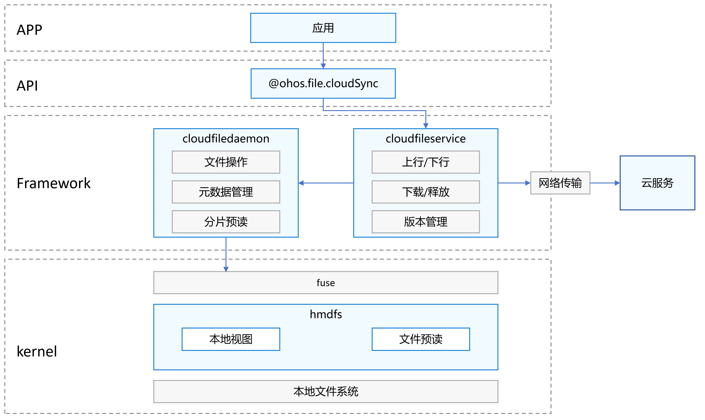

# 端云文件协同概述
<!--Kit: Core File Kit-->
<!--Subsystem: FileManagement-->
<!--Owner: @zsyztt; @Hermits; @reminder2352-->
<!--Designer: @yunlanying-->
<!--Tester: @liuhonggang123-->
<!--Adviser: @foryourself-->

端云文件协同为应用开发提供端云一体的统一文件系统能力，为用户和应用提供一致的文件同步与跨端访问体验。

作为系统级平台能力，端云协同提供标准化接入接口与封装好的核心能力（同步、下载、版本管理等），帮助应用以极低接入成本快速集成，同时保障用户侧体验的一致性及数据的可靠性。

## 能力范围

- 全维度同步上云：支持文件内容修改（如编辑、更新）与元数据修改（如重命名）的双向同步。文件发生变更后，系统会自动触发云端同步流程。同时，通过回调接口将同步状态（成功/失败/进度）实时通知给应用，确保端云数据的一致性。
  - 节省空间：文件实体全量存储于云端，本地仅保留文件元数据（名称、类型、大小、修改时间），大幅释放设备本地存储空间，避免冗余文件占用。
  - 无缝体验：文件的打开、编辑、删除、重命名等操作，完全复刻本地文件操作逻辑，同步流程后台自动执行，用户无需感知上行和下行过程，体验无缝衔接。
  - 断点续传：文件上传过程中遭遇网络中断、设备离线等异常时，系统自动记录已上传分片进度，网络恢复后从断点处继续上传，无需重复传输，节省数据流量与时间。
  - 增量上传：本地文件发生修改时，仅对变化部分（新增 / 修改的文件分片）进行上传，无需传输完整文件，大幅提升上传效率，减少带宽占用。
  - 极速同步：连续上传同一文件（或文件内容未发生变化）时，云端通过文件唯一标识快速校验已存储文件，直接复用云端已有资源完成同步，无需实际传输文件数据，实现快速上传。

- 灵活的文件下载能力：提供云上文件的单点下载（指定单个文件精准下载）与批量下载（多选文件或文件夹打包下载）功能，适配不同业务场景下的文件获取需求。
  - 断点下载：文件下载时若遇网络波动或主动暂停，支持保留已下载分片数据，再次下载时直接接续未完成部分，避免全量重下，降低流量损耗。
  - 差分下载：当其他设备修改并同步文件后，本端仅下载文件的变化分片（而非完整文件），缩短下载耗时，降低流量成本，同步更高效。

- 全生命周期版本管理：支持端侧与云侧文件版本的全流程管理，包括版本创建（同步时自动生成新版本）、版本查询（获取历史版本列表与详情），满足文件修改追溯与数据安全需求。

## 适用场景

- 用户场景
  - 图库照片备份
  - 云盘文件管理
  - 应用文件云存储

- 应用场景
  - 云文件多端协同编辑
  - 云文件多端同步流转

## 实现原理

针对应用开发者，端云文件协同提供文件的上传和下载同步、单点下载与批量下载等核心能力接口，应用只需将待上云的文件放在沙箱目录```/data/sotrage/el2/cloud```下，即可自动完成文件的上云，其余基础文件操作接口，请参考[应用文件访问与管理](app-file-access.md)开发指南。

该能力基于系统级服务构建，由 cloudfiledaemon 进程提供基础文件操作、元数据管理、分片预读等核心功能；cloudfileservice 进程则在后台自动与云端服务进行交互，根据业务需求变化触发并完成文件上下行，文件下载，同时也提供了接口支持版本管理和主动触发同步任务。



## 基本概念

- cloudfiledaemon：端云文件守护进程，为接入云的应用提供端云文件的基本文件操作、元数据管理和分片预读等能力。
- cloudfileservice：端云同步服务进程，为接入云的应用提供完成端云文件的上下行、文件下载和版本管理等能力。
- fuse：一种允许非特权用户在用户空间实现的文件系统，通过在内核中提供一个通用的 VFS（虚拟文件系统）桥接模块，将文件系统操作转发到用户空间的进程，由用户程序实现具体的逻辑。
- hmdfs：分布式文件系统，在内核中为端云文件协同提供了文件预读、本地视图的能力。
- 元数据管理：支持本地只保留文件名、文件大小和时间戳等基本元数据信息，端云文件守护进程支持对这些基本信息进行管理。
- 分片预读：文件预读的一种精细化策略，将读取请求划分为多个逻辑分片，按需或按优先级异步预加载特定分片，进一步优化IO性能及带宽利用率。
- 文件预读：一种 I/O 优化技术，在用户尚未显式请求后续数据之前，hmdfs会根据读取文件区间提前将后续的部分内容加载到内存中，以减少后续读取时的延迟。
- 本地视图：当前设备本地文件系统中的目录结构与文件列表，反映的是用户所在主机上的实际存储状态，所有操作（如浏览、创建、删除、重命名等）直接作用于本地磁盘。
