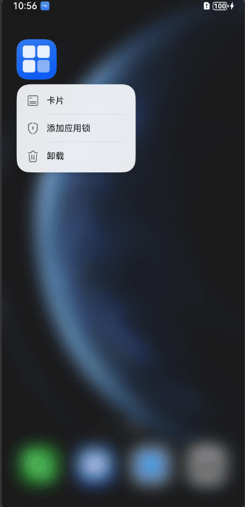

# ArkTS卡片主动刷新
<!--Kit: Form Kit-->
<!--Subsystem: Ability-->
<!--Owner: @cx983299475-->
<!--Designer: @xueyulong-->
<!--Tester: @yangyuecheng-->
<!--Adviser: @HelloShuo-->

本文主要提供主动刷新的开发指导，刷新流程请参考[主动刷新概述](./arkts-ui-widget-interaction-overview.md#主动刷新)。

## 卡片提供方主动刷新卡片内容
卡片提供方可以通过[updateForm](../reference/apis-form-kit/js-apis-app-form-formProvider.md#formproviderupdateform)接口进行主动刷新。推荐与卡片生命周期回调[onFormEvent](../reference/apis-form-kit/js-apis-app-form-formExtensionAbility.md#formextensionabilityonformevent)、[onUpdateForm](../reference/apis-form-kit/js-apis-app-form-formExtensionAbility.md#formextensionabilityonupdateform)、[onAddForm](../reference/apis-form-kit/js-apis-app-form-formExtensionAbility.md#formextensionabilityonaddform)接口搭配使用。

### 开发步骤
下面给出一个示例，实现如下功能：卡片添加至桌面后，点击卡片上的刷新按钮，刷新卡片信息。
1. [创建卡片](./arkts-ui-widget-creation.md)。

2. 实现卡片布局，在卡片上添加一个刷新按钮，点击按钮后通过[postCardAction](../reference/apis-arkui/js-apis-postCardAction.md#postcardaction-1)接口，触发onFormEvent回调。

   <!-- @[update_by_message_card](https://gitcode.com/openharmony/applications_app_samples/blob/master/code/DocsSample/ApplicationModels/StageServiceWidgetCards/entry/src/main/ets/updatebymessage/pages/UpdateByMessageCard.ets) --> 
    
    ``` TypeScript
    // entry/src/main/ets/updatebymessage/pages/UpdateByMessageCard.ets
    let storageUpdateByMsg = new LocalStorage();
    
    @Entry(storageUpdateByMsg)
    @Component
    struct UpdateByMessageCard {
      // $r('app.string.default_title')和$r('app.string.DescriptionDefault')需要替换为开发者所需的资源文件
      @LocalStorageProp('title') title: ResourceStr = $r('app.string.default_title');
      @LocalStorageProp('detail') detail: ResourceStr = $r('app.string.DescriptionDefault');
    
      build() {
        Column() {
          Column() {
            Text(this.title)
              .fontColor('#FFFFFF')
              .opacity(0.9)
              .fontSize(14)
              .margin({ top: '8%', left: '10%' })
            Text(this.detail)
              .fontColor('#FFFFFF')
              .opacity(0.6)
              .fontSize(12)
              .margin({ top: '5%', left: '10%' })
          }.width('100%').height('50%')
          .alignItems(HorizontalAlign.Start)
    
          Row() {
            // ...
            Button() {
              // $r('app.string.update')需要替换为开发者所需的资源文件
              Text($r('app.string.update'))
                .fontColor('#45A6F4')
                .fontSize(12)
            }
            .width(120)
            .height(32)
            .margin({ top: '30%', bottom: '10%' })
            .backgroundColor('#FFFFFF')
            .borderRadius(16)
            .onClick(() => {
              postCardAction(this, {
                action: 'message',
                params: { msgTest: 'messageEvent' }
              });
            })
          }.width('100%').height('40%')
          .justifyContent(FlexAlign.Center)
        }
        .width('100%')
        .height('100%')
        .alignItems(HorizontalAlign.Start)
        // $r('app.media.CardEvent')需要替换为开发者所需的资源文件
        .backgroundImage($r('app.media.CardEvent'))
        .backgroundImageSize(ImageSize.Cover)
      }
    }
    ```

3. 在onFormEvent回调函数的实现中，通过updateForm接口刷新卡片数据。

   <!-- @[update_by_message_form_ability](https://gitcode.com/openharmony/applications_app_samples/blob/master/code/DocsSample/ApplicationModels/StageServiceWidgetCards/entry/src/main/ets/entryformability/EntryFormAbility.ts) --> 
   
   ``` TypeScript
   // entry/src/main/ets/entryformability/EntryFormAbility.ts
   import { formBindingData, FormExtensionAbility, formInfo, formProvider } from '@kit.FormKit';
   import { Configuration, Want } from '@kit.AbilityKit';
   import { BusinessError } from '@kit.BasicServicesKit';
   import { hilog } from '@kit.PerformanceAnalysisKit';
   
   // entry/src/main/ets/entryformability/EntryFormAbility.ts
   const TAG: string = 'EntryFormAbility';
   const DOMAIN_NUMBER: number = 0xFF00;
   
   export default class EntryFormAbility extends FormExtensionAbility {
     onAddForm(want: Want): formBindingData.FormBindingData {
       hilog.info(DOMAIN_NUMBER, TAG, '[EntryFormAbility] onAddForm');
       hilog.info(DOMAIN_NUMBER, TAG, want.parameters?.[formInfo.FormParam.NAME_KEY] as string);
       // 卡片使用方创建卡片时触发，卡片提供方需要返回卡片数据绑定类
       let obj: Record<string, string> = {
         'title': 'titleOnAddForm',
         'detail': 'detailOnAddForm'
       };
       let formData: formBindingData.FormBindingData = formBindingData.createFormBindingData(obj);
       return formData;
     }
   
     onCastToNormalForm(formId: string): void {
       // ...
       hilog.info(DOMAIN_NUMBER, TAG, '[EntryFormAbility] onCastToNormalForm');
     }
   
     onUpdateForm(formId: string): void {
       // ...
       hilog.info(DOMAIN_NUMBER, TAG, '[EntryFormAbility] onUpdateForm');
       // ...
     }
   
     onChangeFormVisibility(newStatus: Record<string, number>): void {
       // ...
       hilog.info(DOMAIN_NUMBER, TAG, '[EntryFormAbility] onChangeFormVisibility');
     }
   
     onFormEvent(formId: string, message: string): void {
       // ...
       hilog.info(DOMAIN_NUMBER, TAG, `FormAbility onFormEvent, formId = ${formId}, message: ${message}`);
       class FormDataClass {
         title: string = 'Title Update.'; // 和卡片布局中对应
         detail: string = 'Description update success.'; // 和卡片布局中对应
       }
       // ...
       let formData = new FormDataClass();
       let formInfo: formBindingData.FormBindingData = formBindingData.createFormBindingData(formData);
       formProvider.updateForm(formId, formInfo).then(() => {
         hilog.info(DOMAIN_NUMBER, TAG, 'FormAbility updateForm success.');
       }).catch((error: BusinessError) => {
         hilog.error(DOMAIN_NUMBER, TAG, `Operation updateForm failed. Cause: ${JSON.stringify(error)}`);
       });
     }
   
     onRemoveForm(formId: string): void {
       // ...
       hilog.info(DOMAIN_NUMBER, TAG, '[EntryFormAbility] onRemoveForm');
       // ...
     }
   
     onConfigurationUpdate(config: Configuration) {
       // ...
       hilog.info(DOMAIN_NUMBER, TAG, '[EntryFormAbility] onConfigurationUpdate:' + JSON.stringify(config));
     }
   
     onAcquireFormState(want: Want): formInfo.FormState {
       // ...
       return formInfo.FormState.READY;
     }
   }
   ```

4. 资源文件如下。
   ```ts
   // entry/src/main/resources/zh_CN/element/string.json
   {
      "string": [
   	  // ...
   	    {
   	      "name": "default_title",
   	      "value": "Title default."
   	    },
   	    {
   	      "name": "DescriptionDefault",
   	      "value": "Description default."
   	    },
   	    {
   	      "name": "update",
   	      "value": "刷新"
   	    }
      ]
   }
   ```
### 运行结果


## 卡片提供方批量请求刷新卡片内容
从API version 22开始，支持卡片提供方批量请求刷新卡片内容。卡片提供方可以通过[reloadForms](../reference/apis-form-kit/js-apis-app-form-formProvider.md#formproviderreloadforms22)和[reloadAllForms](../reference/apis-form-kit/js-apis-app-form-formProvider.md#formproviderreloadallforms22)接口在应用主进程中通知FormExtension进程进行批量更新，仅支持在[UIAbility](../reference/apis-ability-kit/js-apis-app-ability-uiAbility.md)中调用。

### 开发步骤
下面给出一个示例，实现如下功能：添加应用的多张卡片至桌面后，点击应用UIAbility中的刷新按钮，批量刷新卡片信息。
1. [创建卡片](./arkts-ui-widget-creation.md)。

2. 实现卡片布局，在卡片上创建两个待刷新的Text。

   <!-- @[ReloadByUIAbilityCard](https://gitcode.com/openharmony/applications_app_samples/blob/master/code/DocsSample/Form/ReloadFormsDoc/entry/src/main/ets/reloadbyuiability/pages/ReloadByUIAbilityCard.ets) --> 
   
   ``` TypeScript
   // entry/src/main/ets/reloadbyuiability/pages/ReloadByUIAbilityCard.ets
   let storageReloadForm = new LocalStorage();
   
   @Entry(storageReloadForm)
   @Component
   struct ReloadByUIAbilityCard {
     // 创建两个待刷新的Text，Text初始内容分别为'Title default'、'Description default'。资源文件定义请参见下方步骤5
     @LocalStorageProp('title') title: ResourceStr = $r('app.string.default_title');
     @LocalStorageProp('detail') detail: ResourceStr = $r('app.string.DescriptionDefault');
   
     build() {
       Column() {
         Column() {
           Text(this.title)
             .fontSize(14)
             .margin({ top: '8%', left: '10%' })
           Text(this.detail)
             .fontSize(12)
             .margin({ top: '5%', left: '10%' })
         }.width('100%').height('50%')
         .alignItems(HorizontalAlign.Start)
       }
       .width('100%')
       .height('100%')
       .alignItems(HorizontalAlign.Start)
     }
   }
   ```

3. 在FormExtensionAbility中实现onUpdateForm回调，通过updateForm接口定义卡片刷新逻辑。

   <!-- @[EntryFormAbility](https://gitcode.com/openharmony/applications_app_samples/blob/master/code/DocsSample/Form/ReloadFormsDoc/entry/src/main/ets/entryformability/EntryFormAbility.ets) --> 
   
   ``` TypeScript
   // entry/src/main/ets/entryformability/EntryFormAbility.ets
   import { formBindingData, FormExtensionAbility, formInfo, formProvider } from '@kit.FormKit';
   import { Want } from '@kit.AbilityKit';
   import { BusinessError } from '@kit.BasicServicesKit';
   import { hilog } from '@kit.PerformanceAnalysisKit';
   
   const TAG: string = 'EntryFormAbility';
   const DOMAIN_NUMBER: number = 0xFF00;
   
   export default class EntryFormAbility extends FormExtensionAbility {
     onAddForm(want: Want) {
       const formData = '';
       return formBindingData.createFormBindingData(formData);
     }
   
     onCastToNormalForm(formId: string): void {
       hilog.info(DOMAIN_NUMBER, TAG, '[EntryFormAbility] onCastToNormalForm');
     }
   
     onUpdateForm(formId: string) {
   
       class FormDataClass {
         title: string = 'Title: ' + Math.random();
         detail: string = 'Description: ' + Math.random();
       }
   
       let formData = new FormDataClass();
       let formInfo: formBindingData.FormBindingData = formBindingData.createFormBindingData(formData);
       formProvider.updateForm(formId, formInfo).then(() => {
         hilog.info(DOMAIN_NUMBER, TAG, 'FormAbility updateForm success.');
       }).catch((error: BusinessError) => {
         hilog.error(DOMAIN_NUMBER, TAG, `Operation updateForm failed. code: ${error.code}, message: ${error.message}`);
       });
     }
   
     onFormEvent(formId: string, message: string) {
       hilog.info(DOMAIN_NUMBER, TAG, '[EntryFormAbility] onFormEvent');
     }
   
     onRemoveForm(formId: string) {
       hilog.info(DOMAIN_NUMBER, TAG, '[EntryFormAbility] onRemoveForm');
     }
   
     onAcquireFormState(want: Want) {
       hilog.info(DOMAIN_NUMBER, TAG, '[EntryFormAbility] onAcquireFormState');
       return formInfo.FormState.READY;
     }
   }
   ```

4. 在UIAbility的界面中添加两个批量刷新按钮，点击按钮后通过reloadForms或reloadAllForms接口，批量触发FormExtensionAbility中的onUpdateForm回调。

   <!-- @[index](https://gitcode.com/openharmony/applications_app_samples/blob/master/code/DocsSample/Form/ReloadFormsDoc/entry/src/main/ets/pages/Index.ets) --> 
   
   ``` TypeScript
   // entry/src/main/ets/pages/index.ets
   import { common } from '@kit.AbilityKit';
   import { BusinessError } from '@kit.BasicServicesKit';
   import { formProvider } from '@kit.FormKit';
   
   @Entry
   @Component
   struct Index {
     build() {
       Column({ space: 20 }) {
         Button('reloadForms')
           .onClick(() => {
             try {
               let context: common.UIAbilityContext = this.getUIContext().getHostContext() as common.UIAbilityContext;
               let moduleName: string = 'entry';
               let abilityName: string = 'EntryFormAbility';
               let formName: string = 'reloadByUIAbilityCard';
               formProvider.reloadForms(context, moduleName, abilityName, formName).then((reloadNum: number) => {
                 console.info(`reloadForms success, reload number: ${reloadNum}`);
               }).catch((error: BusinessError) => {
                 console.error(`promise error, code: ${error.code}, message: ${error.message})`);
               });
             } catch (error) {
               console.error(`catch error, code: ${(error as BusinessError).code}, message: ${(error as BusinessError).message})`);
             }
           })
         Button('reloadAllForms')
           .onClick(() => {
             try {
               let context: common.UIAbilityContext = this.getUIContext().getHostContext() as common.UIAbilityContext;
               formProvider.reloadAllForms(context).then((reloadNum: number) => {
                 console.info(`reloadAllForms success, reload number: ${reloadNum}`);
               }).catch((error: BusinessError) => {
                 console.error(`promise error, code: ${error.code}, message: ${error.message})`);
               });
             } catch (error) {
               console.error(`catch error, code: ${(error as BusinessError).code}, message: ${(error as BusinessError).message})`);
             }
           })
       }
       .height('100%')
       .width('100%')
       .justifyContent(FlexAlign.Center)
     }
   }
   ```

5. 资源文件如下。

   ```json
   // entry/src/main/resources/base/element/string.json
   {
      "string": [
   	  // ...
   	    {
   	      "name": "default_title",
   	      "value": "Title default."
   	    },
   	    {
   	      "name": "DescriptionDefault",
   	      "value": "Description default."
   	    }
      ]
   }
   ```
### 运行结果


<!--Del-->
## 卡片使用方主动刷新卡片内容（仅对系统应用开放）

由于定时、定点刷新存在时间限制，卡片使用方可以通过调用[requestForm](../reference/apis-form-kit/js-apis-app-form-formHost-sys.md#requestform)接口向卡片管理服务请求主动触发卡片的刷新。卡片管理服务触发卡片提供方FormExtensionAbility中的[onUpdateForm](../reference/apis-form-kit/js-apis-app-form-formExtensionAbility.md#formextensionabilityonupdateform)生命周期回调，回调中可以使用[updateForm](../reference/apis-form-kit/js-apis-app-form-formProvider.md#formproviderupdateform)接口刷新卡片内容。

   <!-- @[FormUpdate_page](https://gitcode.com/openharmony/applications_app_samples/blob/master/code/DocsSample/Form/FormUpdateDemo/entry/src/main/ets/pages/Index.ets) --> 
   
   ``` TypeScript
   import { formHost } from '@kit.FormKit';
   import { BusinessError } from '@kit.BasicServicesKit';
   import { hilog } from '@kit.PerformanceAnalysisKit';
   
   const TAG: string = 'EntryFormAbility';
   const DOMAIN_NUMBER: number = 0xFF00;
   let storage = new LocalStorage();
   
   @Entry(storage)
   @Component
   struct Index {
     @State formId: string = '0';
   
     build() {
       Column() {
         Column() {
           FormComponent({
             id: 0,
             name: 'widget',
             bundle: 'com.samples.formupdatedemo', // 请开发者替换为实际的bundlename
             ability: 'EntryFormAbility',
             module: 'entry',
             dimension: 2,
             temporary: false,
           })
             .size({
               width:200,
               height:200,
             })
             .borderColor(Color.Black)
             .borderRadius(10)
             .borderWidth(1)
             .onAcquired((form: FormCallbackInfo) => {
               hilog.info(DOMAIN_NUMBER, TAG, `onAcquired: ${JSON.stringify(form)}`)
               this.formId = form.id.toString();
             })
             .onRouter(() => {
               hilog.info(DOMAIN_NUMBER, TAG, `onRouter`)
             })
             .onError((error) => {
               hilog.error(DOMAIN_NUMBER, TAG, `onError: ${JSON.stringify(error)}`)
             })
           // ...
           Button($r('app.string.button_update'))
             .onClick(() => {
               hilog.info(DOMAIN_NUMBER, TAG, `click to check requestForm, formId: ${this.formId}`);
               // formId需要为实际需要刷新的卡片ID
               if (this.formId != null) {
                 formHost.requestForm(this.formId).then(() => {
                   hilog.info(DOMAIN_NUMBER, TAG, 'EntryFormAbility requestForm success.');
                 }).catch((error: BusinessError) => {
                   hilog.error(DOMAIN_NUMBER, TAG, `EntryFormAbility requestForm fail, code: ${error?.code}, message: ${error?.message}`);
                   hilog.error(DOMAIN_NUMBER, TAG, `EntryFormAbility requestForm fail, code: ${this.formId}`);
                 })
               }
             })
             .margin(5)
             .width('50%')
         }
         .width('100%')
         .height('100%')
       }
       .width('100%')
       .height('100%')
     }
   }
   ```

<!--DelEnd-->