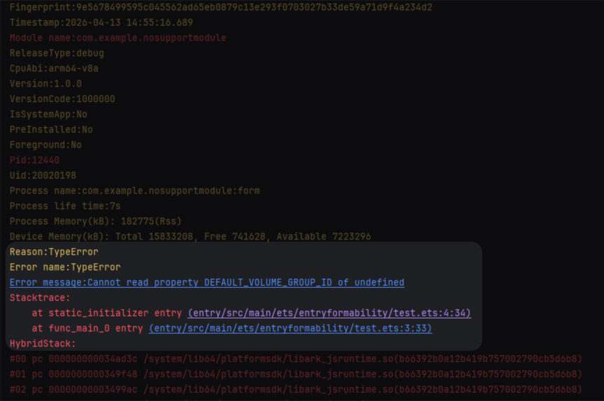

# ArkTS卡片适配常见问题
<!--Kit: Form Kit-->
<!--Subsystem: Ability-->
<!--Owner: @Qian-Win-->
<!--Designer: @cx983299475-->
<!--Tester: @mahailong123456-->
<!--Adviser: @HelloShuo-->

## ArkTS卡片开发是否支持V2装饰器？如何从V1到V2迁移？

ArkTS卡片开发支持V2装饰器语法(如[\@ObservedV2](../ui/state-management/arkts-new-observedV2-and-trace.md)、[\@ComponentV2](../ui/state-management/arkts-create-custom-components.md#componentv2))，建议开发者使用V2装饰器替代V1语法进行状态管理，以获得更优的组件渲染性能和状态同步能力。

完整的语法差异对比、迁移步骤及示例代码，请参见官方文档: [V1->V2迁移指导概述](../ui/state-management/arkts-v1-v2-migration.md)。

<!--RP1--><!--RP1End-->

## ArkTS卡片如何适配深浅色模式？
当前系统存在深浅色两种显示模式，为了给用户更好的使用体验，保障卡片与页面视觉体验一致性，ArkTS卡片支持适配深浅色模式，具体请参考[应用深浅色适配](../ui/ui-dark-light-color-adaptation.md)。

## 导入particleAbility、audio、camera、media、backgroundTaskManager模块导致应用崩溃问题。

### 问题现象
导入particleAbility、audio、camera、media、backgroundTaskManager后应用崩溃，FaultLog指向相关调用行。 
 
报错对应的代码行如下： 

### 原因
ArkTS卡片的FormExtensionAbility不支持加载上述模块，参考[@ohos.app.form.FormExtensionAbility](../reference/apis-form-kit/js-apis-app-form-formExtensionAbility.md)。强行加载得到的对象是undefined，使用时就会产生JS crash。

### 解决措施
检查 FormExtensionAbility 的导入链，将涉及上述模块的文件与 ArkTS 卡片使用的文件拆分，避免被 FormExtensionAbility 加载。

