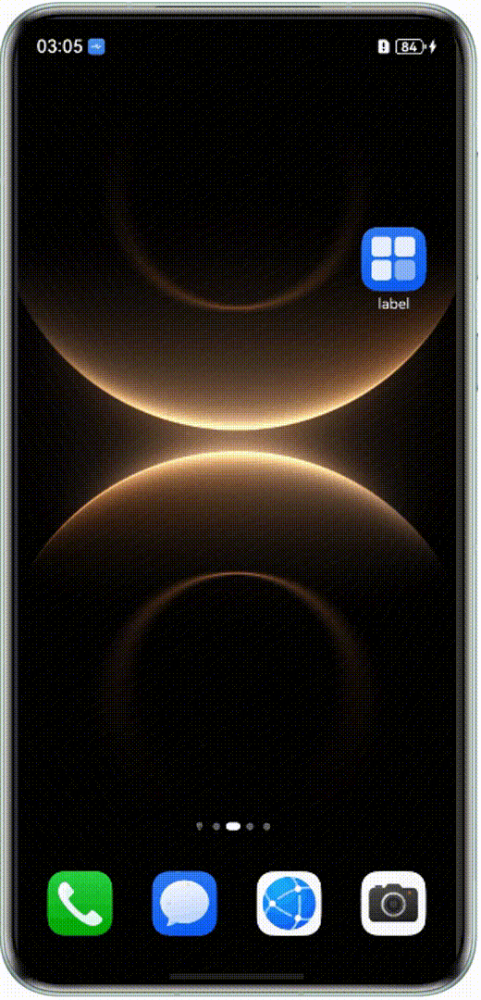

# ArkTS卡片新材质适配（仅对系统应用开放）
<!--Kit: Form Kit-->
<!--Subsystem: Ability-->
<!--Owner: @cx983299475-->
<!--Designer: @xueyulong-->
<!--Tester: @yangyuecheng-->
<!--Adviser: @HelloShuo-->

从API version 23开始，Form Kit支持系统应用使用新材质，提供炫彩透光视觉效果，提升用户体验。

> **说明：**
>
> 本特性对产品功耗、性能要求较高，当前仅在部分旗舰机型上支持，不支持机型上调用后不生效。

## ArkTS卡片新材质内容
主要是对ArkTS卡片的内容生效，为了达到最佳的显示效果，建议在透明卡片（`transparencyEnabled`字段配置为`true`的卡片）上使用。

### 开发步骤
1. [创建ArkTS卡片](arkts-ui-widget-creation.md)。
2. 配置`entry/src/main/resources/base/profile/form_config.json`文件。在form_config.json文件中的`metadata`添加`visualEffectType`配置，`immersiveMaterial`表示新材质。

   ``` json
   {
     "forms": [
       {
         "name": "widget",
         "displayName": "$string:widget_display_name",
         "description": "$string:widget_desc",
         "src": "./ets/widget/pages/WidgetCard.ets",
         "uiSyntax": "arkts",
         "window": {
           "designWidth": 720,
           "autoDesignWidth": true
         },
         "colorMode": "auto",
         "isDynamic": true,
         "isDefault": true,
         "updateEnabled": false,
         "scheduledUpdateTime": "10:30",
         "updateDuration": 1,
         "defaultDimension": "2*4",
         "transparencyEnabled": true,
         "metadata": [
           {
             "name": "visualEffectType",
             "value": "immersiveMaterial"
           }
         ],
         "supportDimensions": [
           "2*4"
         ]
       }
     ]
   }
   ```

3. 完整卡片代码实现

   > **说明：**
   >
   > - 这里需要注意使用系统应用证书进行签名打包。

   `entry/src/main/ets/widget/pages/WidgetCard.ets`完整代码。

   ``` TypeScript
   import  {hdsMaterial}  from '@hms.hds.hdsMaterial';

   @Entry
   @ComponentV2
   struct WidgetCard {
     build() {
       Stack() {
         Column() {
           // 使用场景枚举调用
           Button('hdsMaterial button', {buttonStyle: ButtonStyleMode.NORMAL})
             .width(300)
             .height(80)
             .systemMaterial(new hdsMaterial.Material({
               backgroundMaterial: {
                 type: hdsMaterial.MaterialType.IMMERSIVE,   // 材质类型:沉浸式材质
                 scenario: hdsMaterial.ScenarioType.GENERAL, // 场景:通用
                 level: hdsMaterial.MaterialLevel.ADAPTIVE   // 材质分档:自适应 
               }
             }))
             .margin({top: 10})
         }
         .height('100%')
         .width('100%')
       }
     }
   }
   ```

### 运行结果


## ArkTS卡片新材质背板
该特性仅对ArkTS卡片的背板生效。

### 约束限制
透明卡片（`transparencyEnabled`字段配置为`true`的卡片）不支持配置新材质背板。透明卡片配置的新材质背板不会生效。

### 开发步骤
1. [创建ArkTS卡片](arkts-ui-widget-creation.md)。
2. 配置`entry/src/main/resources/base/profile/form_config.json`文件。在form_config.json文件中的`metadata`配置项添加`name`为`materialBackground`字段。`value`为`true`表示卡片需要生效新材质背板，`false`表示不需要，默认值为`false`。

   ```json
   {
     "forms": [
       {
         "name": "widget",
         "displayName": "$string:widget_display_name",
         "description": "$string:widget_desc",
         "src": "./ets/widget/pages/WidgetCard.ets",
         "uiSyntax": "arkts",
         "window": {
           "designWidth": 720,
           "autoDesignWidth": true
         },
         "colorMode": "auto",
         "isDynamic": true,
         "isDefault": true,
         "updateEnabled": false,
         "scheduledUpdateTime": "10:30",
         "updateDuration": 1,
         "defaultDimension": "2*2",
         "supportDimensions": [
           "2*2"
         ],
         "metadata": [
           {
             "name": "materialBackground",
             "value": "true"
           }
         ]
       }
     ]
   }
   ```
3. `entry/src/main/ets/entryformability/EntryFormAbility.ets`文件适配。配置了新材质背板之后，[onAddForm](../reference/apis-form-kit/js-apis-app-form-formExtensionAbility.md#formextensionabilityonaddform)和[onUpdateform](../reference/apis-form-kit/js-apis-app-form-formExtensionAbility.md#formextensionabilityonupdateform)接口会带`ohos.extra.param.key.form_enable_material_background`字段。该字段信息需要传入到卡片页面里面来决定是否设置卡片背景色。
   ```TypeScript
   import { formBindingData, FormExtensionAbility, formInfo, formProvider } from '@kit.FormKit';
   import { Want } from '@kit.AbilityKit';
   
   export default class EntryFormAbility extends FormExtensionAbility {
     onAddForm(want: Want) {
       console.info('enter onAddForm.')
       let param: Record<string, boolean> = {};
       if (want?.parameters?.['ohos.extra.param.key.form_enable_material_background'] !== undefined) {
         // 需要设置背板透明或者还原为默认色
         param['isEnableMaterialBgr'] =
           Boolean(want.parameters.['ohos.extra.param.key.form_enable_material_background']);
       }
       return formBindingData.createFormBindingData(param);
     }
   
     onUpdateForm(formId: string, wantParams?: Record<string, Object>) {
       let param: Record<string, boolean> = {};
       if (wantParams?.['ohos.extra.param.key.form_enable_material_background'] !== undefined) {
         // 需要设置背板透明或者还原为默认色
         param['isEnableMaterialBgr'] = Boolean(wantParams.['ohos.extra.param.key.form_enable_material_background']);
       }
       let formInfo: formBindingData.FormBindingData = formBindingData.createFormBindingData(param);
       formProvider.updateForm(formId, formInfo).then(() => {
         console.info(`onUpdateForm formId: ${formId}`);
       }).catch((error: BusinessError) => {
         console.error(`onUpdateForm failed, formId: ${formId}, code:${error.code}, message:${error.message}`);
       });
     }
   
     onFormEvent(formId: string, message: string) {
   
     }
   
     onRemoveForm(formId: string) {
   
     }
   
     onAcquireFormState(want: Want) {
       return formInfo.FormState.READY;
     }
   }
   ```
4. `entry/src/main/ets/widget/pages/WidgetCard.ets`文件适配。
   ```TypeScript
   @Entry
   @Component
   struct WidgetCard {
     readonly title: string = 'Hello World';
     readonly actionType: string = 'router';
     readonly abilityName: string = 'EntryAbility';
     readonly message: string = 'add detail';
     readonly fullWidthPercent: string = '100%';
     readonly fullHeightPercent: string = '100%';
     @LocalStorageProp('isEnableMaterialBgr') isEnableMaterialBgr: boolean = false;
   
     build() {
       Row() {
         Column() {
           Text(this.title)
             .fontSize($r('app.float.font_size'))
             .fontWeight(FontWeight.Medium)
             .fontColor($r('sys.color.font'))
         }
         .width(this.fullWidthPercent)
       }
       .height(this.fullHeightPercent)
       // this.isEnableMaterialBgr为true代表使能新材质背板，为false表示使用默认背景色
       .backgroundColor(this.isEnableMaterialBgr ? Color.Transparent : $r('sys.color.comp_background_primary'))
       .onClick(() => {
         postCardAction(this, {
           action: this.actionType,
           abilityName: this.abilityName,
           params: {
             message: this.message
           }
         });
       })
     }
   }
   ```
### 运行结果
