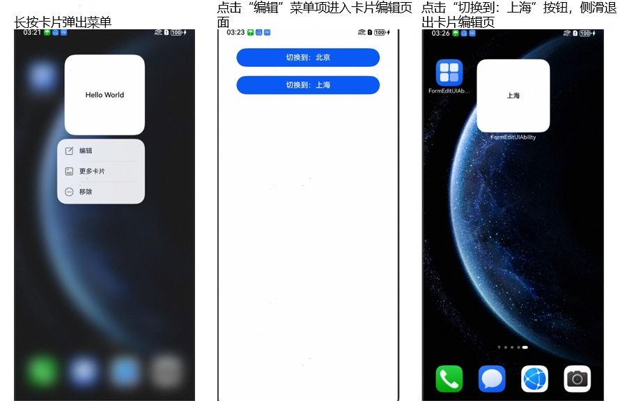
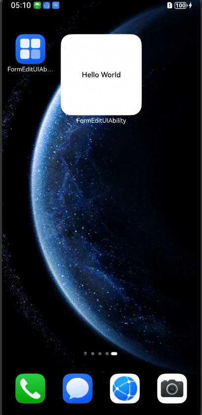

# ArkTS卡片编辑概述
<!--Kit: Form Kit-->
<!--Subsystem: Ability-->
<!--Owner: @Qian-Win-->
<!--Designer: @cx983299475-->
<!--Tester: @mahailong123456-->
<!--Adviser: @HelloShuo-->

ArkTS卡片提供卡片页面编辑能力，支持实现用户自定义卡片内容的功能，例如：编辑联系人卡片、修改卡片中展示的联系人、编辑天气卡片等。

卡片页面编辑分为半模态卡片编辑和全屏卡片编辑两种方式，从API version 18开始，支持半模态卡片编辑。

## 半模态卡片编辑
下面给出一个示例，介绍半模态卡片编辑的使用步骤。
### 实现原理

1. 长按卡片弹出菜单，此时桌面通过[formConfigAbility](./arkts-ui-widget-configuration.md#配置文件字段说明)字段判断卡片是否支持卡片编辑能力来决定是否显示编辑按钮。
2. 点击“编辑”菜单项，桌面通过formConfigAbility中的字段拉起对应的页面，进入一级编辑页。一级编辑页的编辑区域有限，用于比较简单的编辑布局。
    - 预览区：灰色区域为预览区，用于呈现卡片编辑后的效果。预览区的布局是由桌面决定的。
    - 编辑区：白色区域为编辑区，为应用自定义布局区域，用来实现卡片编辑的布局。卡片编辑区的布局由应用继承[FormEditExtensionAbility](../reference/apis-form-kit/js-apis-app-form-formEditExtensionAbility.md)后绘制而成，可用于简单的编辑布局。
    - FormEditDemo：该字段为卡片宿主应用的应用名称，通过[app.json5](../quick-start/app-configuration-file.md#配置文件标签)配置文件中的label字段配置。
    - widget：该字段为卡片名称，通过卡片form_config.json配置文件中的[name](./arkts-ui-widget-configuration.md#配置文件字段说明)字段配置。
    - “完成”按钮：编辑完成之后，点击按钮可退出半模态卡片编辑页面。
3. 在卡片编辑区，点击“切换到：上海”按钮后，卡片提供方可以通过[updateForm](../reference/apis-form-kit/js-apis-app-form-formProvider.md#formproviderupdateform)接口更新卡片信息，并在预览区显示。
4. 在卡片编辑区，点击“进入二级编辑页”按钮，此时卡片通过FormEditExtensionContext提供的[startSecondPage](../reference/apis-form-kit/js-apis-inner-application-formEditExtensionContext.md#startsecondpage)方法，将卡片提供方的二级编辑页信息传递给桌面，桌面拉起对应页面，即进入二级编辑页。二级编辑页主要有用于实现复杂的编辑布局，是否需要二级编辑页请开发者根据实际需求添加。
5. 编辑完成之后退出编辑页。
### 开发步骤
1. [创建卡片](./arkts-ui-widget-creation.md)。
2. 新增EntryFormEditAbility文件，用于实现[FormEditExtensionAbility](../reference/apis-form-kit/js-apis-app-form-formEditExtensionAbility.md)的半模态编辑组件，并在form_config.json文件中配置[formConfigAbility](./arkts-ui-widget-configuration.md#配置文件字段说明)字段。
   - 半模态一级编辑页Ability的实现。
   <!-- @[FormEditDemo_EntryFormEditAbility](https://gitcode.com/openharmony/applications_app_samples/blob/master/code/DocsSample/Form/FormEditDemo/entry/src/main/ets/entryformeditability/EntryFormEditAbility.ets) -->
   
   ``` TypeScript
   // entry/src/main/ets/entryformeditability/EntryFormEditAbility.ets
   import { FormEditExtensionAbility } from '@kit.FormKit';
   import { UIExtensionContentSession, Want } from '@kit.AbilityKit';
   import { ExtensionEvent } from '../model/ExtensionEvent';
   
   const TAG: string = 'FormEditDemo[EntryFormEditAbility] -->';
   let storage: LocalStorage = ExtensionEvent.getStorage();
   
   export default class EntryFormEditAbility extends FormEditExtensionAbility {
     onCreate() {
       console.info(`${TAG} onCreate`);
     }
   
     onForeground(): void {
       console.info(`${TAG} EntryFormEditAbility onForeground.....`);
     }
   
     onBackground(): void {
       console.info(`${TAG} EntryFormEditAbility onBackground......`);
     }
   
     onDestroy(): void {
       console.info(`${TAG} EntryFormEditAbility onDestroy......`);
     }
   
     onSessionCreate(want: Want, session: UIExtensionContentSession) {
       // 获取被编辑卡片的卡片ID和预览卡片的卡片ID，通过storage同步到一级编辑页中
       const formId: string | undefined = want.parameters?.cardId as string;
       const previewFormId: string | undefined = want.parameters?.previewCardId as string;
   
       if (formId) {
         console.info(`${TAG} form id is ${formId}`);
         storage.setOrCreate('formId', formId);
       }
       if (previewFormId) {
         console.info(`${TAG} preview form id is ${previewFormId}`);
         storage.setOrCreate('previewFormId', previewFormId);
       }
       let extensionEvent: ExtensionEvent = new ExtensionEvent();
       extensionEvent.setStartSecondPage((): void => this.startSecondPage());
       storage.setOrCreate('extensionEvent', extensionEvent);
       storage.setOrCreate('context', this.context);
       try {
         // 拉起一级编辑页
         session.loadContent('pages/FormEditExtension', storage);
       } catch (e) {
         console.error(`${TAG} EntryFormEditAbility loadContent err, Code: ${e.code}, Message: ${e.message}`);
       }
     }
   
     onSessionDestroy(session: UIExtensionContentSession) {
       console.info(`${TAG} onSessionDestroy`);
     }
   
     private startSecondPage() {
       const bundleName: string = this.context.extensionAbilityInfo.bundleName;
       const secPageAbilityName: string = 'FormEditSecPageAbility';
       console.info(`${TAG} startSecondPage. bundleName: ${bundleName}, secPageAbilityName: ${secPageAbilityName}.`);
       try {
         // 拉起二级编辑页
         this.context.startSecondPage({
           bundleName: bundleName,
           parameters: {
             'secPageAbilityName': secPageAbilityName
           }
         });
         console.info(`${TAG} startSecondPage success!`);
       } catch (err) {
         console.error(`${TAG} startSecondPage failed, Code: ${err.code}, Message: ${err.message}`);
       }
     }
   };
   ```

   - 半模态二级编辑页Ability的实现。
   <!-- @[FormEditDemo_FormEditSecPageAbility](https://gitcode.com/openharmony/applications_app_samples/blob/master/code/DocsSample/Form/FormEditDemo/entry/src/main/ets/entryformeditability/FormEditSecPageAbility.ets) -->

   - 新增EntryFormEditAbility需要在module.json5配置，配置如下。

   ```json5
   // entry/src/main/module.json5
   {
       "module": {
           // ...
           "extensionAbilities": [
               {
                   // 一级编辑页
                   "name": "EntryFormEditAbility",
                   "srcEntry": "./ets/entryformeditability/EntryFormEditAbility.ets",
                   "type": "formEdit"
               },
               {
                   // 二级编辑页
                   "name": "FormEditSecPageAbility",
                   "srcEntry": "./ets/entryformeditability/FormEditSecPageAbility.ets",
                   "type": "formEdit"
               }
           ]
       }
   }
   ```

   - 卡片form_config.json文件实现。

   ```json5
   // entry/src/main/resources/base/profile/form_config.json
   {
       "forms": [
           {
               "name": "widget",
               "displayName": "$string:widget_display_name",
               "description": "$string:widget_desc",
               "src": "./ets/widget/pages/WidgetCard.ets",
               "uiSyntax": "arkts",
               "formConfigAbility": "ability://EntryFormEditAbility",
               "isDynamic": true,
               "isDefault": true,
               "updateEnabled": false,
               "scheduledUpdateTime": "10:30",
               "multiScheduledUpdateTime": "11:30,16:30",
               "updateDuration": 1,
               "defaultDimension": "1*2",
               "supportDimensions": [
                   "1*2",
                   "2*2",
                   "2*4",
                   "4*4",
                   "6*4"
               ]
           }
       ]
   }
   ```
3. 实现一级编辑页布局，通过[updateForm](../reference/apis-form-kit/js-apis-app-form-formProvider.md#formproviderupdateform)接口去刷新被编辑卡片的信息和预览卡片信息，通过[startSecondPage](../reference/apis-form-kit/js-apis-inner-application-formEditExtensionContext.md#startsecondpage)方法去拉起二级编辑页。
   - 一级编辑页布局实现如下。
   <!-- @[FormEditDemo_FormEditExtension](https://gitcode.com/openharmony/applications_app_samples/blob/master/code/DocsSample/Form/FormEditDemo/entry/src/main/ets/pages/FormEditExtension.ets) --> 


   - 新增FormEditSecPage.ets文件用来实现二级编辑页布局。
   <!-- @[FormEditDemo_FormEditSecPage](https://gitcode.com/openharmony/applications_app_samples/blob/master/code/DocsSample/Form/FormEditDemo/entry/src/main/ets/pages/FormEditSecPage.ets) -->
   
   - 加载布局文件。

       ```json5
       // entry/src/main/resources/base/profile/main_pages.json
       {
           "src": [
               "pages/Index",
               "pages/FormEditExtension",
               "pages/FormEditSecPage"
           ]
       } 
       ```

   - 新增ExtensionEvent文件，封装[startSecondPage](../reference/apis-form-kit/js-apis-inner-application-formEditExtensionContext.md#startsecondpage)方法到startFormEditSecondPage中，供业务使用。
   <!-- @[FormEditDemo_ExtensionEvent](https://gitcode.com/openharmony/applications_app_samples/blob/master/code/DocsSample/Form/FormEditDemo/entry/src/main/ets/model/ExtensionEvent.ets) -->
  

4. 卡片信息持久化。每次进入卡片编辑页，预览卡片都需要与被编辑卡片保持一致，所以需要持久化卡片信息。
   - 新增PreferencesUtil文件，主要是来封装[Preferences](../database/data-persistence-by-preferences.md)首选项，供业务做持久化数据使用。
   <!-- @[FormEditDemo_PreferencesUtil](https://gitcode.com/openharmony/applications_app_samples/blob/master/code/DocsSample/Form/FormEditDemo/entry/src/main/ets/common/PreferencesUtil.ets) -->
   

   - 为确保预览卡片和被编辑卡片信息同步，新建卡片时，在onAddForm回调函数中需要判断'ohos.extra.param.key.edit_form_id'字段是否携带了卡片ID。如果携带了卡片ID，则就是预览卡片则需要从数据库获取被编辑卡片的信息。
     <!-- @[FormEditDemo_EntryFormAbility](https://gitcode.com/openharmony/applications_app_samples/blob/master/code/DocsSample/Form/FormEditDemo/entry/src/main/ets/entryformability/EntryFormAbility.ets) --> 
     

   - 卡片布局文件如下。
     <!-- @[FormEditDemo_WidgetCard](https://gitcode.com/openharmony/applications_app_samples/blob/master/code/DocsSample/Form/FormEditDemo/entry/src/main/ets/widget/pages/WidgetCard.ets) -->


   - 新增CommonData.ets文件，用来定义卡片数据结构。
   <!-- @[FormEditDemo_CommonData](https://gitcode.com/openharmony/applications_app_samples/blob/master/code/DocsSample/Form/FormEditDemo/entry/src/main/ets/common/CommonData.ets) -->
   

5. 资源文件如下。

   ```json5
   // entry/src/main/resources/base/element/string.json
   {
      "string": [
         // ...
         {
            "name": "button_one",
            "value": "切换到：北京"
         },
         {
            "name": "button_two",
            "value": "切换到：上海"
         },
         {
            "name": "button_three",
            "value": "进入编辑二级页"
         }
      ]
    }
    ```

6. 运行效果如下：<br>


## 全屏卡片编辑
### 实现原理

1. 长按卡片弹出菜单。桌面通过[formConfigAbility](./arkts-ui-widget-configuration.md#配置文件字段说明)字段判断卡片是否支持卡片编辑能力来决定是否显示编辑按钮。
2. 点击“编辑”菜单项进入全屏编辑页。桌面通过formConfigAbility字段的信息拉起卡片编辑页。
3. 点击“切换到：上海”按钮编辑卡片内容。提供方通过[updateForm](../reference/apis-form-kit/js-apis-app-form-formProvider.md#formproviderupdateform)接口去更新编辑卡片的信息。
### 开发步骤
下面给出示例，实现如下功能：长按卡片弹出编辑菜单，点击“编辑”菜单项进入全屏编辑页，修改卡片内容。
1. [创建卡片](./arkts-ui-widget-creation.md)。
2. 开发者需要新增EntryEditAbility.ets文件，继承[UIAbility](../reference/apis-ability-kit/js-apis-app-ability-uiAbility.md)组件，实现[onCreate](../reference/apis-ability-kit/js-apis-app-ability-uiAbility.md#oncreate)和[onNewWant](../reference/apis-ability-kit/js-apis-app-ability-uiAbility.md#onnewwant)回调函数。卡片使用方会通过[Want](../reference/apis-ability-kit/js-apis-app-ability-want.md)的parameters字段把被编辑的卡片ID带进来。并且需要在form_config.json文件中配置[formConfigAbility](./arkts-ui-widget-configuration.md#配置文件字段说明)字段。
   - 实现编辑页面的Ability。
   <!-- @[FormEditUIAbility_EntryEditAbility](https://gitcode.com/openharmony/applications_app_samples/blob/master/code/DocsSample/Form/FormEditUIAbility/entry/src/main/ets/entryability/EntryEditAbility.ets) --> 
   
   - 新增EntryEditAbility需要在module.json5配置，配置如下。
   <!-- @[FormEditUIAbility_modulejson5](https://gitcode.com/openharmony/applications_app_samples/blob/master/code/DocsSample/Form/FormEditUIAbility/entry/src/main/module.json5) -->
   

   - 卡片form_config.json文件实现。
   ```json5
   // entry/src/main/resources/base/profile/form_config.json
   {
     "forms": [
       {
         "name": "widget",
         "displayName": "$string:widget_display_name",
         "description": "$string:widget_desc",
         "src": "./ets/widget/pages/WidgetCard.ets",
         "uiSyntax": "arkts",
         "isDynamic": true,
         "isDefault": true,
         "updateEnabled": false,
         "formConfigAbility": "ability://FormEditAbility",
         "scheduledUpdateTime": "10:30",
         "updateDuration": 1,
         "defaultDimension": "2*2",
         "supportDimensions": [
           "2*2"
         ]
       }
     ]
   }
   ```

3. 新增FormEditIndex.ets文件实现全屏编辑页布局，通过[updateForm](../reference/apis-form-kit/js-apis-app-form-formProvider.md#formproviderupdateform)接口去刷新被编辑卡片的信息。
   <!-- @[FormEditUIAbility_FormEditIndex](https://gitcode.com/openharmony/applications_app_samples/blob/master/code/DocsSample/Form/FormEditUIAbility/entry/src/main/ets/pages/FormEditIndex.ets) -->
   

   - 加载全屏编辑页布局文件。
   ```json5
   // entry/src/main/resources/base/profile/main_pages.json
   {
     "src": [
       "pages/Index",
       "pages/FormEditIndex"
     ]
   }
   ```

   - 卡片布局文件如下。
     <!-- @[FormEditUIAbility_WidgetCard](https://gitcode.com/openharmony/applications_app_samples/blob/master/code/DocsSample/Form/FormEditUIAbility/entry/src/main/ets/widget/pages/WidgetCard.ets) -->
     

4. 新增PreferencesUtil文件，主要是来封装[Preferences](../database/data-persistence-by-preferences.md)首选项，供业务做持久化数据使用。
   <!-- @[FormEditUIAbility_PreferencesUtil](https://gitcode.com/openharmony/applications_app_samples/blob/master/code/DocsSample/Form/FormEditUIAbility/entry/src/main/ets/common/PreferencesUtil.ets) -->
   

5. 资源文件如下。
   ```json5
   // entry/src/main/resources/base/element/string.json
   {
     "string": [
       // ...
       {
         "name": "button_one",
         "value": "切换到：北京"
       },
       {
         "name": "button_two",
         "value": "切换到：上海"
       }
     ]
   }
   ```
6. 运行效果如下：<br>
