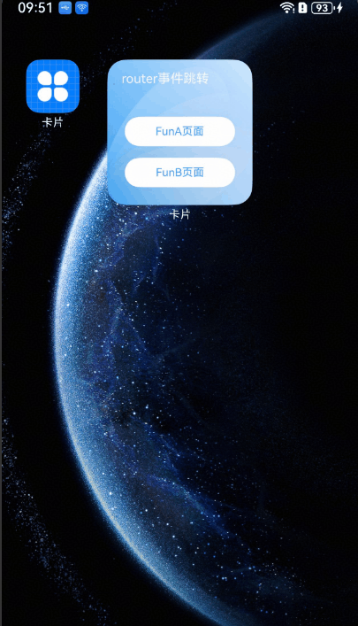

# 卡片跳转到应用页面（router事件）
<!--Kit: Form Kit-->
<!--Subsystem: Ability-->
<!--Owner: @cx983299475-->
<!--Designer: @xueyulong-->
<!--Tester: @chenmingze-->
<!--Adviser: @Brilliantry_Rui-->

在动态卡片中使用[postCardAction](../reference/apis-arkui/js-apis-postCardAction.md#postcardaction-1)接口的router能力，能够快速拉起动态卡片提供方应用的指定UIAbility(页面)，因此UIAbility较多的应用往往会通过卡片提供不同的跳转按钮，实现一键直达的效果。例如相机卡片，卡片上提供拍照、录像等按钮，点击不同按钮将拉起相机应用的不同UIAbility，从而提高用户的体验。


> **说明：**
>
> 本文主要介绍动态卡片的事件开发。对于静态卡片，请参见[FormLink](../reference/apis-arkui/arkui-ts/ts-container-formlink.md)。

## 开发步骤
1. 创建动态卡片，在工程的entry模块中，新建名为WidgetEventRouterCard的ArkTS卡片。

2. 构建ArkTS卡片页面代码布局，卡片页面布局中有两个按钮，点击其中一个按钮时调用postCardAction向指定UIAbility发送router事件，并在事件内定义需要传递的内容。

    <!-- @[widget_event_router_card](https://gitcode.com/openharmony/applications_app_samples/blob/master/code/DocsSample/ApplicationModels/StageServiceWidgetCards/entry/src/main/ets/widgeteventrouter/pages/WidgetEventRouterCard.ets) -->
    
    ``` TypeScript
    // src/main/ets/widgeteventrouter/pages/WidgetEventRouterCard.ets
    @Entry
    @Component
    struct WidgetEventRouterCard {
      build() {
        Column() {
          // $r('app.string.JumpLabel')需要替换为开发者所需的资源文件
          Text($r('app.string.JumpLabel'))
            .fontColor('#FFFFFF')
            .opacity(0.9)
            .fontSize(14)
            .margin({ top: '8%', left: '10%' })
          Row() {
            Column() {
              Button() {
                // $r('app.string.ButtonA_label')需要替换为开发者所需的资源文件
                Text($r('app.string.ButtonA_label'))
                  .fontColor('#45A6F4')
                  .fontSize(12)
              }
              .width(120)
              .height(32)
              .margin({ top: '20%' })
              .backgroundColor('#FFFFFF')
              .borderRadius(16)
              .onClick(() => {
                postCardAction(this, {
                  action: 'router',
                  abilityName: 'EntryAbility',
                  params: { targetPage: 'funA' }
                });
              })
    
              Button() {
                // $r('app.string.ButtonB_label')需要替换为开发者所需的资源文件
                Text($r('app.string.ButtonB_label'))
                  .fontColor('#45A6F4')
                  .fontSize(12)
              }
              .width(120)
              .height(32)
              .margin({ top: '8%', bottom: '15vp' })
              .backgroundColor('#FFFFFF')
              .borderRadius(16)
              .onClick(() => {
                postCardAction(this, {
                  action: 'router',
                  abilityName: 'EntryAbility',
                  params: { targetPage: 'funB' }
                });
              })
            }
          }.width('100%').height('80%')
          .justifyContent(FlexAlign.Center)
        }
        .width('100%')
        .height('100%')
        .alignItems(HorizontalAlign.Start)
        // $r('app.media.CardEvent')需要替换为开发者所需的资源文件
        .backgroundImage($r('app.media.CardEvent'))
        .backgroundImageSize(ImageSize.Cover)
      }
    }
    ```

3. 处理router事件，在UIAbility中接收router事件并获取参数，根据传递的params不同，选择拉起不同的页面。
  
    <!-- @[entry_ability](https://gitcode.com/openharmony/applications_app_samples/blob/master/code/DocsSample/ApplicationModels/StageServiceWidgetCards/entry/src/main/ets/entryability/EntryAbility.ts) -->
    
    ``` TypeScript
    // src/main/ets/entryability/EntryAbility.ts
    import { AbilityConstant, UIAbility, Want } from '@kit.AbilityKit';
    import { window } from '@kit.ArkUI';
    import { hilog } from '@kit.PerformanceAnalysisKit';
    
    const TAG: string = 'EntryAbility';
    const DOMAIN_NUMBER: number = 0xFF00;
    
    export default class EntryAbility extends UIAbility {
      private selectPage: string = 'funA';
      private currentWindowStage: window.WindowStage | null = null;
    
      onCreate(want: Want, launchParam: AbilityConstant.LaunchParam): void {
        // 获取router事件中传递的targetPage参数
        hilog.info(DOMAIN_NUMBER, TAG, `Ability onCreate, ${JSON.stringify(want)}`);
        if (want?.parameters?.params) {
          // want.parameters.params 对应 postCardAction() 中 params 内容
          let params: Record<string, Object> = JSON.parse(want.parameters.params as string);
          this.selectPage = params.targetPage as string;
          hilog.info(DOMAIN_NUMBER, TAG, `onCreate selectPage: ${this.selectPage}`);
        }
      }
    
      // 如果UIAbility已在后台运行，在收到Router事件后会触发onNewWant生命周期回调
      onNewWant(want: Want, launchParam: AbilityConstant.LaunchParam): void {
        hilog.info(DOMAIN_NUMBER, TAG, `onNewWant Want: ${JSON.stringify(want)}`);
        if (want?.parameters?.params) {
          // want.parameters.params 对应 postCardAction() 中 params 内容
          let params: Record<string, Object> = JSON.parse(want.parameters.params as string);
          this.selectPage = params.targetPage as string;
          hilog.info(DOMAIN_NUMBER, TAG, `onNewWant selectPage: ${this.selectPage}`);
        }
        if (this.currentWindowStage !== null) {
          this.onWindowStageCreate(this.currentWindowStage);
        }
      }
    
      onWindowStageCreate(windowStage: window.WindowStage): void {
        // Main window is created, set main page for this ability
        let targetPage: string;
        // 根据传递的targetPage不同，选择拉起不同的页面
        switch (this.selectPage) {
          case 'funA':
            targetPage = 'funpages/FunA';
            break;
          case 'funB':
            targetPage = 'funpages/FunB';
            break;
          default:
            targetPage = 'pages/Index';
        }
        if (this.currentWindowStage === null) {
          this.currentWindowStage = windowStage;
        }
        windowStage.loadContent(targetPage, (err, data) => {
          if (err.code) {
            hilog.error(DOMAIN_NUMBER, TAG, 'Failed to load the content. Cause: %{public}s', JSON.stringify(err) ?? '');
            return;
          }
          hilog.info(DOMAIN_NUMBER, TAG, 'Succeeded in loading the content. Data: %{public}s', JSON.stringify(data) ?? '');
        });
      }
    }
    ```

4. 创建跳转后的UIAbility页面，新建FunA.ets和FunB.ets，构建页面布局。

    <!-- @[fun_a](https://gitcode.com/openharmony/applications_app_samples/blob/master/code/DocsSample/ApplicationModels/StageServiceWidgetCards/entry/src/main/ets/funpages/FunA.ets) -->
    
    ``` TypeScript
    // src/main/ets/funpages/FunA.ets
    @Entry
    @Component
    struct FunA {
      build() {
        Column() {
          Row() {
            // $r('app.string.ButtonA_label')需要替换为开发者所需的资源文件
            Text(($r('app.string.ButtonA_label')))
              .fontSize(24)
              .fontWeight(FontWeight.Bold)
              .textAlign(TextAlign.Start)
              .margin({ top: 12, bottom: 11, right: 24, left: 24 })
          }
          .width('100%')
          .height(56)
          .justifyContent(FlexAlign.Start)
    
          // $r('app.media.pic_empty')需要替换为开发者所需的资源文件
          Image($r('app.media.pic_empty'))
            .width(120)
            .height(120)
            .margin({ top: 224 })
    
          // $r('app.string.NoContentAvailable')需要替换为开发者所需的资源文件
          Text($r('app.string.NoContentAvailable'))
            .fontSize(14)
            // $r('app.color.text_color')需要替换为开发者所需的资源文件
            .fontColor($r('app.color.text_color'))
            .opacity(0.4)
            .margin({ top: 8, bottom: 317, right: 152, left: 152 })
        }
        .width('100%')
        .height('100%')
      }
    }
    ```

    <!-- @[fun_b](https://gitcode.com/openharmony/applications_app_samples/blob/master/code/DocsSample/ApplicationModels/StageServiceWidgetCards/entry/src/main/ets/funpages/FunB.ets) -->
    
    ``` TypeScript
    // src/main/ets/funpages/FunB.ets
    @Entry
    @Component
    struct FunB {
      build() {
        Column() {
          Row() {
            // $r('app.string.ButtonB_label')需要替换为开发者所需的资源文件
            Text(($r('app.string.ButtonB_label')))
              .fontSize(24)
              .fontWeight(FontWeight.Bold)
              .textAlign(TextAlign.Start)
              .margin({ top: 12, bottom: 11, right: 24, left: 24 })
          }
          .width('100%')
          .height(56)
          .justifyContent(FlexAlign.Start)
    
          // $r('app.media.pic_empty')需要替换为开发者所需的资源文件
          Image($r('app.media.pic_empty'))
            .width(120)
            .height(120)
            .margin({ top: 224 })
    
          // $r('app.string.NoContentAvailable')需要替换为开发者所需的资源文件
          Text($r('app.string.NoContentAvailable'))
            .fontSize(14)
            // $r('app.color.text_color')需要替换为开发者所需的资源文件
            .fontColor($r('app.color.text_color'))
            .opacity(0.4)
            .margin({ top: 8, bottom: 317, right: 152, left: 152 })
        }
        .width('100%')
        .height('100%')
      }
    }
    ```

5. 在resources/base/profile下的main_pages.json文件中配置FunA.ets和FunB.ets页面。
    ```json
    // src/main/resources/base/profile/main_pages.json
    {
        "src": [
          "pages/Index",
          "funpages/FunA",
          "funpages/FunB"
        ]
    }
    ```
6. 资源文件如下，请开发者替换为实际使用的资源。
    ```json
    // src/main/resources/zh_CN/element/string.json
    {
      "string": [
        {
          "name": "ButtonA_label",
          "value": "FunA页面"
        },
        {
          "name": "ButtonB_label",
          "value": "FunB页面"
        },
        {
          "name": "JumpLabel",
          "value": "router事件跳转"
        },
        {
          "name": "NoContentAvailable",
          "value": "暂无内容"
        }
      ]
    }
    ```
## 运行效果
