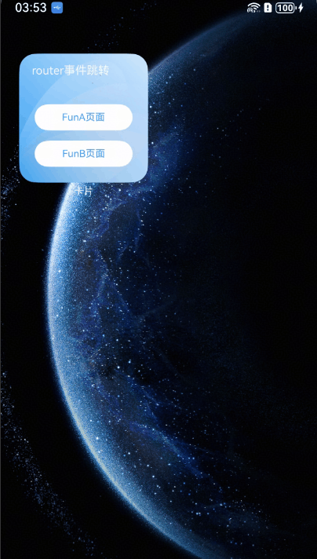

# 卡片跳转到应用页面（router事件）
<!--Kit: Form Kit-->
<!--Subsystem: Ability-->
<!--Owner: @cx983299475-->
<!--Designer: @xueyulong-->
<!--Tester: @chenmingze-->
<!--Adviser: @Brilliantry_Rui-->

在动态卡片中使用[postCardAction](../reference/apis-arkui/js-apis-postCardAction.md#postcardaction-1)接口的router能力，能够快速拉起动态卡片提供方应用的指定UIAbility(页面)，因此UIAbility较多的应用往往会通过卡片提供不同的跳转按钮，实现一键直达的效果。例如相机卡片，卡片上提供拍照、录像等按钮，点击不同按钮将拉起相机应用的不同UIAbility，从而提高用户的体验。


> **说明：**
>
> 本文主要介绍动态卡片的事件开发。对于静态卡片，请参见[FormLink](../reference/apis-arkui/arkui-ts/ts-container-formlink.md)。

## 开发步骤
1. 创建动态卡片

   在工程的 entry 模块中，新建名为WidgetEventRouterCard的ArkTs卡片。

2. 构建ArkTs卡片页面代码布局

   卡片页面布局中有两个按钮，点击其中一个按钮时调用postCardAction向指定UIAbility发送router事件，并在事件内定义需要传递的内容。

    ```ts
    // src/main/ets/widgetupdaterouter/pages/WidgetUpdateRouterCard.ets
    @Entry
    @Component
    struct WidgetUpdtRouterCard {
      @LocalStorageProp('routerDetail') routerDetail: ResourceStr = $r('app.string.init');

      build() {
        Column() {
          Column() {
            Text(this.routerDetail)
              .fontColor('#FFFFFF')
              .opacity(0.9)
              .fontSize(14)
              .margin({ top: '8%', left: '10%', right: '10%' })
              .textOverflow({ overflow: TextOverflow.Ellipsis })
              .maxLines(2)
          }.width('100%').height('50%')
          .alignItems(HorizontalAlign.Start)

          Row() {
            Button() {
              Text($r('app.string.JumpLabel'))
                .fontColor('#45A6F4')
                .fontSize(12)
            }
            .width(120)
            .height(32)
            .margin({ top: '30%', bottom: '10%' })
            .backgroundColor('#FFFFFF')
            .borderRadius(16)
            .onClick(() => {
              postCardAction(this, {
                action: 'router',
                abilityName: 'WidgetEventRouterEntryAbility', // 只能跳转到当前应用下的UIAbility
                params: {
                  routerDetail: 'RouterFromCard',
                }
              });
            })
          }.width('100%').height('40%')
          .justifyContent(FlexAlign.Center)
        }
        .width('100%')
        .height('100%')
        .alignItems(HorizontalAlign.Start)
        .backgroundImage($r('app.media.CardEvent'))
        .backgroundImageSize(ImageSize.Cover)
      }
    }
    ```

4. 处理router事件

   在UIAbility中接收router事件并获取参数，根据传递的params不同，选择拉起不同的页面。
  
     ```ts
    // src/main/ets/entryability/EntryAbility.ts
    import { AbilityConstant, UIAbility, Want } from '@kit.AbilityKit';
    import { window } from '@kit.ArkUI';
    import { hilog } from '@kit.PerformanceAnalysisKit';

    const TAG: string = 'EntryAbility';
    const DOMAIN_NUMBER: number = 0xFF00;

    export default class EntryAbility extends UIAbility {
      private selectPage: string = 'funA';
      private currentWindowStage: window.WindowStage | null = null;

      onCreate(want: Want, launchParam: AbilityConstant.LaunchParam): void {
        // 获取router事件中传递的targetPage参数
        hilog.info(DOMAIN_NUMBER, TAG, `Ability onCreate, ${JSON.stringify(want)}`);
        if (want?.parameters?.params) {
          // want.parameters.params 对应 postCardAction() 中 params 内容
          let params: Record<string, Object> = JSON.parse(want.parameters.params as string);
          this.selectPage = params.targetPage as string;
          hilog.info(DOMAIN_NUMBER, TAG, `onCreate selectPage: ${this.selectPage}`);
        }
      }

      // 如果UIAbility已在后台运行，在收到Router事件后会触发onNewWant生命周期回调
      onNewWant(want: Want, launchParam: AbilityConstant.LaunchParam): void {
        hilog.info(DOMAIN_NUMBER, TAG, `onNewWant Want: ${JSON.stringify(want)}`);
        if (want?.parameters?.params) {
          // want.parameters.params 对应 postCardAction() 中 params 内容
          let params: Record<string, Object> = JSON.parse(want.parameters.params as string);
          this.selectPage = params.targetPage as string;
          hilog.info(DOMAIN_NUMBER, TAG, `onNewWant selectPage: ${this.selectPage}`);
        }
        if (this.currentWindowStage !== null) {
          this.onWindowStageCreate(this.currentWindowStage);
        }
      }

      onWindowStageCreate(windowStage: window.WindowStage): void {
        // Main window is created, set main page for this ability
        let targetPage: string;
        // 根据传递的targetPage不同，选择拉起不同的页面
        switch (this.selectPage) {
          case 'funA':
            targetPage = 'funpages/FunA';
            break;
          case 'funB':
            targetPage = 'funpages/FunB';
            break;
          default:
            targetPage = 'pages/Index';
        }
        if (this.currentWindowStage === null) {
          this.currentWindowStage = windowStage;
        }
        windowStage.loadContent(targetPage, (err, data) => {
          if (err.code) {
            hilog.error(DOMAIN_NUMBER, TAG, 'Failed to load the content. Cause: %{public}s', JSON.stringify(err) ?? '');
            return;
          }
          hilog.info(DOMAIN_NUMBER, TAG, 'Succeeded in loading the content. Data: %{public}s', JSON.stringify(data) ?? '');
        });
      }
    }
    ```
5. 创建跳转后的UIAbility页面，新建FunA.ets和FunB.ets，构建页面布局。
    ```ts
   // src/main/ets/funpages/FunA.ets
    @Entry
    @Component
    struct FunA {
      build() {
        Column() {
          Row() {
            Text(($r('app.string.ButtonA_label')))
              .fontSize(24)
              .fontWeight(FontWeight.Bold)
              .textAlign(TextAlign.Start)
              .margin({ top: 12, bottom: 11, right: 24, left: 24 })
          }
          .width('100%')
          .height(56)
          .justifyContent(FlexAlign.Start)

          Image($r('app.media.pic_empty'))
            .width(120)
            .height(120)
            .margin({ top: 224 })

          Text($r('app.string.NoContentAvailable'))
            .fontSize(14)
            .fontColor($r('app.color.text_color'))
            .opacity(0.4)
            .margin({ top: 8, bottom: 317, right: 152, left: 152 })
        }
        .width('100%')
        .height('100%')
      }
    }
    ```

    ```ts
    // src/main/ets/funpages/FunB.ets
    @Entry
    @Component
    struct FunB {
      build() {
        Column() {
          Row() {
            Text(($r('app.string.ButtonB_label')))
              .fontSize(24)
              .fontWeight(FontWeight.Bold)
              .textAlign(TextAlign.Start)
              .margin({ top: 12, bottom: 11, right: 24, left: 24 })
          }
          .width('100%')
          .height(56)
          .justifyContent(FlexAlign.Start)

          Image($r('app.media.pic_empty'))
            .width(120)
            .height(120)
            .margin({ top: 224 })

          Text($r('app.string.NoContentAvailable'))
            .fontSize(14)
            .fontColor($r('app.color.text_color'))
            .opacity(0.4)
            .margin({ top: 8, bottom: 317, right: 152, left: 152 })
        }
        .width('100%')
        .height('100%')
      }
    }
    ```
6. 注册UIAbility页面，打开main_pages.json，将新建的FunA.ets和FunB.ets正确注册在src数组中。
  ```json
  //src/main/resources/base/profile/main_pages.json
  {
     "src": [
        "pages/Index",
        "funpages/FunA",
        "funpages/FunB"
     ]
  }
  ```
7. 运行效果<br>
