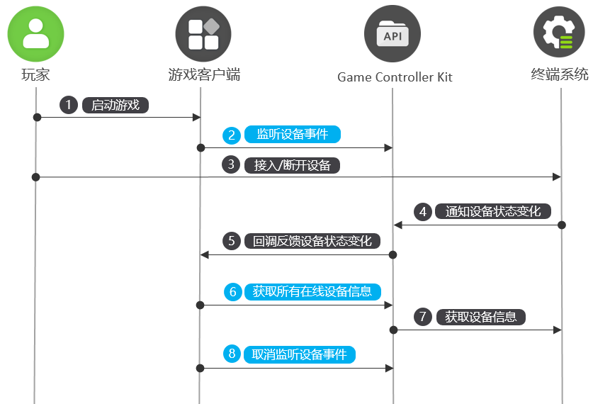

# 监听设备上下线（C/C++）
<!--Kit: Game Controller Kit-->
<!--Subsystem: Game-->
<!--Owner: @zhaoshuhao123-->
<!--Designer: @wudejun2025-->
<!--Tester: @csp1992-->
<!--Adviser: @luwy2025-->

## 功能介绍

Game Controller Kit提供设备上下线事件监听和查询在线设备信息的功能。注册监听事件后，设备拔插时可获取实时回调通知，同时支持查询当前所有在线设备的具体信息。


## 业务流程



1. 玩家启动游戏。

2. 游戏调用OH_GameDevice_RegisterDeviceMonitor接口注册设备状态变化事件监听。

3. 玩家插拔设备。

4. 终端系统将设备状态变化通知Game Controller Kit。

5. Game Controller Kit向游戏反馈设备状态变化。

6. 游戏调用OH_GameDevice_GetAllDeviceInfos接口向Game Controller Kit查询所有在线的游戏设备信息。

7. Game Controller Kit从终端系统获取所有在线的游戏设备信息。

8. 如果不再需要订阅，游戏可以调用OH_GameDevice_UnregisterDeviceMonitor接口取消设备状态变化事件监听。


## 接口说明

接口详细介绍请参考[API参考](../reference/apis-game-controller-kit/capi-game-controller.md)。

| 接口名 | 描述 | 
| -------- | -------- |
| GameController_ErrorCode OH_GameDevice_RegisterDeviceMonitor (GameDevice_DeviceMonitorCallback deviceMonitorCallback) | 注册设备状态变化事件的监听回调。 | 
| GameController_ErrorCode OH_GameDevice_UnregisterDeviceMonitor (void) | 取消注册设备状态变化事件的监听回调。 | 
| GameController_ErrorCode OH_GameDevice_GetAllDeviceInfos (GameDevice_AllDeviceInfos \*\*allDeviceInfos) | 获取所有在线设备的信息。 | 


## 开发步骤


### 链接动态库

```
target_link_libraries(entry PUBLIC libohgame_controller.z.so)
```


### 导入模块

```
#include <GameControllerKit/game_device.h>
```


### 注册设备上下线监听

调用OH_GameDevice_RegisterDeviceMonitor接口注册设备状态变化监听，获取设备上下线的回调通知。

```
napi_value DeviceApi::RegisterDeviceMonitor(napi_env env, napi_callback_info info) {
    napi_value result;
    GameController_ErrorCode errorCode = OH_GameDevice_RegisterDeviceMonitor(DeviceApi::OnDeviceChanged);
    if (errorCode != GameController_ErrorCode::GAME_CONTROLLER_SUCCESS) {
        OH_LOG_ERROR(LOG_APP, "RegisterDeviceMonitor Failed, %{public}d", errorCode);
        napi_create_double(env, errorCode, &result);
        return result;
    }
    OH_LOG_INFO(LOG_APP, "RegisterDeviceMonitor Success");
    napi_create_double(env, 0, &result);
    return result;
}

void DeviceApi::OnDeviceChanged(const struct GameDevice_DeviceEvent *deviceEvent) {
    GameDevice_StatusChangedType type;
    OH_GameDevice_DeviceEvent_GetChangedType(deviceEvent, &type);
    GameDevice_DeviceInfo *deviceInfo;
    OH_GameDevice_DeviceEvent_GetDeviceInfo(deviceEvent, &deviceInfo);
    std::string temp = GetDeviceInfoStringForPrint(deviceInfo);
    Log::GetInstance()->PrintLog("OnDeviceChanged type[" + std::to_string(type) + "] DeviceInfo" + temp);
    OH_LOG_INFO(LOG_APP, "OnDeviceChanged type:%{public}d DeviceInfo:%{public}s", type, temp.c_str());
    OH_GameDevice_DestroyDeviceInfo(&deviceInfo);
}
```


### 取消注册设备上下线监听

如果不再需要订阅，可以调用OH_GameDevice_UnregisterDeviceMonitor接口取消设备状态变化事件的监听。

```
napi_value DeviceApi::UnregisterDeviceMonitor(napi_env env, napi_callback_info info) {
    napi_value result;
    GameController_ErrorCode errorCode = OH_GameDevice_UnregisterDeviceMonitor();
    if (errorCode != GameController_ErrorCode::GAME_CONTROLLER_SUCCESS) {
        OH_LOG_ERROR(LOG_APP, "UnregisterDeviceMonitor Failed, %{public}d", errorCode);
        napi_create_double(env, errorCode, &result);
        return result;
    }
    OH_LOG_INFO(LOG_APP, "UnregisterDeviceMonitor Success");
    napi_create_double(env, 0, &result);
    return result;
}
```


### 查询所有在线设备

调用OH_GameDevice_GetAllDeviceInfos接口，查询所有在线游戏设备的信息。

```
GameController_ErrorCode DeviceApi::DoQueryAllDeviceInfos() {
    GameDevice_AllDeviceInfos *gameDevice_AllDeviceInfos;
    // 查询所有在线设备
    GameController_ErrorCode errorCode = OH_GameDevice_GetAllDeviceInfos(&gameDevice_AllDeviceInfos);
    if (errorCode != GameController_ErrorCode::GAME_CONTROLLER_SUCCESS) {
        OH_LOG_ERROR(LOG_APP, "GetAllDeviceInfos Failed, %{public}d", errorCode);
        return errorCode;
    }
    // 依次获取设备信息
    int count;
    OH_GameDevice_AllDeviceInfos_GetCount(gameDevice_AllDeviceInfos, &count);
    Log::GetInstance()->PrintLog("GetAllDeviceInfos Success, the count is " + std::to_string(count));
    for (int idx = 0; idx < count; idx++) {
        GameDevice_DeviceInfo *deviceInfo;
        errorCode = OH_GameDevice_AllDeviceInfos_GetDeviceInfo(gameDevice_AllDeviceInfos, idx, &deviceInfo);
        if (errorCode != GameController_ErrorCode::GAME_CONTROLLER_SUCCESS) {
            OH_LOG_ERROR(LOG_APP, "OH_GameDevice_AllDeviceInfos_GetDeviceInfo Failed, %{public}d", errorCode);
            return errorCode;
        }
        std::string temp = GetDeviceInfoStringForPrint(deviceInfo);
        Log::GetInstance()->PrintLog("AllDeviceInfos[" + std::to_string(idx) + "]" + temp);
        OH_LOG_INFO(LOG_APP, "AllDeviceInfos[%{public}d] DeviceInfo: %{public}s", idx, temp.c_str());
        OH_GameDevice_DestroyDeviceInfo(&deviceInfo);
    }
    // 销毁指向设备查询结果的指针
    OH_GameDevice_DestroyAllDeviceInfos(&gameDevice_AllDeviceInfos);
    OH_LOG_INFO(LOG_APP, "GetAllDeviceInfos Success");
    return errorCode;
}

std::string DeviceApi::GetDeviceInfoStringForPrint(GameDevice_DeviceInfo *deviceInfo) {
    std::string log;
    char *deviceId = NULL;
    OH_GameDevice_DeviceInfo_GetDeviceId(deviceInfo, &deviceId);
    log.append("deviceId:").append(deviceId);
    free(deviceId);
    char *name = NULL;
    OH_GameDevice_DeviceInfo_GetName(deviceInfo, &name);
    log.append(",name:").append(name);
    free(name);
    int product;
    OH_GameDevice_DeviceInfo_GetProduct(deviceInfo, &product);
    log.append(",product:").append(std::to_string(product));
    int version;
    OH_GameDevice_DeviceInfo_GetVersion(deviceInfo, &version);
    log.append(",version:").append(std::to_string(version));
    char *physicalAddress = NULL;
    OH_GameDevice_DeviceInfo_GetPhysicalAddress(deviceInfo, &physicalAddress);
    log.append(",physicalAddress:").append(physicalAddress);
    free(physicalAddress);
    GameDevice_DeviceType type;
    OH_GameDevice_DeviceInfo_GetDeviceType(deviceInfo, &type);
    log.append(",type:").append(std::to_string(type));
    return log;
}
```
