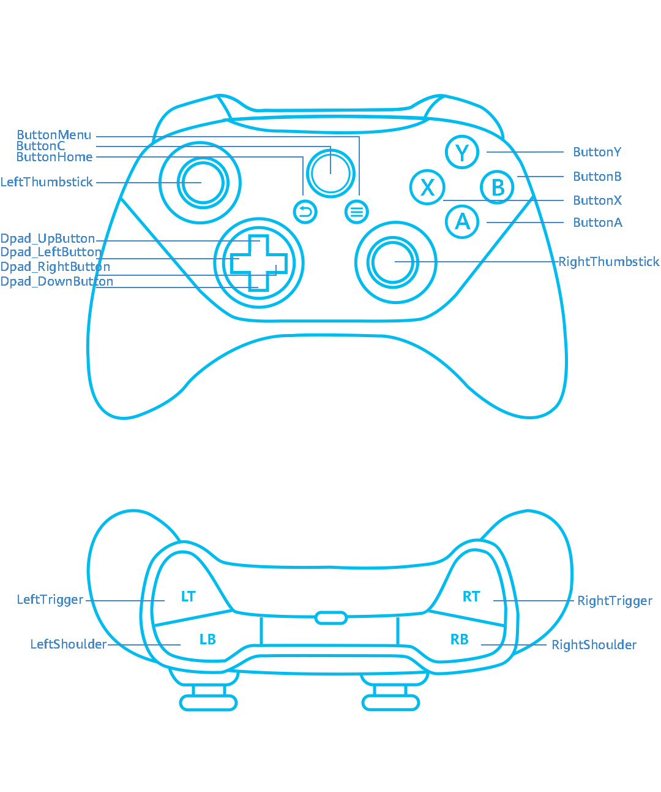

# 监听游戏手柄的轴和按键事件（C/C++）
<!--Kit: Game Controller Kit-->
<!--Subsystem: Game-->
<!--Owner: @zhaoshuhao123-->
<!--Designer: @wudejun2025-->
<!--Tester: @csp1992-->
<!--Adviser: @luwy2025-->

>  **说明：**
> 您必须先完成[监听设备上下线](game-controller-monitor-device.md)功能的开发，才能进行游戏手柄轴事件和按键事件的监听注册。


## 功能介绍

Game Controller Kit提供游戏手柄轴事件和按键事件的监听能力。通过轴事件和按键事件的监听注册，在玩家操作手柄按键和摇杆时可获得对应回调通知。


## 按键

Game Controller Kit支持的手柄键位参考图如下：




## 接口说明

接口详细介绍请参考[API参考](../reference/apis-game-controller-kit/capi-game-controller.md)。

| 接口名 | 描述 | 
| -------- | -------- |
| 按键事件监听 | 
| OH_GamePad_LeftShoulder_RegisterButtonInputMonitor | 注册LeftShoulder按键事件的监听。 | 
| OH_GamePad_RightShoulder_RegisterButtonInputMonitor | 注册RightShoulder按键事件的监听。 | 
| OH_GamePad_LeftTrigger_RegisterButtonInputMonitor | 注册LeftTrigger按键事件的监听。 | 
| OH_GamePad_RightTrigger_RegisterButtonInputMonitor | 注册RightTrigger按键事件的监听。 | 
| OH_GamePad_ButtonMenu_RegisterButtonInputMonitor | 注册Menu按键事件的监听。 | 
| OH_GamePad_ButtonHome_RegisterButtonInputMonitor | 注册Home按键事件的监听。 | 
| OH_GamePad_ButtonA_RegisterButtonInputMonitor | 注册A按键事件的监听。 | 
| OH_GamePad_ButtonB_RegisterButtonInputMonitor | 注册B按键事件的监听。 | 
| OH_GamePad_ButtonX_RegisterButtonInputMonitor | 注册X按键事件的监听。 | 
| OH_GamePad_ButtonY_RegisterButtonInputMonitor | 注册Y按键事件的监听。 | 
| OH_GamePad_ButtonC_RegisterButtonInputMonitor | 注册C按键事件的监听。 | 
| OH_GamePad_Dpad_LeftButton_RegisterButtonInputMonitor | 注册方向按键的向左按键事件的监听。 | 
| OH_GamePad_Dpad_RightButton_RegisterButtonInputMonitor | 注册方向按键的向右按键事件的监听。 | 
| OH_GamePad_Dpad_UpButton_RegisterButtonInputMonitor | 注册方向按键的向上按键事件的监听。 | 
| OH_GamePad_Dpad_DownButton_RegisterButtonInputMonitor | 注册方向按键的向下按键事件的监听。 | 
| OH_GamePad_LeftThumbstick_RegisterButtonInputMonitor | 注册LeftThumbstick按键事件的监听。 | 
| OH_GamePad_RightThumbstick_RegisterButtonInputMonitor | 注册RightThumbstick按键事件的监听。 | 
| 轴事件监听 | 
| OH_GamePad_LeftTrigger_RegisterAxisInputMonitor | 注册LeftTrigger轴事件的监听。 | 
| OH_GamePad_RightTrigger_RegisterAxisInputMonitor | 注册RightTrigger轴事件的监听。 | 
| OH_GamePad_Dpad_RegisterAxisInputMonitor | 注册方向按键轴事件的监听。 | 
| OH_GamePad_LeftThumbstick_RegisterAxisInputMonitor | 注册LeftThumbstick轴事件的监听。 | 
| OH_GamePad_RightThumbstick_RegisterAxisInputMonitor | 注册RightThumbstick轴事件的监听。 | 


## 开发步骤


### 链接动态库

```
target_link_libraries(entry PUBLIC libohgame_controller.z.so)
```


### 导入模块

```
#include <GameControllerKit/game_pad.h>
```


### 注册和取消注册轴事件的监听

调用相应接口注册或取消注册轴事件回调，通过回调函数获取轴值。

物理轴及其对应的轴值获取接口如下：

| 物理轴 | 轴值获取接口 | 
| -------- | -------- |
| LeftThumbstick | 通过OH_GamePad_AxisEvent_GetXAxisValue获取X轴的轴值。<br/>通过OH_GamePad_AxisEvent_GetYAxisValue获取Y轴的轴值。 | 
| RightThumbstick | 通过OH_GamePad_AxisEvent_GetZAxisValue获取Z轴的轴值。<br/>通过OH_GamePad_AxisEvent_GetRZAxisValue获取RZ轴的轴值。 | 
| DPAD | 通过OH_GamePad_AxisEvent_GetHatXAxisValue获取HatX轴的轴值。<br/>通过OH_GamePad_AxisEvent_GetHatYAxisValue获取HatY轴的轴值。 | 
| LeftTrigger | 通过OH_GamePad_AxisEvent_GetBrakeAxisValue获取Brake轴的轴值。 | 
| RightTrigger | 通过OH_GamePad_AxisEvent_GetGasAxisValue获取Gas轴的轴值。 | 

以LeftThumbstick轴事件为例。

```
napi_value GamePad::LeftThumbstick_RegisterAxisInputMonitor(napi_env env, napi_callback_info info) {
    napi_value result;
    GameController_ErrorCode errorCode =
        OH_GamePad_LeftThumbstick_RegisterAxisInputMonitor(GamePad::LeftThumbstick_OnAxisEvent);
    if (errorCode != GameController_ErrorCode::GAME_CONTROLLER_SUCCESS) {
        OH_LOG_ERROR(LOG_APP, "LeftThumbstick_RegisterAxisInputMonitor Failed, %{public}d", errorCode);
        napi_create_double(env, errorCode, &result);
        return result;
    }
    OH_LOG_INFO(LOG_APP, "LeftThumbstick_RegisterAxisInputMonitor Success");
    napi_create_double(env, 0, &result);
    return result;
}

napi_value GamePad::LeftThumbstick_UnregisterAxisInputMonitor(napi_env env, napi_callback_info info) {
    napi_value result;
    GameController_ErrorCode errorCode = OH_GamePad_LeftThumbstick_UnregisterAxisInputMonitor();
    if (errorCode != GameController_ErrorCode::GAME_CONTROLLER_SUCCESS) {
        OH_LOG_ERROR(LOG_APP, "LeftThumbstick_UnregisterAxisInputMonitor Failed, %{public}d", errorCode);
        napi_create_double(env, errorCode, &result);
        return result;
    }
    OH_LOG_INFO(LOG_APP, "LeftThumbstick_UnregisterAxisInputMonitor Success");
    napi_create_double(env, 0, &result);
    return result;
}

void GamePad::LeftThumbstick_OnAxisEvent(const struct GamePad_AxisEvent *axisEvent) {
    std::string val = "X";
    double xAxisValue;
    OH_GamePad_AxisEvent_GetXAxisValue(axisEvent, &xAxisValue);
    val.append(std::to_string(xAxisValue)).append("_Y");
    double yAxisValue;
    OH_GamePad_AxisEvent_GetYAxisValue(axisEvent, &yAxisValue);
    val.append(std::to_string(yAxisValue));
    OnAxisEvent(axisEvent, "LeftThumbstick_OnAxisEvent", val);
}
```


### 注册按键事件的监听和取消注册

调用相应接口注册或取消注册按键事件回调，从回调函数中获取按键值。

以下是按键名称与对应按键值：

| 按键名称 | 按键值 | 
| -------- | -------- |
| LeftShoulder | 2307 | 
| RightShoulder | 2308 | 
| LeftTrigger | 2309 | 
| RightTrigger | 2310 | 
| LeftThumbstick | 2314 | 
| RightThumbstick | 2315 | 
| ButtonHome | 2311 | 
| ButtonMenu | 2312 | 
| ButtonA | 2301 | 
| ButtonB | 2302 | 
| ButtonC | 2303 | 
| ButtonX | 2304 | 
| ButtonY | 2305 | 
| Dpad_UpButton | 2012 | 
| Dpad_DownButton | 2013 | 
| Dpad_LeftButton | 2014 | 
| Dpad_RightButton | 2015 | 

以LeftShoulder按键事件为例。

```
napi_value GamePad::LeftShoulder_RegisterButtonInputMonitor(napi_env env, napi_callback_info info) {
    napi_value result;
    GameController_ErrorCode errorCode =
        OH_GamePad_LeftShoulder_RegisterButtonInputMonitor(GamePad::LeftShoulder_OnButtonEvent);
    if (errorCode != GameController_ErrorCode::GAME_CONTROLLER_SUCCESS) {
        OH_LOG_ERROR(LOG_APP, "LeftShoulder_RegisterButtonInputMonitor Failed, %{public}d", errorCode);
        napi_create_double(env, errorCode, &result);
        return result;
    }
    OH_LOG_INFO(LOG_APP, "LeftShoulder_RegisterButtonInputMonitor Success");
    napi_create_double(env, 0, &result);
    return result;
}

napi_value GamePad::LeftShoulder_UnregisterButtonInputMonitor(napi_env env, napi_callback_info info) {
    napi_value result;
    GameController_ErrorCode errorCode = OH_GamePad_LeftShoulder_UnregisterButtonInputMonitor();
    if (errorCode != GameController_ErrorCode::GAME_CONTROLLER_SUCCESS) {
        OH_LOG_ERROR(LOG_APP, "LeftShoulder_UnregisterButtonInputMonitor Failed, %{public}d", errorCode);
        napi_create_double(env, errorCode, &result);
        return result;
    }
    OH_LOG_INFO(LOG_APP, "LeftShoulder_UnregisterButtonInputMonitor Success");
    napi_create_double(env, 0, &result);
    return result;
}

void GamePad::LeftShoulder_OnButtonEvent(const struct GamePad_ButtonEvent *buttonEvent) {
    OnButtonEvent(buttonEvent, "LeftShoulder_OnButtonEvent");
}

void GamePad::OnButtonEvent(const struct GamePad_ButtonEvent *buttonEvent, const std::string &buttonName) {
    std::string temp;
    temp.append("OnButtonEvent:").append(buttonName);
    char *deviceId;
    OH_GamePad_ButtonEvent_GetDeviceId(buttonEvent, &deviceId);
    temp.append(" ,deviceId:").append(deviceId);
    free(deviceId);
    GamePad_Button_ActionType action;
    OH_GamePad_ButtonEvent_GetButtonAction(buttonEvent, &action);
    temp.append(" ,action:").append(std::to_string(action));
    std::int32_t buttonCode;
    OH_GamePad_ButtonEvent_GetButtonCode(buttonEvent, &buttonCode);
    temp.append(" ,code:").append(std::to_string(buttonCode));
    char *buttonCodeName;
    OH_GamePad_ButtonEvent_GetButtonCodeName(buttonEvent, &buttonCodeName);
    temp.append(" ,codeName:").append(buttonCodeName);
    free(buttonCodeName);
    std::int64_t actionTime;
    OH_GamePad_ButtonEvent_GetActionTime(buttonEvent, &actionTime);
    temp.append(" ,actionTime:").append(std::to_string(actionTime));
    std::int32_t count;
    OH_GamePad_PressedButtons_GetCount(buttonEvent, &count);
    temp.append(" ,count:").append(std::to_string(count));
    std::string pressedButtonCodes;
    for (std::int32_t idx = 0; idx < count; idx++) {
        GamePad_PressedButton *pressedButton;
        OH_GamePad_PressedButtons_GetButtonInfo(buttonEvent, idx, &pressedButton);
        int code;
        OH_GamePad_PressedButton_GetButtonCode(pressedButton, &code);
        char *name;
        OH_GamePad_PressedButton_GetButtonCodeName(pressedButton, &name);
        if (idx != 0) {
            pressedButtonCodes = pressedButtonCodes.append(";");
        }
        pressedButtonCodes = pressedButtonCodes.append(std::to_string(code) + "|").append(name);
        free(name);
        OH_GamePad_DestroyPressedButton(&pressedButton);
    }
    temp.append(" ,pressedButtonCodes:").append(pressedButtonCodes);
    OH_LOG_INFO(LOG_APP, "%{public}s", temp.c_str());
    Log::GetInstance()->PrintLog(temp);
}
```
