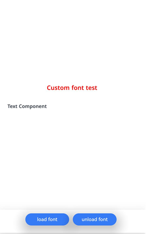
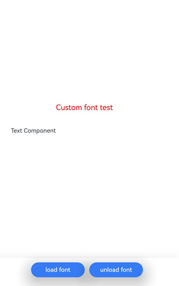

# 自定义字体的注册和使用（ArkTS）
<!--Kit: ArkGraphics 2D-->
<!--Subsystem: Graphics-->
<!--Owner: @oh_wangxk; @gmiao522; @Lem0nC-->
<!--Designer: @liumingxiang-->
<!--Tester: @yhl0101-->
<!--Adviser: @ge-yafang-->
## 场景介绍

自定义字体是指开发者根据应用需求创建或选择的字体，通常用于实现特定的文字风格或满足独特的设计要求。当应用需要使用特定的文本样式和字符集时，可以注册并使用自定义字体进行文本渲染。

## 实现流程

**自定义字体的注册**是指将字体文件（如ttf、otf文件等）从应用资源注册到系统中，使得应用能够使用这些字体进行文本渲染。注册过程是将字体文件通过字体管理接口注册到系统字体库中，以便在应用中进行调用。

**自定义字体的使用**是指在应用中显式指定使用已注册的自定义字体进行文本渲染。开发者可以根据需要选择特定的文本样式（如常规、粗体、斜体等），并将其应用到UI元素、文本控件或其他文本展示区域，以满足设计要求并提供视觉效果的一致性。


## 接口说明

自定义字体注册和使用的常用接口如下表所示，详细接口说明请见[@ohos.graphics.text (文本模块)](../reference/apis-arkgraphics2d/js-apis-graphics-text.md)。

| 接口 | 描述 | 
| -------- | -------- |
| loadFontSync(name: string, path: string \| Resource): void | 同步接口，将路径对应的文件，以name作为使用的别名，注册自定义字体。<br/>**说明：**<br/>需保证使用自定义字体时，自定义字体已完成注册，非性能严格要求场景下，建议使用同步接口。 | 
| loadFont(name: string, path: string \| Resource): Promise&lt;void&gt; | 使用指定的别名和文件路径注册对应字体，使用Promise异步回调。此接口从API version 14开始支持。 | 
| unloadFontSync(name: string): void | 同步接口，注销指定别名的字体。此接口从API version 20开始支持。 |
| unloadFont(name: string): Promise\<void\> | 使用指定的别名注销对应字体，使用Promise异步回调。此接口从API version 20开始支持。 |

## 开发步骤

1. 导入依赖的相关模块。

   <!-- @[arkts_custom_font_include](https://gitcode.com/openharmony/applications_app_samples/blob/master/code/DocsSample/ArkGraphics2D/TextEngine/CustomFont/entry/src/main/ets/pages/Index.ets) -->
   
   ``` TypeScript
   import { NodeController, FrameNode, RenderNode, DrawContext } from '@kit.ArkUI'
   import { UIContext } from '@kit.ArkUI'
   import { text } from '@kit.ArkGraphics2D'
   ```

2. 注册自定义字体。有以下两种方式：

   <!-- @[arkts_custom_font_step2](https://gitcode.com/openharmony/applications_app_samples/blob/master/code/DocsSample/ArkGraphics2D/TextEngine/CustomFont/entry/src/main/ets/pages/Index.ets) -->
   
   ``` TypeScript
   // 注册自定义字体
   // 方式一：/system/fonts/NotoSansMalayalamUI-SemiBold.ttf文件仅为示例路径，应用根据自身实际填写文件路径
   fontCollection.loadFontSync(familyName, 'file:///system/fonts/NotoSansMalayalamUI-SemiBold.ttf')
   // 方式二：确保已经将自定义字体myFontFile.ttf文件放在本应用工程的entry/src/main/resources/rawfile目录
   // fontCollection.loadFontSync(familyName, $rawfile('myFontFile.ttf'))
   ```

3. 使用自定义字体。

   <!-- @[arkts_custom_font_step3](https://gitcode.com/openharmony/applications_app_samples/blob/master/code/DocsSample/ArkGraphics2D/TextEngine/CustomFont/entry/src/main/ets/pages/Index.ets) -->
   
   ``` TypeScript
   // 使用自定义字体
   let myFontFamily: Array<string> = [familyName] // 如果已经注册自定义字体，填入自定义字体的字体家族名
   // 设置文本样式
   let myTextStyle: text.TextStyle = {
     color: {
       alpha: 255,
       red: 255,
       green: 0,
       blue: 0
     },
     fontSize: 30,
     // 在文本样式中加入可使用的自定义字体
     fontFamilies: myFontFamily
   };
   ```

4. 创建段落样式，并使用字体管理器实例构造段落生成器ParagraphBuilder实例。

   <!-- @[arkts_custom_font_step4](https://gitcode.com/openharmony/applications_app_samples/blob/master/code/DocsSample/ArkGraphics2D/TextEngine/CustomFont/entry/src/main/ets/pages/Index.ets) -->
   
   ``` TypeScript
   // 创建一个段落样式对象，以设置排版风格
   let myParagraphStyle: text.ParagraphStyle = {
     textStyle: myTextStyle,
     align: 3,
     wordBreak: text.WordBreak.NORMAL
   };
   // 创建一个段落生成器
   let paragraphBuilder = new text.ParagraphBuilder(myParagraphStyle, fontCollection)
   ```

5. 生成段落。

   <!-- @[arkts_custom_font_step5](https://gitcode.com/openharmony/applications_app_samples/blob/master/code/DocsSample/ArkGraphics2D/TextEngine/CustomFont/entry/src/main/ets/pages/Index.ets) -->
   
   ``` TypeScript
   // 在段落生成器中设置文本样式
   paragraphBuilder.pushStyle(myTextStyle);
   // 在段落生成器中设置文本内容
   paragraphBuilder.addText("Custom font test");
   // 通过段落生成器生成段落
   let paragraph = paragraphBuilder.build();
   ```

6. 如果需要释放自定义字体，可以使用unloadFontSync接口。

   <!-- @[arkts_custom_font_step6](https://gitcode.com/openharmony/applications_app_samples/blob/master/code/DocsSample/ArkGraphics2D/TextEngine/CustomFont/entry/src/main/ets/pages/Index.ets) -->
   
   ``` TypeScript
   // 注销自定义字体
   fontCollection.unloadFontSync(familyName)
   // 注销之后需要刷新使用该fontCollection的节点
   newNode.invalidate()
   ```

## 效果展示



