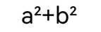

# 字块绘制（ArkTS）

<!--Kit: ArkGraphics 2D-->
<!--Subsystem: Graphics-->
<!--Owner: @hangmengxin-->
<!--Designer: @wangyanglan-->
<!--Tester: @nobuggers-->
<!--Adviser: @ge-yafang-->

## 场景介绍

字块（TextBlob）是指文本的集合。无论是单个的文字还是大块的文本，都可以通过字块来绘制。

除了基本的字块绘制之外，还可以给文字添加各种绘制效果。常见的字块绘制场景包括[文字描边](#文字描边)、[文字渐变](#文字渐变)等，更多效果请见[绘制效果](drawing-effect-overview.md)。

本节不涉及文本测量和布局排版相关内容，如需在开发中处理此类文本绘制需求，可参考[文本开发概述](text-overview.md)，该文档系统讲解了排版策略与相关使用指导。

## 基本字块绘制

Canvas通过drawTextBlob()来绘制字块。函数接受三个参数：TextBlob字块对象，以及文字基线左端点的x坐标和y坐标。

画布Canvas对象具体可见[画布的获取与绘制结果的显示（ArkTS）](canvas-get-result-draw-arkts.md)。

字块对象可以通过多种方式创建得到，详细的字块创建方式和接口使用请参考[TextBlob](../reference/apis-arkgraphics2d/arkts-apis-graphics-drawing-TextBlob.md)。

此处以使用makeFromString()接口创建字块为例，接口接受3个参数，分别为：

- 需要显示的字符串text。

- font字型对象。其中font用于设置和获取字体的各种属性，如字体大小、文本样式、字体对齐方式、字体渲染方式、字体描边方式等，详细的API介绍请参考[Font](../reference/apis-arkgraphics2d/arkts-apis-graphics-drawing-Font.md)。

- 文本编码方式。当前支持的文本编码方式如下：
  - TEXT_ENCODING_UTF8：使用1个字节表示UTF-8或ASCII；
  - TEXT_ENCODING_UTF16：使用2个字节表示大部分unicode；
  - TEXT_ENCODING_UTF32：使用4个字节表示全部unicode；
  - TEXT_ENCODING_GLYPH_ID：使用2个字节表示glyph index。

基本效果的示例代码和效果图如下：

<!-- @[arkts_graphics_draw_base_text](https://gitcode.com/openharmony/applications_app_samples/blob/master/code/DocsSample/Drawing/ArkTSGraphicsDraw/entry/src/main/ets/drawing/pages/TextBlockDrawing.ets) -->

``` TypeScript
// 创建字型对象
const font = new drawing.Font();
// 设置字体大小
font.setSize(100);
// 创建字块对象
const textBlob = drawing.TextBlob.makeFromString('Hello world', font, drawing.TextEncoding.TEXT_ENCODING_UTF8);
// 绘制字块
canvas.drawTextBlob(textBlob, VALUE_200, VALUE_300);
```


## 文字描边

基于基本的字块绘制，还可以通过画笔实现文字描边效果，描边效果的更多介绍请参考[描边效果](basic-drawing-effect-arkts.md#描边效果)。

以下以英文文字描边和中文文字描边给出示例和指导。

### 英文文字描边

英文文字描边的简要示例和示意图如下：

<!-- @[arkts_graphics_draw_stroke_text](https://gitcode.com/openharmony/applications_app_samples/blob/master/code/DocsSample/Drawing/ArkTSGraphicsDraw/entry/src/main/ets/drawing/pages/TextBlockDrawing.ets) -->


### 中文文字描边

首先需要通过画笔描边，然后需要调用画刷填充内部颜色，去除字体中间的杂质和重叠部分，实现中文文字描边效果。

中文文字描边的简要示例和示意图如下：

<!-- @[arkts_graphics_draw_chinese_stroke_text](https://gitcode.com/openharmony/applications_app_samples/blob/master/code/DocsSample/Drawing/ArkTSGraphicsDraw/entry/src/main/ets/drawing/pages/TextBlockDrawing.ets) -->


## 文字渐变

基于基本字块绘制，还可以通过着色器实现文字渐变的效果，着色器的更多介绍请参考[着色器效果](complex-drawing-effect-arkts.md#着色器效果)。

以下为文字添加了线性渐变着色器效果的简要示例和示意图：

<!-- @[arkts_graphics_draw_gradient_text](https://gitcode.com/openharmony/applications_app_samples/blob/master/code/DocsSample/Drawing/ArkTSGraphicsDraw/entry/src/main/ets/drawing/pages/TextBlockDrawing.ets) -->


## 主题字体

主题字体，特指系统**主题应用**中能使用的字体，属于一种特殊的自定义字体。如需涉及文本测量和布局排版相关内容，可参考[使用主题字体（ArkTS）](theme-font-arkts.md)。

设置跟随主题字体的示例代码和效果图如下：

<!-- @[arkts_graphics_draw_theme_text](https://gitcode.com/openharmony/applications_app_samples/blob/master/code/DocsSample/Drawing/ArkTSGraphicsDraw/entry/src/main/ets/drawing/pages/TextBlockDrawing.ets) -->

| 未跟随主题字体的效果图 | 跟随主题字体的效果图（不同主题字体显示效果不同，此处仅示意） |
| -------- | -------- |
|  |  |

> **说明**
>
> 需要在应用入口文件（默认工程中为EntryAbility.ets）中复写onConfigurationUpdate函数，以响应切换主题字体的操作，确保切换后页面能够及时刷新并生效。具体实现可参考[使用主题字体（ArkTS）](theme-font-arkts.md)。

## 单字绘制

单字绘制是图形渲染中针对文本渲染的一种精细化控制技术。相比字块绘制，其核心优势在于能够利用字体退化机制，在当前字体无法显示某字符时，自动退化到使用系统字体绘制字符，提升对特殊字符的兼容性，避免字符缺失。同时，单字绘制支持逐字符配置字体特征（如连字、替代字形），满足复杂排版需求，增强用户体验。详细API说明请见[drawing.Canvas](../reference/apis-arkgraphics2d/arkts-apis-graphics-drawing-Canvas.md#drawsinglecharacter12)。

基础场景：绘制无字体特征的字符  
对于无需字体特征的常规文本渲染场景，可以使用drawSingleCharacter绘制单个字符，使用measureSingleCharacter测量单个字符的宽度，示例代码和效果图如下：

<!-- @[arkts_graphics_draw_single_text](https://gitcode.com/openharmony/applications_app_samples/blob/master/code/DocsSample/Drawing/ArkTSGraphicsDraw/entry/src/main/ets/drawing/pages/TextBlockDrawing.ets) -->


进阶场景：绘制带字体特征的字符  
对于需要字体特征的文本渲染场景，可以使用drawSingleCharacterWithFeatures绘制单个字符，使用measureSingleCharacterWithFeatures测量单个字符的宽度，示例代码和效果图如下：

<!-- @[arkts_graphics_draw_feature_text](https://gitcode.com/openharmony/applications_app_samples/blob/master/code/DocsSample/Drawing/ArkTSGraphicsDraw/entry/src/main/ets/drawing/pages/TextBlockDrawing.ets) -->



> **说明**
>
> 如果 `drawSingleCharacterWithFeatures` 与 `measureSingleCharacter` 混合使用，或者 `drawSingleCharacter` 与 `measureSingleCharacterWithFeatures` 混合使用，字体绘制可能会重叠。

<!--RP1-->
## 相关实例

针对Drawing(ArkTS)的开发，有以下相关实例可供参考：

- [ArkTSGraphicsDraw (API20)](https://gitcode.com/openharmony/applications_app_samples/tree/master/code/DocsSample/Drawing/ArkTSGraphicsDraw)
<!--RP1End-->