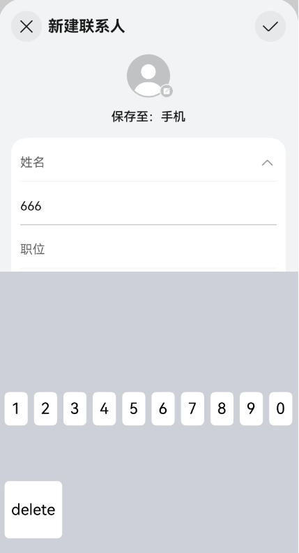

# 实现一个输入法应用
<!--Kit: IME Kit-->
<!--Subsystem: MiscServices-->
<!--Owner: @illybyy-->
<!--Designer: @andeszhang-->
<!--Tester: @murphy1984-->
<!--Adviser: @zhang_yixin13-->

[InputMethodExtensionAbility](../reference/apis-ime-kit/js-apis-inputmethod-extension-ability.md)提供了onCreate()和onDestroy()生命周期回调，根据需要重写对应的回调方法。InputMethodExtensionAbility的生命周期如下：

- **onCreate()**

  服务被首次创建时触发该回调，开发者可以在此进行一些初始化的操作，例如注册公共事件监听等。

  > **说明：**
  >
  > 如果服务已创建，再次启动该InputMethodExtensionAbility不会触发onCreate()回调。

- **onDestroy()**

  当不再使用服务且准备将该实例销毁时，触发该回调。开发者可以在该回调中清理资源，如注销监听等。


## 开发步骤 

开发者在实现一个输入法应用时，需要在DevEco Studio工程中新建一个InputMethodExtensionAbility，具体步骤如下：

1. 在工程Module对应的ets目录下，右键选择“New > Directory”，新建一个目录，并命名为InputMethodExtensionAbility。

2. 在InputMethodExtensionAbility目录下，右键选择“New > File”，新建四个文件，分别为KeyboardController.ts、InputMethodService.ts、Index.ets以及KeyboardKeyData.ts。目录如下：

``` 
/src/main/
├── ets/InputMethodExtensionAbility
│       └──model/KeyboardController.ts			# 显示键盘
│       └──InputMethodService.ts				# 自定义类继承InputMethodExtensionAbility并加上需要的生命周期回调
│       └──pages
│         └── Index.ets						# 绘制键盘，添加输入删除功能
│         └── KeyboardKeyData.ts			    # 键盘属性定义
├── resources/base/profile/main_pages.json  
```

## 文件介绍

1. InputMethodService.ts文件。

   在InputMethodService.ts文件中，增加导入InputMethodExtensionAbility的依赖包，自定义类继承InputMethodExtensionAbility并加上需要的生命周期回调。

``` TypeScript

import { InputMethodExtensionAbility } from '@kit.IMEKit';
import Log from '../model/Log';
import { keyboardController } from '../model/KeyboardController';
import { Want } from '@kit.AbilityKit';

const TAG: string = 'ServiceExtAbility->';

export default class ServiceExtAbility extends InputMethodExtensionAbility {
  onCreate(want: Want): void {
    this.addLog(`onCreate want: ${want.abilityName}`);
    keyboardController.onCreate(this.context);
  }

  onDestroy(): void {
    this.addLog('onDestroy');
    keyboardController.onDestroy();
  }

  addLog(message: string): void {
    Log.showInfo(TAG, `kikaInput-new: ${message}`);
  }
}
```


<!--RP2-->
2. KeyboardController.ts文件。KeyboardController中除创建输入法窗口，设置输入法事件监听，实现文本插入、删除之外，还可以获取[输入法键盘与系统面板的偏移区域](../reference/apis-ime-kit/js-apis-inputmethodengine.md#getsystempanelcurrentinsets21)，输入法系统面板在不同设备上存在差异，当设备有系统面板时，输入法软键盘相对系统面板的偏移区域如图所示：

   

<!-- @[input_case_input_KeyboardControler358](https://gitcode.com/openharmony/applications_app_samples/blob/master/code/Solutions/InputMethod/KikaInputMethod/entry/src/main/ets/model/KeyboardController.ets) -->

<!-- @[input_case_input_KeyboardControler507](https://gitcode.com/openharmony/applications_app_samples/blob/master/code/Solutions/InputMethod/KikaInputMethod/entry/src/main/ets/model/KeyboardController.ets) -->

<!-- @[input_case_input_KeyboardControler587](https://gitcode.com/openharmony/applications_app_samples/blob/master/code/Solutions/InputMethod/KikaInputMethod/entry/src/main/ets/model/KeyboardController.ets) -->
 
   <!--RP2End-->
3. KeyboardKeyData.ts文件。

   定义软键盘的按键显示内容。


<!-- @[input_case_input_KeyboardKeyData016](https://gitcode.com/openharmony/applications_app_samples/blob/master/code/Solutions/InputMethod/KikaInputMethod/entry/src/main/ets/model/KeyboardKeyData.ets) -->

 
4. Index.ets文件。

   主要描绘了具体按键功能。如按下数字键，就会将数字内容在输入框中打印出来，按下删除键，就会将内容删除。

   <!--Del-->同时在resources/base/profile/main_pages.json文件的src字段中添加此文件路径。<!--DelEnd-->

<!-- @[input_case_input_index](https://gitcode.com/openharmony/applications_app_samples/blob/master/code/Solutions/InputMethod/KikaInputMethod/entry/src/main/ets/pages/Index.ets) -->

<!--Del-->
5. 在工程Module对应的[module.json5配置文件](../quick-start/module-configuration-file.md)中注册InputMethodExtensionAbility，type标签需要设置为“inputMethod”，srcEntry标签表示当前InputMethodExtensionAbility组件所对应的代码路径。


<!-- @[input_case_entry_module_extensionAbilities](https://gitcode.com/openharmony/applications_app_samples/blob/master/code/Solutions/InputMethod/KikaInputMethod/entry/src/main/module.json5) -->

<!--DelEnd-->


<!--RP3-->

<!--RP3End-->

## 约束与限制

为了降低InputMethodExtensionAbility能力被三方应用滥用的风险，现通过基础访问模式的功能约束对输入法应用进行安全管控。

> **说明：**
>
> 严格遵从基础访问模式的功能约束。在此模式下，开发者应仅提供基础打字功能，不应提供任何形式与网络交互相关的功能。系统会逐步增加基础访问模式的安全管控能力，包括但不限于：以独立进程和沙箱的方式运行Extension进程；禁止Extension进程创建子进程；进程间通信与网络访问等。因此未遵从此约定可能会导致功能异常。

## 相关实例

针对InputMethodExtensionAbility开发，有以下相关实例可供参考：

- [轻量级输入法](https://gitcode.com/openharmony/applications_app_samples/tree/master/code/Solutions/InputMethod/KikaInput)

## 示例效果图
