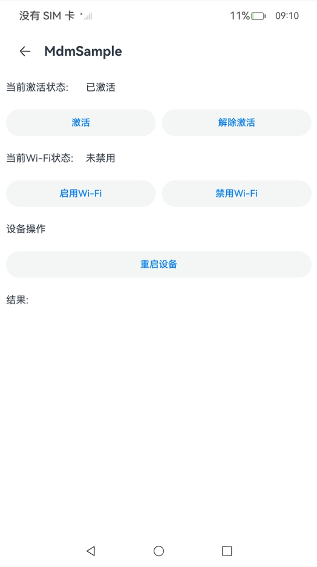
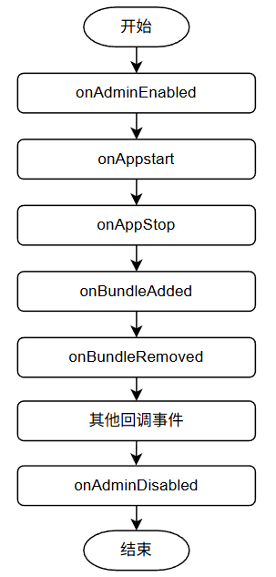

# 应用模型
<!--Kit: MDM Kit-->
<!--Subsystem: Customization-->
<!--Owner: @huanleima-->
<!--Designer: @liuzuming-->
<!--Tester: @lpw_work-->
<!--Adviser: @zhang_yixin13-->

## 概述

应用模型是系统为开发者提供的应用程序所需能力的抽象提炼，它提供了应用程序必需的组件和运行机制。借助应用模型，开发者可以基于一套统一的模型进行应用开发，使应用开发更简单、高效。

## Admin组件的基础概念

[企业设备管理扩展组件](./mdm-kit-term.md#企业设备管理扩展能力)，是[MDM应用](./mdm-kit-term.md#mdm应用设备管理应用)的必备组件。开发MDM应用时，需要定义一个[EnterpriseAdminExtensionAbility](../reference/apis-mdm-kit/js-apis-EnterpriseAdminExtensionAbility.md)类型的[ExtensionAbility](../reference/apis-ability-kit/js-apis-app-ability-extensionAbility.md)组件用于激活MDM应用，该组件被激活后将作为独立的后台进程存在。

### 进程模型

MDM应用进程模型继承于普通应用[进程模型](../application-models/process-model-stage.md#进程模型-1)，在普通应用模型基础上MDM应用会多一个独立的的EnterpriseAdmin进程，MDM应用的Admin组件被激活后，EnterpriseAdmin进程会被创建，EnterpriseAdmin进程作为设备管理应用的后台进程，用于接收MDM应用的激活、取消激活等事件的回调。EnterpriseAdmin进程的生命周期不受到主进程的影响，由系统管理其生命周期。Admin组件的激活方式不同，EnterpriseAdmin进程的生命周期的[管理方式](#admin组件激活规格的差异)也不同。

**图1** MDM应用进程模型

### EnterpriseAdmin进程的生命周期

Admin组件被激活后有独立的进程，支持系统状态变更回调。与应用的主进程分属不同的进程，进程的启停由[EDM](./mdm-kit-term.md#edm)服务管理，应用处于后台时Admin进程也可以运行。

**图2** MDM应用处于前台并且已经激活时

**图3** 存在MDM应用的前台进程和EnterpriseAdmin进程

**图4** 应用主进程停止时，EnterpriseAdmin进程仍然运行

**图5** EnterpriseAdmin进程支持系统事件回调

- onAdminEnabled：当MDM应用的Admin组件被激活时的事件回调。
- onAdminDisabled：当MDM应用的Admin组件被取消激活时的事件回调。
- onAppStart：应用启动的事件回调，回调的参数中包含应用包名。需要通过[adminManager.subscribeManagedEventSync](../reference/apis-mdm-kit/js-apis-enterprise-adminManager.md#adminmanagersubscribemanagedeventsync)接口注册MANAGED_EVENT_APP_START事件才能收到此回调。
- onAppStop：应用停止的事件回调，回调的参数中包含应用包名。需要通过[adminManager.subscribeManagedEventSync](../reference/apis-mdm-kit/js-apis-enterprise-adminManager.md#adminmanagersubscribemanagedeventsync)接口注册MANAGED_EVENT_APP_STOP事件才能收到此回调。
- onBundleAdded：应用安装事件回调，回调的参数中包含应用包名和用户ID。需要通过[adminManager.subscribeManagedEventSync](../reference/apis-mdm-kit/js-apis-enterprise-adminManager.md#adminmanagersubscribemanagedeventsync)接口注册MANAGED_EVENT_BUNDLE_ADDED事件才能收到此回调。
- onBundleRemoved：应用卸载事件回调，回调的参数中包含应用包名和用户ID。需要通过[adminManager.subscribeManagedEventSync](../reference/apis-mdm-kit/js-apis-enterprise-adminManager.md#adminmanagersubscribemanagedeventsync)接口注册MANAGED_EVENT_BUNDLE_REMOVED事件才能收到此回调。
- 更多事件回调请参考[ManagedEvent](../reference/apis-mdm-kit/js-apis-enterprise-adminManager.md#managedevent)。

### Admin组件激活规格的差异

Admin组件有不同的激活方式，可以通过不同的接口，例如<!--Del-->[adminManager.enableAdmin](../reference/apis-mdm-kit/js-apis-enterprise-adminManager-sys.md#adminmanagerenableadmin)，<!--DelEnd-->[adminManager.enableDeviceAdmin](../reference/apis-mdm-kit/js-apis-enterprise-adminManager.md#adminmanagerenabledeviceadmin23)，[adminManager.startAdminProvision](../reference/apis-mdm-kit/js-apis-enterprise-adminManager.md#adminmanagerstartadminprovision15)，激活后所具备的能力也有不同。详情如下表所示：

| 特性                   | SDA                 | DA                 | BDA       |
| ------------------------| --------------------| -------------------|------------ | 
|防卸载能力 | 禁止用户卸载 | 默认情况下用户可以卸载 | 禁止卸载 |
| MDM管控接口调用权限| 支持所有public管控接口 | 支持所有public管控接口 | 仅支持[restrictions.setDisallowedPolicy](../reference/apis-mdm-kit/js-apis-enterprise-restrictions.md#restrictionssetdisallowedpolicy)，[restrictions.getDisallowedPolicy](../reference/apis-mdm-kit/js-apis-enterprise-restrictions.md#restrictionsgetdisallowedpolicy)两个接口。|
| 角色支持数量 | 最多1个 | 最多10个 | 无数量限制 |

> **说明：**
>
> 1.BDA与其他[admin角色](./mdm-kit-term.md#admin角色)不能同时存在。
>
> 2.SDA和DA同时存在的数量加起来最多10个。

## 管控接口授权原理

MDM应用的Admin组件需经企业授权方可生效。具体而言，企业需要通过调用MDM Kit接口进行Admin组件的激活。<!--RP1--><!--RP1End-->在此操作之前，该组件仅处于声明状态，不具备实际能力，Admin组件激活之后，在MDM应用的任意进程，都可以调用MDM管控接口。

### 管控接口权限校验机制

MDM管控接口使用[ACL授权](../security/AccessToken/app-permission-mgmt-overview.md#权限机制中的基本概念)进行访问权限校验，同时会校验Admin组件的激活状态与激活类型。MDM应用调用MDM管控接口时须同时具备上述三个条件，否则调用会报错[9200001](../reference/apis-mdm-kit/errorcode-enterpriseDeviceManager.md#9200001-应用没有激活成设备管理器)、[201](../reference/errorcode-universal.md#201-权限校验失败)或[9200002](../reference/apis-mdm-kit/errorcode-enterpriseDeviceManager.md#9200002-设备管理器权限不够)。

**图6** EDM服务校验逻辑

