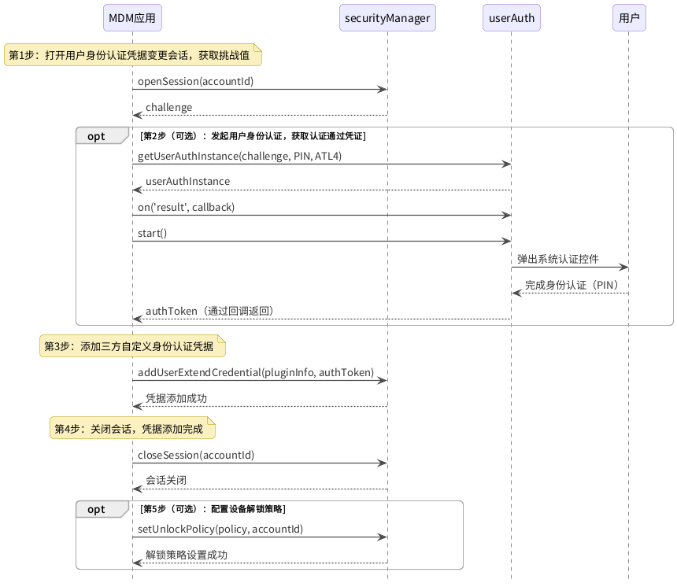
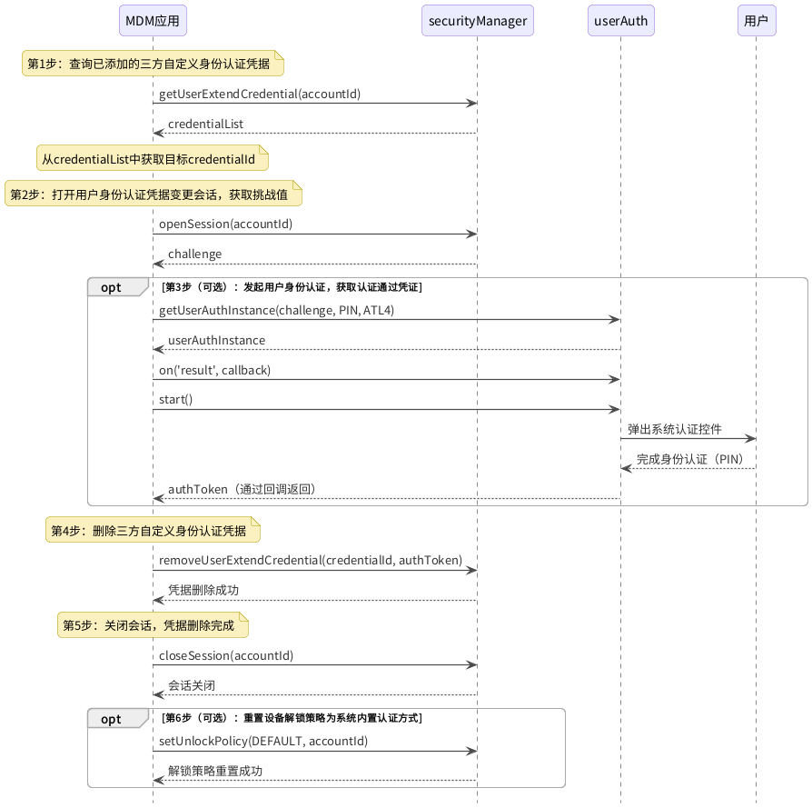

# 三方自定义身份认证

<!--Kit: MDM Kit-->
<!--Subsystem: Customization-->
<!--Owner: @huanleima; @weizai16-->
<!--Designer: @hp_guo-->
<!--Tester: @lpw_work-->
<!--Adviser: @zhang_yixin13-->

从API版本26.0.1开始，系统支持扩展三方自定义认证能力，用于设备解锁登录。锁屏提供USB Key解锁登录界面，支持三方自定义的USB Key身份认证。

USB Key（USB安全密钥）是一种基于硬件的身份认证设备，外形类似U盘，内置安全芯片，可存储数字证书和密钥。用户插入设备后，通过硬件级加密完成身份认证，安全性高于纯密码或生物特征。USB Key广泛应用于企业办公、金融、政务等高安全场景。

MDM（Mobile Device Management，移动设备管理）应用支持为账号添加、删除和查询三方自定义身份认证凭据，并可配置设备解锁策略：系统内置认证单独解锁、三方自定义认证单独解锁、二者融合解锁。

## 接口说明

三方自定义身份认证涉及以下接口：

| 接口名称 | 所属模块 | 功能描述 |
| -------- | -------- | -------- |
| [openSession](../reference/apis-mdm-kit/js-apis-enterprise-securityManager.md#securitymanageropensession) | @kit.MDMKit | 打开用户身份认证凭据变更会话，获取挑战值（challenge），用于防重放攻击。 |
| [closeSession](../reference/apis-mdm-kit/js-apis-enterprise-securityManager.md#securitymanagerclosesession) | @kit.MDMKit | 关闭用户身份认证凭据变更会话。 |
| [addUserExtendCredential](../reference/apis-mdm-kit/js-apis-enterprise-securityManager.md#securitymanageradduserextendcredential) | @kit.MDMKit | 添加三方自定义身份认证凭据。 |
| [removeUserExtendCredential](../reference/apis-mdm-kit/js-apis-enterprise-securityManager.md#securitymanagerremoveuserextendcredential) | @kit.MDMKit | 删除三方自定义身份认证凭据。 |
| [getUserExtendCredential](../reference/apis-mdm-kit/js-apis-enterprise-securityManager.md#securitymanagergetuserextendcredential) | @kit.MDMKit | 查询已添加的三方自定义身份认证凭据列表。 |
| [setUnlockPolicy](../reference/apis-mdm-kit/js-apis-enterprise-securityManager.md#securitymanagersetunlockpolicy) | @kit.MDMKit | 配置设备解锁策略：系统内置认证方式单独解锁、三方自定义认证单独解锁、三方自定义认证与系统内置认证融合解锁。 |
| [getUnlockPolicy](../reference/apis-mdm-kit/js-apis-enterprise-securityManager.md#securitymanagergetunlockpolicy) | @kit.MDMKit | 查询当前设备解锁策略。 |
| [getUserAuthInstance](../reference/apis-user-authentication-kit/js-apis-useriam-userauth.md#userauthgetuserauthinstance10) | @kit.UserAuthenticationKit | 发起用户身份认证，获取认证通过凭证authToken。 |

## 约束与限制

- 三方自定义身份认证功能仅支持PC和2in1设备。
- 应用必须已激活为设备管理员应用（超级管理员）。
- 所有接口仅可在Stage模型下使用。
- 每次调用openSession后，需在操作完成后及时调用closeSession关闭会话，避免会话资源占用。
- 系统会话是唯一的，再次调用openSession时旧会话自动关闭，会话超期（默认10分钟）也会自动关闭。会话关闭后，对应的挑战值和authToken均失效，需重新获取。

## 三方自定义身份认证开发步骤

1. 申请权限：在工程Module对应的[module.json5](../quick-start/module-configuration-file.md)配置文件的`requestPermissions`标签下声明以下权限：

   ``` JSON5
   "requestPermissions": [
     {
       "name": "ohos.permission.ENTERPRISE_MANAGE_SECURITY"
     },
     {
       "name": "ohos.permission.ACCESS_BIOMETRIC"
     }
   ]
   ```

   各权限的用途如下：

   - `ohos.permission.ENTERPRISE_MANAGE_SECURITY`：调用securityManager相关接口的必要权限。
   - `ohos.permission.ACCESS_BIOMETRIC`：调用userAuth发起用户身份认证的必要权限，详见[用户认证权限申请](../security/UserAuthenticationKit/prerequisites.md#申请权限)。

2. 导入模块。

   <!-- @[import_usb_key](https://gitcode.com/openharmony/applications_app_samples/blob/master/code/DocsSample/MDMKit/UsbKeyAuth/entry/src/main/ets/service/UsbKeyAuthService.ets) -->
   
   ``` TypeScript
   import { securityManager } from '@kit.MDMKit';
   import { userAuth } from '@kit.UserAuthenticationKit';
   ```

3. 调用[openSession](../reference/apis-mdm-kit/js-apis-enterprise-securityManager.md#securitymanageropensession)打开用户身份认证凭据变更会话，获取挑战值challenge。

4. （可选）指定用户认证相关参数[AuthParam](../reference/apis-user-authentication-kit/js-apis-useriam-userauth.md#authparam10)（使用上一步获取的challenge作为挑战值），调用[getUserAuthInstance](../reference/apis-user-authentication-kit/js-apis-useriam-userauth.md#userauthgetuserauthinstance10)获取认证对象。

   > **说明：**
   >
   > - 认证类型[UserAuthType](../reference/apis-user-authentication-kit/js-apis-useriam-userauth.md#userauthtype8)仅支持传入`PIN`（锁屏口令认证），不支持人脸、指纹等其他类型。
   > - 认证可信等级[AuthTrustLevel](../reference/apis-user-authentication-kit/js-apis-useriam-userauth.md#authtrustlevel8)仅支持传入`ATL4`，即最高安全等级。
   > - `UserAuthInstance.start`会弹出系统密码认证控件，调用将阻塞直到用户完成认证。此外，锁屏等系统行为也可能关闭该认证控件。
   > - 第4步和第5步为可选步骤：添加凭据时未完成用户身份认证，凭据仍可添加成功，但在三方自定义认证首次解锁设备时，会要求用户补做一次本地PIN或域账号密码认证。原因是三方自定义认证需要从本地PIN或域账号密码认证通过的结果中，继承用于解密文件系统的根密钥。

5. （可选）调用[UserAuthInstance.on('result')](../reference/apis-user-authentication-kit/js-apis-useriam-userauth.md#onresult10-1)订阅认证结果，调用[UserAuthInstance.start](../reference/apis-user-authentication-kit/js-apis-useriam-userauth.md#start10)发起认证，在回调中获取认证通过凭证authToken。

6. 根据业务场景调用[addUserExtendCredential](../reference/apis-mdm-kit/js-apis-enterprise-securityManager.md#securitymanageradduserextendcredential)（添加凭据）或[removeUserExtendCredential](../reference/apis-mdm-kit/js-apis-enterprise-securityManager.md#securitymanagerremoveuserextendcredential)（删除凭据），传入authToken。添加凭据时需同时传入`pluginInfo`，该值为三方自定义认证器的标识名称，由认证器提供方提供。

7. 调用[closeSession](../reference/apis-mdm-kit/js-apis-enterprise-securityManager.md#securitymanagerclosesession)关闭用户身份认证凭据变更会话。

8. （可选）调用[setUnlockPolicy](../reference/apis-mdm-kit/js-apis-enterprise-securityManager.md#securitymanagersetunlockpolicy)配置设备解锁策略。

> **说明：**
>
> 本指南的代码片段摘自[UsbKeyAuth示例工程](https://gitcode.com/openharmony/applications_app_samples/tree/master/code/DocsSample/MDMKit/UsbKeyAuth)。片段外的`accountId`、`pluginInfo`定义见[Constants.ets](https://gitcode.com/openharmony/applications_app_samples/blob/master/code/DocsSample/MDMKit/UsbKeyAuth/entry/src/main/ets/common/Constants.ets)，`Logger`、`MAX_RETRIES`、`isRetryable`、`buildFailureMessage`、`resolveStringResource`为日志与重试的辅助实现，定义见[UsbKeyAuthService.ets](https://gitcode.com/openharmony/applications_app_samples/blob/master/code/DocsSample/MDMKit/UsbKeyAuth/entry/src/main/ets/service/UsbKeyAuthService.ets)，实际开发中可自行替换；入参`uiContext`为当前页面的UI上下文（`@kit.ArkUI`的`UIContext`），用于解析认证控件的标题文案。

## 添加三方自定义身份认证凭据

添加三方自定义身份认证凭据是启用该认证方式的必须步骤，未添加凭据时无法使用三方自定义认证解锁设备。本节流程对应[三方自定义身份认证开发步骤](#三方自定义身份认证开发步骤)中第3步至第8步在添加凭据场景下的具体时序，其中第4步至第5步的用户身份认证、第8步的设备解锁策略均为可选。

添加凭据的流程如下：

1. MDM应用调用`openSession`打开用户身份认证凭据变更会话，获取挑战值（challenge）。
2. （可选）MDM应用调用`getUserAuthInstance`发起用户身份认证，传入challenge、PIN认证类型和ATL4可信等级，弹出系统认证控件，用户完成PIN认证后通过回调获取认证通过凭证authToken。
3. MDM应用调用`addUserExtendCredential`，传入pluginInfo和authToken，添加三方自定义身份认证凭据。
4. MDM应用调用`closeSession`关闭会话，凭据添加完成。
5. （可选）调用`setUnlockPolicy`配置设备解锁策略。



> **说明：**
>
> - `authType`仅支持`PIN`，`authTrustLevel`仅支持`ATL4`。
> - `UserAuthInstance.start`会弹出系统密码认证控件，调用将阻塞直到用户完成认证。此外，锁屏等系统行为也可能关闭该认证控件。

添加凭据与删除凭据时如选择完成用户身份认证以获取authToken，示例工程将其封装为`requestAuthToken`：

<!-- @[request_auth_token](https://gitcode.com/openharmony/applications_app_samples/blob/master/code/DocsSample/MDMKit/UsbKeyAuth/entry/src/main/ets/service/UsbKeyAuthService.ets) -->

``` TypeScript
// 发起用户身份认证，返回 authToken
function requestAuthToken(challenge: Uint8Array, title: string): Promise<Uint8Array> {
  return new Promise((resolve, reject) => {
    const authParam: userAuth.AuthParam = {
      challenge: challenge,
      authType: [userAuth.UserAuthType.PIN],
      authTrustLevel: userAuth.AuthTrustLevel.ATL4,
    };
    const widgetParam: userAuth.WidgetParam = { title };
    const instance: userAuth.UserAuthInstance = userAuth.getUserAuthInstance(authParam, widgetParam);
    instance.on('result', {
      onResult: (result: userAuth.UserAuthResult) => {
        instance.off('result');
        if (result.result === userAuth.UserAuthResultCode.SUCCESS && result.token) {
          resolve(result.token);
        } else {
          reject(new Error(`Authentication failed, result code: ${result.result}`));
        }
      }
    });
    // start会弹出密码认证控件，调用阻塞直到用户完成认证
    instance.start();
  });
}
```

添加凭据的示例代码如下：

<!-- @[bind_usb_key](https://gitcode.com/openharmony/applications_app_samples/blob/master/code/DocsSample/MDMKit/UsbKeyAuth/entry/src/main/ets/service/UsbKeyAuthService.ets) -->

``` TypeScript
export async function bindUsbKey(uiContext: UIContext): Promise<string> {
  let retryCount: number = 0;

  while (retryCount < MAX_RETRIES) {
    try {
      // 第1步：打开会话，获取挑战值
      const challenge: Uint8Array = await securityManager.openSession(accountId);
      Logger.info('Succeeded in opening session.');

      // 第2步：发起用户身份认证，获取认证令牌
      const dialogTitle: string = resolveStringResource(uiContext, $r('app.string.bind_auth_dialog_title'));
      const authToken: Uint8Array = await requestAuthToken(challenge, dialogTitle);
      Logger.info('Authentication succeeded.');

      // 第3步：绑定USB Key凭据
      const addInfo: securityManager.AddCredentialInfo = { pluginInfo, authToken };
      await securityManager.addUserExtendCredential(addInfo, accountId);
      Logger.info('Succeeded in adding USB Key credential.');

      // 第4步：关闭会话
      securityManager.closeSession(accountId);
      Logger.info('USB Key binding completed.');

      // 可选：配置USB Key解锁模式（EXTENDED_AUTH_REQUIRED 表示USB Key+锁屏密码组合认证）
      securityManager.setUnlockPolicy(
        securityManager.UnlockPolicy.EXTENDED_AUTH_REQUIRED,
        accountId
      );
      Logger.info('Succeeded in setting unlock policy.');
      return 'USB Key binding succeeded.';
    } catch (err) {
      const error: BusinessError = err as BusinessError;
      if (isRetryable(error.code) && retryCount < MAX_RETRIES - 1) {
        retryCount++;
        Logger.warn(`Operation failed with code ${error.code}, retrying... (${retryCount}/${MAX_RETRIES})`);
        await new Promise<void>(resolve => setTimeout(resolve, RETRY_INTERVAL));
        continue;
      }
      const failureMessage: string = buildFailureMessage('USB Key binding', error);
      try {
        securityManager.closeSession(accountId);
      } catch (closeErr) {
        // 忽略关闭会话的错误
      }
      return failureMessage;
    }
  }
  return 'USB Key binding failed.';
}
```

## 删除三方自定义身份认证凭据

删除凭据用于移除已添加的三方自定义身份认证凭据，仅在需要撤销该认证方式时执行。本节流程对应[三方自定义身份认证开发步骤](#三方自定义身份认证开发步骤)中第3步至第8步在删除凭据场景下的具体时序，与添加凭据的区别在于：需先查询凭据获取credentialId，且第8步为将设备解锁策略重置为系统内置认证方式（可选）。

删除凭据的流程如下：

1. MDM应用调用`getUserExtendCredential`查询已添加的三方自定义身份认证凭据列表，从返回列表中获取目标credentialId。
2. MDM应用调用`openSession`打开用户身份认证凭据变更会话，获取挑战值（challenge）。
3. （可选）MDM应用调用`getUserAuthInstance`发起用户身份认证，传入challenge、PIN认证类型和ATL4可信等级，用户完成PIN认证后通过回调获取认证通过凭证authToken。
4. MDM应用调用`removeUserExtendCredential`，传入credentialId和authToken，删除三方自定义身份认证凭据。
5. MDM应用调用`closeSession`关闭会话，凭据删除完成。
6. （可选）调用`setUnlockPolicy`将设备解锁策略重置为系统内置认证方式。



> **说明：**
>
> - `authType`仅支持`PIN`，`authTrustLevel`仅支持`ATL4`。
> - `UserAuthInstance.start`会弹出系统密码认证控件，调用将阻塞直到用户完成认证。此外，锁屏等系统行为也可能关闭该认证控件。

删除凭据的示例代码如下：

<!-- @[unbind_usb_key](https://gitcode.com/openharmony/applications_app_samples/blob/master/code/DocsSample/MDMKit/UsbKeyAuth/entry/src/main/ets/service/UsbKeyAuthService.ets) -->

``` TypeScript
export async function unbindUsbKey(uiContext: UIContext): Promise<string> {
  let retryCount: number = 0;

  // 第1步：查询已绑定的USB Key凭据
  let credentials: securityManager.UserExtCredentialInfo[];
  try {
    credentials = await securityManager.getUserExtendCredential(accountId);
  } catch (err) {
    const error: BusinessError = err as BusinessError;
    return buildFailureMessage('USB Key unbinding', error);
  }
  if (credentials.length === 0) {
    Logger.info('No USB Key credential found.');
    return 'No USB Key credential found.';
  }
  const targetCredentialId: Uint8Array = credentials[0].credentialId;

  while (retryCount < MAX_RETRIES) {
    try {
      // 第2步：打开会话，获取挑战值
      const challenge: Uint8Array = await securityManager.openSession(accountId);
      Logger.info('Succeeded in opening session.');

      // 第3步：发起用户身份认证，获取认证令牌
      const dialogTitle: string = resolveStringResource(uiContext, $r('app.string.unbind_auth_dialog_title'));
      const authToken: Uint8Array = await requestAuthToken(challenge, dialogTitle);
      Logger.info('Authentication succeeded.');

      // 第4步：解绑USB Key凭据
      const removeInfo: securityManager.RemoveCredentialInfo = {
        credentialId: targetCredentialId,
        authToken: authToken,
      };
      securityManager.removeUserExtendCredential(removeInfo, accountId);
      Logger.info('Succeeded in removing USB Key credential.');

      securityManager.closeSession(accountId);
      Logger.info('USB Key unbinding completed.');

      // 可选：重置解锁模式为系统默认
      securityManager.setUnlockPolicy(
        securityManager.UnlockPolicy.DEFAULT,
        accountId
      );
      Logger.info('Succeeded in resetting unlock policy.');
      return 'USB Key unbinding succeeded.';
    } catch (err) {
      const error: BusinessError = err as BusinessError;
      if (isRetryable(error.code) && retryCount < MAX_RETRIES - 1) {
        retryCount++;
        Logger.warn(`Operation failed with code ${error.code}, retrying... (${retryCount}/${MAX_RETRIES})`);
        await new Promise<void>(resolve => setTimeout(resolve, RETRY_INTERVAL));
        continue;
      }
      const failureMessage: string = buildFailureMessage('USB Key unbinding', error);
      try {
        securityManager.closeSession(accountId);
      } catch (closeErr) {
        // 忽略关闭会话的错误
      }
      return failureMessage;
    }
  }
  return 'USB Key unbinding failed.';
}
```

## 查询三方自定义身份认证凭据

调用[getUserExtendCredential](../reference/apis-mdm-kit/js-apis-enterprise-securityManager.md#securitymanagergetuserextendcredential)查询已添加的三方自定义身份认证凭据，返回的credentialId用于删除凭据。

<!-- @[query_credentials](https://gitcode.com/openharmony/applications_app_samples/blob/master/code/DocsSample/MDMKit/UsbKeyAuth/entry/src/main/ets/service/UsbKeyAuthService.ets) -->

``` TypeScript
export async function queryCredentials(): Promise<string> {
  try {
    const credentials: securityManager.UserExtCredentialInfo[] =
      await securityManager.getUserExtendCredential(accountId);
    Logger.info(`Found ${credentials.length} USB Key credential(s).`);
    credentials.forEach((cred: securityManager.UserExtCredentialInfo, index: number) => {
      Logger.info(`Credential ${index}: pluginInfo=${cred.pluginInfo}`);
    });
    return `Found ${credentials.length} USB Key credential(s).`;
  } catch (err) {
    const error: BusinessError = err as BusinessError;
    return buildFailureMessage('Query credentials', error);
  }
}
```

## 配置与查询解锁策略

securityManager提供了设备解锁策略的设置与查询接口，示例代码如下：

### 设置解锁策略

<!-- @[set_unlock_policy](https://gitcode.com/openharmony/applications_app_samples/blob/master/code/DocsSample/MDMKit/UsbKeyAuth/entry/src/main/ets/service/UsbKeyAuthService.ets) -->

``` TypeScript
export function setUnlockPolicy(): string {
  try {
    securityManager.setUnlockPolicy(securityManager.UnlockPolicy.EXTENDED_AUTH_ONLY, accountId);
    Logger.info('Succeeded in setting unlock policy to EXTENDED_AUTH_ONLY.');
    return 'Set unlock policy succeeded.';
  } catch (err) {
    const error: BusinessError = err as BusinessError;
    return buildFailureMessage('Set unlock policy', error);
  }
}
```

### 查询解锁策略

<!-- @[get_unlock_policy](https://gitcode.com/openharmony/applications_app_samples/blob/master/code/DocsSample/MDMKit/UsbKeyAuth/entry/src/main/ets/service/UsbKeyAuthService.ets) -->

``` TypeScript
export function getUnlockPolicy(): string {
  try {
    const policy: securityManager.UnlockPolicy = securityManager.getUnlockPolicy(accountId);
    switch (policy) {
      case securityManager.UnlockPolicy.DEFAULT:
        Logger.info('Current unlock policy: DEFAULT (system default).');
        break;
      case securityManager.UnlockPolicy.EXTENDED_AUTH_ONLY:
        Logger.info('Current unlock policy: EXTENDED_AUTH_ONLY (USB Key only).');
        break;
      case securityManager.UnlockPolicy.EXTENDED_AUTH_REQUIRED:
        Logger.info('Current unlock policy: EXTENDED_AUTH_REQUIRED (USB Key + password).');
        break;
      default:
        Logger.info(`Unknown unlock policy: ${policy}`);
    }
    return `Current unlock policy: ${policy}`;
  } catch (err) {
    const error: BusinessError = err as BusinessError;
    return buildFailureMessage('Get unlock policy', error);
  }
}
```

## 异常情况与处理方式

三方自定义身份认证相关接口的错误码详细介绍请参见[企业设备管理错误码](../reference/apis-mdm-kit/errorcode-enterpriseDeviceManager.md)和[通用错误码](../reference/errorcode-universal.md)。

## 重试策略建议

| 异常场景 | 是否可重试 | 建议处理方式 |
| -------- | ---------- | ------------ |
| 会话/认证令牌超期 | 是 | 重新获取会话和authToken后重试。 |
| 服务超时 | 是 | 等待1-2秒后重试，最多重试3次。 |
| 参数错误 | 否 | 检查并修正参数后重试。 |
| 权限/管理员错误 | 否 | 检查权限和管理员状态。 |
| 平台不支持 | 否 | 确认设备类型。 |

## 相关实例

针对三方自定义身份认证开发，有以下相关实例可供参考：

- [基于USB Key的身份认证（ArkTS）](https://gitcode.com/openharmony/applications_app_samples/tree/master/code/DocsSample/MDMKit/UsbKeyAuth)
