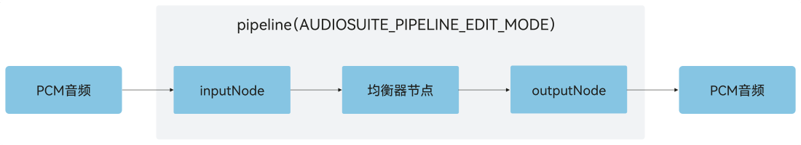
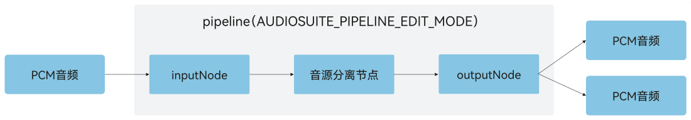
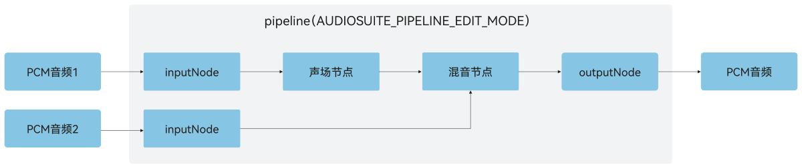

# 离线编辑(C/C++)
<!--Kit: Audio Kit-->
<!--Subsystem: Multimedia-->
<!--Owner: @songshenke-->
<!--Designer: @caixuejiang; @hao-liangfei; @zhanganxiang-->
<!--Tester: @Filger-->
<!--Adviser: @w_Machine_cc-->

从API version 22开始，[OHAudioSuite](../../reference/apis-audio-kit/capi-ohaudiosuite.md)给开发者提供音频离线编辑能力，允许在非实时播放场景下对音频数据进行处理，开发者可以组合多个音频节点实现复杂的音频处理流程。

## 开发基础配置

开发者使用[OHAudioSuite](../../reference/apis-audio-kit/capi-ohaudiosuite.md)提供的离线编辑能力，添加对应的头文件。

### 在CMake脚本中链接动态库

``` cmake
target_link_libraries(sample PUBLIC libohaudiosuite.so)
```
### 添加头文件
开发者通过引入头文件<[native_audio_suite_base.h](../../reference/apis-audio-kit/capi-native-audio-suite-base-h.md)>和<[native_audio_suite_engine.h](../../reference/apis-audio-kit/capi-native-audio-suite-engine-h.md)>，使用音频编创相关API。

```cpp
#include <ohaudiosuite/native_audio_suite_base.h>
#include <ohaudiosuite/native_audio_suite_engine.h>
```

## 开发步骤

详细的API说明请参考：[OHAudioSuite](../../reference/apis-audio-kit/capi-ohaudiosuite.md)。

开发者参考本节内容实现音频离线编辑功能。

### 指定音频节点类型

开发者需要根据业务场景，调用[OH_AudioSuiteNodeBuilder_SetNodeType()](../../reference/apis-audio-kit/capi-native-audio-suite-engine-h.md#oh_audiosuitenodebuilder_setnodetype)接口，指定对应的[OH_AudioNode_Type](../../reference/apis-audio-kit/capi-native-audio-suite-base-h.md#oh_audionode_type)。

### 指定音频节点格式

开发者需要根据业务场景，调用[OH_AudioSuiteNodeBuilder_SetFormat()](../../reference/apis-audio-kit/capi-native-audio-suite-engine-h.md#oh_audiosuitenodebuilder_setformat)或者[OH_AudioSuiteEngine_SetAudioFormat()](../../reference/apis-audio-kit/capi-native-audio-suite-engine-h.md#oh_audiosuiteengine_setaudioformat)接口，设置音频格式（[位深](../../reference/apis-audio-kit/capi-native-audio-suite-base-h.md#oh_audio_sampleformat)、[采样率](../../reference/apis-audio-kit/capi-native-audio-suite-base-h.md#oh_audio_samplerate)、[声道数](../../reference/apis-avcodec-kit/capi-native-audio-channel-layout-h.md#oh_audiochannellayout)等）。

### 基础离线编辑

使用效果节点（如均衡器效果节点）处理输入的PCM（Pulse Code Modulation）音频数据，输出带有该音效的PCM音频数据。

**图1**：基础离线编辑示意图




1. 创建引擎和管线。
   
   ```cpp
   // 创建引擎。
   OH_AudioSuiteEngine *audioSuiteEngine = nullptr;
   OH_AudioSuiteEngine_Create(&audioSuiteEngine);

   // 创建管线。
   OH_AudioSuitePipeline *audioSuitePipeline = nullptr;
   OH_AudioSuiteEngine_CreatePipeline(
       audioSuiteEngine, &audioSuitePipeline, OH_AudioSuite_PipelineWorkMode::AUDIOSUITE_PIPELINE_EDIT_MODE);
   ```

2. 创建输入、输出、均衡器节点并连接组网。

   创建输入节点需要实现自定义回调函数`InputNodeWriteDataCallBack`，函数类型为[OH_InputNode_RequestDataCallback()](../../reference/apis-audio-kit/capi-native-audio-suite-engine-h.md#oh_inputnode_requestdatacallback)，调用[OH_AudioSuiteNodeBuilder_SetRequestDataCallback()](../../reference/apis-audio-kit/capi-native-audio-suite-engine-h.md#oh_audiosuitenodebuilder_setrequestdatacallback)接口设置回调函数。
   ```cpp
   struct AudioDataInfo {
       uint8_t *buffer = nullptr;  // 音频数据。
       int32_t bufferSize = 0;     // 音频数据总大小。
       int32_t totalWriteSize = 0; // 处理过的音频数据总大小。
   };

   // 输入节点请求数据的回调函数。
   static int32_t InputNodeWriteDataCallBack(
       OH_AudioNode *audioNode,
       void *userData,
       void *audioData,
       int32_t audioDataSize,
       bool *finished)
   {
       if ((audioNode == nullptr) || (userData == nullptr) ||
           (audioData == nullptr) || (audioDataSize <= 0) || (finished == nullptr)) {
           return -1;
       }

       struct AudioDataInfo *info = static_cast<struct AudioDataInfo *>(userData);
       // 要处理的音频大小。
       int32_t actualDataSize = std::min(audioDataSize, info->bufferSize - info->totalWriteSize);
       // 将PCM音频数据写入audioData。
       memcpy(static_cast<void *>(audioData), info->buffer + info->totalWriteSize, actualDataSize);
       info->totalWriteSize += actualDataSize;

       // 音频数据全部处理完。
       if (info->totalWriteSize >= info->bufferSize) {
           *finished = true;
       }
       return actualDataSize;
   }

   // 创建节点构造器。
   OH_AudioNodeBuilder *nodeBuilder = nullptr;
   OH_AudioSuiteNodeBuilder_Create(&nodeBuilder);
   OH_AudioSuiteNodeBuilder_SetNodeType(nodeBuilder, OH_AudioNode_Type::INPUT_NODE_TYPE_DEFAULT);

   // 配置音频数据格式，开发者根据要处理的音频数据格式设置采样率、声道分布、声道数、位深、编码格式参数。
   OH_AudioFormat audioFormatInput;
   audioFormatInput.samplingRate = OH_Audio_SampleRate::SAMPLE_RATE_48000;
   audioFormatInput.channelLayout = OH_AudioChannelLayout::CH_LAYOUT_STEREO;
   audioFormatInput.channelCount = 2;
   audioFormatInput.sampleFormat = OH_Audio_SampleFormat::AUDIO_SAMPLE_S16LE;
   audioFormatInput.encodingType = OH_Audio_EncodingType::AUDIO_ENCODING_TYPE_RAW;
   OH_AudioSuiteNodeBuilder_SetFormat(nodeBuilder, audioFormatInput);
   // 设置音频流的回调。
   struct AudioDataInfo audioInfo;
   audioInfo.buffer = nullptr; // 开发者根据业务场景存放要处理的音频数据。
   audioInfo.bufferSize = 0; // 开发者根据业务场景存放要处理的音频数据大小。
   audioInfo.totalWriteSize = 0;
   void *userData = static_cast<void *>(&audioInfo);
   OH_AudioSuiteNodeBuilder_SetRequestDataCallback(nodeBuilder, InputNodeWriteDataCallBack, userData);
   // 创建输入节点。
   OH_AudioNode *inputNode = nullptr;
   OH_AudioSuiteEngine_CreateNode(audioSuitePipeline, nodeBuilder, &inputNode);

   // 重置构造器配置并设置为均衡器节点类型。
   OH_AudioSuiteNodeBuilder_Reset(nodeBuilder);
   OH_AudioSuiteNodeBuilder_SetNodeType(nodeBuilder, OH_AudioNode_Type::EFFECT_NODE_TYPE_EQUALIZER);
   // 创建均衡器节点。
   OH_AudioNode *eqNode = nullptr;
   OH_AudioSuiteEngine_CreateNode(audioSuitePipeline, nodeBuilder, &eqNode);
   // 设置均衡器节点效果为默认。
   OH_AudioSuiteEngine_SetEqualizerFrequencyBandGains(eqNode, OH_EQUALIZER_PARAM_DEFAULT);

   // 重置构造器配置并设置为输出节点类型。
   OH_AudioSuiteNodeBuilder_Reset(nodeBuilder);
   OH_AudioSuiteNodeBuilder_SetNodeType(nodeBuilder, OH_AudioNode_Type::OUTPUT_NODE_TYPE_DEFAULT);
   // 配置音频数据格式，开发者根据预期输出的音频格式设置采样率、声道分布、声道数、位深、编码格式参数。
   OH_AudioFormat audioFormatOutput;
   audioFormatOutput.samplingRate = OH_Audio_SampleRate::SAMPLE_RATE_48000;
   audioFormatOutput.channelLayout = OH_AudioChannelLayout::CH_LAYOUT_STEREO;
   audioFormatOutput.channelCount = 2;
   audioFormatOutput.sampleFormat = OH_Audio_SampleFormat::AUDIO_SAMPLE_S16LE;
   audioFormatOutput.encodingType = OH_Audio_EncodingType::AUDIO_ENCODING_TYPE_RAW;
   OH_AudioSuiteNodeBuilder_SetFormat(nodeBuilder, audioFormatOutput);
   // 创建输出节点。
   OH_AudioNode *outputNode = nullptr;
   OH_AudioSuiteEngine_CreateNode(audioSuitePipeline, nodeBuilder, &outputNode);

   // 销毁节点构造器。
   OH_AudioSuiteNodeBuilder_Destroy(nodeBuilder);

   // 连接各个节点组成组网。
   OH_AudioSuiteEngine_ConnectNodes(inputNode, eqNode);
   OH_AudioSuiteEngine_ConnectNodes(eqNode, outputNode);
   ```

3. 渲染音频数据。

   开发者调用[OH_AudioSuiteEngine_RenderFrame()](../../reference/apis-audio-kit/capi-native-audio-suite-engine-h.md#oh_audiosuiteengine_renderframe)接口渲染并获取PCM音频数据。
   
   ```cpp
   int32_t byteSize = 2; // OH_Audio_SampleFormat::AUDIO_SAMPLE_S16LE格式对应的字节大小。
   // 根据输出节点的格式计算单帧处理数据大小。
   // 1000是时间转换单位，20表示的是20ms的音频采样数据，如果samplingRate为11025请使用40ms来计算。
   int32_t frameSize = 20 * audioFormatOutput.samplingRate * audioFormatOutput.channelCount * byteSize / 1000;
   // 用于接收渲染后的输出音频数据。
   uint8_t *audioData = (uint8_t *)malloc(frameSize);
   int32_t responseSize = 0;
   bool finished = false;

   // 渲染。
   OH_AudioSuiteEngine_StartPipeline(audioSuitePipeline);
   do {
       OH_AudioSuite_Result result = OH_AudioSuiteEngine_RenderFrame(
           audioSuitePipeline, static_cast<void *>(audioData), frameSize, &responseSize, &finished);
       if ((result != OH_AudioSuite_Result::AUDIOSUITE_SUCCESS) || (responseSize <= 0)) {
           // 本次音频编创渲染失败。
           break;
       } else {
           // audioData是渲染过后的音频数据，音频数据长度为responseSize，开发者根据业务场景自行使用或者保存。
       }
   } while (!finished);
   OH_AudioSuiteEngine_StopPipeline(audioSuitePipeline);
   free(audioData);
   audioData = nullptr;
   ```

4. 资源销毁。
   
   ```cpp
   // 销毁节点。
   OH_AudioSuiteEngine_DestroyNode(inputNode);
   OH_AudioSuiteEngine_DestroyNode(eqNode);
   OH_AudioSuiteEngine_DestroyNode(outputNode);

   // 销毁管线。
   OH_AudioSuiteEngine_DestroyPipeline(audioSuitePipeline);

   // 销毁引擎。
   OH_AudioSuiteEngine_Destroy(audioSuiteEngine);
   ```

### 音源分离场景

使用音源分离节点分离输入的PCM音频数据为人声和背景声，然后通过输出节点分别输出这两路数据。

**图2**：音源分离编辑示意图



示例代码如下：

1. 创建引擎和管线。
   ```cpp
   // 创建引擎。
   OH_AudioSuiteEngine *audioSuiteEngine = nullptr;
   OH_AudioSuiteEngine_Create(&audioSuiteEngine);

   // 创建管线。
   OH_AudioSuitePipeline *audioSuitePipeline = nullptr;
   OH_AudioSuiteEngine_CreatePipeline(
       audioSuiteEngine, &audioSuitePipeline, OH_AudioSuite_PipelineWorkMode::AUDIOSUITE_PIPELINE_EDIT_MODE);
   ```

2. 创建输入、输出、音源分离节点并连接。

   创建输入节点需要实现自定义回调函数`InputNodeWriteDataCallBack`，函数类型为[OH_InputNode_RequestDataCallback()](../../reference/apis-audio-kit/capi-native-audio-suite-engine-h.md#oh_inputnode_requestdatacallback)，调用[OH_AudioSuiteNodeBuilder_SetRequestDataCallback()](../../reference/apis-audio-kit/capi-native-audio-suite-engine-h.md#oh_audiosuitenodebuilder_setrequestdatacallback)接口设置回调函数。

   ```cpp
   struct AudioDataInfo {
       uint8_t *buffer = nullptr;  // 音频数据。
       int32_t bufferSize = 0;     // 音频数据总大小。
       int32_t totalWriteSize = 0; // 处理过的音频数据总大小。
   };

   // 输入节点请求数据的回调函数。
   static int32_t InputNodeWriteDataCallBack(
       OH_AudioNode *audioNode,
       void *userData,
       void *audioData,
       int32_t audioDataSize,
       bool *finished)
   {
       if ((audioNode == nullptr) || (userData == nullptr) ||
           (audioData == nullptr) || (audioDataSize <= 0) || (finished == nullptr)) {
           return -1;
       }

       struct AudioDataInfo *info = static_cast<struct AudioDataInfo *>(userData);
       // 要处理的音频大小。
       int32_t actualDataSize = std::min(audioDataSize, info->bufferSize - info->totalWriteSize);
       // 将PCM音频数据写入audioData。
       memcpy(static_cast<void *>(audioData), info->buffer + info->totalWriteSize, actualDataSize);
       info->totalWriteSize += actualDataSize;

       // 音频数据全部处理完。
       if (info->totalWriteSize >= info->bufferSize) {
           *finished = true;
       }
       return actualDataSize;
   }

   // 创建节点构造器。
   OH_AudioNodeBuilder *nodeBuilder = nullptr;
   OH_AudioSuiteNodeBuilder_Create(&nodeBuilder);
   OH_AudioSuiteNodeBuilder_SetNodeType(nodeBuilder, OH_AudioNode_Type::INPUT_NODE_TYPE_DEFAULT);

   // 配置音频数据格式，开发者根据要处理的音频数据格式设置采样率、声道分布、声道数、位深、编码格式参数。
   OH_AudioFormat audioFormatInput;
   audioFormatInput.samplingRate = OH_Audio_SampleRate::SAMPLE_RATE_48000;
   audioFormatInput.channelLayout = OH_AudioChannelLayout::CH_LAYOUT_STEREO;
   audioFormatInput.channelCount = 2;
   audioFormatInput.sampleFormat = OH_Audio_SampleFormat::AUDIO_SAMPLE_S16LE;
   audioFormatInput.encodingType = OH_Audio_EncodingType::AUDIO_ENCODING_TYPE_RAW;
   OH_AudioSuiteNodeBuilder_SetFormat(nodeBuilder, audioFormatInput);

   struct AudioDataInfo audioInfo;
   audioInfo.buffer = nullptr; // 开发者根据业务场景存放要处理的音频数据。
   audioInfo.bufferSize = 0; // 开发者根据业务场景存放要处理的音频数据大小。
   audioInfo.totalWriteSize = 0;
   void *userData = static_cast<void *>(&audioInfo);
   // 设置音频流的回调。
   OH_AudioSuiteNodeBuilder_SetRequestDataCallback(nodeBuilder, InputNodeWriteDataCallBack, userData);

   // 创建输入节点。
   OH_AudioNode *inputNode = nullptr;
   OH_AudioSuiteEngine_CreateNode(audioSuitePipeline, nodeBuilder, &inputNode);

   // 重置构造器配置并设置为音源分离节点类型。
   OH_AudioSuiteNodeBuilder_Reset(nodeBuilder);
   OH_AudioSuiteNodeBuilder_SetNodeType(
       nodeBuilder, OH_AudioNode_Type::EFFECT_MULTII_OUTPUT_NODE_TYPE_AUDIO_SEPARATION);

   // 创建音源分离节点。
   OH_AudioNode *aissNode = nullptr;
   OH_AudioSuiteEngine_CreateNode(audioSuitePipeline, nodeBuilder, &aissNode);

   // 重置构造器配置并设置为输出节点类型。
   OH_AudioSuiteNodeBuilder_Reset(nodeBuilder);
   OH_AudioSuiteNodeBuilder_SetNodeType(nodeBuilder, OH_AudioNode_Type::OUTPUT_NODE_TYPE_DEFAULT);
   // 配置音频数据格式，开发者根据预期输出的音频格式设置采样率、声道分布、声道数、位深、编码格式参数。
   OH_AudioFormat audioFormatOutput;
   audioFormatOutput.samplingRate = OH_Audio_SampleRate::SAMPLE_RATE_48000;
   audioFormatOutput.channelLayout = OH_AudioChannelLayout::CH_LAYOUT_STEREO;
   audioFormatOutput.channelCount = 2;
   audioFormatOutput.sampleFormat = OH_Audio_SampleFormat::AUDIO_SAMPLE_S16LE;
   audioFormatOutput.encodingType = OH_Audio_EncodingType::AUDIO_ENCODING_TYPE_RAW;
   OH_AudioSuiteNodeBuilder_SetFormat(nodeBuilder, audioFormatOutput);

   // 创建输出节点。
   OH_AudioNode *outputNode = nullptr;
   OH_AudioSuiteEngine_CreateNode(audioSuitePipeline, nodeBuilder, &outputNode);

   // 销毁节点构造器。
   OH_AudioSuiteNodeBuilder_Destroy(nodeBuilder);

   // 连接各个节点组成组网。
   OH_AudioSuiteEngine_ConnectNodes(inputNode, aissNode);
   OH_AudioSuiteEngine_ConnectNodes(aissNode, outputNode);
   ```

3. 渲染音频数据。

   包含音源分离节点的管线使用[OH_AudioSuiteEngine_MultiRenderFrame()](../../reference/apis-audio-kit/capi-native-audio-suite-engine-h.md#oh_audiosuiteengine_multirenderframe)接口渲染并获取两路PCM音频数据。

   ```cpp
   int32_t byteSize = 2; // OH_Audio_SampleFormat::AUDIO_SAMPLE_S16LE格式对应的字节大小。
   // 根据输出节点的格式计算单帧处理数据大小。
   // 1000是时间转换单位，20表示的是20ms的音频采样数据，如果samplingRate为11025请使用40ms来计算。
   int32_t frameSize = 20 * audioFormatOutput.samplingRate * audioFormatOutput.channelCount * byteSize / 1000;
   // 用于接收渲染后的输出音频数据。
   OH_AudioDataArray audioDataArray;
   int32_t outPutNum = 2;
   audioDataArray.audioDataArray = (void **)malloc(outPutNum * sizeof(void *));
   for(int32_t i = 0; i < outPutNum; i++) {
       audioDataArray.audioDataArray[i] = (void *)malloc(frameSize);
   }
   audioDataArray.arraySize = outPutNum;
   audioDataArray.requestFrameSize = frameSize;
   int32_t responseSize = 0;
   bool finished = false;

   // 渲染。
   OH_AudioSuiteEngine_StartPipeline(audioSuitePipeline);
   do {
       OH_AudioSuite_Result result = OH_AudioSuiteEngine_MultiRenderFrame(
           audioSuitePipeline, &audioDataArray, &responseSize, &finished);
       if ((result != OH_AudioSuite_Result::AUDIOSUITE_SUCCESS) || (responseSize <= 0)) {
           // 本次音频编创渲染失败。
           break;
       } else {
           // audioDataArray.audioDataArray[0]是提取的人声。
           // audioDataArray.audioDataArray[1]是提取的背景声。
           // 音频数据长度为responseSize，开发者根据业务场景自行使用或者保存。
       }
   } while (!finished);
   OH_AudioSuiteEngine_StopPipeline(audioSuitePipeline);

   for(int32_t i = 0; i < outPutNum; i++) {
       free(audioDataArray.audioDataArray[i]);
       audioDataArray.audioDataArray[i] = nullptr;
   }
   free(audioDataArray.audioDataArray);
   audioDataArray.audioDataArray = nullptr;
   ```

4. 资源销毁。
   
   ```cpp
   // 销毁节点。
   OH_AudioSuiteEngine_DestroyNode(inputNode);
   OH_AudioSuiteEngine_DestroyNode(aissNode);
   OH_AudioSuiteEngine_DestroyNode(outputNode);

   // 销毁管线。
   OH_AudioSuiteEngine_DestroyPipeline(audioSuitePipeline);

   // 销毁引擎。
   OH_AudioSuiteEngine_Destroy(audioSuiteEngine);
   ```

### 混音与级联

输入多路PCM音频数据，使用混音节点进行混音，输出混音后的PCM音频数据。

**图3**：级联编辑示意图



示例代码如下：

1. 创建引擎和管线。
   ```cpp
   // 创建引擎。
   OH_AudioSuiteEngine *audioSuiteEngine = nullptr;
   OH_AudioSuiteEngine_Create(&audioSuiteEngine);

   // 创建管线。
   OH_AudioSuitePipeline *audioSuitePipeline = nullptr;
   OH_AudioSuiteEngine_CreatePipeline(
       audioSuiteEngine, &audioSuitePipeline, OH_AudioSuite_PipelineWorkMode::AUDIOSUITE_PIPELINE_EDIT_MODE);
   ```

2. 创建输入、输出、效果类节点并连接。

   由于混音功能有多个输入节点，需单独设置回调函数`InputNodeWriteDataCallBack`中的`userData`参数来区分多个输入节点，从而实现多个PCM音频数据的输入。`InputNodeWriteDataCallBack`函数类型为[OH_InputNode_RequestDataCallback()](../../reference/apis-audio-kit/capi-native-audio-suite-engine-h.md#oh_inputnode_requestdatacallback)。

   ```cpp
   struct AudioDataInfo {
       uint8_t *buffer = nullptr;  // 音频数据。
       int32_t bufferSize = 0;     // 音频数据总大小。
       int32_t totalWriteSize = 0; // 处理过的音频数据总大小。
   };

   // 输入节点请求数据的回调函数。
   static int32_t InputNodeWriteDataCallBack(
       OH_AudioNode *audioNode,
       void *userData,
       void *audioData,
       int32_t audioDataSize,
       bool *finished)
   {
       if ((audioNode == nullptr) || (userData == nullptr) ||
           (audioData == nullptr) || (audioDataSize <= 0) || (finished == nullptr)) {
           return -1;
       }

       struct AudioDataInfo *info = static_cast<struct AudioDataInfo *>(userData);
       // 要处理的音频大小。
       int32_t actualDataSize = std::min(audioDataSize, info->bufferSize - info->totalWriteSize);
       // 将PCM音频数据写入audioData。
       memcpy(static_cast<void *>(audioData), info->buffer + info->totalWriteSize, actualDataSize);
       info->totalWriteSize += actualDataSize;

       // 音频数据全部处理完。
       if (info->totalWriteSize >= info->bufferSize) {
           *finished = true;
       }
       return actualDataSize;
   }

   // 创建节点构造器。
   OH_AudioNodeBuilder *nodeBuilder = nullptr;
   OH_AudioSuiteNodeBuilder_Create(&nodeBuilder);
   OH_AudioSuiteNodeBuilder_SetNodeType(nodeBuilder, OH_AudioNode_Type::INPUT_NODE_TYPE_DEFAULT);
   // 配置音频数据格式，开发者根据要处理的音频数据格式设置采样率、声道分布、声道数、位深、编码格式参数。
   OH_AudioFormat audioFormatInput;
   audioFormatInput.samplingRate = OH_Audio_SampleRate::SAMPLE_RATE_48000;
   audioFormatInput.channelLayout = OH_AudioChannelLayout::CH_LAYOUT_STEREO;
   audioFormatInput.channelCount = 2;
   audioFormatInput.sampleFormat = OH_Audio_SampleFormat::AUDIO_SAMPLE_S16LE;
   audioFormatInput.encodingType = OH_Audio_EncodingType::AUDIO_ENCODING_TYPE_RAW;
   OH_AudioSuiteNodeBuilder_SetFormat(nodeBuilder, audioFormatInput);
   // 设置第一个音频流的回调。
   struct AudioDataInfo audioInfoForField;
   audioInfoForField.buffer = nullptr; // 开发者根据业务场景存放要处理的音频数据。
   audioInfoForField.bufferSize = 0; // 开发者根据业务场景存放要处理的音频数据大小。
   audioInfoForField.totalWriteSize = 0;
   void *userData = static_cast<void *>(&audioInfoForField);
   OH_AudioSuiteNodeBuilder_SetRequestDataCallback(nodeBuilder, InputNodeWriteDataCallBack, userData);
   // 创建第一个输入节点。
   OH_AudioNode *inputNodeForField = nullptr;
   OH_AudioSuiteEngine_CreateNode(audioSuitePipeline, nodeBuilder, &inputNodeForField);

   // 重置构造器配置并设置为输入节点类型。
   OH_AudioSuiteNodeBuilder_Reset(nodeBuilder);
   OH_AudioSuiteNodeBuilder_SetNodeType(nodeBuilder, OH_AudioNode_Type::INPUT_NODE_TYPE_DEFAULT);
   OH_AudioSuiteNodeBuilder_SetFormat(nodeBuilder, audioFormatInput);
   // 设置第二个音频流的回调。
   struct AudioDataInfo audioInfoForMix;
   audioInfoForMix.buffer = nullptr; // 开发者根据业务场景存放要处理的音频数据。
   audioInfoForMix.bufferSize = 0; // 开发者根据业务场景存放要处理的音频数据大小。
   audioInfoForMix.totalWriteSize = 0;
   userData = static_cast<void *>(&audioInfoForMix);
   OH_AudioSuiteNodeBuilder_SetRequestDataCallback(nodeBuilder, InputNodeWriteDataCallBack, userData);
   // 创建第二个输入节点。
   OH_AudioNode *inputNodeForMix = nullptr;
   OH_AudioSuiteEngine_CreateNode(audioSuitePipeline, nodeBuilder, &inputNodeForMix);

   // 重置构造器配置并设置为输入节点类型。
   OH_AudioSuiteNodeBuilder_Reset(nodeBuilder);
   OH_AudioSuiteNodeBuilder_SetNodeType(nodeBuilder, OH_AudioNode_Type::EFFECT_NODE_TYPE_SOUND_FIELD);
   // 创建声场节点并设置声场模式为聆听。
   OH_AudioNode *fieldNode = nullptr;
   OH_AudioSuiteEngine_CreateNode(audioSuitePipeline, nodeBuilder, &fieldNode);
   OH_AudioSuiteEngine_SetSoundFieldType(fieldNode, SOUND_FIELD_FRONT_FACING);

   // 重置构造器配置并设置为输入节点类型。
   OH_AudioSuiteNodeBuilder_Reset(nodeBuilder);
   OH_AudioSuiteNodeBuilder_SetNodeType(nodeBuilder, OH_AudioNode_Type::EFFECT_NODE_TYPE_AUDIO_MIXER);
   OH_AudioNode *mixerNode = nullptr;
   // 创建混音节点。
   OH_AudioSuiteEngine_CreateNode(audioSuitePipeline, nodeBuilder, &mixerNode);

   // 重置构造器配置并设置为输入节点类型。
   OH_AudioSuiteNodeBuilder_Reset(nodeBuilder);
   OH_AudioSuiteNodeBuilder_SetNodeType(nodeBuilder, OH_AudioNode_Type::OUTPUT_NODE_TYPE_DEFAULT);
   // 配置音频数据格式，开发者根据预期输出的音频格式设置采样率、声道分布、声道数、位深、编码格式参数。
   OH_AudioFormat audioFormatOutput;
   audioFormatOutput.samplingRate = OH_Audio_SampleRate::SAMPLE_RATE_48000;
   audioFormatOutput.channelLayout = OH_AudioChannelLayout::CH_LAYOUT_STEREO;
   audioFormatOutput.channelCount = 2;
   audioFormatOutput.sampleFormat = OH_Audio_SampleFormat::AUDIO_SAMPLE_S16LE;
   audioFormatOutput.encodingType = OH_Audio_EncodingType::AUDIO_ENCODING_TYPE_RAW;
   OH_AudioSuiteNodeBuilder_SetFormat(nodeBuilder, audioFormatOutput);
   // 创建输出节点。
   OH_AudioNode *outputNode = nullptr;
   OH_AudioSuiteEngine_CreateNode(audioSuitePipeline, nodeBuilder, &outputNode);

   // 销毁输出节点构造器。
   OH_AudioSuiteNodeBuilder_Destroy(nodeBuilder);

   // 连接各个节点组成组网。
   OH_AudioSuiteEngine_ConnectNodes(inputNodeForField, fieldNode);
   OH_AudioSuiteEngine_ConnectNodes(fieldNode, mixerNode);
   OH_AudioSuiteEngine_ConnectNodes(inputNodeForMix, mixerNode);
   OH_AudioSuiteEngine_ConnectNodes(mixerNode, outputNode);
   ```

3. 渲染音频数据。

   开发者调用[OH_AudioSuiteEngine_RenderFrame()](../../reference/apis-audio-kit/capi-native-audio-suite-engine-h.md#oh_audiosuiteengine_renderframe)接口渲染并获取PCM音频数据。
   
   ```cpp
   int32_t byteSize = 2; // OH_Audio_SampleFormat::AUDIO_SAMPLE_S16LE格式对应的字节大小。
   // 根据输出节点的格式计算单帧处理数据大小。
   // 1000是时间转换单位，20表示的是20ms的音频采样数据，如果samplingRate为11025请使用40ms来计算。
   int32_t frameSize = 20 * audioFormatOutput.samplingRate * audioFormatOutput.channelCount * byteSize / 1000;
   // 用于接收渲染后的输出音频数据。
   uint8_t *audioData = (uint8_t *)malloc(frameSize);
   int32_t responseSize = 0;
   bool finished = false;

   // 渲染。
   OH_AudioSuiteEngine_StartPipeline(audioSuitePipeline);
   do {
       OH_AudioSuite_Result result = OH_AudioSuiteEngine_RenderFrame(
           audioSuitePipeline, static_cast<void *>(audioData), frameSize, &responseSize, &finished);
       if ((result != OH_AudioSuite_Result::AUDIOSUITE_SUCCESS) || (responseSize <= 0)) {
           // 本次音频编创渲染失败。
           break;
       } else {
           // audioData是渲染过后的音频数据，音频数据长度为responseSize，开发者根据业务场景自行使用或者保存。
       }
   } while (!finished);
   OH_AudioSuiteEngine_StopPipeline(audioSuitePipeline);
   free(audioData);
   audioData = nullptr;
   ```

4. 资源销毁。
   
   ```cpp
   // 销毁节点。
   OH_AudioSuiteEngine_DestroyNode(inputNodeForMix);
   OH_AudioSuiteEngine_DestroyNode(inputNodeForField);
   OH_AudioSuiteEngine_DestroyNode(fieldNode);
   OH_AudioSuiteEngine_DestroyNode(mixerNode);
   OH_AudioSuiteEngine_DestroyNode(outputNode);

   // 销毁管线。
   OH_AudioSuiteEngine_DestroyPipeline(audioSuitePipeline);

   // 销毁引擎。
   OH_AudioSuiteEngine_Destroy(audioSuiteEngine);
   ```

<!--RP1-->
<!--RP1End-->
