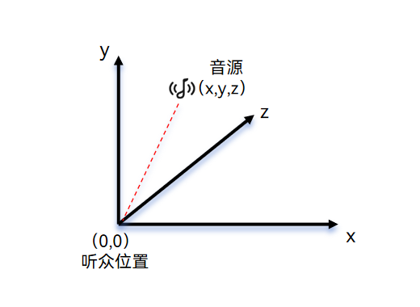
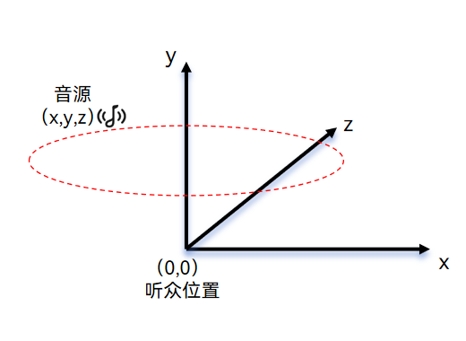
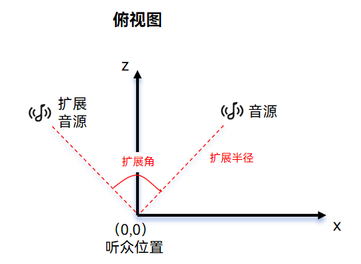

# 空间渲染(C/C++)
 <!--Kit: Audio Kit-->
 <!--Subsystem: Multimedia-->
 <!--Owner: @xxngwang-->
 <!--Designer: @jay-liusong-->
 <!--Tester: @Filger-->
 <!--Adviser: @w_Machine_cc-->

从API version 23开始，[OHAudioSuite](../../reference/apis-audio-kit/capi-ohaudiosuite.md)给开发者提供空间渲染效果节点[EFFECT_NODE_TYPE_SPACE_RENDER](../../reference/apis-audio-kit/capi-native-audio-suite-base-h.md#oh_audionode_type)，用于实现三维空间音频渲染能力。空间渲染效果节点提供固定摆位、旋转及扩展三种[工作模式](audio-suite-space-render.md#工作模式)，将音频源在三维空间中进行定位、旋转和扩展处理，助力开发者高效构建沉浸式空间音频体验。

## 坐标系说明

空间渲染采用左手坐标系，即伸出左手，用拇指和食指形成一个"L"形。

- 拇指指向右侧表示：X轴正方向。
- 食指向上表示：Y轴正方向。
- 其余手指指向前表示：Z轴正方向。

坐标系参数说明：
- X坐标：左右方向。负值表示左侧，正值表示右侧。取值范围为[-5.0, 5.0]，单位为米（m）。
- Y坐标：上下方向。负值表示下方，正值表示上方。取值范围为[-5.0, 5.0]，单位为米（m）。
- Z坐标：前后方向。负值表示后方，正值表示前方。取值范围为[-5.0, 5.0]，单位为米（m）。

## 工作模式

### 固定摆位模式
固定摆位模式用于将音频源放置在特定空间的固定位置，适用于需要固定音源位置的场景，用户可通过调用[OH_AudioSuiteEngine_SetSpaceRenderPositionParams](../../reference/apis-audio-kit/capi-native-audio-suite-engine-h.md#oh_audiosuiteengine_setspacerenderpositionparams)对空间渲染节点进行参数配置。固定摆位示意图如下：



### 旋转模式
旋转模式让音频源在指定位置设定单周环绕时间与时针方向进行动态渲染，用户可通过调用[OH_AudioSuiteEngine_SetSpaceRenderRotationParams](../../reference/apis-audio-kit/capi-native-audio-suite-engine-h.md#oh_audiosuiteengine_setspacerenderrotationparams)对空间渲染节点进行参数配置。旋转模式示意图如下：



### 扩展模式
扩展模式将音频源按照半径和角度进行扩展，用户可通过调用[OH_AudioSuiteEngine_SetSpaceRenderExtensionParams](../../reference/apis-audio-kit/capi-native-audio-suite-engine-h.md#oh_audiosuiteengine_setspacerenderextensionparams)对空间渲染节点进行参数配置。扩展模式示意图如下：



## 开发基础配置

开发者使用[OHAudioSuite](../../reference/apis-audio-kit/capi-ohaudiosuite.md)提供的空间渲染效果节点，需要添加对应的头文件并链接动态库。

### 在CMake脚本中链接动态库

``` cmake
target_link_libraries(sample PUBLIC libohaudio.so libohaudiosuite.so)
```

### 添加头文件

通过引入头文件使用音频编创相关API。

<!-- @[audioSuite_SpaceRenderEffectInclude](https://gitcode.com/openharmony/applications_app_samples/blob/master/code/DocsSample/Media/Audio/AudioSuiteSample/entry/src/main/cpp/space_render_rotation.h) -->

``` C
#include <ohaudiosuite/native_audio_suite_base.h>
#include <ohaudiosuite/native_audio_suite_engine.h>
#include <ohaudio/native_audiorenderer.h>
#include <ohaudio/native_audiostreambuilder.h>
```

## 开发步骤

### 接口调用

详细的API说明请参考[OHAudioSuite](../../reference/apis-audio-kit/capi-ohaudiosuite.md)。

### 空间渲染固定摆位效果

1. 创建引擎和管线。

   <!-- @[audioSuite_CreateSpaceRenderRotationEngineAndPipeline](https://gitcode.com/openharmony/applications_app_samples/blob/master/code/DocsSample/Media/Audio/AudioSuiteSample/entry/src/main/cpp/space_render_rotation.cpp) -->
   
   ``` C++
   // 示例接口未包含返回值校验，实际使用时请务必添加校验逻辑。
   // 创建引擎。
   OH_AudioSuiteEngine_Create(&g_audioSuiteEngine);
   
   // 创建实时播放空间渲染的管线。
   OH_AudioSuiteEngine_CreatePipeline(g_audioSuiteEngine, &g_audioSuitePipeline,
                                      OH_AudioSuite_PipelineWorkMode::AUDIOSUITE_PIPELINE_REALTIME_MODE);
   ```

2. 创建输入、输出、空间渲染等节点并连接组网。

   创建输入节点需要实现自定义回调函数`InputNodeWriteDataCallBack`，函数类型为[OH_InputNode_RequestDataCallback()](../../reference/apis-audio-kit/capi-native-audio-suite-engine-h.md#oh_inputnode_requestdatacallback)，调用[OH_AudioSuiteNodeBuilder_SetRequestDataCallback()](../../reference/apis-audio-kit/capi-native-audio-suite-engine-h.md#oh_audiosuitenodebuilder_setrequestdatacallback)接口设置回调函数。

   <!-- @[audioSuite_AudioDataInfo](https://gitcode.com/openharmony/applications_app_samples/blob/master/code/DocsSample/Media/Audio/AudioSuiteSample/entry/src/main/cpp/pcm_file_utils.h) -->
   
   ``` C
   struct AudioDataInfo {
       uint8_t *buffer = nullptr;   // 音频数据。
       int32_t bufferSize = 0;      // 音频数据总大小。
       int32_t totalWriteSize = 0;  // 处理过的音频数据总大小。
       int32_t totalReadSize = 0;  // 已读取的音频数据总大小。
   };
   ```
   <!-- @[audioSuite_SpaceRenderRotationInputNodeWriteDataCallBack](https://gitcode.com/openharmony/applications_app_samples/blob/master/code/DocsSample/Media/Audio/AudioSuiteSample/entry/src/main/cpp/space_render_rotation.cpp) -->
   
   ``` C++
   // 示例接口未包含返回值校验，实际使用时请务必添加校验逻辑。
   // 输入节点请求数据的回调函数。
   static int32_t InputNodeWriteDataCallBack(OH_AudioNode *audioNode, void *userData, void *audioData,
                                             int32_t audioDataSize, bool *finished)
   {
       if ((audioNode == nullptr) || (userData == nullptr) || (audioData == nullptr) || (audioDataSize <= 0) ||
           (finished == nullptr)) {
           return -1;
       }
   
       struct AudioDataInfo *info = static_cast<struct AudioDataInfo *>(userData);
       // 要处理的音频大小。
       int32_t actualDataSize = std::min(audioDataSize, info->bufferSize - info->totalWriteSize);
       // 将PCM音频数据写入audioData。
       if (actualDataSize > 0) {
           std::copy(info->buffer + info->totalWriteSize, info->buffer + info->totalWriteSize + actualDataSize,
                     static_cast<uint8_t *>(audioData));
       }
       info->totalWriteSize += actualDataSize;
   
       // 音频数据全部处理完。
       if (info->totalWriteSize >= info->bufferSize) {
           *finished = true;
       }
       return actualDataSize;
   }
   ```
   <!-- @[audioSuite_CreateSpaceRenderRotation](https://gitcode.com/openharmony/applications_app_samples/blob/master/code/DocsSample/Media/Audio/AudioSuiteSample/entry/src/main/cpp/space_render_rotation.cpp) -->
   
   ``` C++
   // 示例接口未包含返回值校验，实际使用时请务必添加校验逻辑。
   // 创建节点构造器。
   OH_AudioNodeBuilder *nodeBuilder = nullptr;
   OH_AudioSuiteNodeBuilder_Create(&nodeBuilder);
   
   // 配置音频数据格式，开发者根据要处理的音频数据格式设置采样率、声道分布、声道数、位深、编码格式参数。
   OH_AudioFormat audioFormatInput;
   ConfigureAudioFormat(audioFormatInput);
   OH_AudioSuiteNodeBuilder_SetFormat(nodeBuilder, audioFormatInput);
   OH_AudioSuiteNodeBuilder_SetNodeType(nodeBuilder, OH_AudioNode_Type::INPUT_NODE_TYPE_DEFAULT);
   // 用户可根据自己的音频源情况设置一个或者多个输入节点。
   // 设置第一个音频流的回调。
   void *userData = static_cast<void *>(audioInfoForVocals);
   OH_AudioSuiteNodeBuilder_SetRequestDataCallback(nodeBuilder, InputNodeWriteDataCallBack, userData);
   // 创建第一个输入节点。
   OH_AudioSuiteEngine_CreateNode(g_audioSuitePipeline, nodeBuilder, &g_inputNodeForVocals);
   
   // 重置构造器配置并设置为输入节点类型。
   OH_AudioSuiteNodeBuilder_Reset(nodeBuilder);
   OH_AudioSuiteNodeBuilder_SetNodeType(nodeBuilder, OH_AudioNode_Type::INPUT_NODE_TYPE_DEFAULT);
   OH_AudioSuiteNodeBuilder_SetFormat(nodeBuilder, audioFormatInput);
   // 设置第二个音频流的回调。
   userData = static_cast<void *>(audioInfoForAccompaniment);
   OH_AudioSuiteNodeBuilder_SetRequestDataCallback(nodeBuilder, InputNodeWriteDataCallBack, userData);
   // 创建第二个输入节点。
   OH_AudioSuiteEngine_CreateNode(g_audioSuitePipeline, nodeBuilder, &g_inputNodeForAccompaniment);
   
   // 用户设置空间渲染固定摆位的空间音频后也可实时更新空间音频的位置，来实现周期性的变化。
   // 重置构造器配置并设置为空间渲染节点类型。
   OH_AudioSuiteNodeBuilder_Reset(nodeBuilder);
   OH_AudioSuiteNodeBuilder_SetNodeType(nodeBuilder, OH_AudioNode_Type::EFFECT_NODE_TYPE_SPACE_RENDER);
   // 创建第一个空间渲染节点。
   OH_AudioSuiteEngine_CreateNode(g_audioSuitePipeline, nodeBuilder, &g_spaceNodeForVocals);
   // 设置空间渲染节点为固定摆位。
   OH_AudioSuiteEngine_SetSpaceRenderPositionParams(
       g_spaceNodeForVocals,
       OH_AudioSuite_SpaceRenderPositionParams{-SPACE_RENDER_RADIUS, POSITION_ORIGIN, -SPACE_RENDER_RADIUS});
   
   // 重置构造器配置并设置为空间渲染节点类型。
   OH_AudioSuiteNodeBuilder_Reset(nodeBuilder);
   OH_AudioSuiteNodeBuilder_SetNodeType(nodeBuilder, OH_AudioNode_Type::EFFECT_NODE_TYPE_SPACE_RENDER);
   // 创建第二个空间渲染节点。
   OH_AudioSuiteEngine_CreateNode(g_audioSuitePipeline, nodeBuilder, &g_spaceNodeForAccompaniment);
   // 设置空间渲染节点为固定摆位。
   OH_AudioSuiteEngine_SetSpaceRenderPositionParams(
       g_spaceNodeForAccompaniment,
       OH_AudioSuite_SpaceRenderPositionParams{SPACE_RENDER_RADIUS, POSITION_ORIGIN, SPACE_RENDER_RADIUS});
   
   // 重置构造器配置并设置为混音节点类型。
   OH_AudioSuiteNodeBuilder_Reset(nodeBuilder);
   OH_AudioSuiteNodeBuilder_SetNodeType(nodeBuilder, OH_AudioNode_Type::EFFECT_NODE_TYPE_AUDIO_MIXER);
   // 创建混音节点。
   OH_AudioSuiteEngine_CreateNode(g_audioSuitePipeline, nodeBuilder, &g_mixerNode);
   
   // 重置构造器配置并设置为输出节点类型。
   OH_AudioSuiteNodeBuilder_Reset(nodeBuilder);
   OH_AudioSuiteNodeBuilder_SetNodeType(nodeBuilder, OH_AudioNode_Type::OUTPUT_NODE_TYPE_DEFAULT);
   // 配置音频数据格式，开发者根据预期输出的音频格式设置采样率、声道分布、声道数、位深、编码格式参数。
   OH_AudioFormat audioFormatOutput;
   ConfigureAudioFormat(audioFormatOutput);
   OH_AudioSuiteNodeBuilder_SetFormat(nodeBuilder, audioFormatOutput);
   // 创建输出节点。
   OH_AudioSuiteEngine_CreateNode(g_audioSuitePipeline, nodeBuilder, &g_outputNode);
   
   // 销毁节点构造器。
   OH_AudioSuiteNodeBuilder_Destroy(nodeBuilder);
   
   // 连接各个节点组成组网。
   OH_AudioSuiteEngine_ConnectNodes(g_inputNodeForVocals, g_spaceNodeForVocals);
   OH_AudioSuiteEngine_ConnectNodes(g_spaceNodeForVocals, g_mixerNode);
   OH_AudioSuiteEngine_ConnectNodes(g_inputNodeForAccompaniment, g_spaceNodeForAccompaniment);
   OH_AudioSuiteEngine_ConnectNodes(g_spaceNodeForAccompaniment, g_mixerNode);
   OH_AudioSuiteEngine_ConnectNodes(g_mixerNode, g_outputNode);
   ```

3. 在播放器的回调函数中，将处理后的数据复制到OH_AudioRenderer实例的缓冲区中，实现音频播放过程中实时预览。

   <!-- @[audioSuite_SpaceRenderRotationAudioRendererOnWriteData](https://gitcode.com/openharmony/applications_app_samples/blob/master/code/DocsSample/Media/Audio/AudioSuiteSample/entry/src/main/cpp/space_render_rotation.cpp) -->
   
   ``` C++
   // 示例接口未包含返回值校验，实际使用时请务必添加校验逻辑。
   static OH_AudioData_Callback_Result AudioRendererOnWriteData(OH_AudioRenderer *renderer, void *userData,
                                                                void *audioData, int32_t audioDataSize)
   {
       bool finishedFlag = false;
       int32_t writeSize = 0;
       OH_AudioSuite_Result result = OH_AudioSuiteEngine_RenderFrame(static_cast<OH_AudioSuitePipeline *>(userData),
                                                                     audioData, audioDataSize, &writeSize, &finishedFlag);
       if (result != OH_AudioSuite_Result::AUDIOSUITE_SUCCESS) {
           // 音频编创渲染失败。
           return AUDIO_DATA_CALLBACK_RESULT_INVALID;
       }
       // 音频编创渲染完成。
       if (finishedFlag) {
           // 开发者自定义的行为。
       }
   
       return AUDIO_DATA_CALLBACK_RESULT_VALID;
   }
   ```
   <!-- @[audioSuite_StartSpaceRenderRotationPipeline](https://gitcode.com/openharmony/applications_app_samples/blob/master/code/DocsSample/Media/Audio/AudioSuiteSample/entry/src/main/cpp/space_render_rotation.cpp) -->
   
   ``` C++
   // 示例接口未包含返回值校验，实际使用时请务必添加校验逻辑。
   // 创建构建器。
   OH_AudioStreamBuilder_Create(&g_rendererBuilder, OH_AudioStream_Type::AUDIOSTREAM_TYPE_RENDERER);
   OH_AudioStreamBuilder_SetSamplingRate(g_rendererBuilder, OH_Audio_SampleRate::SAMPLE_RATE_48000);
   OH_AudioStreamBuilder_SetChannelCount(g_rendererBuilder, CHANNEL_COUNT);
   OH_AudioStreamBuilder_SetSampleFormat(g_rendererBuilder, AUDIOSTREAM_SAMPLE_S16LE);
   OH_AudioStreamBuilder_SetEncodingType(g_rendererBuilder, AUDIOSTREAM_ENCODING_TYPE_RAW);
   OH_AudioStreamBuilder_SetRendererInfo(g_rendererBuilder, AUDIOSTREAM_USAGE_MUSIC);
   
   // 如果samplingRate为11025请使用40ms来计算。
   OH_AudioFormat audioFormatOutput;
   ConfigureAudioFormat(audioFormatOutput);
   int32_t frameSize = RENDER_FRAME_DURATION_MS * audioFormatOutput.samplingRate * audioFormatOutput.channelCount *
                       SAMPLE_FORMAT_S16LE_BYTE_SIZE / MS_PER_SECOND;
   // 设置audioDataSize长度（待播放的数据大小）。
   OH_AudioStreamBuilder_SetFrameSizeInCallback(g_rendererBuilder, frameSize);
   // 配置写入音频数据回调函数。
   OH_AudioStreamBuilder_SetRendererWriteDataCallback(g_rendererBuilder, AudioRendererOnWriteData,
                                                      static_cast<void *>(g_audioSuitePipeline));
   
   // 启动管线。
   OH_AudioSuiteEngine_StartPipeline(g_audioSuitePipeline);
   // ...
   // 停止管线。
   OH_AudioSuiteEngine_StopPipeline(g_audioSuitePipeline);
   ```

4. 资源销毁。

   <!-- @[audioSuite_DestroySpaceRenderRotation](https://gitcode.com/openharmony/applications_app_samples/blob/master/code/DocsSample/Media/Audio/AudioSuiteSample/entry/src/main/cpp/space_render_rotation.cpp) -->
   
   ``` C++
   // 示例接口未包含返回值校验，实际使用时请务必添加校验逻辑。
   // 销毁流构造器。
   OH_AudioStreamBuilder_Destroy(g_rendererBuilder);
   
   // 销毁节点。
   OH_AudioSuiteEngine_DestroyNode(g_inputNodeForVocals);
   OH_AudioSuiteEngine_DestroyNode(g_inputNodeForAccompaniment);
   OH_AudioSuiteEngine_DestroyNode(g_spaceNodeForVocals);
   OH_AudioSuiteEngine_DestroyNode(g_spaceNodeForAccompaniment);
   OH_AudioSuiteEngine_DestroyNode(g_mixerNode);
   OH_AudioSuiteEngine_DestroyNode(g_outputNode);
   
   // 销毁管线。
   OH_AudioSuiteEngine_DestroyPipeline(g_audioSuitePipeline);
   
   // 销毁引擎。
   OH_AudioSuiteEngine_Destroy(g_audioSuiteEngine);
   ```

<!--RP1-->
## 完整示例代码

- [音频编创示例代码](https://gitcode.com/openharmony/applications_app_samples/tree/OpenHarmony-7.0-Beta1/code/DocsSample/Media/Audio/AudioSuiteSample)
<!--RP1End-->
