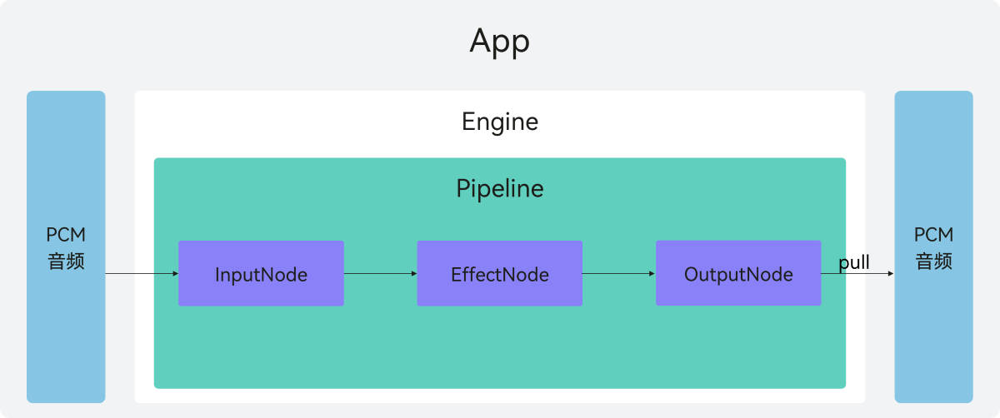
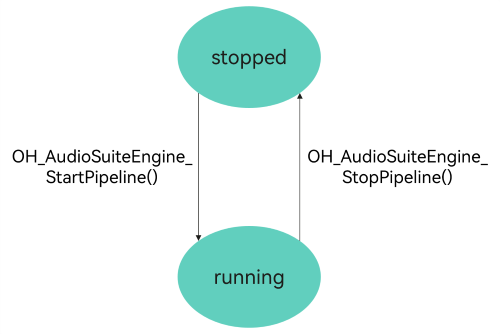

# 音频编创开发概述(C/C++)
<!--Kit: Audio Kit-->
<!--Subsystem: Multimedia-->
<!--Owner: @songshenke-->
<!--Designer: @caixuejiang; @hao-liangfei; @zhanganxiang-->
<!--Tester: @Filger-->
<!--Adviser: @w_Machine_cc-->

从API version 22开始，支持音频编创（[OHAudioSuite](../../reference/apis-audio-kit/capi-ohaudiosuite.md)）功能。音频编创是一款提供专业级音频效果处理的开发接口，旨在帮助开发者高效构建各种音频创作应用。该套件提供高品质、低延迟、智能化的音频处理能力，集成了降噪、均衡器、人声分离等丰富音效功能。开发者可以根据具体的应用场景，轻松地将所需音频功能集成到应用中。

音频编创主要包含引擎、管线和节点，具体介绍如下。

**图1**：音频编创实现原理图

## 引擎

[OHAudioSuite](../../reference/apis-audio-kit/capi-ohaudiosuite.md)中的引擎是一个统一管理音频管线、控制[离线编辑(C/C++)](audio-suite-manual-rendering.md)和[实时渲染(C/C++)](audio-suite-real-time-rendering.md)的对象，开发者可以根据自身的需求搭建音频处理链。调用方式如上图所示，由应用发起，先调用[OHAudioSuite](../../reference/apis-audio-kit/capi-ohaudiosuite.md)的接口依次创建引擎、管线、节点，再把创建的节点在管线内连接起来，用于传输PCM（Pulse Code Modulation）音频数据，使对应的效果节点实现音效处理能力。当管线停止时，开发者可以有限制地（具体规则请参考[管线的组成和编排](#管线的组成和编排)）连接、断开和移除节点，通过调节节点编排实现复杂的音效处理。

引擎最多支持创建10条管线，其中实时渲染管线最多创建1条。

## 节点

### 节点的介绍

节点是音频渲染的最小单元，根据节点功能提供对应的音效处理能力，节点本身无法单独调用，必须依附管线和引擎才能使用。

[OHAudioSuite](../../reference/apis-audio-kit/capi-ohaudiosuite.md)支持三种节点类型，分别是输入节点、输出节点、效果节点。

|节点类型   | 说明    |
|----------|----------|
| INPUT_NODE  | 输入节点，支持开发者输入各种格式的PCM音频数据。  |
| EFFECT_NODE | 效果节点，添加音频效果，支持单输入单输出和多输入单输出。 |
| OUTPUT_NODE | 输出节点，支持设置输出的PCM音频格式。  |

  节点完整类型详见[OH_AudioNode_Type](../../reference/apis-audio-kit/capi-native-audio-suite-base-h.md#oh_audionode_type)。

### 节点的作用

- 输入节点负责处理PCM音频数据输入，从应用侧获取数据。

- 输出节点负责处理PCM音频数据输出，开发者可以设置音频数据的输出格式。

- [离线编辑(C/C++)](audio-suite-manual-rendering.md)场景支持均衡器、音源分离、声场效果、降噪、声音美化、环境效果、混音等音效节点。
    
- [实时渲染(C/C++)](audio-suite-real-time-rendering.md)场景支持均衡器音效节点。

- 均衡器、音源分离、声场效果、降噪等音效节点支持对应的音效处理功能和多音频混音操作，最终输出的PCM音频数据支持格式设置（如[OH_Audio_SampleFormat(位深度)](../../reference/apis-audio-kit/capi-native-audio-suite-base-h.md#oh_audio_sampleformat)、[OH_Audio_SampleRate(采样率)](../../reference/apis-audio-kit/capi-native-audio-suite-base-h.md#oh_audio_samplerate)和[OH_AudioChannelLayout(声道数)](../../reference/apis-avcodec-kit/capi-native-audio-channel-layout-h.md#oh_audiochannellayout)等）。

## 管线

管线是一个统一管理音频节点连接、配置的对象，支持两种工作模式，分别是[离线编辑(C/C++)](audio-suite-manual-rendering.md)和[实时渲染(C/C++)](audio-suite-real-time-rendering.md)。

管线的数据处理采用反向驱动机制。由[OH_AudioSuiteEngine_RenderFrame()](../../reference/apis-audio-kit/capi-native-audio-suite-engine-h.md#oh_audiosuiteengine_renderframe)或者[OH_AudioSuiteEngine_MultiRenderFrame()](../../reference/apis-audio-kit/capi-native-audio-suite-engine-h.md#oh_audiosuiteengine_multirenderframe)发起，输出节点逐级向连接的上游节点请求数据，最终由输入节点的[OH_InputNode_RequestDataCallback()](../../reference/apis-audio-kit/capi-native-audio-suite-engine-h.md#oh_inputnode_requestdatacallback)回调函数向开发者请求需要处理的音频数据。

**图2**：管线运行状态图

状态的功能如下表所示。

|状态名  | 功能    |
|----------|----------|
| stopped  | 初始状态，或者工作状态经过[OH_AudioSuiteEngine_StopPipeline()](../../reference/apis-audio-kit/capi-native-audio-suite-engine-h.md#oh_audiosuiteengine_stoppipeline)命令进入该状态。 切换到stopped状态下，各节点将释放缓存。  |
| running  | 工作状态，或者初始状态执行[OH_AudioSuiteEngine_StartPipeline()](../../reference/apis-audio-kit/capi-native-audio-suite-engine-h.md#oh_audiosuiteengine_startpipeline)命令进入该状态。 该函数会对管线进行完整性检查，包含是否有有效连接、节点是否连接错误等。 |

### 管线的作用

- 管线是[OHAudioSuite](../../reference/apis-audio-kit/capi-ohaudiosuite.md)中支持应用渲染PCM音频数据的音效链路。管线支持节点之间的灵活组网，给开发者提供更丰富、更灵活的音频编创体验。

- 管线使用的场景如下：

  创建一个输入节点、一个效果节点（如均衡器节点[EFFECT_NODE_TYPE_EQUALIZER](../../reference/apis-audio-kit/capi-native-audio-suite-base-h.md#oh_audionode_type)）和一个输出节点，按节点连接顺序（输入节点 -> 效果节点 -> 输出节点）连接组成管线，实现均衡器功能（具体代码用例参考[基础离线编辑](audio-suite-manual-rendering.md#基础离线编辑)）。同时，管线也支持多输入场景（具体代码用例参考[混音与级联](audio-suite-manual-rendering.md#混音与级联)），每条管线输入的PCM数据经过各自的效果节点，在进行混音处理后进行输出。

### 管线的组成和编排

管线由节点编排组成。每一个管线中，输入节点[INPUT_NODE_TYPE_DEFAULT](../../reference/apis-audio-kit/capi-native-audio-suite-base-h.md#oh_audionode_type)不超过5个，输出节点[OUTPUT_NODE_TYPE_DEFAULT](../../reference/apis-audio-kit/capi-native-audio-suite-base-h.md#oh_audionode_type)不超过1个，效果类节点不超过5个，其中混音节点[EFFECT_NODE_TYPE_AUDIO_MIXER](../../reference/apis-audio-kit/capi-native-audio-suite-base-h.md#oh_audionode_type)不超过3个，音源分离节点[EFFECT_MULTII_OUTPUT_NODE_TYPE_AUDIO_SEPARATION](../../reference/apis-audio-kit/capi-native-audio-suite-base-h.md#oh_audionode_type)不超过1个。

管线创建节点规则如下所示。

- 管线创建的节点数量超过该类型的限制后，再创建该类型节点会失败。
- 每条管线至少要有1个输入节点，有且只有1个输出节点。
- 创建节点前需要调用[OH_AudioSuiteEngine_IsNodeTypeSupported()](../../reference/apis-audio-kit/capi-native-audio-suite-engine-h.md#oh_audiosuiteengine_isnodetypesupported)检查节点类型是否受支持，避免创建节点失败。
- 输入节点和输出节点支持设置节点格式，其余节点不支持设置格式。输入的格式是音频源的音频格式，输出的格式是开发者期望输出的音频格式。

管线中节点的编排规则如下所示。

- 管线连接顺序为：输入节点 -> 效果节点 -> 输出节点。
- 音源分离效果节点[EFFECT_MULTII_OUTPUT_NODE_TYPE_AUDIO_SEPARATION](../../reference/apis-audio-kit/capi-native-audio-suite-base-h.md#oh_audionode_type)后面只能连接输出节点，其余效果类节点则没有这个限制。

- 混音效果节点[EFFECT_NODE_TYPE_AUDIO_MIXER](../../reference/apis-audio-kit/capi-native-audio-suite-base-h.md#oh_audionode_type)支持多路输入连接，其余类型节点则不支持。

- 节点的连接是单向的，不支持后序节点反向连接到前序节点。输入节点是每条管线的首节点，输出节点是每条管线的尾节点。
