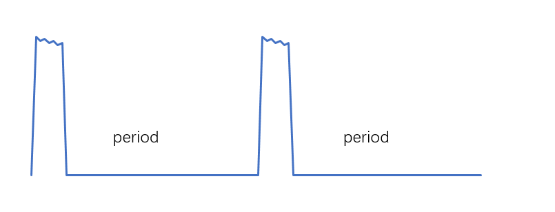
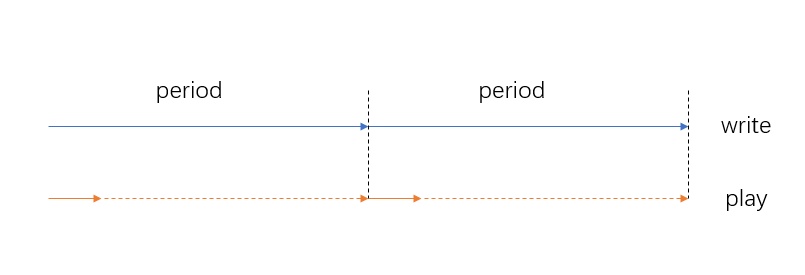
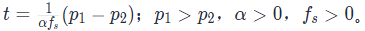

# 低功耗音频播放
<!--Kit: Audio Kit-->
<!--Subsystem: Multimedia-->
<!--Owner: @songshenke-->
<!--Designer: @caixuejiang; @hao-liangfei; @zhanganxiang-->
<!--Tester: @Filger-->
<!--Adviser: @w_Machine_cc-->

从API version 11开始支持低功耗音频播放。

低功耗音频播放是一种通过软硬芯协同设计实现的音频渲染方案。其核心机制是增大音频渲染器的内部缓存，使系统能够一次性填充大量音频数据，从而允许主处理器长时间休眠，减少频繁处理音频数据的功耗，显著降低系统级功耗负载。

## 使用前提

当前支持外放、有线耳机和部分蓝牙耳机实现低功耗功能。

## 开发指导

低功耗音频渲染器与普通音频渲染器接口无差异，但需关注应用数据周期与播放进度。音频渲染器使用请参考[使用AudioRenderer开发音频播放功能](using-audiorenderer-for-playback.md)和[使用OHAudio开发音频播放功能(C/C++)](using-ohaudio-for-playback.md)。

**数据周期示意图**

在数据周期内，快速请求数据写满缓存时，进入休眠状态。当缓存数据消费完后，会触发下一个周期。

**播放进度示意图**

在数据周期内，快速请求数据写满缓存时，播放进度按实际播放量计算。当缓存数据消费完（即播放进度到达写入数据量）后，会触发下一个周期。

### 注意事项

1. 流类型使用[STREAM_USAGE_MUSIC](../../reference/apis-audio-kit/arkts-apis-audio-e.md#streamusage)、[STREAM_USAGE_AUDIOBOOK](../../reference/apis-audio-kit/arkts-apis-audio-e.md#streamusage)、[AUDIOSTREAM_USAGE_MUSIC](../../reference/apis-audio-kit/capi-native-audiostream-base-h.md#oh_audiostream_usage)或[AUDIOSTREAM_USAGE_AUDIOBOOK](../../reference/apis-audio-kit/capi-native-audiostream-base-h.md#oh_audiostream_usage)，系统默认为低功耗渲染器。

2. 低功耗渲染器缓存：亮屏场景下，最大1000ms；熄屏场景下，最大10000ms。缓存数据消费完时会唤醒主处理器，触发应用传送数据，传送数据的周期与缓存大小保持一致。

    > - 应用在感知周期内未请求数据属于正常现象，无需停流。系统会自行判断长时间未收到数据的情况并停流；当应用重新发送数据时，系统将恢复流状态。
    > - 熄屏场景下，数据写满缓存后主处理器进入休眠，应用会进入挂起状态。若应用需要后台播放或熄屏播放，请参考[后台播放开发须知](audio-playback-overview.md#后台播放开发须知)。
    > - 低功耗渲染器每次请求数据长度与普通渲染器相同，通过高请求频率来填满缓存。预计每1ms请求1次，实际时长受应用和硬件影响。若应用无法快速提供数据，会降级到普通渲染器周期。如果普通渲染器周期无法保证数据及时性，需应用优化数据处理。
    > - 当应用数据不足一次回调长度时，不允许填空数据以避免播放卡顿（到达EOS时除外）。建议等待数据充足或返回错误码。具体参考[AudioRenderer音频数据回调](using-audiorenderer-for-playback.md#开发步骤及注意事项)和[OHAudio音频数据回调](using-ohaudio-for-playback.md#开发步骤)。

3. 低功耗渲染器和低时延渲染器不支持并发，采用先到先得原则，即先启动的生效，后启动的降级为普通渲染器。具体示例如下：

    >- 先启低功耗渲染器A，再启低功耗渲染器B，则B降级普通渲染器。
    >- 先启低功耗渲染器，再启低时延渲染器，则低时延降级普通渲染器。
    >- 先启低时延渲染器，再启低功耗渲染器，则低功耗降级普通渲染器。

4. 应用数据写完不代表已经播完，需调用获取音频时间戳接口[getAudioTimestampInfo()](../../reference/apis-audio-kit/arkts-apis-audio-AudioRenderer.md#getaudiotimestampinfo19)或[OH_AudioRenderer_GetAudioTimestampInfo()](../../reference/apis-audio-kit/capi-native-audiorenderer-h.md#oh_audiorenderer_getaudiotimestampinfo)，判断实际播放进度。

    > - 获取时间戳接口调用频率建议大于200ms一次，以免影响系统性能。
    > - 应用程序调用接口[flush()](../../reference/apis-audio-kit/arkts-apis-audio-AudioRenderer.md#flush11)或[OH_AudioRenderer_Flush()](../../reference/apis-audio-kit/capi-native-audiorenderer-h.md#oh_audiorenderer_flush)后，播放的数据量会重置为0。
    > - 播放数据量均会小于写入数据量。由于系统帧长与时延机制，播完的播放数据量不等于写入数据量。
    > - 写完数据后获取时间戳，如果2个周期内时间戳不变，即为播完；或者根据设置的倍速推算剩余播放时长，超过相应时长，即为播完。（如：记总写入数据量p1，写完后获取时间戳p2，设置倍速α且α>0，音频采样率fs且fs>0，剩余可播时长t。公式：）