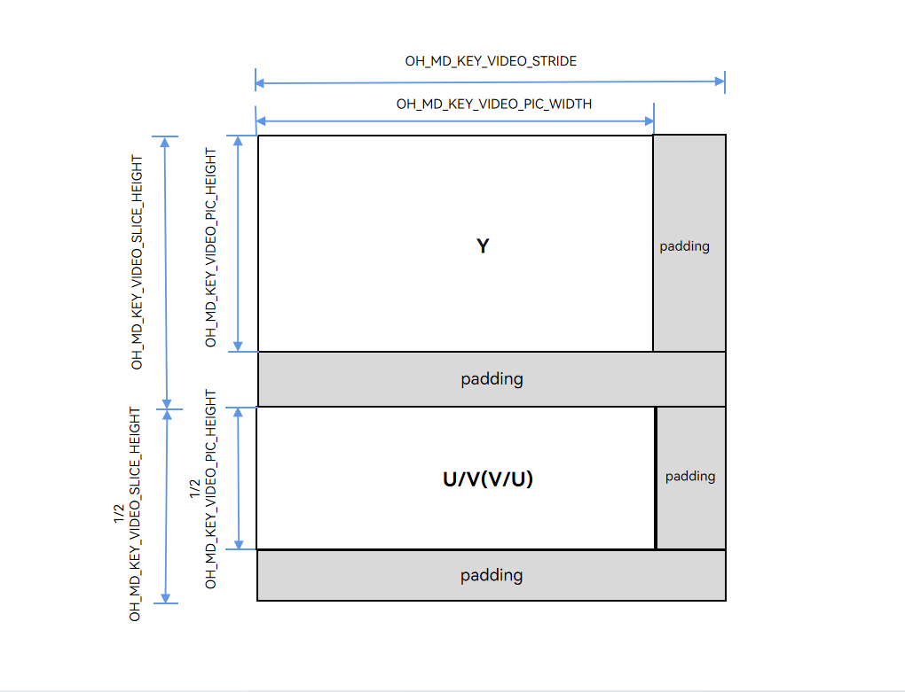
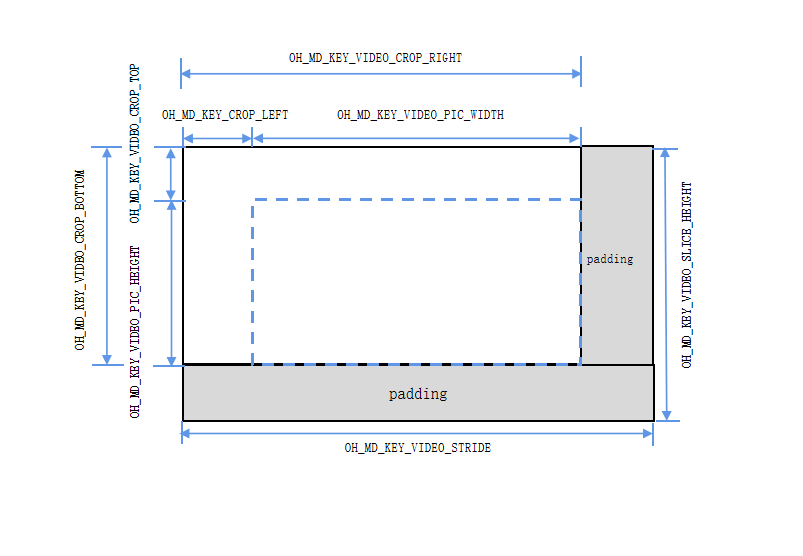

# 视频编解码宽高、跨距与裁剪信息说明

<!--Kit: AVCodec Kit-->
<!--Subsystem: Multimedia-->
<!--Owner: @zhanghongran-->
<!--Designer: @dpy2650--->
<!--Tester: @cyakee-->
<!--Adviser: @w_Machine_cc-->

## 概述

在视频编解码（Video Codec）开发中，图像的**宽度**和**高度**存在多种表示形式，同时硬件处理通常需要内存对齐（跨距），解码输出还可能涉及**裁剪区域**。本文档系统梳理视频编解码API中涉及的尺寸相关参数及其关系，帮助开发者正确理解和使用这些参数。

## 参数总览

**表1**尺寸参数一览表

| 参数 | 键名 | 类型 | 含义 | 编码器使用场景 | 解码器使用场景 | 调用接口 |
|------|------|------|------|--------|--------|----------|
| width/height | `OH_MD_KEY_WIDTH`/`OH_MD_KEY_HEIGHT` | int32_t | 配置的视频宽/高。 | 配置目标编码分辨率。 | 配置预分配缓冲区。 | Configure |
| stride | `OH_MD_KEY_VIDEO_STRIDE` | int32_t | 宽跨距（行对齐后每行字节数）。 | 获取Buffer内存对齐宽。 | 获取Buffer内存对齐宽。 | GetInputDescription/GetOutputDescription/OnStreamChanged |
| sliceHeight | `OH_MD_KEY_VIDEO_SLICE_HEIGHT` | int32_t | 高跨距（列对齐后总行数）。 | 获取Buffer内存对齐高。 | 获取Buffer内存对齐高。 | GetInputDescription/GetOutputDescription/OnStreamChanged |
| picWidth/picHeight | `OH_MD_KEY_VIDEO_PIC_WIDTH`/`OH_MD_KEY_VIDEO_PIC_HEIGHT` | int32_t | 图像真实有效宽/高。 | — | 获取解码输出有效宽/高。| GetOutputDescription/OnStreamChanged |
| cropTop | `OH_MD_KEY_VIDEO_CROP_TOP` | int32_t | 裁剪矩形顶部行坐标（y），包含裁剪框顶部的行，行索引从0开始。 | — | 获取解码裁剪上边界。| GetOutputDescription/OnStreamChanged |
| cropBottom | `OH_MD_KEY_VIDEO_CROP_BOTTOM` | int32_t | 裁剪矩形底部行坐标（y），包含裁剪框底部的行，行索引从0开始。 | — | 获取解码裁剪下边界。 | GetOutputDescription/OnStreamChanged |
| cropLeft | `OH_MD_KEY_VIDEO_CROP_LEFT` | int32_t | 裁剪矩形左列坐标（x），包含裁剪框最左边的列，列索引从0开始。 | — | 获取解码裁剪左边界。 | GetOutputDescription/OnStreamChanged |
| cropRight | `OH_MD_KEY_VIDEO_CROP_RIGHT` | int32_t | 裁剪矩形右列坐标（x），包含裁剪框最右边的列，列索引从0开始。 | — | 获取解码裁剪右边界。 | GetOutputDescription/OnStreamChanged |

> **说明：**
>
> 表格中键的定义请参考[native_avcodec_base.h](../../reference/apis-avcodec-kit/capi-native-avcodec-base-h.md)。


## 核心概念详解

### width/height与picWidth/picHeight的差别

**width/height（配置尺寸）**

编码器的`OH_MD_KEY_WIDTH`和`OH_MD_KEY_HEIGHT`是开发者通过`Configure`接口配置的目标编码分辨率。这是编码器输入数据的**期望尺寸**，同时也是码流中的**编码分辨率**。

```c++
// 编码器配置示例。
OH_AVFormat *format = OH_AVFormat_Create();
OH_AVFormat_SetIntValue(format, OH_MD_KEY_WIDTH, 1920);  // 目标编码宽度。
OH_AVFormat_SetIntValue(format, OH_MD_KEY_HEIGHT, 1080);  // 目标编码高度。
OH_AVFormat_SetIntValue(format, OH_MD_KEY_PIXEL_FORMAT, AV_PIXEL_FORMAT_NV12);
// 使用format完成后需销毁。
OH_AVFormat_Destroy(format);
```

解码器的`OH_MD_KEY_WIDTH`和`OH_MD_KEY_HEIGHT`是开发者通过`Configure`接口配置的解码分辨率提示。解码器根据此参数**预分配内部缓冲区**，确保能够容纳码流中的编码帧尺寸。

> **注意：**
>
> - 解码器的width/height是配置阶段的**期望值**，实际解码输出的有效图像尺寸由`OH_MD_KEY_VIDEO_PIC_WIDTH/OH_MD_KEY_VIDEO_PIC_HEIGHT`（见下文）决定。
> - 通常建议将width/height设置为与码流实际分辨率一致或略大。
> - 解码器支持码流分辨率的动态变化（如自适应码流场景），此时解码器会根据实际帧尺寸输出对应的picWidth/picHeight。

```c++
// 解码器配置示例。
OH_AVFormat *format = OH_AVFormat_Create();
OH_AVFormat_SetIntValue(format, OH_MD_KEY_WIDTH, 1920);   // 解码宽度（必须配置）。
OH_AVFormat_SetIntValue(format, OH_MD_KEY_HEIGHT, 1080);  // 解码高度（必须配置）。
OH_AVFormat_SetIntValue(format, OH_MD_KEY_PIXEL_FORMAT, AV_PIXEL_FORMAT_NV12);
// 使用 format 完成后需销毁。
OH_AVFormat_Destroy(format);
```

**picWidth/picHeight（有效图像尺寸）**

解码器的`OH_MD_KEY_VIDEO_PIC_WIDTH`和`OH_MD_KEY_VIDEO_PIC_HEIGHT`表示解码输出的**实际有效像素区域**的宽度和高度。

由于视频码流标准（如H.264/H.265）支持裁剪（crop）机制，码流中编码帧的大小并不等同于**实际有效像素区域**。

```txt
picWidth  = cropRight - cropLeft + 1     （宽度方向：左右列坐标差+1）
picHeight = cropBottom - cropTop + 1     （高度方向：上下行坐标差+1）
```

### stride/sliceHeight （内存跨距）

**跨距的定义**

视频编解码硬件通常要求**内存按特定字节或像素对齐**以提高存取效率。当配置的图像宽/高不满足对齐要求时，硬件会分配更大的缓冲区，多余的部分称为**padding（填充区）**。

跨距包含两个维度：

- **宽跨距（stride）**：内存中每一行的实际字节数，通常≥图像有效宽度。
- **高跨距（sliceHeight）**：内存中分配的总行数，通常≥图像有效高度。

两者与有效尺寸的关系为：

```txt
stride      = width + padding_width          （水平方向）
sliceHeight = height + padding_height        （垂直方向）
```

**编码器侧内存布局**

以NV12格式为例，编码器输入Buffer的内存布局如下：

**图1**NV12格式图像的内存布局示意图


图1中各参数含义：

| 参数 | 键名 | 说明 |
|------|------|------|
| width | `OH_MD_KEY_WIDTH` | 开发者配置的图像有效宽度。 |
| height | `OH_MD_KEY_HEIGHT` | 开发者配置的图像有效高度。 |
| stride | `OH_MD_KEY_VIDEO_STRIDE` | Buffer中每行的实际像素数（含右侧padding）。 |
| sliceHeight | `OH_MD_KEY_VIDEO_SLICE_HEIGHT` | Y分量区域的实际行数（含底部padding）。 |

**解码器侧内存布局**

解码器输出Buffer的内存布局类似，但使用不同的键名来标识有效区域：

**图2**解码器输出Buffer的内存布局示意图


图2中各参数含义：

| 参数 | 键名 | 说明 |
|------|------|------|
| picWidth | `OH_MD_KEY_VIDEO_PIC_WIDTH` | 解码后图像的实际有效宽度。 |
| picHeight | `OH_MD_KEY_VIDEO_PIC_HEIGHT` | 解码后图像的实际有效高度。 |
| stride | `OH_MD_KEY_VIDEO_STRIDE` | Buffer中每行的实际像素数（含右侧padding）。 |
| sliceHeight | `OH_MD_KEY_VIDEO_SLICE_HEIGHT` | Y分量区域的实际行数（含底部padding）。 |

### Crop（裁剪矩形）

**含crop信息时解码器侧内存布局**

一般情况下，码流参数集中的左/上裁剪偏移字段通常为0，因此解码输出的有效区域通常从内存起始位置开始，即cropLeft和cropTop均为0。

**图3**含crop信息时解码器侧内存布局示意图


解码器特有的4个裁剪参数定义了**有效显示区域**的矩形范围：

| 参数 | 键名 | 说明 |
|------|--------|--------|
| cropLeft | `OH_MD_KEY_VIDEO_CROP_LEFT` | 有效区域左边缘的列坐标（x），从0开始计数，包含该列。 |
| cropRight | `OH_MD_KEY_VIDEO_CROP_RIGHT` | 有效区域右边缘的列坐标（x），从0开始计数，包含该列。 |
| cropTop | `OH_MD_KEY_VIDEO_CROP_TOP` | 有效区域顶部的行坐标（y），从0开始计数，包含该行。 |
| cropBottom | `OH_MD_KEY_VIDEO_CROP_BOTTOM` | 有效区域底部的行坐标（y），从0开始计数，包含该行。 |


## picWidth/picHeight与码流标准的关系（H.264/H.265）

### H.264 AVC标准

H.264标准中通过SPS（Sequence Parameter Set）中的以下字段定义图像尺寸关系：

| H.264 SPS字段 | 含义 |
|----------------|------|
| `pic_width_in_mbs_minus1` | 以宏块为单位的编码帧宽度。 |
| `pic_height_in_map_units_minus1` | 以宏块行为单位的编码帧高度。 |
| `frame_cropping_flag` | 是否启用裁剪标志。 |
| `frame_crop_left_offset` | 左裁剪偏移（距左边缘的像素数）。 |
| `frame_crop_right_offset` | 右裁剪偏移（距右边缘的像素数）。 |
| `frame_crop_top_offset` | 上裁剪偏移（距顶部的像素数）。 |
| `frame_crop_bottom_offset` | 下裁剪偏移（距底部的像素数）。 |


对于常见的格式：yuv420和frame_mbs_only_flag = 1的H.264视频来说，有效图像尺寸计算公式：

```txt
// 方式一：通过SPS偏移量直接计算。
picWidth  = (pic_width_in_mbs_minus1 + 1) * 16 - 2 * frame_crop_left_offset - 2 * frame_crop_right_offset
picHeight = (pic_height_in_map_units_minus1 + 1) * 16 - 2 * frame_crop_top_offset - 2 * frame_crop_bottom_offset

// 方式二：通过API坐标值计算（等价）。
picWidth  = cropRight - cropLeft + 1
picHeight = cropBottom - cropTop + 1
```

### H.265 HEVC标准

H.265标准使用CTU（Coding Tree Unit）替代宏块，SPS中的对应字段如下表所示。

| H.265 SPS字段 | 含义 |
|----------------|------|
| `pic_width_in_luma_samples` | 亮度分量的编码帧宽度（像素）。 |
| `pic_height_in_luma_samples` | 亮度分量的编码帧高度（像素）。 |
| `conformance_window_flag` | 是否启用一致性窗口（裁剪）标志。 |
| `conf_win_left_offset` | 一致性窗口左偏移（距左边缘的像素数）。 |
| `conf_win_right_offset` | 一致性窗口右偏移（距右边缘的像素数）。 |
| `conf_win_top_offset` | 一致性窗口上偏移（距顶部的像素数）。 |
| `conf_win_bottom_offset` | 一致性窗口下偏移（距底部的像素数）。 |

对于常见的yuv420的H.265视频来说，有效图像尺寸计算公式：
```txt
// 方式一：通过SPS偏移量直接计算。
picWidth  = pic_width_in_luma_samples - 2 * conf_win_right_offset - 2 * conf_win_left_offset
picHeight = pic_height_in_luma_samples - 2 * conf_win_bottom_offset - 2 * conf_win_top_offset

// 方式二：通过API坐标值计算（等价）。
picWidth  = cropRight - cropLeft + 1
picHeight = cropBottom - cropTop + 1
```

> **说明：**
>
> 跨距（stride/sliceHeight）是**平台/硬件实现相关的内存管理属性**，不属于任何视频码流标准。所以不同芯片平台有不同的对齐规则。
>
> 1. 通用CPU（软件编解码）平台：stride通常等于width（无需额外对齐）。
> 2. ARM GPU（Mali）平台：行对齐至64或128字节。
> 3. DSP/NPU平台：行对齐至16或32像素。
> 4. 特定SoC：可能需要更严格的对齐。
> 开发者应始终通过`GetInputDescription`/`GetOutputDescription`或`OnStreamChanged`回调获取实际跨距值，而非假设固定值。


## 代码示例

### 场景一：向编码器输入Buffer写入数据

在编码器Buffer模式下，编码器通过`OnNeedInputBuffer`回调提供可用的输入Buffer。开发者需要将原始图像数据拷贝到`OH_AVBuffer`中。当Buffer内存跨距大于配置宽高时，必须按行拷贝有效数据并跳过Padding区域，否则会导致画面错位。

参考代码：[视频编码开发指导-Buffer模式 步骤3](video-encoding.md#buffer模式)、[视频编码开发指导-Buffer模式 步骤8](video-encoding.md#buffer模式)

### 场景二：从解码器输出Buffer读取数据

在解码器Buffer模式下，读取数据时需根据有效图像尺寸和跨距按行读取，并结合裁剪信息跳过Padding及无效边缘。

参考代码：[视频解码开发指导-Buffer模式 步骤3](video-decoding.md#buffer模式)、[视频解码开发指导-Buffer模式 步骤11](video-decoding.md#buffer模式)

### 场景三：Surface模式

使用Surface模式时，系统自动处理跨距和内存对齐，开发者无需关心padding：

| 模式 | 跨距处理责任方 | 是否需要关注跨距 |
|------|---------------|--------------|
| Surface模式 | 系统（底层图形栈自动处理）。 | 否 |
| Buffer模式 | 开发者（需自行按行拷贝）。 | 是 |


## 尺寸关系速查表

### 编码器参数关系图

**图4**编码器参数关系示意图
```txt
Configure 阶段（开发者设置）：
  OH_MD_KEY_WIDTH                -> 编码目标宽度
  OH_MD_KEY_HEIGHT               -> 编码目标高度

运行时（GetInputDescription 获取）：
  OH_MD_KEY_VIDEO_STRIDE         -> Buffer宽跨距（≥width）
  OH_MD_KEY_VIDEO_SLICE_HEIGHT   -> Buffer高跨距（≥height）

关系：
  stride      ≥ width（相等时无需跨距偏移）
  sliceHeight ≥ height（相等时无垂直padding）
```

### 解码器参数关系图

**图4**解码器参数关系示意图
```txt
Configure 配置参数：
  OH_MD_KEY_WIDTH                -> 配置宽度（解码器缓冲区分配依据）
  OH_MD_KEY_HEIGHT               -> 配置高度（解码器缓冲区分配依据）

码流解析结果（GetOutputDescription/OnStreamChanged）：
  OH_MD_KEY_VIDEO_PIC_WIDTH      -> cropRight - cropLeft + 1（有效显示宽）
  OH_MD_KEY_VIDEO_PIC_HEIGHT     -> cropBottom - cropTop + 1（有效显示高）
  OH_MD_KEY_VIDEO_CROP_*         -> 裁剪坐标（可选，cropLeft=0/cropTop=0/cropRight=编码帧宽-1/cropBottom=编码帧高-1 时表示无裁剪）

  OH_MD_KEY_VIDEO_STRIDE         -> Buffer宽跨距（≥编码帧宽）
  OH_MD_KEY_VIDEO_SLICE_HEIGHT   -> Buffer高跨距（≥编码帧高）

关系（典型情况，有裁剪且有对齐）：
  width/height  ≥ cropRight+1/cropBottom+1（配置值应覆盖实际码流坐标范围）
  stride        ≥ cropRight + 1
  sliceHeight   ≥ cropBottom + 1
```

## 常见问题FAQ

### Q1：为什么编码输出画面会有绿边或花屏

**回答**：写入编码器输入Buffer时未按跨距对齐拷贝，导致padding区域包含脏数据或越界写入。

**解决**：使用场景一的按行拷贝代码，确保每次memcpy的长度为有效宽度，指针步进为跨距。

### Q2：为什么解码后的图片看起来被拉伸或压缩

**回答**：读取解码输出时使用了`stride`而非`picWidth`/`picHeight`作为图像尺寸进行后续处理。

**解决**：显示或保存时应使用`picWidth`/`picHeight`作为图像的实际分辨率，仅在内存操作时使用跨距。

### Q3：何时需要关注裁剪（Crop）信息

**回答**：仅在使用解码器且码流中存在非零裁剪值时需要关注。常见于：
- 某些网络摄像头输出的码流（编码帧填充到16的倍数后crop回原始尺寸）。
- 部分转码工具生成的码流。

大多数常规码流（如手机拍摄的视频）裁剪值通常覆盖整个编码帧（即`LEFT=0，TOP=0，RIGHT=编码帧宽-1，BOTTOM=编码帧高-1`），此时`picWidth=编码帧宽，picHeight=编码帧高`，无需额外处理裁剪偏移。

### Q4：Surface模式和Buffer模式的区别

**回答**：
| 维度 | Surface模式 | Buffer模式 |
|------|-------------|-------------|
| 跨距处理 | 系统/驱动层自动处理。 | 开发者必须手动处理。 |
| 适用场景 | 摄像头预览、播放渲染。 | 转码、AI处理、文件保存等。 |

### Q5：跨距值一定是固定的吗

**回答**：不一定。跨距取决于：
- 硬件平台：不同SoC有不同的对齐要求。
- 像素格式：YUV420P和RGBA的对齐规则可能不同。

因此建议每次在`OnStreamChanged`或首次`GetInputDescription`/`GetOutputDescription`时重新查询，不要缓存跨距值。

### Q6：`OH_AVCapability_IsVideoSizeSupported`等能力查询接口中的宽高参数是指什么？

**回答**：这些接口中的宽高参数通常指的是码流参数集（如SPS）中定义的**编码帧宽高**，与`avcodec`接口中使用的各种宽高Key（如`OH_MD_KEY_WIDTH`、`OH_MD_KEY_VIDEO_PIC_WIDTH`等）均无直接对标关系。解码时，解码器会据读入的码流参数集中的**编码帧宽高**判断是否支持解码该分辨率。若此前查询的宽高与实际码流中的参数不一致，可能会出现实际是否能解码与查询的结果不一致的情况。

## 参考文档

- [视频编码开发指导](video-encoding.md) —— Surface模式/Buffer模式完整流程。
- [视频解码开发指导](video-decoding.md) —— Surface模式/Buffer模式完整流程。
- [Codec Base API参考](../../reference/apis-avcodec-kit/capi-native-avcodec-base-h.md) —— 所有键名定义。
- [AVCodec Kit API Reference - VideoEncoder](../../reference/apis-avcodec-kit/capi-native-avcodec-videoencoder-h.md) —— 编码器接口。
- [AVCodec Kit API Reference - VideoDecoder](../../reference/apis-avcodec-kit/capi-native-avcodec-videodecoder-h.md) —— 解码器接口。
