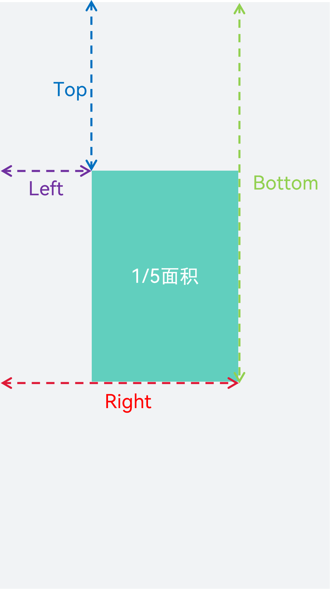
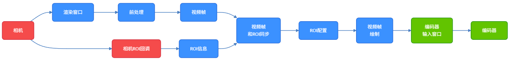
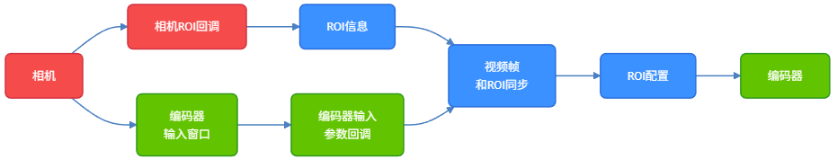
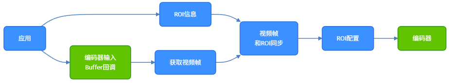

# ROI视频编码

<!--Kit: AVCodec Kit-->
<!--Subsystem: Multimedia-->
<!--Owner: @yang-xiaoyu5-->
<!--Designer: @dpy2650--->
<!--Tester: @cyakee-->
<!--Adviser: @w_Machine_cc-->

## 基础概念

从API version 20开始支持ROI视频编码（Region Of Interest Video Coding），该功能是基于硬件H.264/H.265编码能力扩展的高级优化技术。其核心逻辑为对画面中指定的重点区域分配更多编码资源实现高画质编码。在有限带宽条件下保障ROI区域内容清晰呈现，显著提升整体视觉体验。

开发者可自主定义视频画面中的ROI区域（如直播中的人脸、监控中的车牌等），并通过设定质量偏移参数，调节ROI区域与非ROI区域的编码质量差异，实现编码资源的差异化分配。

## 适用场景

ROI视频编码适用于因网络带宽限制导致码率不能满足视频画质要求，且能明确定义关键画面内容（ROI区域）的场景。比如视频通话、视频直播、安全监控等。

各场景中ROI区域的选择建议如下：
- 秀场直播：将主播面部区域设为ROI，优化人脸细节（如肤色、五官轮廓），提升观众沉浸式观看体验。
- 户外直播：将主播主体/核心拍摄景物（如自然风光、赛事画面核心区域）设为ROI，在移动网络带宽波动时保障核心内容清晰。
- 电商直播：将商品展示区域（如美妆试色、电子产品细节）设为ROI，清晰呈现商品外观、材质与功能细节，助力商品转化。
- 网课视频：将课件文字、讲义图表、板书内容区域设为ROI，保证知识点清晰可读，降低视觉疲劳，提升教学效果。
- 安全监控：将摄像头画面中的人脸、车牌、出入口等关键区域设为ROI，提升抓拍清晰度，便于后续识别分析。

为了支持不同的编码场景，提供了三类ROI编码开发示例，开发者可根据实际业务和技术架构选择。

| 不同场景对照点 | 直播/视频通话场景| 录像场景 | 编辑导出/内容发布场景 |
| :----: |:----:|:----:| :----: |
| **ROI信息生产者** | 相机 | 相机 | 应用 |
| **ROI信息获取方式** | 通过相机元数据回调获取 | 通过相机元数据回调获取 | 应用自管理 |
| **编码视频帧直接生产者** | 图形 | 相机 | 应用 |
| **编码模式** | Surface模式 | Surface模式 | Buffer模式 |
| **ROI管理&对齐方式** | 基于时间戳匹配 | 基于回调时机匹配 | 自选 |
| **ROI参数配置方式** | NativeBuffer元数据配置 | 编码输入参数回调配置 | 编码输入buffer回调配置 |
| **开发示例** | [Surface模式下通过NativeBuffer接口配置ROI](#surface模式下通过nativebuffer接口配置roi) | [Surface模式下通过编码输入回调接口配置ROI](#surface模式下通过编码输入回调接口配置roi) | [Buffer模式下配置ROI](#buffer模式下配置roi) |

## 约束和限制

**支持的编码器：** H.264 8bit硬件编码、H.265 8bit硬件编码、H.265 10bit硬件编码。

**支持的码控模式：** VBR(Variable Bit Rate)、CBR(Constant Bit Rate)、SQR(Stable Quality Rate Control)。

**依赖ROI检测识别能力：** 编码器不具备ROI的检测识别能力，所以ROI编码技术生效依赖于开发者输入的ROI信息。开发者可根据业务场景自行设计并实现ROI识别能力，或通过调用系统相机模块原生提供的人脸区域信息，降低开发成本，具体请参考[相机人脸ROI获取示例](../camera/native-camera-metadata.md#状态监听)。

## 参数要求说明

支持开发者通过字符串形式下发ROI配置参数，参数需满足"Top,Left-Bottom,Right=DeltaQp"格式，所有参数均为整数。

- ROI是一个矩形区域，Top，Left和Bottom，Right分别定义了ROI的区域在图像中的左上角和右下角的坐标位置（如图1所示）。
- DeltaQp指定编码量化参数（Quantization Parameter）的差异值，DeltaQp绝对值越大，ROI区域与非ROI区域的编码质量差异越大。DeltaQp为负表示ROI区域编码画质优于非ROI区域。"=DeltaQp"可以省略，省略时使用默认参数（=-3）。
- 多个ROI参数之间通过";"连接, 多ROI配置如"Top1,Left1-Bottom1,Right1=DeltaQp1;Top2,Left2-Bottom2,Right2=DeltaQp2"。
- 同一帧最多支持配置6个ROI区域，按照配置顺序，多出的ROI区域将被忽略。总ROI面积不能超过图片面积的1/5。按照配置顺序依次累加，仅生效累加面积在限制之内的ROI区域。

**图1：ROI坐标和最大允许面积占比示意图**



## 生效机制说明

配置ROI支持两种方式：**NativeBuffer元数据配置方式**和**编码输入回调配置方式**。编码输入回调配置方式包含编码输入参数回调（Surface模式）和编码输入buffer回调（Buffer模式）。
- NativeBuffer元数据配置方式（推荐）：从API version 22开始支持使用`OH_NativeBuffer_MetaDataKey`的ROI枚举`OH_REGION_OF_INTEREST_METADATA`，在NativeBuffer的元数据中配置ROI参数。
- 编码输入回调配置方式：使用视频编码参数`OH_MD_KEY_VIDEO_ENCODER_ROI_PARAMS`在编码输入回调中配置。

**通用生效机制：**
1. ROI参数支持随帧下发并实时生效，开发者无需进行能力查询或配置全局开关。
2. 如果系统编码器不支持ROI编码能力，编码器会忽略ROI参数，进行普通编码。
3. DeltaQp有效取值范围为[-51, 51]，编码器会在ROI区域的QP上叠加DeltaQp，然后限制到[minQp, maxQp]范围内得到最终QP。
4. 当某一帧未配置ROI参数时，若上一帧生效了ROI编码，则复用上一帧ROI信息进行当前帧ROI编码；若上一帧是普通编码，则进行普通编码。
5. 当某一帧配置的ROI参数无法解析出任何有效ROI信息时，进行普通编码。
6. 如果多个ROI区域产生交叠，按照配置顺序，仅最先配置的ROI区域会在交叠处生效。

**NativeBuffer元数据配置方式独有机制：** 最大支持256Byte长度字符，超出部分会被截断。

**空字符串处理差异：** 
- NativeBuffer元数据配置方式：不允许配置空字符串，视作未配置ROI参数，当前帧会继承历史帧信息进行ROI编码。
- 编码输入回调配置方式：允许配置空字符串，但因无法解析出有效ROI信息，编码时按照普通编码方式进行编码。

> **说明：**
>
> 因空字符串处理存在差异，应避免配置空字符串。如需关闭某一帧的ROI编码，可配置无位置信息的字符串，如"Clear"或";"等。

**同时配置时的生效优先级：** 当某一帧的两种方式均有配置ROI参数，仅生效以编码输入回调配置方式下发的ROI参数，无论其能否解析出有效ROI信息。

## 开发示例

### Surface模式下通过NativeBuffer接口配置ROI

系统相机获取视频帧的接口和获取ROI信息的接口是两个独立的回调接口，需要根据视频时间戳和ROI信息时间戳进行数据同步匹配，并在编码前完成相应帧的ROI配置。

> **说明：**
>
> ROI信息需与相机视频帧信息严格对齐。实际应用中，若两个接口处理不同步，可能导致ROI调用错位；高负载场景下，还可能出现连续两帧ROI时间戳相同的异常。当出现上述情况，不影响编码功能正常运行，开发者可结合编码画质评估结果，自主决定是否继续使用。

在具体业务场景中，相机获取的视频帧会经过一系列的图像处理，如美颜、滤波和增强等前处理（如图2所示），开发者可以根据实际的业务需求进行模块增减。

**图2：NativeBuffer元数据接口配置ROI流程图**



详细开发步骤如下：

1. 在CMakeList.txt中链接动态库。

   ```txt
   set(BASE_LIBRARY
       libnative_media_codecbase.so libnative_media_core.so libnative_media_venc.so libnative_window.so
       libnative_buffer.so libnative_image.so libEGL.so libGLESv3.so
   )
   target_link_libraries(recorder PUBLIC ${BASE_LIBRARY})
   ```
   > **说明：**
   >
   > 上述'recorder'字样仅为示例，此处应由开发者根据具体的CMake工程目标名称进行替换。
   >

2. 监听相机元数据回调接口获取人脸位置信息。

   如何注册相机元数据回调可以参考 [相机元数据状态监听](../camera/camera-metadata.md#状态监听)。
   ```ts
   import { camera } from '@kit.CameraKit'
   import { BusinessError } from '@kit.BasicServicesKit'
   import recorder from 'librecorder.so';

   interface FaceBoundingBox {
       topLeftX: number;
       topLeftY: number;
       width: number;
       height: number;
   }
   
   onMetadataObjectsAvailable(metadataOutput: camera.MetadataOutput): void {
       metadataOutput.on('metadataObjectsAvailable', (err: BusinessError, metadataObjectArr: Array<camera.MetadataObject>) => {
           if (err !== undefined && err.code !== 0) {
               return;
           }
           const faceBoundingBoxes: Array<FaceBoundingBox> = [];
           let unifiedTimestamp = 0;
           let timestampSet = false;
    
           for (const metadataObject of metadataObjectArr) {
               if (metadataObject.type === camera.MetadataObjectType.FACE_DETECTION) {
                   if (!timestampSet) {
                       unifiedTimestamp = metadataObject.timestamp;
                       timestampSet = true;
                   }
                   faceBoundingBoxes.push({
                       topLeftX: metadataObject.boundingBox.topLeftX,
                       topLeftY: metadataObject.boundingBox.topLeftY,
                       width: metadataObject.boundingBox.width,
                       height: metadataObject.boundingBox.height
                   })
               }
           }
           if (faceBoundingBoxes.length > 0) {
               // 下发人脸位置信息到Native层（this.nativeRecorderObj是Native层实例）。
               recorder.UpdateFaceRect(this.nativeRecorderObj, unifiedTimestamp, faceBoundingBoxes);
           }
       });
   }
   ```

3. Native层解析TS层传递的人脸位置信息。

   ```c++
   struct FaceRect {
       double topLeftX;
       double topLeftY;
       double width;
       double height;
   };

   static napi_value UpdateFaceRect(napi_env env, napi_callback_info info)
   {
       size_t argc = 3;
       napi_value args[3] = {nullptr};
       napi_get_cb_info(env, info, &argc, args, nullptr, nullptr);
       if (argc < 3) {
           return nullptr;
       }
       // 解析native实例。
       int64_t addrValue = 0;
       bool flag = false;
       napi_get_value_bigint_int64(env, args[0], &addrValue, &flag);
       Recorder *recorder = reinterpret_cast<Recorder *>(addrValue);
       if (recorder == nullptr) {
           return nullptr;
       }
       // 解析时间戳。
       int64_t timestamp = 0;
       napi_get_value_int64(env, args[1], &timestamp);
       // 解析人脸Rect。
       napi_value faceRectArray = args[2];
       bool isArray;
       napi_is_array(env, faceRectArray, &isArray);
       if (!isArray) {
           return nullptr;
       }
       uint32_t arrayLength;
       napi_get_array_length(env, faceRectArray, &arrayLength);
       std::vector<FaceRect> faceRectVec;
       for (uint32_t i = 0; i < arrayLength; i++) {
           FaceRect item = {0};
           napi_value faceRectObj;
           napi_get_element(env, faceRectArray, i, &faceRectObj);
           napi_value propValue;
           napi_get_named_property(env, faceRectObj, "topLeftX", &propValue);
           napi_get_value_double(env, propValue, &item.topLeftX);
           napi_get_named_property(env, faceRectObj, "topLeftY", &propValue);
           napi_get_value_double(env, propValue, &item.topLeftY);
           napi_get_named_property(env, faceRectObj, "width", &propValue);
           napi_get_value_double(env, propValue, &item.width);
           napi_get_named_property(env, faceRectObj, "topLeftX", &propValue);
           napi_get_value_double(env, propValue, &item.height);
           faceRectVec.push_back(item);
       }
       recorder->ConvertToRoi(timestamp, faceRectVec);
       return nullptr;
   }
   ```

4. 转换成ROI信息格式字符串并保存。

   ```c++
   #include <map>
   #include <mutex>
   #include <sstream>
   #include <string>

   const int width = 1920;   // 视频帧宽度。
   const int height = 1080;  // 视频帧高度。
   const int qpOffset = -6;  // QP偏移参数。
   std::map<int64_t, std::string> g_roiStrMap; // 时间戳和ROI信息映射。
   std::mutex g_roiMutex;

   void Recorder::ConvertToRoi(int64_t timestamp, std::vector<FaceRect>* faceRectVec)
   {   
       std::string mergedRoiStr;
       // 遍历所有faceRect。
       for (const auto& faceRect : faceRectVec) {
           // 归一化坐标转像素坐标。
           int left = static_cast<int32_t>(faceRect.topLeftX * width);
           int top = static_cast<int32_t>(faceRect.topLeftY * height);
           int right = static_cast<int32_t>(faceRect.width * width) + left;
           int bottom = static_cast<int32_t>(faceRect.height * height) + top;

           // 拼接当前人脸框的格式字符串（top,left-bottom,right=QpOffset;）。
           std::ostringstream oss;
           oss << mergedRoiStr; // 拼接已有片段。
           oss << top << "," << left << "-" << bottom << "," << right << "=" << qpOffset << ";";
           mergedRoiStr = oss.str();
       }

       if (!mergedRoiStr.empty()) {
           std::lock_guard<std::mutex> lock(g_roiMutex);
           // 此场景可获取视频帧时间戳，基于时间戳匹配。
           g_roiStrMap[timestamp] = mergedRoiStr;
       }
   }
   ```

5. 基于视频帧时间戳查找匹配的ROI信息。

   需要包含的头文件。
   ```c++
   #include <EGL/egl.h>
   #include <EGL/eglext.h>
   #include <GLES3/gl3.h>
   #include <GLES2/gl2ext.h>
   #include <native_image/native_image.h>
   ```
   
   创建NativeImage用来接收视频帧。
   ```c++
   GLuint textureId;
   glGenTextures(1, &textureId);
   // 创建NativeImage实例，关联纹理。
   OH_NativeImage* image = OH_NativeImage_Create(textureId, GL_TEXTURE_EXTERNAL_OES);
   ```

   获取NativeImage对应NativeWindow，作为相机预览流的目标窗口。并通过`OH_NativeImage_SetOnFrameAvailableListener`注册回调`OH_OnFrameAvailableListener`获取视频帧更新。
   ```c++
   // 在回调后更新NativeImage。
   int32_t ret = OH_NativeImage_UpdateSurfaceImage(image);
   if (ret != 0) {
       // 异常处理。
   }
   // 获取视频帧时间戳。
   int64_t imageTimeStamp = OH_NativeImage_GetTimestamp(image);
   // 使用视频帧时间戳找到与之对应的ROI信息。
   std::lock_guard<std::mutex> lock(g_roiMutex);
   auto it = g_roiStrMap.find(imageTimeStamp);
   std::string noRoiStr = ";"; // 随元数据配置方式，需配置非空无效字符串关闭本视频帧ROI编码。
   std::string roiInfo = (it != g_roiStrMap.end()) ? it->second : noRoiStr;
   ```

6. 将ROI信息设置到视频帧NativeBuffer元数据中。
   
   需要包含的头文件。
   ```c++
   #include <multimedia/player_framework/native_avcodec_videoencoder.h>
   #include <multimedia/player_framework/native_avcodec_base.h>
   #include <native_window/external_window.h> 
   #include <native_buffer/native_buffer.h>
   ```

   经过系列egl处理后，生成了用于编码的视频帧纹理。需要使用eglSwapBuffers函数将纹理绘制到编码器的输入NativeWindow中。编码输入NativeWindow获取方式如下。
   ```c++
   OH_AVCodec *codec = OH_VideoEncoder_CreateByMime(OH_AVCODEC_MIMETYPE_VIDEO_HEVC);
   OHNativeWindow *nativeWindow = nullptr;
   OH_VideoEncoder_GetSurface(codec, &nativeWindow);
   ```

   绘制之前获取最新的NativeBuffer，并配置ROI信息。绘制过程可参考[OpenGLES示例](../../../application-dev/reference/native-lib/opengles.md#简单示例)，最终通过`eglSwapBuffers`送绘制好的数据到编码器进行编码。
   ```c++
   int fenceFd = -1;
   OHNativeWindowBuffer *winBuffer = nullptr;
   // 从Surface中请求一帧OHNativeWindowBuffer。
   int32_t ret = OH_NativeWindow_NativeWindowRequestBuffer(nativeWindow, &winBuffer, &fenceFd);
   if (ret != 0) {
       // 异常处理。
   }
   // 将OHNativeWindowBuffer转换为NativeBuffer。
   OH_NativeBuffer *nativeBuffer = nullptr;
   OH_NativeBuffer_FromNativeWindowBuffer(winBuffer, &nativeBuffer);
   // 配置ROI信息到NativeBuffer元数据中。
   int32_t ret = OH_NativeBuffer_SetMetaDataValue(nativeBuffer,
       OH_NativeBuffer_MetaDataKey::OH_REGION_OF_INTEREST_METADATA, roiInfo.size,
       reinterpret_cast<uint8_t *>(roiInfo.data()));
   if (ret != 0) {
       // 异常处理。
   }
   ```

### Surface模式下通过编码输入回调接口配置ROI

在此场景中，视频帧被直接送入编码器窗口（如图3所示）。
相机输出视频帧和元数据（如果存在）的时间相近。设置编码输入参数的回调后，编码器在接收到视频帧时会触发回调。在回调中，如果获取成功，则该视频帧包含匹配的ROI信息；如果获取超时，则该视频帧不包含匹配的ROI信息。

**图3：编码输入参数回调接口配置ROI流程图**



详细开发步骤如下：

1. 在CMakeList.txt中链接动态库。

   ```txt
   set(BASE_LIBRARY
       libnative_media_codecbase.so libnative_media_core.so libnative_media_venc.so
   )
   target_link_libraries(recorder PUBLIC ${BASE_LIBRARY})
   ```
   > **说明：**
   >
   > 上述'recorder'字样仅为示例，此处应由开发者根据具体的CMake工程目标名称进行替换。
   >

2. 监听相机元数据回调接口获取人脸位置信息。

   同[Surface模式下通过NativeBuffer接口配置ROI](#surface模式下通过nativebuffer接口配置roi)步骤2。

3. Native层解析TS层传递的人脸位置信息。

   同[Surface模式下通过NativeBuffer接口配置ROI](#surface模式下通过nativebuffer接口配置roi)步骤3。

4. 转换成ROI信息格式字符串并保存。

   编码参数回调的设计中未包含视频帧的时间戳字段，为配合后续对齐，需要使用线程安全的先入先出队列管理ROI信息，参考实现如下。
   ```c++
   // RoiFifoQueue.h
   #include <queue>
   #include <string>
   #include <mutex>
   #include <condition_variable>
   #include <chrono>

   class RoiFifoQueue {
   public:
       void push(const std::string& roiStr) {
           std::lock_guard<std::mutex> lock(mtx);
           roiQueue.push(roiStr);
           cv.notify_one(); // 通知等待的取数线程。
       }

       bool pop(std::string& outRoiStr, const std::chrono::milliseconds& timeout) {
           std::unique_lock<std::mutex> lock(mtx);
           if (!cv.wait_for(lock, timeout, [this]() {
               return !roiQueue.empty() || isStopped;
           })) {
               return false; // 超时则无ROI。
           }
           if (isStopped || roiQueue.empty()) {
               return false;
           }
           outRoiStr = roiQueue.front();
           roiQueue.pop();
           return true;
       }

       void clear() {
           std::lock_guard<std::mutex> lock(mtx);
           while (!roiQueue.empty()) {
               roiQueue.pop();
           }
       }

       void stop() {
           std::lock_guard<std::mutex> lock(mtx);
           isStopped = true;
           cv.notify_all(); // 唤醒所有等待的线程。
       }

       ~RoiFifoQueue() {
           stop();
       }
   };
   private:
       std::queue<std::string> roiQueue;    // 存储合并后的完整ROI字符串。
       std::mutex mtx;                      // 互斥锁保护队列。
       std::condition_variable cv;          // 条件变量用于超时等待。
       bool isStopped = false;              // 停止标志。
   ```

   转换成ROI信息格式并保存在队列中。

   ```c++
   #include <sstream>
   #include "RoiFifoQueue.h"

   const int width = 1920;   // 视频帧宽度。
   const int height = 1080;  // 视频帧高度。
   const int qpOffset = -6;  // QP偏移参数。
   RoiFifoQueue g_roiStrQueue;

   void Recorder::ConvertToRoi(int64_t timestamp, std::vector<FaceRect>* faceRectVec)
   {   
       std::string mergedRoiStr;
       // 遍历所有faceRect。
       for (const auto& faceRect : faceRectVec) {
           // 归一化坐标转像素坐标。
           int left = static_cast<int32_t>(faceRect.topLeftX * width);
           int top = static_cast<int32_t>(faceRect.topLeftY * height);
           int right = static_cast<int32_t>(faceRect.width * width) + left;
           int bottom = static_cast<int32_t>(faceRect.height * height) + top;

           // 拼接当前人脸框的格式字符串（top,left-bottom,right=QpOffset;）。
           std::ostringstream oss;
           oss << mergedRoiStr; // 拼接已有片段。
           oss << top << "," << left << "-" << bottom << "," << right << "=" << qpOffset << ";";
           mergedRoiStr = oss.str();
       }

       if (!mergedRoiStr.empty()) {
           std::lock_guard<std::mutex> lock(g_roiMutex);
           // 此场景可获取视频帧时间戳，基于时间戳匹配。
           g_roiStrQueue.push(mergedRoiStr);
       }
   }
   ```

5. 在编码输入参数回调中配置ROI信息。

   需要包含的头文件。
   ```c++
   #include <multimedia/player_framework/native_avcodec_videoencoder.h>
   #include <multimedia/player_framework/native_avcodec_base.h>
   #include <multimedia/player_framework/native_avformat.h>
   #include <multimedia/player_framework/native_avbuffer.h>
   ```

   创建编码器。
   ```c++
   OH_AVCodec *codec = OH_VideoEncoder_CreateByMime(OH_AVCODEC_MIMETYPE_VIDEO_HEVC);
   ```

   视频编码的详细操作步骤请参考[视频编码](video-encoding.md)开发指南，下面仅针对ROI编码做具体说明。
   ```c++
   const std::chrono::milliseconds ROI_WAIT_TIMEOUT = std::chrono::milliseconds(4); // 4ms超时。
   static void OnNeedInputParameter(OH_AVCodec *codec, uint32_t index, OH_AVFormat *parameter, void *userData)
   {
       (void)codec;
       (void)userData;
       std::string roiInfo = ""; 
       if (!g_roiStrQueue.pop(roiInfo, ROI_WAIT_TIMEOUT)) {
           roiInfo = ";"; // 与NativeBuffer通路统一。
       }
       // 找到ROI配置，ROI编码生效；找不到ROI，普通编码生效。
       OH_AVFormat_SetStringValue(parameter, OH_MD_KEY_VIDEO_ENCODER_ROI_PARAMS, roiInfo.c_str());
       OH_VideoEncoder_PushInputParameter(codec, index);
   }

   // 注册随帧参数回调。
   OH_VideoEncoder_OnNeedInputParameter inParaCb = OnNeedInputParameter;
   OH_VideoEncoder_RegisterParameterCallback(codec, inParaCb, nullptr);
   ```

### Buffer模式下配置ROI

在该场景中，视频帧和ROI均由应用提供，并采用buffer模式编码。开发者可以参考前文所述的**基于时间戳匹配**或**基于回调时机匹配**两种对齐方式来实现ROI与视频帧的对齐，并在编码输入Buffer回调中完成ROI参数的配置（如图4所示）。

**图4：编码输入Buffer回调接口配置ROI流程图**



准备步骤同[Surface模式下通过编码输入回调接口配置ROI](#surface模式下通过编码输入回调接口配置roi)步骤1-4，此处仅说明配置差异。

在编码输入Buffer回调中配置ROI信息。

```c++
static void OnNeedInputBuffer(OH_AVCodec *codec, uint32_t index, OH_AVBuffer *buffer, void *userData)
{
    (void)codec;
    (void)userData;
    auto format = std::shared_ptr<OH_AVFormat>(OH_AVBuffer_GetParameter(buffer), OH_AVFormat_Destroy);
    if (format == nullptr) {
        // 异常处理。
    }
    std::string roiInfo = ""; 
    if (!g_roiStrQueue.pop(roiInfo, ROI_WAIT_TIMEOUT)) {
        roiInfo = ";"; // 与NativeBuffer通路统一。
    }
    OH_AVFormat_SetStringValue(format.get(), OH_MD_KEY_VIDEO_ENCODER_ROI_PARAMS, roiInfo.c_str());

    // 此处还需做视频帧填充，此处忽略。
    // 通知编码器buffer输入完成。
    OH_VideoEncoder_PushInputBuffer(codec, index);
}

static void OnStreamChanged(OH_AVCodec *codec, OH_AVFormat *format, void *userData)
{
    // 此处仅作定义，实现忽略。
}

static void OnError(OH_AVCodec *codec, int32_t errorCode, void *userData)
{
    // 此处仅作定义，实现忽略。
}

static void OnNewOutputBuffer(OH_AVCodec *codec, uint32_t index, OH_AVBuffer *buffer, void *userData)
{
    // 此处仅作定义，实现忽略。
}

OH_AVCodecCallback cb = {&OnError, &OnStreamChanged, &OnNeedInputBuffer, &OnNewOutputBuffer};
OH_AVErrCode ret = OH_VideoEncoder_RegisterCallback(videoEnc, cb, nullptr);
```