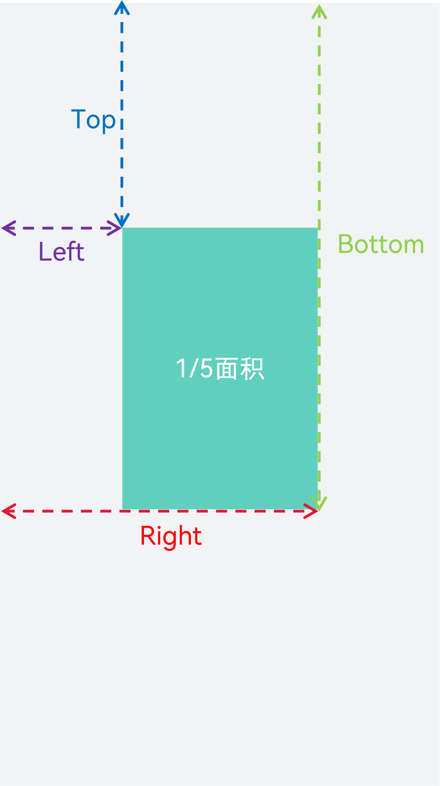
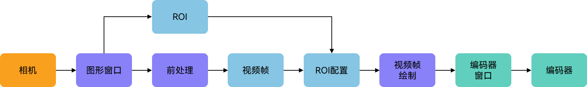
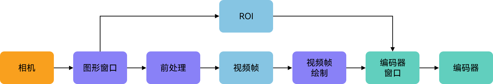
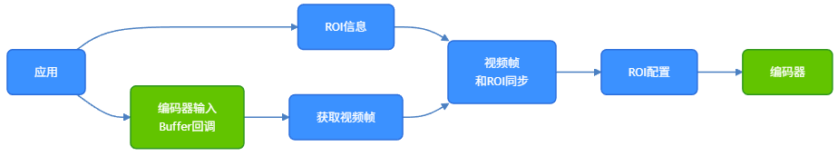

# ROI视频编码

<!--Kit: AVCodec Kit-->
<!--Subsystem: Multimedia-->
<!--Owner: @yang-xiaoyu5-->
<!--Designer: @dpy2650--->
<!--Tester: @cyakee-->
<!--Adviser: @w_Machine_cc-->

## 基础概念

从API version 20开始支持ROI视频编码（Region Of Interest Video Coding），该功能是基于硬件H.264/H.265编码能力扩展的高级优化技术。其核心逻辑为对画面中指定的重点区域分配更多编码资源实现高画质编码。在有限带宽条件下保障ROI区域内容清晰呈现，显著提升整体视觉体验。

开发者可自主定义视频画面中的ROI区域（如直播中的人脸、监控中的车牌等），并通过设定质量偏移参数，调节ROI区域与非ROI区域的编码质量差异，实现编码资源的差异化分配。

## 适用场景

ROI视频编码适用于因网络带宽限制导致码率不能满足视频画质要求，且能明确定义关键画面内容（ROI区域）的场景。比如视频通话、视频直播、安全监控等。

各场景中ROI区域的选择建议如下：
- 秀场直播：将主播面部区域设为ROI，优化人脸细节（如肤色、五官轮廓），提升观众沉浸式观看体验。
- 户外直播：将主播主体/核心拍摄景物（如自然风光、赛事画面核心区域）设为ROI，在移动网络带宽波动时保障核心内容清晰。
- 电商直播：将商品展示区域（如美妆试色、电子产品细节）设为ROI，清晰呈现商品外观、材质与功能细节，助力商品转化。
- 网课视频：将课件文字、讲义图表、板书内容区域设为ROI，保证知识点清晰可读，降低视觉疲劳，提升教学效果。
- 安全监控：将摄像头画面中的人脸、车牌、出入口等关键区域设为ROI，提升抓拍清晰度，便于后续识别分析。

根据编码模式和ROI配置方式的不同，提供了三种ROI编码开发示例，开发者可根据实际业务和技术架构选择。

| 不同场景对照点 | 直播/视频通话场景| 录像场景 | 编辑导出/内容发布场景 |
| :----: |:----:|:----:| :----: |
| **ROI信息生产者** | 相机 | 相机 | 应用 |
| **ROI信息获取方式** | 从视频帧NativeBuffer元数据提取 | 从视频帧NativeBuffer元数据提取 | 应用自管理 |
| **编码视频帧直接生产者** | 图形 | 图形 | 应用 |
| **编码模式** | Surface模式 | Surface模式 | Buffer模式 |
| **ROI参数配置方式** | NativeBuffer元数据配置（推荐） | 编码输入参数回调配置 | 编码输入Buffer回调配置 |
| **开发示例** | [Surface模式 - 方式一](#方式一通过nativebuffer元数据配置推荐) | [Surface模式 - 方式二](#方式二通过编码输入参数回调配置) | [Buffer模式](#buffer模式下配置roi) |

> **说明：**
>
> - 直播和录像场景均使用Surface模式编码，区别仅在于ROI配置方式。推荐使用NativeBuffer元数据配置方式，实现简单且与编码帧天然对齐。
> - 如果帧处理流程中无法修改编码器输入Buffer的元数据（如相机帧直接送入编码器Surface的场景），可选择编码输入参数回调配置方式。

## 约束和限制

**支持的编码器：** H.264 8bit硬件编码、H.265 8bit硬件编码、H.265 10bit硬件编码。

**支持的码控模式：** VBR(Variable Bit Rate)、CBR(Constant Bit Rate)、SQR(Stable Quality Rate Control)。

**依赖ROI检测识别能力：** 编码器不具备ROI的检测识别能力，所以ROI编码技术生效依赖于开发者输入的ROI信息。开发者可根据业务场景自行设计并实现ROI识别能力，或通过调用系统相机模块原生提供的人脸区域信息，降低开发成本，具体参考[相机人脸ROI获取示例](../camera/native-camera-metadata.md#状态监听)。

## 参数要求说明

ROI配置参数最终以字符串形式下发到编码器。从API版本26.0.0开始支持键值对格式，同时兼容旧版纯数值格式。所有坐标参数和数值参数均为整数。

**字符串格式：**

- 键值对格式（推荐）：`Top,Left-Bottom,Right=dqp:-6,slb:1`
- 纯数值格式（兼容旧版）：`Top,Left-Bottom,Right=DeltaQp`

**矩形区域定义：**
ROI是一个矩形区域，`Top,Left`和`Bottom,Right`分别定义了ROI的区域在图像中的左上角和右下角的坐标位置（如图1所示）。

**键值对参数：**

| 参数 | 含义 | 取值范围 | 是否必填 |       默认行为       |
| :----: | :----: | :----: |:----:|:----------------:|
| dqp | 量化参数偏移值（DeltaQP） | [-51, 51] |  否   | 未设置时编码器使用默认QP策略。 |
| slb | 语义标签（Semantic Label） | 0（其他）或1（人脸） |  否   | 未设置时使用默认语义处理策略。  |

- DeltaQp为负表示ROI区域编码画质优于非ROI区域，绝对值越大质量差异越大。纯数值格式中省略"=DeltaQp"时使用默认参数（=-3）。
- slb取值对应`OH_VideoMetadataRoiSemanticLabel`枚举：`OH_VIDEO_METADATA_ROI_SEM_LABEL_OTHER`（0）表示未指定区域类型，`OH_VIDEO_METADATA_ROI_SEM_LABEL_FACE`（1）表示人脸区域。
- 多个ROI参数之间通过";"连接，多ROI配置如`100,50-300,200=dqp:-6,slb:1;400,30-600,200=dqp:-3`。

**数量和面积限制：**
- 同一帧最多支持配置6个ROI区域，按照配置顺序，多出的ROI区域将被忽略。
- 总ROI面积不能超过图片面积的1/5，按照配置顺序依次累加，仅累加面积在限制之内的ROI区域生效。
- 
> **说明：**
>
> 当ROI数据来源于相机帧的NativeBuffer元数据时，开发者无需手动拼接字符串。可使用`OH_VideoMetadata_GetRoiCount`、`OH_VideoMetadata_ParseRoiString`和`OH_VideoMetadata_AppendRoiString`接口直接从相机帧的ROI元数据中解析区域信息、设置键值对参数（如`OH_MD_KEY_VIDEO_METADATA_ROI_DELTA_QP`、`OH_MD_KEY_VIDEO_METADATA_ROI_SEM_LABEL`），并自动生成符合编码器要求的配置字符串。

**图1：ROI坐标和最大允许面积占比示意图**



## 生效机制说明

配置ROI支持两种方式：**NativeBuffer元数据配置方式**和**编码输入回调配置方式**。编码输入回调配置方式包含编码输入参数回调（Surface模式）和编码输入buffer回调（Buffer模式）。
- NativeBuffer元数据配置方式（推荐）：从API version 22开始支持使用`OH_NativeBuffer_MetaDataKey`的ROI枚举`OH_REGION_OF_INTEREST_METADATA`，在NativeBuffer的元数据中配置ROI参数。
- 编码输入回调配置方式：使用视频编码参数`OH_MD_KEY_VIDEO_ENCODER_ROI_PARAMS`在编码输入回调中配置。

**通用生效机制：**
1. ROI参数支持随帧下发并实时生效，开发者无需进行能力查询或配置全局开关。
2. 如果系统编码器不支持ROI编码能力，编码器会忽略ROI参数，进行普通编码。
3. DeltaQp有效取值范围为[-51, 51]，编码器会在ROI区域的QP上叠加DeltaQp，然后限制到[minQp, maxQp]范围内得到最终QP。
4. 当某一帧未配置ROI参数时，若上一帧生效了ROI编码，则复用上一帧ROI信息进行当前帧ROI编码；若上一帧是普通编码，则进行普通编码。
5. 当某一帧配置的ROI参数无法解析出任何有效ROI信息时，进行普通编码。
6. 如果多个ROI区域产生交叠，按照配置顺序，仅最先配置的ROI区域会在交叠处生效。

**NativeBuffer元数据配置方式独有机制：** 最大支持256Byte长度字符，超出部分会被截断。

**空字符串处理差异：**
- NativeBuffer元数据配置方式：不允许配置空字符串，视作未配置ROI参数，当前帧会继承历史帧信息进行ROI编码。
- 编码输入回调配置方式：允许配置空字符串，但因无法解析出有效ROI信息，编码时按照普通编码方式进行编码。

> **说明：**
>
> 因空字符串处理存在差异，应避免配置空字符串。如需关闭某一帧的ROI编码，可配置无位置信息的字符串，如"Clear"或";"等。

**同时配置时的生效优先级：** 当某一帧的两种方式均有配置ROI参数，仅生效以编码输入回调配置方式下发的ROI参数，无论其能否解析出有效ROI信息。

## 开发示例

以下开发示例按照编码模式组织。Surface模式和Buffer模式共用相同的ROI信息获取与组装流程，区别在于如何将ROI配置到编码器。

> **说明：**
>
> 当相机输出视频帧时，如果检测到ROI区域（如人脸），会将ROI信息写入帧的NativeBuffer元数据中（`OH_REGION_OF_INTEREST_METADATA`），开发者可直接从每帧中提取，无需额外的回调接口和时间戳匹配。

### 方式一：通过NativeBuffer元数据配置（推荐）

Surface模式下，相机将视频帧输出到OH_NativeImage的Surface上，开发者在帧处理线程中从每帧的NativeBuffer元数据提取ROI信息并组装成配置字符串，随后将ROI字符串写入编码器输入帧的NativeBuffer元数据，实现ROI随帧下发到编码器（如图2所示）。

**图2：NativeBuffer元数据接口配置ROI流程图**



详细开发步骤如下：

1. 在CMakeList.txt中链接动态库。

   <!-- @[roi_cmake_link_libraries](https://gitcode.com/openharmony/applications_app_samples/blob/master/code/DocsSample/Media/AVCodec/ROISample/entry/src/main/cpp/CMakeLists.txt) -->
   
   ``` txt
   set(BASE_LIBRARY
       libace_napi.z.so libEGL.so libGLESv3.so libace_ndk.z.so libuv.so libhilog_ndk.z.so
       libnative_media_codecbase.so libnative_media_core.so libnative_media_vdec.so libnative_window.so
       libnative_media_venc.so libnative_media_acodec.so libnative_media_avdemuxer.so libnative_media_avsource.so
       libnative_media_avmuxer.so libohaudio.so libnative_buffer.so libnative_vsync.so libnative_image.so libdeviceinfo_ndk.z.so
   )

   add_library(recorder SHARED recorder/RecorderNative.cpp
                               recorder/Recorder.cpp
                               capbilities/codec/Muxer.cpp
                               capbilities/codec/VideoEncoder.cpp
                               capbilities/codec/AudioCapturer.cpp
                               capbilities/codec/AudioEncoder.cpp
                               capbilities/codec/CodecCallback.cpp
                               capbilities/render/egl_render_context.cpp
                               capbilities/render/render_thread.cpp
                               capbilities/render/shader_program.cpp
                               common/RoiQueue.cpp
   )

   target_link_libraries(recorder PUBLIC ${BASE_LIBRARY} player)
   ```
   > **说明：**
   >
   > 上述'recorder','player'字样仅为示例，此处应由开发者根据具体的CMake工程目标名称进行替换。

2. 从视频帧NativeBuffer元数据提取ROI信息。

   相机输出视频帧时，若检测到ROI区域（如人脸），会将ROI信息写入帧的NativeBuffer元数据中。开发者可通过`OH_NativeBuffer_GetMetadataValue`提取ROI原始字符串。

   <!-- @[roi_buffer_roi_extraction](https://gitcode.com/openharmony/applications_app_samples/blob/master/code/DocsSample/Media/AVCodec/ROISample/entry/src/main/cpp/capbilities/render/render_thread.cpp) -->
   
   ``` C++
   OH_NativeBuffer *nativeBuffer = nullptr;
   int32_t ret = OH_NativeBuffer_FromNativeWindowBuffer(InBuffer, &nativeBuffer);
   if (ret == 0 && nativeBuffer != nullptr) {
       int32_t roiSize = 0;
       uint8_t *roiData = nullptr;
       ret = OH_NativeBuffer_GetMetadataValue(nativeBuffer,
           OH_NativeBuffer_MetadataKey::OH_REGION_OF_INTEREST_METADATA, &roiSize, &roiData);
       if (ret == 0 && roiData != nullptr && roiSize > 0) {
           return std::string(reinterpret_cast<char*>(roiData), roiSize);
       }
   }
   ```

   > **说明：**
   >
   > `InBuffer`为通过OH_NativeImage_AcquireNativeWindowBuffer从OH_NativeImage获取的相机帧，相机输出的ROI信息已写入该Buffer的元数据中。关于NativeImage的创建和帧接收机制，请参考[视频编码](video-encoding.md)开发指南中Surface模式的相关说明。

3. 使用OH_VideoMetadata API组装ROI配置字符串。

   提取的ROI原始字符串包含区域坐标信息，开发者需要通过`OH_VideoMetadata_GetRoiCount`、`OH_VideoMetadata_ParseRoiString`和`OH_VideoMetadata_AppendRoiString`接口解析原始ROI并追加DeltaQP参数，生成完整的ROI配置字符串（如"100,50-300,200=dqp:-6"）。

   <!-- @[roi_buffer_roi_assembly](https://gitcode.com/openharmony/applications_app_samples/blob/master/code/DocsSample/Media/AVCodec/ROISample/entry/src/main/cpp/capbilities/render/render_thread.cpp) -->
   
   ``` C++
   if (currentRoiStr.empty()) {
       return "";
   }
   uint32_t roiCount = 0;
   OH_AVErrCode roiRet = OH_VideoMetadata_GetRoiCount(currentRoiStr.c_str(), &roiCount);
   if (roiRet != AV_ERR_OK || roiCount == 0) {
       return "";
   }
   std::vector<OH_AVFormat*> parsedFormats(roiCount, nullptr);
   uint32_t actualCount = 0;
   roiRet = OH_VideoMetadata_ParseRoiString(currentRoiStr.c_str(), parsedFormats.data(),
                                            roiCount, &actualCount);
   if (roiRet != AV_ERR_OK || actualCount == 0) {
       return "";
   }
   char *assembledStr = nullptr;
   for (uint32_t i = 0; i < actualCount; i++) {
       if (parsedFormats[i] != nullptr) {
           OH_AVFormat_SetIntValue(parsedFormats[i], OH_MD_KEY_VIDEO_METADATA_ROI_DELTA_QP,
               ROI_DELTA_QP);
           OH_VideoMetadata_AppendRoiString(&assembledStr, parsedFormats[i]);
           OH_AVFormat_Destroy(parsedFormats[i]);
           parsedFormats[i] = nullptr;
       }
   }
   std::string result;
   if (assembledStr != nullptr) {
       result = std::string(assembledStr);
       free(assembledStr);
   }
   ```

   > **说明：**
   >
   > `OH_VideoMetadata_AppendRoiString`会在内部进行内存扩容，返回的C风格字符串需要开发者调用`free()`释放。

4. 将ROI配置字符串写入编码器输入帧的NativeBuffer元数据。

   在Surface模式下，编码器通过Surface接收视频帧。开发者需要先通过`OH_NativeWindow_NativeWindowRequestBuffer`从编码器Surface请求Buffer，再将组装好的ROI字符串写入该Buffer的NativeBuffer元数据中。

   <!-- @[roi_nativebuffer_metadata_config](https://gitcode.com/openharmony/applications_app_samples/blob/master/code/DocsSample/Media/AVCodec/ROISample/entry/src/main/cpp/capbilities/render/render_thread.cpp) -->
   
   ``` C++
   OH_NativeBuffer *encoderNativeBuffer = nullptr;
   int32_t ret = OH_NativeBuffer_FromNativeWindowBuffer(OutBufferEncoder, &encoderNativeBuffer);
   if (ret == 0 && encoderNativeBuffer != nullptr) {
       int32_t roiStrSize = static_cast<int32_t>(assembledRoiStr.size());
       ret = OH_NativeBuffer_SetMetadataValue(encoderNativeBuffer,
           OH_NativeBuffer_MetadataKey::OH_REGION_OF_INTEREST_METADATA,
           roiStrSize, reinterpret_cast<uint8_t*>(const_cast<char*>(assembledRoiStr.data())));
       if (ret != 0) {
           OH_LOG_Print(LOG_APP, LOG_WARN, LOG_PRINT_DOMAIN, "RenderThread",
                        "OH_NativeBuffer_SetMetadataValue failed, ret: %{public}d", ret);
       } else {
           OH_LOG_Print(LOG_APP, LOG_INFO, LOG_PRINT_DOMAIN, "RenderThread",
                        "ROI metadata written to encoder buffer: %{public}s", assembledRoiStr.c_str());
       }
   }
   ```

5. 将Buffer提交给编码器并释放资源。

   ROI配置完成后，通过`OH_NativeWindow_NativeWindowFlushBuffer`将预览Buffer和编码器Buffer提交，并释放相机帧资源。

   <!-- @[roi_surface_flush_buffer](https://gitcode.com/openharmony/applications_app_samples/blob/master/code/DocsSample/Media/AVCodec/ROISample/entry/src/main/cpp/capbilities/render/render_thread.cpp) -->

   ``` C++
   void RenderThread::FlushAndCleanup(OHNativeWindowBuffer *InBuffer, int32_t fenceFd1,
       OHNativeWindowBuffer *OutBuffer, OHNativeWindowBuffer *OutBufferEncoder)
   {
       OH_NativeWindow_NativeObjectUnreference(InBuffer);
       OH_NativeImage_ReleaseNativeWindowBuffer(nativeImage_, InBuffer, fenceFd1);

       Region region{nullptr, 0};
       int acquireFenceFd = -1;
       OH_NativeWindow_NativeWindowFlushBuffer(nativeWindow_, OutBuffer, acquireFenceFd, region);
       if (OutBufferEncoder != nullptr) {
           OH_NativeWindow_NativeWindowFlushBuffer(encoderNativeWindow_, OutBufferEncoder, acquireFenceFd, region);
       }
   }
   ```

### 方式二：通过编码输入参数回调配置

此方式同样适用于Surface模式。从帧的NativeBuffer元数据中提取ROI信息，配置方式通过`OH_VideoEncoder_RegisterParameterCallback`注册的编码输入参数回调完成（如图3所示）。

编码器在接收到视频帧时触发参数回调，由于参数回调不包含帧时间戳信息，开发者需要使用以PTS（时间戳）为键的同步队列（RoiQueue）将帧处理线程中的ROI数据按时间顺序传递到编码回调。回调中从队列弹出最老的ROI条目，通过`OH_AVFormat_SetStringValue`配置到参数格式中。

**图3：编码输入参数回调接口配置ROI流程图**



详细开发步骤如下：

1. 在CMakeList.txt中链接动态库。

   同[方式一：通过nativebuffer元数据配置（推荐）](#方式一通过nativebuffer元数据配置推荐)步骤1。

2. 从视频帧NativeBuffer元数据提取ROI信息。

   同[方式一：通过nativebuffer元数据配置（推荐）](#方式一通过nativebuffer元数据配置推荐)步骤2。

3. 使用OH_VideoMetadata API组装ROI配置字符串。

   同[方式一：通过nativebuffer元数据配置（推荐）](#方式一通过nativebuffer元数据配置推荐)步骤3。

4. 实现PTS同步队列与回调用户数据结构。

   由于参数回调不包含帧时间戳信息，无法直接将ROI数据与编码帧对齐。建议实现一个以PTS为键的同步队列，将帧处理线程中的ROI数据按PTS顺序传递到编码回调。编码回调通过用户数据结构中的队列指针访问队列，Pop弹出最老条目获取ROI配置字符串。

   `CodecUserRoi`是定义在VideoEncoder类内部的嵌套结构体，包含队列指针以便回调直接访问。

   <!-- @[roi_user_data_struct](https://gitcode.com/openharmony/applications_app_samples/blob/master/code/DocsSample/Media/AVCodec/ROISample/entry/src/main/cpp/capbilities/codec/include/VideoEncoder.h) -->
   
   ``` C
   // 参数回调配置的用户数据结构。
   struct CodecUserRoi {
       VideoEncoder* vencoder = nullptr;
       RoiQueue* roiQueue = nullptr;
   };
   ```

5. 注册编码输入参数回调。

   在创建编码器后、Configure之前，注册编码输入参数回调。必须在Configure之前注册，否则回调不会生效。

   <!-- @[roi_register_parameter_callback](https://gitcode.com/openharmony/applications_app_samples/blob/master/code/DocsSample/Media/AVCodec/ROISample/entry/src/main/cpp/capbilities/codec/VideoEncoder.cpp) -->
   
   ``` C++
   // 参数回调配置：在Configure之前注册参数回调。
   if (roiPathType_ == ROI_PATH_METADATA_CALLBACK) {
       userData_ = std::make_unique<CodecUserRoi>();
       if (userData_) {
           userData_->vencoder = this;
           userData_->roiQueue = &roiQueue_;
       }
       int32_t ret = OH_VideoEncoder_RegisterParameterCallback(encoder_, OnNeedInputParameter, userData_.get());
       CHECK_AND_RETURN_RET_LOG(ret == AV_ERR_OK, SAMPLE_ERR_ERROR,
                                "OH_VideoEncoder_RegisterParameterCallback failed, ret: %{public}d", ret);
       SAMPLE_LOGI("参数回调配置: ROI parameter callback registered.");
   }
   ```

   > **说明：**
   >
   > `OH_VideoEncoder_RegisterParameterCallback`必须在`OH_VideoEncoder_Configure`之前调用。回调注册后，编码器每接收一帧输入数据都会触发`OnNeedInputParameter`回调。

6. 在编码输入参数回调中配置ROI信息。

   当编码器接收到输入数据时，会触发`OnNeedInputParameter`回调。在回调中，从RoiQueue中弹出PTS最小的ROI条目，并通过`OH_AVFormat_SetStringValue`配置到参数格式中。即使弹出空字符串也显式设置，以明确表达"此帧无ROI"。

   <!-- @[roi_encode_parameter_callback](https://gitcode.com/openharmony/applications_app_samples/blob/master/code/DocsSample/Media/AVCodec/ROISample/entry/src/main/cpp/capbilities/codec/VideoEncoder.cpp) -->
   
   ``` C++
   static void OnNeedInputParameter(OH_AVCodec *codec, uint32_t index, OH_AVFormat *parameter, void *userData)
   {
       auto *roiUserData = static_cast<VideoEncoder::CodecUserRoi *>(userData);
       if (!roiUserData || !roiUserData->roiQueue) {
           OH_VideoEncoder_PushInputParameter(codec, index);
           return;
       }
   
       std::string roiStr = roiUserData->roiQueue->Pop();
       OH_AVFormat_SetStringValue(parameter, OH_MD_KEY_VIDEO_ENCODER_ROI_PARAMS, roiStr.c_str());
       if (!roiStr.empty()) {
           SAMPLE_LOGI("ROI configured (parameter callback path): %{public}s", roiStr.c_str());
       }
       OH_VideoEncoder_PushInputParameter(codec, index);
   }
   ```

7. 将组装好的ROI字符串连同帧PTS传递到VideoEncoder的RoiQueue。

   在帧处理线程中提取并组装ROI字符串后，需要将ROI字符串以PTS为索引，推入VideoEncoder的RoiQueue中。RoiQueue以PTS为键排序，确保编码回调按帧顺序获取ROI数据，避免错位。

   <!-- @[roi_parameter_callback_str_passing](https://gitcode.com/openharmony/applications_app_samples/blob/master/code/DocsSample/Media/AVCodec/ROISample/entry/src/main/cpp/capbilities/render/render_thread.cpp) -->
   
   ``` C++
   int64_t pts = OH_NativeImage_GetTimestamp(nativeImage_);
   if (roiPathType_ == ROI_PATH_METADATA_CALLBACK && onRoiStrAssembled_) {
       onRoiStrAssembled_(pts, assembledRoiStr);
   }
   ```

   VideoEncoder将ROI数据推入RoiQueue：

   <!-- @[roi_parameter_callback_queue_storage](https://gitcode.com/openharmony/applications_app_samples/blob/master/code/DocsSample/Media/AVCodec/ROISample/entry/src/main/cpp/capbilities/codec/VideoEncoder.cpp) -->
   
   ``` C++
   // 参数回调配置：将ROI条目按PTS推入RoiQueue。
   void VideoEncoder::PushRoiEntry(int64_t pts, const std::string &roiStr)
   {
       roiQueue_.Push(pts, roiStr);
   }
   
   // 参数回调配置：ROI关闭时清空RoiQueue。
   void VideoEncoder::ClearRoiQueue()
   {
       roiQueue_.Clear();
   }
   ```


> **说明：**
>
> RoiQueue以PTS为键排序存储ROI条目。编码回调通过`Pop`方法取出PTS最小的条目，保证帧与ROI的顺序一致性。如果队列为空，`Pop`最多等待3ms再返回空字符串。队列会自动清理超过2秒的陈旧条目，防止无限增长。每帧均应Push（包括空ROI串），以显式表达"此帧无ROI"；关闭ROI时调用`ClearRoiQueue`清空队列。

### Buffer模式下配置ROI

Buffer模式下，视频帧通过`OH_VideoEncoder_PushInputBuffer`送入编码器，开发者需要在`OnNeedInputBuffer`回调中填充帧像素数据的同时配置ROI信息。由于Buffer模式没有编码器Surface，帧像素数据需要从相机帧Buffer中拷贝出来，连同ROI字符串一起推入帧队列供编码回调消费（如图4所示）。

**图4：编码输入Buffer回调接口配置ROI流程图**



详细开发步骤如下：

1. 在CMakeList.txt中链接动态库。

   同[方式一：通过nativebuffer元数据配置（推荐）](#方式一通过nativebuffer元数据配置推荐)步骤1。

2. 从视频帧NativeBuffer元数据提取ROI信息。

   同[方式一：通过nativebuffer元数据配置（推荐）](#方式一通过nativebuffer元数据配置推荐)步骤2。

3. 使用OH_VideoMetadata API组装ROI配置字符串。

   同[方式一：通过nativebuffer元数据配置（推荐）](#方式一通过nativebuffer元数据配置推荐)步骤3。

4. 定义帧数据结构和帧队列。

   Buffer模式下，编码器通过回调请求输入Buffer。开发者需要将相机帧的像素数据和ROI字符串封装为帧数据项，推入线程安全的帧队列供编码回调消费。

   <!-- @[roi_frame_item_struct](https://gitcode.com/openharmony/applications_app_samples/blob/master/code/DocsSample/Media/AVCodec/ROISample/entry/src/main/cpp/common/FrameQueue.h) -->
   
   ``` C
   // Buffer模式编码的帧数据项。
   constexpr uint32_t FRAME_QUEUE_POP_TIMEOUT_MS = 4;
   constexpr size_t FRAME_QUEUE_MAX_SIZE = 3;
   
   struct FrameItem {
       std::vector<uint8_t> pixels;
       int32_t width = 0;
       int32_t height = 0;
       std::string roiStr;
   };
   ```

5. 将帧像素数据和ROI字符串推入帧队列。

   在帧处理线程中，从相机帧Buffer读取像素数据，连同组装好的ROI字符串一起推入帧队列。

   <!-- @[roi_buffer_pixel_read](https://gitcode.com/openharmony/applications_app_samples/blob/master/code/DocsSample/Media/AVCodec/ROISample/entry/src/main/cpp/capbilities/render/render_thread.cpp) -->
   
   ``` C++
   // Buffer模式：从相机帧读取像素数据并推入帧队列。
   BufferHandle *bufferHandle = OH_NativeWindow_GetBufferHandleFromNative(InBuffer);
   if (bufferHandle == nullptr) {
       return;
   }
   OH_NativeBuffer *cameraNativeBuffer = nullptr;
   int32_t ret = OH_NativeBuffer_FromNativeWindowBuffer(InBuffer, &cameraNativeBuffer);
   if (ret != 0 || cameraNativeBuffer == nullptr) {
       return;
   }
   void *virAddr = nullptr;
   ret = OH_NativeBuffer_Map(cameraNativeBuffer, &virAddr);
   if (ret != 0 || virAddr == nullptr) {
       return;
   }
   int32_t frameWidth = bufferHandle->width;
   int32_t frameHeight = bufferHandle->height;
   int32_t stride = bufferHandle->stride;
   int32_t frameSize = stride * frameHeight;
   FrameItem frameItem;
   frameItem.width = frameWidth;
   frameItem.height = frameHeight;
   frameItem.roiStr = assembledRoiStr;
   frameItem.pixels.resize(frameSize);
   std::copy(static_cast<uint8_t *>(virAddr),
             static_cast<uint8_t *>(virAddr) + frameSize,
             frameItem.pixels.data());
   frameQueue_->Push(frameItem);
   OH_NativeBuffer_Unmap(cameraNativeBuffer);
   OH_LOG_Print(LOG_APP, LOG_INFO, LOG_PRINT_DOMAIN, "RenderThread",
                "Buffer模式: pushed frame to queue, size: %{public}d, ROI: %{public}s",
                frameSize, assembledRoiStr.c_str());
   ```

   > **说明：**
   >
   > Buffer模式需要从相机帧Buffer拷贝像素数据到应用内存，存在额外的数据拷贝开销，相比Surface模式的零拷贝机制会有更高的延迟。开发者应根据实际场景选择合适的编码模式。

6. 在编码输入Buffer回调中配置ROI信息。

   当编码器请求输入Buffer时，从帧队列弹出帧数据项，将像素数据拷贝到编码器Buffer中，并通过`OH_AVBuffer_GetParameter`获取格式后设置ROI字符串。

   其中`FillBufferModeInput`的实现如下：

   <!-- @[roi_buffer_mode_callback](https://gitcode.com/openharmony/applications_app_samples/blob/master/code/DocsSample/Media/AVCodec/ROISample/entry/src/main/cpp/capbilities/codec/CodecCallback.cpp) -->
   
   ``` C++
   static void FillBufferModeInput(OH_AVCodec *codec, uint32_t index, OH_AVBuffer *buffer,
       CodecUserData *codecUserData)
   {
       FrameItem frameItem;
       if (!codecUserData->frameQueue->Pop(frameItem, std::chrono::milliseconds(FRAME_QUEUE_POP_TIMEOUT_MS))) {
           OH_VideoEncoder_PushInputBuffer(codec, index);
           return;
       }
       uint8_t *bufferAddr = OH_AVBuffer_GetAddr(buffer);
       int32_t bufferCapacity = OH_AVBuffer_GetCapacity(buffer);
       if (bufferAddr != nullptr && bufferCapacity >= static_cast<int32_t>(frameItem.pixels.size())) {
           std::copy(frameItem.pixels.data(), frameItem.pixels.data() + frameItem.pixels.size(), bufferAddr);
           OH_AVCodecBufferAttr attr;
           attr.size = static_cast<int32_t>(frameItem.pixels.size());
           attr.offset = 0;
           attr.flags = AVCODEC_BUFFER_FLAGS_NONE;
           OH_AVBuffer_SetBufferAttr(buffer, &attr);
       }
       if (!frameItem.roiStr.empty()) {
           OH_AVFormat *format = OH_AVBuffer_GetParameter(buffer);
           if (format != nullptr) {
               OH_AVFormat_SetStringValue(format, OH_MD_KEY_VIDEO_ENCODER_ROI_PARAMS, frameItem.roiStr.c_str());
           }
       }
       OH_VideoEncoder_PushInputBuffer(codec, index);
   }
   
   void CodecCallback::OnNeedInputBuffer(OH_AVCodec *codec, uint32_t index, OH_AVBuffer *buffer, void *userData)
   {
       if (userData == nullptr) {
           return;
       }
       CodecUserData *codecUserData = static_cast<CodecUserData *>(userData);
   
       // Buffer模式：用帧队列的像素数据和ROI填充编码器Buffer。
       if (codecUserData->roiPathType == ROI_PATH_BUFFER_MODE && codecUserData->frameQueue != nullptr) {
           FillBufferModeInput(codec, index, buffer, codecUserData);
           return;
       }
   ```
