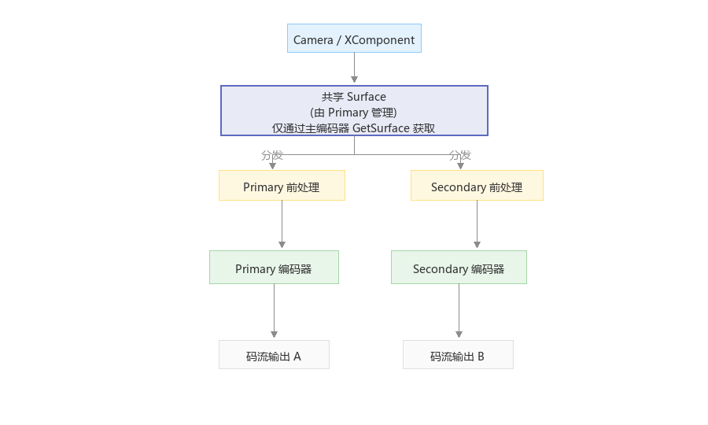

# 编码支持一入二出

<!--Kit: AVCodec Kit-->
<!--Subsystem: Multimedia-->
<!--Owner: @zhanghongran-->
<!--Designer: @dpy2650-->
<!--Tester: @cyakee-->
<!--Adviser: @w_Machine_cc-->

从API版本26.0.0开始，支持一入二出编码，主副编码器分别支持前处理配置。


## 功能简介

**一入二出（One Input Dual Outputs）** 是指通过同一份视频输入数据，同时驱动 **两个独立编码器** 产生两路不同编码码流的能力。

| 编码器角色 | 创建方式 | 说明 |
|-----------|----------|------|
| 主编码器（Primary） | [OH_VideoEncoder_CreatePrimaryWithPreproc](../../reference/apis-avcodec-kit/capi-native-avcodec-videoencoder-h.md#oh_videoencoder_createprimarywithpreproc)创建 | 管理共享输入Surface，负责前处理管线调度，可配置独立的编码参数和前处理参数。 |
| 副编码器（Secondary） | [OH_VideoEncoder_CreateSecondaryFromPrimary](../../reference/apis-avcodec-kit/capi-native-avcodec-videoencoder-h.md#oh_videoencoder_createsecondaryfromprimary)从主编码器创建 | 共享主编码器的输入源，可配置独立的编码参数和前处理参数。 |

### 架构图

以下为一入二出架构图：



### 使用场景
应用可依据自己的场景选择使用，场景使用举例见下表：
| 场景 | 主编码器（Primary） | 副编码器（Secondary） | 用途说明 |
|------|---------------------|----------------------|----------|
| 多码率直播（ABR） | 高码率主码流。 | 降采样 + 丢帧的低码流。 | 根据网络带宽自适应切换。 |
| ROI 区域关注 | 全帧编码归档。 | 裁剪感兴趣区域编码 | 监控全帧存储 + 局部区域分析。 |
| 多人视频通话 | 全分辨率、高帧率（本地显示）。 | 降采样 + 丢帧、低码率（远端传输）。 | 本地高清预览 + 远端低带宽实时通话。 |

### 约束与限制

**创建与生命周期约束**

| 序号 | 约束规则 |
|------|----------|
| 1 | Secondary数量：每个Primary同时最多挂载**1个**Secondary。 |
| 2 | 创建顺序：必须先创建Primary，再从Primary派生Secondary。 |
| 3 | 生命周期关系：Primary是Secondary的所有者（Owner），Secondary不得脱离Primary独立存在。<br>- **推荐销毁顺序**：先`Destroy(Secondary)` → 再`Destroy(Primary)`，销毁后立即将对应指针赋值`nullptr`。<br>- **容错机制**：若违反顺序先 Destroy Primary，系统会级联释放关联的Secondary，但仍应显式遵循正确顺序。 |
| 4 | 重建能力：Secondary销毁后，可以从同一个Primary重新创建新的Secondary。 |

**接口可用性约束**

| 接口 | 主编码器 | 副编码器 | 备注 |
|------|:--------:|:--------:|------|
| [OH_VideoEncoder_CreatePrimaryWithPreproc](../../reference/apis-avcodec-kit/capi-native-avcodec-videoencoder-h.md#oh_videoencoder_createprimarywithpreproc) | √ | N/A | 创建主编码器入口。 |
| [OH_VideoEncoder_CreateSecondaryFromPrimary](../../reference/apis-avcodec-kit/capi-native-avcodec-videoencoder-h.md#oh_videoencoder_createsecondaryfromprimary) | √ | N/A | 创建副编码器入口，仅可以通过主编码器句柄创建。 |
| [OH_VideoEncoder_RegisterCallback](../../reference/apis-avcodec-kit/capi-native-avcodec-videoencoder-h.md#oh_videoencoder_registercallback) | √ | √ | 各自独立注册。 |
| [OH_VideoEncoder_RegisterParameterCallback](../../reference/apis-avcodec-kit/capi-native-avcodec-videoencoder-h.md#oh_videoencoder_registerparametercallback) | × | × | 不支持随帧参数。 |
| [OH_VideoEncoder_PushInputParameter](../../reference/apis-avcodec-kit/capi-native-avcodec-videoencoder-h.md#oh_videoencoder_pushinputparameter) | × | × | 不支持随帧参数。 |
| [OH_VideoEncoder_Configure](../../reference/apis-avcodec-kit/capi-native-avcodec-videoencoder-h.md#oh_videoencoder_configure) | √ | √ | 各自独立配置（分辨率、码率、前处理等均可不同）。 |
| [OH_VideoEncoder_GetSurface](../../reference/apis-avcodec-kit/capi-native-avcodec-videoencoder-h.md#oh_videoencoder_getsurface) | √ | × | **仅限主编码器调用者**，副编码器调用返回错误。 |
| [OH_VideoEncoder_Prepare](../../reference/apis-avcodec-kit/capi-native-avcodec-videoencoder-h.md#oh_videoencoder_prepare) | √ | √ | 各自准备资源，参考普通编码器。 |
| [OH_VideoEncoder_Start](../../reference/apis-avcodec-kit/capi-native-avcodec-videoencoder-h.md#oh_videoencoder_start) | √ | √ | 各自独立控制，参考普通编码器。 |
| [OH_VideoEncoder_Stop](../../reference/apis-avcodec-kit/capi-native-avcodec-videoencoder-h.md#oh_videoencoder_stop) | √ | √ | 各自独立控制，参考普通编码器。 |
| [OH_VideoEncoder_Flush](../../reference/apis-avcodec-kit/capi-native-avcodec-videoencoder-h.md#oh_videoencoder_flush) | √ | √ | 各自独立控制，参考普通编码器。 |
| [OH_VideoEncoder_Reset](../../reference/apis-avcodec-kit/capi-native-avcodec-videoencoder-h.md#oh_videoencoder_reset) | √ | √ | 各自独立控制，参考普通编码器。 |
| [OH_VideoEncoder_SetParameter](../../reference/apis-avcodec-kit/capi-native-avcodec-videoencoder-h.md#oh_videoencoder_setparameter) | √ | √ | 运行时动态调整。 |
| [OH_VideoEncoder_NotifyEndOfStream](../../reference/apis-avcodec-kit/capi-native-avcodec-videoencoder-h.md#oh_videoencoder_notifyendofstream) | √ | √ | Surface模式专用。 |
| [OH_VideoEncoder_FreeOutputBuffer](../../reference/apis-avcodec-kit/capi-native-avcodec-videoencoder-h.md#oh_videoencoder_freeoutputbuffer) | √ | √ | 各自释放各自的 output buffer。 |
| [OH_VideoEncoder_PushInputData](../../reference/apis-avcodec-kit/capi-native-avcodec-videoencoder-h.md#oh_videoencoder_pushinputdata) | × | × | 不支持 Buffer模式。 |
| [OH_VideoEncoder_PushInputBuffer](../../reference/apis-avcodec-kit/capi-native-avcodec-videoencoder-h.md#oh_videoencoder_pushinputbuffer) | × | × | 不支持Buffer模式。 |
| [OH_VideoEncoder_QueryInputBuffer](../../reference/apis-avcodec-kit/capi-native-avcodec-videoencoder-h.md#oh_videoencoder_queryinputbuffer) | × | × | 不支持同步模式。 |
| [OH_VideoEncoder_QueryOutputBuffer](../../reference/apis-avcodec-kit/capi-native-avcodec-videoencoder-h.md#oh_videoencoder_queryoutputbuffer) | × | × | 不支持同步模式。 |
| [OH_VideoEncoder_GetInputDescription](../../reference/apis-avcodec-kit/capi-native-avcodec-videoencoder-h.md#oh_videoencoder_getinputdescription) | √ | √ | 含前处理元数据信息。 |
| [OH_VideoEncoder_GetOutputDescription](../../reference/apis-avcodec-kit/capi-native-avcodec-videoencoder-h.md#oh_videoencoder_getoutputdescription) | √ | √ | 各自信息查询，参考普通编码器。 |
| [OH_VideoEncoder_IsValid](../../reference/apis-avcodec-kit/capi-native-avcodec-videoencoder-h.md#oh_videoencoder_isvalid) | √ | √ | 各自有效性判断，参考普通编码器。 |
| [OH_VideoEncoder_Destroy](../../reference/apis-avcodec-kit/capi-native-avcodec-videoencoder-h.md#oh_videoencoder_destroy) | √ | √ | 先销毁Secondary，再销毁Primary。 |

**配置约束**

| 约束项 | 说明 |
|--------|------|
| Surface 共享 | 主/副编码器共享同一个 Consumer Surface，仅需从 `GetSurface` 获取一次并绑定到数据源（Camera/XComponent）。 |
| Window 生命周期 | `OH_VideoEncoder_GetSurface` 获取的window实例需由开发者负责释放，在所有编码器Destroy之后调用`OH_NativeWindow_DestroyNativeWindow(window)` 销毁。 |
| 前处理独立性 | 每个编码器可分别配置不同的降采样/裁剪/丢帧策略；但每个编码器内部降采样与裁剪仍然互斥。 |
| 回调独立性 | 两路的`onNewOutputBuffer`回调在不同线程中触发，需各自释放FreeOutputBuffer。 |


## 开发步骤

### 创建主编码器（Primary）

在创建前处理编码器之前，建议先通过能力查询接口确认当前编码器是否支持所需的前处理特性：

```cpp
const char *mime = OH_AVCODEC_MIMETYPE_VIDEO_AVC;

OH_AVCapability *capability = OH_AVCodec_GetCapability(mime, true);
if (capability == nullptr) {
    return -1; // 获取能力失败，可能是不支持的MIME类型。
}

// 查询是否支持降采样前处理特性。
bool supportDownsampling = OH_AVCapability_IsFeatureSupported(capability,
    VIDEO_ENCODER_PREPROC_DOWNSAMPLING);

// 查询是否支持裁剪前处理特性。
bool supportCrop = OH_AVCapability_IsFeatureSupported(capability,
    VIDEO_ENCODER_PREPROC_CROP);

static OH_AVCodec *g_primary = nullptr;
OH_AVErrCode ret = OH_VideoEncoder_CreatePrimaryWithPreproc(mime, &g_primary);
if (ret != AV_ERR_OK || g_primary == nullptr) {
    // 异常处理。
    return -1;
}
```

### 注册主编码器回调

和普通编码器实现一致，参考视频编码[Surface模式](video-encoding.md#surface模式)的“步骤3-调用OH_VideoEncoder_RegisterCallback()设置回调函数”。

### 配置主编码器

编码器参数配置参考视频编码[Surface模式](video-encoding.md#surface模式)的“步骤5-调用OH_VideoEncoder_Configure()配置编码器”。以下内容重点说明基础参数与前处理参数的配置。

```c++
OH_AVFormat *format = OH_AVFormat_Create();

// 基础编码参数（必填）。
OH_AVFormat_SetIntValue(format, OH_MD_KEY_WIDTH, 1920);         // 输入宽度（像素）。
OH_AVFormat_SetIntValue(format, OH_MD_KEY_HEIGHT, 1080);        // 输入高度（像素）。
OH_AVFormat_SetDoubleValue(format, OH_MD_KEY_FRAME_RATE, 30.0); // 原始帧率（丢帧功能的前置依赖）。

// 前处理参数（按需选用，先通过IsFeatureSupported确认特性支持后再配置）。
// 方案 A：降采样示例。
// 以下示例为将 1920x1080 缩放到 640x360 后编码。
// 注意：width 和 height 必须成对出现。
if (supportDownsampling) {
    OH_AVFormat_SetIntValue(format, OH_MD_KEY_VIDEO_ENCODER_PREPROC_DOWNSAMPLING_WIDTH, 640);
    OH_AVFormat_SetIntValue(format, OH_MD_KEY_VIDEO_ENCODER_PREPROC_DOWNSAMPLING_HEIGHT, 360);
}

// 方案 B：裁剪示例（需supportCrop为true）。
// 以下示例为从 1920x1080 中裁剪中心 1280x720 区域。
// 注意：left/top/right/bottom 必须全部同时出现。
//       降采样与裁剪互斥，不能同时使用。
// 举例：left = 320, top = 180, right = 1599, bottom = 899; 对应：宽=1599-320+1=1280, 高=899-180+1=720。
// if (supportCrop) {
//     OH_AVFormat_SetIntValue(format, OH_MD_KEY_VIDEO_ENCODER_PREPROC_CROP_LEFT, 320);
//     OH_AVFormat_SetIntValue(format, OH_MD_KEY_VIDEO_ENCODER_PREPROC_CROP_TOP, 180);
//     OH_AVFormat_SetIntValue(format, OH_MD_KEY_VIDEO_ENCODER_PREPROC_CROP_RIGHT, 1599);
//     OH_AVFormat_SetIntValue(format, OH_MD_KEY_VIDEO_ENCODER_PREPROC_CROP_BOTTOM, 899);
// }

// 方案 C：丢帧示例。
// 示例从 30fps 降到 15fps（可单独使用或与降采样/裁剪组合）。
// OH_AVFormat_SetDoubleValue(format, OH_MD_KEY_VIDEO_ENCODER_PREPROC_DROP_TO_FRAME_RATE, 15.0);

// 执行配置。
OH_AVErrCode ret = OH_VideoEncoder_Configure(g_primary, format);
if (ret != AV_ERR_OK) {
    // 错误处理。
    OH_AVFormat_Destroy(format);
    return -1;
}
OH_AVFormat_Destroy(format);
```

> **注意：**
>
> Primary 的 WIDTH/HEIGHT 定义了共享输入 Surface 的尺寸，后续创建的 Secondary 在 Configure 时建议设置相同的输入尺寸值。
>

### 从主编码器派生创建副编码器（Secondary）

```c++
static OH_AVCodec *g_secondary = nullptr;

// 必须在Primary成功创建之后才能创建Secondary。
OH_AVErrCode ret = OH_VideoEncoder_CreateSecondaryFromPrimary(g_primary, &g_secondary);
if (ret != AV_ERR_OK || g_secondary == nullptr) {
    // 异常处理。
    return -1;
}
```

### 注册副编码器回调

和普通编码器实现一致，参考视频编码[Surface模式](video-encoding.md#surface模式)的“步骤3-调用OH_VideoEncoder_RegisterCallback()设置回调函数”。

> **注意：**
>
> Primary 和 Secondary 的回调在**不同线程**中执行。两路都必须各自调用 `FreeOutputBuffer`，否则可能导致阻塞或饥饿。
>

### 配置副编码器（含差异化前处理）

```c++
OH_AVFormat *secFmt = OH_AVFormat_Create();

// 输入尺寸与 Primary 一致（共享同一输入源）。
OH_AVFormat_SetIntValue(secFmt, OH_MD_KEY_WIDTH, 1920);           // 同 Primary。
OH_AVFormat_SetIntValue(secFmt, OH_MD_KEY_HEIGHT, 1080);          // 同 Primary。
OH_AVFormat_SetDoubleValue(secFmt, OH_MD_KEY_FRAME_RATE, 30.0);   // 同 Primary。
OH_AVFormat_SetLongValue(secFmt, OH_MD_KEY_BITRATE, 1500000);     // 1.5Mbps（较低码率）。

// 差异化前处理配置（Secondary 独立配置）。
// 模式 A：降采样（最常用）。
// 以下示例为将1080p缩放到480p用于预览。
// 注意：width和height必须成对出现。
OH_AVFormat_SetIntValue(secFmt,
    OH_MD_KEY_VIDEO_ENCODER_PREPROC_DOWNSAMPLING_WIDTH, 854);
OH_AVFormat_SetIntValue(secFmt,
    OH_MD_KEY_VIDEO_ENCODER_PREPROC_DOWNSAMPLING_HEIGHT, 480);

// 组合：降采样 + 丢帧，进一步降低预览路帧率。
OH_AVFormat_SetDoubleValue(secFmt,
    OH_MD_KEY_VIDEO_ENCODER_PREPROC_DROP_TO_FRAME_RATE, 15.0);

// 模式 B：ROI 裁剪（替代方案）。
// 以下示例为编码画面中心区域。
// 注意：left/top/right/bottom 必须全部同时出现。
// OH_AVFormat_SetIntValue(secFmt, OH_MD_KEY_VIDEO_ENCODER_PREPROC_CROP_LEFT, 480);
// OH_AVFormat_SetIntValue(secFmt, OH_MD_KEY_VIDEO_ENCODER_PREPROC_CROP_TOP, 270);
// OH_AVFormat_SetIntValue(secFmt, OH_MD_KEY_VIDEO_ENCODER_PREPROC_CROP_RIGHT, 1439);
// OH_AVFormat_SetIntValue(secFmt, OH_MD_KEY_VIDEO_ENCODER_PREPROC_CROP_BOTTOM, 809);

OH_AVErrCode ret = OH_VideoEncoder_Configure(g_secondary, secFmt);
OH_AVFormat_Destroy(secFmt);

if (ret != AV_ERR_OK) {
    // 异常处理。
    return -1;
}
```

### 获取共享Surface并绑定数据源

```c++
// 关键规则：只能通过主编码器获取 Surface。
OHNativeWindow *window = nullptr;
OH_AVErrCode ret = OH_VideoEncoder_GetSurface(g_primary, &window);
if (ret != AV_ERR_OK || window == nullptr) {
    // 异常处理。
    return -1;
}

// 将 window 绑定到 Camera / XComponent 数据源。
// cameraManager->SetPreviewSurface(window)。
// nativeXComponent->SetSurface(window)。
```

> **核心规则**：
> - **仅主编码器**可以合法调用 `GetSurface`
> - 副编码器调用将直接返回 `AV_ERR_OPERATE_NOT_PERMIT`
> - 主/副共享同一个 Consumer Surface，只需获取和绑定一次

### 完成编码器准备并启动两个编码器

```c++
OH_AVErrCode ret = OH_VideoEncoder_Prepare(g_primary);
if (ret != AV_ERR_OK) {
    // 异常处理。
}
ret = OH_VideoEncoder_Prepare(g_secondary);
if (ret != AV_ERR_OK) {
    // 异常处理。
}
ret = OH_VideoEncoder_Start(g_primary);
if (ret != AV_ERR_OK) {
    // 异常处理。
}

ret = OH_VideoEncoder_Start(g_secondary);
if (ret != AV_ERR_OK) {
    // 异常处理。
}
```

### 运行时动态调整（可选）

可在运行时通过 `SetParameter` 动态修改Secondary的前处理参数：

```c++
// 动态调整副编码器的降采样目标分辨率。
void ChangeSecondaryResolution(int newWidth, int newHeight)
{
    OH_AVFormat *param = OH_AVFormat_Create();
    OH_AVFormat_SetIntValue(param,
        OH_MD_KEY_VIDEO_ENCODER_PREPROC_DOWNSAMPLING_WIDTH, newWidth);
    OH_AVFormat_SetIntValue(param,
        OH_MD_KEY_VIDEO_ENCODER_PREPROC_DOWNSAMPLING_HEIGHT, newHeight);
    OH_VideoEncoder_SetParameter(g_secondary, param);
    OH_AVFormat_Destroy(param);
}

// 根据网络状态动态调整丢帧力度。
void AdjustSecondaryDropRate(double targetFps)
{
    OH_AVFormat *param = OH_AVFormat_Create();
    if (targetFps > 0 && targetFps < 30.0) {
        OH_AVFormat_SetDoubleValue(param,
            OH_MD_KEY_VIDEO_ENCODER_PREPROC_DROP_TO_FRAME_RATE, targetFps);
    } else {
        // 设为 0.0 取消丢帧。
        OH_AVFormat_SetDoubleValue(param,
            OH_MD_KEY_VIDEO_ENCODER_PREPROC_DROP_TO_FRAME_RATE, 0.0);
    }
    OH_VideoEncoder_SetParameter(g_secondary, param);
    OH_AVFormat_Destroy(param);
}
```

### 停止与销毁

```c++
// 停止编码器。
OH_VideoEncoder_Stop(g_secondary);
OH_VideoEncoder_Stop(g_primary);

// 发送结束标记（各发各的）。
OH_VideoEncoder_NotifyEndOfStream(g_primary);
OH_VideoEncoder_NotifyEndOfStream(g_secondary);

// 销毁：先Secondary后Primary。
if (g_secondary != nullptr)
{
    OH_VideoEncoder_Destroy(g_secondary);
    g_secondary = nullptr;
}

if (g_primary != nullptr)
{
    OH_VideoEncoder_Destroy(g_primary);
    g_primary = nullptr;
}

// 释放window实例。
if (window != nullptr){
    OH_NativeWindow_DestroyNativeWindow(window);
    window = nullptr;
}
```

> **销毁规则**：
> - **推荐顺序**：先 Destroy Secondary → 再 Destroy Primary
> - 若违反顺序先 Destroy Primary，系统会**自动**先销毁关联的 Secondary 再释放 Primary
> - 但仍建议显式遵循推荐顺序以确保代码清晰可控


## 推荐配置模式

### 模式 A：纯双分辨率（最常用）

- **Primary**：原始分辨率，无前处理或轻度丢帧 → 录制/归档
- **Secondary**：降采样到低分辨率 + 丢帧 → 预览/推流

### 模式 B：全帧 + ROI 裁剪

- **Primary**：全帧编码 → 完整画面归档
- **Secondary**：裁剪指定区域 → 局部分析/特写

### 模式 C：多码率自适应（ABR）

- **Primary**：全帧 + 适度丢帧 → 主码流
- **Secondary**：大幅降采样 + 大幅丢帧 → 弱网备用码流

## 常见问题排查

### CreateSecondaryFromPrimary返回`AV_ERR_INVALID_VAL`

**回答**：传入的不是有效的Primary句柄。

**解决**：确保Primary由`CreatePrimaryWithPreproc`创建且已成功Configure。

### CreateSecondaryFromPrimary返回`AV_ERR_OPERATE_NOT_PERMIT`

**回答**：该Primary已挂载了Secondary。

**解决**：先销毁旧的Secondary，再创建新Secondary；或检查是否有遗漏的Destroy调用。

### Secondary Configure报错

**回答**：前处理参数不合法。

**解决**：检查降采样/裁剪参数完整性、范围合法性、Crop 与 Downsample 是否互斥设置。

### Secondary调用GetSurface报错

**回答**：使用了副编码器句柄调用。

**解决**：**只能通过主编码器句柄**调用GetSurface，两者返回的是同一个共享Surface。

### Secondary无输出

**回答**：未调用Start/Surface未绑定数据源/回调未正确注册。

**解决**：检查Secondary是否已Start；确认Primary的Surface已绑定到Camera/XComponent；确认回调函数非null且包含FreeOutputBuffer。

### Primary回调阻塞导致Secondary饥饿

**回答**：Primary的onNewOutputBuffer中耗时过长。

**解决**：确保Primary回调中尽快FreeOutputBuffer，避免长时间阻塞。

