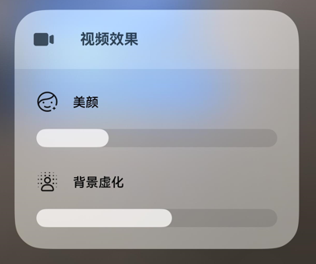

# 相机控制器(ArkTS)
<!--Kit: Camera Kit-->
<!--Subsystem: Multimedia-->
<!--Owner: @qano-->
<!--Designer: @leo_ysl-->
<!--Tester: @xchaosioda-->
<!--Adviser: @w_Machine_cc-->

从API version 20开始，相机框架通过相机控制器，为应用直播场景提供美颜、虚化等能力。

相机控制器为直播和视频通话场景设计，目前仅支持在前置镜头的录像模式下使用，最高可支持1080P分辨率和30fps帧率。

## 开发步骤

详细的API说明请参考[Camera](../../reference/apis-camera-kit/arkts-apis-camera.md)。

1. 导入camera接口，接口中提供了相机相关的属性和方法，导入方法如下。

    ```ts
    import { camera } from '@kit.CameraKit';
    import { BusinessError } from '@kit.BasicServicesKit';
    ```

2. 通过[isControlCenterSupported](../../reference/apis-camera-kit/arkts-apis-camera-ControlCenterQuery.md#iscontrolcentersupported20)接口，查询当前设备及当前场景是否支持相机控制器。

    ```ts
    function isControlCenterSupported(videoSession: camera.VideoSession): boolean {
      let isSupported: boolean = videoSession.isControlCenterSupported();
      return isSupported;
    }
    ```

3. 通过[getSupportedEffectTypes](../../reference/apis-camera-kit/arkts-apis-camera-ControlCenterQuery.md#getsupportedeffecttypes20)接口，查询当前设备及当前场景下，相机控制器支持的效果类型。

    ```ts
    function getSupportedEffectTypes(videoSession: camera.VideoSession): Array<camera.ControlCenterEffectType> {
      let effectTypes: Array<camera.ControlCenterEffectType> = [];
      effectTypes = videoSession.getSupportedEffectTypes();
      return effectTypes;
    }
    ```

4. 若设备及场景支持相机控制器，使用[enableControlCenter](../../reference/apis-camera-kit/arkts-apis-camera-ControlCenter.md#enablecontrolcenter20)接口可启用或关闭控制器。

    ```ts
    function enableControlCenter(videoSession: camera.VideoSession, enable: boolean): void {
      let isSupported: boolean = videoSession.isControlCenterSupported();
      if (isSupported) {
        videoSession.enableControlCenter(enable);
      }
    }
    ```

5. 使能相机控制器后，可以在状态栏看到新增的`视频效果`图标。

    

6. 点击`视频效果`图标，在弹出的二级页面中，用户可调节控制器支持的效果，如图所示为`美颜`和`背景虚化`。

    


## 状态监听

使用相机控制器的过程中，应用可以监听控制器效果的使能状态。

通过注册[controlCenterEffectStatusChange](../../reference/apis-camera-kit/arkts-apis-camera-VideoSession.md#oncontrolcentereffectstatuschange20)的回调函数获取控制器中各效果的使能状态。

当控制器中某效果使能状态发生变化时，callback返回[ControlCenterStatusInfo](../../reference/apis-camera-kit/arkts-apis-camera-i.md#controlcenterstatusinfo20)参数。

```ts
import { camera } from '@kit.CameraKit';
import { BusinessError } from '@kit.BasicServicesKit';

function callback(err: BusinessError, status: camera.ControlCenterStatusInfo): void {
  if (err !== undefined && err.code !== 0) {
    console.error(`Callback Error, errorCode: ${err.code}`);
    return;
  }
  console.info(`controlCenterEffectStatusChange: ${status}`);
}

function registerControlCenterEffectStatusChangeCallback(videoSession: camera.VideoSession): void {
  videoSession.on('controlCenterEffectStatusChange', callback);
}
```