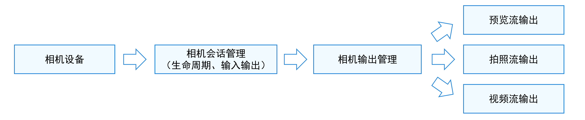
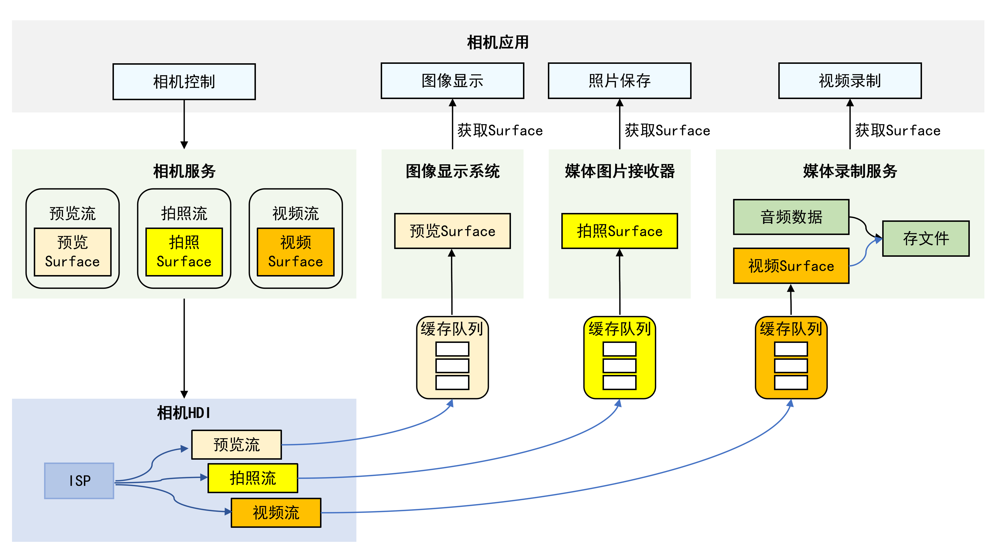

# Camera Kit简介
<!--Kit: Camera Kit-->
<!--Subsystem: Multimedia-->
<!--Owner: @qano-->
<!--Designer: @leo_ysl-->
<!--Tester: @xchaosioda-->
<!--Adviser: @w_Machine_cc-->

开发者通过调用Camera Kit(相机服务)提供的接口可以开发相机应用，应用通过访问和操作相机硬件，实现基础操作，如预览、拍照和录像；还可以通过接口组合完成更多操作，如控制闪光灯和曝光时间、对焦或调焦等。

## 开发场景

当开发者需要开发一个相机应用（或是在应用内开发相机模块）时，可参考以下开发模型了解相机的工作流程，进而开发相机应用。

如果开发者仅是需要拉起系统相机拍摄一张照片、录制一段视频，可直接使用CameraPicker，无需申请相机权限，直接拉起系统相机完成拍摄，具体可参考[CameraPicker](../../reference/apis-camera-kit/js-apis-cameraPicker.md)。

## 开发模型

相机应用调用相机设备采集、加工图像视频数据，精确控制对应的硬件，灵活输出图像、视频内容，满足多镜头硬件适配（如广角、长焦、TOF）、多业务场景适配（如不同分辨率、不同格式、不同效果）的要求。

相机应用开发的工作流程如图1所示，可概括为相机设备、相机会话管理和相机输出管理三部分。

- 相机应用调用相机设备采集数据，作为相机输入流。

- 相机会话管理可配置输入流，即选择合适的相机镜头（如前置、后置）进行拍摄。另外还可以配置闪光灯、曝光时间、对焦和调焦等参数，实现不同效果的拍摄，从而适配不同的业务场景。应用可以通过切换会话满足不同场景的拍摄需求。

- 相机输出管理配置相机的输出流，即将图像内容以预览流、拍照流或视频流输出。

**图1** 相机工作流程  

为便于开发者更好地开发相机应用，建议先了解相机开发工作流程，再了解相机的开发模型（如图2所示）。

相机应用通过控制相机，实现图像显示（预览）、照片保存（拍照）、视频录制（录像）等基础操作。在实现基本操作过程中，相机服务会控制相机设备采集和输出数据，采集的图像数据经过图像信号处理器（ISP，Image Signal Processor）处理后，通过相机底层的设备硬件接口（HDI，Hardware Device Interfaces），直接利用缓存队列传递到具体的功能模块进行处理。 缓存队列在应用开发中无需关注，用于将底层处理的数据及时送到上层进行图像显示。

以视频录制为例进行说明：相机服务可控制相机设备采集视频数据，生成视频流。采集的数据通过底层相机HDI处理后，再通过Surface将视频流传递给媒体录制服务，最后由媒体录制服务对视频数据进行处理，保存为视频文件，完成视频录制。

**图2** 相机开发模型  

## 相关实例

针对相机开发，有以下相关实例可供参考：

- [相机和媒体库（ArkTS）(Full SDK)（API10）](https://gitcode.com/openharmony/applications_app_samples/tree/master/code/SystemFeature/Media/Camera)
