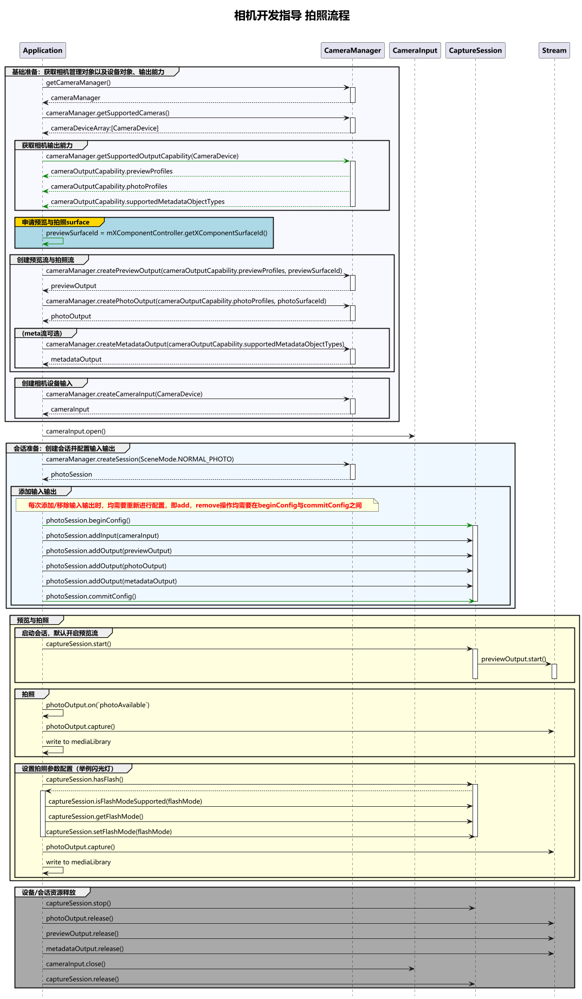

# 拍照实践(ArkTS)
<!--Kit: Camera Kit-->
<!--Subsystem: Multimedia-->
<!--Owner: @qano-->
<!--Designer: @leo_ysl-->
<!--Tester: @xchaosioda-->
<!--Adviser: @w_Machine_cc-->

在开发相机应用时，需要先[申请相关权限](camera-preparation.md)。

当前示例提供完整的拍照流程介绍，方便开发者了解完整的接口调用顺序。

在参考以下示例前，建议开发者查看[相机开发指导(ArkTS)](camera-device-management.md)的具体章节，了解[设备输入](camera-device-input.md)、[会话管理](camera-session-management.md)、[拍照](camera-shooting.md)等单个流程。

## 开发流程

在获取到相机支持的输出流能力后，开始创建拍照流，开发流程如下。



## 完整示例

Context获取方式请参考：[获取UIAbility的上下文信息](../../application-models/uiability-usage.md#获取uiability的上下文信息)。

如需要在图库中看到所保存的图片、视频资源，需要将其保存到媒体库，保存方式请参考：[保存媒体库资源](../medialibrary/photoAccessHelper-savebutton.md)。

需要在[photoOutput.on('photoAvailable')](../../reference/apis-camera-kit/arkts-apis-camera-PhotoOutput.md#onphotoavailable11)接口获取到buffer时，将buffer在安全控件中保存到媒体库。
```ts
import { camera } from '@kit.CameraKit';
import { image } from '@kit.ImageKit';
import { BusinessError } from '@kit.BasicServicesKit';

interface ShootingResources {
  cameraInput?: camera.CameraInput;
  previewOutput?: camera.PreviewOutput;
  photoOutput?: camera.PhotoOutput;
  photoSession?: camera.PhotoSession;
}

const resources: ShootingResources = {};

function setPhotoOutputCb(photoOutput: camera.PhotoOutput): void {
  if (!photoOutput) {
    console.error('photoOutput is null');
    return;
  }
  //设置回调之后，调用photoOutput的capture方法，就会将拍照的buffer回传到回调中。
  photoOutput?.on('photoAvailable', (err: BusinessError, photo: camera.Photo): void => {
    console.info('getPhoto start');
    console.error(`err: ${err}`);
    if (err && err.code != 0) {
      console.error('getPhoto failed');
      return;
    }
    if (!photo || !photo.main) {
      console.error('photo is null');
      return;
    }
    let imageObj = photo.main;
    imageObj.getComponent(image.ComponentType.JPEG, (errCode: BusinessError, component: image.Component): void => {
      console.info('getComponent start');
      if (errCode && errCode.code != 0 ) {
        console.error('getComponent failed');
        imageObj.release();
        return;
      }
      let buffer: ArrayBuffer;
      if (component && component.byteBuffer) {
        buffer = component.byteBuffer;
      } else {
        console.error('byteBuffer is null');
        imageObj.release();
        return;
      }
      // 如需要在图库中看到所保存的图片、视频资源，请使用用户无感的安全控件创建媒体资源。

      // buffer处理结束后需要释放该资源，如果未正确释放资源会导致后续拍照获取不到buffer。
      imageObj.release();
    });
  });
}

async function cameraShootingCase(context: Context, surfaceId: string): Promise<void> {
  try {
    // 创建CameraManager对象。
    let cameraManager: camera.CameraManager = camera.getCameraManager(context);
    if (!cameraManager) {
      console.error("camera.getCameraManager error");
      return;
    }
    // 监听相机状态变化。
    cameraManager.on('cameraStatus', (err: BusinessError, cameraStatusInfo: camera.CameraStatusInfo) => {
      if (err !== undefined && err.code !== 0) {
        console.error('cameraStatus with errorCode = ' + err.code);
        return;
      }
      console.info(`camera : ${cameraStatusInfo.camera.cameraId}`);
      console.info(`status: ${cameraStatusInfo.status}`);
    });

    // 获取相机列表。
    let cameraArray: Array<camera.CameraDevice> = cameraManager.getSupportedCameras();
    if (!cameraArray || cameraArray.length <= 0) {
      console.error("cameraManager.getSupportedCameras error");
      return;
    }

    for (let index = 0; index < cameraArray.length; index++) {
      console.info('cameraId : ' + cameraArray[index].cameraId);                          // 获取相机ID。
      console.info('cameraPosition : ' + cameraArray[index].cameraPosition);              // 获取相机位置。
      console.info('cameraType : ' + cameraArray[index].cameraType);                      // 获取相机类型。
      console.info('connectionType : ' + cameraArray[index].connectionType);              // 获取相机连接类型。
    }

    // 创建相机输入流。
    resources.cameraInput = cameraManager.createCameraInput(cameraArray[0]);
    if (!resources.cameraInput) {
      console.error('cameraInput is null');
      return;
    }

    // 监听cameraInput错误信息。
    let cameraDevice: camera.CameraDevice = cameraArray[0];
    resources.cameraInput.on('error', cameraDevice, (error: BusinessError) => {
      console.error(`Camera input error code: ${error.code}`);
    })

    // 打开相机。
    await resources.cameraInput.open();

    // 获取支持的模式类型。
    let sceneModes: Array<camera.SceneMode> = cameraManager.getSupportedSceneModes(cameraArray[0]);
    let isSupportPhotoMode: boolean = sceneModes.indexOf(camera.SceneMode.NORMAL_PHOTO) >= 0;
    if (!isSupportPhotoMode) {
      console.error('photo mode not support');
      releaseResources();
      return;
    }
    // 获取相机设备支持的输出流能力。
    let cameraOutputCap: camera.CameraOutputCapability = cameraManager.getSupportedOutputCapability(cameraArray[0], camera.SceneMode.NORMAL_PHOTO);
    if (!cameraOutputCap) {
      console.error("cameraManager.getSupportedOutputCapability error");
      return;
    }
    console.info("outputCapability: " + JSON.stringify(cameraOutputCap));

    let previewProfilesArray: Array<camera.Profile> = cameraOutputCap.previewProfiles;
    if (!previewProfilesArray || previewProfilesArray.length <= 0) {
      console.error("previewProfilesArray is null or []");
      releaseResources();
      return;
    }

    let photoProfilesArray: Array<camera.Profile> = cameraOutputCap.photoProfiles;
    if (!photoProfilesArray || photoProfilesArray.length <= 0) {
      console.error("photoProfilesArray is null or []");
      releaseResources();
      return;
    }

    // 创建预览输出流,其中参数 surfaceId 参考上文 XComponent 组件，预览流为XComponent组件提供的surface。
    resources.previewOutput = cameraManager.createPreviewOutput(previewProfilesArray[0], surfaceId);
    if (!resources.previewOutput) {
      console.error('previewOutput is null');
      releaseResources();
      return;
    }
    try {
      // 监听预览输出错误信息。
      resources.previewOutput.on('error', (error: BusinessError) => {
        console.error(`Preview output error code: ${error.code}`);
      });
    } catch (e) {
      console.error(`previewOutput.on call failed, error: ${JSON.stringify(e)}`);
    }

    // 创建拍照输出流。
    resources.photoOutput = cameraManager.createPhotoOutput(photoProfilesArray[0]);
    if (!resources.photoOutput) {
      console.error('photoOutput is null');
      releaseResources();
      return;
    }

    //调用上面的回调函数来保存图片。
    setPhotoOutputCb(resources.photoOutput);

    //创建会话。
    let photoSession = cameraManager.createSession(camera.SceneMode.NORMAL_PHOTO);
    if (!photoSession) {
      console.error('photoSession is null');
      releaseResources();
      return;
    }
    resources.photoSession =  photoSession as camera.PhotoSession;
    try {
      // 监听session错误信息。
      resources.photoSession.on('error', (error: BusinessError) => {
        console.error(`Capture session error code: ${error.code}`);
      });
    } catch (e) {
      console.error(`photoSession.on call failed, error: ${JSON.stringify(e)}`);
    }

    // 开始配置会话。
    resources.photoSession.beginConfig();

    // 向会话中添加相机输入流。
    resources.photoSession.addInput(resources.cameraInput);

    // 向会话中添加预览输出流。
    resources.photoSession.addOutput(resources.previewOutput);

    // 向会话中添加拍照输出流。
    resources.photoSession.addOutput(resources.photoOutput);

    // 提交会话配置。
    await resources.photoSession.commitConfig();

    // 启动会话。
    await resources.photoSession.start()
    // 判断设备是否支持闪光灯。
    let flashStatus: boolean = false;
    flashStatus = resources.photoSession.hasFlash();
    console.info('Returned with the flash light support status:' + flashStatus);

    if (flashStatus) {
      // 判断是否支持自动闪光灯模式。
      let flashModeStatus: boolean = resources.photoSession.isFlashModeSupported(camera.FlashMode.FLASH_MODE_AUTO);
      if(flashModeStatus) {
        // 设置自动闪光灯模式。
        resources.photoSession.setFlashMode(camera.FlashMode.FLASH_MODE_AUTO);
      }
    }

    // 判断是否支持连续自动变焦模式。
    let focusModeStatus: boolean = resources.photoSession.isFocusModeSupported(camera.FocusMode.FOCUS_MODE_CONTINUOUS_AUTO);

    if (focusModeStatus) {
      // 设置连续自动变焦模式。
      resources.photoSession.setFocusMode(camera.FocusMode.FOCUS_MODE_CONTINUOUS_AUTO);
    }

    // 获取相机支持的可变焦距比范围。
    let zoomRatioRange: Array<number> = [];
    try {
      zoomRatioRange = resources.photoSession.getZoomRatioRange();
    } catch (error) {
      let err = error as BusinessError;
      console.error('Failed to get the zoom ratio range. errorCode = ' + err.code);
    }
    if (zoomRatioRange.length > 0) {
      // 设置可变焦距比。
      try {
        resources.photoSession.setZoomRatio(zoomRatioRange[0]);
      } catch (error) {
        let err = error as BusinessError;
        console.error('Failed to set the zoom ratio value. errorCode = ' + err.code);
      }
    }

    let photoCaptureSetting: camera.PhotoCaptureSetting = {
      quality: camera.QualityLevel.QUALITY_LEVEL_HIGH, // 设置图片质量高。
      rotation: camera.ImageRotation.ROTATION_0 // 设置图片旋转角度0。
    }
    // 使用当前拍照设置进行拍照。
    try {
      await resources.photoOutput.capture(photoCaptureSetting);
    } catch (error) {
      let err = error as BusinessError;
      console.error(`capture call failed, err: ${JSON.stringify(err)}`);
    }

    // 需要在拍照结束之后调用以下关闭相机和释放会话流程，避免拍照未结束就将会话释放。


    // 会话置空。
    resources.photoSession = undefined;
  } catch (error) {
    console.error(`cameraShootingCase call failed, error: ${JSON.stringify(error)}`);
    releaseResources();
  }
}

async function releaseResources(): Promise<void> {
  // 停止当前会话。
  await resources.photoSession?.stop().catch((e: BusinessError) => {console.error('停止会话失败:', e)});

  // 释放相机输入流。
  await resources.cameraInput?.close().catch((e: BusinessError) => {console.error('关闭相机失败:', e)});

  // 释放预览输出流。
  await resources.previewOutput?.release().catch((e: BusinessError) => {console.error('停止预览流失败:', e)});

  // 释放拍照输出流。
  await resources.photoOutput?.release().catch((e: BusinessError) => {console.error('停止拍照流失败:', e)});

  // 释放会话。
  await resources.photoSession?.release().catch((e: BusinessError) => {console.error('释放会话失败:', e)});
}
```

