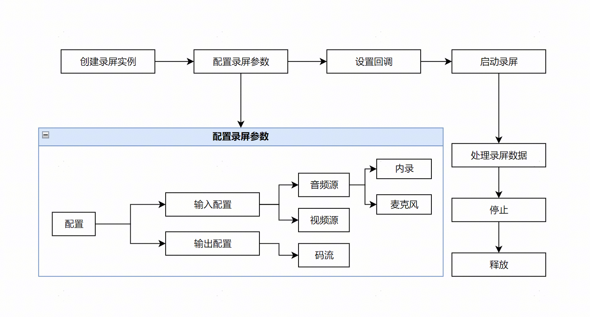
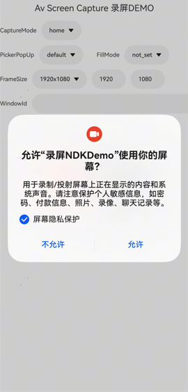

# AVScreenCapture录屏基础流程

<!--Kit: Media Kit-->
<!--Subsystem: Multimedia-->
<!--Owner: @zzs_911-->
<!--Designer: @stupig001-->
<!--Tester: @xdlinc-->
<!--Adviser: @w_Machine_cc-->

屏幕录制支持开发者获取屏幕数据，适用于屏幕录制、会议共享、直播等场景。开发者调用录屏[AVScreenCapture](media-kit-intro.md#avscreencapture)模块的C API接口，采集设备内外的音视频源数据。录屏模块与窗口（Window）、图形（Graphic）等模块协同完成视频采集。

从API 22开始，在PC/2in1设备上对应用进行录屏时，可通过申请权限**ohos.permission.TIMEOUT_SCREENOFF_DISABLE_LOCK**，实现在屏幕熄灭但不锁屏的场景下，继续保持录制的效果，配置方式请参见[声明权限](../../security/AccessToken/declare-permissions.md)。

从API 22开始，在PC/2in1设备上对应用进行录屏时，可通过申请权限**ohos.permission.CUSTOM_SCREEN_RECORDING**，实现在录制屏幕时不再弹出隐私告警弹窗。配置方式请参见[受限开放权限](../../security/AccessToken/restricted-permissions.md)。

## 流程介绍

基础屏幕录制功能涉及到AVScreenCapture实例创建、音视频参数配置、回调设置、开始与停止、结果处理、资源释放等步骤。

在此基础上，开发者可以根据视频录制、直播等特定场景进行更高级的设置，详情参见[AVScreenCapture录屏自定义场景](avscreencapture-c-custom-scenarios.md)。

基础流程如下图所示：



录屏采集的内容输出方式如下。

- 文件形式：保存为文件，该文件可以播放、分享等。

- 码流形式：该码流可根据场景进行不同的处理，例如将码流流转到其他模块，实现桌面共享、视频直播等。

## 约束与限制

- 使用AVScreenCapture时需明确其状态变化。创建实例后，调用方法可进入指定状态。在错误状态下执行方法会导致AVScreenCapture出错。开发者应在状态转换前进行检查以避免异常。

- 在录屏取码流场景中，屏幕录制启动时会弹出隐私保护弹框，包含“屏幕隐私保护”选项。勾选后，隐私信息（如横幅通知、控制中心、通话界面等）将被屏蔽。不同产品上的隐私信息可能有差异，以实际录制结果为准。

  隐私保护弹框：

  

## 通用开发步骤

### 依赖导入

在CMake脚本中链接动态库：

```
target_link_libraries(entry PUBLIC libnative_avscreen_capture.so libnative_buffer.so libnative_media_core.so) 
```

添加头文件：

```c++
#include "napi/native_api.h"
#include <multimedia/player_framework/native_avscreen_capture.h>
#include <multimedia/player_framework/native_avscreen_capture_base.h>
#include <multimedia/player_framework/native_avscreen_capture_errors.h>
#include <multimedia/player_framework/native_avbuffer.h>
#include <native_buffer/native_buffer.h>
#include <vector>
```

### 创建AVScreenCapture实例

实例化对象，通过[OH_AVScreenCapture_Create](../../reference/apis-media-kit/capi-native-avscreen-capture-h.md#oh_avscreencapture_create)创建[OH_AVScreenCapture](../../reference/apis-media-kit/capi-avscreencapture-oh-avscreencapture.md)。

```c++
OH_AVScreenCapture* capture = OH_AVScreenCapture_Create(); 
```

### 配置音频采集参数

创建AVScreenCapture实例后，可设置屏幕录制所需要的音频参数[OH_AudioInfo](../../reference/apis-media-kit/capi-avscreencapture-oh-audioinfo.md)，包括内录、麦克风音频[OH_AudioCaptureInfo](../../reference/apis-media-kit/capi-avscreencapture-oh-audiocaptureinfo.md)和输出规格[OH_AudioEncInfo](../../reference/apis-media-kit/capi-avscreencapture-oh-audioencinfo.md)。

如果配置了采集麦克风音频数据，需：

- 配置麦克风权限ohos.permission.MICROPHONE，配置方式请参见[向用户申请权限](../../security/AccessToken/request-user-authorization.md)。
- 申请长时任务，申请方式请参见[申请长时任务](../../task-management/continuous-task.md)。

录屏存文件时默认只开启内录。录制过程中，麦克风可以动态开启/关闭，开启后，可同时启动内外录制。

内录音频信息必须设置，麦克风音频信息可按实际场景按需设置。

```c++
// 录屏时获取麦克风，如果同时设置了内录和麦克风音频信息，两者参数设置需保持一致。
OH_AudioCaptureInfo micCapInfo = {
    .audioSampleRate = 48000,
    .audioChannels = 2,
    .audioSource = OH_MIC
}; 
// 录屏时获取内录数据，内录参数必填。如果同时设置了内录和麦克风音频信息，两者参数设置需保持一致。
OH_AudioCaptureInfo innerCapInfo = {
    .audioSampleRate = 48000,
    .audioChannels = 2,
    .audioSource = OH_ALL_PLAYBACK
};
// 录屏音频输出规格配置。
OH_AudioEncInfo audioEncInfo = {
    .audioBitrate = 48000,
    .audioCodecformat = OH_AAC_LC
};
OH_AudioInfo audioInfo = {
    .micCapInfo = micCapInfo,
    .innerCapInfo = innerCapInfo,
    .audioEncInfo = audioEncInfo
};  
// 可以单独设置麦克风开关。
bool isMic = true;
OH_AVScreenCapture_SetMicrophoneEnabled(capture, isMic);
```

### 配置视频采集参数

录屏的视频采集信息[OH_VideoInfo](../../reference/apis-media-kit/capi-avscreencapture-oh-videoinfo.md)包含录屏输入规格配置[OH_VideoCaptureInfo](../../reference/apis-media-kit/capi-avscreencapture-oh-videocaptureinfo.md)和录屏输出规格配置[OH_VideoEncInfo](../../reference/apis-media-kit/capi-avscreencapture-oh-videoencinfo.md)。

```c++
// 录屏输入规格配置。
OH_VideoCaptureInfo videoCapInfo = {
    .videoFrameWidth = 768,
    .videoFrameHeight = 1280,
    .videoSource = OH_VIDEO_SOURCE_SURFACE_RGBA
 };
// 录屏输出规格配置。
OH_VideoEncInfo videoEncInfo = {
    .videoCodec = OH_H264,
    .videoBitrate = 2000000,
    .videoFrameRate = 30
 };
OH_VideoInfo videoInfo = {
    .videoCapInfo = videoCapInfo,
    .videoEncInfo = videoEncInfo
};  
```

### 初始化AVScreenCapture实例配置

AVScreenCapture实例的配置[OH_AVScreenRecorderConfig](../../reference/apis-media-kit/capi-avscreencapture-oh-avscreencaptureconfig.md)，包括录制数据格式[OH_VideoInfo](../../reference/apis-media-kit/capi-avscreencapture-oh-videoinfo.md)、音视频采集参数[OH_AudioInfo](../../reference/apis-media-kit/capi-avscreencapture-oh-audioinfo.md)、录屏模式[OH_CaptureMode](../../reference/apis-media-kit/capi-native-avscreen-capture-base-h.md#oh_capturemode)等，录屏模式包含OH_CAPTURE_HOME_SCREEN、OH_CAPTURE_SPECIFIED_SCREEN、OH_CAPTURE_SPECIFIED_WINDOW。

配置完成后通过[OH_AVScreenCapture_Init](../../reference/apis-media-kit/capi-native-avscreen-capture-h.md#oh_avscreencapture_init)将配置项设置到[OH_AVScreenCapture](../../reference/apis-media-kit/capi-avscreencapture-oh-avscreencapture.md)中。

> **说明：**
> 在PC/2in1设备上，根据不同的录屏模式会有不同弹窗表现，详情见[PC/2in1弹窗模式配置说明](#pc2in1弹窗模式配置说明)。

```c++
// 初始化录屏，传入配置信息OH_AVScreenRecorderConfig。
OH_AVScreenCaptureConfig config = {
    .dataType = OH_ORIGINAL_STREAM,
    .audioInfo = audioInfo,
    .captureMode = OH_CAPTURE_HOME_SCREEN, //录屏模式设置。
    .videoInfo = videoInfo
};
OH_AVScreenCapture_Init(capture, config);
```

### 设置数据更新、状态切换、错误上报的回调

回调函数主要用来监听录屏过程中的错误发生、音视频流生成和录屏状态变更等事件，详细内容请参考：[错误回调](../../reference/apis-media-kit/capi-native-avscreen-capture-base-h.md#oh_avscreencaptureonerror)、[状态回调](../../reference/apis-media-kit/capi-native-avscreen-capture-h.md#oh_avscreencapture_setstatecallback)、[获取数据回调](../../reference/apis-media-kit/capi-native-avscreen-capture-h.md#oh_avscreencapture_setdatacallback)。

```c++
// 设置回调。
// 错误事件发生回调函数OnError()。
void OnError(OH_AVScreenCapture *capture, int32_t errorCode, void *userData) {
    (void)capture;
    // 应用根据错误码进行事件处理。
    (void)errorCode;
    (void)userData;
}

// 状态变更事件处理函数OnStateChange()。
void OnStateChange(struct OH_AVScreenCapture *capture, OH_AVScreenCaptureStateCode stateCode, void *userData) {
    (void)capture;
    if (stateCode == OH_AVScreenCaptureStateCode::OH_SCREEN_CAPTURE_STATE_CANCELED) { // 按照所需状态自行修改填写。
        // 处理录屏状态变更。
    }
    (void)userData;
}

// 获取并处理音视频原始码流数据回调函数OnBufferAvailable()。
void OnBufferAvailable(OH_AVScreenCapture *capture, OH_AVBuffer *buffer, OH_AVScreenCaptureBufferType bufferType, int64_t timestamp, void *userData) {
    // 处于录屏取码流状态。
}
int *userData = nullptr;// 用户自定义数据。
OH_AVScreenCapture_SetErrorCallback(capture, OnError, userData);
OH_AVScreenCapture_SetStateCallback(capture, OnStateChange, userData);
OH_AVScreenCapture_SetDataCallback(capture, OnBufferAvailable, userData);
```

### 启动录屏

启动录屏[OH_AVScreenCapture_StartScreenCapture](../../reference/apis-media-kit/capi-native-avscreen-capture-h.md#oh_avscreencapture_startscreencapture)后，开始采集原始码流，通过回调[OH_AVScreenCapture_OnBufferAvailable](../../reference/apis-media-kit/capi-native-avscreen-capture-base-h.md#oh_avscreencapture_onbufferavailable)来监听当前是否有码流的产生，通过回调[OH_AVScreenCapture_OnStateChange](../../reference/apis-media-kit/capi-native-avscreen-capture-base-h.md#oh_avscreencapture_onstatechange)来监听启动状态的变更。

在回调接口中，可以调用获取音频码流[OH_AVScreenCapture_AcquireAudioBuffer](../../reference/apis-media-kit/capi-native-avscreen-capture-h.md#oh_avscreencapture_acquireaudiobuffer)和获取视频码流[OH_AVScreenCapture_AcquireVideoBuffer](../../reference/apis-media-kit/capi-native-avscreen-capture-h.md#oh_avscreencapture_acquirevideobuffer)的接口来获取录屏的原始码流。

```c++
OH_AVScreenCapture_StartScreenCapture(capture);
```

### 处理录屏数据

根据音视频采集的参数不同，会生成不同数据流，包含视频流、内录的音频流、麦克风录制的音频流，开发者可根据场景进行不同的处理，如将码流流转到其他模块，实现共享桌面、视频直播等。

```c++
bool IsCaptureStreamRunning = true;
// 获取并处理音视频原始码流数据回调函数OnBufferAvailable()。
void OnBufferAvailable(OH_AVScreenCapture *capture, OH_AVBuffer *buffer, OH_AVScreenCaptureBufferType bufferType, int64_t timestamp, void *userData) {
    // 处于录屏取码流状态。
    if (IsCaptureStreamRunning) {
        if (bufferType == OH_SCREEN_CAPTURE_BUFFERTYPE_VIDEO) {
            // 视频buffer。
            OH_NativeBuffer *nativeBuffer = OH_AVBuffer_GetNativeBuffer(buffer);
            if (nativeBuffer != nullptr && capture != nullptr) {
                // 获取buffer容量。
                int bufferLen = OH_AVBuffer_GetCapacity(buffer);

                // 获取buffer属性。
                OH_AVCodecBufferAttr info;
                OH_AVBuffer_GetBufferAttr(buffer, &info);

                // 获取nativeBuffer配置。
                OH_NativeBuffer_Config config;
                OH_NativeBuffer_GetConfig(nativeBuffer, &config);

                // 获取buffer地址。
                uint8_t *buf = OH_AVBuffer_GetAddr(buffer);
                if (buf == nullptr) {
                    return;
                }
                // 使用buffer数据。

                // nativeBuffer的引用计数值减一，当引用计数值减为0，释放该资源。
                OH_NativeBuffer_Unreference(nativeBuffer);
            }
        } else if (bufferType == OH_SCREEN_CAPTURE_BUFFERTYPE_AUDIO_INNER) {
            // 内录buffer。
            // 获取buffer属性。
            OH_AVCodecBufferAttr info;
            OH_AVBuffer_GetBufferAttr(buffer, &info);

            // 获取buffer容量。
            int bufferLen = OH_AVBuffer_GetCapacity(buffer);

            // 获取buffer地址。
            uint8_t *buf = OH_AVBuffer_GetAddr(buffer);
            if (buf == nullptr) {
                return;
            }
            // 使用buffer数据。
        } else if (bufferType == OH_SCREEN_CAPTURE_BUFFERTYPE_AUDIO_MIC) {
            // 麦克风buffer。
            // 获取buffer容量。
            int bufferLen = OH_AVBuffer_GetCapacity(buffer);

            // 获取buffer地址。
            uint8_t *buf = OH_AVBuffer_GetAddr(buffer);
            if (buf == nullptr) {
                return;
            }
            // 使用buffer数据。
        }
    }
}
```

### 停止录屏

调用[OH_AVScreenCapture_StopScreenCapture](../../reference/apis-media-kit/capi-native-avscreen-capture-h.md#oh_avscreencapture_stopscreencapture)后应用会停止录屏或屏幕共享，释放麦克风。

```c++
// 停止录屏。
OH_AVScreenCapture_StopScreenCapture(capture);
```

### 释放资源

调用[OH_AVScreenCapture_Release](../../reference/apis-media-kit/capi-native-avscreen-capture-h.md#oh_avscreencapture_release)释放创建的OH_AVScreenCapture实例，需要在停止录屏后释放。

```c++
// 释放录屏资源。
OH_AVScreenCapture_Release(capture);
```

## PC/2in1弹窗模式配置说明

系统提供的录屏模式：[录制指定屏幕](#录制指定屏幕)、[录制主屏幕](#录制主屏幕)和[录制指定窗口](#录制指定窗口推荐)。

录屏模式会使用到屏幕ID（displayId）和窗口ID（missionIds）。获取方式可参考：[获取displayid](../../reference/apis-arkui/capi-oh-display-manager-h.md#oh_nativedisplaymanager_createalldisplays)、[获取missionIds](../../reference/apis-arkui/arkts-apis-window-Window.md#getwindowproperties9)。

### 录制指定屏幕

即[OH_CAPTURE_SPECIFIED_SCREEN](../../reference/apis-media-kit/capi-native-avscreen-capture-base-h.md#oh_capturemode)模式。

在此模式下，启动录屏后，PC/2in1设备会弹出选择共享内容弹窗，并默认选中videoCapInfo.displayId参数对应的屏幕，如果传入的displayId对应的窗口不存在，则不做任何选中。

```c++
// 根据PC/2in1设备分辨率在config中配置录屏的宽度、高度。
config.videoInfo.videoCapInfo.videoFrameWidth = 2880;
config.videoInfo.videoCapInfo.videoFrameHeight = 1920;

// 设置录屏模式为OH_CAPTURE_SPECIFIED_SCREEN，传入屏幕Id。
config.captureMode = OH_CAPTURE_SPECIFIED_SCREEN;
config.videoInfo.videoCapInfo.displayId = 0;
```

<!--RP1--><!--RP1End-->

### 录制主屏幕

即[OH_CAPTURE_HOME_SCREEN](../../reference/apis-media-kit/capi-native-avscreen-capture-base-h.md#oh_capturemode)模式。

在此模式下，启动录屏后，PC/2in1设备不会弹出选择录屏内容弹窗，会弹出隐私保护弹窗，同时配置的videoCapInfo.displayId参数不会生效，默认生效主屏的displayId。

```c++
// 根据PC/2in1设备分辨率在config中配置录屏的宽度、高度。
config.videoInfo.videoCapInfo.videoFrameWidth = 2880;
config.videoInfo.videoCapInfo.videoFrameHeight = 1920;

// 设置录屏模式为OH_CAPTURE_HOME_SCREEN，传入屏幕Id。
config.captureMode = OH_CAPTURE_HOME_SCREEN;
```

### 录制指定窗口（推荐）

即[OH_CAPTURE_SPECIFIED_WINDOW](../../reference/apis-media-kit/capi-native-avscreen-capture-base-h.md#oh_capturemode)模式。

应用需根据PC/2in1设备分辨率配置录屏的高度和宽度值并传入屏幕Id。

若期望录制某个指定窗口，需要设置指定的窗口Id。该场景下，启动录屏后，会弹出选择共享内容弹窗，并默认选中指定的窗口。

```c++
// 根据PC/2in1设备分辨率在config中配置录屏的宽度、高度。
config.videoInfo.videoCapInfo.videoFrameWidth = 2880;
config.videoInfo.videoCapInfo.videoFrameHeight = 1920;

// 设置录屏模式为OH_CAPTURE_SPECIFIED_WINDOW，传入屏幕Id。
config.captureMode = OH_CAPTURE_SPECIFIED_WINDOW;
config.videoInfo.videoCapInfo.displayId = 0;

// (可选)若有期望录制的窗口，可传入单个窗口Id。
std::vector<int32_t> missionIds = {61}; // 表示弹出的Picker默认选中61号窗口。
config.videoInfo.videoCapInfo.missionIDs = &missionIds[0];
config.videoInfo.videoCapInfo.missionIDsLen = static_cast<int32_t>(missionIds.size());
```

<!--RP2--><!--RP2End-->

若期望同时录制多个窗口，需要传入期望录制的窗口Id列表。该场景下，不弹出选择共享内容弹窗，弹出隐私保护弹窗。

```c++
// 根据PC/2in1设备分辨率在config中配置录屏的宽度、高度。
config.videoInfo.videoCapInfo.videoFrameWidth = 2880;
config.videoInfo.videoCapInfo.videoFrameHeight = 1920;

// 设置录屏模式为OH_CAPTURE_SPECIFIED_WINDOW，传入屏幕Id。
config.captureMode = OH_CAPTURE_SPECIFIED_WINDOW;
config.videoInfo.videoCapInfo.displayId = 0;

// 传入多个窗口Id。
vector<int32_t> missionIds = {60, 61}; // 表示期望同时录制60、61号窗口。
config.videoInfo.videoCapInfo.missionIDs = &missionIds[0];
config.videoInfo.videoCapInfo.missionIDsLen = static_cast<int32_t>(missionIds.size());
```

## 更多资源

- API参考：详细的API描述请见[native_avscreen_capture.h](../../reference/apis-media-kit/capi-native-avscreen-capture-h.md)。

- 示例工程：该示例调用了媒体AVScreenCapture组件提供的接口能力，提供屏幕捕获的功能，详情见[录屏示例工程](https://gitcode.com/openharmony/applications_app_samples/tree/master/code/DocsSample/Media/ScreenCapture/ScreenCaptureSample)。
