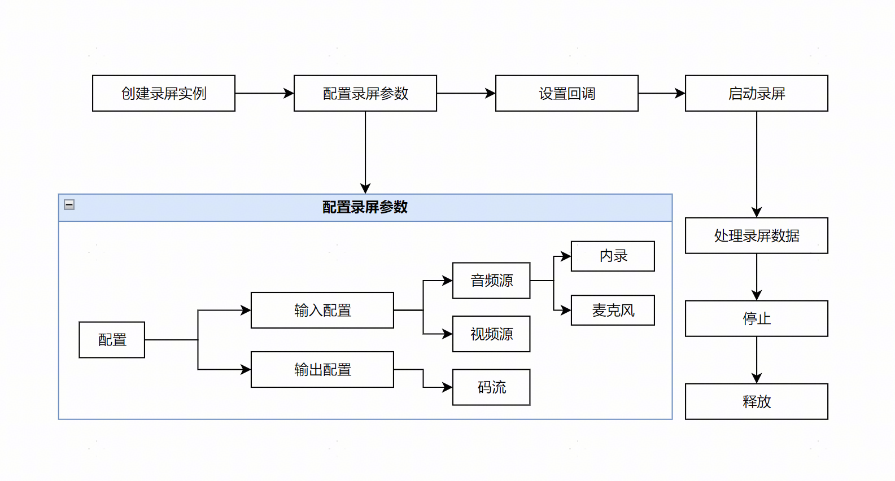
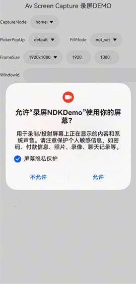

# AVScreenCapture录屏基础流程

<!--Kit: Media Kit-->
<!--Subsystem: Multimedia-->
<!--Owner: @chenkun613227-->
<!--Designer: @yxc2-->
<!--Tester: @xdlinc-->
<!--Adviser: @w_Machine_cc-->

屏幕录制功能支持开发者获取屏幕数据，适用于屏幕录制、会议共享、直播等场景。开发者可通过调用[AVScreenCapture](media-kit-intro.md#avscreencapture)模块的C API，采集设备内外的音视频数据源。该模块需与窗口管理（Window）、图形处理（Graphic）等模块协同工作，以完成完整的视频采集流程。

从API version 22开始，在PC/2in1设备上录屏时新增如下能力：
- 支持在熄屏但不锁屏的情况下保持录制：需要申请权限**ohos.permission.TIMEOUT_SCREENOFF_DISABLE_LOCK**。配置方式请参见[声明权限](../../security/AccessToken/declare-permissions.md)。
- 支持在录制屏幕时不再弹出隐私告警弹窗：需要申请权限**ohos.permission.CUSTOM_SCREEN_RECORDING**。配置方式请参见[受限开放权限](../../security/AccessToken/restricted-permissions.md)。

## 流程介绍

基础屏幕录制功能涉及到AVScreenCapture实例创建、音视频参数配置、回调设置、开始与停止、结果处理、资源释放等步骤。

在此基础上，开发者可以根据视频录制、直播等特定场景进行更高级的设置，详情参见[AVScreenCapture录屏自定义场景](avscreencapture-c-custom-scenarios.md)。

基础流程如下图所示：



录屏采集的内容输出方式如下。

- 文件形式：保存为文件，该文件可以播放、分享等。

- 码流形式：该码流可根据场景进行不同的处理，例如将码流流转到其他模块，实现桌面共享、视频直播等。

## 约束与限制

- 使用AVScreenCapture时需明确其状态变化。创建实例后，调用方法可进入指定状态。在错误状态下执行方法会导致AVScreenCapture出错。开发者应在状态转换前进行检查以避免异常。

- 在录屏取码流场景中，屏幕录制启动时会弹出隐私保护弹框，包含“屏幕隐私保护”选项。勾选后，隐私信息（如横幅通知、控制中心、通话界面等）将被屏蔽。不同产品上的隐私信息可能有差异，以实际录制结果为准。

  隐私保护弹框：

  

## 通用开发步骤

### 依赖导入

在CMake脚本中链接动态库：

```CMake
target_link_libraries(entry PUBLIC libnative_avscreen_capture.so libnative_buffer.so libnative_media_core.so libnative_display_manager.so)
```

添加头文件：

<!-- @[screenCapture_import_buffer](https://gitcode.com/openharmony/applications_app_samples/blob/master/code/DocsSample/Media/ScreenCapture/ScreenCaptureSample/entry/src/main/cpp/main.h) --> 

``` C
#include "hilog/log.h"
#include "napi/native_api.h"
#include <window_manager/oh_display_info.h>
#include <window_manager/oh_display_manager.h>
#include <multimedia/player_framework/native_avscreen_capture.h>
#include <multimedia/player_framework/native_avscreen_capture_base.h>
#include <multimedia/player_framework/native_avscreen_capture_errors.h>
#include <multimedia/player_framework/native_avbuffer.h>
#include <native_buffer/native_buffer.h>
#include <vector>
```

### 创建AVScreenCapture实例

实例化对象，通过[OH_AVScreenCapture_Create](../../reference/apis-media-kit/capi-native-avscreen-capture-h.md#oh_avscreencapture_create)创建[OH_AVScreenCapture](../../reference/apis-media-kit/capi-avscreencapture-oh-avscreencapture.md)。

<!-- @[screenCapture_create_buffer](https://gitcode.com/openharmony/applications_app_samples/blob/master/code/DocsSample/Media/ScreenCapture/ScreenCaptureSample/entry/src/main/cpp/napi_init.cpp) --> 

``` C++
g_avCapture = OH_AVScreenCapture_Create();
```

### 配置音频采集参数

创建AVScreenCapture实例后，可设置屏幕录制所需要的音频参数[OH_AudioInfo](../../reference/apis-media-kit/capi-avscreencapture-oh-audioinfo.md)，包括内录、麦克风音频[OH_AudioCaptureInfo](../../reference/apis-media-kit/capi-avscreencapture-oh-audiocaptureinfo.md)和输出规格[OH_AudioEncInfo](../../reference/apis-media-kit/capi-avscreencapture-oh-audioencinfo.md)。

如果配置了采集麦克风音频数据，需：

- 配置麦克风权限ohos.permission.MICROPHONE，配置方式请参见[向用户申请权限](../../security/AccessToken/request-user-authorization.md)。
- 申请长时任务，申请方式请参见[申请长时任务](../../task-management/continuous-task.md)。

录屏存文件时默认只开启内录。录制过程中，麦克风可以动态开启/关闭，开启后，可同时启动内外录制。

内录音频信息必须设置，麦克风音频信息可按实际场景按需设置。

<!-- @[screenCapture_config_buffer_audio](https://gitcode.com/openharmony/applications_app_samples/blob/master/code/DocsSample/Media/ScreenCapture/ScreenCaptureSample/entry/src/main/cpp/napi_init.cpp) --> 

``` C++
// 录屏时获取麦克风，如果同时设置了内录和麦克风音频信息，两者参数设置需保持一致。
OH_AudioCaptureInfo micCapInfo = {.audioSampleRate = 48000, .audioChannels = 2, .audioSource = OH_MIC};
// 录屏时获取内录数据，内录参数必填。如果同时设置了内录和麦克风音频信息，两者参数设置需保持一致。
OH_AudioCaptureInfo innerCapInfo = {.audioSampleRate = 48000, .audioChannels = 2, .audioSource = OH_ALL_PLAYBACK};
// 录屏音频输出规格配置。audioBitrate保证输出文件的比特率为设置的预期比特率，和audioSampleRate无强关联。
// 为保证音频质量，此处音频比特率取值为128000。如果录屏内容以语音为主，不包含音乐、游戏音效等，可以降低为96000或48000。
OH_AudioEncInfo audioEncInfo = {
    .audioBitrate = 128000,
    .audioCodecformat = OH_AAC_LC
};
OH_AudioInfo audioInfo = {
    .micCapInfo = micCapInfo,
    .innerCapInfo = innerCapInfo,
    .audioEncInfo = audioEncInfo
};
// 可以单独设置麦克风开关。
bool isMic = true;
OH_AVScreenCapture_SetMicrophoneEnabled(g_avCapture, isMic);
```

### 配置视频采集参数

录屏的视频采集信息[OH_VideoInfo](../../reference/apis-media-kit/capi-avscreencapture-oh-videoinfo.md)包含录屏输入规格配置[OH_VideoCaptureInfo](../../reference/apis-media-kit/capi-avscreencapture-oh-videocaptureinfo.md)和录屏输出规格配置[OH_VideoEncInfo](../../reference/apis-media-kit/capi-avscreencapture-oh-videoencinfo.md)。

<!-- @[screenCapture_config_buffer_video](https://gitcode.com/openharmony/applications_app_samples/blob/master/code/DocsSample/Media/ScreenCapture/ScreenCaptureSample/entry/src/main/cpp/napi_init.cpp) --> 

``` C++
// 获取屏幕信息。
uint64_t displayId = 0;
NativeDisplayManager_ErrorCode ret = OH_NativeDisplayManager_GetDefaultDisplayId(&displayId);

NativeDisplayManager_DisplayInfo* displayInfo = nullptr;
ret = OH_NativeDisplayManager_CreateDisplayById(displayId, &displayInfo);
if (ret != DISPLAY_MANAGER_OK || !displayInfo) {
    return;
}
int32_t screenWidth = displayInfo->width;
int32_t screenHeight = displayInfo->height;
// 录屏输入规格配置。
OH_VideoCaptureInfo videoCapInfo = {
    .videoFrameWidth = screenWidth,
    .videoFrameHeight = screenHeight,
    .videoSource = OH_VIDEO_SOURCE_SURFACE_RGBA
};
// 录屏输出规格配置。
OH_VideoEncInfo videoEncInfo = {
    .videoCodec = OH_H264,
    .videoBitrate = 2000000,
    .videoFrameRate = 30
};

OH_VideoInfo videoInfo = {
    .videoCapInfo = videoCapInfo,
    .videoEncInfo = videoEncInfo
};
```

### 初始化AVScreenCapture实例配置

AVScreenCapture实例的配置信息为[OH_AVScreenCaptureConfig](../../reference/apis-media-kit/capi-avscreencapture-oh-avscreencaptureconfig.md)，包括录制数据格式[OH_VideoInfo](../../reference/apis-media-kit/capi-avscreencapture-oh-videoinfo.md)、音视频采集参数[OH_AudioInfo](../../reference/apis-media-kit/capi-avscreencapture-oh-audioinfo.md)、录屏模式[OH_CaptureMode](../../reference/apis-media-kit/capi-native-avscreen-capture-base-h.md#oh_capturemode)等，录屏模式包含OH_CAPTURE_HOME_SCREEN、OH_CAPTURE_SPECIFIED_SCREEN、OH_CAPTURE_SPECIFIED_WINDOW。

配置完成后通过[OH_AVScreenCapture_Init](../../reference/apis-media-kit/capi-native-avscreen-capture-h.md#oh_avscreencapture_init)将配置项设置到[OH_AVScreenCapture](../../reference/apis-media-kit/capi-avscreencapture-oh-avscreencapture.md)中。

> **说明：**
>
> 根据不同的录屏场景，可选择不同的录屏模式，详情见[录屏模式说明](#录屏模式说明)。在PC/2in1设备上，不同录屏模式会有不同弹窗表现，详情见[弹窗模式说明](#弹窗模式说明)。

<!-- @[screenCapture_config_buffer_init](https://gitcode.com/openharmony/applications_app_samples/blob/master/code/DocsSample/Media/ScreenCapture/ScreenCaptureSample/entry/src/main/cpp/napi_init.cpp) --> 

``` C++
// 初始化录屏，传入配置信息OH_AVScreenCaptureConfig。
config = {
    .captureMode = OH_CAPTURE_HOME_SCREEN, // 录屏模式设置。
    .dataType = OH_ORIGINAL_STREAM, // 录屏数据类型，原始码流或文件。
    .audioInfo = audioInfo,
    .videoInfo = videoInfo
};
// 在StartScreenCapture01()函数中调用OH_AVScreenCapture_Init方法将配置项设置到OH_AVScreenCapture中。
```

### 设置数据更新、状态切换、错误上报的回调

回调函数主要用来监听录屏过程中的错误发生、音视频流生成和录屏状态变更等事件，详细内容请参考：错误回调[OH_AVScreenCaptureOnError](../../reference/apis-media-kit/capi-native-avscreen-capture-base-h.md#oh_avscreencaptureonerror)、状态回调[OH_AVScreenCapture_SetStateCallback](../../reference/apis-media-kit/capi-native-avscreen-capture-h.md#oh_avscreencapture_setstatecallback)和获取数据回调[OH_AVScreenCapture_SetDataCallback](../../reference/apis-media-kit/capi-native-avscreen-capture-h.md#oh_avscreencapture_setdatacallback)。

<!-- @[screenCapture_config_buffer_callback](https://gitcode.com/openharmony/applications_app_samples/blob/master/code/DocsSample/Media/ScreenCapture/ScreenCaptureSample/entry/src/main/cpp/napi_init.cpp) --> 

``` C++
// 设置回调。
// 错误事件发生回调函数OnError()。
void OnError(OH_AVScreenCapture *capture, int32_t errorCode, void *userData)
{
    (void)capture;
    OH_LOG_INFO(LOG_APP, "==ScreenCaptureSample== ScreenCapture OnError errorCode is %{public}d", errorCode);
    (void)userData;
}

// 状态变更事件处理函数OnStateChange()。
void OnStateChange(struct OH_AVScreenCapture *capture, OH_AVScreenCaptureStateCode stateCode, void *userData)
{
    if (stateCode == OH_SCREEN_CAPTURE_STATE_STARTED) {
        OH_LOG_INFO(LOG_APP, "==ScreenCaptureSample== ScreenCapture OnStateChange started");
        // 处理状态变更。
        // 可选，配置录屏旋转。
        int32_t ret = OH_AVScreenCapture_SetCanvasRotation(capture, true);
        // 可选，修改Canvas分辨率。
        ret = OH_AVScreenCapture_ResizeCanvas(g_avCapture, CANVAS_RESIZE_WIDTH, CANVAS_RESIZE_HEIGHT);
        // 可选，设置是否显示光标。
        ret = OH_AVScreenCapture_ShowCursor(g_avCapture, true);
        // 可选，设置视频最大帧率。
        ret = OH_AVScreenCapture_SetMaxVideoFrameRate(g_avCapture, CAPTURE_VIDEO_FRAME_RATE);
    }
    if (stateCode == OH_SCREEN_CAPTURE_STATE_INTERRUPTED_BY_OTHER) {
        // 处理状态变更。
    }
    (void)userData;
}

// 获取并处理音视频原始码流数据回调函数OnBufferAvailable()。
void HandleVideoBuffer(OH_AVBuffer *buffer)
{
    OH_NativeBuffer *nativebuffer = OH_AVBuffer_GetNativeBuffer(buffer);
    if (nativebuffer == nullptr) {
        return;
    }
    int bufferLen = OH_AVBuffer_GetCapacity(buffer);
    OH_AVCodecBufferAttr info;
    int32_t ret = OH_AVBuffer_GetBufferAttr(buffer, &info);
    OH_LOG_INFO(LOG_APP, "==ScreenCaptureSample== ScreenCapture size %{public}d", info.size);
    OH_LOG_INFO(LOG_APP, "==ScreenCaptureSample== ScreenCapture bufferLen %{public}d", bufferLen);

    OH_NativeBuffer_Config config;
    OH_NativeBuffer_GetConfig(nativebuffer, &config);
    OH_LOG_INFO(LOG_APP, "==ScreenCaptureSample== ScreenCapture height %{public}d width %{public}d",
        config.height, config.width);
    uint8_t *buf = OH_AVBuffer_GetAddr(buffer);
    if (buf == nullptr) {
        return;
    }
    size_t written = fwrite(buf, 1, bufferLen, g_vFile);
    if (written != bufferLen) {
        OH_LOG_ERROR(LOG_APP, "fwrite failed");
    }
    OH_NativeBuffer_Unreference(nativebuffer);
    buffer = nullptr;
    OH_LOG_INFO(LOG_APP, "==ScreenCaptureSample== ScreenCapture OnBufferAvailable inner audio");
}

void HandleAudioBuffer(OH_AVBuffer *buffer, FILE *file, const char *logMsg)
{
    int bufferLen = OH_AVBuffer_GetCapacity(buffer);
    uint8_t *buf = OH_AVBuffer_GetAddr(buffer);
    if (buf == nullptr) {
        return;
    }
    OH_LOG_INFO(LOG_APP, "==ScreenCaptureSample== ScreenCapture OnBufferAvailable inner audio");
    size_t written = fwrite(buf, 1, bufferLen, g_innerFile);
    if (written != bufferLen) {
        OH_LOG_ERROR(LOG_APP, "fwrite failed");
    }
}

void OnBufferAvailable(OH_AVScreenCapture *capture, OH_AVBuffer *buffer, OH_AVScreenCaptureBufferType bufferType,
                       int64_t timestamp, void *userData)
{
    if (!g_isRunning) {
        return;
    }
    OH_LOG_INFO(LOG_APP, "==ScreenCaptureSample== ScreenCapture OnBufferAvailable bufferType is %{public}d",
        bufferType);
    if (bufferType == OH_SCREEN_CAPTURE_BUFFERTYPE_VIDEO) {
        // 处理视频buffer。
        HandleVideoBuffer(buffer);
    } else if (bufferType == OH_SCREEN_CAPTURE_BUFFERTYPE_AUDIO_INNER) {
        // 处理内录buffer。
        HandleAudioBuffer(buffer, g_innerFile, "ScreenCapture OnBufferAvailable inner audio");
    } else if (bufferType == OH_SCREEN_CAPTURE_BUFFERTYPE_AUDIO_MIC) {
        // 处理麦克风buffer。
        HandleAudioBuffer(buffer, g_micFile, "ScreenCapture OnBufferAvailable mic audio");
    }
    return;
}
// 设置获取录屏屏幕Id的回调函数OnDisplaySelected()。
void OnDisplaySelected(struct OH_AVScreenCapture *capture, uint64_t displayId, void *userData)
{
    (void)capture;
    OH_LOG_INFO(LOG_APP, "==ScreenCaptureSample== ScreenCapture OnError errorCode is %{public}uld", displayId);
    (void)userData;
}

void SetCallback(struct OH_AVScreenCapture *capture)
{
    OH_AVScreenCapture_SetErrorCallback(capture, OnError, nullptr);
    OH_AVScreenCapture_SetStateCallback(capture, OnStateChange, nullptr);
    OH_AVScreenCapture_SetDataCallback(capture, OnBufferAvailable, nullptr);
    OH_AVScreenCapture_SetDisplayCallback(capture, OnDisplaySelected, nullptr);
}
```

### 启动录屏

启动录屏[OH_AVScreenCapture_StartScreenCapture](../../reference/apis-media-kit/capi-native-avscreen-capture-h.md#oh_avscreencapture_startscreencapture)后，开始采集原始码流，通过回调[OH_AVScreenCapture_OnBufferAvailable](../../reference/apis-media-kit/capi-native-avscreen-capture-base-h.md#oh_avscreencapture_onbufferavailable)来监听当前是否有码流的产生，通过回调[OH_AVScreenCapture_OnStateChange](../../reference/apis-media-kit/capi-native-avscreen-capture-base-h.md#oh_avscreencapture_onstatechange)来监听启动状态的变更。

在回调接口中，可以调用获取音频码流[OH_AVScreenCapture_AcquireAudioBuffer](../../reference/apis-media-kit/capi-native-avscreen-capture-h.md#oh_avscreencapture_acquireaudiobuffer)和获取视频码流[OH_AVScreenCapture_AcquireVideoBuffer](../../reference/apis-media-kit/capi-native-avscreen-capture-h.md#oh_avscreencapture_acquirevideobuffer)的接口来获取录屏的原始码流。

<!-- @[screenCapture_startScreenCapture](https://gitcode.com/openharmony/applications_app_samples/blob/master/code/DocsSample/Media/ScreenCapture/ScreenCaptureSample/entry/src/main/cpp/napi_init.cpp) -->

``` C++
result = OH_AVScreenCapture_StartScreenCapture(g_avCapture);
```

### 处理录屏数据

根据音视频采集的参数不同，会生成不同数据流，包含视频流、内录的音频流、麦克风录制的音频流，开发者可根据场景进行不同的处理，如将码流流转到其他模块，实现共享桌面、视频直播等。

<!-- @[screenCapture_config_buffer_OnBufferAvailable](https://gitcode.com/openharmony/applications_app_samples/blob/master/code/DocsSample/Media/ScreenCapture/ScreenCaptureSample/entry/src/main/cpp/napi_init.cpp) -->

``` C++
// 获取并处理音视频原始码流数据回调函数OnBufferAvailable()。
void HandleVideoBuffer(OH_AVBuffer *buffer)
{
    OH_NativeBuffer *nativebuffer = OH_AVBuffer_GetNativeBuffer(buffer);
    if (nativebuffer == nullptr) {
        return;
    }
    int bufferLen = OH_AVBuffer_GetCapacity(buffer);
    OH_AVCodecBufferAttr info;
    int32_t ret = OH_AVBuffer_GetBufferAttr(buffer, &info);
    OH_LOG_INFO(LOG_APP, "==ScreenCaptureSample== ScreenCapture size %{public}d", info.size);
    OH_LOG_INFO(LOG_APP, "==ScreenCaptureSample== ScreenCapture bufferLen %{public}d", bufferLen);

    OH_NativeBuffer_Config config;
    OH_NativeBuffer_GetConfig(nativebuffer, &config);
    OH_LOG_INFO(LOG_APP, "==ScreenCaptureSample== ScreenCapture height %{public}d width %{public}d",
        config.height, config.width);
    uint8_t *buf = OH_AVBuffer_GetAddr(buffer);
    if (buf == nullptr) {
        return;
    }
    size_t written = fwrite(buf, 1, bufferLen, g_vFile);
    if (written != bufferLen) {
        OH_LOG_ERROR(LOG_APP, "fwrite failed");
    }
    OH_NativeBuffer_Unreference(nativebuffer);
    buffer = nullptr;
    OH_LOG_INFO(LOG_APP, "==ScreenCaptureSample== ScreenCapture OnBufferAvailable inner audio");
}

void HandleAudioBuffer(OH_AVBuffer *buffer, FILE *file, const char *logMsg)
{
    int bufferLen = OH_AVBuffer_GetCapacity(buffer);
    uint8_t *buf = OH_AVBuffer_GetAddr(buffer);
    if (buf == nullptr) {
        return;
    }
    OH_LOG_INFO(LOG_APP, "==ScreenCaptureSample== ScreenCapture OnBufferAvailable inner audio");
    size_t written = fwrite(buf, 1, bufferLen, g_innerFile);
    if (written != bufferLen) {
        OH_LOG_ERROR(LOG_APP, "fwrite failed");
    }
}

void OnBufferAvailable(OH_AVScreenCapture *capture, OH_AVBuffer *buffer, OH_AVScreenCaptureBufferType bufferType,
                       int64_t timestamp, void *userData)
{
    if (!g_isRunning) {
        return;
    }
    OH_LOG_INFO(LOG_APP, "==ScreenCaptureSample== ScreenCapture OnBufferAvailable bufferType is %{public}d",
        bufferType);
    if (bufferType == OH_SCREEN_CAPTURE_BUFFERTYPE_VIDEO) {
        // 处理视频buffer。
        HandleVideoBuffer(buffer);
    } else if (bufferType == OH_SCREEN_CAPTURE_BUFFERTYPE_AUDIO_INNER) {
        // 处理内录buffer。
        HandleAudioBuffer(buffer, g_innerFile, "ScreenCapture OnBufferAvailable inner audio");
    } else if (bufferType == OH_SCREEN_CAPTURE_BUFFERTYPE_AUDIO_MIC) {
        // 处理麦克风buffer。
        HandleAudioBuffer(buffer, g_micFile, "ScreenCapture OnBufferAvailable mic audio");
    }
    return;
}
```

### 停止录屏

调用[OH_AVScreenCapture_StopScreenCapture](../../reference/apis-media-kit/capi-native-avscreen-capture-h.md#oh_avscreencapture_stopscreencapture)后应用会停止录屏或屏幕共享，释放麦克风。

<!-- @[screenCapture_stopScreenCapture](https://gitcode.com/openharmony/applications_app_samples/blob/master/code/DocsSample/Media/ScreenCapture/ScreenCaptureSample/entry/src/main/cpp/napi_init.cpp) -->

``` C++
result = OH_AVScreenCapture_StopScreenCapture(g_avCapture);
```

### 释放资源

调用[OH_AVScreenCapture_Release](../../reference/apis-media-kit/capi-native-avscreen-capture-h.md#oh_avscreencapture_release)释放创建的OH_AVScreenCapture实例，需要在停止录屏后释放。

<!-- @[screenCapture_releaseScreenCapture](https://gitcode.com/openharmony/applications_app_samples/blob/master/code/DocsSample/Media/ScreenCapture/ScreenCaptureSample/entry/src/main/cpp/napi_init.cpp) -->

``` C++
result = OH_AVScreenCapture_Release(g_avCapture);
if (result != AV_SCREEN_CAPTURE_ERR_BASE) {
    OH_LOG_ERROR(LOG_APP, "StopScreenCapture OH_AVScreenCapture_Release: %{public}d", result);
}
OH_LOG_INFO(LOG_APP, "OH_AVScreenCapture_Release success");
g_avCapture = nullptr;
```

## 录屏模式说明

系统提供三种录屏模式：[录制指定屏幕](#录制指定屏幕)、[录制主屏幕](#录制主屏幕)和[录制指定窗口](#录制指定窗口)。通过[OH_CaptureMode](../../reference/apis-media-kit/capi-native-avscreen-capture-base-h.md#oh_capturemode)设置不同的录屏模式。

录屏模式会使用到屏幕ID（displayId）和窗口ID（missionIds）。获取方式请分别参考：[OH_NativeDisplayManager_CreateAllDisplays](../../reference/apis-arkui/capi-oh-display-manager-h.md#oh_nativedisplaymanager_createalldisplays)和[getWindowProperties](../../reference/apis-arkui/arkts-apis-window-Window.md#getwindowproperties9)。

### 录制指定屏幕

即[OH_CAPTURE_SPECIFIED_SCREEN](../../reference/apis-media-kit/capi-native-avscreen-capture-base-h.md#oh_capturemode)模式。

在此模式下，录屏应用指定录制某个屏幕的内容。默认选中videoCapInfo.displayId参数对应的屏幕。如果传入的displayId对应的屏幕不存在，则不做任何选中。

<!-- @[screenCapture_PCSpecifiedScreenConfigBuffer](https://gitcode.com/openharmony/applications_app_samples/blob/master/code/DocsSample/Media/ScreenCapture/ScreenCaptureSample/entry/src/main/cpp/napi_init.cpp) --> 

``` C++
uint64_t displayId = 0;
NativeDisplayManager_ErrorCode ret = OH_NativeDisplayManager_GetDefaultDisplayId(&displayId);

NativeDisplayManager_DisplayInfo* displayInfo = nullptr;
ret = OH_NativeDisplayManager_CreateDisplayById(displayId, &displayInfo);
if (ret != DISPLAY_MANAGER_OK || !displayInfo) {
    return;
}
// 根据设备分辨率在config中配置录屏的宽度、高度。
config.videoInfo.videoCapInfo.videoFrameWidth = displayInfo->width;
config.videoInfo.videoCapInfo.videoFrameHeight = displayInfo->height;

// 设置录屏模式为OH_CAPTURE_SPECIFIED_SCREEN，传入屏幕Id。
config.captureMode = OH_CAPTURE_SPECIFIED_SCREEN;
config.videoInfo.videoCapInfo.displayId = 0;
```

<!--RP1--><!--RP1End-->

### 录制主屏幕

即[OH_CAPTURE_HOME_SCREEN](../../reference/apis-media-kit/capi-native-avscreen-capture-base-h.md#oh_capturemode)模式。

在此模式下，录屏应用录制设备主屏幕的内容。启动录屏后，配置的videoCapInfo.displayId参数不会生效，默认生效主屏的displayId。

<!-- @[screenCapture_PCHomeScreenConfigBuffer](https://gitcode.com/openharmony/applications_app_samples/blob/master/code/DocsSample/Media/ScreenCapture/ScreenCaptureSample/entry/src/main/cpp/napi_init.cpp) --> 

``` C++
uint64_t displayId = 0;
NativeDisplayManager_ErrorCode ret = OH_NativeDisplayManager_GetDefaultDisplayId(&displayId);

NativeDisplayManager_DisplayInfo* displayInfo = nullptr;
ret = OH_NativeDisplayManager_CreateDisplayById(displayId, &displayInfo);
if (ret != DISPLAY_MANAGER_OK || !displayInfo) {
    return;
}
// 根据设备分辨率在config中配置录屏的宽度、高度。
config.videoInfo.videoCapInfo.videoFrameWidth = displayInfo->width;
config.videoInfo.videoCapInfo.videoFrameHeight = displayInfo->height;

// 设置录屏模式为OH_CAPTURE_HOME_SCREEN。
config.captureMode = OH_CAPTURE_HOME_SCREEN;
```

### 录制指定窗口

即[OH_CAPTURE_SPECIFIED_WINDOW](../../reference/apis-media-kit/capi-native-avscreen-capture-base-h.md#oh_capturemode)模式。

应用需根据设备分辨率配置录屏的高度和宽度值并传入屏幕ID。

若期望录制某个指定窗口，需要设置指定的窗口ID。该场景下，启动录屏后，系统会默认选中指定的窗口。

<!-- @[SetPCSpecifiedWindowScreenConfigBuffer](https://gitcode.com/openharmony/applications_app_samples/blob/master/code/DocsSample/Media/ScreenCapture/ScreenCaptureSample/entry/src/main/cpp/napi_init.cpp) --> 

``` C++
uint64_t displayId = 0;
NativeDisplayManager_ErrorCode ret = OH_NativeDisplayManager_GetDefaultDisplayId(&displayId);

NativeDisplayManager_DisplayInfo* displayInfo = nullptr;
ret = OH_NativeDisplayManager_CreateDisplayById(displayId, &displayInfo);
if (ret != DISPLAY_MANAGER_OK || !displayInfo) {
    return;
}
// 根据设备分辨率在config中配置录屏的宽度、高度。
config.videoInfo.videoCapInfo.videoFrameWidth = displayInfo->width;
config.videoInfo.videoCapInfo.videoFrameHeight = displayInfo->height;

// 设置录屏模式为OH_CAPTURE_SPECIFIED_WINDOW，传入屏幕Id。
config.captureMode = OH_CAPTURE_SPECIFIED_WINDOW;
config.videoInfo.videoCapInfo.displayId = 0;

// (可选)若有期望录制的窗口，可传入单个窗口Id。
g_missionIds = {61}; // 表示弹出的Picker默认选中61号窗口。
config.videoInfo.videoCapInfo.missionIDs = g_missionIds.data();
config.videoInfo.videoCapInfo.missionIDsLen = static_cast<int32_t>(g_missionIds.size());

// 在配置参数结束后执行"g_missionIds.clear()"。
```

<!--RP2--><!--RP2End-->

若期望同时录制多个窗口，需要传入期望录制的窗口ID列表。

<!-- @[SetPCSpecifiedWindowScreenConfigBuffer2](https://gitcode.com/openharmony/applications_app_samples/blob/master/code/DocsSample/Media/ScreenCapture/ScreenCaptureSample/entry/src/main/cpp/napi_init.cpp) --> 

``` C++
uint64_t displayId = 0;
NativeDisplayManager_ErrorCode ret = OH_NativeDisplayManager_GetDefaultDisplayId(&displayId);

NativeDisplayManager_DisplayInfo* displayInfo = nullptr;
ret = OH_NativeDisplayManager_CreateDisplayById(displayId, &displayInfo);
if (ret != DISPLAY_MANAGER_OK || !displayInfo) {
    return;
}
// 根据设备分辨率在config中配置录屏的宽度、高度。
config.videoInfo.videoCapInfo.videoFrameWidth = displayInfo->width;
config.videoInfo.videoCapInfo.videoFrameHeight = displayInfo->height;

// 设置录屏模式为OH_CAPTURE_SPECIFIED_WINDOW，传入屏幕Id。
config.captureMode = OH_CAPTURE_SPECIFIED_WINDOW;
config.videoInfo.videoCapInfo.displayId = 0;

// 传入多个窗口Id。
g_missionIds2 = {60, 61}; // 表示期望同时录制60、61号窗口。
config.videoInfo.videoCapInfo.missionIDs = g_missionIds2.data();
config.videoInfo.videoCapInfo.missionIDsLen = static_cast<int32_t>(g_missionIds2.size());

// 在配置参数结束后执行"g_missionIds2.clear()"。
```

## 弹窗模式说明

从API version 23开始，支持PC/2in1设备、Phone/Tablet设备通过[OH_AVScreenCapture_StrategyForPickerPopUp](../../reference/apis-media-kit/capi-native-avscreen-capture-h.md#oh_avscreencapture_strategyforpickerpopup)控制是否统一弹出选择共享内容弹窗。

**OH_AVScreenCapture_StrategyForPickerPopUp为true**

代表设备录屏启动后统一弹出picker，无需指定录屏模式。

<!-- @[screenCapture_buffer_strategy_pickerPopUp](https://gitcode.com/openharmony/applications_app_samples/blob/master/code/DocsSample/Media/ScreenCapture/ScreenCaptureSample/entry/src/main/cpp/napi_init.cpp) -->

``` C++
// 创建CaptureStrategy对象。
OH_AVScreenCapture_CaptureStrategy* strategy = OH_AVScreenCapture_CreateCaptureStrategy();

// 设置是否弹出屏幕捕获Picker。
// 设置为true，代表录屏启动后统一弹出Picker。
OH_AVScreenCapture_StrategyForPickerPopUp(strategy, true);

// 设置CaptureStrategy到AVScreenCapture实例。
OH_AVScreenCapture_SetCaptureStrategy(capture, strategy);

// 释放CaptureStrategy对象。
OH_AVScreenCapture_ReleaseCaptureStrategy(strategy);
```

**OH_AVScreenCapture_StrategyForPickerPopUp为false**

代表设备录屏启动后不弹出picker，仅弹出隐私保护弹窗，无需指定录屏模式。

<!-- @[screenCapture_buffer_strategy_pickerPopUpFalse](https://gitcode.com/openharmony/applications_app_samples/blob/master/code/DocsSample/Media/ScreenCapture/ScreenCaptureSample/entry/src/main/cpp/napi_init.cpp) --> 

``` C++
// 创建CaptureStrategy对象。
OH_AVScreenCapture_CaptureStrategy* strategy = OH_AVScreenCapture_CreateCaptureStrategy();

// 设置是否弹出屏幕捕获Picker。
// 设置为false，代表录屏启动后统一不弹出Picker。
OH_AVScreenCapture_StrategyForPickerPopUp(strategy, false);

// 设置CaptureStrategy到AVScreenCapture实例。
OH_AVScreenCapture_SetCaptureStrategy(capture, strategy);

// 释放CaptureStrategy对象。
OH_AVScreenCapture_ReleaseCaptureStrategy(strategy);
```


**OH_AVScreenCapture_StrategyForPickerPopUp为默认值**

对于PC/2in1设备、Phone/Tablet设备，录屏弹窗行为存在差异。

- 在PC/2in1设备上，根据不同录屏模式有不同弹窗行为。

  - **录制指定屏幕（OH_CAPTURE_SPECIFIED_SCREEN）**：启动录屏后会弹出选择共享内容弹窗，并默认选中displayId参数对应的屏幕。
  - **录制主屏幕（OH_CAPTURE_HOME_SCREEN）**：启动录屏后不会弹出选择共享内容弹窗，仅弹出隐私保护弹窗，displayId参数不生效，默认使用主屏ID。
  - **录制指定窗口（OH_CAPTURE_SPECIFIED_WINDOW）**：传入单个窗口ID时，弹出选择共享内容弹窗并默认选中指定窗口；传入多个窗口ID时，不弹出选择共享内容弹窗，仅弹出隐私保护弹窗。

- 在Phone/Tablet设备上，不同录屏模式下统一不弹出Picker，仅弹出隐私保护弹窗。

## 更多资源

- API参考：详细的API描述请见[native_avscreen_capture.h](../../reference/apis-media-kit/capi-native-avscreen-capture-h.md)。

- 示例工程：该示例调用了媒体AVScreenCapture组件提供的接口能力，提供屏幕捕获的功能，详情见[录屏示例工程](https://gitcode.com/openharmony/applications_app_samples/tree/master/code/DocsSample/Media/ScreenCapture/ScreenCaptureSample)。
