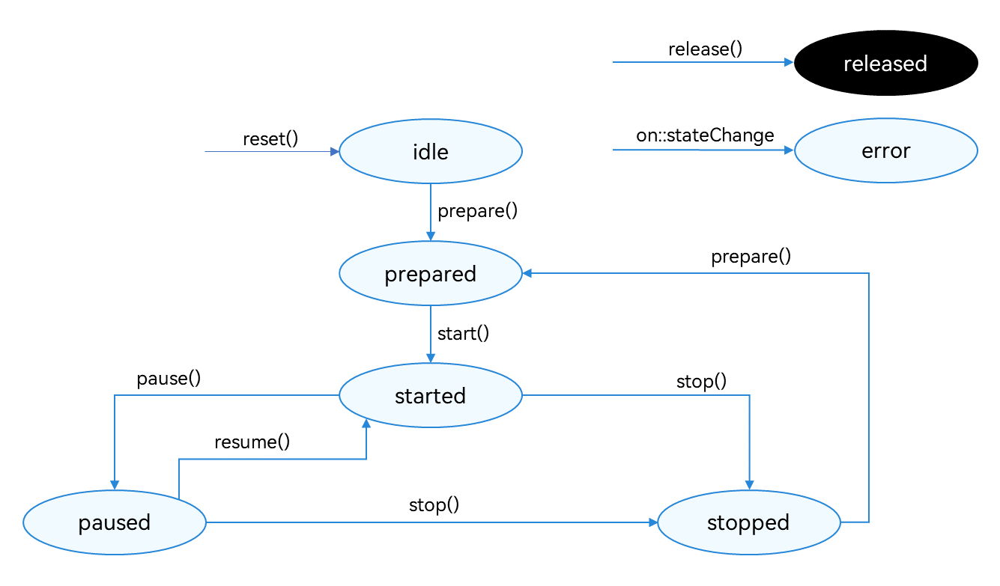

# 使用AVRecorder录制音频(C/C++)
<!--Kit: Media Kit-->
<!--Subsystem: Multimedia-->
<!--Owner: @gcw_dyOv3Sds-->
<!--Designer: @chris2981-->
<!--Tester: @xdlinc-->
<!--Adviser: @w_Machine_cc-->

AVRecorder支持开发音频或视频单独录制，集成了音频捕获、音频编码、视频编码、音视频封装功能，适用于实现简单音视频录制并直接得到本地媒体文件的场景。

本开发指导将以“开始录制-暂停录制-恢复录制-停止录制”的一次流程为示例，向开发者讲解如何使用AVRecorder进行音频录制。

在进行应用开发的过程中，开发者可以通过AVRecorder的state属性主动获取当前状态，或使用OH_AVRecorder_SetStateCallback方法注册回调监听状态变化。开发过程中应该严格遵循状态机要求，例如只能在started状态下调用pause()接口，只能在paused状态下调用resume()接口。

**图1** 录制状态变化示意图



状态的详细说明请参考[AVRecorderState](../../reference/apis-media-kit/arkts-apis-media-t.md#avrecorderstate9)。


## 申请权限

在开发此功能前，开发者应根据实际需求申请相关权限：
- 当需要使用麦克风时，需要申请**ohos.permission.MICROPHONE**麦克风权限。申请方式请参考：[向用户申请授权](../../security/AccessToken/request-user-authorization.md)。
- 当需要读取和保存音频文件时，请优先使用[AudioViewPicker音频选择器对象](../../reference/apis-core-file-kit/js-apis-file-picker.md#audioviewpicker)。

> **说明：**
>
> 仅应用需要克隆、备份或同步用户公共目录的音频类文件时，可申请ohos.permission.READ_AUDIO、ohos.permission.WRITE_AUDIO权限来读写音频文件，申请方式请参考<!--RP1-->[申请受控权限](../../security/AccessToken/declare-permissions-in-acl.md)<!--RP1End-->。

## 开发步骤及注意事项

> 选择只录音频时，与视频相关的所有参数（如videoFrameWidth和videoFrameHeight）均不需要配置。同理，选择只录视频不录音频时，与音频相关的所有参数（如audioBitrate和audioChannels）均不需要配置。


开发者通过引入[avrecorder.h](../../reference/apis-media-kit/capi-avrecorder-h.md)、[avrecorder_base.h](../../reference/apis-media-kit/capi-avrecorder-base-h.md)和[native_averrors.h](../../reference/apis-avcodec-kit/capi-native-averrors-h.md)头文件，使用音频录制相关API。

AVRecorder详细的API说明请参考[AVRecorder API参考](../../reference/apis-media-kit/capi-avrecorder.md)。


在CMake脚本中链接动态库。
```c++
target_link_libraries(entry PUBLIC libavrecorder.so)
```

使用[native_avformat.h](../../reference/apis-avcodec-kit/capi-native-avformat-h.md)相关接口时，需引入如下头文件。
```c++
#include <multimedia/player_framework/native_avformat.h>
```

并在CMake脚本中链接如下动态库。
```c++
target_link_libraries(entry PUBLIC libnative_media_core.so)
```

开发者通过引入[application_context.h](../../reference/apis-ability-kit/capi-application-context-h.md)头文件，使用程序框架服务相关API。
```c++
#include <AbilityKit/ability_runtime/application_context.h>
```

并在CMake脚本中链接如下动态库。
```c++
target_link_libraries(entry PUBLIC libability_runtime.so)
```

开发者使用系统日志能力时，需引入如下头文件。
```c++
#include <hilog/log.h>
```

并需要在CMake脚本中链接如下动态库。
```c++
target_link_libraries(entry PUBLIC libhilog_ndk.z.so)
```

1. 创建AVRecorder实例，实例创建完成进入idle状态。

   <!-- @[include_avrecorder_h](https://gitcode.com/openharmony/applications_app_samples/blob/master/code/BasicFeature/Media/AVRecorderNDK/entry/src/main/cpp/avrecorder_ndk.cpp) -->
   
   ``` C++
   #include "multimedia/player_framework/avrecorder.h"
   #include "multimedia/player_framework/avrecorder_base.h"
   ```

   <!-- @[declare_avrecorder](https://gitcode.com/openharmony/applications_app_samples/blob/master/code/BasicFeature/Media/AVRecorderNDK/entry/src/main/cpp/avrecorder_ndk.cpp) -->
   
   ``` C++
   static OH_AVRecorder *g_recorder = nullptr;
   ```

   <!-- @[create_avrecorder](https://gitcode.com/openharmony/applications_app_samples/blob/master/code/BasicFeature/Media/AVRecorderNDK/entry/src/main/cpp/avrecorder_ndk.cpp) -->
   
   ``` C++
   g_recorder = OH_AVRecorder_Create();
   ```

2. 设置业务需要的监听事件，监听状态变化及错误上报。
   | 事件类型 | 说明 |
   | -------- | -------- |
   | OnStateChange | 监听AVRecorder的状态改变。 |
   | OnError | 监听AVRecorder的错误信息。 |

   <!-- @[set_onstatechange_callback](https://gitcode.com/openharmony/applications_app_samples/blob/master/code/BasicFeature/Media/AVRecorderNDK/entry/src/main/cpp/avrecorder_ndk.cpp) -->
   
   ``` C++
   // 设置状态回调。
   OH_AVRecorder_SetStateCallback(g_recorder, OnStateChange, nullptr);
   ```

   <!-- @[set_onerror_callback](https://gitcode.com/openharmony/applications_app_samples/blob/master/code/BasicFeature/Media/AVRecorderNDK/entry/src/main/cpp/avrecorder_ndk.cpp) -->
   
   ``` C++
   // 设置错误回调。
   OH_AVRecorder_SetErrorCallback(g_recorder, OnError, nullptr);
   ```

   <!-- @[define_onstatechange_callback](https://gitcode.com/openharmony/applications_app_samples/blob/master/code/BasicFeature/Media/AVRecorderNDK/entry/src/main/cpp/avrecorder_ndk.cpp) -->
   
   ``` C++
   static void OnStateChange(OH_AVRecorder *recorder, OH_AVRecorder_State state,
       OH_AVRecorder_StateChangeReason reason, void *userData)
   {
       // ...
       
       (void)recorder;
       (void)userData;
   
       // 将reason转换为字符串表示。
       const char *reasonStr =
           (reason == OH_AVRecorder_StateChangeReason::AVRECORDER_USER) ? "USER" :
           (reason == OH_AVRecorder_StateChangeReason::AVRECORDER_BACKGROUND) ? "BACKGROUND" : "UNKNOWN";
   
       if (state == OH_AVRecorder_State::AVRECORDER_IDLE) {
           OH_LOG_INFO(LOG_APP, "==NDKDemo== Recorder OnStateChange IDLE, reason: %{public}s", reasonStr);
           // 处理状态变更。
       }
   }
   ```

   <!-- @[define_onerror_callback](https://gitcode.com/openharmony/applications_app_samples/blob/master/code/BasicFeature/Media/AVRecorderNDK/entry/src/main/cpp/avrecorder_ndk.cpp) -->
   
   ``` C++
   static void OnError(OH_AVRecorder *recorder, int32_t errorCode, const char *errorMsg, void *userData)
   {
       // ...
       
       (void)recorder;
       (void)userData;
       OH_LOG_ERROR(LOG_APP, "==NDKDemo== Recorder OnError errorCode: %{public}d, error message: %{public}s",
                    errorCode, errorMsg);
   }
   ```

3. 配置音频录制参数，调用OH_AVRecorder_Prepare()接口，此时进入prepared状态。

   > **说明：**
   >
   > 配置参数需要注意：
   >
   > - 配置参数之前需要确保完成对应权限的申请，请参考[申请权限](#申请权限)。
   >
   > - prepare接口的入参OH_AVRecorder_Config中设置音频相关的配置参数，如示例代码所示。
   >
   > - 录制输出的url地址（即示例里avConfig中的url），形式为fd://xx（fd number）。需要调用基础文件操作接口实现应用文件访问能力，获取方式参考[应用文件访问与管理](../../file-management/native-fileio-guidelines.md)。

   <!-- @[prepare_audio_recorder](https://gitcode.com/openharmony/applications_app_samples/blob/master/code/BasicFeature/Media/AVRecorderNDK/entry/src/main/cpp/avrecorder_ndk.cpp) -->
   
   ``` C++
   static napi_value PrepareAudioRecorder(napi_env env, napi_callback_info info)
   {
       OH_LOG_INFO(LOG_APP, "PrepareAudioRecorder called");
       
       OH_AVRecorder_Config config;
       memset(&config, 0, sizeof(config));
       config.audioSourceType = AVRECORDER_MIC;
       config.profile.audioBitrate = AUDIO_BITRATE; // 112000
       config.profile.audioChannels = AUDIO_CHANNELS; // 2
       config.profile.audioCodec = AVRECORDER_AUDIO_AAC;
       config.profile.audioSampleRate = AUDIO_SAMPLE_RATE; // 48000
       config.profile.fileFormat = AVRECORDER_CFT_MPEG_4A;
       config.videoSourceType = AVRECORDER_SURFACE_YUV;
       config.fileGenerationMode = AVRECORDER_APP_CREATE;
   
       // 获取沙箱路径
       char fileDirPath[1000] = {0};
       int32_t bufferSize = 1000;
       int32_t writeLength = 0;
       AbilityRuntime_ErrorCode errCode =
           OH_AbilityRuntime_ApplicationContextGetFilesDir(fileDirPath, bufferSize, &writeLength);
       if (errCode != AbilityRuntime_ErrorCode::ABILITY_RUNTIME_ERROR_CODE_NO_ERROR || writeLength <= 0) {
           OH_LOG_ERROR(LOG_APP, "==NDKDemo== GetFilesDir failed, errCode: %{public}d", errCode);
           napi_value res;
           napi_create_int32(env, -1, &res);
           return res;
       }
       const std::string avrecorderRoot = fileDirPath;
       g_outputFd = open((avrecorderRoot + "/audio_example.m4a").c_str(), O_RDWR | O_CREAT, FILE_PERMISSIONS);
       std::string fileUrl = "fd://" + std::to_string(g_outputFd);
       config.url = const_cast<char *>(fileUrl.c_str());
       OH_LOG_INFO(LOG_APP, "config.url is: %s", config.url);
   
       OH_AVErrCode err = OH_AVRecorder_Prepare(g_recorder, &config);
       if (err != AV_ERR_OK) {
           OH_LOG_ERROR(LOG_APP, "Failed to prepare audio recorder, error: %{public}d", err);
       }
       napi_value result;
       napi_create_int32(env, static_cast<int32_t>(err), &result);
       return result;
   }
   ```

4. 开始录制，调用OH_AVRecorder_Start()接口，此时AVRecorder进入started状态。

   <!-- @[start_recorder](https://gitcode.com/openharmony/applications_app_samples/blob/master/code/BasicFeature/Media/AVRecorderNDK/entry/src/main/cpp/avrecorder_ndk.cpp) -->
   
   ``` C++
   OH_AVErrCode err = OH_AVRecorder_Start(g_recorder);
   ```

5. 暂停录制，调用OH_AVRecorder_Pause()接口，此时AVRecorder进入paused状态，同时暂停输入源输入数据。

   <!-- @[pause_recorder](https://gitcode.com/openharmony/applications_app_samples/blob/master/code/BasicFeature/Media/AVRecorderNDK/entry/src/main/cpp/avrecorder_ndk.cpp) -->
   
   ``` C++
   OH_AVErrCode err = OH_AVRecorder_Pause(g_recorder);
   ```

6. 恢复录制，调用OH_AVRecorder_Resume()接口，此时再次进入started状态。

   <!-- @[resume_recorder](https://gitcode.com/openharmony/applications_app_samples/blob/master/code/BasicFeature/Media/AVRecorderNDK/entry/src/main/cpp/avrecorder_ndk.cpp) -->
   
   ``` C++
   OH_AVErrCode err = OH_AVRecorder_Resume(g_recorder);
   ```

7. 停止录制，调用OH_AVRecorder_Stop()接口，此时进入stopped状态。

   <!-- @[stop_recorder](https://gitcode.com/openharmony/applications_app_samples/blob/master/code/BasicFeature/Media/AVRecorderNDK/entry/src/main/cpp/avrecorder_ndk.cpp) -->
   
   ``` C++
   OH_AVErrCode err = OH_AVRecorder_Stop(g_recorder);
   ```

8. 重置资源，调用OH_AVRecorder_Reset()重新进入idle状态，允许重新配置录制参数。

   <!-- @[reset_recorder](https://gitcode.com/openharmony/applications_app_samples/blob/master/code/BasicFeature/Media/AVRecorderNDK/entry/src/main/cpp/avrecorder_ndk.cpp) -->
   
   ``` C++
   OH_AVErrCode err = OH_AVRecorder_Reset(g_recorder);
   ```

9. 销毁实例，调用OH_AVRecorder_Release()进入released状态，退出录制。

   <!-- @[release_recorder](https://gitcode.com/openharmony/applications_app_samples/blob/master/code/BasicFeature/Media/AVRecorderNDK/entry/src/main/cpp/avrecorder_ndk.cpp) -->
   
   ``` C++
   OH_AVRecorder_Release(g_recorder);
   ```

## 完整示例

参考以下示例，包括“创建录制实例-准备录制-开始录制-暂停录制-恢复录制-停止录制-重置录制状态-释放录制资源”的完整流程。

   <!-- @[full_audio_recorder](https://gitcode.com/openharmony/applications_app_samples/blob/master/code/BasicFeature/Media/AVRecorderNDK/entry/src/main/cpp/avrecorder_ndk.cpp) -->
   
   ``` C++
   #include <cstdio>
   #include <cstring>
   #include <string>
   #include <fcntl.h>
   #include <unistd.h>
   
   #include "napi/native_api.h"
   #include "multimedia/player_framework/avrecorder.h"
   #include "multimedia/player_framework/avrecorder_base.h"
   #include "multimedia/player_framework/native_avformat.h"
   #include "multimedia/media_library/media_asset_change_request_capi.h"
   #include "multimedia/media_library/media_access_helper_capi.h"
   #include "multimedia/media_library/media_asset_capi.h"
   #include "native_window/external_window.h"
   #include "hilog/log.h"
   #include <AbilityKit/ability_runtime/application_context.h>
   
   static constexpr int32_t AUDIO_BITRATE = 112000;
   static constexpr int32_t AUDIO_CHANNELS = 2;
   static constexpr int32_t AUDIO_SAMPLE_RATE = 48000;
   static constexpr int32_t VIDEO_BITRATE = 3000000;
   static constexpr int32_t VIDEO_FRAME_WIDTH = 1920;
   static constexpr int32_t VIDEO_FRAME_HEIGHT = 1080;
   static constexpr int32_t VIDEO_FRAME_RATE = 30;
   static constexpr int32_t CALLBACK_ARG_COUNT = 2;
   static constexpr int32_t FILE_PERMISSIONS = 0644;
   
   static OH_AVRecorder *g_recorder = nullptr;
   static int32_t g_outputFd = -1;
   
   // ...
   
   static void OnStateChange(OH_AVRecorder *recorder, OH_AVRecorder_State state,
       OH_AVRecorder_StateChangeReason reason, void *userData)
   {
       // ...
       
       (void)recorder;
       (void)userData;
   
       // 将reason转换为字符串表示。
       const char *reasonStr =
           (reason == OH_AVRecorder_StateChangeReason::AVRECORDER_USER) ? "USER" :
           (reason == OH_AVRecorder_StateChangeReason::AVRECORDER_BACKGROUND) ? "BACKGROUND" : "UNKNOWN";
   
       if (state == OH_AVRecorder_State::AVRECORDER_IDLE) {
           OH_LOG_INFO(LOG_APP, "==NDKDemo== Recorder OnStateChange IDLE, reason: %{public}s", reasonStr);
           // 处理状态变更。
       }
   }
   
   static void OnError(OH_AVRecorder *recorder, int32_t errorCode, const char *errorMsg, void *userData)
   {
       // ...
       
       (void)recorder;
       (void)userData;
       OH_LOG_ERROR(LOG_APP, "==NDKDemo== Recorder OnError errorCode: %{public}d, error message: %{public}s",
                    errorCode, errorMsg);
   }
   
   // ...
   
   static napi_value CreateRecorder(napi_env env, napi_callback_info info)
   {
       OH_LOG_INFO(LOG_APP, "CreateRecorder called");
       if (g_recorder != nullptr) {
           OH_AVRecorder_Release(g_recorder);
           g_recorder = nullptr;
       }
       g_recorder = OH_AVRecorder_Create();
       if (g_recorder == nullptr) {
           OH_LOG_ERROR(LOG_APP, "Failed to create recorder");
           napi_value result;
           napi_create_int32(env, -1, &result);
           return result;
       }
       OH_LOG_INFO(LOG_APP, "CreateRecorder succeeded");
       napi_value result;
       napi_create_int32(env, 0, &result);
       return result;
   }
   
   static napi_value SetRecorderStateCallback(napi_env env, napi_callback_info info)
   {
       OH_LOG_INFO(LOG_APP, "SetRecorderStateCallback called");
       // ...
   
       // 设置状态回调。
       OH_AVRecorder_SetStateCallback(g_recorder, OnStateChange, nullptr);
   
       napi_value result;
       napi_create_int32(env, 0, &result);
       return result;
   }
   
   static napi_value SetRecorderErrorCallback(napi_env env, napi_callback_info info)
   {
       OH_LOG_INFO(LOG_APP, "SetRecorderErrorCallback called");
       // ...
   
       // 设置错误回调。
       OH_AVRecorder_SetErrorCallback(g_recorder, OnError, nullptr);
   
       napi_value result;
       napi_create_int32(env, 0, &result);
       return result;
   }
   
   // ...
   
   static napi_value PrepareAudioRecorder(napi_env env, napi_callback_info info)
   {
       OH_LOG_INFO(LOG_APP, "PrepareAudioRecorder called");
       
       OH_AVRecorder_Config config;
       memset(&config, 0, sizeof(config));
       config.audioSourceType = AVRECORDER_MIC;
       config.profile.audioBitrate = AUDIO_BITRATE; // 112000
       config.profile.audioChannels = AUDIO_CHANNELS; // 2
       config.profile.audioCodec = AVRECORDER_AUDIO_AAC;
       config.profile.audioSampleRate = AUDIO_SAMPLE_RATE; // 48000
       config.profile.fileFormat = AVRECORDER_CFT_MPEG_4A;
       config.videoSourceType = AVRECORDER_SURFACE_YUV;
       config.fileGenerationMode = AVRECORDER_APP_CREATE;
   
       // 获取沙箱路径
       char fileDirPath[1000] = {0};
       int32_t bufferSize = 1000;
       int32_t writeLength = 0;
       AbilityRuntime_ErrorCode errCode =
           OH_AbilityRuntime_ApplicationContextGetFilesDir(fileDirPath, bufferSize, &writeLength);
       if (errCode != AbilityRuntime_ErrorCode::ABILITY_RUNTIME_ERROR_CODE_NO_ERROR || writeLength <= 0) {
           OH_LOG_ERROR(LOG_APP, "==NDKDemo== GetFilesDir failed, errCode: %{public}d", errCode);
           napi_value res;
           napi_create_int32(env, -1, &res);
           return res;
       }
       const std::string avrecorderRoot = fileDirPath;
       g_outputFd = open((avrecorderRoot + "/audio_example.m4a").c_str(), O_RDWR | O_CREAT, FILE_PERMISSIONS);
       std::string fileUrl = "fd://" + std::to_string(g_outputFd);
       config.url = const_cast<char *>(fileUrl.c_str());
       OH_LOG_INFO(LOG_APP, "config.url is: %s", config.url);
   
       OH_AVErrCode err = OH_AVRecorder_Prepare(g_recorder, &config);
       if (err != AV_ERR_OK) {
           OH_LOG_ERROR(LOG_APP, "Failed to prepare audio recorder, error: %{public}d", err);
       }
       napi_value result;
       napi_create_int32(env, static_cast<int32_t>(err), &result);
       return result;
   }
   
   // ...
   
   static napi_value StartRecorder(napi_env env, napi_callback_info info)
   {
       OH_AVErrCode err = OH_AVRecorder_Start(g_recorder);
       napi_value result;
       napi_create_int32(env, static_cast<int32_t>(err), &result);
       return result;
   }
   
   static napi_value PauseRecorder(napi_env env, napi_callback_info info)
   {
       OH_AVErrCode err = OH_AVRecorder_Pause(g_recorder);
       napi_value result;
       napi_create_int32(env, static_cast<int32_t>(err), &result);
       return result;
   }
   
   static napi_value ResumeRecorder(napi_env env, napi_callback_info info)
   {
       OH_AVErrCode err = OH_AVRecorder_Resume(g_recorder);
       napi_value result;
       napi_create_int32(env, static_cast<int32_t>(err), &result);
       return result;
   }
   
   static napi_value StopRecorder(napi_env env, napi_callback_info info)
   {
       OH_AVErrCode err = OH_AVRecorder_Stop(g_recorder);
       if (g_outputFd > 0) {
           close(g_outputFd);
           g_outputFd = -1;
       }
       napi_value result;
       napi_create_int32(env, static_cast<int32_t>(err), &result);
       return result;
   }
   
   static napi_value ResetRecorder(napi_env env, napi_callback_info info)
   {
       OH_AVErrCode err = OH_AVRecorder_Reset(g_recorder);
       napi_value result;
       napi_create_int32(env, static_cast<int32_t>(err), &result);
       return result;
   }
   
   static napi_value ReleaseRecorder(napi_env env, napi_callback_info info)
   {
       OH_LOG_INFO(LOG_APP, "ReleaseRecorder called");
       // ...
       if (g_recorder != nullptr) {
           OH_AVRecorder_Release(g_recorder);
           g_recorder = nullptr;
       }
       if (g_outputFd > 0) {
           close(g_outputFd);
           g_outputFd = -1;
       }
       OH_LOG_INFO(LOG_APP, "ReleaseRecorder succeeded");
       napi_value result;
       napi_create_int32(env, 0, &result);
       return result;
   }
   ```
