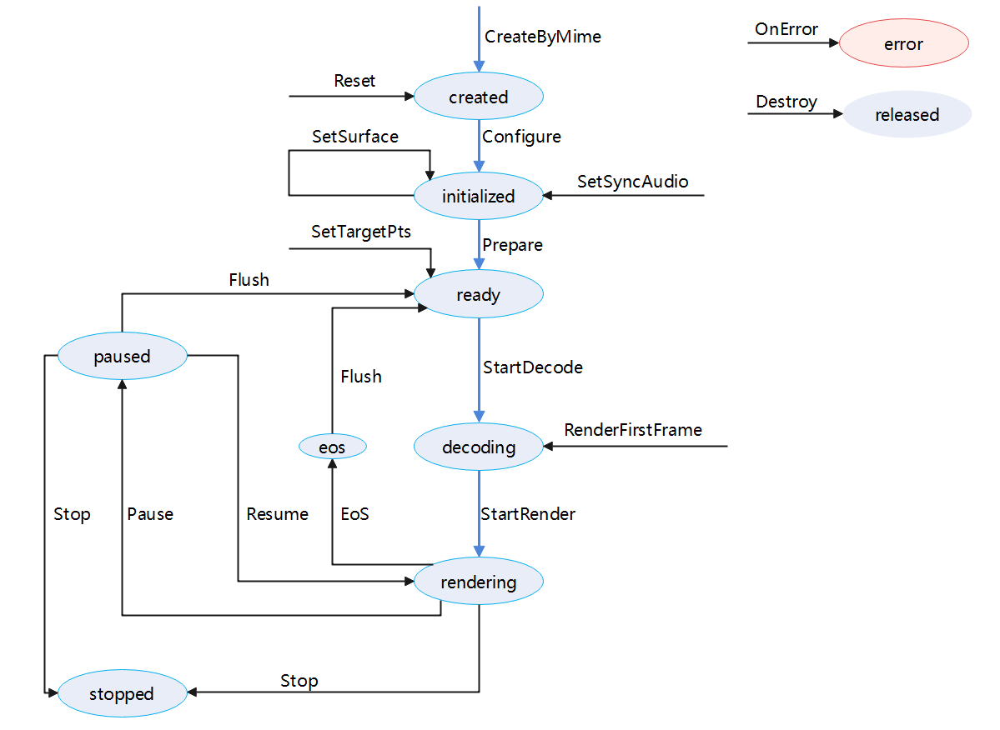

# 使用LPP播放器播放视频 (C/C++)

<!--Kit: Media Kit-->
<!--Subsystem: Multimedia-->
<!--Owner: @hanzhengshi-->
<!--Designer: @yangde_dy-->
<!--Tester: @xchaosioda-->
<!--Adviser: @w_Machine_cc-->

从API version 20开始，使用LPP（low power player）播放器可以通过低功耗实现从媒体源到渲染的视频通路能力。本指南通过播放本地视频的示例，讲解如何使用LowPowerPlayer播放视频。

> **说明：**
>
> LowPowerPlayer播放器不支持纯视频和纯音频播放。纯音频低功耗播放请参考低功耗音频播放。

播放流程包含：创建解封装器、创建播放器、设置回调监听函数、配置播放参数、播放控制（播放/暂停/继续/倍速/音量/停止/重置）、销毁播放器实例。

**图1** 播放状态变化示意图  


播放流程包含：创建（created）、初始化（initialized）、就绪（ready）、解码（decoding）和渲染（rendering）五个阶段。

应用通过调用CreateByMime初始化创建解码器实例。完成解码器参数配置Configure，切换到initialized（已初始化）状态。

在初始化完成的状态下，完成解码器资源预加载（Prepare），视频进入准备就绪状态（ready）。然后启动解码流程（StartDecode），切换到解码（decoding）状态，触发首帧渲染（RenderFirstFrame）。最后启动渲染（StartRender）流程，切换到渲染（rendering）状态。

在渲染过程中，遇到暂停（Pause）会切换到paused状态，此时解码与渲染被临时挂起，资源未释放。当恢复渲染（Resume）时，视频将恢复并回到渲染（rendering）状态。当遇到停止（Stop）时，会切换到stopped状态，该状态代表解码器已停止工作，但实例仍存在。当渲染过程中流结束（EoS）时，会切换到eos状态。

在播放过程中，如果遇到错误（OnError），会出现异常，需要重置或进入释放阶段（released）销毁解码器实例，释放所有资源。

当播放处于ready/decoding/rendering/paused/stopped状态时，播放引擎此时处于工作状态会占用较多的系统资源。当暂停使用播放器时，可调用reset或destroy回收资源。

## 开发建议

当前指导仅介绍如何实现媒体资源播放，在应用开发过程中会涉及后台播放、播放冲突等情况，请根据实际需要参考以下说明。

- 由于硬件差异，LPP播放器能力仅在部分手机上支持。从API version 21开始，建议通过OH_LowPowerAVSink_GetCapability查询LPP播放器能力是否支持。如果不支持，使用AVCodec能力实现播放。

- 当应用在播放过程中时，播放的媒体数据涉及音频，根据系统音频管理策略（参考处理音频焦点变化事件）可知这会被其他应用打断，建议通过OH_LowPowerAudioSinkCallback_SetInterruptListener主动监听音频打断事件，根据其回调参数提示做出相应的处理，避免出现应用状态与预期效果不一致的问题。

- 当设备同时连接多个音频输出设备时，建议通过OH_LowPowerAudioSinkCallback_SetDeviceChangeListener主动监听音频输出设备改变事件，并做出相应处理。

- 当应用在执行过程中，可能出现系统内部异常。如网络异常、内存不足、媒体服务死亡不可用等，建议通过 OH_LowPowerAudioSinkCallback_SetErrorListener或OH_LowPowerVideoSinkCallback_SetErrorListener对应接口设置错误监听回调函数，根据不同错误类型和错误信息，做出相应处理，避免出现播放异常。

- 在播放过程中，播放器需要的数据要通过 OH_AVDemuxer_ReadSampleBuffer接口获取指定轨道的buffer，并通过 OH_AVSamplesBuffer_AppendOneBuffer进行多个buffer的封装，然后再通过 OH_LowPowerAudioSink_ReturnSamples或OH_LowPowerVideoSink_ReturnSamples通知播放器进行消费，当播放器需要数据时，会触发通过 OH_LowPowerAudioSinkCallback_SetDataNeededListener或OH_LowPowerVideoSinkCallback_SetDataNeededListener接口注册的回调函数。

- 需要注意函数的调用时机。根据`状态示意图`和`详细的接口文档`进行合理调用。在程序执行完成后，调用`OH_***_Create`方法的同时必须调用对应的`OH_***_Destroy`方法，进行资源释放。

- 用户在注册回调函数时，可在最后一个参数`void *userData`中来配置自定义数据，以便在回调函数中执行某些设置（如状态改变等）。<br>
  其他回调函数：<br>
  OH_LowPowerAudioSinkCallback_SetPositionUpdateListener：可获取播放进度。<br>OH_LowPowerAudioSinkCallback_SetEosListener或OH_LowPowerVideoSinkCallback_SetEosListener：播放结束触发。 <br>
  OH_LowPowerVideoSinkCallback_SetRenderStartListener：视频开始渲染。 <br>
  OH_LowPowerVideoSink_SetTargetStartFrame：到达目标帧。 <br>
  OH_LowPowerVideoSinkCallback_SetStreamChangedListener：视频流切换。 <br>
  OH_LowPowerVideoSinkCallback_SetFirstFrameDecodedListener：首帧视频渲染完毕。

## 开发步骤及注意事项

在CMake脚本中链接动态库。

```c
target_link_libraries(sample PUBLIC liblowpower_avsink.so)
```

头文件引入。

```c++
#include "multimedia/player_framework/lowpower_audio_sink_base.h"
#include "multimedia/player_framework/lowpower_audio_sink.h"
#include "multimedia/player_framework/lowpower_video_sink.h"
#include "multimedia/player_framework/lowpower_video_sink_base.h"
```

开发者使用系统日志能力时，需引入如下头文件：

```c++
#include <hilog/log.h>
```

并需要在CMake脚本中链接如下动态库：

```c
target_link_libraries(sample PUBLIC libhilog_ndk.z.so)
```

使用该模块时，需要链接的库如下所示：解封装、基础解码、显示渲染等能力。

```c
set(BASE_LIBRARY
    libnative_media_codecbase.so libnative_media_core.so libnative_media_vdec.so libnative_window.so
    libnative_media_venc.so libnative_media_acodec.so libnative_media_avdemuxer.so libnative_media_avsource.so
    libohaudio.so
)
target_link_libraries(sample PUBLIC ${BASE_LIBRARY})
```

开发者通过引入lowpower_audio_sink_base.h、lowpower_audio_sink.h、lowpower_video_sink.h、 lowpower_video_sink_base.h 头文件，使用音视频播放相关API。

1.  创建播放器。

     根据实际情况，应用可使用自研解封装或可通过OH_AVSource_CreateWithDataSource()/OH_AVSource_CreateWithFD()/OH_AVSource_CreateWithURI()来创建OH_AVSource ，通过`OH_AVSource`调用OH_AVDemuxer_CreateWithSource()，创建解封装器，获取视频的元信息。

    <!-- @[OH_AVDemuxer_CreateWithSource](https://gitcode.com/openharmony/applications_app_samples/blob/master/code/DocsSample/Media/LowPowerAVSInk/lowPowerAVSinkSample/entry/src/main/cpp/capabilities/demuxer.cpp) -->
    
    ``` C++
    source_ = OH_AVSource_CreateWithFD(info.inputFd, info.inputFileOffset, info.inputFileSize);
    demuxer_ = OH_AVDemuxer_CreateWithSource(source_);
    int32_t ret = GetTrackInfo(sourceFormat, info);
    ```

2.  根据视频元信息，调用  OH_LowPowerAudioSink_CreateByMime或OH_LowPowerVideoSink_CreateByMime来创建播放器。

    <!-- @[OH_LowPowerVideoSink_CreateByMime](https://gitcode.com/openharmony/applications_app_samples/blob/master/code/DocsSample/Media/LowPowerAVSInk/lowPowerAVSinkSample/entry/src/main/cpp/capabilities/lpp_video_streamer.cpp) -->
    
    ``` C++
    lppVideoStreamer_ = OH_LowPowerVideoSink_CreateByMime(videoCodecMime.c_str());
    ```

    <!-- @[OH_LowPowerAudioSink_CreateByMime](https://gitcode.com/openharmony/applications_app_samples/blob/master/code/DocsSample/Media/LowPowerAVSInk/lowPowerAVSinkSample/entry/src/main/cpp/capabilities/lpp_audio_streamer.cpp) -->
    
    ``` C++
    lppAudioStreamer_ = OH_LowPowerAudioSink_CreateByMime(audioCodecMime.c_str());
    ```

3.  设置回调监听函数。

     调用OH_LowPowerAudioSinkCallback_Create或OH_LowPowerVideoSinkCallback_Create创建OH_LowPowerAudioSinkCallback或OH_LowPowerVideoSinkCallback的回调函数的整合，通过setListener函数向该结构体添加对应的回调函数，完成registerCallback的一次性注册。

    <!-- @[OH_LowPowerAudioSinkCallback_Create](https://gitcode.com/openharmony/applications_app_samples/blob/master/code/DocsSample/Media/LowPowerAVSInk/lowPowerAVSinkSample/entry/src/main/cpp/capabilities/lpp_audio_streamer.cpp) -->
    
    ``` C++
    lppAudioStreamerCallback_ = OH_LowPowerAudioSinkCallback_Create();
    OH_LowPowerAudioSinkCallback_SetDataNeededListener(lppAudioStreamerCallback_,
        LppCallback::OnDataNeeded, lppUserData);
    OH_LowPowerAudioSinkCallback_SetPositionUpdateListener(lppAudioStreamerCallback_,
        LppCallback::OnPositionUpdated, lppUserData);
    ret = OH_LowPowerAudioSink_RegisterCallback(lppAudioStreamer_, lppAudioStreamerCallback_);
    ```

4.  配置播放器。

     根据之前通过解封装获得的元信息，创建并配置OH_AVFormat。通过configure接口 OH_LowPowerAudioSink_Configure / OH_LowPowerVideoSink_Configure进行播放器的配置，详细参数可参考示例代码。视频流需要使用OH_LowPowerVideoSink_SetVideoSurface接口来设置显示窗口。

    <!-- @[OH_LowPowerVideoSink_Configure](https://gitcode.com/openharmony/applications_app_samples/blob/master/code/DocsSample/Media/LowPowerAVSInk/lowPowerAVSinkSample/entry/src/main/cpp/capabilities/lpp_video_streamer.cpp) -->
    
    ``` C++
    OH_AVFormat *format = OH_AVFormat_Create();
     
    OH_AVFormat_SetIntValue(format, OH_MD_KEY_WIDTH, sampleInfo.videoWidth);
    OH_AVFormat_SetIntValue(format, OH_MD_KEY_HEIGHT, sampleInfo.videoHeight);
    OH_AVFormat_SetDoubleValue(format, OH_MD_KEY_FRAME_RATE, sampleInfo.frameRate);
    OH_AVFormat_SetIntValue(format, OH_MD_KEY_PIXEL_FORMAT, sampleInfo.pixelFormat);
    OH_AVFormat_SetIntValue(format, OH_MD_KEY_ROTATION, sampleInfo.rotation);
     
    int ret = OH_LowPowerVideoSink_Configure(lppVideoStreamer_, format);
    ```

5.  准备播放。

     准备播放前，需要调用OH_LowPowerVideoSink_SetSyncAudioSink设置音画同步绑定。然后调用prepare方法，OH_LowPowerAudioSink_Prepare或OH_LowPowerVideoSink_Prepare进入'准备'阶段。

    <!-- @[OH_LowPowerVideoSink_SetSyncAudioSink](https://gitcode.com/openharmony/applications_app_samples/blob/master/code/DocsSample/Media/LowPowerAVSInk/lowPowerAVSinkSample/entry/src/main/cpp/capabilities/lpp_video_streamer.cpp) -->
    
    ``` C++
    auto ret = OH_LowPowerVideoSink_SetSyncAudioSink(lppVideoStreamer_, audioStreamer);
    ```

    <!-- @[OH_LowPowerVideoSink_Prepare](https://gitcode.com/openharmony/applications_app_samples/blob/master/code/DocsSample/Media/LowPowerAVSInk/lowPowerAVSinkSample/entry/src/main/cpp/capabilities/lpp_video_streamer.cpp) -->
    
    ``` C++
    auto ret = OH_LowPowerVideoSink_Prepare(lppVideoStreamer_);
    ```

    <!-- @[OH_LowPowerAudioSink_Prepare](https://gitcode.com/openharmony/applications_app_samples/blob/master/code/DocsSample/Media/LowPowerAVSInk/lowPowerAVSinkSample/entry/src/main/cpp/capabilities/lpp_audio_streamer.cpp) -->
    
    ``` C++
    auto ret = OH_LowPowerAudioSink_Prepare(lppAudioStreamer_);
    ```
6.  开始播放。

     调用OH_LowPowerAudioSink_Start或OH_LowPowerVideoSink_StartRenderer开始渲染。视频流需要在渲染开始前调用OH_LowPowerVideoSink_StartDecoder开始解码或调用 OH_LowPowerVideoSink_RenderFirstFrame开始解码并送显首帧'接口'进入解码。

    <!-- @[OH_LowPowerVideoSink_StartDecoder](https://gitcode.com/openharmony/applications_app_samples/blob/master/code/DocsSample/Media/LowPowerAVSInk/lowPowerAVSinkSample/entry/src/main/cpp/capabilities/lpp_video_streamer.cpp) -->
    
    ``` C++
    auto ret = OH_LowPowerVideoSink_StartDecoder(lppVideoStreamer_);
    ```

    <!-- @[OH_LowPowerVideoSink_StartRenderer](https://gitcode.com/openharmony/applications_app_samples/blob/master/code/DocsSample/Media/LowPowerAVSInk/lowPowerAVSinkSample/entry/src/main/cpp/capabilities/lpp_video_streamer.cpp) -->
    
    ``` C++
    auto ret = OH_LowPowerVideoSink_StartRenderer(lppVideoStreamer_);
    ```

7.  播放控制（可选）。

     暂停：OH_LowPowerAudioSink_Pause或 OH_LowPowerVideoSink_Pause<br>
     恢复播放：OH_LowPowerAudioSink_Resume或 OH_LowPowerVideoSink_Resume<br>
     停止：OH_LowPowerAudioSink_Stop或OH_LowPowerVideoSink_Stop<br>
     设置声音：OH_LowPowerAudioSink_SetVolume <br>
     设置播放速度：OH_LowPowerAudioSink_SetPlaybackSpeed或OH_LowPowerVideoSink_SetPlaybackSpeed <br>
     清空缓存数据，可用于seek操作：OH_LowPowerAudioSink_Flush或OH_LowPowerVideoSink_Flush <br>

8.  更换资源（可选）。

     调用OH_LowPowerAudioSink_Reset或OH_LowPowerVideoSink_Reset重置资源，允许更换资源，重新配置播放器。

9.  退出播放。

     调用OH_LowPowerAudioSink_Destroy或OH_LowPowerVideoSink_Destroy销毁实例，AVPlayer进入'RELEASED'状态，退出播放。