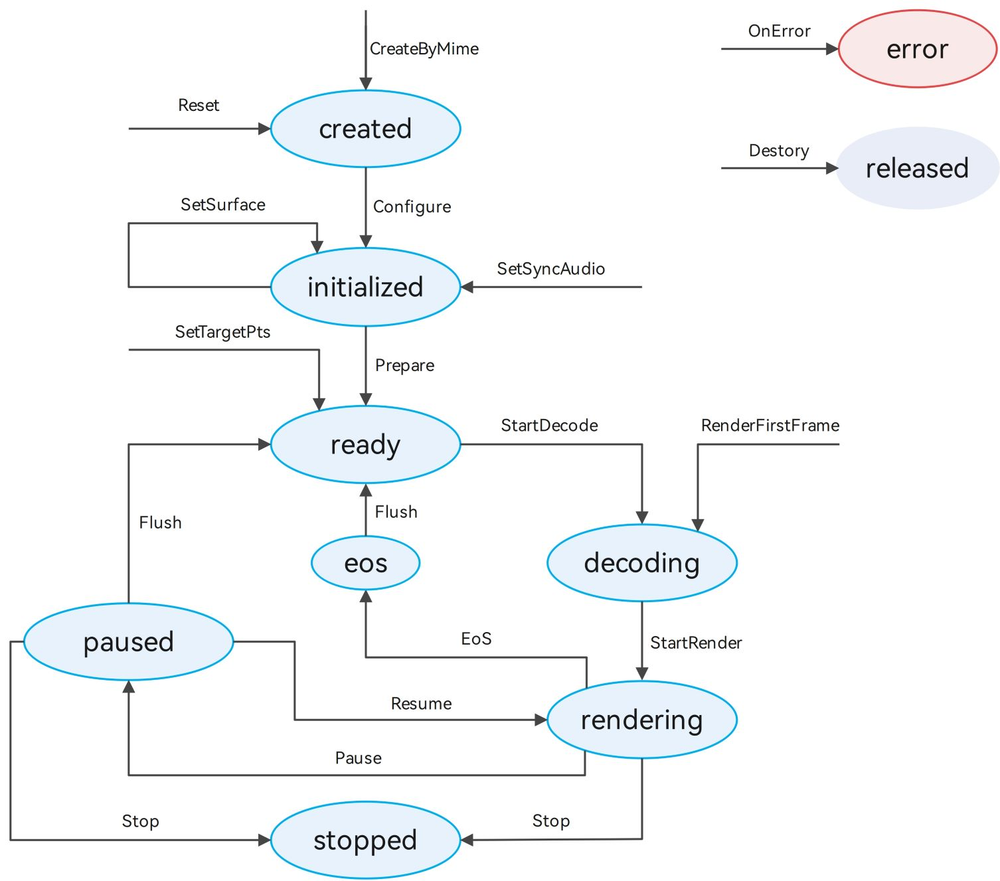

# 使用LPP播放器播放音视频 (C/C++)

<!--Kit: Media Kit-->
<!--Subsystem: Multimedia-->
<!--Owner: @Saber_e-->
<!--Designer: @yangde_dy-->
<!--Tester: @xchaosioda-->
<!--Adviser: @w_Machine_cc-->

使用LPP（low power player）播放器可以实现从媒体源到渲染的音视频通路能力。本指南通过播放本地视频的示例，讲解如何使用LowPowerPlayer播放音视频。

播放流程包含：创建解封装器、创建播放器、设置回调监听函数、配置播放参数、播放控制（播放/暂停/继续/倍速/音量/停止/重置）、销毁播放器实例。

**图1** 播放状态变化示意图  


当播放处于ready/decoding/rendering/paused/stopped状态时，播放引擎此时处于工作状态会占用较多的系统资源。当暂停使用播放器时，可调用reset或destroy回收资源。

## 开发建议

当前指导仅介绍如何实现媒体资源播放，在应用开发过程中可能会涉及后台播放、播放冲突等情况，请根据实际需要参考以下说明。
- 由于硬件差异，Lpp播放器能力仅在部分手机上支持。建议通过[OH_LowPowerAVSink_GetCapability](../../reference/apis-media-kit/capi-lowpower-avsink-base-h.md#oh_lowpoweravsink_getcapability)查询Lpp播放器能力是否支持。如果不支持，使用[AvCodec](../avcodec/avcodec-kit-intro.md)能力实现播放。

- 当应用在播放过程中时，播放的媒体数据涉及音频，根据系统音频管理策略（参考[处理音频焦点变化](../audio/audio-playback-concurrency.md#处理音频焦点变化)事件）可知这会被其他应用打断，建议通过[OH_LowPowerAudioSinkCallback_SetInterruptListener](../../reference/apis-media-kit/capi-lowpower-audio-sink-h.md#oh_lowpoweraudiosinkcallback_setinterruptlistener)主动监听音频打断事件，根据其回调参数提示做出相应的处理，避免出现应用状态与预期效果不一致的问题。

- 当设备同时连接多个音频输出设备时，建议通过[OH_LowPowerAudioSinkCallback_SetDeviceChangeListener](../../reference/apis-media-kit/capi-lowpower-audio-sink-h.md#oh_lowpoweraudiosinkcallback_setdevicechangelistener)主动监听音频输出设备改变事件，并做出相应处理。

- 当应用在执行过程中，可能出现系统内部异常。如网络异常、内存不足、媒体服务死亡不可用等，建议通过 [OH_LowPowerAudioSinkCallback_SetErrorListener](../../reference/apis-media-kit/capi-lowpower-audio-sink-h.md#oh_lowpoweraudiosinkcallback_seterrorlistener)或[OH_LowPowerVideoSinkCallback_SetErrorListener](../../reference/apis-media-kit/capi-lowpower-video-sink-h.md#oh_lowpowervideosinkcallback_seterrorlistener)对应接口设置错误监听回调函数，根据不同错误类型和错误信息，做出相应处理，避免出现播放异常。

- 在播放过程中，播放器需要的数据要通过 [OH_AVDemuxer_ReadSampleBuffer](../../reference/apis-avcodec-kit/capi-native-avdemuxer-h.md#oh_avdemuxer_readsamplebuffer)接口获取指定轨道的buffer，并通过 [OH_AVSamplesBuffer_AppendOneBuffer](../../reference/apis-media-kit/capi-lowpower-avsink-base-h.md#oh_avsamplesbuffer_appendonebuffer)进行多个buffer的封装，然后再通过 [OH_LowPowerAudioSink_ReturnSamples](../../reference/apis-media-kit/capi-lowpower-audio-sink-h.md#oh_lowpoweraudiosink_returnsamples)或[OH_LowPowerVideoSink_ReturnSamples](../../reference/apis-media-kit/capi-lowpower-video-sink-h.md#oh_lowpowervideosink_returnsamples)通知播放器进行消费，当播放器需要数据时，会触发通过 [OH_LowPowerAudioSinkCallback_SetDataNeededListener](../../reference/apis-media-kit/capi-lowpower-audio-sink-h.md#oh_lowpoweraudiosinkcallback_setdataneededlistener)或[OH_LowPowerVideoSinkCallback_SetDataNeededListener](../../reference/apis-media-kit/capi-lowpower-video-sink-h.md#oh_lowpowervideosinkcallback_setdataneededlistener)接口注册的回调函数。

- 需要注意函数的调用时机。根据`状态示意图`和`详细的接口文档`进行合理调用。在程序执行完成后，调用`OH_***_Create`方法的同时必须调用对应的`OH_***_Destroy`方法，进行资源释放。

- 用户在注册回调函数时，可在最后一个参数`void *userData`中来配置自定义数据，以便在回调函数中执行某些设置（如状态改变等）。<br>
  其他回调函数：<br>
  [OH_LowPowerAudioSinkCallback_SetPositionUpdateListener](../../reference/apis-media-kit/capi-lowpower-audio-sink-h.md#oh_lowpoweraudiosinkcallback_setpositionupdatelistener)：可获取播放进度。<br>[OH_LowPowerAudioSinkCallback_SetEosListener](../../reference/apis-media-kit/capi-lowpower-audio-sink-h.md#oh_lowpoweraudiosinkcallback_seteoslistener)或[OH_LowPowerVideoSinkCallback_SetEosListener](../../reference/apis-media-kit/capi-lowpower-video-sink-h.md#oh_lowpowervideosinkcallback_seteoslistener)：播放结束触发。 <br>
  [OH_LowPowerVideoSinkCallback_SetRenderStartListener](../../reference/apis-media-kit/capi-lowpower-video-sink-h.md#oh_lowpowervideosinkcallback_setrenderstartlistener)：视频开始渲染。 <br>
  [OH_LowPowerVideoSink_SetTargetStartFrame](../../reference/apis-media-kit/capi-lowpower-video-sink-h.md#oh_lowpowervideosink_settargetstartframe)：到达目标帧。 <br>
  [OH_LowPowerVideoSinkCallback_SetStreamChangedListener](../../reference/apis-media-kit/capi-lowpower-video-sink-h.md#oh_lowpowervideosinkcallback_setstreamchangedlistener)：视频流切换。 <br>
  [OH_LowPowerVideoSinkCallback_SetFirstFrameDecodedListener](../../reference/apis-media-kit/capi-lowpower-video-sink-h.md#oh_lowpowervideosinkcallback_setfirstframedecodedlistener)：首帧视频渲染完毕。

## 开发步骤及注意事项

在CMake脚本中链接动态库。

```
target_link_libraries(sample PUBLIC liblowpower_avsink.so)
```

头文件引入。

```
#include "multimedia/player_framework/lowpower_audio_sink_base.h"
#include "multimedia/player_framework/lowpower_audio_sink.h"
#include "multimedia/player_framework/lowpower_video_sink.h"
#include "multimedia/player_framework/lowpower_video_sink_base.h"
```

开发者使用系统日志能力时，需引入如下头文件：

```
#include <hilog/log.h>
```

并需要在CMake脚本中链接如下动态库：

```
target_link_libraries(sample PUBLIC libhilog_ndk.z.so)
```

使用该模块时，需要链接的库如下所示：解封装、基础解码、显示渲染等能力。

```
set(BASE_LIBRARY
    libnative_media_codecbase.so libnative_media_core.so libnative_media_vdec.so libnative_window.so
    libnative_media_venc.so libnative_media_acodec.so libnative_media_avdemuxer.so libnative_media_avsource.so
    libohaudio.so
)
target_link_libraries(sample PUBLIC ${BASE_LIBRARY})
```

开发者通过引入[lowpower_audio_sink_base.h](../../reference/apis-media-kit/capi-lowpower-audio-sink-base-h.md)、[lowpower_audio_sink.h](../../reference/apis-media-kit/capi-lowpower-audio-sink-h.md)、[lowpower_video_sink.h](../../reference/apis-media-kit/capi-lowpower-video-sink-h.md)、 [lowpower_video_sink_base.h](../../reference/apis-media-kit/capi-lowpower-video-sink-base-h.md) 头文件，使用音视频播放相关API。

1.  创建播放器。

     根据实际情况，应用可使用自研解封装或可通过[OH_AVSource_CreateWithDataSource()](../../reference/apis-avcodec-kit/capi-native-avsource-h.md#oh_avsource_createwithdatasource)/[OH_AVSource_CreateWithFD()](../../reference/apis-avcodec-kit/capi-native-avsource-h.md#oh_avsource_createwithfd)/[OH_AVSource_CreateWithURI()](../../reference/apis-avcodec-kit/capi-native-avsource-h.md#oh_avsource_createwithuri)来创建[OH_AVSource](../../reference/apis-avcodec-kit/capi-avsource-oh-avsource.md) ，通过`OH_AVSource`调用[OH_AVDemuxer_CreateWithSource()](../../reference/apis-avcodec-kit/capi-native-avdemuxer-h.md#oh_avdemuxer_createwithsource)，创建解封装器，获取视频的元信息。

    ```
    source_ = OH_AVSource_CreateWithFD(info.inputFd, info.inputFileOffset, info.inputFileSize);
    demuxer_ = OH_AVDemuxer_CreateWithSource(source_);
    int32_t ret = GetTrackInfo(sourceFormat, info);
    ```

2.  根据视频元信息信息，调用  [OH_LowPowerAudioSink_CreateByMime](../../reference/apis-media-kit/capi-lowpower-audio-sink-h.md#oh_lowpoweraudiosink_createbymime)或[OH_LowPowerVideoSink_CreateByMime](../../reference/apis-media-kit/capi-lowpower-video-sink-h.md#oh_lowpowervideosink_createbymime)来创建播放器。

    ```
    lppVideoStreamer_ = OH_LowPowerVideoSink_CreateByMime(codecMime.c_str());
    lppAudioStreamer_ = OH_LowPowerAudioSink_CreateByMime(codecMime.c_str());
    ```

3.  设置回调监听函数。

     调用[OH_LowPowerAudioSinkCallback_Create](../../reference/apis-media-kit/capi-lowpower-audio-sink-h.md#oh_lowpoweraudiosinkcallback_create)或[OH_LowPowerVideoSinkCallback_Create](../../reference/apis-media-kit/capi-lowpower-video-sink-h.md#oh_lowpowervideosinkcallback_create)创建[OH_LowPowerAudioSinkCallback](../../reference/apis-media-kit/capi-lowpoweraudiosink-oh-lowpoweraudiosinkcallback.md)或[OH_LowPowerVideoSinkCallback](../../reference/apis-media-kit/capi-lowpowervideosink-oh-lowpowervideosinkcallback.md)的回调函数的整合，通过setListener函数向该结构体添加对应的回调函数，完成registerCallback的一次性注册。

    ```
    lppAudioStreamerCallback_ = OH_LowPowerAudioSinkCallback_Create();
    OH_LowPowerAudioSinkCallback_SetDataNeededListener(lppAudioStreamerCallback_, LppCallback::OnDataNeeded, lppUserData);
    OH_LowPowerAudioSinkCallback_SetPositionUpdateListener(lppAudioStreamerCallback_, LppCallback::OnPositionUpdated, lppUserData);
    ret = OH_LowPowerAudioSink_RegisterCallback(lppAudioStreamer_, lppAudioStreamerCallback_);
    ```

4.  配置播放器。

     根据之前通过解封装获得的元信息，创建并配置[OH_AVFormat](../../reference/apis-avcodec-kit/capi-core-oh-avformat.md)。通过configure接口 [OH_LowPowerAudioSink_Configure](../../reference/apis-media-kit/capi-lowpower-audio-sink-h.md#oh_lowpoweraudiosink_configure) / [OH_LowPowerVideoSink_Configure](../../reference/apis-media-kit/capi-lowpower-video-sink-h.md#oh_lowpowervideosink_configure)进行播放器的配置，详细参数可参考示例代码。视频流需要使用[OH_LowPowerVideoSink_SetVideoSurface](../../reference/apis-media-kit/capi-lowpower-video-sink-h.md#oh_lowpowervideosink_setvideosurface)接口来设置显示窗口。

    ```
    OH_AVFormat *format = OH_AVFormat_Create();
     
    OH_AVFormat_SetIntValue(format, OH_MD_KEY_WIDTH, sampleInfo.videoWidth);
    OH_AVFormat_SetIntValue(format, OH_MD_KEY_HEIGHT, sampleInfo.videoHeight);
    OH_AVFormat_SetDoubleValue(format, OH_MD_KEY_FRAME_RATE, sampleInfo.frameRate);
    OH_AVFormat_SetIntValue(format, OH_MD_KEY_PIXEL_FORMAT, sampleInfo.pixelFormat);
    OH_AVFormat_SetIntValue(format, OH_MD_KEY_ROTATION, sampleInfo.rotation);
     
    int ret = OH_LowPowerVideoSink_Configure(lppVideoStreamer_, format);
    ```

5.  准备播放。

     准备播放前，需要调用[OH_LowPowerVideoSink_SetSyncAudioSink](../../reference/apis-media-kit/capi-lowpower-video-sink-h.md#oh_lowpowervideosink_setsyncaudiosink)设置音画同步绑定。然后调用prepare方法，[OH_LowPowerAudioSink_Prepare](../../reference/apis-media-kit/capi-lowpower-audio-sink-h.md#oh_lowpoweraudiosink_prepare)或[OH_LowPowerVideoSink_Prepare](../../reference/apis-media-kit/capi-lowpower-video-sink-h.md#oh_lowpowervideosink_prepare)进入'准备'阶段。

    ```
    OH_LowPowerVideoSink_Prepare(lppVideoStreamer_);
    ```

6.  开始播放。

     调用[OH_LowPowerAudioSink_Start](../../reference/apis-media-kit/capi-lowpower-audio-sink-h.md#oh_lowpoweraudiosink_start)或[OH_LowPowerVideoSink_StartRenderer](../../reference/apis-media-kit/capi-lowpower-video-sink-h.md#oh_lowpowervideosink_startrenderer)开始渲染。视频流需要在渲染开始前调用[OH_LowPowerVideoSink_StartDecoder](../../reference/apis-media-kit/capi-lowpower-video-sink-h.md#oh_lowpowervideosink_startdecoder)开始解码或调用[ OH_LowPowerVideoSink_RenderFirstFrame](../../reference/apis-media-kit/capi-lowpower-video-sink-h.md#oh_lowpowervideosink_renderfirstframe)开始解码并送显首帧'接口'进入解码。

    ```
    OH_LowPowerVideoSink_StartDecoder(lppVideoStreamer_);
    OH_LowPowerVideoSink_StartRenderer(lppVideoStreamer_);
    ```

7.  播放控制（可选）。

     暂停：[OH_LowPowerAudioSink_Pause](../../reference/apis-media-kit/capi-lowpower-audio-sink-h.md#oh_lowpoweraudiosink_pause)或 [OH_LowPowerVideoSink_Pause](../../reference/apis-media-kit/capi-lowpower-video-sink-h.md#oh_lowpowervideosink_pause)<br>
     恢复播放：[OH_LowPowerAudioSink_Resume](../../reference/apis-media-kit/capi-lowpower-audio-sink-h.md#oh_lowpoweraudiosink_resume)或 [OH_LowPowerVideoSink_Resume](../../reference/apis-media-kit/capi-lowpower-video-sink-h.md#oh_lowpowervideosink_resume)<br>
     停止：[OH_LowPowerAudioSink_Stop](../../reference/apis-media-kit/capi-lowpower-audio-sink-h.md#oh_lowpoweraudiosink_stop)或[OH_LowPowerVideoSink_Stop](../../reference/apis-media-kit/capi-lowpower-video-sink-h.md#oh_lowpowervideosink_stop)<br>
     设置声音：[OH_LowPowerAudioSink_SetVolume](../../reference/apis-media-kit/capi-lowpower-audio-sink-h.md#oh_lowpoweraudiosink_setvolume) <br>
     设置播放速度：[OH_LowPowerAudioSink_SetPlaybackSpeed](../../reference/apis-media-kit/capi-lowpower-audio-sink-h.md#oh_lowpoweraudiosink_setplaybackspeed)或[OH_LowPowerVideoSink_SetPlaybackSpeed](../../reference/apis-media-kit/capi-lowpower-video-sink-h.md#oh_lowpowervideosink_setplaybackspeed) <br>
     清空缓存数据，可用于seek操作：[OH_LowPowerAudioSink_Flush](../../reference/apis-media-kit/capi-lowpower-audio-sink-h.md#oh_lowpoweraudiosink_flush)或[OH_LowPowerVideoSink_Flush](../../reference/apis-media-kit/capi-lowpower-video-sink-h.md#oh_lowpowervideosink_flush) <br>

8.  更换资源（可选）。

     调用[OH_LowPowerAudioSink_Reset](../../reference/apis-media-kit/capi-lowpower-audio-sink-h.md#oh_lowpoweraudiosink_reset)或[OH_LowPowerVideoSink_Reset](../../reference/apis-media-kit/capi-lowpower-video-sink-h.md#oh_lowpowervideosink_reset)重置资源，允许更换资源，重新配置播放器。

9.  退出播放。

     调用[OH_LowPowerAudioSink_Destroy](../../reference/apis-media-kit/capi-lowpower-audio-sink-h.md#oh_lowpoweraudiosink_destroy)或[OH_LowPowerVideoSink_Destroy](../../reference/apis-media-kit/capi-lowpower-video-sink-h.md#oh_lowpowervideosink_destroy)销毁实例，AVPlayer进入'RELEASED'状态，退出播放。

## 运行完整示例

1. 新建工程。下载[示例工程](https://gitee.com/harmonyos_samples/guide-snippets/tree/master/MediaKit/LowPowerAVSInk/lowPowerAVSinkSample)，并将示例工程的以下资源复制到对应目录。

   ```
   lpp_demo-sample/entry/src/main/          
   ├── cpp                                # Native层
   │   ├── capbilities                    # 能力接口和实现
   │   │   ├── include                    # 能力接口
   │   │   ├── demuxer.cpp                # 解封装实现
   │   │   ├── lpp_audio_streamer.cpp     # 低功耗音频流实现
   │   │   └── lpp_video_streamer.cpp     # 低功耗视频流实现
   │   ├── common                         # 公共模块
   │   │   ├── dfx                        # 日志
   │   │   ├── lpp_callback.cpp           # 低功耗音视频回调实现   
   │   │   ├── lpp_callback.h             # 低功耗音视频回调接口
   │   │   └── sample_info.h              # 功能实现公共类
   │   ├── render                         # 送显模块接口和实现 * window player设置
   │   │   ├── include                    # 送显模块接口
   │   │   ├── egl_core.cpp               # 送显参数设置
   │   │   ├── plugin_manager.cpp         # 送显模块管理实现
   │   │   └── plugin_render.cpp          # 送显逻辑实现
   │   ├── sample                         # Native层
   │   │   ├── player                     # Native层播放接口和实现
   │   │   │   ├── Player.cpp             # Native层播放功能调用逻辑的实现
   │   │   │   ├── Player.h               # Native层播放功能调用逻辑的接口
   │   │   │   ├── PlayerNative.cpp       # Native层播放的入口
   │   │   │   └── PlayerNative.h         # Native层暴露上来的接口
   │   ├── types                          # 
   │   │   └── libplayer                  # 播放模块暴露给UI层的接口
   │   └── CMakeLists.txt                 # 编译入口
   ├── ets                                # UI层
   │   ├── common                         # 公共模块
   │   │   ├── utils                      # 共用的工具类
   │   │   │   ├── DateTimeUtils.ets      # 获取当前时间
   │   │   │   └── Logger.ts              # 日志工具
   │   |   └───CommonConstants.ets        # 参数常量
   │   ├── entryability                   # 应用的入口
   │   │   └── EntryAbility.ts            # 申请权限弹窗实现
   │   ├── pages                          # EntryAbility包含的页面
   │   │   └── Index.ets                  # 首页/播放页面
   ├── resources                          # 用于存放应用所用到的资源文件
   │   ├── base                           # 该目录下的资源文件会被赋予唯一的ID
   │   │   ├── element                    # 用于存放字体和颜色 
   │   │   ├── media                      # 用于存放图片
   │   │   └── profile                    # 应用入口首页
   │   ├── en_US                          # 设备语言是美式英文时，优先匹配此目录下资源
   │   └── zh_CN                          # 设备语言是简体中文时，优先匹配此目录下资源
   └── module.json5                       # 模块配置信息
   ```

2. 编译新建工程并运行。