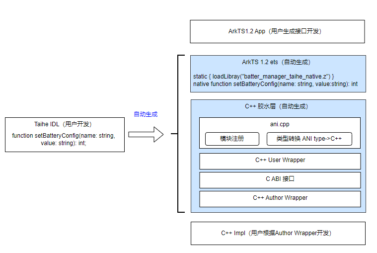

# Node-API到Taihe迁移指南

了解 Taihe 工具的基本概念后，本文将通过实际案例代码，介绍如何将现有 Node-API 模块迁移至 Taihe ANI 模块。
首先，介绍 Taihe IDL 工具自动生成代码的结构，帮助开发者更好地理解从 Node-API 迁移到 Taihe IDL 的基本流程。
本文将从初学者视角出发，说明如何识别接口并使用 Taihe IDL 进行描述。
如果您熟悉ArkTS 1.0工程结构及Node-API模块的封装方式，可跳过第一章内容。

## 第一章，识别Node-API模块接口

### 1. 查找模块注册信息
每个 Native 模块都需要在初始化阶段完成注册。模块注册信息通常定义在同一 C++ 文件中，通过napi_module结构体进行描述，并调用napi_module_register 函数完成注册。

以下示例代码注册了一个名为 queue_work 的 Node-API 模块，其初始化函数为 Init：
```cpp
// 示例注册代码
napi_module queue_work_module = {
    NM_VERSION,
    NAAPI_MODULE_FLAGS,
    __FILE__,
    Init,
    "queue_work",
    NULL,
    {0},
};
napi_module_register(&queue_work_module);
```
在实际工程中，可通过在 entry/src/main/cpp/ 目录下搜索 napi_module_register 来定位对应的 C++ 源文件。

### 2. 查找模块初始化函数
通常情况下，Node-API 模块的初始化函数（通常命名为 `Init`）与模块注册代码位于同一文件中。该函数中使用 `napi_define_properties` 等方法定义模块的属性和接口。

常见的初始化行为包括：
* 使用 napi_create_object 创建对象，并通过 napi_set_named_property 设置属性；

* 通过 napi_define_class 定义类，再使用 napi_create_object 创建实例对象。
具体代码示例请参考[Node-API到ANI迁移指南](./napi2ani_guide.md)。

### 3. 根据初始化函数推导接口声明
如果 Native 模块提供了对应的 .d.ts 类型声明文件，可以直接参考其中定义的接口，无需手动推导。如果没有类型声明文件，则需要基于初始化代码中的接口注册逻辑推断接口结构。

### 4. 通过函数实现推导接口原型
Node-API 函数的参数通过 napi_callback_info 参数获取，基本形式如下：
```cpp
napi_value ExampleFunction(napi_env env, napi_callback_info info) {
    // 1. 参数数量
    size_t argc = 2;

    // 2. 参数获取和类型检查
    napi_value args[argc];
    napi_get_cb_info(env, info, &argc, args, nullptr, nullptr);

    // ...
}
```
**参数数量推断：**
可通过 argc 获取参数个数。需注意某些情况下实际传入参数数量可能动态变化，此时应结合具体参数使用逻辑进行推断。
```cpp
// 示例1：两个参数的函数
static napi_value Add(napi_env env, napi_callback_info info) {
    size_t argc = 2;  // 👈 ArkTS侧有2个参数
    napi_value args[2] = {nullptr};
    // ArkTS原型：(param1: type, param2: type) => returnType
}

// 示例2：可变参数函数
static napi_value ProcessData(napi_env env, napi_callback_info info) {
    size_t argc = 0;
    napi_get_cb_info(env, info, &argc, nullptr, nullptr, nullptr);  // 👈 先获取实际参数个数
    napi_value* args = new napi_value[argc];
    // ArkTS原型：(...args: any[]) => returnType
}
```
如在示例2中，这个参数个数是实际获取的，这种情况下就需要根据实际的逻辑来进行推断。

**参数类型推断：**
若代码中对输入参数进行了严格类型检查（如使用 napi_get_value_xxx 系列函数），可推断参数类型。例如，使用 napi_get_value_int32 获取第二个参数，可判断其为 int 类型。
```cpp
int32_t age;
napi_get_value_int32(env, args[1], &age);
```
如果代码中直接对参数进行类型强制转换（例如转换为 string 或 int32），则可以推断参数的原始类型。
```cpp
// 检查第一个参数是否为number类型
napi_valuetype type0;
napi_typeof(env, args[0], &type0);
if (type0 != napi_number) {
    // 错误处理
}
```

**返回值类型推断：**
根据函数中 return 语句返回的 napi_value 类型对象，可以推断该函数的返回值类型。例如，若返回值是通过 napi_create_double 创建的，则返回类型为 number。
下面是一些代码片段例子，根据result变量的类型来判断：
```cpp
    // 返回类型分析
    napi_value result;

    // 情况1：返回字符串
    napi_create_string_utf8(env, "result", NAPI_AUTO_LENGTH, &result);
    return result;  // 返回 string

    // 情况2：返回数字
    napi_create_int32(env, 42, &result);
    return result;  // 返回 number

    // 情况3：返回对象
    napi_create_object(env, &result);
    // 设置对象属性...
    return result;  // 返回 object

    // 情况4：返回Promise（异步）
    napi_deferred deferred;
    napi_create_promise(env, &deferred, &result);
    return result;  // 返回 Promise<T>

```

下面是Node-API到ArkTS类型常用推断对照表

| 检查项 | 代码特征 | ArkTS 类型推断 |
|--------|----------|----------------|
| **参数个数** | `size_t argc = N` | `N` 个参数 |
| **字符串参数** | `napi_get_value_string_utf8()` | `string` |
| **数字参数** | `napi_get_value_int32()` / `napi_get_value_double()` | `number` |
| **布尔参数** | `napi_get_value_bool()` | `boolean` |
| **对象参数** | `napi_typeof() == napi_object` | `object` 或具体接口类型 |
| **函数参数** | `napi_typeof() == napi_function` | `Function` 或回调类型 |
| **数组参数** | `napi_is_array()` | `Array<T>` |
| **Promise 返回** | `napi_create_promise()` | `Promise<T>` |
| **同步返回** | 直接使用 `napi_create_*()` 系列函数 | 对应的基础类型 |

## 第二章 迁移接口到Taihe ANI
Taihe工具根据接口IDL描述自动生成胶水代码。在开始迁移前，了解自动生成代码的分层结构，有助于理解后续操作。
### Taihe生成接口架构分层结构

1. ArkTS-Sta App：使用接口的应用。
2. ArkTS-Sta ets：根据IDL文件生成的ArkTS-Sta代码，定义了各种接口。
3. ANI层：ets中native方法的实现层，同时将ANI类型转换为更易使用的C++数据。
4. C++ User Wrapper：ANI与C ABI接口的转换层，将ANI中的C++数据结构转换成C ABI接口类型，是ABI接口的消费者。
5. C ABI接口层：Taihe接口的C接口，通过这层接口来保证接口的二进制兼容性。
6. C++ Author wrapper：从C ABI对接到接口实现，将C数据结构转换层相应的C++数据结构，方便接口实现者使用。

### 一个Taihe function的例子
下面通过一个Taihe中最简单的function接口来介绍生成代码的结构。

**接口定义(ohos.batterInfo.d.ets)**
此接口仅存在于ArkTS-Sta中。
```ts
declare namespace batteryInfo {
    function setBatteryConfig(sceneName: string, sceneValue: string): int;
}
```

**Taihe IDL定义(ohos.batteryInfo.ohidl)**
在IDL文件中书写IDL声明
```
@！namespace("@ohos.batteryInfo", "batteryInfo")

// 加载这些ets对应的so
@!sts_inject("""
static {
    loadLibrary("battery_manager_taihe_native.z");
}
""")

function setBatteryConfig(sceneName: String, sceneValue: String): i32;
```
**Taihe生成的代码结构**
1. Taihe生成的ets文件（generated/@ohos.batteryInfo.ets）

按照ArkTS-Sta规则，任何类型需在上层定义，因此Taihe会生成IDL接口的类型声明与定义。
```ts
static {
    loadLibrary("battery_manager_taihe_native.z");
}
export native function _taihe_SetBatteryConfig_native(sceneName: string, sceneValue: string): int;

export function setBatteryConfig(sceneName: string, sceneValue: string): int{
    return _taihe_SetBatteryConfig_native(sceneName, sceneValue);
}
```

2. Taihe生成的ANI胶水代码（generated/{module}/ohos.batterInfo.ani.cpp）
  * 将生成的方法绑定代码添加到开发者自定义的ANI_Constructor初始化函数中。
  * 生成的ANI胶水代码将上层传入的ANI类型转换为C++对象。
```cpp
static ani_int SetBatteryConfig([[maybe_unused]] ani_env *env, 
                               ani_string ani_arg_sceneName, 
                               ani_string ani_arg_sceneValue_len) {
    // 1. 第一个参数处理
    // 获取字符串长度
    env->String_GetUTF8Size(ani_arg_sceneName, &cpp_arg_sceneName_len);
    // 初始化字符串缓冲区
    TString cpp_arg_sceneName_tstr;
    char* cpp_arg_sceneName_buf = tstr_initialize(&cpp_arg_sceneName_tstr, cpp_arg_sceneName_len + 1);
    // 将ANI字符串转换为C字符串
    env->String_GetUTF8(ani_arg_sceneName, cpp_arg_sceneName_buf, cpp_arg_sceneName_len + 1, &cpp_arg_sceneName_len);
    // 确保字符串正确终止
    cpp_arg_sceneName_buf[cpp_arg_sceneName_len] = '\0';
    cpp_arg_sceneName_tstr.length = cpp_arg_sceneName_len;
    // 转换为taihe::string类型
    ::taihe::string cpp_arg_sceneName = ::taihe::string(cpp_arg_sceneName_tstr);


    // 2. 同样的步骤处理第二个参数
    env->String_GetUTF8Size(ani_arg_sceneValue, &cpp_arg_sceneValue_len);
    // ...（省略重复代码）
    ::taihe::string cpp_arg_sceneValue = ::taihe::string(cpp_arg_sceneValue_tstr);

    // 3. 调用C++ User Wraper层业务接口
    int32_t cpp_result = ::obos::batteryInfo::SetBatteryConfig(cpp_arg_sceneName, cpp_arg_sceneValue);
}
```

3. Taihe C++ User Wrapper（generated/{module}/ohos.batteryInfo.user.hpp）
此层简单理解就是C++对接C ABI的桥接。
```cpp
inline int32_t SetBatteryConfig(::taihe::string_view sceneName, ::taihe::string_view sceneValue) {
  return ::taihe::from_abi<int32_t>(ohos_batteryInfo_SetBatteryConfig_f(::taihe::into_abi<::taihe::string_view>(sceneName), ::taihe::into_abi<::taihe::string_view>(sceneValue)));
}

```

4. C ABI层

接口对应的C的ABI层，通过这个C ABI，Taihe可以很容易在多种语言间相互转换。
```cpp
int32_t ohos_batteryInfo_SetBatteryConfig_f(struct TString scenceName, struct TString sceneValue)
```

5. Taihe C++ Author Wrapper（generated/{module}/ohos.batteryinfo.impl.hpp）

Taihe 会自动生成宏，将接口实现与 ABI 对应起来。这部分称为作者封装层。
```cpp
#define TH_EXPORT_CPP_API_SetBatteryConfig(CPP_FUNC_IMPL) \
    int32_t ohos_batteryInfo_SetBatteryConfig_f(struct TString sceneName, struct TString sceneValue) { \
        return ::taihe::into_abi<int32_t>(CPP_FUNC_IMPL(::taihe::from_abi<::taihe::string_view>(sceneName), ::taihe::from_abi<::taihe::string_view>(sceneValue))); \
    }
```

`CPP_FUNC_IMPL` 是开发者在实现层实现的具体函数。下面是一个默认生成的实现模板，供填写内部实现。
```cpp
int32_t SetBatteryConfig(::taihe::string_view sceneName, ::taihe::string_view sceneValue) {
    TH_THROW(std::runtime_error, "SetBatteryConfig not implemented");
}

TH_EXPORT_CPP_API_SetBatteryConfig(SetBatteryConfig);
```

### 一个更复杂的例子
下面是一个更加复杂的例子，请参考[深入解析Taihe生成代码](../../taihe/taihe-generated-code-ani.md)。

