# 使用DevTools进行网页内存分析
<!--Kit: NDK Development-->
<!--Subsystem: arkcompiler-->
<!--Owner: @yuanjiahao-->
<!--Designer: @xiexuhui-->
<!--Tester: @test_lzz-->
<!--Adviser: @fang-jinxu-->
## 获取js堆内存快照
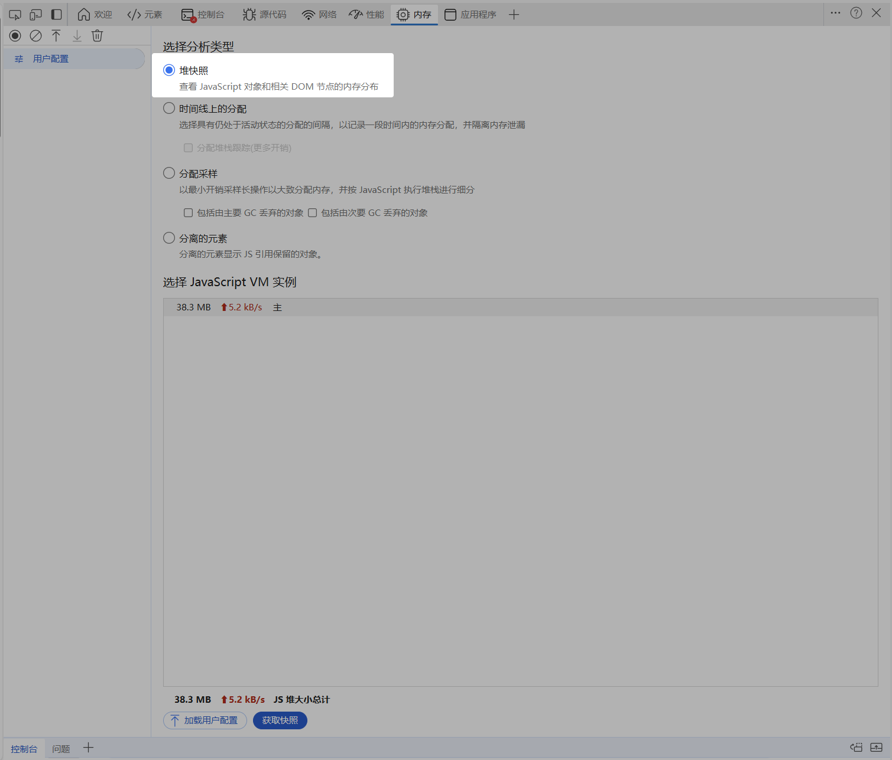
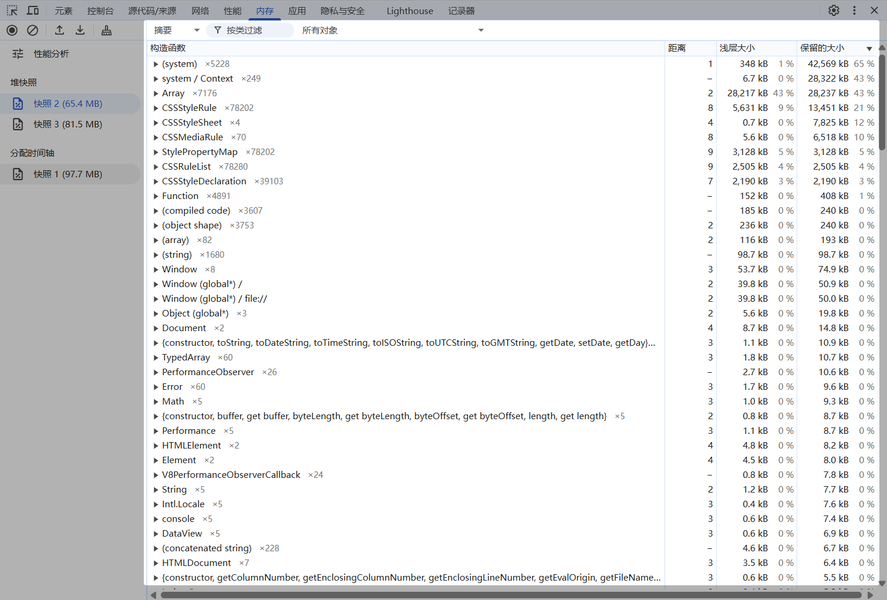

## 堆快照分析
### 摘要(Summary)
摘要展示当前内存快照的概览。其中：
- 构造函数(Constructor):表示对象的构造器
- 距离(Distance):与GCroot的引用链距离。当出现同一类对象距离不同的情况，要注意代码逻辑可能出现问题。
- 对象计数(Object Count)：跟在构造器后方的灰色数字，表示当前构造器所构造的对象总数。
- 浅层大小(Shallow Size)：对象自身占用的内存大小。
- 保留大小(Retained Size)：释放掉该对象后，能释放掉的内存大小，具体来说，其值为在对象本身和删除对象本身后无法从GC root访问的依赖对象的所占用的内存大小之和。

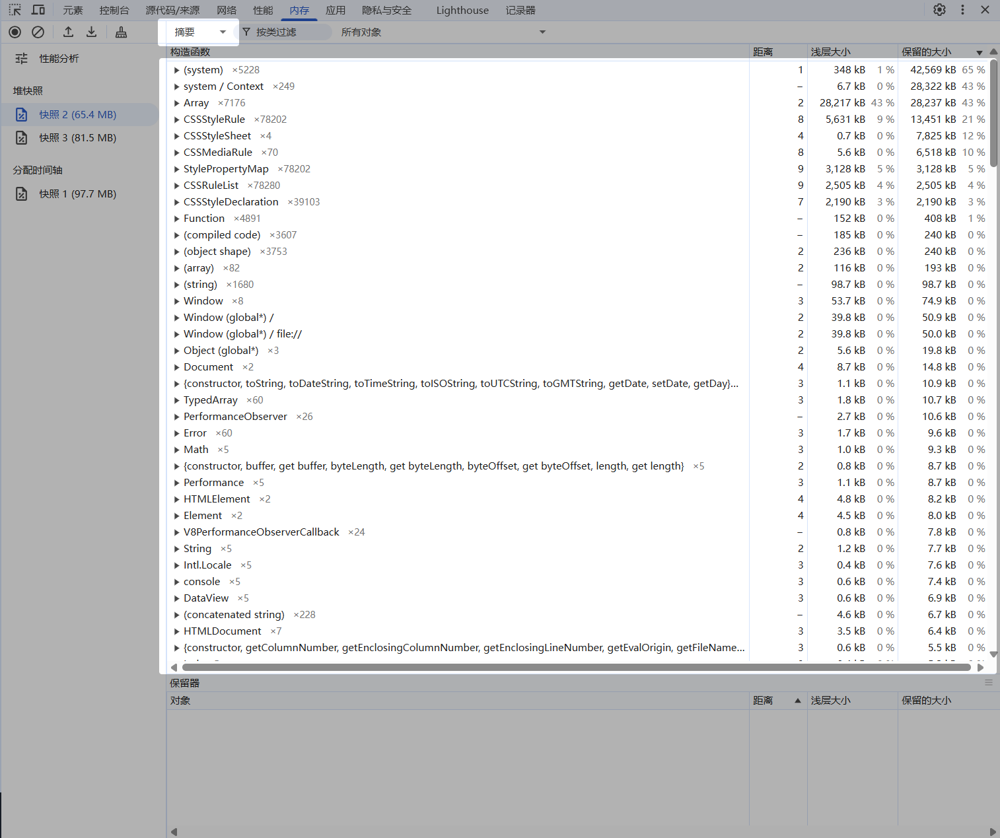

在摘要界面的右侧有一个选择栏，用户可以选择查看特定的对象，例如下图中选择“在快照2和快照3之间分配的对象”，这样生成的摘要可以用于定位内存问题发生的位置。
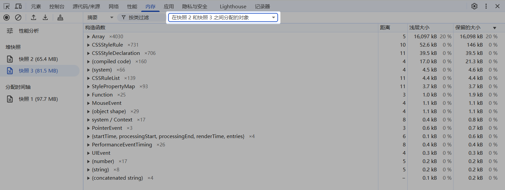

### 比较(Comparison)
在比较(Comparison)中可以将当前快照与另一个快照比较，跟踪对象属性和内存占用的变化。其中：
- 构造函数：对象的构造器。
- 新对象数(New)：该对象构造器下有多少新的对象被创建。
- 已销毁(Deleted)：该对象构造器下有多少新对象被销毁。
- 增量(Delta)：新对象与被删除对象的差值。
- 分配大小(Alloc Size)：两份快照间分配的内存大小。
- 已释放大小(Freed Size)：两份快照间释放的内存大小。
- 大小增量(Size Delta)：分配大小和已释放大小的差值。

可以根据比较界面不同快照间的差异分析内存问题。
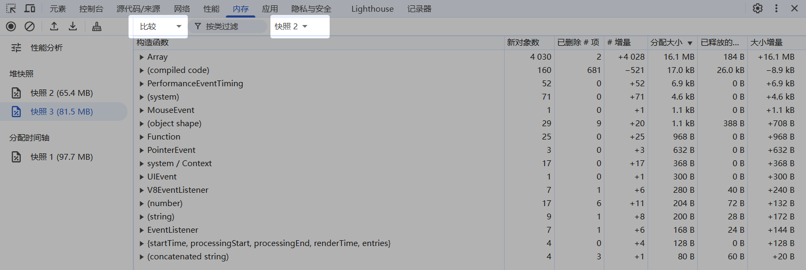

### 控制(Containment)
 控制(Containment)提供了一个自上而下的树形界面，该界面允许浏览和探索堆内存中的内容。我们可以用它来分析全部变量的引用情况(如Window)
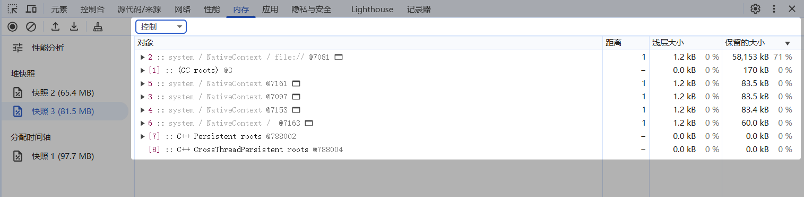

### 统计信息(Statistics)
统计信息(Statistics)用一个饼图展示各个类型对象的内存占用比例。
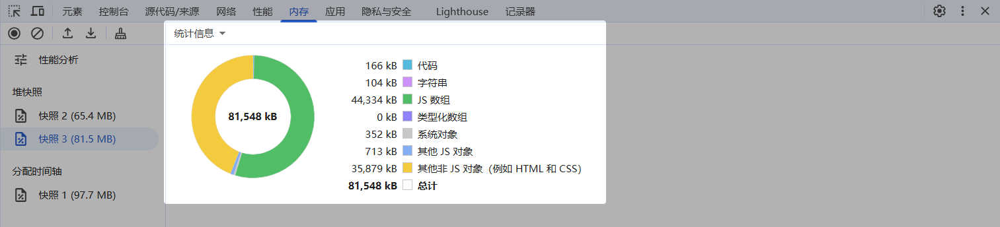

## 内存泄漏分析流程
1. 打开一个可能存在内存泄漏问题的页面并启用DevTools。下图展示的页面来自GitHub上的memory-leak-simulation项目，该网页通过设置全局数组并不断向其推入'memory leak'字符串来模拟内存泄漏场景。
   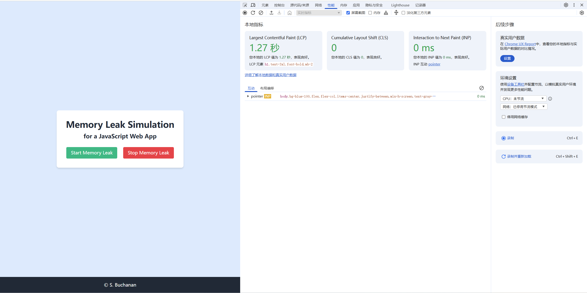

2. 在性能界面录制可能导致内存泄漏的用户操作，以识别引起内存泄漏的用户操作或组件。下图显示，网页已加载完毕，但内存仍在持续上升，表明可能存在内存泄漏问题。对于包含大量动态组件和频繁DOM操作的网页，内存曲线可能呈起伏状态。持续观察内存起伏的最低值变化，若最低值逐渐上升，怀疑网页存在内存泄漏问题。
   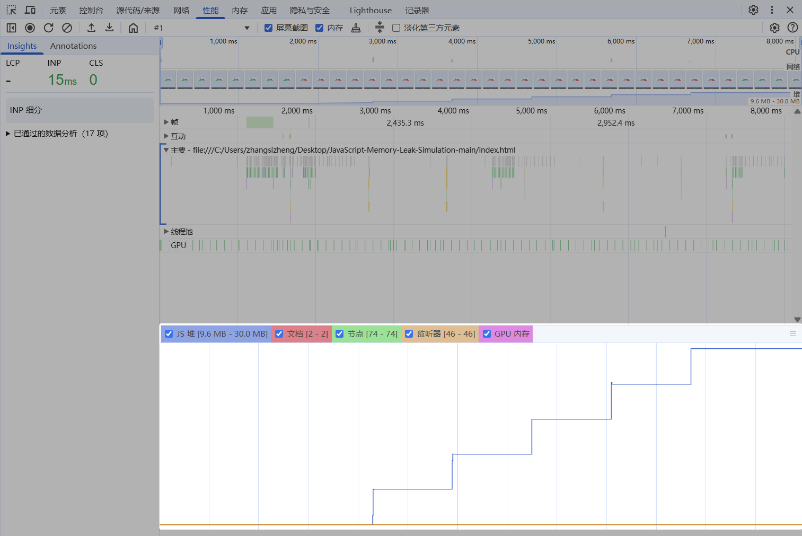

3. 我们对这个网页进行第一次堆快照，发现Array占用了28M内存，基于该对象的内存占用显著高于正常值(通常在几MB范围内)，可以判断该对象可能存在内存泄漏问题。
   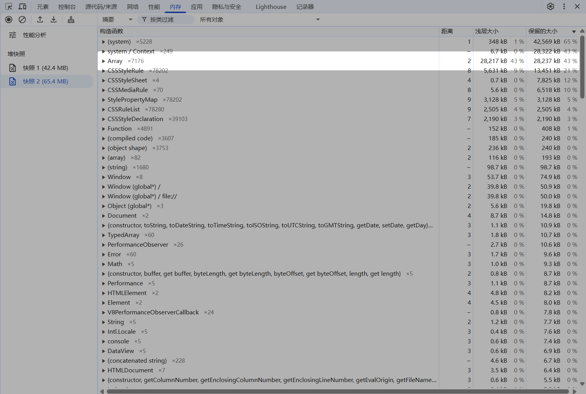

4. 对网页进行可能会造成内存泄漏的操作，操作完成后进行第二次堆快照，然后选择两个快照间分配的对象，观察到Array构造器新产生约16MB内存占用。
   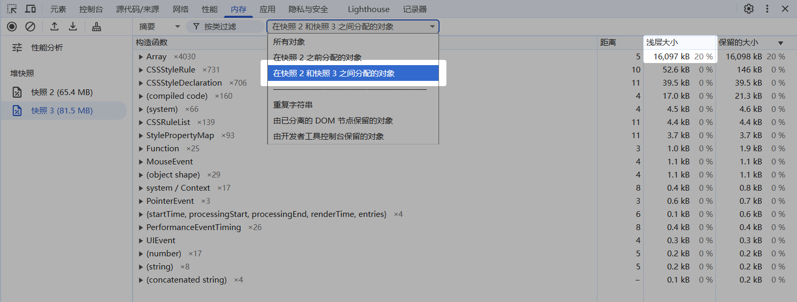

5. 查看**比较(comparison)**，选择快照3并使用快照2作为比较对象，观察到Array构造器新产生了4030个对象，占用了16.1MB空间，但只释放了184B空间，根据此结果，确定内存泄漏发生在Array中。
   

6. 录制1-2分钟的堆快照来获得包含时间轴的摘要视图，这与性能界面中的视图类似。使用此视图可以分析是哪个动作造成了内存占用的变化。录制快照时选择“时间轴上的分配情况”选项，点击录制。完成想要测试的动作后，停止录制即可生成内存堆时间轴视图。
   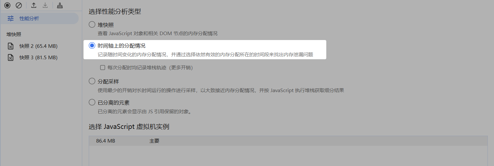

7. 在结果的时间轴上，使用左键滑动选择想要查看的区域，即可查看选定时间段内的内存分配情况。从下图中框选部分可以看到，在选定时间内，Array构造器产生了两千个新对象。利用该功能，可以明确不同操作对内存的影响。
   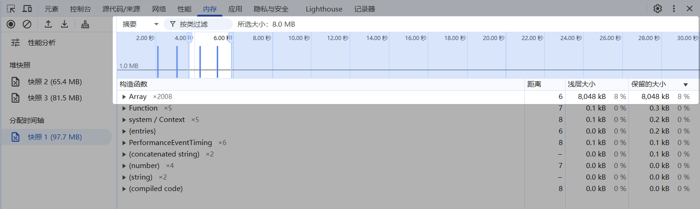
