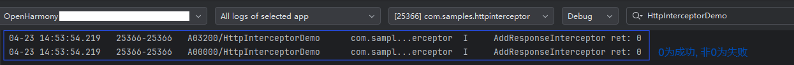
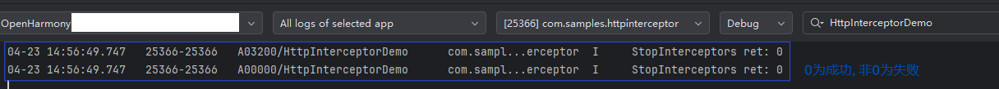
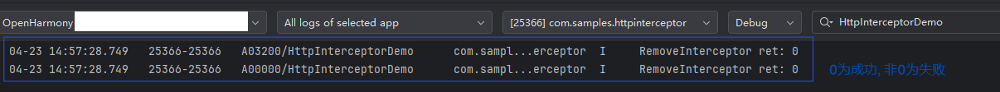

# 使用HTTP全局拦截器 (C/C++)
<!--Kit: Network Kit-->
<!--Subsystem: Communication-->
<!--Owner: @wmyao_mm-->
<!--Designer: @guo-min_net-->
<!--Tester: @tongxilin-->
<!--Adviser: @zhang_yixin13-->

## 场景介绍

从API version 24版本开始，通过HTTP全局拦截器，开发者可以监控HTTP流量，实现日志记录功能。

## 接口说明

HTTP全局拦截器常用接口如下表所示，详细的接口说明请参考[http_interceptor.h](../reference/apis-network-kit/capi-net-http-interceptor-h.md)。


| 接口名 | 描述 |
| -------- | -------- |
| OH_Http_AddReadOnlyInterceptor(struct OH_Http_Interceptor *interceptor) | 添加一个HTTP全局只读拦截器。 |
| OH_Http_RemoveInterceptor(struct OH_Http_Interceptor *interceptor) | 删除指定的HTTP全局拦截器。 |
| OH_Http_RemoveAllInterceptors(int32_t groupId) | 删除指定组ID的所有HTTP全局拦截器。 |
| OH_Http_StartAllInterceptors(int32_t groupId) | 启用指定组ID的所有HTTP全局拦截器。 |
| OH_Http_StopAllInterceptors(int32_t groupId) | 停用指定组ID的所有HTTP全局拦截器。 |

## 开发步骤

使用本文档涉及接口创建并使用HTTP全局拦截器时，需先创建Native C++工程，在源文件中封装相关接口，然后在ArkTS层调用封装好的接口，使用hilog或console.info等方法将日志打印到控制台或生成设备日志。

本文以添加HTTP全局只读响应拦截器、启用/停用拦截器、删除拦截器为例，提供具体的开发指导。

### 添加开发依赖

**添加动态链接库**

CMakeLists.txt中添加以下lib:

```txt
libace_napi.z.so
libhttp_interceptor.so
```
**头文件**

```c
#include "napi/native_api.h"
#include "network/netstack/http_interceptor.h"
#include "network/netstack/http_interceptor_type.h"
```
### 构建工程

1. 在源文件中编写调用该API的代码，实现HTTP全局拦截器的处理函数和相关操作。

   <!-- @[HttpInterceptor_build_project](https://gitcode.com/openharmony/applications_app_samples/blob/master/code/DocsSample/NetWork_Kit/NetWorkKit_Datatransmission/HTTP_interceptor_C/entry/src/main/cpp/napi_init.cpp) -->
   
   ``` C++
   #include "napi/native_api.h"
   #include "network/netstack/http_interceptor.h"
   #include "network/netstack/http_interceptor_type.h"
   #include "hilog/log.h"
   
   #include <cstring>
   
   #undef LOG_DOMAIN
   #undef LOG_TAG
   #define LOG_DOMAIN 0x3200 // 全局domain宏，标识业务领域
   #define LOG_TAG "HttpInterceptorDemo"  // 全局tag宏，标识模块日志tag
   
   // 全局拦截器实例
   static OH_Http_Interceptor g_responseInterceptor = {
       .groupId = 1,
       .stage = OH_STAGE_RESPONSE,
       .type = OH_TYPE_READ_ONLY,
       .enabled = 1,
       .handler = nullptr,
   };
   
   // 日志打印辅助函数
   void LogHeader(OH_Http_Interceptor_Headers *headers)
   {
       OH_LOG_INFO(LOG_APP, "---------------------header begin---------------------");
       while (headers != nullptr) {
           if (headers->data != nullptr) {
               OH_LOG_INFO(LOG_APP, "%{public}s", headers->data);
           }
           headers = headers->next;
       }
       OH_LOG_INFO(LOG_APP, "---------------------header end---------------------");
   }
   
   // 打印响应信息
   void PrintResponseInfo(OH_Http_Interceptor_Response *response)
   {
       OH_LOG_INFO(LOG_APP, "-----PrintResponseInfo Begin-----");
       if (response != nullptr) {
           OH_LOG_INFO(LOG_APP, "responseCode = %{public}d", response->responseCode);
           if (response->body.buffer != nullptr) {
               OH_LOG_INFO(LOG_APP, "body = %{public}s", response->body.buffer);
           }
           if (response->headers != nullptr) {
               LogHeader(response->headers);
           }
   
           OH_LOG_INFO(LOG_APP, "dns: %{public}lf", response->performanceTiming.dnsTiming);
           OH_LOG_INFO(LOG_APP, "tcp: %{public}lf", response->performanceTiming.tcpTiming);
           OH_LOG_INFO(LOG_APP, "tls: %{public}lf", response->performanceTiming.tlsTiming);
           OH_LOG_INFO(LOG_APP, "snd: %{public}lf", response->performanceTiming.firstSendTiming);
           OH_LOG_INFO(LOG_APP, "rcv: %{public}lf", response->performanceTiming.firstReceiveTiming);
           OH_LOG_INFO(LOG_APP, "tot: %{public}lf", response->performanceTiming.totalFinishTiming);
           OH_LOG_INFO(LOG_APP, "rdr: %{public}lf", response->performanceTiming.redirectTiming);
           OH_LOG_INFO(LOG_APP, "-----PrintResponseInfo End-----");
       }
   }
   
   // 响应拦截器处理函数
   OH_Interceptor_Result ResponseInterceptorHandler(
       OH_Http_Interceptor_Request *request,
       OH_Http_Interceptor_Response *response,
       int32_t *isModified)
   {
       (void)request;
       (void)isModified;
       
       if (response != nullptr) {
           OH_LOG_INFO(LOG_APP, "---Response Interceptor Handler---");
           PrintResponseInfo(response);
       }
       return OH_CONTINUE;
   }
   
   // 添加只读响应拦截器
   static napi_value AddResponseInterceptor(napi_env env, napi_callback_info info)
   {
       napi_value result;
       
       // 设置拦截器处理函数
       g_responseInterceptor.handler = ResponseInterceptorHandler;
       
       // 添加拦截器
       int ret = OH_Http_AddReadOnlyInterceptor(&g_responseInterceptor);
       
       OH_LOG_INFO(LOG_APP, "AddResponseInterceptor ret: %{public}d", ret);
       napi_create_int32(env, ret, &result);
       return result;
   }
   
   // 移除拦截器
   static napi_value RemoveInterceptor(napi_env env, napi_callback_info info)
   {
       napi_value result;
       
       // 移除拦截器
       int ret = OH_Http_RemoveInterceptor(&g_responseInterceptor);
       
       OH_LOG_INFO(LOG_APP, "RemoveInterceptor ret: %{public}d", ret);
       napi_create_int32(env, ret, &result);
       return result;
   }
   
   // 启用指定组的所有拦截器
   static napi_value StartInterceptors(napi_env env, napi_callback_info info)
   {
       napi_value result;
       
       // 启用组ID为1的所有拦截器
       int ret = OH_Http_StartAllInterceptors(1);
       
       OH_LOG_INFO(LOG_APP, "StartInterceptors ret: %{public}d", ret);
       napi_create_int32(env, ret, &result);
       return result;
   }
   
   // 停用指定组的所有拦截器
   static napi_value StopInterceptors(napi_env env, napi_callback_info info)
   {
       napi_value result;
       
       // 停用组ID为1的所有拦截器
       int ret = OH_Http_StopAllInterceptors(1);
       
       OH_LOG_INFO(LOG_APP, "StopInterceptors ret: %{public}d", ret);
       napi_create_int32(env, ret, &result);
       return result;
   }
   
   // 删除指定组的所有拦截器
   static napi_value RemoveAllInterceptors(napi_env env, napi_callback_info info)
   {
       napi_value result;
       
       // 删除组ID为1的所有拦截器
       int ret = OH_Http_RemoveAllInterceptors(1);
       
       OH_LOG_INFO(LOG_APP, "RemoveAllInterceptors ret: %{public}d", ret);
       napi_create_int32(env, ret, &result);
       return result;
   }
   ```
   
   上述代码实现了一个HTTP全局只读响应拦截器，用于监控HTTP响应。在响应拦截器处理函数中，会打印响应的状态码、响应体、响应头以及性能指标等信息。

2. 初始化并导出通过N-API封装的`napi_value`类型对象，通过外部函数接口将函数提供给JavaScript调用。

   <!-- @[HttpInterceptor_extern_c](https://gitcode.com/openharmony/applications_app_samples/blob/master/code/DocsSample/NetWork_Kit/NetWorkKit_Datatransmission/HTTP_interceptor_C/entry/src/main/cpp/napi_init.cpp) -->
   
   ``` C++
   EXTERN_C_START
   static napi_value Init(napi_env env, napi_value exports)
   {
       napi_property_descriptor desc[] = {
           {"AddResponseInterceptor", nullptr, AddResponseInterceptor, nullptr, nullptr, nullptr, napi_default, nullptr},
           {"RemoveInterceptor", nullptr, RemoveInterceptor, nullptr, nullptr, nullptr, napi_default, nullptr},
           {"StartInterceptors", nullptr, StartInterceptors, nullptr, nullptr, nullptr, napi_default, nullptr},
           {"StopInterceptors", nullptr, StopInterceptors, nullptr, nullptr, nullptr, napi_default, nullptr},
           {"RemoveAllInterceptors", nullptr, RemoveAllInterceptors, nullptr, nullptr, nullptr, napi_default, nullptr},
       };
       napi_define_properties(env, exports, sizeof(desc) / sizeof(desc[0]), desc);
       return exports;
   }
   EXTERN_C_END
   ```

3. 将上一步中初始化成功的对象通过`RegisterEntryModule`函数，使用`napi_module_register`函数将模块注册到Node.js中。

   <!-- @[HttpInterceptor_napi_module](https://gitcode.com/openharmony/applications_app_samples/blob/master/code/DocsSample/NetWork_Kit/NetWorkKit_Datatransmission/HTTP_interceptor_C/entry/src/main/cpp/napi_init.cpp) -->
   
   ``` C++
   static napi_module demoModule = {
       .nm_version = 1,
       .nm_flags = 0,
       .nm_filename = nullptr,
       .nm_register_func = Init,
       .nm_modname = "entry",
       .nm_priv = ((void *)0),
       .reserved = {0},
   };
   
   extern "C" __attribute__((constructor)) void RegisterEntryModule(void)
   {
       napi_module_register(&demoModule);
   }
   ```

4. 在工程的Index.d.ts文件中定义函数的类型。

   <!-- @[HttpInterceptor_defining_function_types](https://gitcode.com/openharmony/applications_app_samples/blob/master/code/DocsSample/NetWork_Kit/NetWorkKit_Datatransmission/HTTP_interceptor_C/entry/src/main/cpp/types/libentry/Index.d.ts) -->
   
   ``` TypeScript
   export const AddResponseInterceptor: () => number;
   export const RemoveInterceptor: () => number;
   export const StartInterceptors: () => number;
   export const StopInterceptors: () => number;
   export const RemoveAllInterceptors: () => number;
   ```

5. 在Index.ets文件中对上述封装好的接口进行调用。

   <!-- @[HttpInterceptor_C_full_example](https://gitcode.com/openharmony/applications_app_samples/blob/master/code/DocsSample/NetWork_Kit/NetWorkKit_Datatransmission/HTTP_interceptor_C/entry/src/main/ets/pages/Index.ets) -->
   
   ``` TypeScript
   import { hilog } from '@kit.PerformanceAnalysisKit';
   import httpInterceptor from 'libentry.so';
   import { http } from '@kit.NetworkKit';
   
   const LOG_TAG: string = 'HttpInterceptorDemo';
   const HTTP_URL_BAIDU: string = "http://www.baidu.com";
   
   @Entry
   @Component
   struct Index {
     @State message: string = 'HTTP Interceptor Demo';
   
     build() {
       Navigation() {
         Column() {
           Text(this.message)
             .fontSize(20)
             .margin({ bottom: 20 })
   
           Column({
             space: 12
           }) {
             Button('Add Response Interceptor')
               .id('AddInterceptor')
               .onClick(() => {
                 let ret = httpInterceptor.AddResponseInterceptor();
                 hilog.info(0x0000, LOG_TAG, `AddResponseInterceptor ret: ${ret}`);
               })
   
             Button('Start Interceptors')
               .id('StartInterceptors')
               .onClick(() => {
                 let ret = httpInterceptor.StartInterceptors();
                 hilog.info(0x0000, LOG_TAG, `StartInterceptors ret: ${ret}`);
               })
   
             Button('Send HTTP Request')
               .id('networkRequest')
               .onClick(() => {
                 let httpRequest: http.HttpRequest = http.createHttp();
                 let options: http.HttpRequestOptions = {
                   method: http.RequestMethod.POST,
                 };
                 httpRequest.request(HTTP_URL_BAIDU, options, (err: BusinessError, res: http.HttpResponse) => {
                   if (err) {
                     hilog.info(0x0000, LOG_TAG, `request fail, error code: ${err.code}, msg: ${err.message}`);
                     httpRequest.destroy();
                   } else {
                     hilog.info(0x0000, LOG_TAG, `res:${JSON.stringify(res)}`);
                     httpRequest.destroy();
                   }
                 });
               })
   
             Button('Stop Interceptors')
               .id('StopInterceptors')
               .onClick(() => {
                 let ret = httpInterceptor.StopInterceptors();
                 hilog.info(0x0000, LOG_TAG, `StopInterceptors ret: ${ret}`);
               })
   
             Button('Remove Interceptor')
               .id('RemoveInterceptor')
               .onClick(() => {
                 let ret = httpInterceptor.RemoveInterceptor();
                 hilog.info(0x0000, LOG_TAG, `RemoveInterceptor ret: ${ret}`);
               })
   
             Button('Remove All Interceptors')
               .id('RemoveAllInterceptors')
               .onClick(() => {
                 let ret = httpInterceptor.RemoveAllInterceptors();
                 hilog.info(0x0000, LOG_TAG, `RemoveAllInterceptors ret: ${ret}`);
               })
           }
         }
         .padding(20)
       }
     }
   }
   ```

6. 配置`CMakeLists.txt`，本模块需要用到的共享库是`libhttp_interceptor.so`，在工程自动生成的`CMakeLists.txt`中的`target_link_libraries`中添加此共享库。

   注意：如图所示，在`add_library`中的`entry`是工程自动生成的`module name`，若要做修改，需和步骤 3 中`.nm_modname`保持一致。

   

7. 调用HTTP全局拦截器C API接口要求应用拥有`ohos.permission.INTERNET`权限，在`module.json5`中的`requestPermissions`项添加该权限。

完成上述步骤后，工程搭建已全部完成，后续可连接设备运行工程并查看日志。

## 测试步骤

1. 连接设备，使用DevEco Studio打开搭建好的工程。

2. 运行工程，设备上会弹出以下图片所示界面。


   - 点击`Add Response Interceptor`按钮，添加一个HTTP全局只读响应拦截器。



   - 点击`Start Interceptors`按钮，启用组ID为1的所有拦截器。


   - 点击`Send HTTP Request`按钮，拦截器会捕获响应并打印相关信息到日志。


   - 点击`Stop Interceptors`按钮，停用组ID为1的所有拦截器。



   - 点击`Remove Interceptor`按钮，移除之前添加的拦截器。



   - 点击`Remove All Interceptors`按钮，删除组ID为1的所有拦截器。


## 相关实例

针对HTTP全局拦截器的开发，有以下相关实例可供参考：

- [HTTP全局拦截器（C/C++）](https://gitcode.com/openharmony/applications_app_samples/tree/master/code/DocsSample/NetWork_Kit/NetWorkKit_Datatransmission/HTTP_interceptor_C)