# 使用HTTP全局拦截器 (C/C++)
<!--Kit: Network Kit-->
<!--Subsystem: Communication-->
<!--Owner: @wmyao_mm-->
<!--Designer: @guo-min_net-->
<!--Tester: @tongxilin-->
<!--Adviser: @zhang_yixin13-->

## 场景介绍

从API version 24开始，通过HTTP全局拦截器（包含只读拦截器和可修改拦截器），开发者可以在只读拦截器中监控HTTP流量，实现日志记录功能，也可以在可修改拦截器中添加自定义逻辑，实现修改请求头、修改响应头、修改响应体等功能。

## 接口说明

HTTP全局拦截器常用接口如下表所示，详细的接口说明请参考[http_interceptor.h](../reference/apis-network-kit/capi-net-http-interceptor-h.md)。


| 接口名 | 描述 |
| -------- | -------- |
| OH_Http_AddReadOnlyInterceptor(struct OH_Http_Interceptor *interceptor) | 添加一个HTTP全局只读拦截器。 |
| OH_Http_AddWritableInterceptor(struct OH_Http_Interceptor *interceptor) | 添加一个HTTP全局可修改拦截器。 |
| OH_Http_RemoveInterceptor(struct OH_Http_Interceptor *interceptor) | 删除指定的HTTP全局拦截器。 |
| OH_Http_RemoveAllInterceptors(int32_t groupId) | 删除指定组ID的所有HTTP全局拦截器。 |
| OH_Http_StartAllInterceptors(int32_t groupId) | 启用指定组ID的所有HTTP全局拦截器。 |
| OH_Http_StopAllInterceptors(int32_t groupId) | 停用指定组ID的所有HTTP全局拦截器。 |

## 开发步骤

使用本文档涉及接口创建并使用HTTP全局拦截器时，需先创建Native C++工程，在源文件中封装相关接口，然后在ArkTS层调用封装好的接口，使用hilog或console.info等方法将日志打印到控制台或生成设备日志。

本文以添加HTTP全局只读响应拦截器、可修改请求拦截器、可修改响应拦截器为例，提供具体的开发指导。

### 添加开发依赖

**添加动态链接库**

CMakeLists.txt中添加以下lib:

```txt
libace_napi.z.so
libhttp_interceptor.so
```
**头文件**

```c
#include "napi/native_api.h"
#include "network/netstack/http_interceptor.h"
#include "network/netstack/http_interceptor_type.h"
```
### 构建工程

1. 在源文件中编写调用该API的代码，实现HTTP全局拦截器的处理函数和相关操作。

   <!-- @[HttpInterceptor_build_project](https://gitcode.com/openharmony/applications_app_samples/blob/master/code/DocsSample/NetWork_Kit/NetWorkKit_Datatransmission/HTTP_interceptor_C/entry/src/main/cpp/napi_init.cpp) -->
   
   ``` C++
   #include "napi/native_api.h"
   #include "network/netstack/http_interceptor.h"
   #include "network/netstack/http_interceptor_type.h"
   #include "hilog/log.h"
   
   #include <cstring>
   #include <cstdlib>
   #include <string>
   
   #undef LOG_DOMAIN
   #undef LOG_TAG
   #define LOG_DOMAIN 0x3200 // 全局domain宏，标识业务领域
   #define LOG_TAG "HttpInterceptorDemo"  // 全局tag宏，标识模块日志tag
   
   // 全局只读响应拦截器实例
   static OH_Http_Interceptor g_readOnlyResponseInterceptor = {
       .groupId = 1,
       .stage = OH_STAGE_RESPONSE,
       .type = OH_TYPE_READ_ONLY,
       .enabled = 1,
       .handler = nullptr,
   };
   
   // 可修改请求拦截器实例（用于修改Network Kit的请求数据包）
   static OH_Http_Interceptor g_modifyRequestInterceptor = {
       .groupId = 2,
       .stage = OH_STAGE_REQUEST,
       .type = OH_TYPE_MODIFY_NETWORK_KIT,
       .enabled = 1,
       .handler = nullptr,
   };
   
   // 可修改响应拦截器实例（用于修改Network Kit的响应数据包）
   static OH_Http_Interceptor g_modifyResponseInterceptor = {
       .groupId = 3,
       .stage = OH_STAGE_RESPONSE,
       .type = OH_TYPE_MODIFY_NETWORK_KIT,
       .enabled = 1,
       .handler = nullptr,
   };
   
   // 内存分配和字符串拷贝辅助函数
   char *MallocCString(const std::string &origin)
   {
       if (origin.empty()) {
           return nullptr;
       }
   
       auto len = origin.length() + 1;
       char *res = static_cast<char *>(malloc(sizeof(char) * len));
       if (res == nullptr) {
           return nullptr;
       }
       return std::char_traits<char>::copy(res, origin.c_str(), len);
   }
   
   // 日志打印辅助函数
   void LogHeader(OH_Http_Interceptor_Headers *headers)
   {
       OH_LOG_INFO(LOG_APP, "---------------------header begin---------------------");
       while (headers != nullptr) {
           if (headers->data != nullptr) {
               OH_LOG_INFO(LOG_APP, "%{public}s", headers->data);
           }
           headers = headers->next;
       }
       OH_LOG_INFO(LOG_APP, "---------------------header end---------------------");
   }
   
   // 打印响应信息
   void PrintResponseInfo(OH_Http_Interceptor_Response *response)
   {
       OH_LOG_INFO(LOG_APP, "-----PrintResponseInfo Begin-----");
       if (response != nullptr) {
           OH_LOG_INFO(LOG_APP, "responseCode = %{public}d", response->responseCode);
           if (response->body.buffer != nullptr) {
               OH_LOG_INFO(LOG_APP, "body = %{public}s", response->body.buffer);
           }
           if (response->headers != nullptr) {
               LogHeader(response->headers);
           }
   
           OH_LOG_INFO(LOG_APP, "dns: %{public}lf", response->performanceTiming.dnsTiming);
           OH_LOG_INFO(LOG_APP, "tcp: %{public}lf", response->performanceTiming.tcpTiming);
           OH_LOG_INFO(LOG_APP, "tls: %{public}lf", response->performanceTiming.tlsTiming);
           OH_LOG_INFO(LOG_APP, "snd: %{public}lf", response->performanceTiming.firstSendTiming);
           OH_LOG_INFO(LOG_APP, "rcv: %{public}lf", response->performanceTiming.firstReceiveTiming);
           OH_LOG_INFO(LOG_APP, "tot: %{public}lf", response->performanceTiming.totalFinishTiming);
           OH_LOG_INFO(LOG_APP, "rdr: %{public}lf", response->performanceTiming.redirectTiming);
           OH_LOG_INFO(LOG_APP, "-----PrintResponseInfo End-----");
       }
   }
   
   // 只读响应拦截器处理函数
   OH_Interceptor_Result ReadOnlyResponseInterceptorHandler(
       OH_Http_Interceptor_Request *request,
       OH_Http_Interceptor_Response *response,
       int32_t *isModified)
   {
       (void)request;
       (void)isModified;
       
       if (response != nullptr) {
           OH_LOG_INFO(LOG_APP, "---ReadOnly Response Interceptor Handler---");
           PrintResponseInfo(response);
       }
       return OH_CONTINUE;
   }
   
   // 修改请求方法
   static void ModifyRequestMethod(OH_Http_Interceptor_Request *request)
   {
       if (request->method.buffer != nullptr) {
           // 释放原有内存，必须使用free释放由malloc分配的内存
           free((void *)request->method.buffer);
           
           // 重新申请内存并设置新值，必须使用malloc分配内存
           const std::string newMethodStr = "GET";
           char *newMethodBuffer = MallocCString(newMethodStr);
           if (newMethodBuffer != nullptr) {
               request->method.buffer = newMethodBuffer;
               request->method.length = newMethodStr.length();
               OH_LOG_INFO(LOG_APP, "Modified Method: %{public}s", request->method.buffer);
           }
       }
   }
   
   // 修改第一个header节点
   static void ModifyFirstHeaderNode(OH_Http_Interceptor_Headers **headers, const char *headerData)
   {
       size_t headerLen = strlen(headerData) + 1;
       
       if (*headers != nullptr) {
           // 修改第一个header节点
           if ((*headers)->data != nullptr) {
               // 释放原有内存，必须使用free释放由malloc分配的内存
               free((void *)(*headers)->data);
           }
           // 必须使用malloc分配内存
           const std::string headerDataStr = headerData;
           char *headerBuffer = MallocCString(headerDataStr);
           if (headerBuffer != nullptr) {
               (*headers)->data = headerBuffer;
               OH_LOG_INFO(LOG_APP, "Modified first header: %{public}s", headerData);
           }
       } else {
           // 若没有header节点，创建新的第一个节点
           // 创建新的header节点，必须使用malloc分配内存
           OH_Http_Interceptor_Headers *newHeader =
               (OH_Http_Interceptor_Headers *)malloc(sizeof(OH_Http_Interceptor_Headers));
           if (newHeader != nullptr) {
               // 必须使用malloc分配内存
               const std::string headerDataStr = headerData;
               char *headerBuffer = MallocCString(headerDataStr);
               if (headerBuffer != nullptr) {
                   newHeader->data = headerBuffer;
                   newHeader->next = nullptr;
                   *headers = newHeader;
                   OH_LOG_INFO(LOG_APP, "Created first header: %{public}s", headerData);
               } else {
                   // 内存分配失败，释放header节点，必须使用free释放由malloc分配的内存
                   free((void *)newHeader);
               }
           }
       }
   }
   
   // 修改body内容
   static void ModifyBodyContent(Http_Buffer *body, const char *newBodyContent)
   {
       // 释放原有body内存，必须使用free释放由malloc分配的内存
       if (body->buffer != nullptr) {
           free((void *)body->buffer);
       }
       
       // 重新申请内存并设置新的body内容，必须使用malloc分配内存
       const std::string bodyContentStr = newBodyContent;
       char *bodyBuffer = MallocCString(bodyContentStr);
       if (bodyBuffer != nullptr) {
           body->buffer = bodyBuffer;
           body->length = bodyContentStr.length();
           OH_LOG_INFO(LOG_APP, "Modified Body: %{public}s", body->buffer);
       }
   }
   
   // 可修改请求拦截器处理函数（修改Network Kit的请求数据包）
   OH_Interceptor_Result ModifyRequestInterceptorHandler(
       OH_Http_Interceptor_Request *request,
       OH_Http_Interceptor_Response *response,
       int32_t *isModified)
   {
       (void)response;
       
       if (request != nullptr) {
           OH_LOG_INFO(LOG_APP, "---Modify Interceptor Handler---");
           OH_LOG_INFO(LOG_APP, "Original URL: %{public}s", request->url.buffer);
           OH_LOG_INFO(LOG_APP, "Original Method: %{public}s", request->method.buffer);
           
           // 修改请求方法
           ModifyRequestMethod(request);
           
           // 修改第一个请求头
           const char *requestHeaderData = "X-Custom-Header: CustomValue";
           ModifyFirstHeaderNode(&request->headers, requestHeaderData);
           
           // 修改请求体
           const char *requestBodyData = "{\"key\": \"value\"}";
           ModifyBodyContent(&request->body, requestBodyData);
           
           // 标记为已修改
           *isModified = 1;
           OH_LOG_INFO(LOG_APP, "Request modified: %{public}d", *isModified);
       }
       
       // 返回OH_CONTINUE表示继续处理请求
       // 返回OH_ABORT表示中止请求，请求将不会发送到服务器
       return OH_CONTINUE;
   }
   
   // 可修改响应拦截器处理函数（修改Network Kit的响应数据包）
   OH_Interceptor_Result ModifyResponseInterceptorHandler(
       OH_Http_Interceptor_Request *request,
       OH_Http_Interceptor_Response *response,
       int32_t *isModified)
   {
       (void)request;
       
       if (response != nullptr) {
           OH_LOG_INFO(LOG_APP, "---Modify Response Interceptor Handler---");
           OH_LOG_INFO(LOG_APP, "Original Response Code: %{public}d", response->responseCode);
           if (response->body.buffer != nullptr) {
               OH_LOG_INFO(LOG_APP, "Original Response Body: %{public}s", response->body.buffer);
           }
           
           // 修改响应体
           const char *responseBodyData = "{\"modified\": true, \"message\": \"Response modified by interceptor\"}";
           ModifyBodyContent(&response->body, responseBodyData);
           
           // 修改第一个响应头
           const char *responseHeaderData = "X-Intercepted: true";
           ModifyFirstHeaderNode(&response->headers, responseHeaderData);
           
           // 标记为已修改
           *isModified = 1;
           OH_LOG_INFO(LOG_APP, "Response modified: %{public}d", *isModified);
       }
       
       // 返回OH_CONTINUE表示继续处理响应
       // 返回OH_ABORT表示终止当前拦截器链的执行
       return OH_CONTINUE;
   }
   
   // 添加只读响应拦截器
   static napi_value AddReadOnlyResponseInterceptor(napi_env env, napi_callback_info info)
   {
       napi_value result;
       
       // 设置拦截器处理函数
       g_readOnlyResponseInterceptor.handler = ReadOnlyResponseInterceptorHandler;
       
       // 添加拦截器
       int ret = OH_Http_AddReadOnlyInterceptor(&g_readOnlyResponseInterceptor);
       
       OH_LOG_INFO(LOG_APP, "AddReadOnlyResponseInterceptor ret: %{public}d", ret);
       napi_create_int32(env, ret, &result);
       return result;
   }
   
   // 移除只读响应拦截器
   static napi_value RemoveReadOnlyResponseInterceptor(napi_env env, napi_callback_info info)
   {
       napi_value result;
       
       // 移除拦截器
       int ret = OH_Http_RemoveInterceptor(&g_readOnlyResponseInterceptor);
       
       OH_LOG_INFO(LOG_APP, "RemoveReadOnlyResponseInterceptor ret: %{public}d", ret);
       napi_create_int32(env, ret, &result);
       return result;
   }
   
   // 启用只读响应拦截器组
   static napi_value StartReadOnlyResponseInterceptors(napi_env env, napi_callback_info info)
   {
       napi_value result;
       
       // 启用组ID为1的所有拦截器
       int ret = OH_Http_StartAllInterceptors(1);
       
       OH_LOG_INFO(LOG_APP, "StartReadOnlyResponseInterceptors ret: %{public}d", ret);
       napi_create_int32(env, ret, &result);
       return result;
   }
   
   // 停用只读响应拦截器组
   static napi_value StopReadOnlyResponseInterceptors(napi_env env, napi_callback_info info)
   {
       napi_value result;
       
       // 停用组ID为1的所有拦截器
       int ret = OH_Http_StopAllInterceptors(1);
       
       OH_LOG_INFO(LOG_APP, "StopReadOnlyResponseInterceptors ret: %{public}d", ret);
       napi_create_int32(env, ret, &result);
       return result;
   }
   
   // 删除只读响应拦截器组
   static napi_value RemoveAllReadOnlyResponseInterceptors(napi_env env, napi_callback_info info)
   {
       napi_value result;
       
       // 删除组ID为1的所有拦截器
       int ret = OH_Http_RemoveAllInterceptors(1);
       
       OH_LOG_INFO(LOG_APP, "RemoveAllReadOnlyResponseInterceptors ret: %{public}d", ret);
       napi_create_int32(env, ret, &result);
       return result;
   }
   
   // 添加可修改请求拦截器（OH_TYPE_MODIFY_NETWORK_KIT类型）
   static napi_value AddModifyRequestInterceptor(napi_env env, napi_callback_info info)
   {
       napi_value result;
       
       // 设置拦截器处理函数
       g_modifyRequestInterceptor.handler = ModifyRequestInterceptorHandler;
       
       // 添加可修改拦截器
       int ret = OH_Http_AddWritableInterceptor(&g_modifyRequestInterceptor);
       
       OH_LOG_INFO(LOG_APP, "AddModifyRequestInterceptor ret: %{public}d", ret);
       napi_create_int32(env, ret, &result);
       return result;
   }
   
   // 移除可修改请求拦截器
   static napi_value RemoveModifyRequestInterceptor(napi_env env, napi_callback_info info)
   {
       napi_value result;
       
       // 移除拦截器
       int ret = OH_Http_RemoveInterceptor(&g_modifyRequestInterceptor);
       
       OH_LOG_INFO(LOG_APP, "RemoveModifyRequestInterceptor ret: %{public}d", ret);
       napi_create_int32(env, ret, &result);
       return result;
   }
   
   // 启用可修改请求拦截器组
   static napi_value StartModifyRequestInterceptors(napi_env env, napi_callback_info info)
   {
       napi_value result;
       
       // 启用组ID为2的所有拦截器
       int ret = OH_Http_StartAllInterceptors(2);
       
       OH_LOG_INFO(LOG_APP, "StartModifyRequestInterceptors ret: %{public}d", ret);
       napi_create_int32(env, ret, &result);
       return result;
   }
   
   // 停用可修改请求拦截器组
   static napi_value StopModifyRequestInterceptors(napi_env env, napi_callback_info info)
   {
       napi_value result;
       
       // 停用组ID为2的所有拦截器
       int ret = OH_Http_StopAllInterceptors(2);
       
       OH_LOG_INFO(LOG_APP, "StopModifyRequestInterceptors ret: %{public}d", ret);
       napi_create_int32(env, ret, &result);
       return result;
   }
   
   // 删除可修改请求拦截器组
   static napi_value RemoveAllModifyRequestInterceptors(napi_env env, napi_callback_info info)
   {
       napi_value result;
       
       // 删除组ID为2的所有拦截器
       int ret = OH_Http_RemoveAllInterceptors(2);
       
       OH_LOG_INFO(LOG_APP, "RemoveAllModifyRequestInterceptors ret: %{public}d", ret);
       napi_create_int32(env, ret, &result);
       return result;
   }
   
   // 添加可修改响应拦截器（OH_TYPE_MODIFY_NETWORK_KIT类型）
   static napi_value AddModifyResponseInterceptor(napi_env env, napi_callback_info info)
   {
       napi_value result;
       
       // 设置拦截器处理函数
       g_modifyResponseInterceptor.handler = ModifyResponseInterceptorHandler;
       
       // 添加可修改拦截器
       int ret = OH_Http_AddWritableInterceptor(&g_modifyResponseInterceptor);
       
       OH_LOG_INFO(LOG_APP, "AddModifyResponseInterceptor ret: %{public}d", ret);
       napi_create_int32(env, ret, &result);
       return result;
   }
   
   // 移除可修改响应拦截器
   static napi_value RemoveModifyResponseInterceptor(napi_env env, napi_callback_info info)
   {
       napi_value result;
       
       // 移除拦截器
       int ret = OH_Http_RemoveInterceptor(&g_modifyResponseInterceptor);
       
       OH_LOG_INFO(LOG_APP, "RemoveModifyResponseInterceptor ret: %{public}d", ret);
       napi_create_int32(env, ret, &result);
       return result;
   }
   
   // 启用可修改响应拦截器组
   static napi_value StartModifyResponseInterceptors(napi_env env, napi_callback_info info)
   {
       napi_value result;
       
       // 启用组ID为3的所有拦截器
       int ret = OH_Http_StartAllInterceptors(3);
       
       OH_LOG_INFO(LOG_APP, "StartModifyResponseInterceptors ret: %{public}d", ret);
       napi_create_int32(env, ret, &result);
       return result;
   }
   
   // 停用可修改响应拦截器组
   static napi_value StopModifyResponseInterceptors(napi_env env, napi_callback_info info)
   {
       napi_value result;
       
       // 停用组ID为3的所有拦截器
       int ret = OH_Http_StopAllInterceptors(3);
       
       OH_LOG_INFO(LOG_APP, "StopModifyResponseInterceptors ret: %{public}d", ret);
       napi_create_int32(env, ret, &result);
       return result;
   }
   
   // 删除可修改响应拦截器组
   static napi_value RemoveAllModifyResponseInterceptors(napi_env env, napi_callback_info info)
   {
       napi_value result;
       
       // 删除组ID为3的所有拦截器
       int ret = OH_Http_RemoveAllInterceptors(3);
       
       OH_LOG_INFO(LOG_APP, "RemoveAllModifyResponseInterceptors ret: %{public}d", ret);
       napi_create_int32(env, ret, &result);
       return result;
   }
   ```
   
   上述代码实现了多种HTTP全局拦截器，包括只读响应拦截器、可修改请求拦截器和可修改响应拦截器。在拦截器处理函数中，会打印请求或响应的相关信息，如状态码、请求体/响应体、请求头/响应头以及性能指标等。

2. 初始化并导出通过N-API封装的`napi_value`类型对象，通过外部函数接口将函数提供给JavaScript调用。

   <!-- @[HttpInterceptor_extern_c](https://gitcode.com/openharmony/applications_app_samples/blob/master/code/DocsSample/NetWork_Kit/NetWorkKit_Datatransmission/HTTP_interceptor_C/entry/src/main/cpp/napi_init.cpp) -->
   
   ``` C++
   EXTERN_C_START
   static napi_value Init(napi_env env, napi_value exports)
   {
       napi_property_descriptor desc[] = {
           {"AddReadOnlyResponseInterceptor", nullptr, AddReadOnlyResponseInterceptor, nullptr, nullptr, nullptr,
               napi_default, nullptr},
           {"RemoveReadOnlyResponseInterceptor", nullptr, RemoveReadOnlyResponseInterceptor, nullptr, nullptr, nullptr,
               napi_default, nullptr},
           {"StartReadOnlyResponseInterceptors", nullptr, StartReadOnlyResponseInterceptors, nullptr, nullptr, nullptr,
               napi_default, nullptr},
           {"StopReadOnlyResponseInterceptors", nullptr, StopReadOnlyResponseInterceptors, nullptr, nullptr, nullptr,
               napi_default, nullptr},
           {"RemoveAllReadOnlyResponseInterceptors", nullptr, RemoveAllReadOnlyResponseInterceptors, nullptr, nullptr,
               nullptr, napi_default, nullptr},
           {"AddModifyRequestInterceptor", nullptr, AddModifyRequestInterceptor, nullptr, nullptr, nullptr,
               napi_default, nullptr},
           {"RemoveModifyRequestInterceptor", nullptr, RemoveModifyRequestInterceptor, nullptr, nullptr, nullptr,
               napi_default, nullptr},
           {"StartModifyRequestInterceptors", nullptr, StartModifyRequestInterceptors, nullptr, nullptr, nullptr,
               napi_default, nullptr},
           {"StopModifyRequestInterceptors", nullptr, StopModifyRequestInterceptors, nullptr, nullptr, nullptr,
               napi_default, nullptr},
           {"RemoveAllModifyRequestInterceptors", nullptr, RemoveAllModifyRequestInterceptors, nullptr, nullptr, nullptr,
               napi_default, nullptr},
           {"AddModifyResponseInterceptor", nullptr, AddModifyResponseInterceptor, nullptr, nullptr, nullptr,
               napi_default, nullptr},
           {"RemoveModifyResponseInterceptor", nullptr, RemoveModifyResponseInterceptor, nullptr, nullptr, nullptr,
               napi_default, nullptr},
           {"StartModifyResponseInterceptors", nullptr, StartModifyResponseInterceptors, nullptr, nullptr, nullptr,
               napi_default, nullptr},
           {"StopModifyResponseInterceptors", nullptr, StopModifyResponseInterceptors, nullptr, nullptr, nullptr,
               napi_default, nullptr},
           {"RemoveAllModifyResponseInterceptors", nullptr, RemoveAllModifyResponseInterceptors, nullptr, nullptr,
               nullptr, napi_default, nullptr},
       };
       napi_define_properties(env, exports, sizeof(desc) / sizeof(desc[0]), desc);
       return exports;
   }
   EXTERN_C_END
   ```

3. 将上一步中初始化成功的对象通过`RegisterEntryModule`函数，使用`napi_module_register`函数将模块注册到Node.js中。

   <!-- @[HttpInterceptor_napi_module](https://gitcode.com/openharmony/applications_app_samples/blob/master/code/DocsSample/NetWork_Kit/NetWorkKit_Datatransmission/HTTP_interceptor_C/entry/src/main/cpp/napi_init.cpp) -->
   
   ``` C++
   static napi_module demoModule = {
       .nm_version = 1,
       .nm_flags = 0,
       .nm_filename = nullptr,
       .nm_register_func = Init,
       .nm_modname = "entry",
       .nm_priv = ((void *)0),
       .reserved = {0},
   };
   
   extern "C" __attribute__((constructor)) void RegisterEntryModule(void)
   {
       napi_module_register(&demoModule);
   }
   ```

4. 在工程的Index.d.ts文件中定义函数的类型。

   <!-- @[HttpInterceptor_defining_function_types](https://gitcode.com/openharmony/applications_app_samples/blob/master/code/DocsSample/NetWork_Kit/NetWorkKit_Datatransmission/HTTP_interceptor_C/entry/src/main/cpp/types/libentry/Index.d.ts) -->
   
   ``` TypeScript
   export const AddReadOnlyResponseInterceptor: () => number;
   export const RemoveReadOnlyResponseInterceptor: () => number;
   export const StartReadOnlyResponseInterceptors: () => number;
   export const StopReadOnlyResponseInterceptors: () => number;
   export const RemoveAllReadOnlyResponseInterceptors: () => number;
   export const AddModifyRequestInterceptor: () => number;
   export const RemoveModifyRequestInterceptor: () => number;
   export const StartModifyRequestInterceptors: () => number;
   export const StopModifyRequestInterceptors: () => number;
   export const RemoveAllModifyRequestInterceptors: () => number;
   export const AddModifyResponseInterceptor: () => number;
   export const RemoveModifyResponseInterceptor: () => number;
   export const StartModifyResponseInterceptors: () => number;
   export const StopModifyResponseInterceptors: () => number;
   export const RemoveAllModifyResponseInterceptors: () => number;
   ```

5. 在Index.ets文件中对上述封装好的接口进行调用。

   <!-- @[HttpInterceptor_C_full_example](https://gitcode.com/openharmony/applications_app_samples/blob/master/code/DocsSample/NetWork_Kit/NetWorkKit_Datatransmission/HTTP_interceptor_C/entry/src/main/ets/pages/Index.ets) -->
   
   ``` TypeScript
   import { hilog } from '@kit.PerformanceAnalysisKit';
   import httpInterceptor from 'libentry.so';
   import { http } from '@kit.NetworkKit';
   
   const LOG_TAG: string = 'HttpInterceptorDemo';
   const HTTP_URL_BAIDU: string = "http://www.baidu.com";
   
   @Entry
   @Component
   struct Index {
     @State message: string = 'ReadOnly Network Kit Response Interceptor';
     scroller: Scroller = new Scroller();
   
     build() {
       Scroll(this.scroller) {
         Column() {
           Text(this.message)
             .fontSize(20)
             .margin({ bottom: 30 })
   
           Button('Add ReadOnly Response Interceptor')
             .margin({ top: 10 })
             .width(350)
             .borderRadius(8)
             .id('AddInterceptor')
             .onClick(() => {
               let ret = httpInterceptor.AddReadOnlyResponseInterceptor();
               hilog.info(0x0000, LOG_TAG, `AddReadOnlyResponseInterceptor ret: ${ret}`);
             })
   
           Button('Start ReadOnly Response Interceptors')
             .id('StartInterceptors')
             .width(350)
             .borderRadius(8)
             .margin({ top: 15 })
             .onClick(() => {
               let ret = httpInterceptor.StartReadOnlyResponseInterceptors();
               hilog.info(0x0000, LOG_TAG, `StartReadOnlyResponseInterceptors ret: ${ret}`);
             })
   
           Button('Stop ReadOnly Response Interceptors')
             .id('StopInterceptors')
             .width(350)
             .borderRadius(8)
             .margin({ top: 15 })
             .onClick(() => {
               let ret = httpInterceptor.StopReadOnlyResponseInterceptors();
               hilog.info(0x0000, LOG_TAG, `StopReadOnlyResponseInterceptors ret: ${ret}`);
             })
   
           Button('Remove ReadOnly Response Interceptor')
             .id('RemoveInterceptor')
             .width(350)
             .borderRadius(8)
             .margin({ top: 15 })
             .onClick(() => {
               let ret = httpInterceptor.RemoveReadOnlyResponseInterceptor();
               hilog.info(0x0000, LOG_TAG, `RemoveReadOnlyResponseInterceptor ret: ${ret}`);
             })
   
           Button('Remove All ReadOnly Response Interceptors')
             .id('RemoveAllInterceptors')
             .width(350)
             .borderRadius(8)
             .margin({ top: 15, bottom: 30 })
             .onClick(() => {
               let ret = httpInterceptor.RemoveAllReadOnlyResponseInterceptors();
               hilog.info(0x0000, LOG_TAG, `RemoveAllReadOnlyResponseInterceptors ret: ${ret}`);
             })
   
           Text('Modify Network Kit Request Interceptor')
             .fontSize(20)
             .margin({ bottom: 30 })
   
           Button('Add Modify Request Interceptor')
             .id('AddModifyRequestInterceptor')
             .width(350)
             .borderRadius(8)
             .margin({ top: 10 })
             .onClick(() => {
               let ret = httpInterceptor.AddModifyRequestInterceptor();
               hilog.info(0x0000, LOG_TAG, `AddModifyRequestInterceptor ret: ${ret}`);
             })
   
           Button('Start Modify Request Interceptors')
             .id('StartModifyRequestInterceptors')
             .width(350)
             .borderRadius(8)
             .margin({ top: 15 })
             .onClick(() => {
               let ret = httpInterceptor.StartModifyRequestInterceptors();
               hilog.info(0x0000, LOG_TAG, `StartModifyRequestInterceptors ret: ${ret}`);
             })
   
           Button('Stop Modify Request Interceptors')
             .id('StopModifyRequestInterceptors')
             .width(350)
             .borderRadius(8)
             .margin({ top: 15 })
             .onClick(() => {
               let ret = httpInterceptor.StopModifyRequestInterceptors();
               hilog.info(0x0000, LOG_TAG, `StopModifyRequestInterceptors ret: ${ret}`);
             })
   
           Button('Remove Modify Request Interceptor')
             .id('RemoveModifyRequestInterceptor')
             .width(350)
             .borderRadius(8)
             .margin({ top: 15 })
             .onClick(() => {
               let ret = httpInterceptor.RemoveModifyRequestInterceptor();
               hilog.info(0x0000, LOG_TAG, `RemoveModifyRequestInterceptor ret: ${ret}`);
             })
   
           Button('Remove All Modify Request Interceptors')
             .id('RemoveAllModifyRequestInterceptors')
             .width(350)
             .borderRadius(8)
             .margin({ top: 15, bottom: 30 })
             .onClick(() => {
               let ret = httpInterceptor.RemoveAllModifyRequestInterceptors();
               hilog.info(0x0000, LOG_TAG, `RemoveAllModifyRequestInterceptors ret: ${ret}`);
             })
   
           Text('Modify Network Kit Response Interceptor')
             .fontSize(20)
             .margin({ bottom: 30 })
   
           Button('Add Modify Response Interceptor')
             .id('AddModifyResponseInterceptor')
             .width(350)
             .borderRadius(8)
             .margin({ top: 10 })
             .onClick(() => {
               let ret = httpInterceptor.AddModifyResponseInterceptor();
               hilog.info(0x0000, LOG_TAG, `AddModifyResponseInterceptor ret: ${ret}`);
             })
   
           Button('Start Modify Response Interceptors')
             .id('StartModifyResponseInterceptors')
             .width(350)
             .borderRadius(8)
             .margin({ top: 15 })
             .onClick(() => {
               let ret = httpInterceptor.StartModifyResponseInterceptors();
               hilog.info(0x0000, LOG_TAG, `StartModifyResponseInterceptors ret: ${ret}`);
             })
   
           Button('Stop Modify Response Interceptors')
             .id('StopModifyResponseInterceptors')
             .width(350)
             .borderRadius(8)
             .margin({ top: 15 })
             .onClick(() => {
               let ret = httpInterceptor.StopModifyResponseInterceptors();
               hilog.info(0x0000, LOG_TAG, `StopModifyResponseInterceptors ret: ${ret}`);
             })
   
           Button('Remove Modify Response Interceptor')
             .id('RemoveModifyResponseInterceptor')
             .width(350)
             .borderRadius(8)
             .margin({ top: 15 })
             .onClick(() => {
               let ret = httpInterceptor.RemoveModifyResponseInterceptor();
               hilog.info(0x0000, LOG_TAG, `RemoveModifyResponseInterceptor ret: ${ret}`);
             })
   
           Button('Remove All Modify Response Interceptors')
             .id('RemoveAllModifyResponseInterceptors')
             .width(350)
             .borderRadius(8)
             .margin({ top: 15, bottom: 30 })
             .onClick(() => {
               let ret = httpInterceptor.RemoveAllModifyResponseInterceptors();
               hilog.info(0x0000, LOG_TAG, `RemoveAllModifyResponseInterceptors ret: ${ret}`);
             })
   
           Text('Send HTTP Request')
             .fontSize(20)
             .margin({ bottom: 30 })
   
           Button('Send HTTP Request')
             .id('networkRequest')
             .width(350)
             .borderRadius(8)
             .margin({ top: 15 })
             .onClick(() => {
               let httpRequest: http.HttpRequest = http.createHttp();
               let options: http.HttpRequestOptions = {
                 method: http.RequestMethod.POST,
               };
               httpRequest.request(HTTP_URL_BAIDU, options, (err: BusinessError, res: http.HttpResponse) => {
                 if (err) {
                   hilog.info(0x0000, LOG_TAG, `request fail, error code: ${err.code}, msg: ${err.message}`);
                   httpRequest.destroy();
                 } else {
                   hilog.info(0x0000, LOG_TAG, `res:${JSON.stringify(res)}`);
                   httpRequest.destroy();
                 }
               });
             })
         }
         .width('100%')
       }
     }
   }
   ```

6. 配置`CMakeLists.txt`，本模块需要用到的共享库是`libhttp_interceptor.so`，在工程自动生成的`CMakeLists.txt`中的`target_link_libraries`中添加此共享库。

   注意：如图所示，在`add_library`中的`entry`是工程自动生成的`module name`，若要做修改，需和步骤 3 中`.nm_modname`保持一致。

   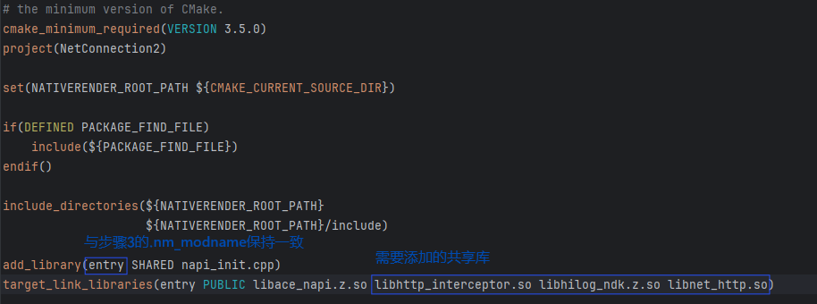

7. 调用HTTP全局拦截器C API接口要求应用拥有`ohos.permission.INTERNET`权限，在`module.json5`中的`requestPermissions`项添加该权限。

完成上述步骤后，工程搭建已全部完成，后续可连接设备运行工程并查看日志。

## 测试步骤

1. 连接设备，使用DevEco Studio打开搭建好的工程。

2. 运行工程，设备上会弹出以下图片所示界面。


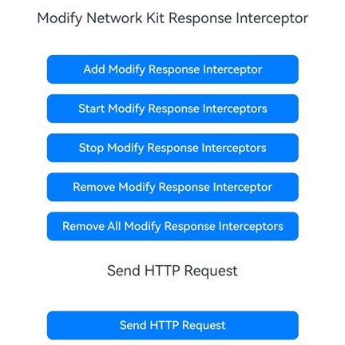

   - 点击`Add Read Only Response Interceptor`按钮，添加一个HTTP全局只读响应拦截器。

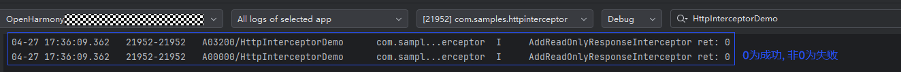

   - 点击`Start Read Only Response Interceptors`按钮，启用组ID为1的所有只读响应拦截器。

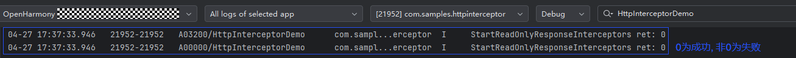

   - 点击`Add Modify Request Interceptor`按钮，添加一个HTTP全局可修改请求拦截器。

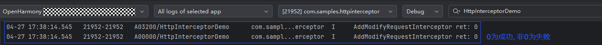

  - 点击`Start Modify Request Interceptors`按钮，启用组ID为2的所有可修改请求拦截器。  

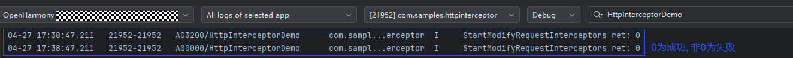

  - 点击`Add Modify Response Interceptor`按钮，添加一个HTTP全局可修改响应拦截器。  


  - 点击`Start Modify Response Interceptors`按钮，启用组ID为3的所有可修改响应拦截器。

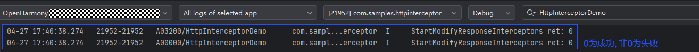

   - 点击`Send HTTP Request`按钮，拦截器会捕获响应并打印相关信息到日志。

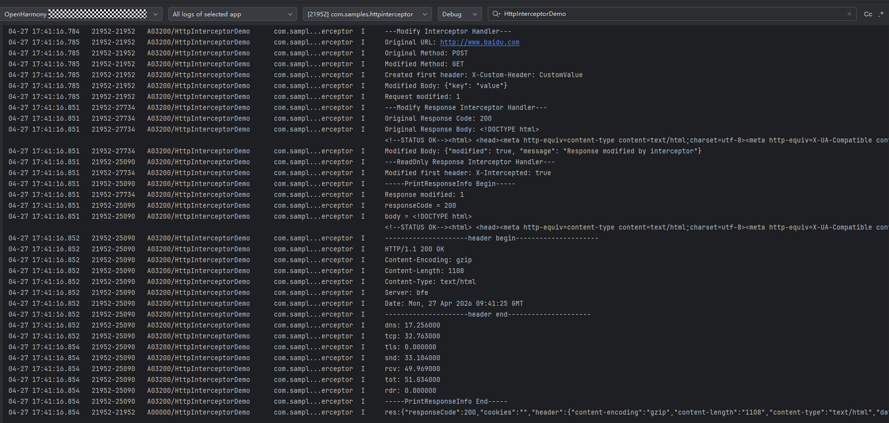

   - 点击`Stop Read Only Response Interceptors`按钮，停用组ID为1的只读响应拦截器。

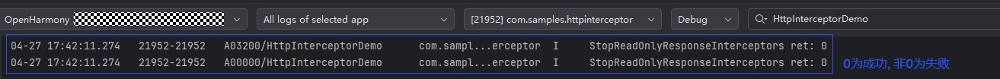

   - 点击`Stop Modify Request Interceptors`按钮，停用组ID为2的可修改请求拦截器。

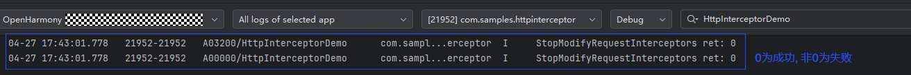

   - 点击`Stop Modify Response Interceptors`按钮，停用组ID为3的可修改响应拦截器。

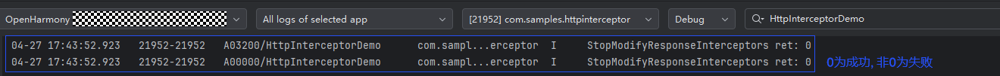

   - 点击`Remove Read Only Response Interceptor`按钮，移除之前添加的只读响应拦截器。

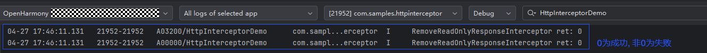

   - 点击`Remove Modify Request Interceptor`按钮，移除之前添加的可修改请求拦截器。

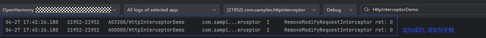

   - 点击`Remove Modify Response Interceptor`按钮，移除之前添加的可修改响应拦截器。

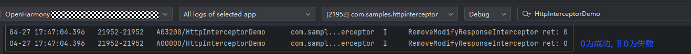

  - 点击`Remove All Read Only Response Interceptors`按钮，移除组ID为1的所有只读响应拦截器。

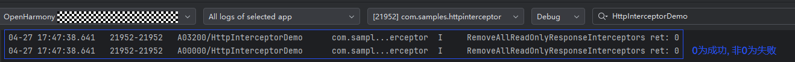

  - 点击`Remove All Modify Request Interceptors`按钮，移除组ID为2的所有可修改请求拦截器。

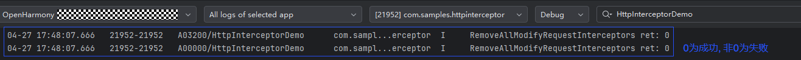

  - 点击`Remove All Modify Response Interceptors`按钮，移除组ID为3的所有可修改响应拦截器。

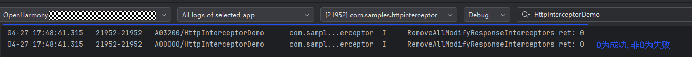

## 相关实例

针对HTTP全局拦截器的开发，有以下相关实例可供参考：

- [HTTP全局拦截器（C/C++）](https://gitcode.com/openharmony/applications_app_samples/tree/master/code/DocsSample/NetWork_Kit/NetWorkKit_Datatransmission/HTTP_interceptor_C)
