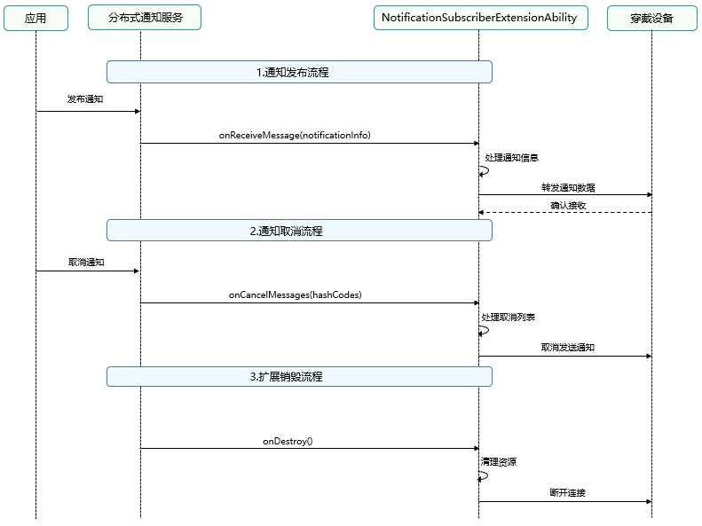

# 通知订阅扩展能力概述
<!--Kit: Notification Kit-->
<!--Subsystem: Notification-->
<!--Owner: @cheerful_ricky-->
<!--Designer: @dongqingran-->
<!--Tester: @wanghong1997-->
<!--Adviser: @fang-jinxu-->
## NotificationSubscriberExtensionAbility 开发概述

### 功能简介

[NotificationSubscriberExtensionAbility](../reference/apis-notification-kit/js-apis-notificationSubscriberExtensionAbility.md)提供扩展能力，允许第三方应用接收系统通知并将其同步到穿戴设备。该能力主要用于支持手机与第三方穿戴设备之间的通知协同。一定时间内无通知发布[NotificationSubscriberExtensionAbility](../reference/apis-notification-kit/js-apis-notificationSubscriberExtensionAbility.md)会被销毁。

### 前提条件
- 用户已通过手机中与穿戴设备配套的应用程序连接穿戴设备。
- 用户已在手机的穿戴应用中，通过[OpenSubscriptionSettings](../reference/apis-notification-kit/js-apis-notificationExtensionSubscription.md#notificationextensionsubscriptionopensubscriptionsettings)接口拉起半模态弹窗中，开启"允许获取本机通知"开关与"已获取的本机通知"通知开关。
### 应用场景
<!--Del-->
- [生态诉求]：支持第三方穿戴接收系统通知
<!--DelEnd-->
- [使用场景]：手机通知同步到穿戴设备
- [传输方式]：支持低功耗蓝牙(BLE)和传统蓝牙两种同步方式

### 约束条件
1. 本示例仅支持标准系统上运行，支持设备：手机和平板。
2. 本示例为Stage模型，支持API22版本SDK，版本号：6.0.2.54；
3. 本示例需要使用DevEco Studio 6.0.0 beta5 (Build Version: 6.0.0.848, built on September 12, 2025)才可编译运行；
4. 三方穿戴应用需申请[ohos.permission.SUBSCRIBE_NOTIFICATION](../security/AccessToken/restricted-permissions.md#ohospermissionsubscribe_notification)权限，权限为system_core级别，需要配置高权限签名；

### 运作机制
