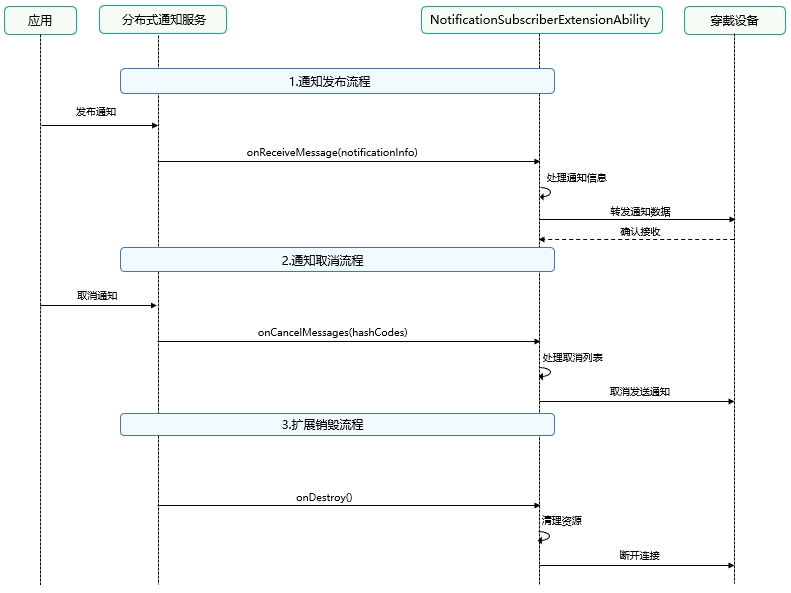

#  NotificationSubscriberExtensionAbility (开发概述)
<!--Kit: Notification Kit-->
<!--Subsystem: Notification-->
<!--Owner: @cheerful_ricky-->
<!--Designer: @dongqingran-->
<!--Tester: @wanghong1997-->
<!--Adviser: @fang-jinxu-->
## 功能简介

应用发送通知给分布式通知服务后，该服务会把通知转发给三方应用实现的[NotificationSubscriberExtensionAbility](../reference/apis-notification-kit/js-apis-notificationSubscriberExtensionAbility.md)扩展能力，此扩展能力的核心作用是让三方应用接收系统通知，应用可在此扩展能力中实现手机与穿戴设备之间的数据传输。若一定时间内无新通知发布，当前运行的[NotificationSubscriberExtensionAbility](../reference/apis-notification-kit/js-apis-notificationSubscriberExtensionAbility.md)会被系统自动销毁。

## 前提条件
- 用户已通过手机中与穿戴设备配套的应用程序连接穿戴设备。
- 用户已在手机的穿戴应用中，通过[OpenSubscriptionSettings](../reference/apis-notification-kit/js-apis-notificationExtensionSubscription.md#notificationextensionsubscriptionopensubscriptionsettings)接口拉起的半模态弹窗中，开启了“允许获取本机通知”与“已获取的本机通知”的开关。
## 应用场景
<!--Del-->
- **生态诉求**：支持第三方穿戴接收系统通知
<!--DelEnd-->
- **使用场景**：手机通知同步到穿戴设备
- **传输方式**：支持低功耗蓝牙（Bluetooth Low Energy）和传统蓝牙两种同步方式

## 约束条件
1. 本示例仅支持标准系统上运行，支持设备：手机和平板。
2. 本示例为Stage模型，支持API22及以上版本SDK。
3. 本示例需要使用DevEco Studio 6.0.2 Release及以上版本才可编译运行。
4. 三方穿戴应用需申请[ohos.permission.SUBSCRIBE_NOTIFICATION](../security/AccessToken/restricted-permissions.md#ohospermissionsubscribe_notification)权限，权限为system_basic级别。

## 运作机制
