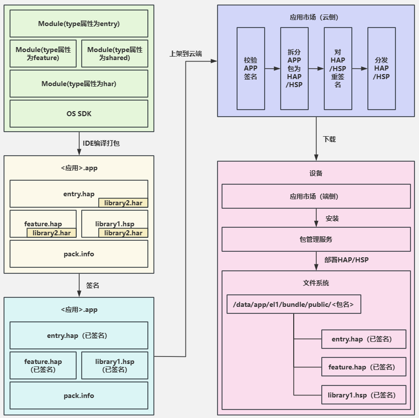

# Stage模型应用程序包结构
<!--Kit: Ability Kit-->
<!--Subsystem: BundleManager-->
<!--Owner: @wanghang904-->
<!--Designer: @hanfeng6-->
<!--Tester: @kongjing2-->
<!--Adviser: @Brilliantry_Rui-->

为了让开发者能对应用程序包在不同阶段的形态有更加清晰的认知，分别对开发态、编译态、发布态的应用程序结构展开介绍。

## 开发态包结构
在DevEco Studio上创建项目工程，并尝试创建多个不同类型的Module。根据实际工程中的目录对照本章节进行学习，可以有助于理解开发态的应用程序结构。

**图1** 项目工程结构示意图（以实际为准）

> **说明：**
>
> - AppScope目录由DevEco Studio自动生成，该目录名称更改会导致当前目录下配置文件和资源加载不到，导致编译报错问题，因此该目录名称请勿修改。
> - Module目录名称可以由DevEco Studio自动生成（比如entry、library等），也可以自定义。为了便于说明，下表中统一采用ModuleName表示。

工程结构主要包含的文件类型及用途如下：

| 文件类型 | 说明 |
| -------- | -------- |
| 配置文件 | 包括应用级配置信息、以及Module级配置信息：  - **AppScope &gt; app.json5**：[app.json5配置文件](app-configuration-file.md)，用于声明应用的全局配置信息，比如应用Bundle名称、应用名称、应用图标、应用版本号等。  - **ModuleName &gt; src &gt; main &gt; module.json5**：[module.json5配置文件](module-configuration-file.md)，用于声明Module基本信息、支持的设备类型、所含的组件信息、运行所需申请的权限等。 |
| ArkTS源码文件 | **ModuleName &gt; src &gt; main &gt; ets**：用于存放Module的ArkTS源码文件（.ets文件）。|
| 资源文件 | 包括应用级资源文件、以及Module级资源文件，支持图形、多媒体、字符串、布局文件等，详见[资源分类与访问](resource-categories-and-access.md)。  - **AppScope &gt; resources** ：用于存放应用需要用到的资源文件。  - **ModuleName &gt; src &gt; main &gt; resources** ：用于存放该Module需要用到的资源文件。|
| 其他配置文件 | 用于编译构建，包括构建配置文件、编译构建任务脚本、混淆规则文件、依赖的共享包信息等。  - **build-profile.json5**：[工程级](https://developer.huawei.com/consumer/cn/doc/harmonyos-guides/ide-hvigor-build-profile-app)或[Module级](https://developer.huawei.com/consumer/cn/doc/harmonyos-guides/ide-hvigor-build-profile)的构建配置文件，包括[应用签名](https://developer.huawei.com/consumer/cn/doc/harmonyos-guides/ide-signing)、产品配置等。   - **hvigorfile.ts**：工程级或Module级的编译构建任务脚本，开发者可以自定义编译构建工具版本、控制构建行为的配置参数。  - **[obfuscation-rules.txt](https://developer.huawei.com/consumer/cn/doc/harmonyos-guides/ide-build-obfuscation#section760533133313)**：混淆规则文件。混淆开启后，在使用Release模式进行编译时，会对代码进行编译、混淆及压缩处理，保护代码资产。  - **[oh-package.json5](https://developer.huawei.com/consumer/cn/doc/harmonyos-guides/ide-oh-package-json5)**：用于存放依赖库的信息，包括所依赖的三方库和共享包。 |

## 编译态包结构
不同类型的Module编译后会生成对应的HAP、HAR、HSP等文件，开发态视图与编译态视图的对照关系如下：

**图2** 开发态与编译态的工程结构视图

从开发态到编译态，Module文件变更如下：
- **ets目录**：ArkTS源码编译生成.abc文件。
- **resources目录**：AppScope目录下的资源文件会合入到Module下面资源目录中，如果两个目录下存在重名文件，编译打包后只会保留AppScope目录下的资源文件。
- **module配置文件**：AppScope目录下的app.json5文件字段会合入到Module下面的module.json5文件之中，编译后生成HAP或HSP最终的module.json文件。

> **说明：**
>
> 在编译HAP和HSP时，会把它们所依赖的HAR直接编译到HAP和HSP中。

## 发布态包结构

每个应用中至少包含一个.hap文件，可能包含若干个.hsp文件、也可能不含，一个应用中的所有.hap与.hsp文件合在一起称为**Bundle**，其对应的bundleName是应用的唯一标识（详见[app.json5配置文件](app-configuration-file.md)中的bundleName标签）。

当应用发布上架到应用市场时，需要将Bundle打包为一个.app后缀的文件用于上架，这个.app文件称为**App Pack**（Application Package），与此同时，DevEco Studio工具会自动生成一个**pack.info**文件。**pack.info**文件描述了App Pack中每个HAP和HSP的属性，包含APP中的bundleName和versionCode信息、以及Module中的name、type和abilities等信息。

> **说明：**
>
> - App Pack是发布上架到应用市场的基本单元，但是不能在设备上直接安装和运行。
> - 在[应用签名](https://developer.huawei.com/consumer/cn/doc/harmonyos-guides/ide-signing)、云端分发、端侧安装时，都是以HAP/HSP为单位进行签名、分发和安装的。

**图3** 编译发布与上架部署流程图

