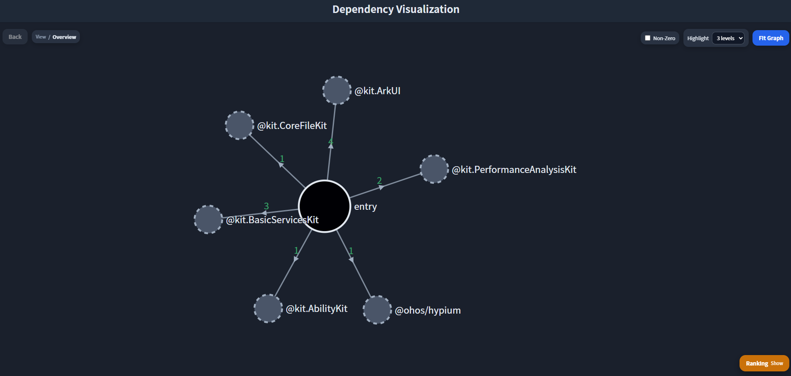

# ArkTS Migration Visualizer使用指南
<!--Kit: ArkTS-->
<!--Subsystem: ArkCompiler-->
<!--Owner: @cy917474985-->
<!--Designer: @cy917474985-->
<!--Tester: @kirl75; @zsw_zhushiwei-->
<!--Adviser: @zhang_yixin13-->

## 工具简介

`ArkTS Migration Visualizer`是一款面向工程静态化重构分析的性能敏感识别工具。它通过整合 **Homecheck**生成的依赖图与 **Hapray**生成的性能数据，帮助开发者识别应用中的性能瓶颈点，并进一步定位这些瓶颈所关联的文件、HAR模块依赖关系，从而更准确地圈定可优先开展工程静态化重构的代码范围。

## 获取代码

从GitCode下载`arkcompiler_runtime_core`仓：

```text
https://gitcode.com/openharmony/arkcompiler_runtime_core
```

进入目录：

```text
static_core/plugins/ets/tools/migration_visualizer
```

本文命令示例默认以Windows环境为主，并假设在仓库根目录下执行命令。

## 环境要求

- Python版本需要3.10到3.12。
- Node.js / npm，推荐node20及以上版本。
- Git工具。
- 可用的OpenHarmony / DevEco SDK。
- Windows环境下可正常访问依赖仓和镜像源。

## 配置文件

先复制配置模板：

```text
configs/config.example.json -> configs/config.json
```

`configs/config.json`中常用的配置项如下：

- `project_path`：待分析的OpenHarmony工程路径。
- `sdk_path`：SDK根目录。
- `deps_root`：依赖下载与运行目录，默认是`.deps`。
- `hapray_python`：用于准备Hapray环境的Python解释器。
- `npm_registry`：npm镜像地址。
- `pip_index_url`：pip镜像地址。
- `windows_short_alias_root`：Windows下Hapray短路径别名目录，可留空。
- `hapray_testcases`：默认Hapray testcase正则。
- `hapray_round`：采集轮数。
- `hapray_devices`：指定Hapray采集设备列表。
- `hapray_so_dir`：native `.so`符号目录。
- `hdc_path`：显式指定`hdc`路径。

补充说明：

- Windows路径可直接写为`C:\\...`。
- 如果仓库路径较长，建议将`deps_root`改为较短的绝对路径，例如`C:\\OH\\.amv-deps\\migration_visualizer`。
- 当`windows_short_alias_root`为空时，脚本会优先根据`deps_root`自动推导短路径别名目录。
- 使用手动监听模式时，请确保`project_path`指向实际要操作的应用工程，并且`AppScope/app.json5`中的`bundleName`与`--manual-package`一致。

## 准备依赖

在仓库根目录执行：

```bat
.\src\scripts\deps\bootstrap.cmd --tool all --verify
```

如需临时指定镜像源和依赖目录，可以这样执行：

```bat
.\src\scripts\deps\bootstrap.cmd --tool all --verify ^
  --npm-registry https://<your-npm-mirror>/ ^
  --pip-index-url https://<your-pypi-mirror>/simple/ ^
  --deps-root C:\OH\.amv-deps\migration_visualizer
```

说明：

- `bootstrap.cmd`默认读取`configs/config.json`中的`deps_root`。
- 也可以通过`--deps-root`临时覆盖，并且命令行参数优先级高于配置文件。
- `bootstrap.cmd`和`run_all.py`都支持`--deps-root`。
- 如果希望整个流程都使用同一套临时依赖目录，需要在后续命令中继续传入相同的`--deps-root`。

## 一键运行

### 自动化testcase模式

执行全部testcase：

```bat
python src\run_all.py -t ".*"
```

指定testcase：

```bat
python src\run_all.py -t ".*testcase"
```

临时覆盖依赖目录：

```bat
python src\run_all.py -t ".*" --deps-root C:\OH\.amv-deps\migration_visualizer
```

命令执行后会依次完成以下步骤：

1. 调用Homecheck和Hapray采集数据。
2. 自动选择最新的`artifacts/test_run_*`。
3. 生成`web/hierarchical_integrated_data.json`。
4. 默认启动本地页面`http://localhost:8000/`。

如果`8000`端口已被占用，脚本会自动尝试后续可用端口。

**页面示意**


### 手动监听模式

如果不想执行固定testcase，而是希望在设备上手动操作目标应用，可以使用手动监听模式：

```bat
python src\run_all.py --manual-package com.example.xxx --manual-duration 60
```

手动监听模式的特点如下：

- 仍然走`Homecheck + Hapray`的完整采集链路。
- 当应用启动且控制台出现`Starting manual workload collection`日志后，即可在设备上手动操作目标应用。
- 采集结束后同样会生成相同的四份输入文件。

## `run_all.py`常用参数

- `--test` / `-t`：Hapray testcase正则，默认值为`.*`。
- `--manual-package`：手动监听模式下的目标应用包名。
- `--manual-ability`：手动监听模式下显式指定应用启动ability。
- `--manual-duration`：手动监听时长，单位为秒。
- `--deps-root`：临时覆盖依赖目录。
- `--skip-collect`：跳过采集，直接使用已有产物构建页面。
- `--run-dir`：指定已有的`artifacts/test_run_*`目录。
- `--serve` / `--no-serve`：是否在构建完成后启动本地服务器，默认启动。
- `--port`：本地页面端口，默认`8000`。
- `--no-open`：不自动打开浏览器。
- `--quiet`：减少控制台输出。

示例：

```bat
python src\run_all.py --skip-collect
python src\run_all.py --skip-collect --run-dir artifacts\test_run_YYYYMMDD_HHMMSS
python src\run_all.py -t ".*testcase" --port 8010
```

## 依赖关系可视化页面说明

依赖关系可视化页面为纯静态页面，不依赖后端服务。

当前支持的交互包括：

- 首层展示HAR依赖图。
- 点击HAR节点可进入文件依赖图。
- 点击空白处或按`Esc`可清除当前固定详情。
- 详情面板会显示节点名称、完整路径和耗时。
- `Non-zero`会隐藏零耗时节点，并在隐藏后自动重连路径。
- 排行榜支持点击跳转并高亮对应节点。
