# ArkTS静态类型及应用迁移改造概述

## 应用迁移到ArkTS静态类型

### 迁移改造流程概述

应用迁移到ArkTS静态类型的流程如下：首先进行场景识别，定位需要从TypeScript迁移到ArkTS的模块并分析模块间的依赖关系，评估性能提升预期。接着进入模块改造阶段，包括架构设计、代码改造，以及将TS代码转换为ArkTS动态代码。然后使用工具完成语法适配和ArkTS静态代码并行化改造。改造完成后，先验证功能是否正常，再开启AOT进行性能验收。所有验收通过后，即完成整个迁移流程。

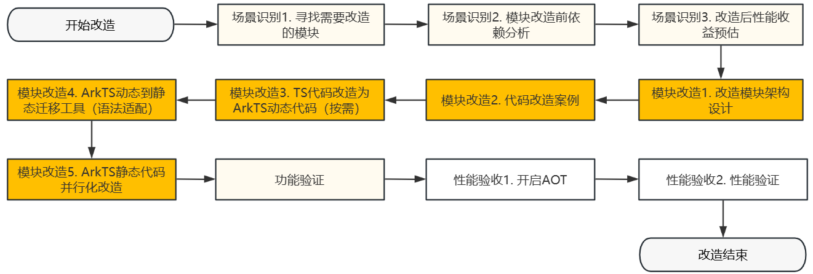

## 场景识别

### 寻找需要改造的模块

**HiTrace进行耗时分析**

在业务代码中使用HiTrace对关键耗时点进行分析，详细使用方法可参考官方文档：[HiTrace](https://developer.huawei.com/consumer/cn/doc/harmonyos-guides/hitrace)。

**基础使用方式**

```typescript
import { bundleManager } from '@kit.AbilityKit';
import { hiTraceMeter } from '@kit.PerformanceAnalysisKit';

hiTraceMeter.startTrace("TaskTrace", 0x001);

const bundleInfo: bundleManager.BundleInfo = bundleManager.getBundleInfoForSelfSync(
  bundleManager.BundleFlag.GET_BUNDLE_INFO_WITH_APPLICATION |
  bundleManager.BundleFlag.GET_BUNDLE_INFO_WITH_METADATA
);

hiTraceMeter.finishTrace("TaskTrace", 0x001);
```

**常见耗时场景**

| 场景类型 | 问题表现|
|:---------|:---------|
| 动态库加载耗时 | 应用启动/模块初始化时，动态库文件加载时间过长。 |
| 业务逻辑执行耗时 | 核心流程中单段代码执行耗时长（如数据处理、计算等）。 |

### 实例分析

**第一步：分析业务代码执行流程**

业务执行流程示例如下：


**示例代码（TaskB+Data初始化）**

```typescript
// import { Data } from './Data'; Data用于存储数据
import { hilog, hiTraceMeter } from "@kit.PerformanceAnalysisKit";
import { bundleManager } from "@kit.AbilityKit";

export function TaskB(): void {
  // Trace起始点
  hiTraceMeter.startTrace("Task-inner", 0x001);

  try {
    // 读取bundleInfo信息
    const bundleInfo: bundleManager.BundleInfo = bundleManager.getBundleInfoForSelfSync(
      bundleManager.BundleFlag.GET_BUNDLE_INFO_WITH_APPLICATION |
      bundleManager.BundleFlag.GET_BUNDLE_INFO_WITH_METADATA
    );

    const appInfo: bundleManager.ApplicationInfo = bundleInfo.appInfo;
    if (!appInfo?.metadataArray) {
      throw new Error("Invalid appInfo or no metadata found");
    }

    // 遍历数据并存储到Data中
    for (const item of appInfo.metadataArray) {
      if (!item?.metadata) {
        continue;
      }
      for (const innerItem of item.metadata) {
        if (innerItem?.name && innerItem?.value) {
          // ... 将数据存储到Data中
        }
      }
    }
  } catch (error) {
    let DOMAIN = 0x0000; // 自定义领域标志
    let TASK = 'task'; // 自定义日志标志
    hilog.error(DOMAIN, TASK, `Task error: ${error}`);
  } finally {
    // Trace结束点
    hiTraceMeter.finishTrace("Task-inner", 0x001);
  }
}
```

**第二步：分析Trace**

- **Task任务总耗时：** 7.9ms。
  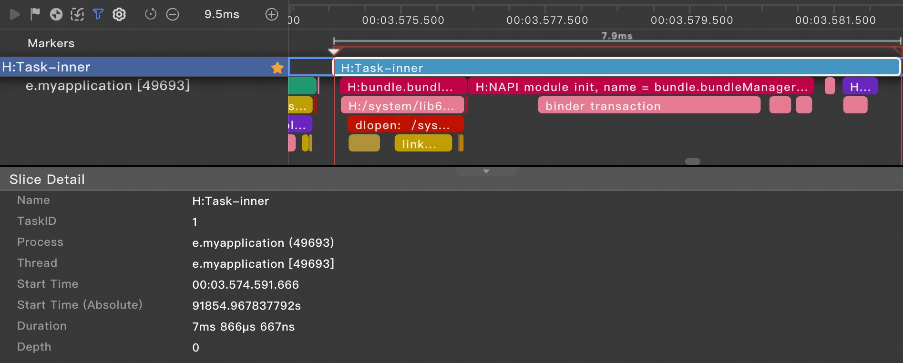

- **加载libbundlemanager.so耗时：** 1.7ms。
  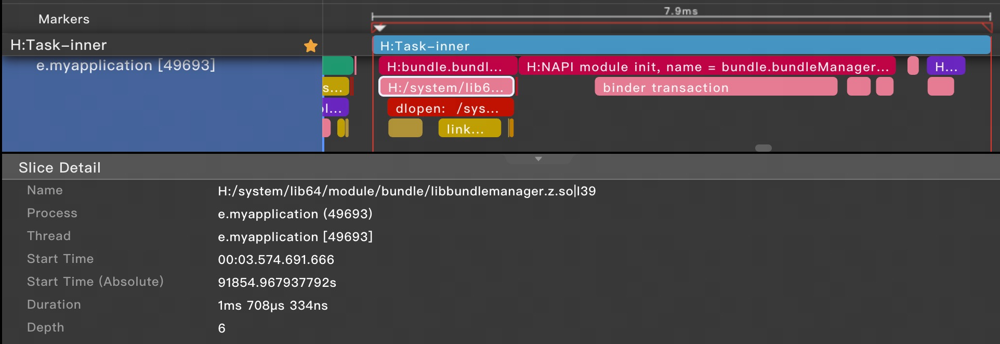

**第三步：得出结论**

在该例子中，TaskA耗时10ms，TaskC耗时1ms，通过表格中的耗时数据可以得出：

| 项目 | 耗时 |
|------|------|
| TaskA | 10ms |
| TaskB+Data解析 | 7.9ms |
| TaskC | 1ms |
| **总计** | **18.9ms** |

**结论：TaskB+Data解析执行耗时7.9ms，占主线程总耗时18.9ms的42%，并行化改造收益大。**


### 模块改造前依赖分析

在确定改造方案前，需要分析模块的调用链路和依赖关系，评估改造范围和可行性。

**现有模块执行流程分析**

存在的问题：

- 主线程阻塞： 数据初始化TaskB函数需在主线程顺序执行。
- 资源占用： 长时间占用主线程资源，影响系统响应效率。

**并行化改造方案**

| 改造维度 | 改造策略 | 预期效果 |
|:---------|:---------|:---------|
| 并发优化 | 将数据初始化逻辑迁移至子线程异步执行 | 释放主线程处理其他业务。 |
| 内存共享 | 将TaskB和Data函数改造为静态代码 | 实现线程间高效共享，避免重复加载，确保线程安全访问。 |


### 改造后性能收益预估

**并行化执行流程**

并行化改造后，TaskA和TaskB可同时并行执行，TaskC等待两者完成后执行：

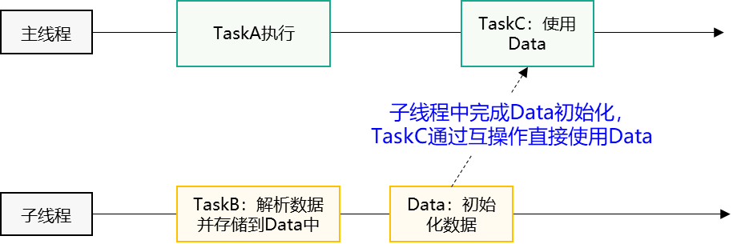

**性能收益对比**

| 方案 | 执行方式 | 总耗时 |
|:-----|:---------|:-------|
| 原有方案 | 单线程串行执行 | TaskA:10ms + TaskB:7.9ms + TaskC:1ms = 18.9ms |
| 并行化改造 | TaskA与TaskB并行执行 | TaskA:10ms + TaskC:1ms = 11ms|

结论：TaskB+Data解析执行并行化改造后，预期能够减少总耗时7.9ms。


## 模块改造

### 改造模块架构设计

针对需要改造的具体模块，需要考虑以下几个方面：
* **该模块能够兼容新老设备**，即改造后的应用包能够分发到支持的目标设备上；
* **该模块实现能够运行时回滚**，即改造后静态类型实现如果存在bug可以通过开关回退到改造前的实现；
* **该模块保持对外接口不变**，即对外的接口保持动态类型不变。

根据以上设计目标的改造模块架构如下图所示：

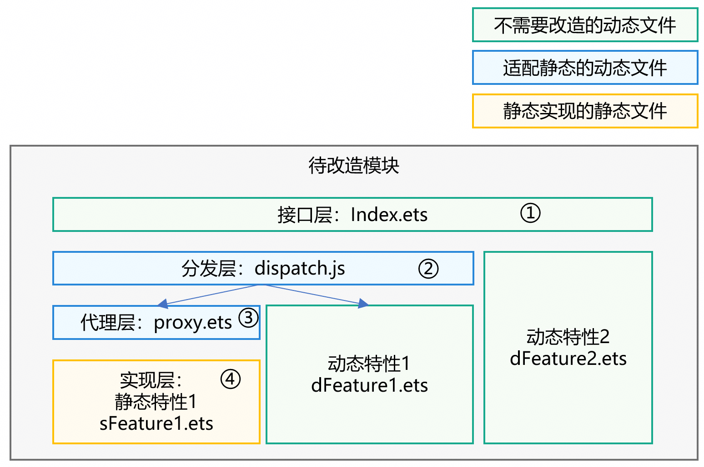

待改造的模块主要包含1个接口文件`Index.ets`和2个动态特性实现文件`dFeature1.ets`和`dFeature2.ets`，目标是新增特性1的静态类型实现文件`sFeature1.ets`，并且能够在不支持静态类型的设备上也能够运行，整体架构分为四层：

- 接口层：`Index.ets`需要保持对外不变。
- 分发层：`dispatch.js`根据API版本号在运行时分发到静态实现或者动态实现。
- 代理层：`proxy.ets`是特性1的静态实现。
- 实现层：`sFeature1.ets`的业务逻辑实现。

在ArkTS静态类型改造案例中[一套源码支持ArkTS动静态类型](./arkts-sta-migration-case.md#一套源码支持arkts动静态类型) 小节中会以代码详细展示各个层次的写法。

### 代码改造案例

基于改造模块架构，总结如下代码案例：

- **静态调用动态实现：** 在业务逻辑模块中定义了继承自动态开放API基类的子类实现，在静态上下文中需要从子线程回主线程后才能访问该对象。
- **分发层实现：** 对外提供的API存在被子线程调用的情况需要静态化，同时定义好定义分发类。
- **代理层实现：** 要接受动态类型参数，并访问它的属性或方法，如果要动态和静态2个类实现一致，需要定义代理类，实现动态到静态类型的转换。

### TS代码改造为ArkTS动态代码（按需）

详细的TypeScript到ArkTS动态代码改造，请参考[TypeScript到ArkTS代码改造指南](https://developer.huawei.com/consumer/cn/doc/harmonyos-guides/typescript-to-arkts-migration-guide)。

### ArkTS动态到静态迁移工具

EasyTrans是ArkTS动态类型到静态类型的官方迁移工具，集成在DevEco Studio中，提供代码扫描和自动语法规则修复功能，可大幅降低迁移成本。


**文件扫描**

1. 打开迁移工具。

   在DevEco Studio中打开EasyTrans迁移工具界面：

   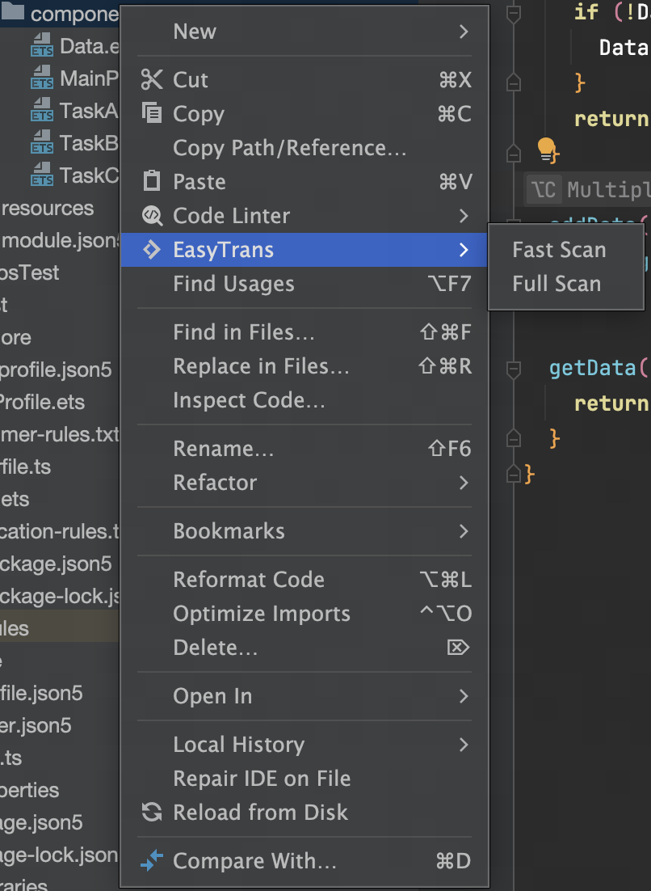

2. 选择扫描范围。

   | 扫描范围 | 适用场景 |
   |:---------|:---------|
   | **项目级** | 整体迁移，首次扫描推荐。 |
   | **文件夹级** | 针对特定模块迁移。 |
   | **单文件级** | 验证单个文件的改造效果。 |

3. 选择扫描模式。

   | 扫描类型 | 扫描速度 | 支持互操作问题扫描 | 适用场景 |
   |:---------|:---------|:---------------------|:---------|
   | **Fast Scan** |  快速 |  不支持 | 快速评估、初步排查。 |
   | **Full Scan** |  完整 |  支持 | 正式迁移前全面检查。 |

   > **说明：** 
   >
   > 首次迁移建议使用**Full Scan**模式。

**问题修复**

扫描完成后，工具会展示所有可修复的语法规则代码：

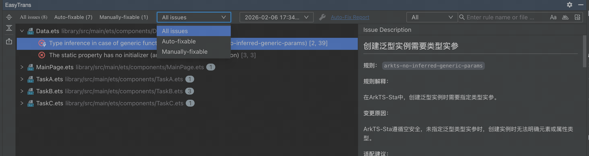

**问题分类**

| 问题类型 | 标识 | 处理说明 |
|:---------|:-----|:---------|
| **可自动修复** | Auto-fixable | 点击Auto-Fix-Report左边的"自动修复"按钮。 |
| **需手动修复** | Manually-fixable | 查看右侧详情，根据建议手动修改。 |

**操作步骤**

1. 自动修复问题
   - 勾选需要修复的问题。
   - 点击工具栏右上方的 **"Start Auto-Fix"**。
   - 工具自动完成修复，并显示修复结果。

    

2. 手动修复问题
   - 点击问题项，右侧面板显示：
     - 问题描述。
     - 修改建议。
     - 代码示例。
   - 根据提示手动调整代码。

**使用建议**

| 场景 | 建议操作 |
|:-----|:---------|
| **首次迁移** | 使用Full Scan全面扫描，批量自动修复，逐项处理手动问题。 |
| **增量更新** | 使用Fast Scan快速验证新代码。 |
| **复杂项目** | 分模块扫描修复，避免一次性改动过大。 |

### C++代码从NAPI迁移到ANI

C++代码迁移主要包含以下三种方案：

| 迁移场景 | 说明 |
|---------|------|
| **NAPI到ANI** | 从Node-API直接迁移到ANI。 |
| **NAPI到Taihe** | 使用Taihe工具自动生成桥接代码。 |
| **AKI到Taihe** | 从AKI框架迁移到Taihe框架代码。 |


**方案1. NAPI → ANI**

适用场景：项目代码量少于1000行、接口数量不超过10个。

| 内容 | 链接 |
|------|------|
| 迁移指南 | [NAPI到ANI迁移指南](../napi/napi2ani/napi2ani_guide.md) |
| ANI完整手册 | [Ark Native Interface应用实践手册](../ani/ani-usage-scenarios.md) |

核心差异：
- 模块加载：NAPI自动注册 → ANI显式 `loadLibrary()`。
- 类型系统：动态类型 `napi_value` → 静态类型 `ani_int`/`ani_object` 等。
- Mangling规则：需编写方法签名如 `"ii:d"`（传入参数为两个int类型，返回值为double类型），具体规则参考[Mangling规则](../ani/ani-usage-scenarios.md#2-名称修饰符mangling规则)。

**方案2. NAPI → Taihe**

适用场景：代码量超过10万行或接口数量超过50个的项目。

| 内容 | 链接 |
|------|------|
| 迁移指南 | [NAPI到Taihe迁移指南](../napi/napi2ani/napi2taihe.md) |
| Taihe介绍 | [Taihe是什么？](../taihe/taihe-introduction.md) |
| 快速开始 | [Taihe快速开始](../taihe/taihe-quick-start.md) |
| IDL语法 | [Taihe IDL参考](../taihe/taihe-idl-reference.md) |

**迁移步骤：**
1. 编写 `.ohidl` 接口定义文件。
   - 基于NAPI业务的声明文件内容如下：
   ```typescript
   export const add: (a: number, b: number) : number;
   ```
   - 对应的ohidl接口定义文件内容如下：
   ```idl
   function add(a: f64, b: f64) => f64;
   ```
   这里a、b、add返回值的类型应根据实际数值范围和精度要求进行调整，如需使用整数类型，可以使用i32、i64。

   - ohidl文件放置位置如下：

   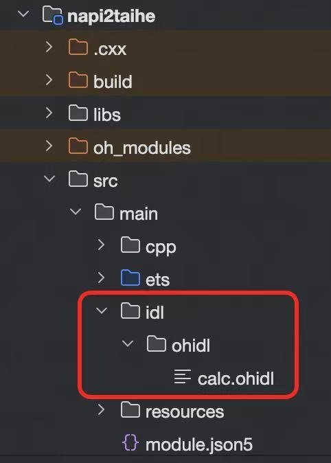

2. 执行编译，生成胶水代码。

   - 对ohidl文件所在模块执行编译操作。

   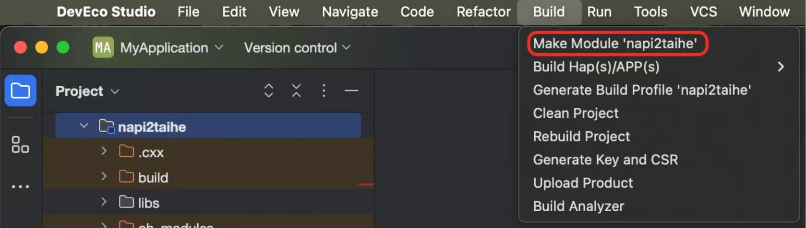

   - 编译结果中查看是否有ohidl文件的报错。

   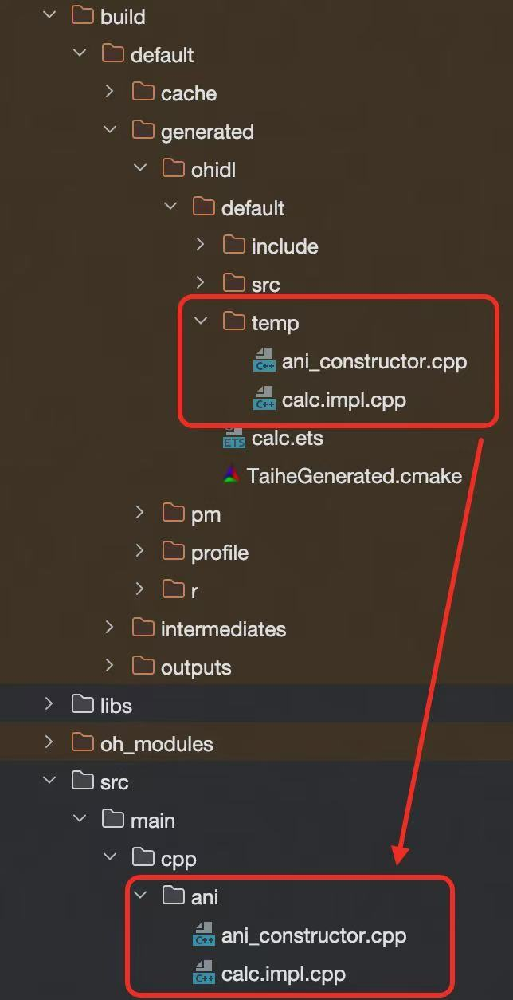

  - 在cmake打包配置文件(TaiheGenerated.cmake)中添加如下：
    ```cmake
    include(${OHIDL_GENERATED_CMAKE_FILE})
    include_directories(
      ${TAIHE_GEN_INCLUDE}
      ${TAIHE_RUNTIME_INCLUDE}
    )
    add_library(yourLibName SHARED
      ${TAIHE_GEN_SRC}
      ${TAIHE_RUNTIME_SRC}
    )
    ```

3. 实现C++业务逻辑。

   - 编辑接口实现文件。
    ```cpp
    #include "calc.impl.hpp"
    #include "stdexcept"

    namespace {
    // 接口实现
    double add(double a, double b) {
        return a + b;
    }
    }  // namespace

    // Since these macros are auto-generate, lint will cause false positive.
    // NOLINTBEGIN
    // 接口绑定
    TH_EXPORT_CPP_API_add(add);
    // NOLINTEND
    ```

4. ArkTS逻辑中接口调用。

   - 加载so。
    ANI采用显式加载方案，允许在运行时当应用程序需要调用so接口时，使用loadLibrary进行加载。
    ```typescript
    loadLibrary('yourLibName');
    ```
   - 接口调用。
    ```typescript
    // 方法导入需要导入build文件夹下生成的ets文件
    // 示例采用相对路径方式引入，请根据实际场景修改相对路径
    import { add } from '../../../build/default/generated/ohidl/default/calc';
    const ret = add(1, 2);
    ```

**注意事项：**
1. temp文件夹只是一个模版文件夹，当熟悉Taihe注册规则和语法后，可手写业务模块注册和业务接口实现文件，不用手动拷贝。
2. 迁移过程中，如果需要在部分C++已经实现的情况下修改ohidl，则重新生成的业务接口实现文件，需要手动修改，例如在ohidl中新增了接口，需要手动拷贝temp文件夹中的接口声明，到已经实现了部分功能的接口实现文件中。

**方案3. AKI → Taihe**

适用场景：已使用AKI框架的项目。

| 项目 | 文档链接 |
|------|------|
| 迁移指南 | [AKI到Taihe迁移指南](../napi/napi2ani/aki2taihe.md) |

### ArkTS静态代码并行化改造

在完成ArkTS动态到静态的语法迁移后，下一步是将代码进行并行化改造，充分利用多核CPU能力，提升应用性能。ArkTS静态类型提供了两种主要的并行化方案：**taskpool**（任务池）和**EAWorker**（独占线程任务执行器）。

**taskpool并行化改造**

taskpool是ArkTS静态类型提供的任务池机制，用于管理多个工作线程，自动分配任务到可用线程执行，适合执行大量短时任务。

核心特性：
- 自动线程管理：无需关心线程生命周期。
- 任务优先级：支持HIGH、MEDIUM、LOW、IDLE四种优先级，分别代表高、中、低、空闲四种优先级。
- 任务组管理：支持将关联任务分组后批量执行，组内任务自动调度执行。
- 串行队列：支持需要顺序执行的任务队列。
- 内存共享：天然支持内存共享，无需使用[@Sendable](..\arkts-utils\arkts-sendable.md)装饰器。

适用场景：
- 大量独立的计算任务。
- 数据处理、加密解密等CPU密集型操作。
- 需要并发执行的多任务场景。

**[taskpool参考文档](../reference/native-lib/arkts-sta-taskpool.md)**

**EAWorker并行化改造**

EAWorker（Exclusive ArkTS Worker）是独占线程任务执行器，为开发者提供专属的工作线程，适合执行长时任务或需要独占资源的任务。

核心特性：
- 独占线程：每个EAWorker实例绑定一个专属线程。
- 线程复用：可复用同一EAWorker实例执行多个任务。
- 互操作支持：可选择开启与ArkTS-Dyn的互操作能力。
- 生命周期管理：需要手动调用join释放资源。

适用场景：
- 需要持续运行数小时或更长时间的任务（如数据同步、后台处理）。
- 需要独占线程资源的任务。
- 需要与ArkTS-Dyn代码互操作的场景。

**[EAWorker参考文档](../reference/native-lib/eaworker_managed.md)**

### 功能验证

完成ArkTS静态化改造和并行化改造后，需要对改造后的代码进行全面的功能验证，确保：
- 静态化改造后的代码功能与原动态代码一致。
- 并行化改造后的执行结果正确。
- 动静态互操作正常工作。
- 异常处理机制有效。


## 性能验收

完成代码改造后，需要开启AOT编译并进行性能验证，确保静态化改造达到预期效果。

### 开启AOT

**手动开启AOT**

设备端手动触发AOT编译，在真机或模拟器上通过hdc命令手动触发应用AOT编译：

```bash
# 1. 连接设备
hdc shell

# 2. 关闭 SELinux（临时）
setenforce 0

# 3. 执行完整模式 AOT 编译
bm compile -m full "com.example.yourapp"

# 或使用 hdc 直接执行（无需进入 shell）
hdc shell setenforce 0 
hdc shell bm compile -m full "com.example.yourapp"
```

**命令说明**

| 参数 | 说明 |
|:-----|:-----|
| `hdc shell` | 进入设备shell环境。 |
| `setenforce 0` | 临时关闭SELinux（编译需要）。 |
| `bm compile` | Bundle Manager编译命令。 |
| `-m full` | 完整编译模式，执行AOT。 |
| `"包名"` | 应用的包名。 |

**获取应用包名**

```bash
# 方法1：查看已安装应用列表
hdc shell bm dump -a

# 方法2：从 app.json5 查看
{
  "bundleName": "com.example.yourapp"
}
```


### 性能验证

**关键性能指标**

运行时性能验证需要关注以下核心指标：

| 指标 | 测量方法 |
|:-----|:---------|
| 冷启动时间 | 从启动到首页完全渲染完成且能响应用户点击。 |
| 关键路径耗时 | 使用HiTrace测量。 |
| 内存占用 | 使用性能分析工具（DevEco Studio Profiler）。|
| CPU利用率 | Profiler性能分析。 |

**启动时间测量**

```typescript
'use static'

import hiTraceMeter from '@ohos.hiTraceMeter';

export class PerformanceMonitor {
  static measureLaunchTime(): void {
    // 应用启动时开始计时
    hiTraceMeter.startTrace("AppLaunch", 0x001);

    // 首页渲染完成
    hiTraceMeter.finishTrace("AppLaunch", 0x001);

    // 在 Trace 中查看 "AppLaunch" 耗时
  }
}
```

关键路径耗时测量，使用HiTrace标记改造前后的关键路径：

```typescript
'use static'

import hiTraceMeter from '@ohos.hiTraceMeter';

export function TaskB(): void {
  hiTraceMeter.startTrace("TaskB-Static", 0x002);

  try {
    // 业务逻辑
  } finally {
    hiTraceMeter.finishTrace("TaskB-Static", 0x002);
  }
}

// 对比指标
// 动态类型 TaskB 耗时: 7.9ms
// 静态类型 TaskB 耗时: 5.2ms (-34%)
```

**使用Profiling工具**

参考：[DevEco Profiler调优工具简介](https://developer.huawei.com/consumer/cn/doc/harmonyos-guides/ide-profiler)

## 静态化改造需注意的场景

**核心原则**：静态化本身不是最终目的，获取实际的性能收益才是根本目的。在进行ArkTS动态向静态的改造时，应始终以“收益导向”为核心，避免为了静态化而进行无意义的重构。针对特定场景必须进行特定分析，部分模块可能只需局部改造即可达到最佳效果。

以下为经过评估后，需谨慎进行静态化改造的典型场景：

### 依赖关系极其复杂且投入产出比低的模块
场景：模块内部代码逻辑交织，对外部模块存在大量的依赖逻辑（如同时依赖多个模块）。

**原因：**
* 改造成本与风险极高：如果为了优化一个总耗时并不高的函数，需要牵连改动上百个文件，改造范围过广将导致难以评估对其他系统模块产生的连锁影响。
* 建议策略：遵循特定场景特定分析的原则。如果一个总耗时较高的接口内部包含多个子函数，不应强求全部静态化。应优先识别并剥离其中容易改造且收益明显的局部函数进行改造，放弃牵连过广的部分。

### 引入负向性能收益的高频被调用模块
场景：
模块自身逻辑简单、无复杂依赖，但作为底层能力被其他模块高频调用（如全局日志模块、基础工具类）。

**原因：**
* 动静态互操作开销放大：静态化改造后可能会引入额外的类型检查或互操作（Interop）开销。例如，原本动态日志打印接口单次耗时10ms，强行改造为静态后单次耗时变为20ms。在一个业务流程中如果该接口被高频调用上万次，反而会导致整体性能严重劣化。

### 强耦合 C++ 等底层跨平台实现的模块
场景：
代码逻辑中深度集成了C++层代码，或涉及HarmonyOS等多端底层逻辑复用的模块。

**原因**：
* 逻辑黑盒风险：这类模块往往包含复杂的跨语言交互规则。在未完全理解底层C++代码逻辑、内存管理及跨端差异之前，盲目在ArkTS层进行静态化极易引发运行时的不可预知错误或崩溃。改造前必须先彻底梳理底层逻辑。

### 强依赖主线程动态上下文的并发改造场景
场景：
期望通过“动态->静态->并发->静态->动态”的链路优化性能，但在开启的静态子线程中，需要调用主线程的动态接口或读取主线程的动态数据，例如：
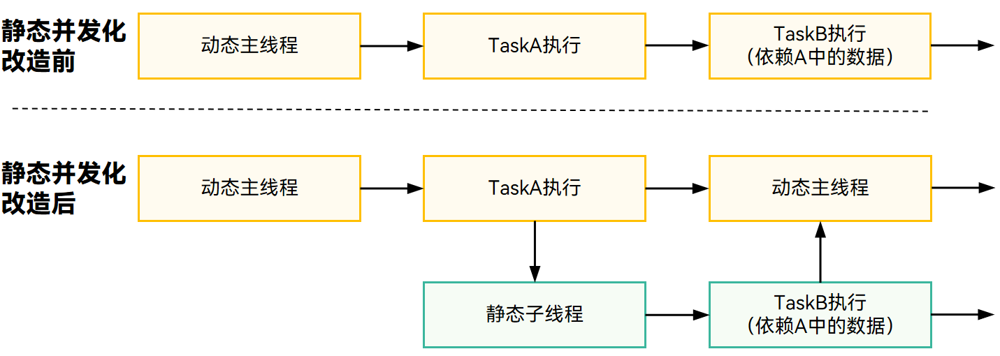

**原因**：
* 线程隔离限制：ArkTS-Dyn是内存隔离的，ArkTS-Dyn所在的主线程与ArkTS-Sta所在的并发子线程拥有各自独立的内存空间。如果在动态主线程中由任务A存储了数据（如基于动态的Map），随后开启静态子线程让静态任务B去并发执行，任务B在子线程中是无法直接获取主线程任务A的数据的。
* 特例说明：如果子线程中调用的动态接口仅是无状态的纯工具类或单纯的日志打印，通常可以接受；但如果是依赖上下文的查询、数据读取操作，且该数据提供方无法被改造为静态，则该场景不适合进行静态化并发改造。

### 产生大量动态与静态互相遍历（Interop）开销的场景
场景：
经过静态并发化处理后的数据，最终需要回流到动态侧，并在ArkTS-Dyn中被高频遍历或读取。

**原因：**
* 互操作性能损耗：动态对象与静态对象之间存在结构差异，互操作时也会存在性能损耗。在静态并行化处理动态数据后，如果回传动态的数据需要进行高频操作，例如遍历等，因为引发了密集的Interop行为，遍历耗时可能会覆盖将其在静态中进行并发处理的收益，这违背了向性能收益看齐的初衷。

### 数据结构未知的动态大字符串及JSON解析场景
场景：
需要对传入的大型动态字符串或JSON进行解析，但在编译期无法明确知晓该字符串包含的具体属性和结构。
例如：
```ts
// ArkTS-Dyn
function transfer(str: string): void{
  JSON.parse(str) as Record<string, string>;
}
transfer('{"A": "a", "B": "b"}');

// ArkTS-Sta
'use static'

function transfer(str: string): void{
  JSON.parse(str) as Record<string, string>; // 编译报错：No matching call signature for parse("{"A": "a", "B": "b"}")
}
transfer('{"A": "a", "B": "b"}');
```
**原因：**
* 类型系统的本质冲突：ArkTS-Dyn中的`Record`本质是灵活的Object，但在ArkTS-Sta中，`Record`本质是Map类型。
* 解析限制：在动态代码中，可以直接使用 `JSON.parse(str) as Record<>`。但在静态代码中，这是不允许的。对于结构未知的字符串，如果强行静态化，必须引入繁琐的底层解析（如先转换为 JSONElement，再通过`tryGetString("key")`逐个安全提取），这在处理未知大结构时不仅代码臃肿，且效率低下，故必须在明确数据模型的前提下才推荐做静态转换。

### 包含混合类型对象图的 JSON.stringify 序列化场景
场景：
在动态环境的代码中，对一个混合了动态类型和静态类型的对象整体调用`JSON.stringify()`。
例如：
```typescript
// ArkTS-Dyn
class A {
  b: B; // B 是从静态模块引入的静态类型对象
  c: string;
}

// ArkTS-Sta
import { A } from 'Dynamic-Module'; // 从对应动态模块导入混合对象
let a = new A();
let aStr = JSON.stringify(a); // 会导致b属性丢失
```
**原因：**
* 序列化行为不可控：动态引擎内置的`JSON.stringify`针对纯动态对象有明确的解析路径，但当动态对象内部嵌套了严格的静态类型对象时，通过标准动态接口进行序列化可能会导致静态属性丢失、解析异常或触发不可预期的Interop性能下降。此类边界数据交换应明确对象属性的纯粹性后再进行序列化。


## ArkTS静态类型迁移改造案例

参考：[ArkTS静态类型迁移改造案例](./arkts-sta-migration-case.md "ArkTS静态类型迁移改造案例")

## ArkTS静态类型改造案例

参考：[ArkTS静态类型改造案例](./arkts-sta-transformation-case.md "ArkTS静态类型改造案例")

## ArkTS静态类型应用迁移改造常见问题

参考：[ArkTS静态类型应用迁移改造常见问题](./arkts-sta-migration-questions.md "ArkTS静态类型应用迁移改造常见问题")
