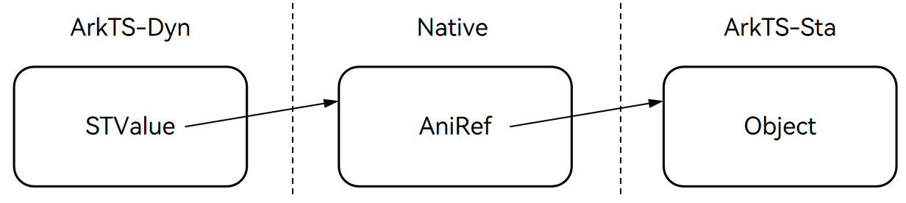

# ArkTS动静态类型互操作显式接口使用指南
<!--Kit: ArkTS-->
<!--Subsystem: RuntimeCore-->
<!--Owner: @lijin1039-->
<!--Designer: @lijin1039-->
<!--Tester: @kirl75; @zsw_zhushiwei-->
<!--Adviser: @zhang_yixin13-->

## 背景

显式接口互操作是指在ArkTS中，开发者通过直接调用底层封装类（STValue以及ESValue），利用运行时路径与修饰签名，手动控制并实现动静态类型环境（ArkTS-Sta与ArkTS-Dyn）之间数据交互与方法调用的底层机制。

在[ArkTS动静态类型易用互操作规格指南](./arkts-interop-spec.md)中提供了符合标准语言规范的开发体验，但显式接口互操作作为另一种底层支撑手段，提供了更高的灵活性、控制力以及安全性。

本指南旨在指导开发者在涉及动静态边界的开发场景中，如何正确、安全地利用STValue与ESValue显式接口实现ArkTS-Sta上下文与ArkTS-Dyn上下文之间调用与操作。

## STValue

STValue作为一个封装类，它主要提供了一系列能够在ArkTS-Dyn中调用和操作来自静态类型ArkTS-Sta中数据的接口。

在ArkTS-Dyn动态运行中实现的STValue对象会保存一个指向静态(ArkTS-Sta)对象的引用，通过这个引用就可以操作对应ArkTS-Sta内对象的值。这一流程如下图所示。




> **说明：**
>
> 关于STValue接口的介绍详见[STValue](../reference/apis-arkts/arkts-sta-interop-stvalue.md)。

### 类型枚举SType

STValue部分接口需要指定操作的ArkTS-Sta类型。为此提供了类型枚举`SType`：

|  枚举名   |                       说明                       |
| :-------: | :----------------------------------------------: |
|  BOOLEAN  |        布尔类型，对应ArkTS-Sta中的boolean        |
|   CHAR    |         字符类型，对应ArkTS-Sta中的char          |
|   BYTE    |         字节类型，对应ArkTS-Sta中的byte          |
|   SHORT   |        短整数类型，对应ArkTS-Sta中的short        |
|    INT    |          整数类型，对应ArkTS-Sta中的int          |
|   LONG    |        长整数类型，对应ArkTS-Sta中的long         |
|   FLOAT   |     单精度浮点数类型，对应ArkTS-Sta中的float     |
|  DOUBLE   | 双精度浮点数类型，对应ArkTS-Sta中的double/number |
| REFERENCE |         引用类型，对应ArkTS-Sta中的引用          |
|   VOID    |          无类型，对应ArkTS-Sta中的void           |

**SType使用注意事项**

在STValue中使用接口的时候会涉及到SType的使用，需要注意的是，SType的枚举值需要与对应的类型相对应，例如在`enumGetValueByName(name: string, valueType: SType)`（通过枚举名获取枚举值）中，第二个入参需要传入与枚举值相同的类型，如果枚举值为int，则应该传入**SType.INT**。同时如果SType对应的值为引用类型，如String，Array以及类实例等，则对应类型则为**SType.REFERENCE**。

### 引用STValue

目前可以通过以下方式获取STValue以及SType:

- 在模块目录下新建一个config.json文件，在config.json配置以下内容:
    ```json
    {
        "static.@ohos.lang.interop": {
            "originalAPIName": "@ohos.lang.interop",
            "isStatic": true
        }
    }
    ```
- 在模块的build-profile.json5文件buildOption添加配置：

    ```json
    {
        "buildOption": {
            "arkOptions": {
                "sdkAliasConfigPath": "./config.json"
            }
        }
    }
    ```
- 在源文件中引入STValue和SType:

    ```typescript
    import {STValue, SType} from "static.@ohos.lang.interop";
    ```

### 名称修饰符（Mangling）规则

Mangling 是一种对函数签名进行的特殊编码处理方法，通过对参数类型和返回类型进行编码来区分重载函数，从而将函数名编码为唯一符号。其格式为`参数类型:返回类型`。

**函数编码示例：**
- `toInt(b: boolean): int` → `z:i`
- `toString(i: int): string` → `i:C{std.core.String}`

ArkTS中常用类型的**类型Mangling参考**如下所示：
- `boolean` → `z`
- `byte` → `b`
- `char` → `c`
- `short` → `s`
- `int` → `i`
- `long` → `l`
- `float` → `f`
- `double` → `d`
- `number` → `d`
- `string` → `C{std.core.String}`
- `bigint` → `C{std.core.BigInt}`
- `Array`|`int[]` → `C{std.core.Array}`
- `FixedArray<int>` → `A{i}`
- `null` → `C{std.core.Object}`

**Mangling规则：**

1. **分隔参数和返回类型**
   - 使用 `:` 来分隔参数和返回类型，例如 `zz:i`（传入参数为两个布尔值，返回一个整数值，即`(boolean, boolean): int`）。
   - 如果是`void`返回类型则可以写成 `i:`（传入参数为一个整数值，返回`void`，即`(int): void`）。
2. **对象格式**
   - 格式：`C{<模块>.<类>}`，如果没有显式声明模块名，默认模块名是文件名。
3. **数组格式**
   - 一维数组：`A{元素类型}`。
   - 多维数组：每增加一维就嵌套一个 `A`，例如 `A{A{i}}`。
4. **其它类型**
   - 泛型类型映射到类型约束。默认类型约束是 `Object` |` null` | `undefined`，在签名中对应 `C{std.core.Object}`。
   - 联合类型映射到**最小上界**类型：`function foo(a: string | number): void` → `"C{std.core.Object}:"`。
5. **可选参数**
   - 可选的基本类型会变成装箱对象：`arg?: int` → `C{std.core.Int}`。
   - 非基本类型的可选类型保持不变
6. **函数作为参数**
   - 使用`C{std.core.FunctionN}`，其中`N`是参数数量，例如：`()=>void` → `C{std.core.Function0}`。
   - 使用`C{std.core.FunctionRN}`，其中`R`表示函数带有剩余参数，例如：`(...args: double[])=>void` → `C{std.core.FunctionR0}`。

**使用示例：**

在STValue提供的接口中，`classInstantiate`、`namespaceInvokeFunction`、`objectInvokeMethod`以及`classInvokeStaticMethod`都涉及到Mangling的函数签名规则。

以`namespaceInvokeFunction`为例的Mangling的函数签名示例如下所示：
```typescript
// ArkTS-Dyn
let nsp = STValue.findNamespace('stvalue_invoke.Invoke');
let b1 = STValue.wrapBoolean(false);
let b2 = STValue.wrapBoolean(false);
let b = nsp.namespaceInvokeFunction('BooleanInvoke', 'zz:z', [b1, b2]); // BooleanInvoke(b1: boolean, b2: boolean): boolean
```
### 常见问题

**如何通过STValue来导入静态模块内的命名空间、枚举类型以及类**

可以通过STValue提供的`accessor`类型接口的`findNamespace()`、`findEnum()`以及`findClass()`来实现从静态类型模块中导入命名空间、枚举类型以及类。

其中传入的参数是对应的文件在静态模块中的路径，并且包含对应的命名空间名、枚举名以及类名，简单示例如下所示：

```ts
let tns = STValue.findNamespace('staHar.src.main.ets.components.stvalue_test.testNameSpace'); // 对应文件与命名空间在静态模块中的路径
let tns = STValue.findEnum('staHar.src.main.ets.components.stvalue_test.testEnum'); // 对应文件与枚举在静态模块中的路径
let tns = STValue.findClass('staHar.src.main.ets.components.stvalue_test.testClass'); // 对应文件与类在静态模块中的路径
```

**如何通过STValue调用ArkTS-Sta内的处理静态数据的JSON.stringify()方法并将序列化的结果返回**

简单示例如下所示，其中主要步骤包括：

- 通过命名空间获取实例变量student
- 通过`findClass()`来定位获取JSON类
- 通过`classInvokeStaticMethod()`调用了JSON类的静态方法`stringify()`来转换对应ArkTS-Sta中的实例对象student，其中`stringify()`结果是包装了String类型的STValue对象
- 最后将返回的包装对象解包为String类型。

```typescript
// ArkTS-Dyn
let tns = STValue.findNamespace('staHar.src.main.ets.components.stvalue_test.testNameSpace'); // 对应文件与命名空间的路径
let student = tns.namespaceGetVariable('student', SType.REFERENCE);
let JSONCls = STValue.findClass("std.core.JSON");
let stringifyRes = JSONCls.classInvokeStaticMethod('stringify', 'C{std.core.Object}:C{std.core.String}', [student]);
let str = stringifyRes.unwrapToString(); // {"name":"student"}
```

```typescript
// stvalue_test.ets ArkTS-Sta
export class Student {
    name: string;
    constructor(n: string) {
        this.name = n;
    }
}
export namespace testNameSpace {
    export let student: Student = new Student('student');
}
```

## ESValue

ESValue作为一个封装类，它主要提供了一系列能够在静态类型ArkTS-Sta中操作动态类型ArkTS-Dyn的数据接口。

ESValue对象内部保存了一个对ArkTS-Dyn动态对象的引用，并通过一个标记区分该值是否来源于ArkTS-Sta，从而可以在ArkTS-Sta中安全地操作ArkTS-Dyn内的数据。

> **说明：**
>
> 关于ESValue接口的介绍详见[ESValue](../reference/apis-arkts/arkts-sta-interop-esvalue.md)。

### 引用ESValue

当前ESValue的使用不需要导入，在静态类型环境中（即在文件开头具备静态类型声明标识'use static'）可被开发者直接使用。

被ESValue导入的动态类型数据需要符合以下规则：

- 存在导出的模块与类型。
- 导入不同模块的动态类型数据时，可直接使用ESValue与对应动态类型相对于项目根目录的路径进行导入。
- 导入同模块下的动态类型数据时，对应的动态类型文件需要有被引用的导出内容或者在模块级配置文件build-profile.json5中配置以下内容：
    ```json5
    {
        "buildOption": {
            "arkOptions": {
                "runtimeOnly": {
                    "sources": {
                        "./src/main/ets/pages/DynModule.ets" // 对应动态类型文件相对路径
                    }
                }
            }
        }
    }
    ```

### StaticOrESValue

StaticOrESValue是一个联合类型，用于`setProperty`和`invoke`等方法中，表示可以接受ESValue对象或ArkTS-Sta的静态对象（Object | null | undefined）作为参数值。

StaticOrESValue的定义如下所示：

```typescript
export type StaticOrESValue = ESValue | Object | null | undefined
```

### 常见问题

**如何通过ESValue来导入动态模块**

可以通过ESValue提供的`accessor`类型接口的`load`来导入动态类型模块，返回值为ESValue包装的对应模块对象，可通过ESValue的接口来获取文件内的动态类型数据等。

其中传入的参数是对应的文件在动态模块中的路径，简单示例如下所示：

```ts
let module = ESValue.load('dynHar/src/main/ets/components/dynModule'); // 对应文件在动态模块内的路径
let jsObjectA = module.getProperty('A'); // 获取对应文件内导出的动态类型对象A
```