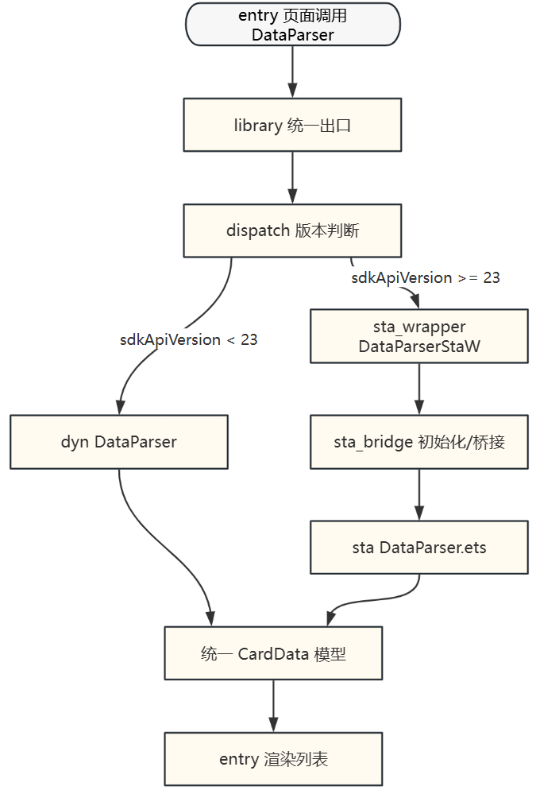

# ArkTS静态类型迁移改造案例

## 一套源码支持ArkTS动静态类型

本小节以开源示例工程为案例，说明如何在同一套业务代码中同时支持ArkTS-Dyn与ArkTS-Sta，并逐步完成从ArkTS-Dyn到ArkTS-Sta的迁移。

**案例工程地址：**

- 仓库：[示例工程](https://gitcode.com/openharmony/applications_app_samples/tree/master/code/ArkTS-Sta/ArkTSStaticSample)
- 说明文档：[示例工程说明文档](https://gitcode.com/openharmony/applications_app_samples/tree/master/code/ArkTS-Sta/ArkTSStaticSample/README.md)

### 案例目标

该工程聚焦以下三个目标：

1. 统一业务接口：对外仅暴露一套`DataParser`/`DataSource`/`CardData`等接口，业务层无感知。
2. 双实现并存： 在library内同时保留ArkTS-Dyn与ArkTS-Sta两套实现。
3. 运行时分发： 通过`dispatch`层按`sdkApiVersion`自动路由到ArkTS-Dyn或ArkTS-Sta。

这是一种典型的“先兼容、后替换”迁移路径，适合存量应用平滑演进。

### 工程结构与职责划分

核心目录可抽象为下图：

```text
entry（业务调用层）
  └── pages/Index.ets

library（能力实现层）
  ├── components/Index.ets                 # 统一出口
  ├── components/dispatch/DataParser.js    # 版本分发
  ├── components/dyn/*                     # 动态实现
  ├── components/sta/*                     # 静态实现
  ├── components/sta_wrapper/*             # sta 对 dyn 接口的适配
  ├── components/sta_bridge/*              # TS/ETS 桥接与静态实例初始化
  └── components/sta_dummy/*               # 静态兜底空实现
```

各层职责说明：

- **entry层：** 只调用统一接口，不直接依赖dyn/sta细节。
- **dispatch层：** 负责运行时判断并选择具体实现。
- **dyn/sta实现层：** 分别承载动态与静态代码逻辑，保持能力一致。
- **wrapper/bridge层：** 解决“静态实现如何适配动态接口”、“TS如何调用ETS”等迁移过程中的关键问题。

### 动态改造为静态的关键改造路径

**第一步：先收敛接口，再引入静态类型实现**

迁移前，常见问题是业务侧直接依赖具体实现。该案例先将能力集中在统一出口（`components/Index.ets`），业务仅依赖抽象接口。

改造原则：先做“接口统一”，再做“实现替换”。

**第二步：实现同构能力**

在不移除ArkTS-Dyn实现的前提下，补齐ArkTS-Sta版本的同名能力（如 `DataParser`、`DataSource`、`CardData`、`ResolverRegistry`）。

目标：保证ArkTS-Dyn/ArkTS-Sta目录在输入输出模型上保持一致，避免业务层分支判断。

**第三步：增加dispatch版本分发**

通过`dispatch/DataParser.js`按系统API版本进行路由：

- `sdkApiVersion >= 23`：使用静态实现包装器（如`DataParserStaW`）。
- `sdkApiVersion < 23`：使用动态实现（如`DataParserDyn`）。

这样可以在同一版本应用中实现“按设备能力自动选择最优实现”。

**第四步：通过wrapper+bridge解决互操作**

静态实现引入后，通常会遇到以下问题：

- 业务接口仍是dyn风格，sta需要适配输入输出；
- TS与ArkTS不能直接无缝调用，需要桥接初始化；
- 某些场景下需要兜底空实现保证链路可用。

该案例通过静态包装器`sta_wrapper`、静态桥接层`sta_bridge`以及静态占位层`sta_dummy`三层配合，形成可落地的迁移“中间层”方案。

### 运行链路（从调用到渲染）



该链路体现了迁移设计的核心：**实现可替换，接口不变更，业务低感知**。

### 案例复用

如果需要在自己的项目中复用该案例，可按以下顺序落地：

1. 梳理热点模块：优先选择解析、计算、长链路等可获得明显收益的模块。
2. 抽象统一接口：先把业务调用收敛到单一出口。
3. 并行维护双实现：保留dyn，新增sta同构实现。
4. 增加dispatch分发：先按API版本分流，后续可扩展为灰度开关。
5. 补齐适配与桥接层：处理dyn/sta数据结构转换。
6. 统一验收标准：同时验证功能一致性与性能收益。

### 案例价值总结

该工程的价值不在“替换某个文件”，而在提供了一套可复制的方法论：

- 架构上：统一接口 + 双实现 + 运行时分发；
- 工程上：wrapper/bridge/dummy分层解耦；
- 迁移上：支持渐进演进、风险可控、回退路径清晰。

对于存量ArkTS-Dyn应用，这是一条现实可行的静态化改造路径。

## ArkUI静态类型并行化改造

对于应用开发者来说，UI渲染性能是影响用户体验的关键因素之一。ArkTS静态类型提供了UI并行化创建能力，允许将组件树的创建过程从主线程迁移到子线程，从而降低主线程负载、减少页面渲染时延。本章节介绍如何将现有的ArkTS动态类型应用改造为使用并行化UI的静态类型应用。

### 改造概述

**并行化改造的价值**

传统UI渲染采用单线程串行创建方式，随着页面结构日益复杂，逐渐成为性能瓶颈。ArkTS静态类型提供的UI并行化能力可以带来以下收益：

| 收益类型 | 具体表现 |
|:---------|:---------|
| **降低主线程负载** | 将复杂的UI创建任务分散到子线程，释放主线程资源用于用户交互处理。 |
| **减少页面渲染时延** | 并行创建与主线程其他操作可同时进行，提升页面响应速度。 |
| **提升应用流畅度** | 减少因UI创建导致的卡顿，改善用户体验。 |
| **支持复杂页面构建** | 对于包含大量组件的复杂页面，性能提升更加明显。 |

**并行化改造的适用场景**

| 场景类型 | 适用性说明 | 改造收益 |
|:---------|:-----------|:---------|
| **大型复杂页面** | 页面包含大量组件（>50个），单次创建耗时长 | 高。 |
| **屏幕外内容** | 可延迟显示的内容、需滚动才能看到的区域 | 高。 |
| **List/Grid长列表** | 包含大量子项的列表或网格容器 | 较高。 |
| **页面切换场景** | 希望降低页面跳转响应时延 | 较高。 |
| **简单UI交互** | 仅包含少量组件的简单页面 | 低。 |

**并行化改造的API方式**

ArkTS静态类型提供了以下并行化API方式：

1. 声明式并行化 - ParallelizeUI

    | API接口 | 说明 | 适用场景 |
    |:---------|:-----|:---------|
    | `ParallelizeUI(options, content_)` | 基础声明式并行创建方法 | 不依赖外部状态变量的简单UI并行创建。 |
    | `ParallelizeUI<T>(options, param, content_)` | 支持状态变量传递的并行创建方法 | 需要使用外部状态变量的并行创建场景。 |
    | `ParallelizeUI<V, T>(options, arr, param, content_)` | 并行循环创建方法 | List/Grid长列表子项的并行创建场景。 |

2. 命令式并行化 - BuilderNode

    | API能力 | 说明 |适用场景 |
    |:---------|:-----|:---------|
    | `build(builder, params, { useParallel: true })` | BuilderNode并行构建能力 | 命令式创建节点树的复杂UI场景。 |

### ParallelizeUI并行化改造

**ParallelizeUI简介**

`ParallelizeUI`是声明式的并行化创建方法，其内部的UI在子线程中创建，创建完成后回到主线程完成树的挂载。后续更新、事件等操作仍在主线程中进行。

工作原理：


**基础用法改造**

原始代码（串行创建）：
```ts
// ArkTS-Dyn 示例
@Entry
@Component
struct Index {
  @State count: number = 0;
  @State listData: string[] = ['项目1', '项目2', '项目3'];

  build() {
    Column() {
      // 串行创建，所有组件在主线程创建
      Row() {
        Text(this.count.toString())
          .fontSize(24)
      }

      List({ space: 8 }) {
        ForEach(this.listData, (item: string) => {
          ListItem() {
            Text(item).fontSize(16)
          }
        })
      }
    }
  }
}
```

改造后代码（并行创建）：
```ts
'use static'

import { Entry, Text, Column, Component, Button, List, ListItem, Row, ForEach, State } from '@kit.ArkUI';
import { ParallelizeUI } from '@ohos.arkui.Parallelize';

@Entry
@Component
struct Index {
  @State count: int = 0;
  @State listData: string[] = ['项目1', '项目2', '项目3'];

  build() {
    Column() {
      // 使用ParallelizeUI并行创建Row组件
      ParallelizeUI(undefined) {
        Row() {
          Text(this.count.toString())
            .fontSize(24)
        }
      }

      // 使用ParallelizeUI并行创建List组件
      ParallelizeUI({ enable: true }) {
        List({ space: 8 }) {
          ForEach(this.listData, (item: string) => {
            ListItem() {
              Text(item).fontSize(16)
            }
          })
        }
      }

    }
  }
}
```

**状态变量传递改造**

在并行化环境中，不能直接使用外部定义的状态变量（如`@State`、`@Link`、`@PropRef`等），需要使用`ParallelizeUI<T>`重载接口通过参数传递。

错误用法（会导致运行时异常）：
```ts
'use static'

import { Entry, Text, Column, Component, State } from '@kit.ArkUI';
import { ParallelizeUI } from '@ohos.arkui.Parallelize';

@Entry
@Component
struct Index {
  @State str: string = 'Hello';

  build() {
    Column() {
      // 错误：ParallelizeUI内部不能直接使用外部状态变量
      ParallelizeUI(undefined) {
        Text(this.str)  // 会在Debug模式下触发运行时异常
          .fontSize(50)
      }
    }
  }
}
```

正确用法（通过参数传递）：
```ts
'use static'

import { Entry, Text, Column, Component, Button, ClickEvent, State } from '@kit.ArkUI';
import { ParallelizeUI } from '@ohos.arkui.Parallelize';

// 封装参数类
class Param {
  str: string;

  constructor(str: string) {
    this.str = str;
  }
}

@Entry
@Component
struct Index {
  @State str: string = 'Hello';

  build() {
    Column() {
      // 正确：使用ParallelizeUI<T>通过参数传递状态变量
      ParallelizeUI<Param>(undefined,
        () => {
          return new Param(this.str);
        }, // 在主线程构造参数
        (param: Param) => { // 在子线程使用参数
          Text(param.str)
            .fontSize(50)
        }
      )

      Button('UpperCase')
        .onClick((event: ClickEvent) => {
          this.str = this.str.toUpperCase() // 状态变量更新后，并行UI会在下一帧重新创建
        })
    }
  }
}
```

**List&Grid并行化改造**   

`ParallelizeUI`提供了循环创建重载接口`ParallelizeUI<V, T>`，用于并行化List和Grid的子组件创建。

改造前（串行创建List子项）：
```ts
// ArkTS-Dyn 或 ArkTS-Sta（串行）
List({ space: 10 }) { 
  ForEach(this.videoList, (item: VideoInfo) => { // VideoInfo与VideoCard为自定义的类型与组件
    ListItem() {
      VideoCard({ info: item })
    }
  })
}
```

改造后（并行创建List子项）：
```ts
'use static'

import {
  Entry,
  Text,
  Column,
  Component,
  List,
  ListItem,
  Image,
  Row,
  Stack,
  $r,
  ImageFit,
  Alignment,
  FontWeight,
  TextOverflow,
  State
} from '@kit.ArkUI';
import { ParallelizeUI } from '@ohos.arkui.Parallelize';

// 视频信息类
class Info {
  title: string
  up: string
  views: string
  likes: string
  coverRes: string

  constructor(title: string, up: string, views: string, likes: string, coverRes: string) {
    this.title = title
    this.up = up
    this.views = views
    this.likes = likes
    this.coverRes = coverRes
  }
}

@Entry
@Component
struct Index {
  @State arr: Array<Int> = [1];
  @State stateVar: string = 'state var';

  aboutToAppear() {
    for (let i = 2; i <= 50; i++) {
      this.arr.push(i)
    }
  }

  build() {
    Column() {
      List({ space: 10 }) {
        // 在List容器中使用时，仅按需并行创建当前可见的节点
        ParallelizeUI<Int, Info>({ enable: true }, this.arr,
          (item: Int, index: Int) => {
            const coverIndex = ((item - 1) % 5) + 1
            const coverResId = `app.media.cover${coverIndex}`
            return new Info(
              `【热门】搞笑视频 ${item}`,
              `UP主：用户${item}`,
              `${(Math.random() * 100).toFixed(1)}万播放`,
              `${(Math.random() * 1).toFixed(1)}万点赞`,
              coverResId
            )
          },
          (param: Info) => {
            ListItem() {
              Column() {
                // 封面
                Stack() {
                  Image($r(param.coverRes))
                    .width('100%')
                    .height(200)
                    .borderRadius(8)
                    .objectFit(ImageFit.Cover)
                    .alt('video cover')

                  // 播放量右下角浮层
                  Row() {
                    Text(param.views)
                      .fontSize(12)
                      .fontColor('#FFFFFF')
                      .backgroundColor('rgba(0,0,0,0.5)')
                      .borderRadius(10)
                  }
                  .align(Alignment.BottomEnd)
                }

                // 标题
                Text(param.title)
                  .fontSize(18)
                  .fontWeight(FontWeight.Medium)
                  .maxLines(2)
                  .textOverflow({ overflow: TextOverflow.Ellipsis })

                // 底部信息行（up主、点赞量）
                Row() {
                  Text(param.up)
                    .fontSize(14)
                    .fontColor('#888')

                  Text(` · ${param.likes}`)
                    .fontSize(14)
                    .fontColor('#888')
                }
              }
              .backgroundColor('#FFFFFF')
              .borderRadius(12)
              .padding(8)
            }
            .width('100%')
          }
        )
      }
      .width('100%')
      .height('100%')
      .padding(10)
      .backgroundColor('#F8F8F8')
    }
  }
}
```

并行化List/Grid的特点：
- **按需创建：** 仅并行创建当前可见区域内的节点。
- **自动回收：** 节点滑出可见区域后自动释放。
- **滚动优化：** 滚动过程中并行创建即将显示的节点。

### BuilderNode并行化改造

**BuilderNode并行化简介**

`BuilderNode`提供命令式的节点创建能力，支持在子线程完成复杂UI的创建与更新。其并行化能力适用于：

- 构建/更新节点数量较多的复杂UI。
- 页面切换过程中降低响应时延。
- 数据加载完成后无需等待主线程空闲，直接在子线程开始构建。

**改造方式**

`BuilderNode`的并行化改造非常简单，只需在调用`build`方法时传入`useParallel: true`参数：

改造前（串行构建）：
```ts
// 串行构建
let builderNode = new BuilderNode<Params>(uiContext, renderOptions);
builderNode.build(wrapBuilder(MyBuilder), new Params("data")); // 默认串行
```

改造后（并行构建）：
```ts
// 并行构建
let builderNode = new BuilderNode<Params>(uiContext, renderOptions);
builderNode.build(
  wrapBuilder(MyBuilder),
  new Params("data"),
  { useParallel: true }  // 开启并行构建
);
```

**完整改造示例**

```ts
'use static'

import {
  Builder,
  Button,
  Column,
  Component,
  Entry,
  NodeContainer,
  wrapBuilder,
  Text,
  UIContext,
  Size,
} from '@kit.ArkUI';
import {
  BuilderNode, NodeController, FrameNode, NodeRenderType, RenderOptions,
} from '@ohos.arkui.node';

// 自定义参数
class Params {
  text: string;

  constructor(text: string) {
    this.text = text;
  }
}

// Builder 函数
@Builder
function MyBuilder(params: Params) {
  Column() {
    Text(params.text).fontSize(20)
    Text("这是 BuilderNode 创建的内容")
  }
  .width('100%')
  .height(100)
}

class MyNodeController extends NodeController {
  private builderNode?: BuilderNode<Params>;
  private uiContext?: UIContext;

  makeNode(uiContext: UIContext): FrameNode | null {
    this.uiContext = uiContext;

    let renderOptions: RenderOptions = {
      selfIdealSize: { width: 100, height: 100 } as Size,
      type: NodeRenderType.RENDER_TYPE_DISPLAY
    };

    let builderNode: BuilderNode<Params> = new BuilderNode<Params>(uiContext, renderOptions);

    // 并行执行 build
    builderNode.build(
      wrapBuilder(MyBuilder),
      new Params("并行构建"),
      { useParallel: true }  //  关键：开启并行构建
    );

    this.builderNode = builderNode;
    return builderNode.getFrameNode()!;
  }

  updateNode() {
    // 如果节点尚未挂载，更新操作也会并行执行
    this.builderNode?.update(new Params("更新数据"));
  }

  dispose() {
    this.builderNode?.dispose();
    this.builderNode = undefined;
  }
}

@Entry
@Component
struct Page {
  private nodeController: MyNodeController = new MyNodeController();

  build() {
    Column() {
      NodeContainer(this.nodeController)
        .width('100%')
        .height(200)

      Button("更新内容")
        .onClick(() => {
          this.nodeController.updateNode();
        })
    }
  }
}
```

### 并行化改造的约束与限制

**状态变量使用约束**

| 约束类型 | 说明 | 解决方案 |
|:---------|:-----|:---------|
| **禁止使用外部状态变量** | `@State`、`@Link`、`@PropRef`、`@Consumer`、`@StorageLink`、`@StoragePropRef`、`@LocalStorageLink`、`@LocalStoragePropRef`不能在`ParallelizeUI`中直接使用 | 使用`ParallelizeUI<T>`通过参数传递。 |
| **普通变量需注意线程安全** | 普通变量可在多线程中使用，但需确保读写安全 | 使用线程安全容器或锁保护。 |

**组件支持约束**

当前`ParallelizeUI`暂不支持以下组件，使用会触发运行时错误：

| 不支持的组件 | 替代方案 |
|:-----------|:---------|
| `Web` | 暂无并行化方案。 |
| `RichText` | 使用`Text`组件替代。 |
| `WithTheme` | 在并行区域外使用。 |

**性能约束**

| 约束项 | 说明 | 建议 |
|:-------|:-----|:-----|
| **任务调度开销** | 每个并行任务有调度开销 | 每个任务内的组件数量应大于50个以优化性能。 |
| **显示时延** | 并行创建的UI在下一帧才显示 | 适用于对实时性要求不高的内容。 |
| **更新仍在主线程** | 创建后的更新操作仍在主线程 | 重点优化创建阶段。 |

### 性能验证

**使用SmartPerf-Host抓取Trace**

1. 按照 [使用SmartPerf-Host分析应用性能](https://gitcode.com/openharmony/docs/blob/OpenHarmony_feature_20250702/zh-cn/application-dev/performance/performance-optimization-using-smartperf-host.md) 文档进行配置。
2. 抓取应用启动或页面跳转的Trace。
3. 查看`parallelize build`相关Trace片段。

并行化成功的标志：子线程[Thread-XXXX]中存在"parallelize build"的Trace。

**关键性能指标对比**

| 指标 | 测量方法 | 期望效果 |
|:-----|:---------|:---------|
| **页面响应时延** | 从点击事件到首帧显示的时间 | 降低10%~30% |
| **主线程阻塞时间** | 主线程执行创建任务的耗时 | 显著降低 |
| **首帧渲染时间** | 第一帧完整渲染的时间 | 保持或改善 |

**实际案例性能数据**

根据官方示例测试数据：

| 场景 | 并行创建时延 | 串行创建时延 | 优化比例 |
|:-----|:------------|:------------|:---------|
| **声明式UI页面** | 87ms | 98.5ms | 11.7% |
| **BuilderNode构建** | 53.6ms | 74.8ms | 28.3% |
| **List/Grid列表** | 26.2ms | 31.0ms | 15.4% |

### 改造建议与案例

**改造优先级建议**

高优先级：
1. 包含大量组件的复杂页面（组件数 > 100）。
2. List/Grid长列表场景（子项数 > 50）。
3. 页面切换响应时延 > 100ms。

中优先级：
1. 中等复杂度页面（组件数 50~100）。
2. 有卡顿（响应时延 > 200ms）的用户反馈。

低优先级：
1. 简单交互页面（组件数 < 50）。


**改造步骤建议**

1. **性能分析：** 使用HiTrace或SmartPerf-Host定位性能瓶颈。
2. **场景识别：** 确定哪些页面或组件适合并行化改造。
3. **小规模验证：** 选择单个页面进行改造验证。
4. **效果评估：** 对比改造前后的性能指标。
5. **逐步推广：** 根据验证结果决定是否推广到其他页面。

**常见问题**

| 问题 | 原因 | 解决方案 |
|:-----|:-----|:---------|
| Debug模式下崩溃 | 在`ParallelizeUI`中使用了外部状态变量 | 使用`ParallelizeUI<T>`通过参数传递。 |
| 性能提升不明显 | 组件数量太少，调度开销大于并行收益 | 增加并行任务的组件数量，或取消并行化。 |
| 显示内容有延迟 | 并行内容在下一帧才显示 | 将重要内容改为串行创建。 |
| 编译错误 | 使用了不支持的组件 | 移除不支持的组件或调整并行区域。 |
