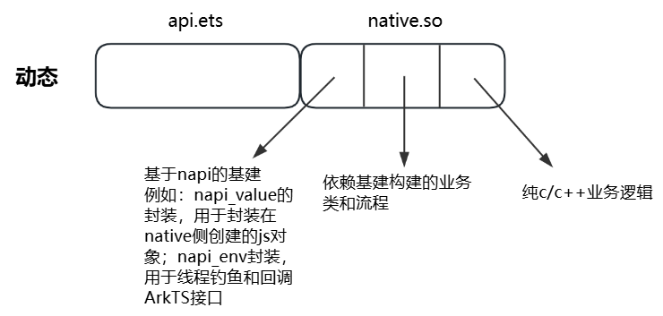
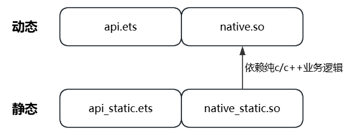
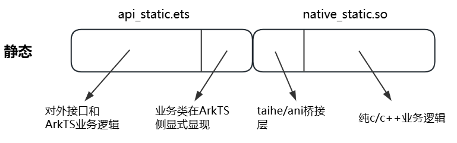
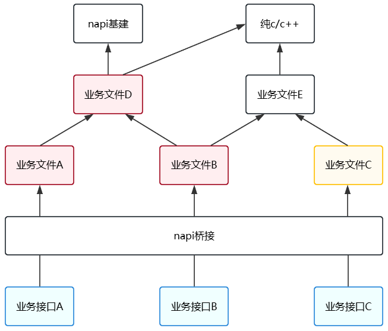
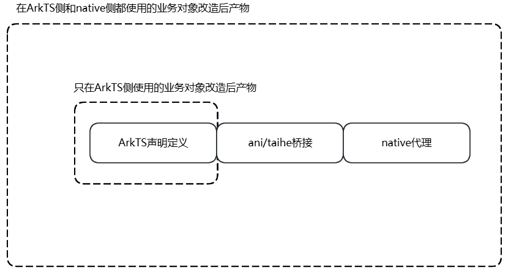
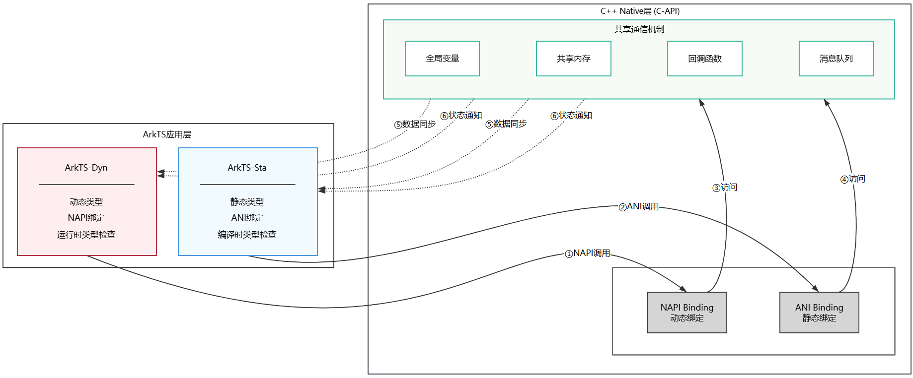

# ArkTS静态类型改造案例

## 大批量动态类型对象高效地转换为静态类型对象

**场景描述**

原始场景，本模块提供了用于对象属性遍历赋值的通用方法，使用ts编写，入参from来自其他模块，to由本模块维护，代码如下：
```typescript
function objectAssign(from: Object, to: Object): void {
  for (let key in from) {
    to[key] = from[key];
  }
}
```

在需要保持向后兼容的场景中，出于兼容性考虑，保持接口行为与改造前一致。改造范围为本模块接口，自此，to变成了静态对象，而from是在静态上下文中使用的动态对象。受ArkTS语法限制，结合静态语法的强类型理念，需要明确from和to中的数据结构，使用互操作接口实现，改造后代码如下：
```typescript
'use static'

// to的详细数据结构需要从业务中分析出来，并且明确类型
// 这里举例to的类型只有一种，拥有3个属性，每个属性都是可选的
interface ToType {
  aNum?: number,
  bStr?: string,
  cBool?: boolean,
}

// 通过属性逐个赋值，进行对象数据转换，从动态对象from中获取属性值，需要使用ESValue的接口
function objectAssign(from: ESValue, to: ToType): void {
  to.aNum = from.hasProperty('aNum') ? from.getProperty('aNum').toNumber() : 0;
  to.bStr = from.hasProperty('bStr') ? from.getProperty('bStr').toString() : '';
  to.cBool = from.hasProperty('cBool') ? from.getProperty('cBool').toBoolean() : false;
}
```

- 首先，在应用实际业务场景中，这里存在两种情况。

第一种，ToType明确为多种数据结构，可以基于只有一种数据结构的代码，对to类型扩展，使用联合类型声明和条件判断逻辑解决：
```typescript
'use static'

interface ToTypeA {
  aNum?: number,
  bStr?: string,
  cBool?: boolean,
}

interface ToTypeB {
  dNum?: number,
  eStr?: string
}

// to对象是联合类型
type ToType = ToTypeA | ToTypeB;

// 1. 条件分支进行不同类型的不同处理逻辑
// 2. 通过属性逐个赋值，进行对象数据转换，从动态对象from中获取属性值，需要使用ESValue的接口
function objectAssign(from: ESValue, to: ToType): void {
  if (to instanceof ToTypeA) {
    to = to as ToTypeA;
    to.aNum = from.hasProperty('aNum') ? from.getProperty('aNum').toNumber() : 0;
    to.bStr = from.hasProperty('bStr') ? from.getProperty('bStr').toString() : '';
    to.cBool = from.hasProperty('cBool') ? from.getProperty('cBool').toBoolean() : false;
  } else if (to instanceof ToTypeB) {
    to = to as ToTypeB;
    to.dNum = from.hasProperty('dNum') ? from.getProperty('dNum').toNumber() : 0;
    to.eStr = from.hasProperty('eStr') ? from.getProperty('eStr').toString() : '';
  }

}
```

第二种，ToType无法明确具体结构，这种情况下，如果要保持行为与改造前一致，在静态上只能使用反射方式实现，目前反射特性尚未明确给出，且性能方面从业界通用反射技术方案来看（例如Java的反射机制），一定不是最优解。
因此对于这种情况，为了保障执行性能，结合静态语法的强类型理念，应用业务设计角度需要进行优化，将“无法明确具体结构”的设计方案，修改为“可穷举”的设计方案，再使用第一种情况进行改造。

- 其次，基于上述方案改造后，存在不稳定的隐患。

如果数据结构很复杂，代码行数会增加，导致可维护性差，且由于当前属于互操作场景，互操作的次数也会增加，导致性能劣化加剧。针对这样的情况，简单的平迁改造方案就不再适用了，优化的方向主要为尽可能减少互操作次数。
从对象转换的场景来看，分析其他模块提供的数据与本模块在数据结构定义上紧密依赖，因此衍生出额外两种改造方案：
1. 评估将数据提供模块也纳入静态化改造范围，则执行对象转换的上下文，就是纯静态的了：
```typescript
'use static'

interface FromType {
  aNum?: number,
  bStr?: string,
  cBool?: boolean,
}

interface ToType {
  aNum?: number,
  bStr?: string,
}

// 直接取值赋值即可，性能敏感场景最优解
function objectAssign(from: FromType, to: ToType): void {
  to.aNum = from.aNum;
  to.bStr = from.bStr;
}
```

2. 数据提供模块无法进行改造的，将传输数据进行序列化操作，例如JSON处理后，以json字符串形式作为入参，大大减少互操作取值的操作。
```typescript
'use static'

interface FromType {
  aNum?: number,
  bStr?: string,
  cBool?: boolean,
}

class ToType {
  aNum?: number = 0;
  bStr?: string = '';
}

// 通过JSON解析为静态对象，后续直接取值赋值即可
function objectAssign(from: string, to: ToType): void {
  const fromData = JSON.parse<FromType>(from, Type.from<FromType>());
  to.aNum = fromData!.aNum;
  to.bStr = fromData!.bStr;
}
```

## ESValue基础用法
详见：[ESValue的基础用法](https://gitcode.com/openharmony/arkcompiler_runtime_core/blob/master/static_core/plugins/ets/runtime/interop_js/docs/ESValueApi_cn.md)

## 动态enum传入静态中如何使用
```TS
// ========== 动态文件 DynamicModule.ets ==========
// 动态代码中定义的枚举
export enum ProcessStatus {
  IDLE = 0,
  RUNNING = 1
}


//  ========== 静态文件 StaticModule.ets ==========
'use static'

/**
 * 处理从动态代码传递过来的枚举值
 * @param statusValue动态枚举值（Any类型）
 */
function handleProcessStatus(statusValue: Any): void {
  // 1. 加载动态模块
  let dynamicModule: ESValue = ESValue.load("library/src/main/ets/DynamicModule");

  // 2. 获取枚举对象
  let statusEnum: ESValue = dynamicModule.getProperty("ProcessStatus");

  // 3. 获取各个枚举值并转换为数字
  const idleStatus: number = statusEnum.getProperty("IDLE").toNumber();
  const runningStatus: number = statusEnum.getProperty("RUNNING").toNumber();

  // 4. 使用switch进行分支处理
  switch (statusValue) {
    case idleStatus:
      console.log("当前状态：空闲");
      break;
    case runningStatus:
      console.log("当前状态：运行中");
      break;
    default:
      console.log("未知状态");
      break;
  }
}

// 动态中使用静态enum，正常import使用即可。
```
## 动态Record传入静态中如何使用
动态语言中Record是类型，静态语言中是类。跨语言传递时，运行时实际得到的是动态语言中的普通对象(plain object)，而非Record类。
```TS
// ========== 动态文件 DynamicModule.ets ==========
export let dataRecord: Record<string, string> = {
  "name": "jack",
  "age": "20"
}


//  ========== 静态文件 StaticModule.ets ==========
'use static'
import { dataRecord } from 'library';

/**
 * 处理从动态代码传递的record
 * @param dataRecord 动态record（Any类型）
 */
function transferToSta(dataRecord: Any): void {
  let dataRecordDyna: ESValue = ESValue.wrap(dataRecord);
  //1:获取指定key对应的value
  let valueDyna: string = dataRecordDyna.getProperty("name").toString();
  //2:静态中遍历动态record
  for (const d of dataRecordDyna.keys()) {
    //3:打印动态record的key值
    console.log("dataRecordDyna keys:" + d.toString());
    //4:打印动态record中的value
    console.log("dataRecordDyna value:" + dataRecordDyna.getProperty(d.toString()).toString());
  }
}

transferToSta(dataRecord);
```

## 静态Record传入动态中如何使用
```typescript
// ========== 静态文件 StaticModule.ets ==========
'use static'

/**
 * 从静态代码返回 Record
 * @returns Record<string, string> 返回键值对记录
 */
export function getRecordFromSta(): Record<string, string> {
  // 创建静态 Record 对象
  let dataRecord: Record<string, string> = {
    "name": "jack",
    "age": "20"
  }
  return dataRecord; // 返回给动态代码使用
}

/**
 * 在静态代码中遍历 Record，逐个将值传给动态代码处理
 */
export function processRecords(): void {
  // 获取静态 Record
  let data: Record<string, string> = getRecordFromSta();

  // 静态中可以正常遍历 Record
  for (let k of data.keys()) {
    let v: string | undefined = data[k]; // 获取对应key的value

    // 通过 ESValue 调用动态代码的方法，传递包装后的值
    ESValue.load("DynamicModule").invokeMethod("processRecordValue", ESValue.wrap(v)); // DynamicModule为对应动态文件地址
  }
}

// ========== 动态文件 DynamicModule.ets ==========
import { getRecordFromSta } from 'StaticModule' // 从对应StaticModule路径内导入

/**
 * 处理从静态代码返回的record
 */
function processRecord(): void {
  // 调用静态代码获取 Record
  let recordSta: Record<string, string> = getRecordFromSta();

  // ✓ 直接通过索引访问 - 无感使用，可以正常获取值
  let value: string = recordSta["name"];

  // ✗ 动态中无法对静态record进行遍历，下面是错误写法
  // Object.entries(recordSta).forEach((key, value) => {
  //   console.log(key, value);
  // });
  processRecordValue(value);
}

/**
 * 处理从静态代码传递过来的单个record值
 * @param value Record中的某个值
 */
export function processRecordValue(value: string): void {
  console.log("processRecordValue:" + value);
}
```

## JSON序列化和反序列化操作，动静态对比

- 动态语法，JSON序列化和反序列化如下：
```typescript
const str = "{ \"a\": 1, \"b\": \{ \"c\": true \} }";

// 动态反序列化
const jsonObj: object = JSON.parse(str);
// 动态序列化
const jsonStr = JSON.stringify(jsonObj);
```

- 静态环境中，需要针对不同应用场景区分处理方法。

### 场景一：json字符串表达的内容，拥有明确数据结构的业务数据

使用 `JSON.parse` 和 `JSON.stringify` 进行类型安全的序列化和反序列化操作。

```typescript
'use static'

let loginInfoStr: string = "{ \"userId\": \"123\", \"userInfo\": \{ \"token\": \"xxxxx\", \"vip\": true \} }";

class userInfoCls {
  token?: string;
  vip?: boolean;
}

class loginInfoCls {
  userId?: string;
  userInfo?: userInfoCls;
}

// 静态反序列化（基础用法）
try {
  const jsonObj: loginInfoCls | null | undefined = JSON.parse<loginInfoCls>(loginInfoStr, Type.from<loginInfoCls>());
  // 静态序列化
  const jsonStr: string = JSON.stringify(jsonObj);
} catch (error) {
  const err: Error = error as Error;
  console.error(`JSON解析失败: ${err.message}`);
}

// 静态反序列化（带reviver和options）
// reviver：用于数据转换、过滤、校验等自定义处理
const reviver = (key: string, value: Any): Any => {
  if (key == "userId" && typeof value === 'String') {
    return `id_${(value as string)}`; // 对userId进行转换
  }
  return value;
};

// options：用于控制解析行为，主要是BigInt的处理策略
const options: jsonx.ParseOptions = {
  bigIntMode: jsonx.BigIntMode.PARSE_AS_BIGINT
} as jsonx.ParseOptions;

try {
  const jsonObj = JSON.parse<loginInfoCls>(loginInfoStr, reviver, Type.from<loginInfoCls>(), options);
} catch (error) {
  const err: Error = error as Error;
  console.error(`JSON解析失败: ${err.message}`);
}
```

### 场景二：json字符串内容不明，且需要对json结果进行增删改查操作

使用 `JSON.parseJsonElement` 和 `JSON.stringifyJsonElement` 进行灵活的JSON操作。

```typescript
'use static'

const str: string = "{ \"a\": 1, \"b\": \{ \"c\": true \} }";

// 静态反序列化（基础用法）
try {
  const jsonElement: jsonx.JsonElement = JSON.parseJsonElement(str);

  // 取值 - 严格模式（key不存在会抛异常）
  const aVal: jsonx.JsonElement = jsonElement.getElement("a");
  console.info(aVal.asInteger()); // 1

  // 取值 - 宽松模式（key不存在返回undefined）
  const notExistVal = jsonElement.tryGetElement("notExist");
  if (notExistVal !== undefined) {
    console.info(notExistVal.asString());
  }

  // 设值
  jsonElement.setElement('d', jsonx.JsonElement.createString('dVal'));

  // 删除元素
  const removed = jsonElement.removeElement('a');

  // 静态序列化
  const jsonStr: string = JSON.stringifyJsonElement(jsonElement);
} catch (error) {
  const err: Error = error as Error;
  console.error(`JSON操作失败: ${err.message}`);
}

// 静态反序列化（带reviver）
// reviver：用于数据转换、过滤、校验等自定义处理
const reviver = (key: string, value: jsonx.JsonElement): jsonx.JsonElement => {
  if (key === "a") {
    return jsonx.JsonElement.createInteger(value.asInteger() * 2); // 对a值进行转换
  }
  return value;
};

try {
  const jsonElement: jsonx.JsonElement = JSON.parseJsonElement(str, reviver);
} catch (error) {
  const err: Error = error as Error;
  console.error(`JSON解析失败: ${err.message}`);
}
```

### 注意事项

1. **错误处理：** 静态语法下JSON操作可能抛出异常，必须用try-catch包裹。
2. **严格模式vs宽松模式：**
   - 严格模式：`getElement`/`getString`/`getInteger` 等，key不存在会抛异常。
   - 宽松模式：`tryGetElement`/`tryGetString`/`tryGetInteger` 等，key不存在返回undefined或默认值。
3. **BigInt处理：** 通过 `ParseOptions` 的 `bigIntMode` 控制超出JavaScript安全整数范围(±2^53-1)的整数的解析行为：
   - `DEFAULT`：不支持BigInt，超出long范围会报错。
   - `PARSE_AS_BIGINT`：当整数小于-(2^53-1)或大于(2^53-1)时，解析为BigInt。
   - `ALWAYS_PARSE_AS_BIGINT`：所有整数都解析为BigInt。
4. **性能考虑：** 明确数据结构时使用 `JSON.parse` 性能更好，不确定结构时使用 `JSON.parseJsonElement`。

### 相关资料

JSON相关资料详见：[JSON](../reference/native-lib/arkts-sta-json.md)。

jsonx相关资料详见：[jsonx](../reference/native-lib/arkts-sta-jsonx.md)。


## EAWorker的使用以及提交任务到主线程执行
[EAWorker的基本使用](../reference/native-lib/eaworker_managed.md)。

EAWorker通过一个独立运行的线程来实现其功能，需要开发者创建、启动和销毁该线程。
以下是示例代码：
```typescript
// ========== 静态文件 StaticModule.ets ==========
'use static'

export function foo(): void {
  //第二个参数表明需要开启interop,如果提交的任务中存在动态代码,会开启一个动态虚拟机
  let eaw: EAWorker = new EAWorker("workerTask", true);
  //开启EAWorker
  eaw.start();
  //设置优先级
  eaw.setPriority(WorkerPriority.PRIORITY_HIGH);
  //向worker提交任务
  eaw.run(taskA)
  //主动销毁Worker线程资源
  eaw.join();
}

//在子线程中执行的任务
export function taskA(): void {
  //如果某些任务必须在主线城中执行，可以使用PostToMain接口
  const job = EAWorker.postToMain<boolean>(taskB);
  //获取任务执行结果
  let jobresult: boolean = job.Await();
}

export function taskB(): boolean {
  /// 必须在主线程执行的r任务
  return true;
}
```

## transfer，系统对象动静态转换

transfer是ArkTS-Sta专属的系统对象转换工具，用于在ArkTS-Sta和ArkTS-Dyn之间进行系统对象的互操作转换。

### 场景一：ArkTS-Dyn对象转换为ArkTS-Sta对象

当需要将ArkTS-Dyn环境中的系统对象传递给ArkTS-Sta环境使用时，使用 `transfer.transferStatic` 进行转换：

```typescript
'use static'

import { transfer } from '@kit.ArkTS';

// ArkTS-Sta环境中的函数，接收来自ArkTS-Dyn的ArrayBuffer对象
function processDynamicArrayBuffer(dynamicArrayBuffer: Any): void {
  // 将ArkTS-Dyn的ArrayBuffer转换为ArkTS-Sta的ArrayBuffer
  let staticArrayBuffer: ArrayBuffer =
    transfer.transferStatic(dynamicArrayBuffer, 'InteropTransferHelper') as ArrayBuffer;

  // 现在可以在ArkTS-Sta环境中使用转换后的ArrayBuffer
  console.info(`ArrayBuffer length: ${staticArrayBuffer.byteLength}`);

  // 创建Int8Array视图进行操作
  let int8Array = new Int8Array(staticArrayBuffer);
  for (let i: int = 0; i < int8Array.length; i++) {
    console.info(`index ${i}: ${int8Array[i]}`);
  }
}
```

### 场景二：ArkTS-Sta对象转换为ArkTS-Dyn对象

当需要将ArkTS-Sta环境中的系统对象传递给ArkTS-Dyn环境使用时，使用 `transfer.transferDynamic` 进行转换：

```typescript
'use static'

import { transfer } from '@kit.ArkTS';

// 在ArkTS-Sta环境中创建ArrayBuffer
let staticArrayBuffer: ArrayBuffer = new ArrayBuffer(8);
let view = new Int8Array(staticArrayBuffer);
view[0] = 42;

// 将ArkTS-Sta的ArrayBuffer转换为ArkTS-Dyn的ArrayBuffer
let dynamicArrayBuffer: Any = transfer.transferDynamic(staticArrayBuffer, 'InteropTransferHelper');

// 调用ArkTS-Dyn环境中的函数
let jsModule: ESValue = ESValue.load('./dynamic-module'); // 入参为对应自定义dynamic-module的地址
let processFunc: ESValue = jsModule.getProperty('processArrayBuffer');
processFunc.invoke(ESValue.wrap(dynamicArrayBuffer));
```

### 场景三：跨线程传递系统对象

在多线程场景中，当需要在不同线程间传递系统对象时，也需要使用transfer进行转换：

```typescript
'use static'

import { transfer } from '@kit.ArkTS';

// 在主线程中创建ArrayBuffer
let mainArrayBuffer: ArrayBuffer = new ArrayBuffer(1024);

// 将主线程的ArrayBuffer转换为可跨线程传递的格式
let transferableArrayBuffer: Any = transfer.transferDynamic(mainArrayBuffer, 'InteropTransferHelper');

// 在子线程中的函数
function workerTask(data: Any): void {
  // 在子线程中将数据转换回ArkTS-Sta的ArrayBuffer
  let workerArrayBuffer: ArrayBuffer = transfer.transferStatic(data, 'InteropTransferHelper') as ArrayBuffer;

  console.info(`Worker received ArrayBuffer length: ${workerArrayBuffer.byteLength}`);
}

// 创建任务并执行
let task = new taskpool.Task(workerTask, transferableArrayBuffer);
taskpool.execute(task).then(() => {
  console.info('Task completed');
});
```

### 场景四：处理UI事件对象

当需要将ArkTS-Dyn中的UI事件对象传递给ArkTS-Sta处理时：

```typescript
'use static'

import { transfer } from '@kit.ArkTS';

// ArkTS-Sta环境中处理来自ArkTS-Dyn的ClickEvent
function handleDynamicClickEvent(dynamicClickEvent: Any): void {
  // 将ArkTS-Dyn的ClickEvent转换为ArkTS-Sta的ClickEvent
  let staticClickEvent = transfer.transferStatic(dynamicClickEvent, 'ArkUI.ClickEvent');

  // 使用转换后的ClickEvent
  console.info(`Click event received`);
}
```

### 支持的转换对象类型

transfer支持以下系统对象的转换：

| key值 | 系统对象类型 |
|--------|-------------|
| "InteropTransferHelper" | ArrayBuffer |
| "ArkUI.NavDestinationInfo" | NavDestinationInfo |
| "ArkUI.NavigationInfo" | NavigationInfo |
| "ArkUI.RouterPageInfo" | RouterPageInfo |
| "AbilityKit.UIAbilityContext" | UIAbilityContext |
| "ArkUI.DrawableDescriptor" | DrawableDescriptor |
| "ArkUI.DragEvent" | DragEvent |
| "ArkUI.KeyEvent" | KeyEvent |
| "ArkUI.TouchEvent" | TouchEvent |
| "ArkUI.MouseEvent" | MouseEvent |
| "ArkUI.AxisEvent" | AxisEvent |
| "ClickEvent" | ClickEvent |
| "ArkUI.HoverEvent" | HoverEvent |
| "ArkUI.EventTargetInfo" | EventTargetInfo |
| "ArkUI.TouchTestInfo" | TouchTestInfo |
| "ArkUI.ScrollableTargetInfo" | ScrollableTargetInfo |
| "ArkUI.FrameNode" | FrameNode |
| "ArkUI.RenderNode" | RenderNode |
| "ArkUI.UIContext" | UIContext |
| "ImageKit.PixelMap" | PixelMap |
| "ImageKit.ImageSource" | ImageSource |
| "ImageKit.Picture" | Picture |
| "ImageKit.ImageCreator" | ImageCreator |
| "ImageKit.ImagePacker" | ImagePacker |
| "ImageKit.ImageReceiver" | ImageReceiver |
| "ArkWeb.WebMessagePort" | WebMessagePort |
| "ArkWeb.JsResult" | JsResult |

### 注意事项

1. **仅限ArkTS-Sta使用：** transfer只能在ArkTS-Sta环境中使用，ArkTS-Dyn环境无法使用。
2. **key值必须匹配：** 转换时必须使用正确的key值，否则会抛出错误`Transfer Error. The input name is not supported!`。
3. **错误处理：** 建议使用try-catch包裹转换操作，处理可能的转换错误。
4. **性能考虑：** 系统对象转换有一定开销，应避免频繁转换。
5. **对象生命周期：** 转换后的对象与原对象共享底层资源，需要注意对象的生命周期管理。

### 错误处理示例

```typescript
'use static'

import { transfer } from '@kit.ArkTS';

function safeTransfer(dynamicObj: Any): Object | undefined {
  try {
    return transfer.transferStatic(dynamicObj, 'InteropTransferHelper');
  } catch (error) {
    const err: Error = error as Error;
    console.error(`Transfer failed: ${err.message}`);
    return undefined;
  }
}

safeTransfer(undefined);
// arkts.console: Transfer failed: dynamicObject is null or undefined
```

### 相关资料
[@ohos.transfer (系统对象转换工具)](https://gitcode.com/openharmony/docs/blob/OpenHarmony_feature_20250702/zh-cn/application-dev/reference/apis-arkts/js-apis-transfer.md)。

## napi2ani改造，业务对象深度耦合

### 背景知识

官方资料中，已经提供了napi2ani的迁移指南，然而，对于复杂类型定义这块，只提供了基础类型改造的示例，本案例结合实际应用场景，提供一个改造方法，解决当应用业务深度耦合NAPI时，如何执行向ANI的迁移动作，本案例也会使用Taihe减少迁移工作量。

### 现状梳理

首先展示案例中基于NAPI的模块架构设计：



图中可以看出，Native代码逻辑被分成了三块，之所以这样区分出来，是因为NAPI和ANI在复杂类型定义中的区别。
- NAPI保留了JavaScript的动态类型机制，类型检查在运行时进行，并支持在运行过程中动态创建类型；
- ANI不支持动态创建类型，所有自定义类型必须在ets文件中进行明确定义；

所以想要迁移至ANI，**基于NAPI的基建**和**依赖基建构建的业务类和流程**，都需要进行改造.

### 改造方案

由于案例对应的模块包含超过50个业务类和200个流程接口，如果对其进行全量改造，预计需要10人月的工作量，故最终决定按照业务流程，从其中独立的业务类和流程入手，进行阶段性改造，改造后的模块架构如下：



其中涉及改造的业务类，其向外提供的ArkTS接口部分采用静态语法实现，其Native采用ANI/Taihe桥接ArkTS，抽出来的静态部分模块架构细节如下，其中较为明显的改动方向，是将原本在Native侧动态创建的业务类挪到ArkTS侧显式实现，通过向C/C++传递ArkTS类指针、对象指针、回调函数实现Native调用。




### 改造要点

1. 如何确定改造范围。

    因为改造步骤将分阶段进行，所以如何圈定改造范围，是进行ANI迁移以及保障迁移后流程正常的关键步骤，这一步取决于原始业务架构设计的复杂度和耦合度，这里提供一种确定方法。

    首先，按照改造流程，以业务类/文件为单位，确定涉及改造的一个或者多个业务类/文件；然后，查看这些类/文件是否依赖了NAPI构建，若是，则其必须进行改造，判断是否依赖NAPI有两种情况，类/文件中是否直接包含NAPI，或者，其依赖的模块或者继承的类中包含NAPI。一般来说，业务类/文件都是叶子节点，所以可以从叶节点开始向上查看依赖，一直查找到两种节点，即可停止查找，一种是纯C的依赖，因为纯C不需要改造，另一种是非业务的NAPI的基建依赖，因为依赖NAPI的这套深度耦合方案在ANI上无法实现，所以只需要提取流程中的业务单元即可。
    下面呈现了简单的业务类/文件依赖关系，结合上述方法，进行说明。
   - 首先确定业务接口A、B、C为改造流程，则其依赖的业务文件A、B、C为改造范围叶节点文件。
   - 由于A、B向上依赖链路中有NAPI相关，故其依赖的业务文件D也需要加入改造范围。
   - C其实向上全是纯C/C++业务，故本身其实并不需要大改，只需要将与NAPI的桥接换成ANI即可。
    
    最终圈定的改造范围就是**业务文件A、B、C（部分）、D**。

   

2. 动态对象如何静态实现。

    根据NAPI的动态特性，允许开发者在运行时创建动态对象并赋予对象属性和方法，深度耦合的应用架构就是依赖这个能力，构建了动态创建业务对象的这一套方案，然而ANI上不支持动态创建对象，业务对象都必须使用ArkTS文件进行声明定义。根据业务使用情况，静态实现，可以分为一下两种情况：

    - 业务对象的使用仅在ArkTS侧进行；
    - 业务对象的使用在ArkTS侧和Native侧都有；

    两者的区别仅看业务是否会在Native侧调用业务对象的方法或属性，由于静态语法必须使用ArkTS文件进行声明定义，则天然支持业务对象在ArkTS侧使用，当其需要在Native侧调用方法或属性时，就需要在Native侧提供一个业务代理类来支持业务行为，改造迁移的变化如下：

   

3. 新逻辑桥接旧逻辑需要注意什么。

    由于新的业务逻辑由ANI实现，在很多特性方面跟NAPI还是有区别的，不同于ArkTS-Sta和ArkTS-Dyn的互操作，C/C++层面并没有互操作接口，所以，业务侧需要严格判断改造业务流程的交互情况，主要可以分为以下两种。
    
    - 业务流程执行过程中只有ArkTS静态绑定和Native的交互。
    - 业务流程中存在需要调用NAPI接口的业务逻辑。
    
    对于只有纯静态和Native交互的业务流程，在ANI改造和功能调试完成后即完结；对于存在最终走到NAPI依赖的业务逻辑的情况，需要判断线程行为，因为静态线程天然内存共享，而动态则是线程隔离的，虽然纯C/C++也是内存共享的，但是如果业务逻辑中最终调用到的是napi_value相关的行为，则需要考虑当前线程是否可以获取、是否需要添加线程调度和线程安全函数等行为。

### 通过C++进行ArkTS动静态交互，手写互操作

互操作是指ArkTS-Sta与ArkTS-Dyn、TypeScript、JavaScript代码之间的交互能力，系统将其定义为Interop行为并提供了相应接口。在三方应用开发中，除了高级语言间的业务交互外，为了兼容跨平台设计和提升运行性能，开发者会使用C++编写业务逻辑。无论ArkTS-Sta还是ArkTS-Dyn都具备与C++代码交互的能力（即ANI和NAPI），因此在C++侧会出现以下交互模式，特别是对于大量使用C++实现业务逻辑的应用：



这类应用在进行ArkTS静态化改造的时候，容易在开发者未主动调用互操作接口的情况下，被动触发互操作行为。

**举例**

ArkTS-Dyn侧向Native侧注册了业务实例X，为其他模块能在各自的C++的业务中调用X的接口提供支持，要实现动静态C++业务逻辑连接，需要实现一个业务管理类，同时提供给ArkTS-Dyn和ArkTS-Sta使用，以下就是这个业务管理类的实现细节。

- Dynamic::ProxyManager业务逻辑。

```c++
#include <cassert>
#include <napi/native_api.h>
#include <string>
#include <map>

#ifndef MYAPPLICATION_COMMON_H
#define MYAPPLICATION_COMMON_H

namespace Dynamic {
  // 动态ArkTS对象代理类，用于缓存动态ArkTS对象，调用动态ArkTS对象方法
  class DynamicObjProxy {
    private:
      napi_env unsafe_env_ = nullptr;
      napi_ref ref_ = nullptr;
    public:
      DynamicObjProxy(const napi_env &env, const napi_value &obj): unsafe_env_(env) {
        // 创建动态ArkTS对象引用
        napi_create_reference(env, obj, 1, &ref_);
      }
      ~DynamicObjProxy() {}
    public:
      void callFun(std::string str = "") {
        const char *name = "callback";
        napi_value n_prop_key, n_prop_value;
        napi_create_string_utf8(unsafe_env_, name, strlen(name), &n_prop_key);

        // 获取动态ArkTS对象实例
        napi_value obj = nullptr;
        napi_get_reference_value(unsafe_env_, ref_, &obj);
        if (obj == nullptr) {
          return;
        }

        // 获取动态ArkTS对象方法
        bool has_property = false;
        napi_has_property(unsafe_env_, obj, n_prop_key, &has_property);
        if (!has_property) {
          return;
        }
        napi_get_property(unsafe_env_, obj, n_prop_key, &n_prop_value);

        napi_value n_str;
        napi_create_string_utf8(unsafe_env_, str.c_str(), strlen(str.c_str()), &n_str);
        napi_value *argv = new napi_value[1]{n_str};
        napi_value result = nullptr;
        // 调用动态ArkTS对象方法
        napi_call_function(unsafe_env_, nullptr, n_prop_value, 1, argv, &result);
      }
  };

  using ProxyPtr = std::shared_ptr<DynamicObjProxy>;

  // 动态ArkTS对象代理管理器，用于管理注册ArkTS动态对象
  class ProxyManager {
    private:
      static ProxyManager* instance;
      ProxyManager() {};
      ProxyManager& operator=(const ProxyManager&) = delete;
      std::map<std::string, ProxyPtr> proxys_;
    public:
      static ProxyManager* getInstance() {
        if (instance == nullptr) {
          instance = new ProxyManager();
        }
        return instance;
      }
      void registerProxyObj(const std::string key, const ProxyPtr &proxy) {
        proxys_[key] = proxy;
      }
      ProxyPtr findProxyObj(const std::string key) {
        auto proxyObj = proxys_[key];
        return proxyObj;
      }
  };

  extern class ProxyManager proxyManager;
}

#endif //MYAPPLICATION_COMMON_H
```

- 动态NAPI注册逻辑

```c++
#include "napi/native_api.h"
#include "common.hpp"

// 动态ArkTS对象注册接口
static napi_value RegNative(napi_env env, napi_callback_info info)
{
  size_t argc = (1);                                                                                                   \
  napi_value argv[(1)] = {0};                                                                                          \
  napi_value thisVar = 0;                                                                                              \
  void *data = nullptr;                                                                                                \
  napi_get_cb_info(env, info, &argc, argv, &thisVar, &data);

  // Dynamic::ProxyManager实例用于缓存ArkTS-Dyn侧向native侧注册了业务实例
  auto instance = Dynamic::ProxyManager::getInstance();
  Dynamic::ProxyPtr obj = std::make_shared<Dynamic::DynamicObjProxy>(env, argv[0]);
  instance->registerProxyObj("test", obj);
  return 0;
}

EXTERN_C_START
static napi_value Init(napi_env env, napi_value exports)
{
  napi_property_descriptor desc[] = {
    { "regNative", nullptr, RegNative, nullptr, nullptr, nullptr, napi_default, nullptr },
  };
  napi_define_properties(env, exports, sizeof(desc) / sizeof(desc[0]), desc);
  return exports;
}
EXTERN_C_END

static napi_module demoModule = {
  .nm_version = 1,
  .nm_flags = 0,
  .nm_filename = nullptr,
  .nm_register_func = Init,
  .nm_modname = "libnativedyna",
  .nm_priv = ((void*)0),
  .reserved = { 0 },
};

extern "C" __attribute__((constructor)) void RegisterLibNativeDynModule(void)
{
  napi_module_register(&demoModule);
}
```

- 静态通过Taihe进行ANI注册逻辑。

```c++
#include "calc.impl.hpp"
#include "stdexcept"
#include "common.hpp"
#include "taihe/runtime.hpp"
#include <future>

namespace {

void nativeInterop(::taihe::string_view str) {
  auto instance = Dynamic::ProxyManager::getInstance();
  Dynamic::ProxyPtr obj = instance->findProxyObj("test");
  obj->callFun(str.c_str());
}

}  // namespace

// Since these macros are auto-generate, lint will cause false positive.
// NOLINTBEGIN
TH_EXPORT_CPP_API_nativeInterop(nativeInterop);
// NOLINTEND
```

**注意事项**
- 由于动静态打包结果是两份独立的so，Dynamic::ProxyManager实例只有存在于动态打包的so中才能正常运行，静态so打包时需要配置动态so的链接，这样运行时通过Dynamic::ProxyManager::getInstance()获取到的就是全局唯一的实例了。
- 由于ArkTS动态对象是线程隔离的，所以ArkTS静态侧或者C++侧如果存在跨线程访问的动作，可以有两种改造方案：1. 如果动态对象明确在主线程，则调用时明确切换主线程执行即可；2. 需要在ArkTS动态对象注册逻辑中，封装线程安全函数，给到业务侧调用。
