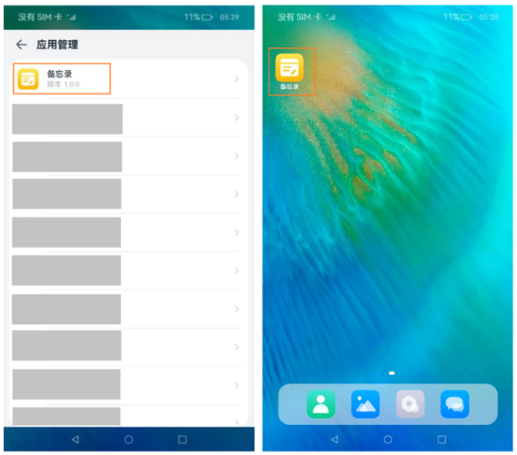

# 配置应用图标和名称
<!--Kit: Ability Kit-->
<!--Subsystem: BundleManager-->
<!--Owner: @wanghang904-->
<!--Designer: @hanfeng6-->
<!--Tester: @kongjing2-->
<!--Adviser: @HelloCrease-->

本页面提供应用图标和名称的配置指导。应用图标分为单层图标和分层图标。单层图标包含一个图片，分层图标包含前景图和背景图。图标规范详见<!--RP1-->[设计原则](https://docs.openharmony.cn/pages/v6.0/zh-cn/design/ux-design/visual-icons.md#%E8%AE%BE%E8%AE%A1%E5%8E%9F%E5%88%99)<!--RP1End-->，图标和名称配置约束详见[图标和名称配置](../application-models/application-component-configuration-stage.md#应用图标和名称配置)。

## 使用场景

<!--RP2-->
- 用于在应用界面内展示当前应用。例如：在设置应用中展示应用列表。
- 用于在设备桌面上展示当前应用。例如：桌面或者最近任务列表中显示应用。
<!--RP2End-->

效果图如下。
<!--RP3-->

<!--RP3End-->

## 配置优先级和生成策略

* HAP中包含UIAbility

  1. 入口UIAbility：skills标签中entities中包含"entity.system.home"、并且actions中包含"ohos.want.action.home"。
  
  2. 在module.json5配置了多个入口UIAbility：

      * 如果module.json5中mainElement配置的为入口UIAbility，则返回mainElement对应的入口UIAbility配置的icon和label。

      * 如果module.json5中mainElement未配置或者配置的不为入口UIAbility，则返回module.json5中配置的第一个入口UIAbility对应的icon和label。

  3. 在module.json5配置文件中，出现以下任一情况时，系统将返回app.json5中的icon或label：

      * mainElement配置的为入口UIAbility，但是入口UIAbility未设置icon或label。

      * mainElement未配置或者配置的不为入口UIAbility，且module.json5配置文件中第一个入口UIAbility未设置icon或label。

  多HAP包的工程中，如果entry类型存在，以entry类型的HAP中module.json5配置文件为准。如果没有entry类型，此时用所有hap的moduleName以ASCII字典序排序，最终以排序为最后一个的feature包的module.json5配置文件为准。

* HAP中不包含UIAbility，系统将返回app.json5中的icon和label。

>
> **说明：**
> 
> 在编译构建时，AppScope目录下的资源文件会合入到模块下相同路径的资源目录中，如果两个目录下存在重名文件，编译打包后AppScope目录下的资源文件会覆盖模块下的资源。
>
> 例如，app.json5和module.json5中配置的分层图标的资源文件名称一致、图标不一致，AppScope目录下的资源文件会覆盖模块中的文件，最后的效果是app.json5中的配置图标生效。
> 
> 如果应用配置中未设置入口UIAbility，点击桌面图标将直接进入应用详情页（设置->应用和元服务下，点击任意应用即可进入该应用的应用详情页）。其他情况下，点击桌面图标将直接进入应用页面。应用未配置入口UIAbility包含2种场景：
>
>   1. 应用没有配置任何UIAbility。
>   2. 所有UIAbility中skills标签下的entities未配置或配置内容不包括 "entity.system.home"，并且actions未配置或配置内容不包括 "ohos.want.action.home"。
>

## 配置单层图标和应用名称

- **方式一：配置app.json5**

  该配置仅当module.json5配置文件中无UIAbility、或者存在UIAbility但abilities标签中未设置icon和label（可手动删除icon和label配置）时生效。

  <!-- @[layered_image_001](https://gitcode.com/openharmony/applications_app_samples/blob/master/code/DocsSample/bmsSample/LayeredImage1/AppScope/app.json5) -->
  
  ``` JSON5
  {
    "app": {
      // ...
      "icon": "$media:app_icon",
      "label": "$string:app_name" // 需要在AppScope/resources/base/element/string.json配置name为app_name的资源，已存在可以忽略
    }
  }
  ```

- **方式二：配置module.json5**

  除了需要配置icon与label字段，还需要在skills标签下面的entities中添加"entity.system.home"、actions中添加"ohos.want.action.home"。

  <!-- @[layered_image_002](https://gitcode.com/openharmony/applications_app_samples/blob/master/code/DocsSample/bmsSample/LayeredImage1/entry/src/main/module.json5) -->
  
  ``` JSON5
  {
    "module": {
      // ...
      "abilities": [
        {
          // ...
          "icon": "$media:icon",
          // 需要在entry/src/main/resources/base/element/string.json配置name为EntryAbility_label的资源，已存在可以忽略
          "label": "$string:EntryAbility_label",
          "skills": [
            {
              "entities": [
                "entity.system.home"
              ],
              "actions": [
                "ohos.want.action.home"
              ]
            }
          ]
        }
      ],
      // ...
    }
  }
  ```

## 配置分层图标和应用名称

- **方式一：配置app.json5**

  该配置仅当module.json5配置文件中无UIAbility、或者存在UIAbility但abilities标签中未设置icon和label（可手动删除icon和label配置）时生效。

  1. 将前景资源和背景资源文件放在“AppScope\resources\base\media”文件夹下。

      本例中，前景资源文件名为“foreground.png”，背景资源文件名为“background.png”。

  2. 在“AppScope\resources\base\media”文件夹下app_layered_image.json分层图标资源文件中，配置分层图标的前景资源与背景资源信息。

      ```json
      {
        "layered-image":
        {
          "background" : "$media:background",
          "foreground" : "$media:foreground"
        }
      }
      ```
  3. 在[app.json5配置文件](app-configuration-file.md)中引用分层图标资源文件。示例如下：

      <!-- @[layered_image_003](https://gitcode.com/openharmony/applications_app_samples/blob/master/code/DocsSample/bmsSample/LayeredImage2/AppScope/app.json5) -->
      
      ``` JSON5
      {
        "app": {
          // ...
          "icon": "$media:layered_image",
          "label": "$string:app_name" // 需要在AppScope/resources/base/element/string.json配置name为app_name的资源，已存在可以忽略
        }
      }
      ```

- **方式二：配置module.json5**

  1. 将前景资源和背景资源文件放在“entry\src\main\resources\base\media”文件夹下。

      本例中采用的前景资源和背景资源的文件名分别为“foreground.png”和“background.png”。

  2. 在“entry\src\main\resources\base\media”文件夹下layered_image.json分层图标资源文件中，配置分层图标的前景资源与背景资源信息。

      ```json
      {
        "layered-image":
        {
          "background" : "$media:background",
          "foreground" : "$media:foreground"
        }
      }
      ```

  3. 如果需要在桌面显示UIAbility图标，除了需要配置icon与label字段，还需要在skills标签下面的entities中添加"entity.system.home"、actions中添加"ohos.want.action.home"。

      <!-- @[layered_image_004](https://gitcode.com/openharmony/applications_app_samples/blob/master/code/DocsSample/bmsSample/LayeredImage2/entry/src/main/module.json5)  -->
      
      ``` JSON5
      {
        "module": {
          // ...
          "abilities": [
            {
              // ...
              // icon配置为分层图标资源文件的索引
              "icon": "$media:layered_image",
              // 需要在entry/src/main/resources/base/element/string.json配置name为EntryAbility_label的资源，已存在可以忽略
              "label": "$string:EntryAbility_label",
              "skills": [
                {
                  "entities": [
                    "entity.system.home"
                  ],
                  "actions": [
                    "ohos.want.action.home"
                  ]
                }
              ]
            }
          ],
          // ...
        }
      }
      ```

>
> **说明：**
>
> DevEco Studio NEXT Beta1(5.0.3.814) 及之后的版本，创建应用时默认模板中包含分层图标的资源文件，不同版本生成的资源文件名称可能不同，文件名称支持手动修改。如果分层图标资源文件不存在则需要手动创建，文件名称需要符合资源命名规范，由数字、字母、点和下划线组成。
>

## 配置备用图标

从API版本26.0.0开始，配置备用图标可在应用运行时动态切换，适用于用户偏好、节日主题、品牌活动等场景。开发者可以在[app.json5配置文件](app-configuration-file.md#alternateicons标签)的alternateIcons标签中预先配置多个备用图标，最多可以配置1024个，可参考下方步骤进行动态切换。

备用图标支持单层图标和分层图标，资源文件的准备和配置方式分别参考[配置单层图标和应用名称](#配置单层图标和应用名称)和[配置分层图标和应用名称](#配置分层图标和应用名称)。

>
> **说明：**
>
> - alternateIcons标签仅在bundleType为app时生效。
>
> - 应用最多只能同时启用一个备用图标。
>
> - 分身应用不支持设置和查询备用图标。
>

1. 在[app.json5配置文件](app-configuration-file.md)中添加[alternateIcons标签](app-configuration-file.md#alternateicons标签)，声明备用图标列表。

    <!-- @[layered_image_005](https://gitcode.com/openharmony/applications_app_samples/blob/OpenHarmony_feature_sta_20260331/code/DocsSample/bmsSample/LayeredImage3/AppScope/app.json5) -->
    
    ``` JSON5
    {
      "app": {
        // ...
        "alternateIcons": [
          {
            "name": "summer_theme",
            "icon": "$media:layered_image"
          },
          {
            "name": "winter_theme",
            "icon": "$media:winter_icon"
          }
        ]
      }
    }
    ```

2. 使用[bundleManager.setAlternateIcon](../reference/apis-ability-kit/js-apis-bundleManager.md#bundlemanagersetalternateicon)接口设置备用图标，传入alternateIcons标签中配置的name字段值即可启用对应备用图标。

    <!-- @[layered_image_006](https://gitcode.com/openharmony/applications_app_samples/blob/OpenHarmony_feature_sta_20260331/code/DocsSample/bmsSample/LayeredImage3/entry/src/main/ets/pages/Index.ets)  -->
    
    ``` TypeScript
    import { bundleManager } from '@kit.AbilityKit';
    import { BusinessError } from '@kit.BasicServicesKit';
    import { hilog } from '@kit.PerformanceAnalysisKit';
    
    @Entry
    @Component
    struct Index {
    
      build() {
        Scroll() {
          Column() {
            Text("SetAlternateIcon")
              .fontSize($r('app.float.page_text_font_size'))
              .fontWeight(FontWeight.Bold)
              .alignRules({
                center: { anchor: '__container__', align: VerticalAlign.Center },
                middle: { anchor: '__container__', align: HorizontalAlign.Center }
              })
              .onClick(() => {
                // alternateIconName需要替换为app.json5中alternateIcons标签下配置的name字段值
                let alternateIconName: string = 'summer_theme';
                try {
                  bundleManager.setAlternateIcon(alternateIconName).then(() => {
                    hilog.info(0x0000, 'testTag', 'setAlternateIcon successfully');
                  }).catch((err: BusinessError) => {
                    hilog.error(0x0000, 'testTag', 'setAlternateIcon failed. Cause: %{public}s', err.message);
                  });
                } catch (err) {
                  let message = (err as BusinessError).message;
                  hilog.error(0x0000, 'testTag', 'setAlternateIcon failed. Cause: %{public}s', message);
                }
              })
            // ...
            // ...
          }
          .width('100%')
        }
        .height('100%')
      }
    }
    ```

3. 调用[bundleManager.setAlternateIcon](../reference/apis-ability-kit/js-apis-bundleManager.md#bundlemanagersetalternateicon)接口传入空字符串可恢复默认图标。

    <!-- @[layered_image_007](https://gitcode.com/openharmony/applications_app_samples/blob/OpenHarmony_feature_sta_20260331/code/DocsSample/bmsSample/LayeredImage3/entry/src/main/ets/pages/Index.ets)  -->
    
    ``` TypeScript
    import { bundleManager } from '@kit.AbilityKit';
    import { BusinessError } from '@kit.BasicServicesKit';
    import { hilog } from '@kit.PerformanceAnalysisKit';
    
    @Entry
    @Component
    struct Index {
    
      build() {
        Scroll() {
          Column() {
            // ...
            Text("RestoreDefaultIcon")
              .fontSize($r('app.float.page_text_font_size'))
              .fontWeight(FontWeight.Bold)
              .alignRules({
                center: { anchor: '__container__', align: VerticalAlign.Center },
                middle: { anchor: '__container__', align: HorizontalAlign.Center }
              })
              .onClick(() => {
                try {
                  bundleManager.setAlternateIcon('').then(() => {
                    hilog.info(0x0000, 'testTag', 'restore default icon successfully');
                  }).catch((err: BusinessError) => {
                    hilog.error(0x0000, 'testTag', 'restore default icon failed. Cause: %{public}s', err.message);
                  });
                } catch (err) {
                  let message = (err as BusinessError).message;
                  hilog.error(0x0000, 'testTag', 'restore default icon failed. Cause: %{public}s', message);
                }
              })
            // ...
          }
          .width('100%')
        }
        .height('100%')
      }
    }
    ```

4. 使用[bundleManager.getAlternateIcons](../reference/apis-ability-kit/js-apis-bundleManager.md#bundlemanagergetalternateicons)接口查询备用图标信息。返回的[AlternateIconInfo](../reference/apis-ability-kit/js-apis-bundleManager-bundleInfo.md#alternateiconinfo)数组包含每个备用图标的名称（iconName）、资源ID（iconId）和启用状态（enabled）。

    <!-- @[layered_image_008](https://gitcode.com/openharmony/applications_app_samples/blob/OpenHarmony_feature_sta_20260331/code/DocsSample/bmsSample/LayeredImage3/entry/src/main/ets/pages/Index.ets)  -->
    
    ``` TypeScript
    import { bundleManager } from '@kit.AbilityKit';
    import { BusinessError } from '@kit.BasicServicesKit';
    import { hilog } from '@kit.PerformanceAnalysisKit';
    
    @Entry
    @Component
    struct Index {
    
      build() {
        Scroll() {
          Column() {
            // ...
            Text("GetAlternateIcons")
              .fontSize($r('app.float.page_text_font_size'))
              .fontWeight(FontWeight.Bold)
              .alignRules({
                center: { anchor: '__container__', align: VerticalAlign.Center },
                middle: { anchor: '__container__', align: HorizontalAlign.Center }
              })
              .onClick(() => {
                try {
                  bundleManager.getAlternateIcons().then((data) => {
                    hilog.info(0x0000, 'testTag', 'getAlternateIcons successfully. Data: %{public}s', JSON.stringify(data));
                  }).catch((err: BusinessError) => {
                    hilog.error(0x0000, 'testTag', 'getAlternateIcons failed. Cause: %{public}s', err.message);
                  });
                } catch (err) {
                  let message = (err as BusinessError).message;
                  hilog.error(0x0000, 'testTag', 'getAlternateIcons failed. Cause: %{public}s', message);
                }
              })
          }
          .width('100%')
        }
        .height('100%')
      }
    }
    ```

<!--Del-->
## 管控规则

系统对无图标应用实施严格管控，防止一些恶意应用故意配置无桌面应用图标，导致用户找不到软件所在的位置，无法操作卸载应用，在一定程度上保证用户终端设备的安全。因此除预置应用外，其他应用不支持隐藏桌面图标。

如果预置应用确需隐藏桌面应用图标，必须配置AllowAppDesktopIconHide[应用特权](../../device-dev/subsystems/subsys-app-privilege-config-guide.md#通用应用特权)，具体配置方式参考应用特权配置指南。申请该特权后，应用不会在桌面上显示。<!--DelEnd-->
