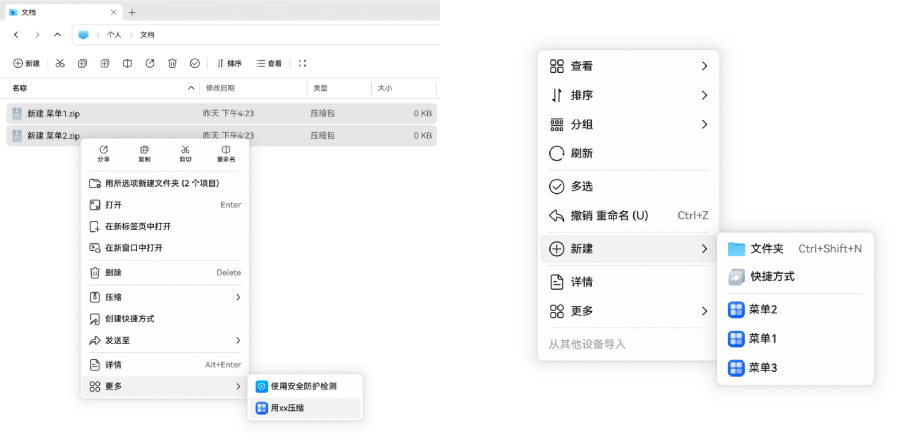

# 配置应用右键扩展菜单（PC/2in1）
<!--Kit: Ability Kit-->
<!--Subsystem: BundleManager-->
<!--Owner: @dzsam520-->
<!--Designer: @alone1985-->
<!--Tester: @aimeechen728-->
<!--Adviser: @HelloCrease-->

应用通过配置右键菜单，可以在桌面、文件管理器的右键菜单中注册自定义菜单项，用户点击后拉起应用执行对应的操作，从而将应用的能力便捷地融入系统的文件操作流程中。典型场景如下：

- 应用需要在桌面、文件管理器的右键菜单中添加自定义菜单，用于拉起应用实现业务逻辑。如使用安全防护检测。
- 应用需要在桌面、文件管理器的右键菜单中添加新建菜单，用于新建文件。如新建文本文档.txt。

## 声明右键菜单

在[module.json5配置文件](./module-configuration-file.md)中配置fileContextMenu字段，该字段指向一个profile文件资源。开发者需要在resources/base/profile目录下定义对应的菜单配置文件，例如menu.json。其中，menu.json文件名可自定义，但必须与fileContextMenu字段指定的资源名称保持一致。

在菜单配置文件中，开发者可以定义应用注册的右键菜单项及其响应行为，用于声明当前HAP的右键菜单配置。

>**说明：**
>
>仅支持在entry类型模块中配置。

<!-- @[module_fileContextMenu](https://gitcode.com/openharmony/applications_app_samples/blob/master/code/DocsSample/bmsSample/ModuleConfigurationFile01/entry/src/main/module.json5) -->

``` JSON5
{
  "module": {
    // ...
    "fileContextMenu": "$profile:menu", // 资源配置，指向profile下面定义的配置文件menu.json
    // ...
  }
}
```

## 注册“更多”菜单

menu.json配置文件根节点名称为fileContextMenu，为对象数组，标识当前module注册“更多”右键菜单的数量。

单模块和单应用注册数量不能超过10个，配置超过数量当前只解析随机10个。

**表1** fileContextMenu标签配置说明

| 属性名称 | 含义 | 数据类型 | 是否可缺省 |
| -------- | -------- | -------- | -------- |
| abilityName | 表示当前右键菜单对应的需要拉起的Ability名称。 | 字符串 | 不可缺省。 |
| menuItem | 右键菜单显示的信息。命名建议：<br/>原则一：[动作]+[应用名]，中文示例：用{App}打开、用{App} ({Plugin}插件) 打开；英文示例：Open with {App}、Open with {App} ({Plugin})。<br/>原则二：[动作]+[目的]，示例：压缩为{文件名}、压缩至{路径}、用{App}转换为{格式}。 | 资源id | 不可缺省。 |
| menuIcon | 右键菜单显示的自定义图标资源。取值为长度不超过255字节的字符串。图标规格为不超过5MB的PNG格式图片，图片设计应遵循应用图标设计规范。<br/>**说明：**<br/> 从API版本23开始，支持该标签。<br/> 使用自定义图标需要申请`ohos.permission.CUSTOMIZE_MENU_ICON`权限，未授权或资源格式不符合要求时，菜单项将不显示自定义图标。 | 字符串 | 可缺省，缺省值为空。 |
| menuHandler | 一个Ability可以创建多个右键菜单， 该标签与右键菜单显示项一一对应，用于区分用户拉起的不同右键菜单项。开发者可自定义该标签取值，确保该标签在整个Ability中唯一。在用户点击右键菜单拉起应用时，会作为参数传递给应用。 | 字符串 | 不可缺省。 |
| menuContext | 定义展示该菜单项需要的上下文，包括触发场景（空白处、文件、文件夹等）、选择方式（单选、多选）和文件类型过滤等。 | 对象数组 | 不可缺省。 |

**表2** menuContext标签配置说明

| 属性名称 | 含义 | 数据类型 | 是否可缺省 |
| -------- | -------- | -------- | -------- |
| menuKind | 表示单击如下类型时会触发右键菜单。取值范围如下：<br/>-&nbsp;0：空白处<br/>-&nbsp;1：文件<br/>-&nbsp;2：文件夹<br/>-&nbsp;3：文件和文件夹 | 数值 | 不可缺省。 |
| menuRule | 表示采用什么方式选择文件或文件夹时，会触发右键菜单。取值范围如下：<br/>-&nbsp;"single"：单选<br/>-&nbsp;"multi"：多选<br/>-&nbsp;"both"：单选或多选 | 字符串 | 仅当menuKind为1或2时，才会读取该标签，此时不可缺省。 |
| fileSupportType | 表示当选中的文件列表里包含指定的文件类型时，显示右键菜单。<br/>当该标签取值为["*"]时，将会读取fileNotSupportType标签。<br/>当该标签取值为[]时，将不做任何处理。 | 字符串数组 | 仅当menuKind为1时，才会读取该标签，此时不可缺省。 |
| fileNotSupportType | 表示当选中的文件列表里包含这些文件类型时，不显示该右键菜单。<br/>仅当menuKind为1、且fileSupportType为["*"]时，才会读取该标签。 | 字符串数组 | 可缺省，缺省值为空。 |
| ignoreActiveStatus | 是否忽略三方网盘同步文件夹的活跃状态。为true时，即使同步文件夹未激活，也允许显示该菜单项；为false时，仅当同步文件夹处于活跃状态才显示。<br/>**说明：**<br/> 从API版本24开始，支持该标签。<br/> 该标签仅在用户当前处于三方网盘同步目录才会生效，在本地目录下不影响菜单显示逻辑。 | 布尔值 | 可缺省，缺省值为false。 |
| fileSupportSyncStatus | 三方网盘文件同步状态过滤。仅当文件处于数组中指定的同步状态时才显示该菜单项。取值范围如下：<br/>-&nbsp;"IDLE"：无状态<br/>-&nbsp;"CLOUD"：云端文件<br/>-&nbsp;"SYNCING"：同步中<br/>-&nbsp;"SYNC_SUCCESSED"：同步成功<br/>-&nbsp;"SYNC_FAILED"：同步失败<br/>-&nbsp;"SYNC_CANCELED"：同步取消<br/>-&nbsp;"SYNC_CONFLICTED"：同步冲突 <br/>**说明：**<br/> 从API版本24开始，支持该标签。<br/> 该标签仅在用户当前处于三方网盘同步目录下时才会生效，且菜单项所需应用的包名必须与当前目录对应的三方网盘应用包名一致，否则该菜单项不显示。 | 字符串数组 | 可缺省，缺省值为IDLE。 |

resources/base/profile路径下的menu.json配置文件示例如下：
```json
{
  "fileContextMenu": [
    {
      "abilityName": "EntryAbility",
      "menuItem": "$string:module_desc",
      "menuIcon": "$media:custom_icon",
      "menuHandler": "openCompress",
      "menuContext": [
        {
          "menuKind": 0
        },
        {
          "menuKind": 1,
          "menuRule": "both",
          "fileSupportType": [
            ".rar",
            ".zip"
          ]
        },
        {
          "menuKind": 2,
          "menuRule": "single"
        },
        {
          "menuKind": 3
        }
      ]
    }
  ]
}
```

**响应行为**

应用进行右键菜单注册后，在文件管理器通过右键操作拉起菜单，该菜单中会有“更多”选项。单击“更多”选项后，会出现注册后的menuItem列表，单击任意一个选项后，文件管理器默认通过startAbility的方式拉起三方应用，除了指定三方应用的包名和Ability名之外，want中的parameter中，也会传入如下标签：

**表3** want中parameter标签说明

| 参数名 | 值 | 类型 |
| -------- | -------- | -------- |
| menuHandler | 对应注册配置文件中menuHandler的值。 | 字符串 |
| uriList | 用户在具体文件上触发右键的uri值，如果空白处响应，此值为空，单个文件响应，数组长度1，多个文件响应则传入对应所有文件的uri值。 | 字符串数组 |

## 注册“新建”菜单

同“更多”扩展菜单一致，menu.json配置文件放在resources/base/profile目录下，和“更多”扩展菜单共用同一个文件，但是配置文件内容需要另外编写，可以基于“更多”扩展菜单的配置文件继续添加，也可以单独只包含新建文件的配置项。

menu.json配置文件根节点名称为newFile，为对象数组，标识当前module注册新建文件的数量。

单模块和单应用注册数量不能超过5个，配置超过数量当前只解析随机5个。

**表4** newFile标签配置说明

| 属性名称 | 含义 | 数据类型 | 是否可缺省 |
| -------- | -------- | -------- | -------- |
| menuName | 表示在右键新建文件菜单上具体显示的内容，如：“文本文档”。 | 资源id | 不可缺省 |
| menuIcon | 新建文件的图标路径。 | 字符串 | 不可缺省 |
| fileType | 新建文件的格式类型。 | 字符串 | 不可缺省 |
| fileContent | 新建文件的模板路径。 | 字符串 | 不可缺省 |

resources/base/profile路径下的menu.json配置文件示例如下：
```json
{
  "newFile": [
    {
      "menuName": "$string:menu1",
      "menuIcon": "icon/menuIcon1.png",
      "fileType": ".docx",
      "fileContent": "template/demo.docx"
    },
    {
      "menuName": "$string:menu2",
      "menuIcon": "icon/menuIcon2.png",
      "fileType": ".txt",
      "fileContent": "template/demo.txt"
    },
    {
      "menuName": "$string:menu3",
      "menuIcon": "icon/menuIcon3.png",
      "fileType": ".xlsx",
      "fileContent": "template/demo.xlsx"
    }
  ]
}
```
## 完整示例

以下为一个完整的menu.json配置文件示例，包含“更多”菜单、“新建”菜单。

```json
{
  "fileContextMenu": [
    {
      "abilityName": "EntryAbility",
      "menuItem": "$string:compress_menu",
      "menuIcon": "$media:compress_icon",
      "menuHandler": "compress",
      "menuContext": [
        {
          "menuKind": 0
        },
        {
          "menuKind": 1,
          "menuRule": "both",
          "fileSupportType": [
            ".rar",
            ".zip"
          ]
        }
      ]
    }
  ],
  "newFile": [
    {
      "menuName": "$string:menu1",
      "menuIcon": "icon/menuIcon1.png",
      "fileType": ".docx",
      "fileContent": "template/demo.docx"
    },
    {
      "menuName": "$string:menu2",
      "menuIcon": "icon/menuIcon2.png",
      "fileType": ".txt",
      "fileContent": "template/demo.txt"
    },
    {
      "menuName": "$string:menu3",
      "menuIcon": "icon/menuIcon3.png",
      "fileType": ".xlsx",
      "fileContent": "template/demo.xlsx"
    }
  ]
}
```

效果图如下。

