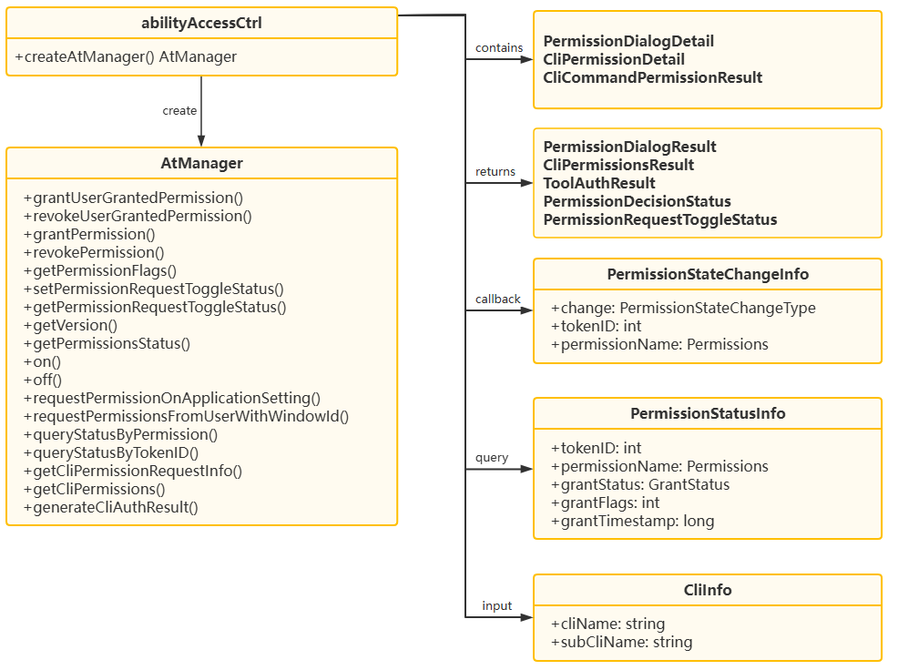

# @ohos.abilityAccessCtrl (程序访问控制管理)(系统接口)

<!--Kit: Ability Kit-->
<!--Subsystem: Security-->
<!--Owner: @xia-bubai-->
<!--Designer: @linshuqing; @hehehe-li-->
<!--Tester: @leiyuqian-->
<!--Adviser: @zengyawen-->

## 模块简介

程序访问控制提供程序的权限管理能力，包括鉴权、授权和取消授权等。权限分为system_grant（系统自动授权）、user_grant（需用户手动授权）和manual_settings（手动设置授权）三类，应用需在配置文件中声明所需权限。权限管理机制详见[应用权限管控概述](../../security/AccessToken/app-permission-mgmt-overview.md)。

该模块主要用于以下场景：

- 授予/撤销指定应用的权限，批量查询权限授权状态。
- 订阅指定应用的指定权限的状态变化。
- 基于窗口发起用户权限请求弹窗。
- 对CLI命令进行权限弹窗预判、权限映射查询和授权结果生成。

> **说明：**
>
> - 本模块首批接口从API version 8开始支持。后续版本的新增接口，采用上角标单独标记接口的起始版本。
> - 当前页面仅包含本模块的系统接口，其他公开接口参见[@ohos.abilityAccessCtrl (程序访问控制管理)](js-apis-abilityAccessCtrl.md)。

## 关键Class/Interface介绍

### 核心枚举类型

- **[GrantStatus](js-apis-abilityAccessCtrl.md#grantstatus)：** 权限授权状态枚举，用于表示权限是否已授权。
- **[PermissionStatus](js-apis-abilityAccessCtrl.md#permissionstatus20)：** 权限状态枚举，用于表示当前权限状态。
- **[PermissionStateChangeType](js-apis-abilityAccessCtrl.md#permissionstatechangetype18)：** 权限状态变化类型枚举，用于表示授权、取消授权等变化。
- **[PermissionRequestToggleStatus](#permissionrequesttogglestatus12)：** 权限申请开关状态枚举，用于表示指定权限的弹窗开关状态。
- **[PermissionDecisionStatus](#permissiondecisionstatus)：** CLI权限决策状态枚举，用于表示命令权限的判定结果。

### 核心接口类型

- **[PermissionStatusInfo](#permissionstatusinfo)：** 权限状态信息对象，用于返回应用权限的授权状态、标志位和时间戳。
- **[PermissionStateChangeInfo](js-apis-abilityAccessCtrl.md#permissionstatechangeinfo18)** 权限状态变化事件对象，用于返回变化类型、应用身份标识和权限名。
- **[CliInfo](#cliinfo)：** CLI命令信息对象，用于描述命令名称和子命令名称。
- **[PermissionDialogDetail](#permissiondialogdetail)：** 权限弹窗明细对象，用于描述单个CLI权限弹窗的状态和未满足权限。
- **[PermissionDialogResult](#permissiondialogresult)：** 权限弹窗查询结果对象，用于返回命令对应的弹窗信息。
- **[CliPermissionDetail](#clipermissiondetail)：** CLI权限明细对象，用于描述命令权限、决策状态和映射出的运行时权限。
- **[CliCommandPermissionResult](#clicommandpermissionresult)：** CLI命令权限结果对象，用于返回单个命令依赖的权限信息。
- **[CliPermissionsResult](#clipermissionsresult)：** CLI权限查询结果对象，用于返回命令所需权限的映射结果。
- **[CliAuthInfo](#cliauthinfo)：** CLI授权信息对象，用于描述待生成授权结果的命令授权状态。
- **[ToolAuthResult](#toolauthresult)：** 工具授权结果对象，用于返回生成后的授权结果。

### 核心类

- **[AtManager](#atmanager)：** 程序访问控制管理类，提供跨应用权限授予、撤销、查询、监听和CLI权限管理等能力。



### API组合使用关系说明

场景1：管理目标应用权限。

场景说明：系统应用需要主动授予或撤销目标应用权限时，可先创建[AtManager](#atmanager)实例，获取目标应用的tokenID后调用授予或撤销接口，再按需查询权限标记和权限状态。

典型使用流程如下：

```ts
import { abilityAccessCtrl, Permissions } from '@kit.AbilityKit';

let atManager: abilityAccessCtrl.AtManager = abilityAccessCtrl.createAtManager();
let tokenID: number = 0; // 获取tokenID的方式可参考AtManager章节的描述。
let permissionName: Permissions = 'ohos.permission.READ_AUDIO';
let permissionFlags: number = 2;

// 1. 授予或撤销目标应用权限。
await atManager.grantPermission(tokenID, permissionName, permissionFlags);
await atManager.revokePermission(tokenID, permissionName, permissionFlags);

// 2. 查询授权标记和状态明细。
await atManager.getPermissionFlags(tokenID, permissionName);
await atManager.getPermissionsStatus(tokenID, [permissionName]);

// 3. 按应用或按权限进行批量查询。
await atManager.queryStatusByTokenID([tokenID]);
await atManager.queryStatusByPermission([permissionName]);
```

场景2：监听目标应用权限状态变化。

场景说明：系统应用需要感知指定应用的权限状态变化时，可使用[on](#on9)注册监听；不再关注该变化时，使用[off](#off9)注销监听。注册和注销时的tokenID列表、权限列表以及回调函数需要对应。

典型使用流程如下：

```ts
import { abilityAccessCtrl, Permissions, bundleManager } from '@kit.AbilityKit';

let atManager: abilityAccessCtrl.AtManager = abilityAccessCtrl.createAtManager();
let bundleInfo: bundleManager.BundleInfo =
  bundleManager.getBundleInfoForSelfSync(bundleManager.BundleFlag.GET_BUNDLE_INFO_WITH_APPLICATION);
let tokenIDList: Array<number> = [bundleInfo.appInfo.accessTokenId];
let permissionList: Array<Permissions> = ['ohos.permission.DISTRIBUTED_DATASYNC'];
let callback: (data: abilityAccessCtrl.PermissionStateChangeInfo) => void =
  (data: abilityAccessCtrl.PermissionStateChangeInfo): void => {
    console.info('receive permission state change');
    console.info(`data change: ${data.change}, tokenID: ${data.tokenID}, permission name: ${data.permissionName}`);
  };

// 1. 订阅指定应用和权限的状态变化。
atManager.on('permissionStateChange', tokenIDList, permissionList, callback);

// 2. 不再需要时取消订阅。
atManager.off('permissionStateChange', tokenIDList, permissionList, callback);
```

场景3：处理CLI工具权限授权。

场景说明：系统应用代理CLI工具执行命令时，可先调用[getCliPermissionRequestInfo](#getclipermissionrequestinfo)查询命令是否需要权限弹窗，再调用[getCliPermissions](#getclipermissions)查询命令依赖的CLI权限和运行时权限，最后调用[generateCliAuthResult](#generatecliauthresult)生成工具授权结果。

典型使用流程如下：

```ts
import { abilityAccessCtrl, Permissions } from '@kit.AbilityKit';

let atManager: abilityAccessCtrl.AtManager = abilityAccessCtrl.createAtManager();
let hostTokenID: number = 0; // 获取方式可参考AtManager章节的描述。
let agentID: string = 'agent.demo';
let cliInfoList: Array<abilityAccessCtrl.CliInfo> = [{
  cliName: 'ohos-example',
  subCliName: 'run'
}];
let authInfoList: Array<abilityAccessCtrl.CliAuthInfo> = [{
  cliInfo: {
    cliName: 'ohos-example',
    subCliName: 'run'
  },
  permissionNames: ['ohos.permission.ACCESS_SYSTEM_SETTINGS' as Permissions],
  authorizationResults: [true]
}];

// 1. 判断命令是否需要权限弹窗。
await atManager.getCliPermissionRequestInfo(agentID, cliInfoList);

// 2. 查询命令依赖的CLI权限和运行时权限。
await atManager.getCliPermissions(hostTokenID, agentID, cliInfoList);

// 3. 基于用户选择生成授权结果。
await atManager.generateCliAuthResult(hostTokenID, agentID, authInfoList);
```

## 导入模块

```ts
import { abilityAccessCtrl } from '@kit.AbilityKit';
```

## AtManager

管理访问控制模块的实例。该类作为本模块的核心管理类，提供跨应用权限授予、撤销、查询、状态监听和CLI权限管理等能力。

AtManager接口调用依赖于tokenID，系统应用可通过[bundleManager.getBundleInfoSync](js-apis-bundleManager.md#bundlemanagergetbundleinfosync14)或[bundleManager.getBundleInfoForSelfSync](js-apis-bundleManager.md#bundlemanagergetbundleinfoforselfsync10)获取tokenID。

### grantUserGrantedPermission

grantUserGrantedPermission(tokenID: number, permissionName: Permissions, permissionFlags: number): Promise&lt;void&gt;

授予应用user_grant权限。调用成功后，应用获得该user_grant权限，可以访问相应的受保护资源。使用Promise异步回调。

本接口仅支持授予user_grant类型的权限。若需要授予user_grant或manual_settings类型权限，建议使用[grantPermission](#grantpermission21)。

**系统接口：** 此接口为系统接口。

**需要权限：** ohos.permission.GRANT_SENSITIVE_PERMISSIONS

**系统能力：** SystemCapability.Security.AccessToken

**参数：**

| 参数名    | 类型                | 必填 | 说明                                                         |
| --------- | ------------------- | ---- | ------------------------------------------------------------ |
| tokenID      | number              | 是   | 目标应用的身份标识。可通过应用[BundleInfo](js-apis-bundleManager-bundleInfo.md)中的[ApplicationInfo](js-apis-bundleManager-applicationInfo.md)的accessTokenId字段获取。该参数必须为大于0的整数，传入0时返回错误码12100001。 |
| permissionName | [Permissions](../../security/AccessToken/app-permissions.md)              | 是   | 被授予的权限名称。权限名长度不能超过256个字符，超过限制时返回错误码12100001。 |
| permissionFlags  | number | 是   | 授权选项。<br>- 1表示当次用户若选择禁止该权限，下次权限弹窗仍可以弹出申请用户授权。<br>- 2表示当次用户若选择禁止该权限，下次不会再弹出权限弹窗，用户需要在系统设置的权限管理中进行授权。<br>- 64表示当次用户若选择仅本次允许，权限仅本次授权。应用切换后台状态或退出后取消授权。 |

**返回值：**

| 类型          | 说明                                |
| :------------ | :---------------------------------- |
| Promise&lt;void&gt; | Promise对象，无返回结果。 |

**错误码：**

以下错误码的详细介绍请参见[通用错误码](../errorcode-universal.md)和[访问控制错误码](errorcode-access-token.md)。

| 错误码ID | 错误信息 |
| -------- | -------- |
| 201 | Permission denied. Interface caller does not have permission "ohos.permission.GRANT_SENSITIVE_PERMISSIONS". |
| 202 | Not System App. Interface caller is not a system app. |
| 401 | Parameter error. Possible causes: 1.Mandatory parameters are left unspecified; 2.Incorrect parameter types. |
| 12100001 | Invalid parameter. The tokenID is 0, the permissionName exceeds 256 characters or is not declared in the module.json file, or the flags value is invalid. |
| 12100002 | The specified tokenID does not exist. |
| 12100003 | The specified permission does not exist or is not a user_grant permission. |
| 12100006 | The application specified by the tokenID is not allowed to be granted with the specified permission. Either the application is a sandbox or the tokenID is from a remote device. |
| 12100007 | The service is abnormal. |

**示例：**

```ts
import { abilityAccessCtrl } from '@kit.AbilityKit';
import { BusinessError } from '@kit.BasicServicesKit';

let atManager: abilityAccessCtrl.AtManager = abilityAccessCtrl.createAtManager();
let tokenID: number = 0; // 获取tokenID的方式可参考AtManager章节的描述。
let permissionFlags: number = 1;
atManager.grantUserGrantedPermission(tokenID, 'ohos.permission.READ_AUDIO', permissionFlags).then(() => {
  console.info('grantUserGrantedPermission success');
}).catch((err: BusinessError): void => {
  console.error(`grantUserGrantedPermission fail, code: ${err.code}, message: ${err.message}`);
});
```

### grantUserGrantedPermission

grantUserGrantedPermission(tokenID: number, permissionName: Permissions, permissionFlags: number, callback: AsyncCallback&lt;void&gt;): void

授予应用user_grant权限。使用callback异步回调。调用成功后，应用获得该user_grant权限，可以访问相应的受保护资源。

**系统接口：** 此接口为系统接口。

**需要权限：** ohos.permission.GRANT_SENSITIVE_PERMISSIONS

**系统能力：** SystemCapability.Security.AccessToken

**参数：**

| 参数名    | 类型                | 必填 | 说明                          |
| --------- | ------------------- | ---- | ------------------------------------------------------------ |
| tokenID      | number              | 是   | 目标应用的身份标识。可通过应用[BundleInfo](js-apis-bundleManager-bundleInfo.md)中的[ApplicationInfo](js-apis-bundleManager-applicationInfo.md)的accessTokenId字段获取。该参数必须为大于0的整数，传入0时返回错误码12100001。 |
| permissionName | [Permissions](../../security/AccessToken/app-permissions.md)              | 是   | 被授予的权限名称。权限名长度不能超过256个字符，超过限制时返回错误码12100001。 |
| permissionFlags  | number | 是   | 授权选项。<br>- 1表示当次用户若选择禁止该权限，下次权限弹窗仍可以弹出申请用户授权。<br>- 2表示当次用户若选择禁止该权限，下次不会再弹出权限弹窗，用户需要在系统设置的权限管理中进行授权。<br>- 64表示当次用户若选择仅本次允许，权限仅本次授权。应用切换后台状态或退出后取消授权。 |
| callback | AsyncCallback&lt;void&gt; | 是 | 回调函数。授予应用user_grant权限，当授予权限成功时，err为undefined；否则为错误对象。 |

**错误码：**

以下错误码的详细介绍请参见[通用错误码](../errorcode-universal.md)和[访问控制错误码](errorcode-access-token.md)。

| 错误码ID | 错误信息 |
| -------- | -------- |
| 201 | Permission denied. Interface caller does not have permission "ohos.permission.GRANT_SENSITIVE_PERMISSIONS". |
| 202 | Not System App. Interface caller is not a system app. |
| 401 | Parameter error. Possible causes: 1.Mandatory parameters are left unspecified; 2.Incorrect parameter types. |
| 12100001 | Invalid parameter. The tokenID is 0, the permissionName exceeds 256 characters or is not declared in the module.json file, or the flags value is invalid. |
| 12100002 | The specified tokenID does not exist. |
| 12100003 | The specified permission does not exist or is not a user_grant permission. |
| 12100006 | The application specified by the tokenID is not allowed to be granted with the specified permission. Either the application is a sandbox or the tokenID is from a remote device. |
| 12100007 | The service is abnormal. |

**示例：**

```ts
import { abilityAccessCtrl } from '@kit.AbilityKit';
import { BusinessError } from '@kit.BasicServicesKit';

let atManager: abilityAccessCtrl.AtManager = abilityAccessCtrl.createAtManager();
let tokenID: number = 0; // 获取tokenID的方式可参考AtManager章节的描述。
let permissionFlags: number = 1;
atManager.grantUserGrantedPermission(tokenID, 'ohos.permission.READ_AUDIO', permissionFlags, (err: BusinessError, data: void) => {
  if (err) {
    console.error(`grantUserGrantedPermission fail, code: ${err.code}, message: ${err.message}`);
  } else {
    console.info('grantUserGrantedPermission success');
  }
});
```

### revokeUserGrantedPermission

revokeUserGrantedPermission(tokenID: number, permissionName: Permissions, permissionFlags: number): Promise&lt;void&gt;

撤销应用user_grant权限。调用成功后，应用失去该user_grant权限，无法访问相应的受保护资源。使用Promise异步回调。

本接口仅支持撤销user_grant类型的权限，且不支持控制是否终止应用进程。若需要撤销user_grant或manual_settings类型权限，或需要控制撤销权限后是否终止应用进程，建议使用[revokePermission](#revokepermission21)。

当权限状态从“已授权”变为“未授权”时，应用进程会被终止。

**系统接口：** 此接口为系统接口。

**需要权限：** ohos.permission.REVOKE_SENSITIVE_PERMISSIONS

**系统能力：** SystemCapability.Security.AccessToken

**参数：**

| 参数名    | 类型                | 必填 | 说明                                                         |
| --------- | ------------------- | ---- | ------------------------------------------------------------ |
| tokenID      | number              | 是   | 目标应用的身份标识。可通过应用[BundleInfo](js-apis-bundleManager-bundleInfo.md)中的[ApplicationInfo](js-apis-bundleManager-applicationInfo.md)的accessTokenId字段获取。该参数必须为大于0的整数，传入0时返回错误码12100001。 |
| permissionName | [Permissions](../../security/AccessToken/app-permissions.md)              | 是   | 被撤销的权限名称。权限名长度不能超过256个字符，超过限制时返回错误码12100001。 |
| permissionFlags  | number | 是   | 授权选项。<br>- 1表示当次用户若选择禁止该权限，下次权限弹窗仍可以弹出申请用户授权。<br>- 2表示当次用户若选择禁止该权限，下次不会再弹出权限弹窗，用户需要在系统设置的权限管理中进行授权。<br>- 64表示当次用户若选择仅本次允许，权限仅本次授权。应用切换后台状态或退出后取消授权。 |

**返回值：**

| 类型          | 说明                                |
| :------------ | :---------------------------------- |
| Promise&lt;void&gt; | Promise对象，无返回结果。 |

**错误码：**

以下错误码的详细介绍请参见[通用错误码](../errorcode-universal.md)和[访问控制错误码](errorcode-access-token.md)。

| 错误码ID | 错误信息 |
| -------- | -------- |
| 201 | Permission denied. Interface caller does not have permission "ohos.permission.REVOKE_SENSITIVE_PERMISSIONS". |
| 202 | Not System App. Interface caller is not a system app. |
| 401 | Parameter error. Possible causes: 1.Mandatory parameters are left unspecified; 2.Incorrect parameter types. |
| 12100001 | Invalid parameter. The tokenID is 0, the permissionName exceeds 256 characters or is not declared in the module.json file, or the flags value is invalid. |
| 12100002 | The specified tokenID does not exist. |
| 12100003 | The specified permission does not exist or is not a user_grant permission. |
| 12100006 | The application specified by the tokenID is not allowed to be revoked with the specified permission. Either the application is a sandbox or the tokenID is from a remote device. |
| 12100007 | The service is abnormal. |

**示例：**

```ts
import { abilityAccessCtrl } from '@kit.AbilityKit';
import { BusinessError } from '@kit.BasicServicesKit';

let atManager: abilityAccessCtrl.AtManager = abilityAccessCtrl.createAtManager();
let tokenID: number = 0; // 获取tokenID的方式可参考AtManager章节的描述。
let permissionFlags: number = 1;
atManager.revokeUserGrantedPermission(tokenID, 'ohos.permission.READ_AUDIO', permissionFlags).then(() => {
  console.info('revokeUserGrantedPermission success');
}).catch((err: BusinessError): void => {
  console.error(`revokeUserGrantedPermission fail, code: ${err.code}, message: ${err.message}`);
});
```

### revokeUserGrantedPermission

revokeUserGrantedPermission(tokenID: number, permissionName: Permissions, permissionFlags: number, callback: AsyncCallback&lt;void&gt;): void

撤销应用user_grant权限。使用callback异步回调。调用成功后，应用失去该user_grant权限，无法访问相应的受保护资源。

**系统接口：** 此接口为系统接口。

**需要权限：** ohos.permission.REVOKE_SENSITIVE_PERMISSIONS

**系统能力：** SystemCapability.Security.AccessToken

**参数：**

| 参数名    | 类型                | 必填 | 说明                          |
| --------- | ------------------- | ---- | ------------------------------------------------------------ |
| tokenID      | number              | 是   | 目标应用的身份标识。可通过应用[BundleInfo](js-apis-bundleManager-bundleInfo.md)中的[ApplicationInfo](js-apis-bundleManager-applicationInfo.md)的accessTokenId字段获取。该参数必须为大于0的整数，传入0时返回错误码12100001。 |
| permissionName | [Permissions](../../security/AccessToken/app-permissions.md)              | 是   | 被撤销的权限名称。权限名长度不能超过256个字符，超过限制时返回错误码12100001。 |
| permissionFlags  | number | 是   | 授权选项。<br>- 1表示当次用户若选择禁止该权限，下次权限弹窗仍可以弹出申请用户授权。<br>- 2表示当次用户若选择禁止该权限，下次不会再弹出权限弹窗，用户需要在系统设置的权限管理中进行授权。<br>- 64表示当次用户若选择仅本次允许，权限仅本次授权。应用切换后台状态或退出后取消授权。 |
| callback | AsyncCallback&lt;void&gt; | 是 | 回调函数。撤销应用user_grant权限，当撤销权限成功时，err为undefined；否则为错误对象。 |

**错误码：**

以下错误码的详细介绍请参见[通用错误码](../errorcode-universal.md)和[访问控制错误码](errorcode-access-token.md)。

| 错误码ID | 错误信息 |
| -------- | -------- |
| 201 | Permission denied. Interface caller does not have permission "ohos.permission.REVOKE_SENSITIVE_PERMISSIONS". |
| 202 | Not System App. Interface caller is not a system app. |
| 401 | Parameter error. Possible causes: 1.Mandatory parameters are left unspecified; 2.Incorrect parameter types. |
| 12100001 | Invalid parameter. The tokenID is 0, the permissionName exceeds 256 characters or is not declared in the module.json file, or the flags value is invalid. |
| 12100002 | The specified tokenID does not exist. |
| 12100003 | The specified permission does not exist or is not a user_grant permission. |
| 12100006 | The application specified by the tokenID is not allowed to be revoked with the specified permission. Either the application is a sandbox or the tokenID is from a remote device. |
| 12100007 | The service is abnormal. |

**示例：**

```ts
import { abilityAccessCtrl } from '@kit.AbilityKit';
import { BusinessError } from '@kit.BasicServicesKit';

let atManager: abilityAccessCtrl.AtManager = abilityAccessCtrl.createAtManager();
let tokenID: number = 0; // 获取tokenID的方式可参考AtManager章节的描述。
let permissionFlags: number = 1;
atManager.revokeUserGrantedPermission(tokenID, 'ohos.permission.READ_AUDIO', permissionFlags, (err: BusinessError, data: void) => {
  if (err) {
    console.error(`revokeUserGrantedPermission fail, code: ${err.code}, message: ${err.message}`);
  } else {
    console.info('revokeUserGrantedPermission success');
  }
});
```

### getPermissionFlags

getPermissionFlags(tokenID: number, permissionName: Permissions): Promise&lt;number&gt;

获取指定应用的指定权限的标志。使用Promise异步回调。

**系统接口：** 此接口为系统接口。

**需要权限：** ohos.permission.GET_SENSITIVE_PERMISSIONS or ohos.permission.GRANT_SENSITIVE_PERMISSIONS or ohos.permission.REVOKE_SENSITIVE_PERMISSIONS

**系统能力：** SystemCapability.Security.AccessToken

**参数：**

| 参数名    | 类型                | 必填 | 说明                          |
| --------- | ------------------- | ---- | ------------------------------------------------------------ |
| tokenID      | number              | 是   | 目标应用的身份标识。可通过应用[BundleInfo](js-apis-bundleManager-bundleInfo.md)中的[ApplicationInfo](js-apis-bundleManager-applicationInfo.md)的accessTokenId字段获取。该参数必须为大于0的整数，传入0时返回错误码12100001。 |
| permissionName | [Permissions](../../security/AccessToken/app-permissions.md)              | 是   | 查询的权限名称。权限名长度不能超过256个字符，超过限制时返回错误码12100001。 |

**返回值：**

| 类型          | 说明                                |
| :------------ | :---------------------------------- |
| Promise&lt;number&gt; | Promise对象，返回查询到的权限标记值。标记值的含义请参见[PermissionStatusInfo](#permissionstatusinfo)中的grantFlags字段说明。 |

**错误码：**

以下错误码的详细介绍请参见[通用错误码](../errorcode-universal.md)和[访问控制错误码](errorcode-access-token.md)。

| 错误码ID | 错误信息 |
| -------- | -------- |
| 201 | Permission denied. Interface caller does not have permission specified below. |
| 202 | Not System App. Interface caller is not a system app. |
| 401 | Parameter error. Possible causes: 1.Mandatory parameters are left unspecified; 2.Incorrect parameter types. |
| 12100001 | Invalid parameter. The tokenID is 0, or the permissionName exceeds 256 characters. |
| 12100002 | The specified tokenID does not exist. |
| 12100003 | The specified permission does not exist or is not declared in the module.json file. |
| 12100006 | The operation is not allowed. Either the application is a sandbox or the tokenID is from a remote device. |
| 12100007 | The service is abnormal. |

**示例：**

```ts
import { abilityAccessCtrl } from '@kit.AbilityKit';
import { BusinessError } from '@kit.BasicServicesKit';

let atManager: abilityAccessCtrl.AtManager = abilityAccessCtrl.createAtManager();
let tokenID: number = 0; // 获取tokenID的方式可参考AtManager章节的描述。
atManager.getPermissionFlags(tokenID, 'ohos.permission.GRANT_SENSITIVE_PERMISSIONS').then((data: number) => {
  console.info(`getPermissionFlags success, result: ${data}`);
}).catch((err: BusinessError): void => {
  console.error(`getPermissionFlags fail, code: ${err.code}, message: ${err.message}`);
});
```

### setPermissionRequestToggleStatus<sup>12+</sup>

setPermissionRequestToggleStatus(permissionName: Permissions, status: PermissionRequestToggleStatus): Promise&lt;void&gt;

设置当前用户指定权限的弹窗开关状态。调用成功后，该权限的弹窗开关状态将被设置为指定值。当状态为CLOSED时，应用请求该权限时不会弹出权限弹窗；当状态为OPEN时，应用请求该权限时会正常弹出权限弹窗。使用Promise异步回调。

**系统接口：** 此接口为系统接口。

**需要权限：** ohos.permission.DISABLE_PERMISSION_DIALOG

**系统能力：** SystemCapability.Security.AccessToken

**参数：**

| 参数名    | 类型                | 必填 | 说明                          |
| --------- | ------------------- | ---- | ------------------------------------------------------------ |
| permissionName | [Permissions](../../security/AccessToken/app-permissions.md)              | 是   | 待设置弹窗开关状态的权限名称。权限名长度不能超过256个字符，超过限制时返回错误码12100001。 |
| status | [PermissionRequestToggleStatus](#permissionrequesttogglestatus12)    | 是   | 指定权限的弹窗开关状态值。 |

**返回值：**

| 类型          | 说明                                |
| :------------ | :---------------------------------- |
| Promise&lt;void&gt; | Promise对象，无返回结果。 |

**错误码：**

以下错误码的详细介绍请参见[通用错误码](../errorcode-universal.md)和[访问控制错误码](errorcode-access-token.md)。

| 错误码ID | 错误信息 |
| -------- | -------- |
| 201 | Permission denied. Interface caller does not have permission specified below. |
| 202 | Not System App. Interface caller is not a system app. |
| 401 | Parameter error. Possible causes: 1.Mandatory parameters are left unspecified; 2.Incorrect parameter types. |
| 12100001 | Invalid parameter. The permissionName exceeds 256 characters, the specified permission is not a user_grant permission, or the status value is invalid. |
| 12100003 | The specified permission does not exist. |
| 12100007 | The service is abnormal. |
| 12100009 | Common inner error. A database error occurs. |

**示例：**

```ts
import { abilityAccessCtrl, Permissions } from '@kit.AbilityKit';
import { BusinessError } from '@kit.BasicServicesKit';

let atManager: abilityAccessCtrl.AtManager = abilityAccessCtrl.createAtManager();
let permission: Permissions = 'ohos.permission.CAMERA';

atManager.setPermissionRequestToggleStatus(permission, abilityAccessCtrl.PermissionRequestToggleStatus.CLOSED).then(() => {
  console.info('setPermissionRequestToggleStatus: set closed successful');
}).catch((err: BusinessError): void => {
  console.error(`setPermissionRequestToggleStatus fail, code: ${err.code}, message: ${err.message}`);
});
```

### getPermissionRequestToggleStatus<sup>12+</sup>

getPermissionRequestToggleStatus(permissionName: Permissions): Promise&lt;PermissionRequestToggleStatus&gt;

获取当前用户指定权限的弹窗开关状态。使用Promise异步回调。

**系统接口：** 此接口为系统接口。

**需要权限：** ohos.permission.GET_SENSITIVE_PERMISSIONS

**系统能力：** SystemCapability.Security.AccessToken

**参数：**

| 参数名    | 类型                | 必填 | 说明                          |
| --------- | ------------------- | ---- | ------------------------------------------------------------ |
| permissionName | [Permissions](../../security/AccessToken/app-permissions.md)              | 是   | 待查询弹窗开关状态的权限名称。权限名长度不能超过256个字符，超过限制时返回错误码12100001。 |

**返回值：**

| 类型          | 说明                                |
| :------------ | :---------------------------------- |
| Promise&lt;[PermissionRequestToggleStatus](#permissionrequesttogglestatus12)&gt; | Promise对象，返回指定权限的弹窗开关状态值。 |

**错误码：**

以下错误码的详细介绍请参见[通用错误码](../errorcode-universal.md)和[访问控制错误码](errorcode-access-token.md)。

| 错误码ID | 错误信息 |
| -------- | -------- |
| 201 | Permission denied. Interface caller does not have permission specified below. |
| 202 | Not System App. Interface caller is not a system app. |
| 401 | Parameter error. Possible causes: 1.Mandatory parameters are left unspecified; 2.Incorrect parameter types. |
| 12100001 | Invalid parameter. The permissionName exceeds 256 characters, or the specified permission is not a user_grant permission. |
| 12100003 | The specified permission does not exist. |
| 12100007 | The service is abnormal. |

**示例：**

```ts
import { abilityAccessCtrl, Permissions } from '@kit.AbilityKit';
import { BusinessError } from '@kit.BasicServicesKit';

let atManager: abilityAccessCtrl.AtManager = abilityAccessCtrl.createAtManager();
let permission: Permissions = 'ohos.permission.CAMERA';

atManager.getPermissionRequestToggleStatus(permission).then((res: abilityAccessCtrl.PermissionRequestToggleStatus) => {
  if (res == abilityAccessCtrl.PermissionRequestToggleStatus.CLOSED) {
    console.info('getPermissionRequestToggleStatus: The toggle status is close');
  } else {
    console.info('getPermissionRequestToggleStatus: The toggle status is open');
  }
}).catch((err: BusinessError): void => {
  console.error(`getPermissionRequestToggleStatus fail, code: ${err.code}, message: ${err.message}`);
});
```

### getVersion<sup>9+</sup>

getVersion(): Promise&lt;number&gt;

获取当前权限管理的数据版本号。使用Promise异步回调。

**系统接口：** 此接口为系统接口。

**系统能力：** SystemCapability.Security.AccessToken

**返回值：**

| 类型          | 说明                                |
| :------------ | :---------------------------------- |
| Promise&lt;number&gt; | Promise对象，返回查询到的版本号。 |

**错误码：**

以下错误码的详细介绍请参见[通用错误码](../errorcode-universal.md)。

| 错误码ID | 错误信息 |
| -------- | -------- |
| 202 | Not System App. Interface caller is not a system app. |

**示例：**

```ts
import { abilityAccessCtrl } from '@kit.AbilityKit';
import { BusinessError } from '@kit.BasicServicesKit';

let atManager: abilityAccessCtrl.AtManager = abilityAccessCtrl.createAtManager();
let promise = atManager.getVersion();
promise.then((data: number) => {
  console.info(`getVersion promise: data->${data}`);
}).catch((err: BusinessError): void => {
  console.error(`getVersion fail, code: ${err.code}, message: ${err.message}`);
});
```

### getPermissionsStatus<sup>12+</sup>

getPermissionsStatus(tokenID: number, permissionList: Array&lt;Permissions&gt;): Promise&lt;Array&lt;PermissionStatus&gt;&gt;

获取指定应用权限状态列表。使用Promise异步回调。

**系统接口：** 此接口为系统接口。

**需要权限：** ohos.permission.GET_SENSITIVE_PERMISSIONS

**系统能力：** SystemCapability.Security.AccessToken

**参数：**

| 参数名    | 类型                | 必填 | 说明                          |
| --------- | ------------------- | ---- | ------------------------------------------------------------ |
| tokenID      | number              | 是   | 目标应用的身份标识。可通过应用[BundleInfo](js-apis-bundleManager-bundleInfo.md)中的[ApplicationInfo](js-apis-bundleManager-applicationInfo.md)的accessTokenId字段获取。该参数必须为大于0的整数，传入0时返回错误码12100001。 |
| permissionList | Array&lt;[Permissions](../../security/AccessToken/app-permissions.md)&gt;   | 是   | 待获取权限状态的权限名列表。权限名长度不能超过256个字符，该数组不能为空，且数组长度不能超过1024。超出限制时返回错误码12100001。 |

**返回值：**

| 类型          | 说明                                |
| :------------ | :---------------------------------- |
| Promise&lt;Array&lt;[PermissionStatus](js-apis-abilityAccessCtrl.md#permissionstatus20)&gt;&gt; | Promise对象，返回查询到的权限状态列表。 |

**错误码：**

以下错误码的详细介绍请参见[通用错误码](../errorcode-universal.md)和[访问控制错误码](errorcode-access-token.md)。

| 错误码ID | 错误信息 |
| -------- | -------- |
| 201 | Permission denied. Interface caller does not have permission "ohos.permission.GET_SENSITIVE_PERMISSIONS". |
| 202 | Not System App. Interface caller is not a system app. |
| 401 | Parameter error. Possible causes: 1.Mandatory parameters are left unspecified; 2.Incorrect parameter types. |
| 12100001 | Invalid parameter. The tokenID is 0 or the permissionList is empty or exceeds the size limit. |
| 12100002 | The specified tokenID does not exist. |
| 12100007 | The service is abnormal. |

**示例：**

```ts
import { abilityAccessCtrl } from '@kit.AbilityKit';
import { BusinessError } from '@kit.BasicServicesKit';

let atManager: abilityAccessCtrl.AtManager = abilityAccessCtrl.createAtManager();
let tokenID: number = 0; // 获取tokenID的方式可参考AtManager章节的描述。
atManager.getPermissionsStatus(tokenID, ['ohos.permission.CAMERA']).then((data: Array<abilityAccessCtrl.PermissionStatus>) => {
  console.info(`getPermissionsStatus success, result: ${data}`);
}).catch((err: BusinessError): void => {
  console.error(`getPermissionsStatus fail, code: ${err.code}, message: ${err.message}`);
});
```

### on<sup>9+</sup>

on(type: 'permissionStateChange', tokenIDList: Array&lt;number&gt;, permissionList: Array&lt;Permissions&gt;, callback: Callback&lt;PermissionStateChangeInfo&gt;): void

订阅指定tokenID列表与权限列表的权限状态变更事件。使用callback异步回调。

允许指定tokenID列表与权限列表订阅多个callback。

若新的订阅与已有订阅在tokenID列表和权限列表上存在交集，不允许使用相同的callback进行订阅。

该接口通常与[off](#off9)配套使用，当不再需要监听时应调用off取消订阅。

**系统接口：** 此接口为系统接口。

**需要权限：** ohos.permission.GET_SENSITIVE_PERMISSIONS

**系统能力：** SystemCapability.Security.AccessToken

**参数：**

| 参数名             | 类型                   | 必填 | 说明                                                          |
| ------------------ | --------------------- | ---- | ------------------------------------------------------------ |
| type               | string                | 是   | 订阅事件类型，固定为'permissionStateChange'，权限状态变更事件。  |
| tokenIDList        | Array&lt;number&gt;   | 是   | 订阅的tokenID列表，为空时表示订阅所有的应用的权限状态变化。应用的身份标识可通过应用[BundleInfo](js-apis-bundleManager-bundleInfo.md)中的[ApplicationInfo](js-apis-bundleManager-applicationInfo.md#applicationinfo-1)的accessTokenId字段获取。列表中的tokenID必须为大于0的整数，该数组长度不能超过1024，超出限制时返回错误码12100001。 |
| permissionList | Array&lt;[Permissions](../../security/AccessToken/app-permissions.md)&gt;   | 是   | 订阅的权限名列表，为空时表示订阅所有的权限状态变化。<br/>列表中的权限名需为有效权限名，权限名长度不能超过256个字符，当列表中所有权限名均无效时返回错误码12100001。<br/>该数组长度不能超过1024，超出限制时返回错误码12100001。 |
| callback | Callback&lt;[PermissionStateChangeInfo](js-apis-abilityAccessCtrl.md#permissionstatechangeinfo18)&gt; | 是 | 回调函数。订阅指定tokenID与指定权限名状态变更事件的回调。|

**错误码：**

以下错误码的详细介绍请参见[通用错误码](../errorcode-universal.md)和[访问控制错误码](errorcode-access-token.md)。

| 错误码ID | 错误信息 |
| -------- | -------- |
| 201 | Permission denied. Interface caller does not have permission "ohos.permission.GET_SENSITIVE_PERMISSIONS". |
| 202 | Not System App. Interface caller is not a system app. |
| 401 | Parameter error. Possible causes: 1.Mandatory parameters are left unspecified; 2.Incorrect parameter types. |
| 12100001 | Invalid parameter. Possible causes: 1. The tokenIDList or permissionList exceeds the size limit; 2. The tokenIDs or permissionNames in the list are all invalid. |
| 12100005 | The registration time has exceeded the limit. |
| 12100007 | The service is abnormal. |
| 12100008 | Out of memory. |

**示例：**

```ts
import { abilityAccessCtrl, Permissions, bundleManager } from '@kit.AbilityKit';
import { BusinessError } from '@kit.BasicServicesKit';

try {
  let atManager: abilityAccessCtrl.AtManager = abilityAccessCtrl.createAtManager();
  let bundleInfo: bundleManager.BundleInfo = bundleManager.getBundleInfoForSelfSync(bundleManager.BundleFlag.GET_BUNDLE_INFO_WITH_APPLICATION);
  let tokenIDList: Array<number> = [bundleInfo.appInfo.accessTokenId];
  let permissionList: Array<Permissions> = ['ohos.permission.DISTRIBUTED_DATASYNC'];

  atManager.on('permissionStateChange', tokenIDList, permissionList, (data: abilityAccessCtrl.PermissionStateChangeInfo) => {
    console.info('receive permission state change');
    console.info(`data change: ${data.change}, tokenID: ${data.tokenID}, permission name: ${data.permissionName}`);
    });
} catch (err) {
  let error = err as BusinessError;
  console.error(`catch errcode: ${error.code}, message: ${error.message}`);
}
```

### off<sup>9+</sup>

off(type: 'permissionStateChange', tokenIDList: Array&lt;number&gt;, permissionList: Array&lt;Permissions&gt;, callback?: Callback&lt;PermissionStateChangeInfo&gt;): void

取消订阅指定tokenID列表与权限列表的权限状态变更事件。使用callback异步回调。

取消订阅时，若不传入callback，则批量取消与tokenIDList和permissionList完全匹配的所有监听回调。

该接口通常与[on](#on9)配套使用，用于取消通过on创建的监听关系。

**系统接口：** 此接口为系统接口。

**需要权限：** ohos.permission.GET_SENSITIVE_PERMISSIONS

**系统能力：** SystemCapability.Security.AccessToken

**参数：**

| 参数名             | 类型                   | 必填 | 说明                                                          |
| ------------------ | --------------------- | ---- | ------------------------------------------------------------ |
| type               | string         | 是   | 订阅事件类型，固定为'permissionStateChange'，权限状态变更事件。  |
| tokenIDList        | Array&lt;number&gt;   | 是   | 取消订阅的tokenID列表，为空时表示取消订阅所有的应用的权限状态变化，必须与[on](#on9)的输入一致。应用的身份标识可通过应用[BundleInfo](js-apis-bundleManager-bundleInfo.md)中的[ApplicationInfo](js-apis-bundleManager-applicationInfo.md#applicationinfo-1)的accessTokenId字段获取。列表中的tokenID必须为大于0的整数。该数组长度不能超过1024，超出限制时返回错误码12100001。 |
| permissionList | Array&lt;[Permissions](../../security/AccessToken/app-permissions.md)&gt;   | 是   | 取消订阅的权限名列表，为空时表示取消订阅所有的权限状态变化，必须与[on](#on9)的输入一致。权限名长度不能超过256个字符，超过限制时返回错误码12100001。 |
| callback | Callback&lt;[PermissionStateChangeInfo](js-apis-abilityAccessCtrl.md#permissionstatechangeinfo18)&gt; | 否 | 回调函数。返回取消订阅指定tokenID与指定权限名状态变更事件的对象，需与[on](#on9)注册时的callback一致。不传入此参数时，将取消与tokenIDList和permissionList完全匹配的所有监听回调。|

**错误码：**

以下错误码的详细介绍请参见[通用错误码](../errorcode-universal.md)和[访问控制错误码](errorcode-access-token.md)。

| 错误码ID | 错误信息 |
| -------- | -------- |
| 201 | Permission denied. Interface caller does not have permission "ohos.permission.GET_SENSITIVE_PERMISSIONS". |
| 202 | Not System App. Interface caller is not a system app. |
| 401 | Parameter error. Possible causes: 1.Mandatory parameters are left unspecified; 2.Incorrect parameter types. |
| 12100001 | Invalid parameter. The tokenIDList or permissionList is not in the listening list. |
| 12100007 | The service is abnormal. |

**示例：**

```ts
import { abilityAccessCtrl, Permissions, bundleManager } from '@kit.AbilityKit';
import { BusinessError } from '@kit.BasicServicesKit';

try {
  let atManager: abilityAccessCtrl.AtManager = abilityAccessCtrl.createAtManager();
  let bundleInfo: bundleManager.BundleInfo = bundleManager.getBundleInfoForSelfSync(bundleManager.BundleFlag.GET_BUNDLE_INFO_WITH_APPLICATION);
  let tokenIDList: Array<number> = [bundleInfo.appInfo.accessTokenId];
  let permissionList: Array<Permissions> = ['ohos.permission.DISTRIBUTED_DATASYNC'];
  atManager.off('permissionStateChange', tokenIDList, permissionList);
} catch (err) {
  let error = err as BusinessError;
  console.error(`catch errcode: ${error.code}, message: ${error.message}`);
}
```

### requestPermissionOnApplicationSetting<sup>18+</sup>

requestPermissionOnApplicationSetting(tokenID: number): Promise&lt;void&gt;

拉起应用权限设置页面。使用Promise异步回调。

**系统接口：** 此接口为系统接口。

**模型约束：** 此接口仅可在Stage模型下使用。

**系统能力：** SystemCapability.Security.AccessToken

**参数：**

| 参数名    | 类型                | 必填 | 说明                                                         |
| --------- | ------------------- | ---- | ------------------------------------------------------------ |
| tokenID      | number              | 是   | 目标应用的身份标识。可通过应用[BundleInfo](js-apis-bundleManager-bundleInfo.md)中的[ApplicationInfo](js-apis-bundleManager-applicationInfo.md)的accessTokenId字段获取。该参数必须为大于0的整数，传入0时返回错误码12100001。 |

**返回值：**

| 类型          | 说明                                |
| :------------ | :---------------------------------- |
| Promise&lt;void&gt; | Promise对象，无返回结果。 |

**错误码：**

以下错误码的详细介绍请参见[通用错误码](../errorcode-universal.md)和[访问控制错误码](errorcode-access-token.md)。

| 错误码ID | 错误信息 |
| -------- | -------- |
| 202 | Not System App. Interface caller is not a system app. |
| 12100002 | The specified tokenID does not exist. |
| 12100007 | The service is abnormal. |

**示例：**

```ts
import { abilityAccessCtrl } from '@kit.AbilityKit';
import { BusinessError } from '@kit.BasicServicesKit';

let atManager: abilityAccessCtrl.AtManager = abilityAccessCtrl.createAtManager();
let tokenID: number = 0; // 获取tokenID的方式可参考AtManager章节的描述。
atManager.requestPermissionOnApplicationSetting(tokenID).then(() => {
  console.info('requestPermissionOnApplicationSetting success');
}).catch((err: BusinessError): void => {
  console.error(`requestPermissionOnApplicationSetting fail, code: ${err.code}, message: ${err.message}`);
});
```

### grantPermission<sup>21+</sup>

grantPermission(tokenID: number, permissionName: Permissions, permissionFlags: number): Promise&lt;void&gt;

授予应用权限。调用成功后，指定应用获得该权限，可以访问相应的受保护资源。与[grantUserGrantedPermission](#grantusergrantedpermission)仅支持user_grant类型权限不同，该接口同时支持user_grant和manual_settings类型的权限授予。使用Promise异步回调。

**系统接口：** 此接口为系统接口。

**需要权限：** ohos.permission.GRANT_SENSITIVE_PERMISSIONS

**系统能力：** SystemCapability.Security.AccessToken

**参数：**

| 参数名    | 类型                | 必填 | 说明                                                         |
| --------- | ------------------- | ---- | ------------------------------------------------------------ |
| tokenID      | number              | 是   | 目标应用的身份标识。可通过应用[BundleInfo](js-apis-bundleManager-bundleInfo.md)中的[ApplicationInfo](js-apis-bundleManager-applicationInfo.md)的accessTokenId字段获取。该参数必须为大于0的整数，传入0时返回错误码12100001。 |
| permissionName | [Permissions](../../security/AccessToken/app-permissions.md)              | 是   | 被授予的权限名称。权限名长度不能超过256个字符，超过限制时返回错误码12100001。 |
| permissionFlags  | number | 是   | 授权选项。<br>- 1表示当次用户若选择禁止该权限，下次权限弹窗仍可以弹出申请用户授权。<br>- 2表示当次用户若选择禁止该权限，下次不会再弹出权限弹窗，用户需要在系统设置的权限管理中进行授权。<br>- 64表示当次用户若选择仅本次允许，权限仅本次授权。应用切换后台状态或退出后取消授权。 |

**返回值：**

| 类型          | 说明                                |
| :------------ | :---------------------------------- |
| Promise&lt;void&gt; | Promise对象，无返回结果。 |

**错误码：**

以下错误码的详细介绍请参见[通用错误码](../errorcode-universal.md)和[访问控制错误码](errorcode-access-token.md)。

| 错误码ID | 错误信息 |
| -------- | -------- |
| 201 | Permission denied. Interface caller does not have permission "ohos.permission.GRANT_SENSITIVE_PERMISSIONS". |
| 202 | Not System App. Interface caller is not a system app. |
| 12100001 | Invalid parameter. The tokenID is 0, the permissionName exceeds 256 characters or is not declared in the module.json file, or the flags value is invalid. |
| 12100002 | The specified tokenID does not exist. |
| 12100003 | The specified permission does not exist. |
| 12100006 | The application specified by the tokenID is not allowed to be granted with the specified permission. Either the application is a sandbox or the tokenID is from a remote device. |
| 12100007 | The service is abnormal. |
| 12100014 | Unexpected permission. The specified permission is not a user_grant or manual_settings permission. |

**示例：**

```ts
import { abilityAccessCtrl } from '@kit.AbilityKit';
import { BusinessError } from '@kit.BasicServicesKit';

let atManager: abilityAccessCtrl.AtManager = abilityAccessCtrl.createAtManager();
let tokenID: number = 0; // 获取tokenID的方式可参考AtManager章节的描述。
let permissionFlags: number = 2;
atManager.grantPermission(tokenID, 'ohos.permission.READ_AUDIO', permissionFlags).then(() => {
  console.info('grantPermission success');
}).catch((err: BusinessError): void => {
  console.error(`grantPermission fail, code: ${err.code}, message: ${err.message}`);
});
```

### revokePermission<sup>21+</sup>

revokePermission(tokenID: number, permissionName: Permissions, permissionFlags: number, killProcess?: boolean): Promise&lt;void&gt;

撤销应用权限。调用成功后，应用失去该权限，无法访问相应的受保护资源。根据killProcess参数的值决定是否终止应用进程。使用Promise异步回调。

当killProcess参数为true且权限状态从“已授权”变为“未授权”时，应用进程会被终止。

**系统接口：** 此接口为系统接口。

**需要权限：** ohos.permission.REVOKE_SENSITIVE_PERMISSIONS

**系统能力：** SystemCapability.Security.AccessToken

**参数：**

| 参数名    | 类型                | 必填 | 说明                                                         |
| --------- | ------------------- | ---- | ------------------------------------------------------------ |
| tokenID      | number              | 是   | 目标应用的身份标识。可通过应用[BundleInfo](js-apis-bundleManager-bundleInfo.md)中的[ApplicationInfo](js-apis-bundleManager-applicationInfo.md)的accessTokenId字段获取。该参数必须为大于0的整数，传入0时返回错误码12100001。 |
| permissionName | [Permissions](../../security/AccessToken/app-permissions.md)              | 是   | 被撤销的权限名称。权限名长度不能超过256个字符，超过限制时返回错误码12100001。 |
| permissionFlags  | number | 是   | 授权选项。<br>- 1表示当次用户若选择禁止该权限，下次权限弹窗仍可以弹出申请用户授权。<br>- 2表示当次用户若选择禁止该权限，下次不会再弹出权限弹窗，用户需要在系统设置的权限管理中进行授权。<br>- 64表示当次用户若选择仅本次允许，权限仅本次授权。应用切换后台状态或退出后取消授权。 |
| killProcess | boolean | 否 | 是否终止应用进程。<br>- true表示终止应用进程。<br>- false表示不终止应用进程。<br>- 默认值为true。<br>**起始版本：** 26.0.0 |

**返回值：**

| 类型          | 说明                                |
| :------------ | :---------------------------------- |
| Promise&lt;void&gt; | Promise对象，无返回结果。 |

**错误码：**

以下错误码的详细介绍请参见[通用错误码](../errorcode-universal.md)和[访问控制错误码](errorcode-access-token.md)。

| 错误码ID | 错误信息 |
| -------- | -------- |
| 201 | Permission denied. The interface invoker does not have permission "ohos.permission.REVOKE_SENSITIVE_PERMISSIONS". |
| 202 | Not a system application. The interface invoker is not a system application. |
| 12100001 | Invalid parameter. The token ID is 0, the permission name exceeds 256 characters or is not declared in the module.json file, or the value of flags is invalid. |
| 12100002 | The specified tokenID does not exist. |
| 12100003 | The specified permission does not exist. |
| 12100006 | The specified permission is not allowed to be revoked from the application specified by the tokenID. Either the application is a sandbox or the tokenID is from a remote device. |
| 12100007 | The service is abnormal. |
| 12100014 | Unexpected permission. The specified permission is not a user_grant or manual_settings permission. |

**示例：**

```ts
import { abilityAccessCtrl } from '@kit.AbilityKit';
import { BusinessError } from '@kit.BasicServicesKit';

let atManager: abilityAccessCtrl.AtManager = abilityAccessCtrl.createAtManager();
let tokenID: number = 0; // 获取tokenID的方式可参考AtManager章节的描述。
let permissionFlags: number = 2;
// 不终止应用进程
atManager.revokePermission(tokenID, 'ohos.permission.READ_AUDIO', permissionFlags, false).then(() => {
  console.info('revokePermission success, process not killed');
}).catch((err: BusinessError): void => {
  console.error(`revokePermission fail, code: ${err.code}, message: ${err.message}`);
});
// 终止应用进程（默认行为）
atManager.revokePermission(tokenID, 'ohos.permission.READ_AUDIO', permissionFlags).then(() => {
  console.info('revokePermission success');
}).catch((err: BusinessError): void => {
  console.error(`revokePermission fail, code: ${err.code}, message: ${err.message}`);
});
```

### requestPermissionsFromUserWithWindowId<sup>23+</sup>

requestPermissionsFromUserWithWindowId(context: Context, windowId: number, permissionList: Array&lt;Permissions&gt;): Promise&lt;PermissionRequestResult&gt;

基于窗口ID弹出弹窗请求用户授权，调用成功后，返回本次权限申请结果对象，开发者可根据权限申请结果继续窗口级授权后的业务流程。使用Promise异步回调。

适用于系统应用需要将权限申请弹窗明确附着到指定窗口的场景。

如果用户拒绝授权，将无法再次拉起弹窗，可通过以下方式重新获取权限：1. 在系统设置界面中手动授权；2. 调用[requestPermissionOnSetting](js-apis-abilityAccessCtrl.md#requestpermissiononsetting12)，拉起权限设置弹窗引导用户授权。

**系统接口：** 此接口为系统接口。

**模型约束：** 此接口仅可在Stage模型下使用。

**系统能力：** SystemCapability.Security.AccessToken

**参数：**

| 参数名 | 类型 | 必填 | 说明 |
| -------- | -------- | -------- | -------- |
| context | [Context](js-apis-inner-application-context.md#context) | 是 | 请求权限的UIAbility/UIExtensionAbility的Context。若传入其他应用、无效页面或非Stage模型的Context，接口可能报错或无法拉起弹窗。 |
| windowId | number | 是 | 应用窗口的ID。可通过[window.findWindow](../apis-arkui/arkts-apis-window-f.md#windowfindwindow9)(窗口名).[getWindowProperties()](../apis-arkui/arkts-apis-window-Window.md#getwindowproperties9).id获取。该参数必须对应当前有效窗口，传入已销毁、不可见或无效窗口ID时将返回12100001。 |
| permissionList | Array&lt;[Permissions](../../security/AccessToken/app-permissions.md)&gt; | 是 | 权限名列表。该数组不能为空，权限名长度不能超过256个字符。建议仅传入当前窗口场景下真正需要的敏感权限。|

**返回值：**

| 类型 | 说明 |
| -------- | -------- |
| Promise&lt;[PermissionRequestResult](js-apis-permissionrequestresult.md)&gt; | Promise对象，返回本次权限申请结果，包含权限数组、授权结果、是否展示弹窗以及失败原因等信息。 |

**错误码：**

以下错误码的详细介绍请参见[通用错误码](../errorcode-universal.md)和[访问控制错误码](errorcode-access-token.md)。

| 错误码ID | 错误信息 |
| -------- | -------- |
| 12100001 | Invalid parameter. windowId is invalid. |
| 12100009 | Common inner error. An error occurs when creating the popup window or obtaining the user operation result. |

**示例：**

下述示例中context的获取方式请参见[获取UIAbility的上下文信息](../../application-models/uiability-usage.md#获取uiability的上下文信息)。

关于向用户申请授权的完整流程及示例，请参见[向用户申请授权](../../security/AccessToken/request-user-authorization.md)。
<!--code_no_check-->
```ts
import { abilityAccessCtrl, Context, PermissionRequestResult } from '@kit.AbilityKit';
import { BusinessError } from '@kit.BasicServicesKit';
import { window } from '@kit.ArkUI';

let atManager: abilityAccessCtrl.AtManager = abilityAccessCtrl.createAtManager();
// 请在组件内获取context
let context: Context = this.getUIContext().getHostContext() as Context;
let windowId = 0; // 获取方式 let windowId = window.findWindow(窗口名).getWindowProperties().id;
// 基于窗口ID请求用户授权指定权限
atManager.requestPermissionsFromUserWithWindowId(context, windowId, ['ohos.permission.CAMERA']).then((data: PermissionRequestResult) => {
  console.info(`requestPermissionsFromUserWithWindowId success, result: ${data}`);
  console.info('requestPermissionsFromUserWithWindowId data permissions:' + data.permissions);
  console.info('requestPermissionsFromUserWithWindowId data authResults:' + data.authResults);
  console.info('requestPermissionsFromUserWithWindowId data dialogShownResults:' + data.dialogShownResults);
  console.info('requestPermissionsFromUserWithWindowId data errorReasons:' + data.errorReasons);
}).catch((err: BusinessError): void => {
  console.error(`requestPermissionsFromUserWithWindowId fail, code: ${err.code}, message: ${err.message}`);
});
```

### queryStatusByPermission

queryStatusByPermission(permissionList: Array&lt;Permissions&gt;): Promise&lt;Array&lt;PermissionStatusInfo&gt;&gt;

根据权限列表查询所有已请求过该权限的应用及其权限状态。使用Promise异步回调。当查询的数据结果的大小超过50000条时，接口会直接返回12100015错误码。

**起始版本：** 26.0.0

**系统接口：** 此接口为系统接口。

**模型约束：** 此接口仅可在Stage模型下使用。

**需要权限：** ohos.permission.GET_SENSITIVE_PERMISSIONS

**系统能力：** SystemCapability.Security.AccessToken

**参数：**

| 参数名    | 类型                | 必填 | 说明                                                         |
| --------- | ------------------- | ---- | ------------------------------------------------------------ |
| permissionList | Array&lt;[Permissions](../../security/AccessToken/app-permissions.md)&gt;   | 是   | 待查询的权限名称列表。权限名长度不能超过256个字符，该数组不能为空，且数组长度不能超过1024。超出限制时返回错误码12100001。 |

**返回值：**

| 类型          | 说明                                |
| :------------ | :---------------------------------- |
| Promise&lt;Array&lt;[PermissionStatusInfo](#permissionstatusinfo)&gt;&gt; | Promise对象，返回查询到的权限状态信息列表。 |

**错误码：**

以下错误码的详细介绍请参见[通用错误码](../errorcode-universal.md)和[访问控制错误码](errorcode-access-token.md)。

| 错误码ID | 错误信息 |
| -------- | -------- |
| 201 | Permission denied. Interface caller does not have permission "ohos.permission.GET_SENSITIVE_PERMISSIONS". |
| 202 | Not system application. Interface caller is not a system application. |
| 12100001 | Invalid parameter. The permissionList is empty or exceeds the size limit. |
| 12100003 | The specified permission does not exist. |
| 12100007 | The service is abnormal. |
| 12100015 | The queried data exceeds the upper limit. |

**示例：**

```ts
import { abilityAccessCtrl, Permissions } from '@kit.AbilityKit';
import { BusinessError } from '@kit.BasicServicesKit';

let atManager: abilityAccessCtrl.AtManager = abilityAccessCtrl.createAtManager();
let permissionList: Array<Permissions> = ['ohos.permission.CAMERA'];
atManager.queryStatusByPermission(permissionList).then((data: Array<abilityAccessCtrl.PermissionStatusInfo>) => {
  console.info('queryStatusByPermission success, data: ' + JSON.stringify(data));
}).catch((err: BusinessError): void => {
  console.error(`queryStatusByPermission fail, code: ${err.code}, message: ${err.message}`);
});
```

### queryStatusByTokenID

queryStatusByTokenID(tokenIDList: Array&lt;number&gt;): Promise&lt;Array&lt;PermissionStatusInfo&gt;&gt;

根据应用tokenID列表查询其所有的权限状态。使用Promise异步回调。当查询的数据结果的大小超过50000条时，接口会直接返回12100015错误码。

**起始版本：** 26.0.0

**系统接口：** 此接口为系统接口。

**模型约束：** 此接口仅可在Stage模型下使用。

**需要权限：** ohos.permission.GET_SENSITIVE_PERMISSIONS

**系统能力：** SystemCapability.Security.AccessToken

**参数：**

| 参数名    | 类型                | 必填 | 说明                                                         |
| --------- | ------------------- | ---- | ------------------------------------------------------------ |
| tokenIDList | Array&lt;number&gt;   | 是   | 待查询的应用tokenID列表。应用的身份标识可通过应用[BundleInfo](js-apis-bundleManager-bundleInfo.md)中的[ApplicationInfo](js-apis-bundleManager-applicationInfo.md)的accessTokenId字段获取。列表中的tokenID必须为大于0的整数。该数组不能为空，且数组长度不能超过1024。超出限制时返回错误码12100001。 |

**返回值：**

| 类型          | 说明                                |
| :------------ | :---------------------------------- |
| Promise&lt;Array&lt;[PermissionStatusInfo](#permissionstatusinfo)&gt;&gt; | Promise对象，返回查询到的权限状态信息列表。 |

**错误码：**

以下错误码的详细介绍请参见[通用错误码](../errorcode-universal.md)和[访问控制错误码](errorcode-access-token.md)。

| 错误码ID | 错误信息 |
| -------- | -------- |
| 201 | Permission denied. Interface caller does not have permission "ohos.permission.GET_SENSITIVE_PERMISSIONS". |
| 202 | Not system application. Interface caller is not a system application. |
| 12100001 | Invalid parameter. The tokenIDList is empty or exceeds the size limit. |
| 12100002 | The specified tokenID does not exist. |
| 12100007 | The service is abnormal. |
| 12100015 | The queried data exceeds the upper limit. |

**示例：**

```ts
import { abilityAccessCtrl } from '@kit.AbilityKit';
import { BusinessError } from '@kit.BasicServicesKit';

let atManager: abilityAccessCtrl.AtManager = abilityAccessCtrl.createAtManager();
let tokenID: number = 0; // 获取tokenID的方式可参考AtManager章节的描述。
let tokenIDList: Array<number> = [tokenID];
atManager.queryStatusByTokenID(tokenIDList).then((data: Array<abilityAccessCtrl.PermissionStatusInfo>) => {
  console.info('queryStatusByTokenID success, data: ' + JSON.stringify(data));
}).catch((err: BusinessError): void => {
  console.error(`queryStatusByTokenID fail, code: ${err.code}, message: ${err.message}`);
});
```
### getCliPermissionRequestInfo

getCliPermissionRequestInfo(agentID: string, cliInfoList: Array&lt;CliInfo&gt;): Promise&lt;PermissionDialogResult&gt;

查询CLI（Command Line Interface，命令行界面）命令是否需要权限弹窗，调用成功后，返回每条命令对应的权限弹窗判定结果。使用Promise异步回调。

**起始版本：** 26.0.0

**需要权限：** ohos.permission.QUERY_TOOL_PERMISSIONS

**模型约束：** 此接口仅可在Stage模型下使用。

**系统能力：** SystemCapability.Security.AccessToken

**系统接口：** 此接口为系统接口。

**参数：**

| 参数名 | 类型 | 必填 | 说明 |
| -------- | -------- | -------- | -------- |
| agentID | string | 是 | 智能体标识，用于标识发起CLI相关操作的智能体，长度不能超过48个字符。超出限制时返回错误码12100001。 |
| cliInfoList | Array&lt;[CliInfo](#cliinfo)&gt; | 是 | 待查询的CLI信息列表。数组长度必须在1到99之间，每项包含一条命令及其子命令信息；建议按实际即将执行的命令集合传入，避免无关命令扩大判定范围。 |

**返回值：**

| 类型 | 说明 |
| -------- | -------- |
| Promise&lt;[PermissionDialogResult](#permissiondialogresult)&gt; | Promise对象，返回每条CLI命令的权限弹窗判定结果，包含是否需要弹窗、未满足的权限列表及决策状态等信息。 |

**错误码：**

以下错误码的详细介绍请参见[通用错误码](../errorcode-universal.md)和[访问控制错误码](errorcode-access-token.md)。

| 错误码ID | 错误信息 |
| -------- | -------- |
| 201 | Permission denied. Interface caller does not have permission "ohos.permission.QUERY_TOOL_PERMISSIONS". |
| 202 | Not system application. Interface caller is not a system application. |
| 12100001 | Invalid parameter. The agentID exceeds 48 characters, cliInfoList is empty or contains more than 99 items, the cliName of an item in cliInfoList is empty or exceeds 256 characters, the subCliName of an item in cliInfoList exceeds 256 characters, or the CLI command does not exist. |
| 12100007 | The service is abnormal. |
| 12100009 | Common internal error. The account is not logged in, network is not connected or an internal error occurs when querying CLI permissions or generating auth results. |

**示例：**

```ts
import { abilityAccessCtrl } from '@kit.AbilityKit';
import { BusinessError } from '@kit.BasicServicesKit';

let atManager: abilityAccessCtrl.AtManager = abilityAccessCtrl.createAtManager();
let agentID: string = 'agent.demo';
let cliInfoList: Array<abilityAccessCtrl.CliInfo> = [{
  cliName: 'ohos-example',
  subCliName: 'run'
}];
atManager.getCliPermissionRequestInfo(agentID, cliInfoList).then((data: abilityAccessCtrl.PermissionDialogResult) => {
  console.info('getCliPermissionRequestInfo success, data: ' + JSON.stringify(data));
}).catch((err: BusinessError): void => {
  console.error(`getCliPermissionRequestInfo fail, code: ${err.code}, message: ${err.message}`);
});
```

### getCliPermissions

getCliPermissions(hostTokenID: number, agentID: string, cliInfoList: Array&lt;CliInfo&gt;): Promise&lt;CliPermissionsResult&gt;

查询指定应用使用的CLI命令依赖的CLI权限及映射的运行时权限。调用成功后返回每条命令的CLI权限决策状态和运行时权限映射列表。使用Promise异步回调。

**起始版本：** 26.0.0

**需要权限：** ohos.permission.MANAGE_TOOL_RUNTIME_PERMISSIONS

**模型约束：** 此接口仅可在Stage模型下使用。

**系统能力：** SystemCapability.Security.AccessToken

**系统接口：** 此接口为系统接口。

**参数：**

| 参数名 | 类型 | 必填 | 说明 |
| -------- | -------- | -------- | -------- |
| hostTokenID | number | 是 | 访问CLI指令的应用的tokenID，可通过应用[BundleInfo](js-apis-bundleManager-bundleInfo.md)中的[ApplicationInfo](js-apis-bundleManager-applicationInfo.md)的accessTokenId字段获取。该参数必须为大于0的整数，传入0时返回错误码12100001。 |
| agentID | string | 是 | 智能体标识，用于标识发起CLI相关操作的智能体，长度不能超过48个字符。超出限制时返回错误码12100001。 |
| cliInfoList | Array&lt;[CliInfo](#cliinfo)&gt; | 是 | 待查询的CLI信息列表。数组长度必须在1到99之间，每项包含一条命令及其子命令信息。 |

**返回值：**

| 类型 | 说明 |
| -------- | -------- |
| Promise&lt;[CliPermissionsResult](#clipermissionsresult)&gt; | Promise对象，返回每条CLI命令依赖的CLI权限及其对应的运行时权限映射信息。 |

**错误码：**

以下错误码的详细介绍请参见[通用错误码](../errorcode-universal.md)和[访问控制错误码](errorcode-access-token.md)。

| 错误码ID | 错误信息 |
| -------- | -------- |
| 201 | Permission denied. Interface caller does not have permission "ohos.permission.MANAGE_TOOL_RUNTIME_PERMISSIONS". |
| 202 | Not system application. Interface caller is not a system application. |
| 12100001 | Invalid parameter. The hostTokenID is 0, the agentID exceeds 48 characters, cliInfoList is empty or contains more than 99 items, the cliName of an item in cliInfoList is empty or exceeds 256 characters, the subCliName of an item in cliInfoList exceeds 256 characters, or the CLI command does not exist. |
| 12100002 | The specified tokenID does not exist. |
| 12100007 | The service is abnormal. |
| 12100009 | Common internal error. An internal error occurs when querying CLI permissions or runtime permission information. |

**示例：**

```ts
import { abilityAccessCtrl } from '@kit.AbilityKit';
import { BusinessError } from '@kit.BasicServicesKit';

let atManager: abilityAccessCtrl.AtManager = abilityAccessCtrl.createAtManager();
let hostTokenID: number = 0; // 获取方式可参考AtManager章节的描述。
let agentID: string = 'agent.demo';
let cliInfoList: Array<abilityAccessCtrl.CliInfo> = [{
  cliName: 'ohos-example',
  subCliName: 'run'
}];
atManager.getCliPermissions(hostTokenID, agentID, cliInfoList).then((data: abilityAccessCtrl.CliPermissionsResult) => {
  console.info('getCliPermissions success, data: ' + JSON.stringify(data));
}).catch((err: BusinessError): void => {
  console.error(`getCliPermissions fail, code: ${err.code}, message: ${err.message}`);
});
```

### generateCliAuthResult

generateCliAuthResult(hostTokenID: number, agentID: string, authInfoList: Array&lt;CliAuthInfo&gt;): Promise&lt;ToolAuthResult&gt;

根据CLI授权信息生成授权结果。使用Promise异步回调。

**起始版本：** 26.0.0

**需要权限：** ohos.permission.MANAGE_TOOL_RUNTIME_PERMISSIONS

**模型约束：** 此接口仅可在Stage模型下使用。

**系统能力：** SystemCapability.Security.AccessToken

**系统接口：** 此接口为系统接口。

**参数：**

| 参数名 | 类型 | 必填 | 说明 |
| -------- | -------- | -------- | -------- |
| hostTokenID | number | 是 | 访问CLI指令的应用的tokenID，可通过应用[BundleInfo](js-apis-bundleManager-bundleInfo.md)中的[ApplicationInfo](js-apis-bundleManager-applicationInfo.md)的accessTokenId字段获取。该参数必须为大于0的整数，传入0时返回错误码12100001。 |
| agentID | string | 是 | 智能体标识，用于标识发起CLI相关操作的智能体，长度不能超过48个字符。超出限制时返回错误码12100001。 |
| authInfoList | Array&lt;[CliAuthInfo](#cliauthinfo)&gt; | 是 |  CLI授权信息列表，每项包含CLI信息（主命令和子命令名称）、待授权的权限名称列表和对应的授权结果列表。数组长度不能为0，且不能超过99。超出限制时返回错误码12100001。 |

**返回值：**

| 类型 | 说明 |
| -------- | -------- |
| Promise&lt;[ToolAuthResult](#toolauthresult)&gt; | Promise对象，返回生成的授权结果，包含授权结果字符串列表，可用于传递给CLI工具执行命令。 |

**错误码：**

以下错误码的详细介绍请参见[通用错误码](../errorcode-universal.md)和[访问控制错误码](errorcode-access-token.md)。

| 错误码ID | 错误信息 |
| -------- | -------- |
| 201 | Permission denied. Interface caller does not have permission "ohos.permission.MANAGE_TOOL_RUNTIME_PERMISSIONS". |
| 202 | Not system application. Interface caller is not a system application. |
| 12100001 | Invalid parameter. The hostTokenID is 0, the agentID exceeds 48 characters, authInfoList is empty or contains more than 99 items, the cliName in cliInfo of an item in authInfoList is empty or exceeds 256 characters, the subCliName in cliInfo of an item in authInfoList exceeds 256 characters, a permission name in permissionNames of an item in authInfoList is empty or exceeds 256 characters, or the number of permissionNames does not equal the number of authorizationResults in an item in authInfoList. |
| 12100002 | The specified tokenID does not exist. |
| 12100003 | A permission name in permissionNames of an item in authInfoList does not exist. |
| 12100007 | The service is abnormal. |
| 12100009 | Common internal error. The account is not logged in, network is not connected or an internal error occurs when generating authorization results. |

**示例：**

```ts
import { abilityAccessCtrl, Permissions } from '@kit.AbilityKit';
import { BusinessError } from '@kit.BasicServicesKit';

let atManager: abilityAccessCtrl.AtManager = abilityAccessCtrl.createAtManager();
let hostTokenID: number = 0; // 获取方式可参考AtManager章节的描述。
let agentID: string = 'agent.demo';
let authInfoList: Array<abilityAccessCtrl.CliAuthInfo> = [{
  cliInfo: {
    cliName: 'ohos-example',
    subCliName: 'run'
  },
  permissionNames: ['ohos.permission.ACCESS_SYSTEM_SETTINGS' as Permissions],
  authorizationResults: [true]
}];
atManager.generateCliAuthResult(hostTokenID, agentID, authInfoList).then((data: abilityAccessCtrl.ToolAuthResult) => {
  console.info('generateCliAuthResult success, data: ' + JSON.stringify(data));
}).catch((err: BusinessError): void => {
  console.error(`generateCliAuthResult fail, code: ${err.code}, message: ${err.message}`);
});
```

## PermissionDecisionStatus

权限决策状态枚举。

**起始版本：** 26.0.0

**模型约束：** 此接口仅可在Stage模型下使用。

**系统能力：** SystemCapability.Security.AccessToken

**系统接口：** 此接口为系统接口。

| 名称 | 值 | 说明 |
| -------- | -------- | -------- |
| NEED_PERMISSION_DIALOG | 0 | 表示需要弹出权限对话框。 |
| NO_DIALOG_DENIED | 1 | 表示无需弹窗，权限已被用户拒绝。 |
| NO_DIALOG_RESTRICTED | 2 | 表示无需弹窗，权限受系统或策略限制。 |
| NO_DIALOG_GRANTED | 3 | 表示无需弹窗，权限已授予。 |
| NO_DIALOG_NOT_DECLARED | 4 | 表示无需弹窗，但权限未声明。 |
| NO_DIALOG_CLI_PERMISSION_RESOLVED | 5 | 表示无需弹窗，CLI权限已完成运行时权限解析。 |

## CliInfo

表示CLI（Command Line Interface，命令行界面）信息。

**起始版本：** 26.0.0

**模型约束：** 此接口仅可在Stage模型下使用。

**系统能力：** SystemCapability.Security.AccessToken

**系统接口：** 此接口为系统接口。

| 名称 | 类型 | 只读 | 可选 | 说明 |
| -------- | -------- | -------- | -------- | -------- |
| cliName | string | 否 | 否 | CLI名称。该字段不能为空，且长度不能超过256个字符。 |
| subCliName | string | 否 | 否 | CLI子命令名称。该字段可以为空，但长度不能超过256个字符。 |

## PermissionDialogDetail

表示单条命令的权限弹窗信息。

**起始版本：** 26.0.0

**模型约束：** 此接口仅可在Stage模型下使用。

**系统能力：** SystemCapability.Security.AccessToken

**系统接口：** 此接口为系统接口。

| 名称 | 类型 | 只读 | 可选 | 说明 |
| -------- | -------- | -------- | -------- | -------- |
| needPermissionDialog | boolean | 否 | 否 | 当前CLI命令是否需要权限弹窗，true表示需要权限弹窗，false表示不需要权限弹窗。 |
| permissionNameList | Array&lt;[Permissions](../../security/AccessToken/app-permissions.md)&gt; | 否 | 否 | 发起CLI相关操作的智能体当前未满足的权限名称列表。若相关权限不满足，CLI将无法拉起，或拉起后的CLI进程无法获得对应权限。 |
| statusList | Array&lt;[PermissionDecisionStatus](#permissiondecisionstatus)&gt; | 否 | 否 | 权限决策状态列表。 |
| authResult | string | 否 | 否 | 授权结果字符串。 |

## PermissionDialogResult

表示权限弹窗查询结果。

**起始版本：** 26.0.0

**模型约束：** 此接口仅可在Stage模型下使用。

**系统能力：** SystemCapability.Security.AccessToken

**系统接口：** 此接口为系统接口。

| 名称 | 类型 | 只读 | 可选 | 说明 |
| -------- | -------- | -------- | -------- | -------- |
| detailList | Array&lt;[PermissionDialogDetail](#permissiondialogdetail)&gt; | 否 | 否 | 权限弹窗的信息列表。 |

## CliPermissionDetail

表示CLI指令声明的单个CLI权限的状态信息。

**起始版本：** 26.0.0

**模型约束：** 此接口仅可在Stage模型下使用。

**系统能力：** SystemCapability.Security.AccessToken

**系统接口：** 此接口为系统接口。

| 名称 | 类型 | 只读 | 可选 | 说明 |
| -------- | -------- | -------- | -------- | -------- |
| requiredCliPermission | [Permissions](../../security/AccessToken/app-permissions.md) | 否 | 否 | 调用CLI所需的CLI权限。 |
| cliPermissionStatus | [PermissionDecisionStatus](#permissiondecisionstatus) | 否 | 否 | CLI指令声明的CLI权限的决策状态。 |
| usedPermissions | Array&lt;[Permissions](../../security/AccessToken/app-permissions.md)&gt; | 否 | 否 | 由requiredCliPermission映射出的运行时权限列表。 |

## CliCommandPermissionResult

表示单条CLI命令的权限信息。

**起始版本：** 26.0.0

**模型约束：** 此接口仅可在Stage模型下使用。

**系统能力：** SystemCapability.Security.AccessToken

**系统接口：** 此接口为系统接口。

| 名称 | 类型 | 只读 | 可选 | 说明 |
| -------- | -------- | -------- | -------- | -------- |
| requiredCliPermissions | Array&lt;[CliPermissionDetail](#clipermissiondetail)&gt; | 否 | 否 | 当前CLI命令依赖的CLI权限信息列表。 |

## CliPermissionsResult

表示CLI权限查询结果。

**起始版本：** 26.0.0

**模型约束：** 此接口仅可在Stage模型下使用。

**系统能力：** SystemCapability.Security.AccessToken

**系统接口：** 此接口为系统接口。

| 名称 | 类型 | 只读 | 可选 | 说明 |
| -------- | -------- | -------- | -------- | -------- |
| permList | Array&lt;[CliCommandPermissionResult](#clicommandpermissionresult)&gt; | 否 | 否 | CLI权限信息的列表。 |

## CliAuthInfo

表示CLI授权信息。

**起始版本：** 26.0.0

**模型约束：** 此接口仅可在Stage模型下使用。

**系统能力：** SystemCapability.Security.AccessToken

**系统接口：** 此接口为系统接口。

| 名称 | 类型 | 只读 | 可选 | 说明 |
| -------- | -------- | -------- | -------- | -------- |
| cliInfo | [CliInfo](#cliinfo) | 否 | 否 | 授权信息对应的CLI信息。 |
| permissionNames | Array&lt;[Permissions](../../security/AccessToken/app-permissions.md)&gt; | 否 | 否 | 权限名称列表。每个元素不能为空，且长度不能超过256个字符。 |
| authorizationResults | Array&lt;boolean&gt; | 否 | 否 | 授权结果列表，且数组长度必须等于permissionNames.length。true表示授权成功，CLI命令可获得对应权限；false表示拒绝授权，CLI命令无法获得对应权限。 |

## ToolAuthResult

表示工具授权结果。

**起始版本：** 26.0.0

**模型约束：** 此接口仅可在Stage模型下使用。

**系统能力：** SystemCapability.Security.AccessToken

**系统接口：** 此接口为系统接口。

| 名称 | 类型 | 只读 | 可选 | 说明 |
| -------- | -------- | -------- | -------- | -------- |
| authResults | Array&lt;string&gt; | 否 | 否 | 授权结果字符串列表。 |

## PermissionStatusInfo

表示权限状态信息。

**起始版本：** 26.0.0

**系统接口：** 此接口为系统接口。

**模型约束：** 此接口仅可在Stage模型下使用。

**系统能力：** SystemCapability.Security.AccessToken

| 名称           | 类型                       | 只读 | 可选 | 说明                |
| -------------- | ------------------------- | ---- | ---- | ------------------ |
| tokenID        | number                    | 否   | 否   | 应用的身份标识。 |
| permissionName | [Permissions](../../security/AccessToken/app-permissions.md) | 否   | 否   | 权限名称。 |
| grantStatus    | [GrantStatus](js-apis-abilityAccessCtrl.md#grantstatus) | 否   | 否   | 权限授权状态。 |
| grantFlags     | number                    | 否   | 否   | 权限标志，取值范围如下：<br>- 0：用户未设置该权限。<br>- 1：用户已设置该权限，若权限未授予，允许再次弹出权限弹窗请求授权。<br>- 2：用户已设置该权限，若权限未授予，不允许再次弹出权限弹窗请求授权，需用户在系统设置中授权。<br>- 4：系统已设置该权限。<br>- 8：系统已预授权该权限，且允许取消授权。<br>- 16：安全控件已设置该权限。<br>- 32：安全策略已固定该权限，用户不能授权或取消授权。<br>- 64：仅在当前生命周期前台期间允许使用该权限。<br>- 128：管理员策略已固定该权限，用户不能授权或取消授权，管理员可取消固定。<br>- 256：管理员策略取消固定该权限，用户可授权或取消授权。<br>- 512：用户策略限制该权限。 |
| grantTimestamp     | number                    | 否   | 是   | 授权状态变化的时间戳，单位：ms。该字段为可选字段，当权限状态变化时返回。|

## PermissionRequestToggleStatus<sup>12+</sup>

表示指定权限对应的弹窗开关状态的枚举。

**系统接口：** 此接口为系统接口。

**系统能力：** SystemCapability.Security.AccessToken

| 名称               |    值 | 说明        |
| ------------------ | ----- | ----------- |
| CLOSED  | 0    | 表示关闭指定权限的弹窗开关。应用调用[requestPermissionsFromUser](js-apis-abilityAccessCtrl.md#requestpermissionsfromuser9)等接口请求该权限时，不会弹出权限弹窗。 |
| OPEN | 1     | 表示开启指定权限的弹窗开关。应用调用[requestPermissionsFromUser](js-apis-abilityAccessCtrl.md#requestpermissionsfromuser9)等接口请求该权限时，会正常弹出权限弹窗。 |
