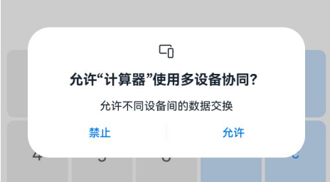
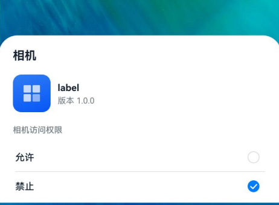
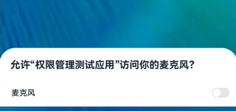

# @ohos.abilityAccessCtrl (程序访问控制管理)

<!--Kit: Ability Kit-->
<!--Subsystem: Security-->
<!--Owner: @xia-bubai-->
<!--Designer: @linshuqing; @hehehe-li-->
<!--Tester: @leiyuqian-->
<!--Adviser: @zengyawen-->

## 模块简介

程序访问控制提供应用程序的权限校验和管理能力，支持应用在访问受保护资源前进行权限状态判断、运行时授权申请、设置页授权引导和权限状态变化监听。权限分为system_grant（系统自动授权）、user_grant（需用户手动授权）和[manual_settings](../../security/AccessToken/app-permission-mgmt-overview.md#manual_settings手动设置授权)（手动设置授权）三类，应用需在配置文件中声明所需权限。权限管理机制详见[应用权限管控概述](../../security/AccessToken/app-permission-mgmt-overview.md)。

该模块主要用于以下场景：

- 在业务执行前校验当前应用是否具备访问受保护资源所需要的权限。
- 在权限未授予时，拉起运行时权限弹窗或权限设置页面，请求用户授权。
- 订阅当前应用的权限状态变化事件，在权限状态变化后及时调整业务流程。

> **说明：**
>
> - 本模块首批接口从API version 8开始支持。后续版本的新增接口，采用上角标单独标记接口的起始版本。

## 关键Class/Interface介绍

### 核心枚举类型

- **[GrantStatus](#grantstatus)：** 权限授权状态枚举，用于表示当前权限的授权状态。
- **[SwitchType](#switchtype12)：** 全局开关类型枚举，用于表示需要请求的系统全局开关类型。
- **[PermissionStateChangeType](#permissionstatechangetype18)：** 权限状态变化类型枚举，用于表示授权、取消授权等变化。
- **[PermissionStatus](#permissionstatus20)：** 权限状态枚举，用于表示当前权限状态。
- **[SelectedResult](#selectedresult22)：** 设置页授权选择结果枚举，用于表示用户在权限设置弹窗中的选择结果。

### 核心接口类型

- **[PermissionStateChangeInfo](#permissionstatechangeinfo18)：** 权限状态变化事件对象，用于返回变化类型、应用身份标识和权限名。
- **[PermissionRequestResult](#permissionrequestresult10)：** 权限申请结果对象，用于返回权限申请后的权限名列表、授权结果和弹窗展示结果。
- **[Context](#context10)：** 上下文对象，用于发起权限申请或打开权限设置弹窗。

### 核心类

- **[AtManager](#atmanager)：** 程序访问控制管理类，提供权限校验、权限弹窗申请、设置页授权引导和权限状态监听等能力。


### API组合使用关系说明

场景1：访问受保护资源前申请授权。

场景说明：应用访问相机、麦克风、位置等受保护资源前，可通过[AtManager](#atmanager)校验权限状态，等待返回授权状态后再判断是否需要请求用户授权。

典型使用流程如下：

```ts
import { abilityAccessCtrl, Context, Permissions, bundleManager, common } from '@kit.AbilityKit';

// 1. 创建权限管理实例
let atManager: abilityAccessCtrl.AtManager = abilityAccessCtrl.createAtManager();
let bundleInfo: bundleManager.BundleInfo =
  bundleManager.getBundleInfoForSelfSync(bundleManager.BundleFlag.GET_BUNDLE_INFO_WITH_APPLICATION);
let tokenID: number = bundleInfo.appInfo.accessTokenId;
let permissionName: Permissions = 'ohos.permission.CAMERA';
let context: Context = this.getUIContext().getHostContext() as common.UIAbilityContext;

// 2. 检查目标权限是否已授予
await atManager.checkAccessToken(tokenID, permissionName);

// 3. 如未授予，则向用户申请权限
await atManager.requestPermissionsFromUser(context, [permissionName]);

// 4. 申请完成后再次确认当前权限状态
atManager.getSelfPermissionStatus(permissionName);

// 5. 权限满足后再调用受保护的业务能力
// call protected API
```

场景2：引导用户通过设置页授权。

场景说明：当用户已拒绝授权，或当前权限仅允许通过设置页授权时，可先查询当前权限状态，再调用[openPermissionOnSetting](#openpermissiononsetting22)或[requestPermissionOnSetting](#requestpermissiononsetting12)引导用户继续完成授权。

典型使用流程如下：

```ts
import { abilityAccessCtrl, Context, Permissions, common } from '@kit.AbilityKit';

// 1. 创建权限管理实例
let atManager: abilityAccessCtrl.AtManager = abilityAccessCtrl.createAtManager();
let permissionName: Permissions = 'ohos.permission.CAMERA';
let context: Context = this.getUIContext().getHostContext() as common.UIAbilityContext;

// 2. 查询当前权限状态
atManager.getSelfPermissionStatus(permissionName);

// 3. 根据状态引导用户前往设置页
await atManager.openPermissionOnSetting(context, permissionName);

// 4. 或通过设置授权流程请求权限
await atManager.requestPermissionOnSetting(context, [permissionName]);
```

场景3：监听自身权限状态变化。

场景说明：应用需要根据授权变化实时调整界面或业务逻辑时，可使用[on](#on18)订阅自身权限状态变化；不再需要监听时，使用[off](#off18)取消订阅。

典型使用流程如下：

```ts
import { abilityAccessCtrl, Permissions } from '@kit.AbilityKit';

// 1. 创建权限管理实例
let atManager: abilityAccessCtrl.AtManager = abilityAccessCtrl.createAtManager();
let permissionList: Array<Permissions> = ['ohos.permission.APPROXIMATELY_LOCATION'];
let callback: (data: abilityAccessCtrl.PermissionStateChangeInfo) => void =
  (data: abilityAccessCtrl.PermissionStateChangeInfo): void => {
    console.info('receive permission state change');
    console.info(`data change: ${data.change}, tokenID: ${data.tokenID}, permission name: ${data.permissionName}`);
  };

// 2. 订阅指定权限的状态变化
atManager.on('selfPermissionStateChange', permissionList, callback);

// 3. 不再需要时取消订阅
atManager.off('selfPermissionStateChange', permissionList, callback);
```

## 导入模块

```ts
import { abilityAccessCtrl } from '@kit.AbilityKit';
```

## abilityAccessCtrl.createAtManager

createAtManager(): AtManager

创建程序访问控制管理实例，用于权限校验、运行时权限申请、设置页授权引导和权限状态变化监听等场景。调用成功后返回AtManager实例，可用于后续的权限管理操作。

**原子化服务API：** 从API version 11开始，该接口支持在原子化服务中使用。

**系统能力：** SystemCapability.Security.AccessToken


**返回值：**

| 类型 | 说明 |
| -------- | -------- |
| [AtManager](#atmanager) | 获取程序访问控制模块的实例。 |

**示例：**

```ts
// 创建权限管理实例
let atManager: abilityAccessCtrl.AtManager = abilityAccessCtrl.createAtManager();
```

## AtManager

程序访问控制管理类，提供权限校验、运行时权限弹窗申请、设置页授权引导、全局开关请求和权限状态监听等能力。通过[createAtManager](#abilityaccessctrlcreateatmanager)获取实例。

### checkAccessToken<sup>9+</sup>

checkAccessToken(tokenID: number, permissionName: Permissions): Promise&lt;GrantStatus&gt;

校验应用是否已被授予指定权限。调用成功后，返回当前权限的授权状态，开发者可据此决定直接执行后续业务、继续发起权限申请，或引导用户前往系统设置修改授权状态。使用Promise异步回调。

适用于应用访问相机、麦克风、位置等受保护资源前进行前置权限判断的场景。

**原子化服务API：** 从API version 11开始，该接口支持在原子化服务中使用。

**系统能力：** SystemCapability.Security.AccessToken

**参数：**

| 参数名   | 类型                 | 必填 | 说明                                       |
| -------- | -------------------  | ---- | ------------------------------------------ |
| tokenID   |  number   | 是   | 要校验的目标应用的身份标识。可通过[bundleManager.getBundleInfoSync](js-apis-bundleManager.md#bundlemanagergetbundleinfosync14)获取；若校验本应用，也可通过[bundleManager.getBundleInfoForSelfSync](js-apis-bundleManager.md#bundlemanagergetbundleinfoforselfsync10)获取。该参数必须为大于0的整数，传入0时返回错误码12100001。 |
| permissionName | [Permissions](../../security/AccessToken/app-permissions.md) | 是   | 需要校验的权限名称。权限名长度不能超过256个字符，传入无效值时返回错误码12100001。 |

**返回值：**

| 类型          | 说明                                |
| :------------ | :---------------------------------- |
| Promise&lt;[GrantStatus](#grantstatus)&gt; | Promise对象，返回授权状态结果。 |

**错误码：**

以下错误码的详细介绍请参见[通用错误码](../errorcode-universal.md)和[访问控制错误码](errorcode-access-token.md)。

| 错误码ID | 错误信息 |
| -------- | -------- |
| 401 | Parameter error. Possible causes: 1.Mandatory parameters are left unspecified; 2.Incorrect parameter types. |
| 12100001 | Invalid parameter. The tokenID is 0, or the permissionName exceeds 256 characters. |

**示例：**

```ts
import { abilityAccessCtrl, Permissions, bundleManager } from '@kit.AbilityKit';
import { BusinessError } from '@kit.BasicServicesKit';

// 创建权限管理器实例
let atManager: abilityAccessCtrl.AtManager = abilityAccessCtrl.createAtManager();
// 获取应用的bundleInfo信息
let bundleInfo = bundleManager.getBundleInfoForSelfSync(bundleManager.BundleFlag.GET_BUNDLE_INFO_WITH_APPLICATION);
// 获取应用的TokenID
let tokenID: number = bundleInfo.appInfo.accessTokenId;
// 设置需要校验的权限名
let permissionName: Permissions = 'ohos.permission.GRANT_SENSITIVE_PERMISSIONS';
// 校验应用是否被授予权限
atManager.checkAccessToken(tokenID, permissionName).then((data: abilityAccessCtrl.GrantStatus) => {
  console.info(`checkAccessToken success, result: ${data}`);
}).catch((err: BusinessError): void => {
  console.error(`checkAccessToken fail, code: ${err.code}, message: ${err.message}`);
});
```

### checkAccessTokenSync<sup>10+</sup>

checkAccessTokenSync(tokenID: number, permissionName: Permissions): GrantStatus

校验应用是否已被授予指定权限，同步返回该权限的授权状态。开发者可据此决定直接执行后续业务流程，或继续发起权限申请，或引导用户前往设置页修改授权状态。

与[checkAccessToken](#checkaccesstoken9)相比，本接口同步返回授权状态，适用于无需异步处理的权限校验场景。

适用于应用访问相机、麦克风、位置等受保护资源前进行前置权限判断的场景。

**原子化服务API：** 从API version 11开始，该接口支持在原子化服务中使用。

**系统能力：** SystemCapability.Security.AccessToken

**参数：**

| 参数名   | 类型                 | 必填 | 说明                                       |
| -------- | -------------------  | ---- | ------------------------------------------ |
| tokenID   |  number   | 是   | 要校验的目标应用的身份标识。可通过[bundleManager.getBundleInfoSync](js-apis-bundleManager.md#bundlemanagergetbundleinfosync14)获取；若校验本应用，也可通过[bundleManager.getBundleInfoForSelfSync](js-apis-bundleManager.md#bundlemanagergetbundleinfoforselfsync10)获取。该参数必须为大于0的整数，传入0时返回错误码12100001。 |
| permissionName | [Permissions](../../security/AccessToken/app-permissions.md) | 是   | 需要校验的权限名称。权限名长度不能超过256个字符，传入无效值时返回错误码12100001。 |

**返回值：**

| 类型          | 说明                                |
| :------------ | :---------------------------------- |
| [GrantStatus](#grantstatus) | 枚举实例，返回授权状态。 |

**错误码：**

以下错误码的详细介绍请参见[通用错误码](../errorcode-universal.md)和[访问控制错误码](errorcode-access-token.md)。

| 错误码ID | 错误信息 |
| -------- | -------- |
| 401 | Parameter error. Possible causes: 1.Mandatory parameters are left unspecified; 2.Incorrect parameter types. |
| 12100001 | Invalid parameter. The tokenID is 0, or the permissionName exceeds 256 characters. |

**示例：**

```ts
import { abilityAccessCtrl, Permissions, bundleManager } from '@kit.AbilityKit';

// 创建权限管理器实例
let atManager: abilityAccessCtrl.AtManager = abilityAccessCtrl.createAtManager();
// 获取应用的bundleInfo信息
let bundleInfo = bundleManager.getBundleInfoForSelfSync(bundleManager.BundleFlag.GET_BUNDLE_INFO_WITH_APPLICATION);
// 获取应用的TokenID
let tokenID: number = bundleInfo.appInfo.accessTokenId;
// 设置需要校验的权限名
let permissionName: Permissions = 'ohos.permission.GRANT_SENSITIVE_PERMISSIONS';
// 同步校验应用是否被授予权限
let data: abilityAccessCtrl.GrantStatus = atManager.checkAccessTokenSync(tokenID, permissionName);
console.info(`Result: ${data}`);
```

### on<sup>18+</sup>

on(type: 'selfPermissionStateChange', permissionList: Array&lt;Permissions&gt;, callback: Callback&lt;PermissionStateChangeInfo&gt;): void

订阅本应用的指定权限列表的权限授权状态变化事件，使用callback异步回调。可在需要根据权限状态实时更新UI或业务逻辑、监听用户授权行为等场景中使用。不再需要监听时，调用[off](#off18)取消订阅。
- 多次调用本订阅接口时，如果订阅的权限列表相同，callback不同，允许订阅成功。
- 多次调用本订阅接口时，如果订阅的权限列表间有相同的子集，callback相同时，订阅失败。

权限状态由“已授权”变更为“未授权”可能存在两种场景：
- 用户主动撤销：系统会终止对应应用进程。
- 系统主动回收：应用进程不会终止。典型场景如安全控件的单次授权，在授权周期结束后由系统自动回收。

该接口通常与[off](#off18)配套使用，当不再需要监听时应调用off取消订阅。

**原子化服务API：** 从API version 18开始，该接口支持在原子化服务中使用。

**系统能力：** SystemCapability.Security.AccessToken

**参数：**

| 参数名             | 类型                   | 必填 | 说明                                                          |
| ------------------ | --------------------- | ---- | ------------------------------------------------------------ |
| type               | string                | 是   | 订阅事件类型，固定为'selfPermissionStateChange'，自身权限状态变更事件。  |
| permissionList | Array&lt;[Permissions](../../security/AccessToken/app-permissions.md)&gt;   | 是   | 订阅的权限名列表，如果为空，则表示订阅所有的权限状态变化。<br/>权限列表中的权限名长度不能超过256个字符，当列表中所有权限名均无效时返回错误码12100001。<br/>该数组长度不能超过1024，超出限制时返回错误码12100001。 |
| callback | Callback&lt;[PermissionStateChangeInfo](#permissionstatechangeinfo18)&gt; | 是 | 回调函数。订阅指定权限名状态变更事件的回调。|

**错误码：**

以下错误码的详细介绍请参见[通用错误码](../errorcode-universal.md)和[访问控制错误码](errorcode-access-token.md)。

| 错误码ID | 错误信息 |
| -------- | -------- |
| 401 | Parameter error. Possible causes: 1.Mandatory parameters are left unspecified; 2.Incorrect parameter types. |
| 12100001 | Invalid parameter. Possible causes: 1. The permissionList exceeds the size limit; 2. The permissionNames in the list are all invalid. |
| 12100004 | The API is used repeatedly with the same input. |
| 12100005 | The registration time has exceeded the limit. |
| 12100007 | The service is abnormal. |

**示例：**

```ts
import { abilityAccessCtrl, Permissions } from '@kit.AbilityKit';
import { BusinessError } from '@kit.BasicServicesKit';

try {
  // 创建权限管理实例
  let atManager: abilityAccessCtrl.AtManager = abilityAccessCtrl.createAtManager();
  // 设置需要订阅的权限列表
  let permissionList: Array<Permissions> = ['ohos.permission.APPROXIMATELY_LOCATION'];
  // 订阅权限状态变化
  atManager.on('selfPermissionStateChange', permissionList, (data: abilityAccessCtrl.PermissionStateChangeInfo) => {
    console.info('receive permission state change');
    console.info(`data change: ${data.change}, tokenID: ${data.tokenID}, permission name: ${data.permissionName}`);
  });
} catch (err) {
  let error = err as BusinessError;
  console.error(`Code: ${error.code}, message: ${error.message}`);
}
```

### off<sup>18+</sup>

off(type: 'selfPermissionStateChange', permissionList: Array&lt;Permissions&gt;, callback?: Callback&lt;PermissionStateChangeInfo&gt;): void

取消订阅自身指定权限列表的权限状态变更事件。取消订阅成功后，将不再接收指定权限列表的状态变化通知。

在无需继续监听权限变化、应用退出或切换页面等场景下，可调用该接口取消订阅。

当不传入callback参数时，将批量删除与permissionList相关联的所有回调函数。

该接口通常与[on](#on18)配套使用，用于取消通过on创建的监听关系。

**原子化服务API：** 从API version 18开始，该接口支持在原子化服务中使用。

**系统能力：** SystemCapability.Security.AccessToken

**参数：**

| 参数名             | 类型                   | 必填 | 说明                                                          |
| ------------------ | --------------------- | ---- | ------------------------------------------------------------ |
| type               | string         | 是   | 取消订阅事件类型，固定为'selfPermissionStateChange'，权限状态变更事件。  |
| permissionList | Array&lt;[Permissions](../../security/AccessToken/app-permissions.md)&gt;   | 是   | 取消订阅的权限名列表，为空时表示取消订阅所有的权限状态变化，必须与[on](#on18)订阅时的权限列表匹配（不区分顺序）。 |
| callback | Callback&lt;[PermissionStateChangeInfo](#permissionstatechangeinfo18)&gt; | 否 | 回调函数。取消订阅指定权限名状态变更事件的回调。不传入此参数时，将批量删除与permissionList相关联的所有回调函数。|

**错误码：**

以下错误码的详细介绍请参见[通用错误码](../errorcode-universal.md)和[访问控制错误码](errorcode-access-token.md)。

| 错误码ID | 错误信息 |
| -------- | -------- |
| 401 | Parameter error. Possible causes: 1.Mandatory parameters are left unspecified; 2.Incorrect parameter types. |
| 12100004 | The API is not used in pair with "on". |
| 12100007 | The service is abnormal. |

**示例：**

```ts
import { abilityAccessCtrl, Permissions } from '@kit.AbilityKit';
import { BusinessError } from '@kit.BasicServicesKit';

try {
  // 创建权限管理实例
  let atManager: abilityAccessCtrl.AtManager = abilityAccessCtrl.createAtManager();
  // 设置需要取消订阅的权限列表
  let permissionList: Array<Permissions> = ['ohos.permission.APPROXIMATELY_LOCATION'];
  // 取消订阅权限状态变化
  atManager.off('selfPermissionStateChange', permissionList);
} catch (err) {
  let error = err as BusinessError;
  console.error(`Code: ${error.code}, message: ${error.message}`);
}
```

### requestPermissionsFromUser<sup>9+</sup>

requestPermissionsFromUser(context: Context, permissionList: Array&lt;Permissions&gt;, requestCallback: AsyncCallback&lt;PermissionRequestResult&gt;): void

用于<!--RP1-->[UIAbility](js-apis-app-ability-uiAbility.md#uiability)<!--RP1End-->拉起弹窗请求[用户授权](../../security/AccessToken/request-user-authorization.md)，返回本次请求权限的授权结果。使用callback异步回调。

适用于应用首次访问受保护资源前主动向用户申请 [user_grant](../../security/AccessToken/app-permission-mgmt-overview.md#user_grant用户授权) 权限的场景。

如果用户拒绝授权，将无法通过此接口再次拉起授权弹窗。开发者可引导用户前往系统设置界面手动授权，或调用[requestPermissionOnSetting](#requestpermissiononsetting12)拉起权限设置弹窗，引导用户完成授权。

<!--RP3-->

<!--RP3End-->

**原子化服务API：** 从API version 12开始，该接口支持在原子化服务中使用。

**模型约束：** 此接口仅可在Stage模型下使用。

**系统能力：** SystemCapability.Security.AccessToken

**参数：**

| 参数名 | 类型 | 必填 | 说明 |
| -------- | -------- | -------- | -------- |
| context | [Context](js-apis-inner-application-context.md) | 是 | 请求权限的<!--RP1-->UIAbility<!--RP1End-->的Context。若传入其他应用、无效页面或非Stage模型的Context，接口可能报错或无法拉起弹窗。 |
| permissionList | Array&lt;[Permissions](../../security/AccessToken/app-permissions.md)&gt; | 是 | 权限名列表。该数组不能为空，建议仅传入当前业务场景必要的敏感权限，避免一次申请过多权限。权限名长度不能超过256个字符。 |
| requestCallback | AsyncCallback&lt;[PermissionRequestResult](js-apis-permissionrequestresult.md)&gt; | 是 | 回调函数。调用完成后通过err返回错误信息，通过data返回权限请求结果对象。开发者可根据权限请求结果判断用户是否授权、是否展示过弹窗以及失败原因。 |

**错误码：**

以下错误码的详细介绍请参见[通用错误码](../errorcode-universal.md)和[访问控制错误码](errorcode-access-token.md)。

| 错误码ID | 错误信息 |
| -------- | -------- |
| 401 | Parameter error. Possible causes: 1.Mandatory parameters are left unspecified; 2.Incorrect parameter types. |
| 12100001 | (Deprecated in 12) Invalid parameter. The context is invalid when it does not belong to the application itself. |
| 12100009 | Common inner error. An error occurs when creating the pop-up window or obtaining user operation results. |

**示例：**

下述示例中context的获取方式请参见[获取UIAbility的上下文信息](../../application-models/uiability-usage.md#获取uiability的上下文信息)。

关于向用户申请授权的完整流程及示例，请参见[向用户申请授权](../../security/AccessToken/request-user-authorization.md)。
<!--code_no_check-->
```ts
import { abilityAccessCtrl, Context, PermissionRequestResult, common } from '@kit.AbilityKit';
import { BusinessError } from '@kit.BasicServicesKit';

// 创建权限管理器实例
let atManager: abilityAccessCtrl.AtManager = abilityAccessCtrl.createAtManager();
// 请在组件内获取context
let context: Context = this.getUIContext().getHostContext() as common.UIAbilityContext;
// 请求用户授权
atManager.requestPermissionsFromUser(context, ['ohos.permission.CAMERA'], (err: BusinessError, data: PermissionRequestResult) => {
  if (err) {
    console.error(`requestPermissionsFromUser fail, code: ${err.code}, message: ${err.message}`);
  } else {
    console.info(`requestPermissionsFromUser success, result: ${data}`);
    console.info('requestPermissionsFromUser data permissions:' + data.permissions);
    console.info('requestPermissionsFromUser data authResults:' + data.authResults);
    console.info('requestPermissionsFromUser data dialogShownResults:' + data.dialogShownResults);
    console.info('requestPermissionsFromUser data errorReasons:' + data.errorReasons);
  }
});
```

### requestPermissionsFromUser<sup>9+</sup>

requestPermissionsFromUser(context: Context, permissionList: Array&lt;Permissions&gt;): Promise&lt;PermissionRequestResult&gt;

用于<!--RP1-->[UIAbility](js-apis-app-ability-uiAbility.md#uiability)<!--RP1End-->拉起弹窗请求[用户授权](../../security/AccessToken/request-user-authorization.md)，返回本次请求权限的授权结果。使用Promise异步回调。

适用于应用首次访问受保护资源前主动向用户申请user_grant权限的场景。

如果用户拒绝授权，将无法通过此接口再次拉起授权弹窗。开发者可引导用户前往系统设置界面手动授权，或调用[requestPermissionOnSetting](#requestpermissiononsetting12)拉起权限设置弹窗，引导用户完成授权。

**原子化服务API：** 从API version 11开始，该接口支持在原子化服务中使用。

**模型约束：** 此接口仅可在Stage模型下使用。

**系统能力：** SystemCapability.Security.AccessToken

**参数：**

| 参数名 | 类型 | 必填 | 说明 |
| -------- | -------- | -------- | -------- |
| context | [Context](js-apis-inner-application-context.md) | 是 | 请求权限的<!--RP1-->UIAbility<!--RP1End-->的Context。若传入其他应用、无效页面或非Stage模型的Context，接口可能报错或无法拉起弹窗。 |
| permissionList | Array&lt;[Permissions](../../security/AccessToken/app-permissions.md)&gt; | 是 | 权限名列表。该数组不能为空，建议仅传入当前业务场景必要的敏感权限，避免一次申请过多权限。权限名长度不能超过256个字符。 |

**返回值：**

| 类型 | 说明 |
| -------- | -------- |
| Promise&lt;[PermissionRequestResult](js-apis-permissionrequestresult.md)&gt; | Promise对象，返回权限请求结果对象，包含权限数组、每个权限的授权结果、是否展示弹窗以及失败原因等信息。 |

**错误码：**

以下错误码的详细介绍请参见[通用错误码](../errorcode-universal.md)和[访问控制错误码](errorcode-access-token.md)。

| 错误码ID | 错误信息 |
| -------- | -------- |
| 401 | Parameter error. Possible causes: 1.Mandatory parameters are left unspecified; 2.Incorrect parameter types. |
| 12100001 | (Deprecated in 12) Invalid parameter. The context is invalid when it does not belong to the application itself. |
| 12100009 | Common inner error. An error occurs when creating the pop-up window or obtaining user operation results. |

**示例：**

下述示例中context的获取方式请参见[获取UIAbility的上下文信息](../../application-models/uiability-usage.md#获取uiability的上下文信息)。

关于向用户申请授权的完整流程及示例，请参见[向用户申请授权](../../security/AccessToken/request-user-authorization.md)。
<!--code_no_check-->
```ts
import { abilityAccessCtrl, Context, PermissionRequestResult, common } from '@kit.AbilityKit';
import { BusinessError } from '@kit.BasicServicesKit';

// 创建权限管理器实例
let atManager: abilityAccessCtrl.AtManager = abilityAccessCtrl.createAtManager();
// 请在组件内获取context
let context: Context = this.getUIContext().getHostContext() as common.UIAbilityContext;
// 请求用户授权
atManager.requestPermissionsFromUser(context, ['ohos.permission.CAMERA']).then((data: PermissionRequestResult) => {
  console.info(`requestPermissionsFromUser success, result: ${data}`);
  console.info('requestPermissionsFromUser data permissions:' + data.permissions);
  console.info('requestPermissionsFromUser data authResults:' + data.authResults);
  console.info('requestPermissionsFromUser data dialogShownResults:' + data.dialogShownResults);
  console.info('requestPermissionsFromUser data errorReasons:' + data.errorReasons);
}).catch((err: BusinessError): void => {
  console.error(`requestPermissionsFromUser fail, code: ${err.code}, message: ${err.message}`);
});
```

### requestPermissionOnSetting<sup>12+</sup>

requestPermissionOnSetting(context: Context, permissionList: Array&lt;Permissions&gt;): Promise&lt;Array&lt;GrantStatus&gt;&gt;

用于[UIAbility](js-apis-app-ability-uiAbility.md#uiability)/[UIExtensionAbility](js-apis-app-ability-uiExtensionAbility.md#uiextensionability)二次拉起权限设置弹窗，返回授权状态数组。使用Promise异步回调。

适用于用户在首次弹窗中已拒绝过该权限授予，需要通过设置页面继续申请权限的场景。

在调用此接口前，应用需要先调用[requestPermissionsFromUser](#requestpermissionsfromuser9)。如果用户已在首次弹窗中授权，则调用当前接口不会拉起授权弹窗。

<!--RP4-->

<!--RP4End-->

**原子化服务API：** 从API version 12开始，该接口支持在原子化服务中使用。

**模型约束：** 此接口仅可在Stage模型下使用。

**系统能力：** SystemCapability.Security.AccessToken

**参数：**

| 参数名 | 类型 | 必填 | 说明 |
| -------- | -------- | -------- | -------- |
| context | [Context](js-apis-inner-application-context.md) | 是 | 请求权限的UIAbility/UIExtensionAbility的Context。若传入其他应用、无效页面或非Stage模型的Context，接口可能报错或无法拉起弹窗。 |
| permissionList | Array&lt;[Permissions](../../security/AccessToken/app-permissions.md)&gt; | 是 | 权限名列表。该数组不能为空，仅支持传入已声明且用户已撤销授权的user_grant权限，且传入权限需属于同一[权限组](../../security/AccessToken/app-permission-group-list.md)。权限名长度不能超过256个字符。 |

**返回值：**

| 类型          | 说明                                |
| :------------ | :---------------------------------- |
| Promise&lt;Array&lt;[GrantStatus](#grantstatus)&gt;&gt; | Promise对象，返回授权状态数组，数组中每个元素对应permissionList中相应权限的授权结果。|

**错误码：**

以下错误码的详细介绍请参见[访问控制错误码](errorcode-access-token.md)。

| 错误码ID | 错误信息 |
| -------- | -------- |
| 12100001 | Invalid parameter. Possible causes:<br>1. The context is invalid because it does not belong to the application itself;<br>2. The permission list contains the permission that is not declared in the module.json file;<br>3. The permission list is invalid because the permissions in it do not belong to the same permission group;<br>4. The permission list contains one or more system_grant permissions. |
| 12100009 | Common inner error. An error occurs when creating the pop-up window or obtaining user operation result. |
| 12100011 | All permissions in the permission list have been granted. |
| 12100012 | The permission list contains the permission that has not been revoked by the user. |
| 12100014 | Unexpected permission. You cannot request this type of permission from users via a pop-up window. |

**示例：**
示例中context的获取方式请参见[获取UIAbility的上下文信息](../../application-models/uiability-usage.md#获取uiability的上下文信息)。
<!--code_no_check-->
```ts
import { abilityAccessCtrl, Context, common } from '@kit.AbilityKit';
import { BusinessError } from '@kit.BasicServicesKit';

// 创建权限管理器实例
let atManager: abilityAccessCtrl.AtManager = abilityAccessCtrl.createAtManager();
// 请在组件内获取context
let context: Context = this.getUIContext().getHostContext() as common.UIAbilityContext;
// 拉起权限设置弹窗
atManager.requestPermissionOnSetting(context, ['ohos.permission.CAMERA']).then((data: Array<abilityAccessCtrl.GrantStatus>) => {
  console.info(`requestPermissionOnSetting success, result: ${data}`);
}).catch((err: BusinessError): void => {
  console.error(`requestPermissionOnSetting fail, code: ${err.code}, message: ${err.message}`);
});
```

### requestGlobalSwitch<sup>12+</sup>

requestGlobalSwitch(context: Context, type: SwitchType): Promise&lt;boolean&gt;

用于UIAbility/UIExtensionAbility拉起全局开关设置弹窗。调用成功后，若全局开关处于关闭状态，则弹出全局开关设置界面供用户操作；若全局开关已开启，则不拉起弹窗并返回true。使用Promise异步回调。

适用于依赖系统级全局开关（如相机、麦克风、定位）开启的场景。

当应用需要使用相机、麦克风或定位等需要全局开关管控的功能时，如果对应的全局开关被关闭，应用可拉起此弹窗请求用户开启对应功能。如果当前全局开关的状态为开启，则不拉起弹窗。

<!--RP5-->

<!--RP5End-->

**原子化服务API：** 从API version 12开始，该接口支持在原子化服务中使用。

**模型约束：** 此接口仅可在Stage模型下使用。

**系统能力：** SystemCapability.Security.AccessToken

**参数：**

| 参数名 | 类型 | 必填 | 说明 |
| -------- | -------- | -------- | -------- |
| context | [Context](js-apis-inner-application-context.md) | 是 | 请求全局开关的UIAbility/UIExtensionAbility的Context。若传入其他应用、无效页面或非Stage模型的Context，接口可能报错或无法拉起弹窗。 |
| type | [SwitchType](#switchtype12) | 是 | 指定需要请求开启的全局开关类型。 |

**返回值：**

| 类型          | 说明                                |
| :------------ | :---------------------------------- |
| Promise&lt;boolean&gt; | Promise对象。返回true表示当前全局开关处于开启状态；返回false表示当前全局开关仍处于关闭状态。 |

**错误码：**

以下错误码的详细介绍请参见[通用错误码](../errorcode-universal.md)和[访问控制错误码](errorcode-access-token.md)。

| 错误码ID | 错误信息 |
| -------- | -------- |
| 401 | Parameter error. Possible causes: 1. Mandatory parameters are left unspecified; 2. Incorrect parameter types. |
| 12100001 | Invalid parameter. Possible causes: 1. The context is invalid because it does not belong to the application itself; 2. The type of global switch is not support. |
| 12100009 | Common inner error. An error occurs when creating the pop-up window or obtaining user operation result. |
| 12100013 | The specific global switch is already open. |

**示例：**
示例中context的获取方式请参见[获取UIAbility的上下文信息](../../application-models/uiability-usage.md#获取uiability的上下文信息)。
<!--code_no_check-->
```ts
import { abilityAccessCtrl, Context, common } from '@kit.AbilityKit';
import { BusinessError } from '@kit.BasicServicesKit';

// 创建权限管理器实例
let atManager: abilityAccessCtrl.AtManager = abilityAccessCtrl.createAtManager();
// 请在组件内获取context
let context: Context = this.getUIContext().getHostContext() as common.UIAbilityContext;
// 拉起全局开关设置弹窗
atManager.requestGlobalSwitch(context, abilityAccessCtrl.SwitchType.CAMERA).then((data: boolean) => {
  console.info(`requestGlobalSwitch success, result: ${data}`);
}).catch((err: BusinessError): void => {
  console.error(`requestGlobalSwitch fail, code: ${err.code}, message: ${err.message}`);
});
```

### getSelfPermissionStatus<sup>20+</sup>

getSelfPermissionStatus(permissionName: Permissions): PermissionStatus

查询当前应用的权限状态，同步返回结果。调用成功后，返回当前权限的状态。与[checkAccessToken](#checkaccesstoken9)不同，本接口无需传入应用身份标识，仅用于查询当前应用自身权限状态。

适用于在判断是否需要请求权限前、权限申请后确认授权结果、或监听到权限状态变化后重新查询等场景。

**原子化服务API：** 从API version 20开始，该接口支持在原子化服务中使用。

**系统能力：** SystemCapability.Security.AccessToken

**参数：**

| 参数名 | 类型 | 必填 | 说明 |
| -------- | -------- | -------- | -------- |
| permissionName | [Permissions](../../security/AccessToken/app-permissions.md) | 是   | 需要查询状态的权限名称。权限名不能为空，且长度不能超过256个字符，传入无效值时返回错误码12100001。 |

**返回值：**

| 类型          | 说明                                |
| :------------ | :---------------------------------- |
| [PermissionStatus](#permissionstatus20) | 枚举实例，返回权限状态。 |

**错误码：**

以下错误码的详细介绍请参见[访问控制错误码](errorcode-access-token.md)。

| 错误码ID | 错误信息 |
| -------- | -------- |
| 12100001 | Invalid parameter. The permissionName is empty or exceeds 256 characters. |
| 12100007 | The service is abnormal. |

**示例：**

```ts
import { abilityAccessCtrl } from '@kit.AbilityKit';
import { BusinessError } from '@kit.BasicServicesKit';

// 创建权限管理实例
let atManager: abilityAccessCtrl.AtManager = abilityAccessCtrl.createAtManager();
try {
  // 查询当前应用的权限状态
  let data: abilityAccessCtrl.PermissionStatus = atManager.getSelfPermissionStatus('ohos.permission.CAMERA');
  console.info(`getSelfPermissionStatus success, result: ${data}`);
} catch (err) {
  let error = err as BusinessError;
  console.error(`getSelfPermissionStatus fail, code: ${error.code}, message: ${error.message}`);
}
```

### openPermissionOnSetting<sup>22+</sup>

openPermissionOnSetting(context: Context, permission: Permissions): Promise&lt;SelectedResult&gt;

用于[UIAbility](js-apis-app-ability-uiAbility.md#uiability)/[UIExtensionAbility](js-apis-app-ability-uiExtensionAbility.md#uiextensionability)拉起权限设置页面。调用成功后会打开权限设置页面，用户在页面中操作后，返回用户在设置页面中的选择结果。使用Promise异步回调。

适用于 [manual_settings](../../security/AccessToken/app-permission-mgmt-overview.md#manual_settings手动设置授权) 类型权限无法通过普通授权弹窗申请、必须引导用户进入系统设置完成授权的场景。manual_settings类型权限是指只能由用户在系统设置中手动开启的权限，无法通过普通授权弹窗直接申请。

**模型约束：** 此接口仅可在Stage模型下使用。

**系统能力：** SystemCapability.Security.AccessToken

**参数：**

| 参数名 | 类型 | 必填 | 说明 |
| -------- | -------- | -------- | -------- |
| context | [Context](js-apis-inner-application-context.md) | 是 | 请求权限的UIAbility/UIExtensionAbility的Context。若传入其他应用、无效页面或非Stage模型的Context，接口可能报错或无法打开设置页面。 |
| permission | [Permissions](../../security/AccessToken/app-permissions.md) | 是 | 需要跳转设置页处理的权限名。权限名长度不能超过256个字符。传入无效或未在module.json中声明的权限时返回错误码12100001；仅支持授权方式为[manual_settings](../../security/AccessToken/app-permission-mgmt-overview.md#manual_settings手动设置授权)类型的权限，传入其他类型权限时返回错误码12100014。 |

**返回值：**

| 类型          | 说明                                |
| :------------ | :---------------------------------- |
| Promise&lt;[SelectedResult](#selectedresult22)&gt; | Promise对象，返回用户在设置页面中的选择结果。 |

**错误码：**

以下错误码的详细介绍请参见[访问控制错误码](errorcode-access-token.md)。

| 错误码ID | 错误信息 |
| -------- | -------- |
| 12100001 | Invalid parameter. Possible causes:<br>1. The context is invalid because it does not belong to the application itself;<br>2. The permission is invalid or not declared in the module.json file. |
| 12100009 | Common inner error. An error occurs when creating the pop-up window or obtaining user operation result. |
| 12100014 | Unexpected permission. The permission is not a manual_settings permission. |

**示例：**

示例中context的获取方式请参见[获取UIAbility的上下文信息](../../application-models/uiability-usage.md#获取uiability的上下文信息)。

```ts
import { abilityAccessCtrl, Context, common } from '@kit.AbilityKit';
import { BusinessError } from '@kit.BasicServicesKit';

// 创建权限管理器实例
let atManager: abilityAccessCtrl.AtManager = abilityAccessCtrl.createAtManager();
// 请在组件内获取context
let context: Context = this.getUIContext().getHostContext() as common.UIAbilityContext;
// 拉起跳转设置页弹窗
atManager.openPermissionOnSetting(context, 'ohos.permission.HOOK_KEY_EVENT').then((data: abilityAccessCtrl.SelectedResult) => {
  console.info(`openPermissionOnSetting success, result: ${data}`);
}).catch((err: BusinessError): void => {
  console.error(`openPermissionOnSetting fail, code: ${err.code}, message: ${err.message}`);
});
```

### verifyAccessTokenSync<sup>9+</sup>

verifyAccessTokenSync(tokenID: number, permissionName: Permissions): GrantStatus

校验应用是否已被授予指定权限，同步返回该权限的授权状态。开发者可据此决定直接执行后续业务流程，或继续发起权限申请，或引导用户前往系统设置修改授权状态。

适用于应用访问相机、麦克风、位置等受保护资源前进行前置权限判断的场景。

建议使用[checkAccessTokenSync](#checkaccesstokensync10)替代。

**系统能力：** SystemCapability.Security.AccessToken

**参数：**

| 参数名   | 类型                 | 必填 | 说明                                       |
| -------- | -------------------  | ---- | ------------------------------------------ |
| tokenID   |  number   | 是   | 要校验的目标应用的身份标识。可通过[bundleManager.getBundleInfoSync](js-apis-bundleManager.md#bundlemanagergetbundleinfosync14)获取；若校验本应用，也可通过[bundleManager.getBundleInfoForSelfSync](js-apis-bundleManager.md#bundlemanagergetbundleinfoforselfsync10)获取。该参数必须为大于0的整数，传入0时返回错误码12100001。 |
| permissionName | [Permissions](../../security/AccessToken/app-permissions.md) | 是   | 需要校验的权限名称。权限名长度不能超过256个字符，传入无效值时返回错误码12100001。 |

**返回值：**

| 类型          | 说明                                |
| :------------ | :---------------------------------- |
| [GrantStatus](#grantstatus) | 枚举实例，返回授权状态。 |

**错误码：**

以下错误码的详细介绍请参见[通用错误码](../errorcode-universal.md)和[访问控制错误码](errorcode-access-token.md)。

| 错误码ID | 错误信息 |
| -------- | -------- |
| 401 | Parameter error. Possible causes: 1.Mandatory parameters are left unspecified; 2.Incorrect parameter types. |
| 12100001 | Invalid parameter. The tokenID is 0, or the permissionName exceeds 256 characters. |

**示例：**

```ts
import { abilityAccessCtrl, Permissions, bundleManager } from '@kit.AbilityKit';
import { BusinessError } from '@kit.BasicServicesKit';

// 创建权限管理器实例
let atManager: abilityAccessCtrl.AtManager = abilityAccessCtrl.createAtManager();
// 获取应用的bundleInfo信息
let bundleInfo = bundleManager.getBundleInfoForSelfSync(bundleManager.BundleFlag.GET_BUNDLE_INFO_WITH_APPLICATION);
// 获取应用的TokenID
let tokenID: number = bundleInfo.appInfo.accessTokenId;
try {
  // 设置需要校验的权限名
  let permissionName: Permissions = 'ohos.permission.GRANT_SENSITIVE_PERMISSIONS';
  // 同步校验应用是否被授予权限
  let data: abilityAccessCtrl.GrantStatus = atManager.verifyAccessTokenSync(tokenID, permissionName);
  console.info(`verifyAccessTokenSync success, result: ${data}`);
} catch (err) {
  let error = err as BusinessError;
  console.error(`verifyAccessTokenSync fail, code: ${error.code}, message: ${error.message}`);
}
```

### verifyAccessToken<sup>9+</sup>

verifyAccessToken(tokenID: number, permissionName: Permissions): Promise&lt;GrantStatus&gt;

校验应用是否已被授予指定权限，调用成功后，返回当前权限的授权状态，开发者可据此决定直接执行后续业务、继续发起权限申请，或引导用户前往系统设置修改授权状态。使用Promise异步回调。

适用于应用访问受保护资源前进行前置权限判断的场景。

> **说明：**
>
> 建议使用[checkAccessToken](#checkaccesstoken9)替代。

**系统能力：** SystemCapability.Security.AccessToken

**参数：**

| 参数名   | 类型                 | 必填 | 说明                                       |
| -------- | -------------------  | ---- | ------------------------------------------ |
| tokenID   |  number   | 是   | 要校验的目标应用的身份标识。可通过[bundleManager.getBundleInfoSync](js-apis-bundleManager.md#bundlemanagergetbundleinfosync14)获取；若校验本应用，也可通过[bundleManager.getBundleInfoForSelfSync](js-apis-bundleManager.md#bundlemanagergetbundleinfoforselfsync10)获取。该参数必须为大于0的整数，传入0时返回错误码12100001。 |
| permissionName | [Permissions](../../security/AccessToken/app-permissions.md) | 是   | 需要校验的权限名称。权限名长度不能超过256个字符，传入无效值时返回错误码12100001。 |

**返回值：**

| 类型          | 说明                                |
| :------------ | :---------------------------------- |
| Promise&lt;[GrantStatus](#grantstatus)&gt; | Promise对象，返回授权状态结果。 |

**示例：**

```ts
import { abilityAccessCtrl, Permissions, bundleManager } from '@kit.AbilityKit';
import { BusinessError } from '@kit.BasicServicesKit';

// 创建权限管理器实例
let atManager: abilityAccessCtrl.AtManager = abilityAccessCtrl.createAtManager();
// 获取应用的bundleInfo信息
let bundleInfo = bundleManager.getBundleInfoForSelfSync(bundleManager.BundleFlag.GET_BUNDLE_INFO_WITH_APPLICATION);
// 获取应用的TokenID
let tokenID: number = bundleInfo.appInfo.accessTokenId;
// 设置需要校验的权限名
let permissionName: Permissions = 'ohos.permission.GRANT_SENSITIVE_PERMISSIONS';
// 校验应用是否被授予权限
atManager.verifyAccessToken(tokenID, permissionName).then((data: abilityAccessCtrl.GrantStatus) => {
  console.info(`verifyAccessToken success, result: ${data}`);
}).catch((err: BusinessError): void => {
  console.error(`verifyAccessToken fail, code: ${err.code}, message: ${err.message}`);
});
```

### verifyAccessToken<sup>(deprecated)</sup>

verifyAccessToken(tokenID: number, permissionName: string): Promise&lt;GrantStatus&gt;

校验应用是否已被授予指定权限。调用成功后，返回当前权限的授权状态，开发者可据此决定后续操作。使用Promise异步回调。

> **说明：**
>
> 从API version 8开始支持，从API version 9开始废弃，建议使用[checkAccessToken](#checkaccesstoken9)替代。

**系统能力：** SystemCapability.Security.AccessToken

**参数：**

| 参数名   | 类型                 | 必填 | 说明                                       |
| -------- | -------------------  | ---- | ------------------------------------------ |
| tokenID   |  number   | 是   | 要校验的目标应用的身份标识。可通过[bundleManager.getBundleInfoSync](js-apis-bundleManager.md#bundlemanagergetbundleinfosync14)获取；若校验本应用，也可通过[bundleManager.getBundleInfoForSelfSync](js-apis-bundleManager.md#bundlemanagergetbundleinfoforselfsync10)获取。该参数必须为大于0的整数，传入0时返回错误码12100001。 |
| permissionName | string | 是   | 需要校验的权限名称。权限名长度不能超过256个字符，传入无效值时返回错误码12100001。 |

**返回值：**

| 类型          | 说明                                |
| :------------ | :---------------------------------- |
| Promise&lt;[GrantStatus](#grantstatus)&gt; | Promise对象，返回授权状态结果。 |

**示例：**

```ts
import { abilityAccessCtrl, Permissions, bundleManager } from '@kit.AbilityKit';
import { BusinessError } from '@kit.BasicServicesKit';

// 创建权限管理器实例
let atManager: abilityAccessCtrl.AtManager = abilityAccessCtrl.createAtManager();
// 获取应用的bundleInfo信息
let bundleInfo = bundleManager.getBundleInfoForSelfSync(bundleManager.BundleFlag.GET_BUNDLE_INFO_WITH_APPLICATION);
// 获取应用的TokenID
let tokenID: number = bundleInfo.appInfo.accessTokenId;
// 设置需要校验的权限名
let permissionName: Permissions = 'ohos.permission.GRANT_SENSITIVE_PERMISSIONS';
// 校验应用是否被授予权限
atManager.verifyAccessToken(tokenID, permissionName).then((data: abilityAccessCtrl.GrantStatus) => {
  console.info(`verifyAccessToken success, result: ${data}`);
}).catch((err: BusinessError): void => {
  console.error(`verifyAccessToken fail, code: ${err.code}, message: ${err.message}`);
});
```

## GrantStatus

表示授权状态的枚举。

**原子化服务API：** 从API version 11开始，该接口支持在原子化服务中使用。

**系统能力：** SystemCapability.Security.AccessToken

| 名称               |    值 | 说明        |
| ------------------ | ----- | ----------- |
| PERMISSION_DENIED  | -1    | 表示未授权。 |
| PERMISSION_GRANTED | 0     | 表示已授权。 |

## SwitchType<sup>12+</sup>

表示全局开关类型的枚举。

**原子化服务API：** 从API version 12开始，该接口支持在原子化服务中使用。

**系统能力：** SystemCapability.Security.AccessToken

| 名称               |    值 | 说明        |
| ------------------ | ----- | ----------- |
| CAMERA  | 0    | 表示相机全局开关。 |
| MICROPHONE | 1     | 表示麦克风全局开关。 |
| LOCATION | 2     | 表示位置全局开关。 |

## PermissionStateChangeType<sup>18+</sup>

表示权限授权状态变化操作类型的枚举。

**原子化服务API：** 从API version 18开始，该接口支持在原子化服务中使用。

**系统能力：** SystemCapability.Security.AccessToken

| 名称                     |    值 | 说明              |
| ----------------------- | ------ | ----------------- |
| PERMISSION_REVOKED_OPER | 0      | 表示权限取消操作。 |
| PERMISSION_GRANTED_OPER | 1      | 表示权限授予操作。 |

## PermissionStateChangeInfo<sup>18+</sup>

表示某次权限授权状态变化的详情。

**原子化服务API：** 从API version 18开始，该接口支持在原子化服务中使用。

**系统能力：** SystemCapability.Security.AccessToken

| 名称           | 类型                       | 只读 | 可选 | 说明                |
| -------------- | ------------------------- | ---- | ---- | ------------------ |
| change         | [PermissionStateChangeType](#permissionstatechangetype18) | 否   | 否   | 权限授权状态变化类型。        |
| tokenID        | number                    | 否   | 否   | 被订阅的应用身份标识，可通过应用[BundleInfo](js-apis-bundleManager-bundleInfo.md)中的[ApplicationInfo](js-apis-bundleManager-applicationInfo.md#applicationinfo-1)的accessTokenId字段获取。本应用的tokenID可通过[bundleManager.getBundleInfoForSelfSync](js-apis-bundleManager.md#bundlemanagergetbundleinfoforselfsync10)获取。|
| permissionName | [Permissions](../../security/AccessToken/app-permissions.md)                    | 否   | 否   | 当前授权状态发生变化的权限名，合法的权限名取值可在[应用权限列表](../../security/AccessToken/app-permissions.md)中查询。 |

## PermissionRequestResult<sup>10+</sup>

type PermissionRequestResult = _PermissionRequestResult

权限请求结果对象，包含申请的权限名列表、每个权限的授权结果、弹窗展示结果及失败原因等信息。

**原子化服务API：** 从API version 11开始，该接口支持在原子化服务中使用。

**模型约束：** 此接口仅可在Stage模型下使用。

**系统能力：** SystemCapability.Security.AccessToken

| 类型 | 说明 |
| -------- | -------- |
| [_PermissionRequestResult](js-apis-permissionrequestresult.md) | 权限请求结果对象，包含申请的权限名列表、每个权限的授权结果、弹窗展示结果及失败原因等信息。 |

## Context<sup>10+</sup>

type Context = _Context

提供Ability或Application的上下文，可用于访问应用程序的资源。

**原子化服务API：** 从API version 11开始，该接口支持在原子化服务中使用。

**模型约束：** 此接口仅可在Stage模型下使用。

**系统能力：** SystemCapability.Security.AccessToken

| 类型 | 说明 |
| -------- | -------- |
| [_Context](js-apis-inner-application-context.md) | 提供Ability或Application的上下文，可用于访问应用程序的资源。 |

## PermissionStatus<sup>20+</sup>

表示权限状态的枚举。

**原子化服务API：** 从API version 20开始，该接口支持在原子化服务中使用。

**系统能力：** SystemCapability.Security.AccessToken

| 名称               |    值 | 说明        |
| ------------------ | ----- | ----------- |
| DENIED  | -1    | 表示用户未授权。 |
| GRANTED | 0     | 表示已授权。 |
| NOT_DETERMINED | 1     | 表示未操作。应用声明[用户授权权限](../../security/AccessToken/permissions-for-all-user.md)但暂未调用[requestPermissionsFromUser](#requestpermissionsfromuser9)接口请求授权，或用户在设置中将权限状态修改为每次询问时，查询权限状态返回此值。 |
| INVALID | 2     | 表示无效。应用未[声明权限](../../security/AccessToken/declare-permissions.md)或当前无法处理。例如：当模糊位置权限的状态为NOT_DETERMINED时，查询精确位置权限状态，返回此值。 |
| RESTRICTED | 3     | 表示受限。<!--RP2-->应用被禁止通过[requestPermissionsFromUser](#requestpermissionsfromuser9)接口请求用户授权。<!--RP2End--> |

## SelectedResult<sup>22+</sup>

表示跳转设置页弹窗结果的枚举。

**系统能力：** SystemCapability.Security.AccessToken

| 名称               |    值 | 说明        |
| ------------------ | ----- | ----------- |
| REJECTED | -1    | 表示用户选择不允许前往设置。 |
| OPENED | 0     | 表示用户选择前往设置。 |
| GRANTED | 1     | 表示权限已授权，无需弹窗。 |
