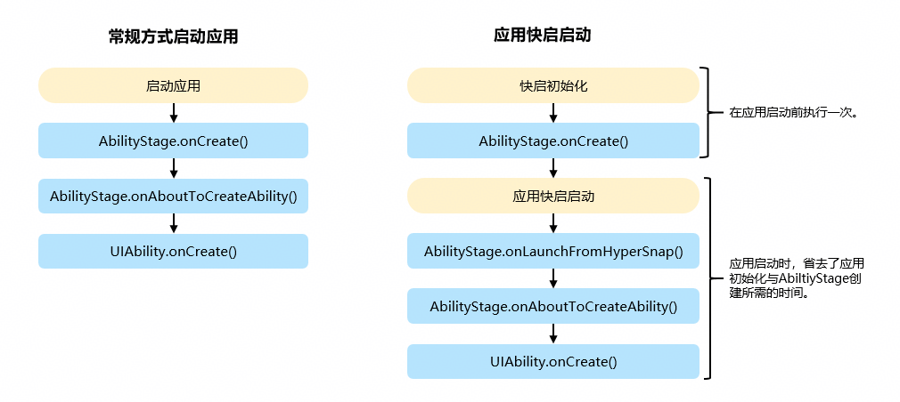

# @ohos.app.ability.hyperSnapManager (应用快启管理)
<!--Kit: Ability Kit-->
<!--Subsystem: Ability-->
<!--Owner: @jsjzju-->
<!--Designer: @jsjzju-->
<!--Tester: @lixueqing513-->
<!--Adviser: @huipeizi-->

应用启动过程中的初始化流程可以提前进行快启初始化，快启启动的应用不再重复执行初始化流程，从而起到加速启动的作用。hyperSnapManager模块提供应用快启管理的能力，包括启用或禁用应用的快启功能、请求重新初始化应用快启等。

> **说明：**
>
> 本模块首批接口从API version 24开始支持。后续版本的新增接口，采用上角标单独标记接口的起始版本。

## 实现原理

应用快启只会初始化一次，快启启动可以省去应用初始化和AbilityStage创建所需的时间。

**图1** 快启启动流程



## 导入模块

```ts
import { hyperSnapManager } from '@kit.AbilityKit';
```

## hyperSnapManager.setHyperSnapEnabled

setHyperSnapEnabled(enableFlag: boolean): void

启用或禁用应用的快启功能。

> **说明：**
>
> - 当通过本接口启用应用快启功能时，系统最终会根据应用兼容性、资源可用性和系统策略来决定是否创建或使用快启。当通过本接口禁用快启功能时，可以保证系统不会创建快启。
> - 设置的值会在重启后保持。

**系统能力**：SystemCapability.Ability.AbilityRuntime.Core

**模型约束**：此接口仅可在Stage模型下使用。

**参数：**

| 参数名 | 类型 | 必填 | 说明 |
| -------- | -------- | -------- | -------- |
| enableFlag | boolean | 是 | 表示快启功能开关标志。 <br>- `true`：表示启用快启功能（系统将最终决策是否创建快启）。 <br>- `false`：禁用应用快启功能。|

**错误码**：

以下错误码详细介绍请参考[通用错误码](../errorcode-universal.md)和[元能力子系统错误码](errorcode-ability.md)。

| 错误码ID | 错误信息 |
| ------- | -------- |
| 16000150 | Failed to send request to system service. |

**示例：**

```ts
import { hyperSnapManager } from '@kit.AbilityKit';
import { BusinessError } from '@kit.BasicServicesKit';

try {
  // 启用应用快启功能
  hyperSnapManager.setHyperSnapEnabled(true);
  console.info('Hyper Snap enabled successfully.');
} catch (err) {
  let code = (err as BusinessError).code;
  let message = (err as BusinessError).message;
  console.error(`Failed to enable Hyper Snap. Code: ${code}, Message: ${message}`);
}
```

## hyperSnapManager.requestRebuildHyperSnap

requestRebuildHyperSnap(): void

请求重新初始化应用快启。

此方法会销毁当前进程已经初始化的快启数据，系统将在合适的时机重新进行快启初始化。

**系统能力**：SystemCapability.Ability.AbilityRuntime.Core

**模型约束**：此接口仅可在Stage模型下使用。

**错误码**：

以下错误码详细介绍请参考[通用错误码](../errorcode-universal.md)和[元能力子系统错误码](errorcode-ability.md)。

| 错误码ID | 错误信息 |
| ------- | -------- |
| 16000150 | Failed to send request to system service. |

**示例：**

```ts
import { hyperSnapManager } from '@kit.AbilityKit';
import { BusinessError } from '@kit.BasicServicesKit';

try {
  // 请求重新初始化应用快启
  hyperSnapManager.requestRebuildHyperSnap();
  console.info('Requested to rebuild Hyper Snap successfully.');
} catch (err) {
  let code = (err as BusinessError).code;
  let message = (err as BusinessError).message;
  console.error(`Failed to request Hyper Snap rebuild. Code: ${code}, Message: ${message}`);
}
```
