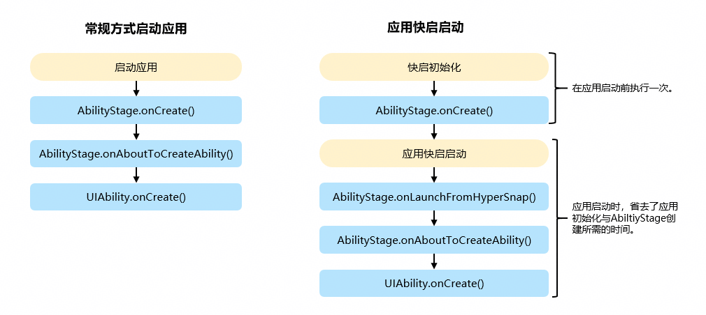

# @ohos.app.ability.hyperSnapManager (应用快启管理)
<!--Kit: Ability Kit-->
<!--Subsystem: Ability-->
<!--Owner: @jsjzju-->
<!--Designer: @jsjzju-->
<!--Tester: @liangchengguang-->
<!--Adviser: @HelloCrease-->

应用启动过程中的初始化流程可以提前进行快启初始化，快启启动的应用不再重复执行初始化流程，从而起到加速启动的作用。hyperSnapManager模块提供应用快启管理的能力，包括启用或禁用应用的快启功能、请求重新初始化应用快启、查询快启错误信息等。

> **说明：**
>
> 本模块首批接口从API version 24开始支持。后续版本的新增接口，采用上角标单独标记接口的起始版本。

## 实现原理

应用快启只会初始化一次，快启启动可以省去应用初始化和AbilityStage创建所需的时间。

**图1** 快启启动流程



## 导入模块

```ts
import { hyperSnapManager } from '@kit.AbilityKit';
```

## HyperSnapErrorType

快启错误场景类型的枚举。

**起始版本：** 26.1.0

**系统能力**：SystemCapability.Ability.AbilityRuntime.Core

**模型约束**：仅可在Stage模型下使用。

| 名称 | 值 | 说明 |
| -------- | -------- | -------- |
| CREATE_SNAPSHOT | 0 | 快启初始化过程中创建快照出现错误的场景类型。 |
| FORK_FROM_SNAPSHOT | 1 | 快启过程中从快照生成进程期间发生错误的场景类型。 |

## HyperSnapErrorCode

快启错误码的枚举。

**起始版本：** 26.1.0

**系统能力**：SystemCapability.Ability.AbilityRuntime.Core

**模型约束**：仅可在Stage模型下使用。

| 名称 | 值 | 说明 |
| -------- | -------- | -------- |
| ERR_OK | 0 | 快启未发生错误，或未触发快启 |
| ERR_SYSTEM_INNER | 1 | 系统内部错误。 |
| ERR_SNAPSHOT_EXIST | 2 | 快启初始化过程已成功制作快照，非法再次触发进行快启初始化过程 |
| ERR_PROCESS_IS_RUNNING | 3 | 系统在准备进行应用快启初始化时，应用进程正在运行中。 |
| ERR_SNAPSHOT_PROCESS_IS_DIED | 4 | 快启初始化制作快照的过程中，用于制作快照的进程被终止。 |
| ERR_SNAPSHOT_IS_INTERRUPTED | 5 | 系统在准备进行应用快启初始化时，用户启动应用 |
| ERR_EXISTS_ILLEGAL_BINDER | 6 | 应用存在非法的Binder。 |
| ERR_LAST_PROCESS_NOT_FULLY_EXITED | 7 | 上一个应用进程未完全退出。 |

## HyperSnapErrorInfo

描述快启的错误信息。

**起始版本：** 26.1.0

**系统能力**：SystemCapability.Ability.AbilityRuntime.Core

**模型约束**：仅可在Stage模型下使用。

| 名称 | 类型 | 只读 | 可选 | 说明 |
| -------- | -------- | -------- | -------- | -------- |
| code | [HyperSnapErrorCode](#hypersnaperrorcode) | 是 | 否 | 错误码。 |
| msg | string | 是 | 否 | 错误消息。 |
| occurTimeStamp | number | 是 | 否 | 发生错误时的时间戳，即自Unix纪元（1970-01-01 00:00:00 UTC）以来经过的时间，单位为毫秒，取值为整数。 |

## hyperSnapManager.setHyperSnapEnabled

setHyperSnapEnabled(enableFlag: boolean): void

启用或禁用应用的快启功能。

> **说明：**
>
> - 当通过本接口启用应用快启功能时，系统最终会根据应用兼容性、资源可用性和系统策略来决定是否创建或使用快启。当通过本接口禁用快启功能时，可以保证系统不会创建快启。
> - 设置的值会在重启后保持。

**系统能力**：SystemCapability.Ability.AbilityRuntime.Core

**模型约束**：此接口仅可在Stage模型下使用。

**参数：**

| 参数名 | 类型 | 必填 | 说明 |
| -------- | -------- | -------- | -------- |
| enableFlag | boolean | 是 | 表示快启功能开关标志。 <br>- `true`：表示启用应用快启功能（系统将最终决策是否创建快启）。 <br>- `false`：表示禁用应用快启功能。|

**错误码**：

以下错误码详细介绍请参考[通用错误码](../errorcode-universal.md)和[元能力子系统错误码](errorcode-ability.md)。

| 错误码ID | 错误信息 |
| ------- | -------- |
| 16000150 | Failed to send request to system service. |

**示例：**

```ts
import { hyperSnapManager } from '@kit.AbilityKit';
import { BusinessError } from '@kit.BasicServicesKit';

try {
  // 启用应用快启功能
  hyperSnapManager.setHyperSnapEnabled(true);
  console.info('Hyper Snap enabled successfully.');
} catch (err) {
  let code = (err as BusinessError).code;
  let message = (err as BusinessError).message;
  console.error(`Failed to enable Hyper Snap. Code: ${code}, Message: ${message}`);
}
```

## hyperSnapManager.requestRebuildHyperSnap

requestRebuildHyperSnap(): void

请求重新初始化应用快启。

此方法会销毁当前进程已经初始化的快启数据，系统将在合适的时机重新进行快启初始化。

**系统能力**：SystemCapability.Ability.AbilityRuntime.Core

**模型约束**：此接口仅可在Stage模型下使用。

**错误码**：

以下错误码详细介绍请参考[通用错误码](../errorcode-universal.md)和[元能力子系统错误码](errorcode-ability.md)。

| 错误码ID | 错误信息 |
| ------- | -------- |
| 16000150 | Failed to send request to system service. |

**示例：**

```ts
import { hyperSnapManager } from '@kit.AbilityKit';
import { BusinessError } from '@kit.BasicServicesKit';

try {
  // 请求重新初始化应用快启
  hyperSnapManager.requestRebuildHyperSnap();
  console.info('Requested to rebuild Hyper Snap successfully.');
} catch (err) {
  let code = (err as BusinessError).code;
  let message = (err as BusinessError).message;
  console.error(`Failed to request Hyper Snap rebuild. Code: ${code}, Message: ${message}`);
}
```

## hyperSnapManager.getLastError

getLastError(errType: HyperSnapErrorType): Promise&lt;HyperSnapErrorInfo&gt;

获取指定场景下当前应用的最后一次快启错误信息。

> **说明：**
>
> - 每个场景的错误信息独立存储，互不影响；该场景已存储的错误信息会在后续快启操作成功后被清除。
> - 设备重启后，所有错误信息都会被清除。
> - 若指定场景未发生过错误，则返回的errorInfo中code的值为ERR_OK，occurTimeStamp的值为0。
> - 只保留应用最后一次快启相关错误，不区分具体是哪一个快照。

**起始版本：** 26.1.0

**系统能力**：SystemCapability.Ability.AbilityRuntime.Core

**模型约束**：此接口仅可在Stage模型下使用。

**参数：**

| 参数名 | 类型 | 必填 | 说明 |
| -------- | -------- | -------- | -------- |
| errType | [HyperSnapErrorType](#hypersnaperrortype) | 是 | 表示快启错误类型。 |

**返回值：**

| 类型 | 说明 |
| -------- | -------- |
| Promise&lt;[HyperSnapErrorInfo](#hypersnaperrorinfo)&gt; | Promise对象，返回指定场景下当前应用的最后一次快启错误信息。 |

**错误码**：

以下错误码详细介绍请参考[通用错误码](../errorcode-universal.md)和[元能力子系统错误码](errorcode-ability.md)。

| 错误码ID | 错误信息 |
| ------- | -------- |
| 401 | Parameter error. Possible causes: 1. Mandatory parameters are left unspecified; 2. Incorrect parameter types; 3. Parameter verification failed. |
| 16000050 | Internal error. |

**示例：**

```ts
import { hyperSnapManager } from '@kit.AbilityKit';
import { BusinessError } from '@kit.BasicServicesKit';

// 查询创建快启场景下的最后一次错误信息
try {
  hyperSnapManager.getLastError(hyperSnapManager.HyperSnapErrorType.CREATE_SNAPSHOT)
    .then((errInfo: hyperSnapManager.HyperSnapErrorInfo) => {
      if (errInfo.code === hyperSnapManager.HyperSnapErrorCode.ERR_OK) {
        console.info('No Hyper Snap error occurred.');
        return;
      }
      console.info(`Last error code: ${errInfo.code}, msg: ${errInfo.msg}, occurTimeStamp: ${errInfo.occurTimeStamp}`);
    })
    .catch((err: BusinessError) => {
      console.error(`Failed to get last error. Code: ${err.code}, message: ${err.message}`);
    });
} catch (err) {
  let code = (err as BusinessError).code;
  let message = (err as BusinessError).message;
  console.error(`Failed to get last error. Code: ${code}, Message: ${message}`);
}
```
