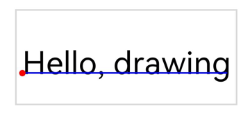

# Class (Canvas)
<!--Kit: ArkGraphics 2D-->
<!--Subsystem: Graphics-->
<!--Owner: @dreamyhhh-->
<!--Designer: @wanyanglan-->
<!--Tester: @nobuggers-->
<!--Adviser: @ge-yafang-->

承载绘制内容与绘制状态的载体。Canvas提供矩形、圆形、椭圆、弧线、路径、文字、图片等多种图形的绘制能力，支持通过画笔和画刷设置绘制样式，支持画布裁剪、矩阵变换、画布状态保存与恢复等功能。

> **说明：**
>
> - 本模块首批接口从API version 11开始支持。后续版本的新增接口，采用上角标单独标记接口的起始版本。
>
> - 本模块使用屏幕物理像素单位px。
>
> - 本模块为单线程模型策略，需要调用方自行管理线程安全和上下文状态的切换。

> **说明：**
>
> 画布自带一个默认画刷，该画刷为黑色，具备抗锯齿，不具备其他任何样式效果。当画布中没有主动设置画刷和画笔时，该默认画刷生效。

## 导入模块

```ts
import { drawing } from '@kit.ArkGraphics2D';
```

## constructor

constructor(pixelmap: image.PixelMap)

创建一个以PixelMap作为绘制目标的Canvas对象。

**原子化服务API：** 从API version 22开始，该接口支持在原子化服务中使用。

**系统能力：** SystemCapability.Graphics.Drawing

**参数：**

| 参数名   | 类型                                         | 必填 | 说明           |
| -------- | -------------------------------------------- | ---- | -------------- |
| pixelmap | [image.PixelMap](../apis-image-kit/arkts-apis-image-PixelMap.md) | 是   | 作为Canvas绘制目标的PixelMap对象。 |

**错误码：**

以下错误码的详细介绍请参见[通用错误码](../errorcode-universal.md)。

| 错误码ID | 错误信息 |
| ------- | --------------------------------------------|
| 401 | Parameter error.Possible causes:1.Mandatory parameters are left unspecified;2.Incorrect parameter types. |

**示例：**

```ts
import { drawing } from '@kit.ArkGraphics2D';
import { image } from '@kit.ImageKit';

const color = new ArrayBuffer(96);
let opts : image.InitializationOptions = {
  editable: true,
  pixelFormat: 3,
  size: {
    height: 4,
    width: 6
  }
};
image.createPixelMap(color, opts).then((pixelMap) => {
  const canvas = new drawing.Canvas(pixelMap);
});
```

## drawRect

drawRect(rect: common2D.Rect): void

绘制一个矩形，默认使用黑色填充。

**系统能力：** SystemCapability.Graphics.Drawing

**参数：**

| 参数名 | 类型                                               | 必填 | 说明           |
| ------ | -------------------------------------------------- | ---- | -------------- |
| rect   | [common2D.Rect](js-apis-graphics-common2D.md#rect) | 是   | 绘制的矩形区域。 |

**错误码：**

以下错误码的详细介绍请参见[通用错误码](../errorcode-universal.md)。

| 错误码ID | 错误信息 |
| ------- | --------------------------------------------|
| 401 | Parameter error.Possible causes:1.Mandatory parameters are left unspecified;2.Incorrect parameter types. |

**示例：**

```ts
import { RenderNode } from '@kit.ArkUI';
import { common2D, drawing } from '@kit.ArkGraphics2D';

class DrawingRenderNode extends RenderNode {
  draw(context : DrawContext) {
    const canvas = context.canvas;
    const pen = new drawing.Pen();
    pen.setStrokeWidth(5);
    pen.setColor({alpha: 255, red: 255, green: 0, blue: 0});
    canvas.attachPen(pen);
    canvas.drawRect({ left : 0, right : 10, top : 0, bottom : 10 });
    canvas.detachPen();
  }
}
```

## drawRect<sup>12+</sup>

drawRect(left: number, top: number, right: number, bottom: number): void

绘制一个矩形，默认使用黑色填充。性能优于[drawRect](#drawrect)接口，推荐使用本接口。

**系统能力：** SystemCapability.Graphics.Drawing

**参数：**

| 参数名 | 类型    | 必填 | 说明           |
| ------ | ------ | ---- | -------------- |
| left   | number | 是   | 矩形的左上角x轴坐标，该参数为浮点数。单位为物理像素px。 |
| top    | number | 是   | 矩形的左上角y轴坐标，该参数为浮点数。单位为物理像素px。 |
| right  | number | 是   | 矩形的右下角x轴坐标，该参数为浮点数。单位为物理像素px。 |
| bottom | number | 是   | 矩形的右下角y轴坐标，该参数为浮点数。单位为物理像素px。 |

**错误码：**

以下错误码的详细介绍请参见[通用错误码](../errorcode-universal.md)。

| 错误码ID | 错误信息 |
| ------- | --------------------------------------------|
| 401 | Parameter error.Possible causes:1.Mandatory parameters are left unspecified;2.Incorrect parameter types. |

**示例：**

```ts
import { RenderNode } from '@kit.ArkUI';
import { drawing } from '@kit.ArkGraphics2D';

class DrawingRenderNode extends RenderNode {

  draw(context : DrawContext) {
    const canvas = context.canvas;
    const pen = new drawing.Pen();
    pen.setStrokeWidth(5);
    pen.setColor({alpha: 255, red: 255, green: 0, blue: 0});
    canvas.attachPen(pen);
    canvas.drawRect(0, 0, 10, 10);
    canvas.detachPen();
  }
}
```

## drawRoundRect<sup>12+</sup>

drawRoundRect(roundRect: RoundRect): void

绘制一个圆角矩形，默认使用黑色填充内容。

**系统能力：** SystemCapability.Graphics.Drawing

**参数：**

| 参数名     | 类型                    | 必填 | 说明       |
| ---------- | ----------------------- | ---- | ------------ |
| roundRect  | [RoundRect](arkts-apis-graphics-drawing-RoundRect.md) | 是   | 圆角矩形对象。|

**错误码：**

以下错误码的详细介绍请参见[通用错误码](../errorcode-universal.md)。

| 错误码ID | 错误信息 |
| ------- | --------------------------------------------|
| 401 | Parameter error.Possible causes:1.Mandatory parameters are left unspecified;2.Incorrect parameter types. |

**示例：**

```ts
import { RenderNode } from '@kit.ArkUI';
import { common2D, drawing } from '@kit.ArkGraphics2D';

class DrawingRenderNode extends RenderNode {
  draw(context : DrawContext) {
    const canvas = context.canvas;
    let rect: common2D.Rect = { left : 100, top : 100, right : 400, bottom : 500 };
    let roundRect = new drawing.RoundRect(rect, 10, 10);
    canvas.drawRoundRect(roundRect);
  }
}
```

## drawNestedRoundRect<sup>12+</sup>

drawNestedRoundRect(outer: RoundRect, inner: RoundRect): void

绘制两个嵌套的圆角矩形，外部矩形边界必须完全包围内部矩形边界（即内部矩形必须完全位于外部矩形之内），否则无绘制效果。

**系统能力：** SystemCapability.Graphics.Drawing

**参数：**

| 参数名  | 类型                    | 必填 | 说明       |
| ------ | ----------------------- | ---- | ------------ |
| outer  | [RoundRect](arkts-apis-graphics-drawing-RoundRect.md) | 是   | 圆角矩形对象，表示外部圆角矩形边界。|
| inner  | [RoundRect](arkts-apis-graphics-drawing-RoundRect.md) | 是   | 圆角矩形对象，表示内部圆角矩形边界。|

**错误码：**

以下错误码的详细介绍请参见[通用错误码](../errorcode-universal.md)。

| 错误码ID | 错误信息 |
| ------- | --------------------------------------------|
| 401 | Parameter error.Possible causes:1.Mandatory parameters are left unspecified;2.Incorrect parameter types. |

**示例：**

```ts
import { RenderNode } from '@kit.ArkUI';
import { common2D, drawing } from '@kit.ArkGraphics2D';

class DrawingRenderNode extends RenderNode {
  draw(context : DrawContext) {
    const canvas = context.canvas;
    let inRect: common2D.Rect = { left : 200, top : 200, right : 400, bottom : 500 };
    let outRect: common2D.Rect = { left : 100, top : 100, right : 400, bottom : 500 };
    let outRoundRect = new drawing.RoundRect(outRect, 10, 10);
    let inRoundRect = new drawing.RoundRect(inRect, 10, 10);
    canvas.drawNestedRoundRect(outRoundRect, inRoundRect);
    canvas.drawRoundRect(outRoundRect);
  }
}
```

## drawBackground<sup>12+</sup>

drawBackground(brush: Brush): void

使用画刷填充画布的裁剪区域。

**系统能力：** SystemCapability.Graphics.Drawing

**参数：**

| 参数名 | 类型            | 必填 | 说明       |
| ------ | --------------- | ---- | ---------- |
| brush  | [Brush](arkts-apis-graphics-drawing-Brush.md) | 是   | 画刷对象。 |

**错误码：**

以下错误码的详细介绍请参见[通用错误码](../errorcode-universal.md)。

| 错误码ID | 错误信息 |
| ------- | --------------------------------------------|
| 401 | Parameter error.Possible causes:1.Mandatory parameters are left unspecified;2.Incorrect parameter types. |

**示例：**

```ts
import { RenderNode } from '@kit.ArkUI';
import { common2D, drawing } from '@kit.ArkGraphics2D';

class DrawingRenderNode extends RenderNode {
  draw(context : DrawContext) {
    const canvas = context.canvas;
    const brush = new drawing.Brush();
    const color : common2D.Color = { alpha: 255, red: 255, green: 0, blue: 0 };
    brush.setColor(color);
    canvas.drawBackground(brush);
  }
}
```

## drawShadow<sup>12+</sup>

drawShadow(path: Path, planeParams: common2D.Point3d, devLightPos: common2D.Point3d, lightRadius: number, ambientColor: common2D.Color, spotColor: common2D.Color, flag: ShadowFlag) : void

绘制射灯类型阴影，使用路径描述环境光阴影的轮廓。

**系统能力：** SystemCapability.Graphics.Drawing

**参数：**

| 参数名          | 类型                                       | 必填   | 说明         |
| ------------ | ---------------------------------------- | ---- | ---------- |
| path | [Path](arkts-apis-graphics-drawing-Path.md)                | 是    | 路径对象，可生成阴影。 |
| planeParams  | [common2D.Point3d](js-apis-graphics-common2D.md#point3d12) | 是    | 表示一个三维向量，用于计算遮挡物相对于画布在z轴上的偏移量，偏移量的值由该向量的x坐标与y坐标计算得出。 |
| devLightPos  | [common2D.Point3d](js-apis-graphics-common2D.md#point3d12) | 是    | 光线相对于画布的位置。 |
| lightRadius   | number           | 是    | 圆形灯半径，取值范围>0，该参数为浮点数。单位为物理像素px。      |
| ambientColor  | [common2D.Color](js-apis-graphics-common2D.md#color) | 是    | 环境阴影颜色。 |
| spotColor  | [common2D.Color](js-apis-graphics-common2D.md#color) | 是    | 点阴影颜色。 |
| flag         | [ShadowFlag](arkts-apis-graphics-drawing-e.md#shadowflag12)                  | 是    | 阴影标志，用于控制阴影的绘制方式。    |

**错误码：**

以下错误码的详细介绍请参见[通用错误码](../errorcode-universal.md)。

| 错误码ID | 错误信息 |
| ------- | --------------------------------------------|
| 401 | Parameter error.Possible causes:1.Mandatory parameters are left unspecified;2.Incorrect parameter types;3.Parameter verification failed. |

**示例：**

```ts
import { RenderNode } from '@kit.ArkUI';
import { common2D, drawing } from '@kit.ArkGraphics2D';

class DrawingRenderNode extends RenderNode {
  draw(context : DrawContext) {
    const canvas = context.canvas;
    const path = new drawing.Path();
    path.addCircle(100, 200, 100, drawing.PathDirection.CLOCKWISE);
    let pen = new drawing.Pen();
    pen.setAntiAlias(true);
    let penColor : common2D.Color = { alpha: 0xFF, red: 0xFF, green: 0x00, blue: 0x00 };
    pen.setColor(penColor);
    pen.setStrokeWidth(10.0);
    canvas.attachPen(pen);
    let brush = new drawing.Brush();
    let brushColor : common2D.Color = { alpha: 0xFF, red: 0x00, green: 0xFF, blue: 0x00 };
    brush.setColor(brushColor);
    canvas.attachBrush(brush);
    let planeParams : common2D.Point3d = {x: 100, y: 80, z: 80};
    let devLightPos : common2D.Point3d = {x: 200, y: 10, z: 40};
    let ambientColor : common2D.Color = {alpha: 0xFF, red: 0, green: 0, blue: 0xFF};
    let spotColor : common2D.Color = {alpha: 0xFF, red: 0xFF, green: 0, blue: 0};
    let shadowFlag : drawing.ShadowFlag = drawing.ShadowFlag.ALL;
    canvas.drawShadow(path, planeParams, devLightPos, 30, ambientColor, spotColor, shadowFlag);
  }
}
```

## drawShadow<sup>18+</sup>

drawShadow(path: Path, planeParams: common2D.Point3d, devLightPos: common2D.Point3d, lightRadius: number, ambientColor: common2D.Color \| number, spotColor: common2D.Color \| number, flag: ShadowFlag) : void

绘制射灯类型阴影，使用路径描述环境光阴影的轮廓。

**系统能力：** SystemCapability.Graphics.Drawing

**参数：**

| 参数名          | 类型                                       | 必填   | 说明         |
| ------------ | ---------------------------------------- | ---- | ---------- |
| path | [Path](arkts-apis-graphics-drawing-Path.md)                | 是    | 路径对象，可生成阴影。 |
| planeParams  | [common2D.Point3d](js-apis-graphics-common2D.md#point3d12) | 是    | 表示一个三维向量，用于计算遮挡物相对于画布在z轴上的偏移量，偏移量的值由该向量的x坐标与y坐标计算得出。 |
| devLightPos  | [common2D.Point3d](js-apis-graphics-common2D.md#point3d12) | 是    | 光线相对于画布的位置。 |
| lightRadius   | number           | 是    | 圆形灯半径，该参数为浮点数。单位为物理像素px。      |
| ambientColor  |[common2D.Color](js-apis-graphics-common2D.md#color) \| number | 是    | 环境阴影颜色，可以用16进制ARGB格式的32位无符号整数表示。 |
| spotColor  |[common2D.Color](js-apis-graphics-common2D.md#color) \| number | 是    | 点阴影颜色，可以用16进制ARGB格式的32位无符号整数表示。 |
| flag         | [ShadowFlag](arkts-apis-graphics-drawing-e.md#shadowflag12)                  | 是    | 阴影标志，用于控制阴影的绘制方式。    |

**错误码：**

以下错误码的详细介绍请参见[通用错误码](../errorcode-universal.md)。

| 错误码ID | 错误信息 |
| ------- | --------------------------------------------|
| 401 | Parameter error.Possible causes:1.Mandatory parameters are left unspecified;2.Incorrect parameter types;3.Parameter verification failed. |

**示例：**

```ts
import { RenderNode } from '@kit.ArkUI';
import { common2D, drawing } from '@kit.ArkGraphics2D';

class DrawingRenderNode extends RenderNode {
  draw(context : DrawContext) {
    const canvas = context.canvas;
    const path = new drawing.Path();
    path.addCircle(300, 600, 100, drawing.PathDirection.CLOCKWISE);
    let planeParams : common2D.Point3d = {x: 100, y: 80, z: 80};
    let devLightPos : common2D.Point3d = {x: 200, y: 10, z: 40};
    let shadowFlag : drawing.ShadowFlag = drawing.ShadowFlag.ALL;
    canvas.drawShadow(path, planeParams, devLightPos, 30, 0xFF0000FF, 0xFFFF0000, shadowFlag);
  }
}
```

## getLocalClipBounds<sup>12+</sup>

getLocalClipBounds(): common2D.Rect

获取画布裁剪区域的边界。

**系统能力：** SystemCapability.Graphics.Drawing

**返回值：**

| 类型                                       | 说明       |
| ---------------------------------------- | -------- |
| [common2D.Rect](js-apis-graphics-common2D.md#rect) | 返回画布裁剪区域的矩形边界。 |

**示例：**

```ts
import { RenderNode } from '@kit.ArkUI';
import { common2D, drawing } from '@kit.ArkGraphics2D';

class DrawingRenderNode extends RenderNode {
  draw(context : DrawContext) {
    const canvas = context.canvas;
    let clipRect: common2D.Rect = {
      left : 150, top : 150, right : 300, bottom : 400
    };
    canvas.clipRect(clipRect, drawing.ClipOp.DIFFERENCE, true);
    console.info('test rect.left: ' + clipRect.left);
    console.info('test rect.top: ' + clipRect.top);
    console.info('test rect.right: ' + clipRect.right);
    console.info('test rect.bottom: ' + clipRect.bottom);
    let clipBounds = canvas.getLocalClipBounds();
  }
}
```

## getTotalMatrix<sup>12+</sup>

getTotalMatrix(): Matrix

获取画布矩阵。

**系统能力：** SystemCapability.Graphics.Drawing

**返回值：**

| 类型                | 说明       |
| ----------------- | -------- |
| [Matrix](arkts-apis-graphics-drawing-Matrix.md) |返回当前画布的变换矩阵，该矩阵累积了已应用的平移、缩放、旋转和倾斜等变换效果。 |

**示例：**

```ts
import { RenderNode } from '@kit.ArkUI';
import { drawing } from '@kit.ArkGraphics2D';

class DrawingRenderNode extends RenderNode {
  draw(context : DrawContext) {
    const canvas = context.canvas;
    let matrix = new drawing.Matrix();
    matrix.setMatrix([5, 0, 0, 0, 1, 1, 0, 0, 1]);
    canvas.setMatrix(matrix);
    let matrixResult = canvas.getTotalMatrix();
  }
}
```

## drawCircle

drawCircle(x: number, y: number, radius: number): void

绘制一个圆形。如果半径小于等于零，则不绘制。默认使用黑色填充内容。

**系统能力：** SystemCapability.Graphics.Drawing

**参数：**

| 参数名 | 类型   | 必填 | 说明                |
| ------ | ------ | ---- | ------------------- |
| x      | number | 是   | 圆心的x轴坐标，该参数为浮点数。单位为物理像素px。 |
| y      | number | 是   | 圆心的y轴坐标，该参数为浮点数。单位为物理像素px。 |
| radius | number | 是   | 圆的半径，大于0的浮点数。单位为物理像素px。 |

**错误码：**

以下错误码的详细介绍请参见[通用错误码](../errorcode-universal.md)。

| 错误码ID | 错误信息 |
| ------- | --------------------------------------------|
| 401 | Parameter error.Possible causes:1.Mandatory parameters are left unspecified;2.Incorrect parameter types;3.Parameter verification failed. |

**示例：**

```ts
import { RenderNode } from '@kit.ArkUI';
import { drawing } from '@kit.ArkGraphics2D';

class DrawingRenderNode extends RenderNode {
  draw(context : DrawContext) {
    const canvas = context.canvas;
    const pen = new drawing.Pen();
    pen.setStrokeWidth(5);
    pen.setColor({alpha: 255, red: 255, green: 0, blue: 0});
    canvas.attachPen(pen);
    canvas.drawCircle(10, 10, 2);
    canvas.detachPen();
  }
}
```

## drawImage

drawImage(pixelmap: image.PixelMap, left: number, top: number, samplingOptions?: SamplingOptions): void

绘制一张图片，图片的左上角坐标为(left, top)。

**系统能力：** SystemCapability.Graphics.Drawing

**参数：**

| 参数名   | 类型                                         | 必填 | 说明                            |
| -------- | -------------------------------------------- | ---- | ------------------------------- |
| pixelmap | [image.PixelMap](../apis-image-kit/arkts-apis-image-PixelMap.md) | 是   | 图片的PixelMap。                  |
| left     | number                                       | 是   | 图片位置的左上角x轴坐标，该参数为浮点数。单位为物理像素px。 |
| top      | number                                       | 是   | 图片位置的左上角y轴坐标，该参数为浮点数。单位为物理像素px。 |
| samplingOptions<sup>12+</sup>  | [SamplingOptions](arkts-apis-graphics-drawing-SamplingOptions.md)  | 否  | 采样选项对象，默认为不使用任何参数构造的原始采样选项对象。 |

**错误码：**

以下错误码的详细介绍请参见[通用错误码](../errorcode-universal.md)。

| 错误码ID | 错误信息 |
| ------- | --------------------------------------------|
| 401 | Parameter error.Possible causes:1.Mandatory parameters are left unspecified;2.Incorrect parameter types. |

**示例：**

```ts
import { RenderNode } from '@kit.ArkUI';
import { image } from '@kit.ImageKit';
import { drawing } from '@kit.ArkGraphics2D';

class DrawingRenderNode extends RenderNode {
  draw(context : DrawContext) {
    const width = 1000;
    const height = 1000;
    const bufferSize = width * height * 4;
    const color: ArrayBuffer = new ArrayBuffer(bufferSize);

    const colorData = new Uint8Array(color);
    for (let i = 0; i < colorData.length; i += 4) {
      colorData[i] = 255;
      colorData[i + 1] = 156;
      colorData[i + 2] = 0;
      colorData[i + 3] = 255;
    }

    let opts : image.InitializationOptions = {
      editable: true,
      pixelFormat: 3,
      size: { height, width }
    };

    let pixelMap: image.PixelMap = image.createPixelMapSync(color, opts);
    const canvas = context.canvas;
    let options = new drawing.SamplingOptions(drawing.FilterMode.FILTER_MODE_NEAREST);
    if (pixelMap != null) {
      canvas.drawImage(pixelMap, 0, 0, options);
    }
  }
}
```

## drawImageRect<sup>12+</sup>

drawImageRect(pixelmap: image.PixelMap, dstRect: common2D.Rect, samplingOptions?: SamplingOptions): void

将图片绘制到画布的指定区域上。

**系统能力：** SystemCapability.Graphics.Drawing

**参数：**

| 参数名   | 类型                                         | 必填 | 说明                            |
| -------- | -------------------------------------------- | ---- | ------------------------------- |
| pixelmap | [image.PixelMap](../apis-image-kit/arkts-apis-image-PixelMap.md) | 是   | 图片的PixelMap。                 |
| dstRect     | [common2D.Rect](js-apis-graphics-common2D.md#rect)                               | 是   | 矩形对象，用于指定画布上图片的绘制区域。 |
| samplingOptions     | [SamplingOptions](arkts-apis-graphics-drawing-SamplingOptions.md)                           | 否   | 采样选项对象，默认为不使用任何参数构造的原始采样选项对象。 |

**错误码：**

以下错误码的详细介绍请参见[通用错误码](../errorcode-universal.md)。

| 错误码ID | 错误信息 |
| ------- | --------------------------------------------|
| 401 | Parameter error.Possible causes:1.Mandatory parameters are left unspecified;2.Incorrect parameter types. |

**示例：**

```ts
import { RenderNode } from '@kit.ArkUI';
import { image } from '@kit.ImageKit';
import { common2D, drawing } from '@kit.ArkGraphics2D';

class DrawingRenderNode extends RenderNode {
  draw(context : DrawContext) {
    const width = 1000;
    const height = 1000;
    const bufferSize = width * height * 4;
    const color: ArrayBuffer = new ArrayBuffer(bufferSize);

    const colorData = new Uint8Array(color);
    for (let i = 0; i < colorData.length; i += 4) {
      colorData[i] = 255;
      colorData[i + 1] = 156;
      colorData[i + 2] = 0;
      colorData[i + 3] = 255;
    }

    let opts : image.InitializationOptions = {
      editable: true,
      pixelFormat: 3,
      size: { height, width }
    };

    let pixelMap: image.PixelMap = image.createPixelMapSync(color, opts);
    const canvas = context.canvas;
    let pen = new drawing.Pen();
    canvas.attachPen(pen);
    let rect: common2D.Rect = { left: 0, top: 0, right: 200, bottom: 200 };
    canvas.drawImageRect(pixelMap, rect);
    canvas.detachPen();
  }
}
```

## drawImageRectWithSrc<sup>12+</sup>

drawImageRectWithSrc(pixelmap: image.PixelMap, srcRect: common2D.Rect, dstRect: common2D.Rect, samplingOptions?: SamplingOptions, constraint?: SrcRectConstraint): void

将图片的指定区域绘制到画布的指定区域。

**系统能力：** SystemCapability.Graphics.Drawing

**参数：**

| 参数名   | 类型                                         | 必填 | 说明                            |
| -------- | -------------------------------------------- | ---- | ------------------------------- |
| pixelmap | [image.PixelMap](../apis-image-kit/arkts-apis-image-PixelMap.md) | 是   | 图片的PixelMap。                 |
| srcRect     | [common2D.Rect](js-apis-graphics-common2D.md#rect)                               | 是   | 矩形对象，用于指定图片的待绘制区域。 |
| dstRect     | [common2D.Rect](js-apis-graphics-common2D.md#rect)                               | 是   | 矩形对象，用于指定画布上图片的绘制区域。 |
| samplingOptions     | [SamplingOptions](arkts-apis-graphics-drawing-SamplingOptions.md)                           | 否   | 采样选项对象，默认为不使用任何参数构造的原始采样选项对象。 |
| constraint     | [SrcRectConstraint](arkts-apis-graphics-drawing-e.md#srcrectconstraint12)                        | 否   | 源矩形区域约束类型，默认为STRICT。 |

**错误码：**

以下错误码的详细介绍请参见[通用错误码](../errorcode-universal.md)。

| 错误码ID | 错误信息 |
| ------- | --------------------------------------------|
| 401 | Parameter error.Possible causes:1.Mandatory parameters are left unspecified;2.Incorrect parameter types. |

**示例：**

```ts
import { RenderNode } from '@kit.ArkUI';
import { image } from '@kit.ImageKit';
import { common2D, drawing } from '@kit.ArkGraphics2D';

class DrawingRenderNode extends RenderNode {
  draw(context : DrawContext) {
    const width = 1000;
    const height = 1000;
    const bufferSize = width * height * 4;
    const color: ArrayBuffer = new ArrayBuffer(bufferSize);

    const colorData = new Uint8Array(color);
    for (let i = 0; i < colorData.length; i += 4) {
      colorData[i] = 255;
      colorData[i + 1] = 156;
      colorData[i + 2] = 0;
      colorData[i + 3] = 255;
    }

    let opts : image.InitializationOptions = {
      editable: true,
      pixelFormat: 3,
      size: { height, width }
    };

    let pixelMap: image.PixelMap = image.createPixelMapSync(color, opts);
    const canvas = context.canvas;
    let pen = new drawing.Pen();
    canvas.attachPen(pen);
    let srcRect: common2D.Rect = { left: 0, top: 0, right: 100, bottom: 100 };
    let dstRect: common2D.Rect = { left: 100, top: 100, right: 200, bottom: 200 };
    canvas.drawImageRectWithSrc(pixelMap, srcRect, dstRect);
    canvas.detachPen();
  }
}
```

## drawColor

drawColor(color: common2D.Color, blendMode?: BlendMode): void

使用指定颜色并按照指定的[BlendMode](arkts-apis-graphics-drawing-e.md#blendmode)对画布当前裁剪区域进行填充。

**系统能力：** SystemCapability.Graphics.Drawing

**参数：**

| 参数名    | 类型                                                 | 必填 | 说明                             |
| --------- | ---------------------------------------------------- | ---- | -------------------------------- |
| color     | [common2D.Color](js-apis-graphics-common2D.md#color) | 是   | ARGB格式的颜色，每个颜色通道的取值范围为[0, 255]的整数。                   |
| blendMode | [BlendMode](arkts-apis-graphics-drawing-e.md#blendmode)                              | 否   | 颜色混合模式，用于指定绘制颜色与画布已有内容的混合方式。当需要自定义颜色叠加效果时传入此参数，不传入时默认模式为SRC_OVER。 |

**错误码：**

以下错误码的详细介绍请参见[通用错误码](../errorcode-universal.md)。

| 错误码ID | 错误信息 |
| ------- | --------------------------------------------|
| 401 | Parameter error.Possible causes:1.Mandatory parameters are left unspecified;2.Incorrect parameter types;3.Parameter verification failed. |

**示例：**

```ts
import { RenderNode } from '@kit.ArkUI';
import { common2D, drawing } from '@kit.ArkGraphics2D';

class DrawingRenderNode extends RenderNode {
  draw(context : DrawContext) {
    const canvas = context.canvas;
    let color: common2D.Color = {
      alpha : 255,
      red: 0,
      green: 10,
      blue: 10
    };
    canvas.drawColor(color, drawing.BlendMode.CLEAR);
  }
}
```

## drawColor<sup>12+</sup>

drawColor(alpha: number, red: number, green: number, blue: number, blendMode?: BlendMode): void

使用指定颜色并按照指定的[BlendMode](arkts-apis-graphics-drawing-e.md#blendmode)对画布当前裁剪区域进行填充。性能优于[drawColor](#drawcolor)接口，推荐使用本接口。

**系统能力：** SystemCapability.Graphics.Drawing

**参数：**

| 参数名     | 类型                    | 必填 | 说明                                               |
| --------- | ----------------------- | ---- | ------------------------------------------------- |
| alpha     | number                  | 是   | ARGB格式颜色的透明度通道值，取值范围为[0, 255]的整数，传入范围内的浮点数会向下取整。 |
| red       | number                  | 是   | ARGB格式颜色的红色通道值，取值范围为[0, 255]的整数，传入范围内的浮点数会向下取整。   |
| green     | number                  | 是   | ARGB格式颜色的绿色通道值，取值范围为[0, 255]的整数，传入范围内的浮点数会向下取整。   |
| blue      | number                  | 是   | ARGB格式颜色的蓝色通道值，取值范围为[0, 255]的整数，传入范围内的浮点数会向下取整。   |
| blendMode | [BlendMode](arkts-apis-graphics-drawing-e.md#blendmode) | 否   | 颜色混合模式，用于指定绘制颜色与画布已有内容的混合方式。当需要自定义颜色叠加效果时传入此参数，不传入时默认模式为SRC_OVER。                   |

**错误码：**

以下错误码的详细介绍请参见[通用错误码](../errorcode-universal.md)。

| 错误码ID | 错误信息 |
| ------- | --------------------------------------------|
| 401 | Parameter error.Possible causes:1.Mandatory parameters are left unspecified;2.Incorrect parameter types;3.Parameter verification failed. |

**示例：**

```ts
import { RenderNode } from '@kit.ArkUI';
import { drawing } from '@kit.ArkGraphics2D';

class DrawingRenderNode extends RenderNode {
  draw(context : DrawContext) {
    const canvas = context.canvas;
    canvas.drawColor(255, 0, 10, 10, drawing.BlendMode.CLEAR);
  }
}
```

## drawColor<sup>18+</sup>

drawColor(color: number, blendMode?: BlendMode): void

使用指定颜色并按照指定的[BlendMode](arkts-apis-graphics-drawing-e.md#blendmode)对画布当前裁剪区域进行填充。

**系统能力：** SystemCapability.Graphics.Drawing

**参数：**

| 参数名    | 类型                                                 | 必填 | 说明                             |
| --------- | ---------------------------------------------------- | ---- | -------------------------------- |
| color     | number | 是   | 16进制ARGB格式的颜色，用32位无符号整数表示，例如：0xAARRGGBB。                   |
| blendMode | [BlendMode](arkts-apis-graphics-drawing-e.md#blendmode)                              | 否   | 颜色混合模式，用于指定绘制颜色与画布已有内容的混合方式。当需要自定义颜色叠加效果时传入此参数，不传入时默认模式为SRC_OVER。 |

**错误码：**

以下错误码的详细介绍请参见[通用错误码](../errorcode-universal.md)。

| 错误码ID | 错误信息 |
| ------- | --------------------------------------------|
| 401 | Parameter error.Possible causes:1.Mandatory parameters are left unspecified;2.Incorrect parameter types;3.Parameter verification failed. |

**示例：**

```ts
import { RenderNode } from '@kit.ArkUI';
import { drawing } from '@kit.ArkGraphics2D';

class DrawingRenderNode extends RenderNode {
  draw(context : DrawContext) {
    const canvas = context.canvas;
    canvas.drawColor(0xff000a0a, drawing.BlendMode.CLEAR);
  }
}
```

## drawVertices<sup>23+</sup>

drawVertices(vertexMode: VertexMode, vertexCount: number, positions: Array\<common2D.Point\>, texs: Array\<common2D.Point\> \| null, colors: Array\<number\> \| null, indexCount: number, indices: Array\<number\> \| null, mode: BlendMode): void

绘制顶点数组描述的三角网格。

**系统能力：** SystemCapability.Graphics.Drawing

**参数：**

| 参数名      | 类型            | 必填 | 说明                            |
| ----------- | -------------  | ---- | ------------------------------- |
| vertexMode   | [VertexMode](arkts-apis-graphics-drawing-e.md#vertexmode23) | 是   | 绘制顶点的连接方式。 |
| vertexCount   | number         | 是   | 顶点数组元素的数量，值为大于等于3的整数，输入浮点数则仅保留整数部分。 |
| positions  | Array\<[common2D.Point](js-apis-graphics-common2D.md#point12)>        | 是   | 描述顶点位置的数组，不能为空，其长度必须等于vertexCount。 |
| texs    | Array\<[common2D.Point](js-apis-graphics-common2D.md#point12)> \| null  | 是   | 描述顶点对应纹理空间坐标的数组。其可以为空，表明纹理空间失效；若不为空，其长度必须等于vertexCount。 |
| colors      | Array\<number> \| null | 是   | 描述顶点对应颜色的数组，用于在三角形中进行插值，每个颜色值用16进制ARGB格式的32位无符号整数表示，例如：0xAARRGGBB。其可以为空，表明不使用顶点颜色插值，颜色效果取决于当前画布绑定的画刷或画笔所设置的颜色；若不为空其长度必须等于vertexCount。 |
| indexCount  | number         | 是   | 索引的数量。其值可以为0，且indices数组长度为0时可以画图；若不为0，则值必须为大于等于3的整数，输入浮点数则仅保留整数部分。|
| indices  | Array\<number> \| null         | 是   | 描述顶点对应索引的数组。其可以为空，此时将忽略indexCount的合理传值（大于等于3的整数或等于0）；若不为空其长度必须等于indexCount。 |
| mode | [BlendMode](arkts-apis-graphics-drawing-e.md#blendmode)                              | 是   | 颜色混合模式。 |

**错误码：**

以下错误码的详细介绍请参见[图形绘制与显示错误码](errorcode-drawing.md)。

| 错误码ID | 错误信息 |
| ------- | --------------------------------------------|
| 25900001 | Parameter error. Possible causes: Incorrect parameter range. |

**示例：**

```ts
import { RenderNode } from '@kit.ArkUI';
import { common2D, drawing } from '@kit.ArkGraphics2D';

class DrawingRenderNode extends RenderNode {
  draw(context: DrawContext): void {
    const canvas = context.canvas;
    let pointsArray = new Array<common2D.Point>();
    const point1: common2D.Point = { x: 100.0, y: 100.0 };
    const point2: common2D.Point = { x: 200.0, y: 100.0 };
    const point3: common2D.Point = { x: 150.0, y: 200.0 };
    pointsArray.push(point1);
    pointsArray.push(point2);
    pointsArray.push(point3);
    let texsArray = new Array<common2D.Point>();
    const texs1: common2D.Point = { x: 0.0, y: 0.0 };
    const texs2: common2D.Point = { x: 1.0, y: 0.0 };
    const texs3: common2D.Point = { x: 0.5, y: 1.0 };
    texsArray.push(texs1);
    texsArray.push(texs2);
    texsArray.push(texs3);
    const colors = [0xFFFF0000, 0xFF00FF00, 0xFF0000FF];
    const indices = [0, 1, 2];
    canvas.drawVertices(drawing.VertexMode.TRIANGLESSTRIP_VERTEXMODE, 3, pointsArray, texsArray, colors, 3, indices, drawing.BlendMode.SRC);
  }
}
```

## drawPixelMapMesh<sup>12+</sup>

drawPixelMapMesh(pixelmap: image.PixelMap, meshWidth: number, meshHeight: number, vertices: Array\<number>, vertOffset: number, colors: Array\<number> \| null, colorOffset: number): void

在网格上绘制像素图，网格均匀分布在像素图上。（只支持画刷，使用画笔没有绘制效果。）

**系统能力：** SystemCapability.Graphics.Drawing

**参数：**

| 参数名      | 类型            | 必填 | 说明                            |
| ----------- | -------------  | ---- | ------------------------------- |
| pixelmap    | [image.PixelMap](../apis-image-kit/arkts-apis-image-PixelMap.md) | 是   | 用于绘制网格的像素图。 |
| meshWidth   | number         | 是   | 网格中的列数，大于0的整数。 |
| meshHeight  | number         | 是   | 网格中的行数，大于0的整数。 |
| vertices    | Array\<number> | 是   | 顶点数组，指定网格的绘制位置，该参数为浮点数组，单位为物理像素px。大小必须为((meshWidth+1) * (meshHeight+1) + vertOffset) * 2。 |
| vertOffset  | number         | 是   | 绘图前要跳过的vert元素数，大于等于0的整数。 |
| colors      | Array\<number> \| null | 是   | 颜色数组，在每个顶点指定一种颜色，每个颜色值用16进制ARGB格式的32位无符号整数表示，例如：0xAARRGGBB，可为null，大小必须为(meshWidth+1) * (meshHeight+1) + colorOffset。 |
| colorOffset | number         | 是   | 绘制前要跳过的颜色元素数，大于等于0的整数。 |

**错误码：**

以下错误码的详细介绍请参见[通用错误码](../errorcode-universal.md)。

| 错误码ID | 错误信息 |
| ------- | --------------------------------------------|
| 401 | Parameter error.Possible causes:1.Mandatory parameters are left unspecified;2.Incorrect parameter types. |

**示例：**

```ts
import { RenderNode } from '@kit.ArkUI';
import { image } from '@kit.ImageKit';
import { drawing } from '@kit.ArkGraphics2D';

class DrawingRenderNode extends RenderNode {
  draw(context : DrawContext) {
    const width = 1000;
    const height = 1000;
    const bufferSize = width * height * 4;
    const color: ArrayBuffer = new ArrayBuffer(bufferSize);

    const colorData = new Uint8Array(color);
    for (let i = 0; i < colorData.length; i += 4) {
      colorData[i] = 255;
      colorData[i + 1] = 156;
      colorData[i + 2] = 0;
      colorData[i + 3] = 255;
    }

    let opts : image.InitializationOptions = {
      editable: true,
      pixelFormat: 3,
      size: { height, width }
    };

    let pixelMap: image.PixelMap = image.createPixelMapSync(color, opts);
    const canvas = context.canvas;
    if (pixelMap != null) {
      const brush = new drawing.Brush(); // 只支持brush，使用pen没有绘制效果
      canvas.attachBrush(brush);
      let verts : Array<number> = [0, 0, 50, 0, 410, 0, 0, 180, 50, 180, 410, 180, 0, 360, 50, 360, 410, 360]; // 18
      canvas.drawPixelMapMesh(pixelMap, 2, 2, verts, 0, null, 0);
      canvas.detachBrush();
    }
  }
}
```

## clear<sup>12+</sup>

clear(color: common2D.Color): void

使用指定颜色填充画布上的裁剪区域。效果等同于[drawColor](#drawcolor)。

**系统能力：** SystemCapability.Graphics.Drawing

**参数：**

| 参数名    | 类型                                                 | 必填 | 说明                             |
| --------- | ---------------------------------------------------- | ---- | -------------------------------- |
| color     | [common2D.Color](js-apis-graphics-common2D.md#color) | 是   | ARGB格式的颜色，每个颜色通道的取值范围为[0, 255]的整数。      |

**错误码：**

以下错误码的详细介绍请参见[通用错误码](../errorcode-universal.md)。

| 错误码ID | 错误信息 |
| ------- | --------------------------------------------|
| 401 | Parameter error.Possible causes:1.Mandatory parameters are left unspecified;2.Incorrect parameter types. |

**示例：**

```ts
import { RenderNode } from '@kit.ArkUI';
import { common2D, drawing } from '@kit.ArkGraphics2D';

class DrawingRenderNode extends RenderNode {
  draw(context : DrawContext) {
    const canvas = context.canvas;
    let color: common2D.Color = {alpha: 255, red: 255, green: 0, blue: 0};
    canvas.clear(color);
  }
}
```

## clear<sup>18+</sup>

clear(color: common2D.Color \| number): void

使用指定颜色填充画布上的裁剪区域。效果等同于[drawColor](#drawcolor)。

**系统能力：** SystemCapability.Graphics.Drawing

**参数：**

| 参数名    | 类型                                                 | 必填 | 说明                             |
| --------- | ---------------------------------------------------- | ---- | -------------------------------- |
| color     | [common2D.Color](js-apis-graphics-common2D.md#color) \| number| 是   | 颜色，可以用16进制ARGB格式的32位无符号整数表示，例如：0xAARRGGBB。  |

**示例：**

```ts
import { RenderNode } from '@kit.ArkUI';
import { drawing } from '@kit.ArkGraphics2D';

class DrawingRenderNode extends RenderNode {
  draw(context : DrawContext) {
    const canvas = context.canvas;
    let color: number = 0xffff0000;
    canvas.clear(color);
  }
}
```

## getWidth<sup>12+</sup>

getWidth(): number

获取画布的宽度。

**系统能力：** SystemCapability.Graphics.Drawing

**返回值：**

| 类型   | 说明           |
| ------ | -------------- |
| number | 返回画布的宽度，该参数为浮点数。单位为物理像素px。 |

**示例：**

```ts
import { RenderNode } from '@kit.ArkUI';
import { drawing } from '@kit.ArkGraphics2D';

class DrawingRenderNode extends RenderNode {
  draw(context : DrawContext) {
    const canvas = context.canvas;
    let width = canvas.getWidth();
    console.info('get canvas width:' + width);
  }
}
```

## getHeight<sup>12+</sup>

getHeight(): number

获取画布的高度。

**系统能力：** SystemCapability.Graphics.Drawing

**返回值：**

| 类型   | 说明           |
| ------ | -------------- |
| number | 返回画布的高度，该参数为浮点数。单位为物理像素px。 |

**示例：**

```ts
import { RenderNode } from '@kit.ArkUI';
import { drawing } from '@kit.ArkGraphics2D';

class DrawingRenderNode extends RenderNode {
  draw(context : DrawContext) {
    const canvas = context.canvas;
    let height = canvas.getHeight();
    console.info('get canvas height:' + height);
  }
}
```

## drawOval<sup>12+</sup>

drawOval(oval: common2D.Rect): void

在画布上绘制一个椭圆，椭圆的形状和位置由椭圆的外切矩形给出。默认使用黑色填充内容。

**系统能力：** SystemCapability.Graphics.Drawing

**参数：**

| 参数名 | 类型                                               | 必填 | 说明           |
| ------ | -------------------------------------------------- | ---- | -------------- |
| oval   | [common2D.Rect](js-apis-graphics-common2D.md#rect) | 是   | 矩形区域，该矩形的内切椭圆即为待绘制椭圆。 |

**错误码：**

以下错误码的详细介绍请参见[通用错误码](../errorcode-universal.md)。

| 错误码ID | 错误信息 |
| ------- | --------------------------------------------|
| 401 | Parameter error.Possible causes:1.Mandatory parameters are left unspecified;2.Incorrect parameter types. |

**示例：**

```ts
import { RenderNode } from '@kit.ArkUI';
import { common2D, drawing } from '@kit.ArkGraphics2D';

class DrawingRenderNode extends RenderNode {
  draw(context : DrawContext) {
    const canvas = context.canvas;
    const pen = new drawing.Pen();
    pen.setStrokeWidth(5);
    const color : common2D.Color = { alpha: 255, red: 255, green: 0, blue: 0 };
    pen.setColor(color);
    canvas.attachPen(pen);
    const rect: common2D.Rect = {left:100, top:50, right:400, bottom:500};
    canvas.drawOval(rect);
    canvas.detachPen();
  }
}
```

## drawArc<sup>12+</sup>

drawArc(arc: common2D.Rect, startAngle: number, sweepAngle: number): void

在画布上绘制圆弧，默认使用黑色填充内容。该方法允许指定起始角度、扫描角度。当扫描角度的绝对值大于360度时，则绘制椭圆。

**系统能力：** SystemCapability.Graphics.Drawing

**参数：**

| 参数名 | 类型                                               | 必填 | 说明           |
| ------ | -------------------------------------------------- | ---- | -------------- |
| arc   | [common2D.Rect](js-apis-graphics-common2D.md#rect) | 是   | 包含要绘制的圆弧的椭圆的矩形边界。 |
| startAngle      | number | 是   | 弧的起始角度，单位为度，该参数为浮点数。0度时起始点位于椭圆的右端点，正数时以顺时针方向放置起始点，负数时以逆时针方向放置起始点。 |
| sweepAngle      | number | 是   | 弧的扫描角度，单位为度，该参数为浮点数。为正数时顺时针扫描，为负数时逆时针扫描。它的有效范围在-360度到360度之间，当绝对值大于360度时，该方法绘制的是一个椭圆。 |

**错误码：**

以下错误码的详细介绍请参见[通用错误码](../errorcode-universal.md)。

| 错误码ID | 错误信息 |
| ------- | --------------------------------------------|
| 401 | Parameter error.Possible causes:1.Mandatory parameters are left unspecified;2.Incorrect parameter types. |

**示例：**

```ts
import { RenderNode } from '@kit.ArkUI';
import { common2D, drawing } from '@kit.ArkGraphics2D';

class DrawingRenderNode extends RenderNode {
  draw(context : DrawContext) {
    const canvas = context.canvas;
    const pen = new drawing.Pen();
    pen.setStrokeWidth(5);
    const color : common2D.Color = { alpha: 255, red: 255, green: 0, blue: 0 };
    pen.setColor(color);
    canvas.attachPen(pen);
    const rect: common2D.Rect = {left:100, top:50, right:400, bottom:200};
    canvas.drawArc(rect, 90, 180);
    canvas.detachPen();
  }
}
```

## drawPoint

drawPoint(x: number, y: number): void

绘制一个点。

**系统能力：** SystemCapability.Graphics.Drawing

**参数：**

| 参数名 | 类型   | 必填 | 说明                |
| ------ | ------ | ---- | ------------------- |
| x      | number | 是   | 点的x轴坐标，该参数为浮点数。单位为物理像素px。 |
| y      | number | 是   | 点的y轴坐标，该参数为浮点数。单位为物理像素px。 |

**错误码：**

以下错误码的详细介绍请参见[通用错误码](../errorcode-universal.md)。

| 错误码ID | 错误信息 |
| ------- | --------------------------------------------|
| 401 | Parameter error.Possible causes:1.Mandatory parameters are left unspecified;2.Incorrect parameter types. |

**示例：**

```ts
import { RenderNode } from '@kit.ArkUI';
import { drawing } from '@kit.ArkGraphics2D';

class DrawingRenderNode extends RenderNode {
  draw(context : DrawContext) {
    const canvas = context.canvas;
    const pen = new drawing.Pen();
    pen.setStrokeWidth(5);
    pen.setColor({alpha: 255, red: 255, green: 0, blue: 0});
    canvas.attachPen(pen);
    canvas.drawPoint(10, 10);
    canvas.detachPen();
  }
}
```

## drawPoints<sup>12+</sup>

drawPoints(points: Array\<common2D.Point>, mode?: PointMode): void

在画布上绘制一组点、线段或多边形。通过指定点的数组和绘制模式来决定绘制方式。

**系统能力：** SystemCapability.Graphics.Drawing

**参数：**

| 参数名  | 类型                                       | 必填   | 说明        |
| ---- | ---------------------------------------- | ---- | --------- |
| points  | Array\<[common2D.Point](js-apis-graphics-common2D.md#point12)> | 是    | 要绘制的点的数组。长度不能为0。   |
| mode | [PointMode](arkts-apis-graphics-drawing-e.md#pointmode12)                  | 否    | 绘制数组中的点的方式。默认值为drawing.PointMode.POINTS。 |

**错误码：**

以下错误码的详细介绍请参见[通用错误码](../errorcode-universal.md)。

| 错误码ID | 错误信息 |
| ------- | --------------------------------------------|
| 401 | Parameter error. Possible causes: 1. Mandatory parameters are left unspecified;2. Incorrect parameter types; 3. Parameter verification failed.|

**示例：**

```ts
import { RenderNode } from '@kit.ArkUI';
import { common2D, drawing } from '@kit.ArkGraphics2D';

class DrawingRenderNode extends RenderNode {
  draw(context : DrawContext) {
    const canvas = context.canvas;
    const pen = new drawing.Pen();
    pen.setStrokeWidth(30);
    const color : common2D.Color = { alpha: 255, red: 255, green: 0, blue: 0 };
    pen.setColor(color);
    canvas.attachPen(pen);
    canvas.drawPoints([{x: 100, y: 200}, {x: 150, y: 230}, {x: 200, y: 300}], drawing.PointMode.POINTS);
    canvas.detachPen();
  }
}
```

## drawPath

drawPath(path: Path): void

绘制一个自定义路径，默认使用黑色填充内容。该路径包含了一组路径轮廓，每个路径轮廓可以是开放的或封闭的。

**系统能力：** SystemCapability.Graphics.Drawing

**参数：**

| 参数名 | 类型          | 必填 | 说明               |
| ------ | ------------- | ---- | ------------------ |
| path   | [Path](arkts-apis-graphics-drawing-Path.md) | 是   | 要绘制的路径对象。 |

**错误码：**

以下错误码的详细介绍请参见[通用错误码](../errorcode-universal.md)。

| 错误码ID | 错误信息 |
| ------- | --------------------------------------------|
| 401 | Parameter error.Possible causes:1.Mandatory parameters are left unspecified;2.Incorrect parameter types. |

**示例：**

```ts
import { RenderNode } from '@kit.ArkUI';
import { drawing } from '@kit.ArkGraphics2D';

class DrawingRenderNode extends RenderNode {
  draw(context : DrawContext) {
    const canvas = context.canvas;
    const pen = new drawing.Pen();
    pen.setStrokeWidth(5);
    pen.setColor({alpha: 255, red: 255, green: 0, blue: 0});
    let path = new drawing.Path();
    path.moveTo(10,10);
    path.cubicTo(10, 10, 10, 10, 15, 15);
    path.close();
    canvas.attachPen(pen);
    canvas.drawPath(path);
    canvas.detachPen();
  }
}
```

## drawLine

drawLine(x0: number, y0: number, x1: number, y1: number): void

绘制一条直线段，从指定的起点到终点。如果直线段的起点和终点是同一个点，无法绘制。

**系统能力：** SystemCapability.Graphics.Drawing

**参数：**

| 参数名 | 类型   | 必填 | 说明                    |
| ------ | ------ | ---- | ----------------------- |
| x0     | number | 是   | 线段起点的x轴坐标，该参数为浮点数。单位为物理像素px。 |
| y0     | number | 是   | 线段起点的y轴坐标，该参数为浮点数。单位为物理像素px。 |
| x1     | number | 是   | 线段终点的x轴坐标，该参数为浮点数。单位为物理像素px。 |
| y1     | number | 是   | 线段终点的y轴坐标，该参数为浮点数。单位为物理像素px。 |

**错误码：**

以下错误码的详细介绍请参见[通用错误码](../errorcode-universal.md)。

| 错误码ID | 错误信息 |
| ------- | --------------------------------------------|
| 401 | Parameter error.Possible causes:1.Mandatory parameters are left unspecified;2.Incorrect parameter types. |

**示例：**

```ts
import { RenderNode } from '@kit.ArkUI';
import { drawing } from '@kit.ArkGraphics2D';

class DrawingRenderNode extends RenderNode {
  draw(context : DrawContext) {
    const canvas = context.canvas;
    const pen = new drawing.Pen();
    pen.setStrokeWidth(5);
    pen.setColor({alpha: 255, red: 255, green: 0, blue: 0});
    canvas.attachPen(pen);
    canvas.drawLine(0, 0, 20, 20);
    canvas.detachPen();
  }
}
```

## drawTextBlob

drawTextBlob(blob: TextBlob, x: number, y: number): void

绘制一段文字。若构造blob的字体不支持待绘制字符，则该部分字符无法绘制。

**系统能力：** SystemCapability.Graphics.Drawing

**参数：**

| 参数名 | 类型                  | 必填 | 说明                                       |
| ------ | --------------------- | ---- | ------------------------------------------ |
| blob   | [TextBlob](arkts-apis-graphics-drawing-TextBlob.md) | 是   | TextBlob对象。                             |
| x      | number                | 是   | 所绘制出的文字基线（下图蓝线）的左端点（下图红点）的横坐标，该参数为浮点数。单位为物理像素px。 |
| y      | number                | 是   | 所绘制出的文字基线（下图蓝线）的左端点（下图红点）的纵坐标，该参数为浮点数。单位为物理像素px。 |



**错误码：**

以下错误码的详细介绍请参见[通用错误码](../errorcode-universal.md)。

| 错误码ID | 错误信息 |
| ------- | --------------------------------------------|
| 401 | Parameter error.Possible causes:1.Mandatory parameters are left unspecified;2.Incorrect parameter types. |

**示例：**

```ts
import { RenderNode } from '@kit.ArkUI';
import { drawing } from '@kit.ArkGraphics2D';

class DrawingRenderNode extends RenderNode {
  draw(context : DrawContext) {
    const canvas = context.canvas;
    const brush = new drawing.Brush();
    brush.setColor({alpha: 255, red: 255, green: 0, blue: 0});
    const font = new drawing.Font();
    font.setSize(20);
    const textBlob = drawing.TextBlob.makeFromString('Hello, drawing', font, drawing.TextEncoding.TEXT_ENCODING_UTF8);
    canvas.attachBrush(brush);
    canvas.drawTextBlob(textBlob, 20, 20);
    canvas.detachBrush();
  }
}
```

## drawGlyphs

drawGlyphs(glyphIds: Array\<number\>, glyphIdOffset: number, positions: Array\<common2D.Point\>, positionOffset: number, glyphCount: number, font: Font): void

绘制具有指定字体的字形数组。如果字形计数小于或等于0，则不绘制任何内容。

**起始版本：** 26.0.0

**模型约束：** 此接口仅可在Stage模型下使用。

**系统能力：** SystemCapability.Graphics.Drawing

**参数：**

| 参数名          | 类型                                      | 必填  | 说明                                             |
| ------         | -------------------                      | ---- | -----------                                      |
| glyphIds       | Array\<number\>                             | 是   | 字形ID的数组。数组成员取值限定为整数，输入浮点数则仅保留整数部分。                                     |
| glyphIdOffset  | number                                      | 是   | 在绘制字形ID数组之前要跳过的元素的数量。 取值限定为整数，输入浮点数则仅保留整数部分。<br>如果glyphCount为n，跳过长度为m，则有效glyphIds数组的范围为[glyphIds[m], glyphIds[m+n])。<br>如果glyphIds数组长度小于“glyphIdOffset + glyphCount”则抛出错误码25900001。<br>如果glyphIdOffset小于0则抛出错误码25900001。|
| positions      | Array\<[common2D.Point](js-apis-graphics-common2D.md#point12)\> | 是   | 每个字形对应的绘制位置坐标数组。如果glyphCount为n，跳过长度为m，则有效positions数组范围为[positions[m], positions[m+n])。                  |
| positionOffset | number                                      | 是   | 在绘制位置数组之前要跳过的元素的数量。取值限定为整数，输入浮点数则仅保留整数部分。<br>如果glyphCount为n，跳过长度为m，则有效positions数组的范围为[positions[m], positions[m+n])。<br>如果positions数组长度小于“positionOffset + glyphCount”则抛出错误码25900001。<br>如果positionOffset小于0则抛出错误码25900001。|
| glyphCount     | number                                      | 是   | 要绘制的字形的数目。数目小于或等于0，则不绘制任何内容，并抛出错误码25900001。<br>如果glyphCount与glyphIdOffset的和，或者glyphCount与positionOffset的和大于0x7FFFFFFF，则该计算结果按0x7FFFFFFF处理。                               |
| font           | [Font](arkts-apis-graphics-drawing-Font.md) | 是   | 用于绘图的字体。                                 |

**错误码：**

以下错误码的详细介绍请参见[图形绘制与显示错误码](errorcode-drawing.md)。

| 错误码ID | 错误信息 |
| ------- | --------------------------------------------|
| 25900001 | Parameter error. Possible causes: Incorrect parameter range. |

**示例：**

```ts
import { RenderNode } from '@kit.ArkUI';
import { common2D, drawing } from '@kit.ArkGraphics2D';

class DrawingRenderNode extends RenderNode {
  draw(context : DrawContext) {
    const canvas = context.canvas;
    const brush = new drawing.Brush();
    brush.setColor({alpha: 255, red: 255, green: 0, blue: 0});
    const font = new drawing.Font();
    font.setSize(20);
    canvas.attachBrush(brush);
    let glyphsArray : Array<number> = [100, 200, 300];
    let positionArray = new Array<common2D.Point>();
    const point1: common2D.Point = { x: 100.0, y: 100.0 };
    const point2: common2D.Point = { x: 200.0, y: 100.0 };
    const point3: common2D.Point = { x: 150.0, y: 200.0 };
    positionArray.push(point1);
    positionArray.push(point2);
    positionArray.push(point3);
    canvas.drawGlyphs(glyphsArray, 0, positionArray, 0, 3, font);
    canvas.detachBrush();
  }
}
```

## drawSingleCharacter<sup>12+</sup>

drawSingleCharacter(text: string, font: Font, x: number, y: number): void

绘制单个字符。当前字体不支持待绘制字符时，退化到使用系统字体绘制字符。

**系统能力：** SystemCapability.Graphics.Drawing

**参数：**

| 参数名 | 类型                | 必填 | 说明        |
| ------ | ------------------- | ---- | ----------- |
| text   | string | 是   | 待绘制的单个字符，字符串长度必须为1。  |
| font   | [Font](arkts-apis-graphics-drawing-Font.md) | 是   | 字型对象。  |
| x      | number | 是   | 所绘制出的字符基线（下图蓝线）的左端点（下图红点）的x轴坐标，该参数为浮点数。单位为物理像素px。 |
| y      | number | 是   | 所绘制出的字符基线（下图蓝线）的左端点（下图红点）的y轴坐标，该参数为浮点数。单位为物理像素px。 |


**错误码：**

以下错误码的详细介绍请参见[通用错误码](../errorcode-universal.md)。

| 错误码ID | 错误信息 |
| ------- | --------------------------------------------|
| 401 | Parameter error.Possible causes:1.Mandatory parameters are left unspecified;2.Incorrect parameter types;3.Parameter verification failed. |

**示例：**

```ts
import { RenderNode } from '@kit.ArkUI';
import { drawing } from '@kit.ArkGraphics2D';

class DrawingRenderNode extends RenderNode {
  draw(context : DrawContext) {
    const canvas = context.canvas;
    const brush = new drawing.Brush();
    brush.setColor({alpha: 255, red: 255, green: 0, blue: 0});
    const font = new drawing.Font();
    font.setSize(20);
    canvas.attachBrush(brush);
    canvas.drawSingleCharacter('你', font, 100, 100);
    canvas.drawSingleCharacter('好', font, 120, 100);
    canvas.detachBrush();
  }
}
```

## drawSingleCharacterWithFeatures<sup>20+</sup>

drawSingleCharacterWithFeatures(text: string, font: Font, x: number, y: number, features: Array\<FontFeature\>): void

绘制单个字符，字符带有字体特征。当前字体不支持待绘制字符时，退化到使用系统字体绘制字符。

**系统能力：** SystemCapability.Graphics.Drawing

**参数：**

| 参数名 | 类型                | 必填 | 说明        |
| ------ | ------------------- | ---- | ----------- |
| text | string | 是 | 待绘制的单个字符，字符串长度必须为1。 |
| font   | [Font](arkts-apis-graphics-drawing-Font.md) | 是   | 字型对象。  |
| x | number | 是 | 所绘制字符基线左端点的x轴坐标，该参数为浮点数。单位为物理像素px。 |
| y | number | 是 | 所绘制字符基线左端点的y轴坐标，该参数为浮点数。单位为物理像素px。 |
| features | Array\<[FontFeature](arkts-apis-graphics-drawing-i.md#fontfeature20)\> | 是 | 字体特征对象数组。参数为空数组时使用TTF（TrueType Font）文件中预设的字体特征。|

**错误码：**

以下错误码的详细介绍请参见[图形绘制与显示错误码](errorcode-drawing.md)。

| 错误码ID | 错误信息 |
| ------- | --------------------------------------------|
| 25900001 | Parameter error. Possible causes: Incorrect parameter range. |

**示例：**

```ts
import { RenderNode } from '@kit.ArkUI';
import { drawing } from '@kit.ArkGraphics2D';

class DrawingRenderNode extends RenderNode {
  draw(context : DrawContext) {
    const canvas = context.canvas;
    const brush = new drawing.Brush();
    brush.setColor({alpha: 255, red: 255, green: 0, blue: 0});
    const font = new drawing.Font();
    font.setSize(20);
    let fontFeatures : Array<drawing.FontFeature> = [];
    fontFeatures.push({name: 'calt', value: 0});
    canvas.attachBrush(brush);
    canvas.drawSingleCharacterWithFeatures('你', font, 100, 100, fontFeatures);
    canvas.drawSingleCharacterWithFeatures('好', font, 180, 100, fontFeatures);
    canvas.detachBrush();
  }
}
```

## drawRegion<sup>12+</sup>

drawRegion(region: Region): void

绘制一个区域，默认使用黑色填充内容。

**系统能力：** SystemCapability.Graphics.Drawing

**参数：**

| 参数名 | 类型                | 必填 | 说明        |
| ------ | ------------------- | ---- | ----------- |
| region   | [Region](arkts-apis-graphics-drawing-Region.md) | 是   | 绘制的区域。  |

**错误码：**

以下错误码的详细介绍请参见[通用错误码](../errorcode-universal.md)。

| 错误码ID | 错误信息 |
| ------- | --------------------------------------------|
| 401 | Parameter error.Possible causes:1.Mandatory parameters are left unspecified;2.Incorrect parameter types. |

**示例：**

```ts
import { RenderNode } from '@kit.ArkUI';
import { drawing } from '@kit.ArkGraphics2D';

class DrawingRenderNode extends RenderNode {
  draw(context : DrawContext) {
    const canvas = context.canvas;
    const pen = new drawing.Pen();
    let region = new drawing.Region();
    pen.setStrokeWidth(10);
    pen.setColor({ alpha: 255, red: 255, green: 0, blue: 0 });
    canvas.attachPen(pen);
    region.setRect(100, 100, 400, 400);
    canvas.drawRegion(region);
    canvas.detachPen();
  }
}
```

## attachPen

attachPen(pen: Pen): void

绑定画笔到画布上，在画布上进行绘制时，将使用画笔的样式去绘制图形形状的轮廓。调用本方法后，画笔将持续生效于后续所有绘制操作，直至调用[detachPen](#detachpen)解除绑定。

> **说明：**
>
> 执行该方法后，若pen的效果发生改变并且开发者希望该变化在接下来的绘制动作中生效，需要再次调用本方法。

**系统能力：** SystemCapability.Graphics.Drawing

**参数：**

| 参数名 | 类型        | 必填 | 说明       |
| ------ | ----------- | ---- | ---------- |
| pen    | [Pen](arkts-apis-graphics-drawing-Pen.md) | 是   | 画笔对象。 |

**错误码：**

以下错误码的详细介绍请参见[通用错误码](../errorcode-universal.md)。

| 错误码ID | 错误信息 |
| ------- | --------------------------------------------|
| 401 | Parameter error.Possible causes:1.Mandatory parameters are left unspecified;2.Incorrect parameter types. |

**示例：**

```ts
import { RenderNode } from '@kit.ArkUI';
import { drawing } from '@kit.ArkGraphics2D';

class DrawingRenderNode extends RenderNode {
  draw(context : DrawContext) {
    const canvas = context.canvas;
    const pen = new drawing.Pen();
    pen.setStrokeWidth(5);
    pen.setColor({alpha: 255, red: 255, green: 0, blue: 0});
    canvas.attachPen(pen);
    canvas.drawRect({ left : 0, right : 10, top : 0, bottom : 10 });
    canvas.detachPen();
  }
}
```

## attachBrush

attachBrush(brush: Brush): void

绑定画刷到画布上，在画布上进行绘制时，将使用画刷的样式对绘制图形形状的内部进行填充。调用本方法后，画刷将持续生效于后续所有绘制操作，直至调用[detachBrush](#detachbrush)解除绑定。

> **说明：**
>
> 执行该方法后，若brush的效果发生改变并且开发者希望该变化在接下来的绘制动作中生效，需要再次调用本方法。

**系统能力：** SystemCapability.Graphics.Drawing

**参数：**

| 参数名 | 类型            | 必填 | 说明       |
| ------ | --------------- | ---- | ---------- |
| brush  | [Brush](arkts-apis-graphics-drawing-Brush.md) | 是   | 画刷对象。 |

**错误码：**

以下错误码的详细介绍请参见[通用错误码](../errorcode-universal.md)。

| 错误码ID | 错误信息 |
| ------- | --------------------------------------------|
| 401 | Parameter error.Possible causes:1.Mandatory parameters are left unspecified;2.Incorrect parameter types. |

**示例：**

```ts
import { RenderNode } from '@kit.ArkUI';
import { drawing } from '@kit.ArkGraphics2D';

class DrawingRenderNode extends RenderNode {
  draw(context : DrawContext) {
    const canvas = context.canvas;
    const brush = new drawing.Brush();
    brush.setColor({alpha: 255, red: 255, green: 0, blue: 0});
    canvas.attachBrush(brush);
    canvas.drawRect({ left : 0, right : 10, top : 0, bottom : 10 });
    canvas.detachBrush();
  }
}
```

## detachPen

detachPen(): void

将画笔与画布解绑，在画布上进行绘制时，不会再使用画笔去绘制图形形状的轮廓。本方法与[attachPen](#attachpen)配合使用，用于在完成绘制后解除画笔绑定。

**系统能力：** SystemCapability.Graphics.Drawing

**示例：**

```ts
import { RenderNode } from '@kit.ArkUI';
import { drawing } from '@kit.ArkGraphics2D';

class DrawingRenderNode extends RenderNode {
  draw(context : DrawContext) {
    const canvas = context.canvas;
    const pen = new drawing.Pen();
    pen.setStrokeWidth(5);
    pen.setColor({alpha: 255, red: 255, green: 0, blue: 0});
    canvas.attachPen(pen);
    canvas.drawRect({ left : 0, right : 10, top : 0, bottom : 10 });
    canvas.detachPen();
  }
}
```

## detachBrush

detachBrush(): void

将画刷与画布解绑，在画布上进行绘制时，不会再使用画刷对绘制图形形状的内部进行填充。本方法与[attachBrush](#attachbrush)配合使用，用于在完成绘制后解除画刷绑定。

**系统能力：** SystemCapability.Graphics.Drawing

**示例：**

```ts
import { RenderNode } from '@kit.ArkUI';
import { drawing } from '@kit.ArkGraphics2D';

class DrawingRenderNode extends RenderNode {
  draw(context : DrawContext) {
    const canvas = context.canvas;
    const brush = new drawing.Brush();
    brush.setColor({alpha: 255, red: 255, green: 0, blue: 0});
    canvas.attachBrush(brush);
    canvas.drawRect({ left : 0, right : 10, top : 0, bottom : 10 });
    canvas.detachBrush();
  }
}
```

## clipPath<sup>12+</sup>

clipPath(path: Path, clipOp?: ClipOp, doAntiAlias?: boolean): void

使用自定义路径对画布进行裁剪。

**系统能力：** SystemCapability.Graphics.Drawing

**参数：**

| 参数名       | 类型               | 必填 | 说明                                |
| ------------ | ----------------- | ---- | ------------------------------------|
| path         | [Path](arkts-apis-graphics-drawing-Path.md)     | 是   | 路径对象。                                                 |
| clipOp       | [ClipOp](arkts-apis-graphics-drawing-e.md#clipop12) | 否   | 裁剪方式。默认为INTERSECT。                                     |
| doAntiAlias  | boolean           | 否   | 表示是否使用抗锯齿绘制。true表示使用，false表示不使用。默认为false。 |

**错误码：**

以下错误码的详细介绍请参见[通用错误码](../errorcode-universal.md)。

| 错误码ID | 错误信息 |
| ------- | --------------------------------------------|
| 401 | Parameter error.Possible causes:1.Mandatory parameters are left unspecified;2.Incorrect parameter types. |

**示例：**

```ts
import { RenderNode } from '@kit.ArkUI';
import { common2D, drawing } from '@kit.ArkGraphics2D';

class DrawingRenderNode extends RenderNode {
  draw(context : DrawContext) {
    const canvas = context.canvas;
    let path = new drawing.Path();
    path.moveTo(10, 10);
    path.cubicTo(100, 100, 80, 150, 300, 150);
    path.close();
    canvas.clipPath(path, drawing.ClipOp.INTERSECT, true);
    canvas.clear({alpha: 255, red: 255, green: 0, blue: 0});
  }
}
```

## clipRect<sup>12+</sup>

clipRect(rect: common2D.Rect, clipOp?: ClipOp, doAntiAlias?: boolean): void

使用矩形对画布进行裁剪。

**系统能力：** SystemCapability.Graphics.Drawing

**参数：**

| 参数名         | 类型                                       | 必填   | 说明                  |
| ----------- | ---------------------------------------- | ---- | ------------------- |
| rect        | [common2D.Rect](js-apis-graphics-common2D.md#rect) | 是    | 需要裁剪的矩形区域。      |
| clipOp      | [ClipOp](arkts-apis-graphics-drawing-e.md#clipop12)                  | 否    | 裁剪方式。默认值为INTERSECT。     |
| doAntiAlias | boolean           | 否   | 表示是否使用抗锯齿绘制。true表示使用，false表示不使用。默认值为false。 |

**错误码：**

以下错误码的详细介绍请参见[通用错误码](../errorcode-universal.md)。

| 错误码ID | 错误信息 |
| ------- | --------------------------------------------|
| 401 | Parameter error.Possible causes:1.Mandatory parameters are left unspecified;2.Incorrect parameter types. |

**示例：**

```ts
import { RenderNode } from '@kit.ArkUI';
import { common2D, drawing } from '@kit.ArkGraphics2D';

class DrawingRenderNode extends RenderNode {
  draw(context : DrawContext) {
    const canvas = context.canvas;
    canvas.clipRect({left : 10, right : 500, top : 300, bottom : 900}, drawing.ClipOp.DIFFERENCE, true);
    canvas.clear({alpha: 255, red: 255, green: 0, blue: 0});
  }
}
```

## save<sup>12+</sup>

save(): number

保存当前画布状态（画布矩阵和裁剪区域）到栈顶。需要与恢复接口[restore](#restore12)配合使用。

**系统能力：** SystemCapability.Graphics.Drawing

**返回值：**

| 类型   | 说明                |
| ------ | ------------------ |
| number | 画布状态个数，该参数为正整数。 |

**示例：**

```ts
import { RenderNode } from '@kit.ArkUI';
import { common2D, drawing } from '@kit.ArkGraphics2D';

class DrawingRenderNode extends RenderNode {
  draw(context : DrawContext) {
    const canvas = context.canvas;
    let rect: common2D.Rect = {left: 10, right: 200, top: 100, bottom: 300};
    canvas.drawRect(rect);
    canvas.save();
  }
}
```

## saveLayer<sup>12+</sup>

saveLayer(rect?: common2D.Rect \| null, brush?: Brush \| null): number

保存当前画布的矩阵和裁剪区域，并为后续绘制分配位图。需要与恢复接口[restore](#restore12)配合使用，调用restore将会舍弃对矩阵和裁剪区域做的更改，并绘制位图。

**系统能力：** SystemCapability.Graphics.Drawing

**参数：**

| 参数名  | 类型     | 必填   | 说明         |
| ---- | ------ | ---- | ----------------- |
| rect   | [common2D.Rect](js-apis-graphics-common2D.md#rect) \| null | 否   | 矩形对象，用于限制图层大小，默认为当前画布大小。 |
| brush  | [Brush](arkts-apis-graphics-drawing-Brush.md) \| null | 否   | 画刷对象，绘制位图时会应用画刷对象的透明度、颜色滤波器效果和混合模式，默认不设置额外效果。 |

**返回值：**

| 类型   | 说明                |
| ------ | ------------------ |
| number | 返回调用前保存的画布状态数，该参数为正整数。 |

**错误码：**

以下错误码的详细介绍请参见[通用错误码](../errorcode-universal.md)。

| 错误码ID | 错误信息 |
| ------- | --------------------------------------------|
| 401 | Parameter error. Possible causes: Mandatory parameters are left unspecified. |

**示例：**

```ts
import { RenderNode } from '@kit.ArkUI';
import { common2D, drawing } from '@kit.ArkGraphics2D';

class DrawingRenderNode extends RenderNode {
  draw(context : DrawContext) {
    const canvas = context.canvas;
    canvas.saveLayer(null, null);
    const rectBrush = new drawing.Brush();
    const rectColor: common2D.Color = {alpha: 255, red: 255, green: 255, blue: 0};
    rectBrush.setColor(rectColor);
    canvas.attachBrush(rectBrush);
    const rect: common2D.Rect = {left:100, top:100, right:500, bottom:500};
    canvas.drawRect(rect);

    const brush = new drawing.Brush();
    brush.setBlendMode(drawing.BlendMode.DST_OUT);
    canvas.saveLayer(rect, brush);

    const brushCircle = new drawing.Brush();
    const colorCircle: common2D.Color = {alpha: 255, red: 0, green: 0, blue: 255};
    brushCircle.setColor(colorCircle);
    canvas.attachBrush(brushCircle);
    canvas.drawCircle(500, 500, 200);
    canvas.restore();
    canvas.restore();
    canvas.detachBrush();
  }
}
```

## scale<sup>12+</sup>

scale(sx: number, sy: number): void

在当前画布矩阵（默认是单位矩阵）的基础上再叠加一个缩放矩阵，后续绘制操作和裁剪操作的形状和位置都会自动叠加一个缩放效果。

**系统能力：** SystemCapability.Graphics.Drawing

**参数：**

| 参数名  | 类型     | 必填   | 说明         |
| ---- | ------ | ---- | ----------------- |
| sx   | number | 是   | x轴方向的缩放比例，该参数为浮点数。正值表示正常缩放，负值表示镜像缩放。 |
| sy   | number | 是   | y轴方向的缩放比例，该参数为浮点数。正值表示正常缩放，负值表示镜像缩放。 |

**错误码：**

以下错误码的详细介绍请参见[通用错误码](../errorcode-universal.md)。

| 错误码ID | 错误信息 |
| ------- | --------------------------------------------|
| 401 | Parameter error.Possible causes:1.Mandatory parameters are left unspecified;2.Incorrect parameter types. |

**示例：**

```ts
import { RenderNode } from '@kit.ArkUI';
import { common2D, drawing } from '@kit.ArkGraphics2D';

class DrawingRenderNode extends RenderNode {
  draw(context : DrawContext) {
    const canvas = context.canvas;
    const pen = new drawing.Pen();
    pen.setStrokeWidth(5);
    pen.setColor({alpha: 255, red: 255, green: 0, blue: 0});
    canvas.attachPen(pen);
    canvas.scale(2, 0.5);
    canvas.drawRect({left : 10, right : 500, top : 300, bottom : 900});
    canvas.detachPen();
  }
}
```

## skew<sup>12+</sup>

skew(sx: number, sy: number) : void

在当前画布矩阵（默认是单位矩阵）的基础上再叠加一个倾斜矩阵，后续绘制操作和裁剪操作的形状和位置都会自动叠加一个倾斜效果。

**系统能力：** SystemCapability.Graphics.Drawing

**参数：**

| 参数名  | 类型     | 必填   | 说明         |
| ---- | ------ | ---- | ----------------- |
| sx   | number | 是   | x轴上的倾斜量，该参数为浮点数。正值会使绘制沿y轴增量方向向右倾斜；负值会使绘制沿y轴增量方向向左倾斜。    |
| sy   | number | 是   | y轴上的倾斜量，该参数为浮点数。正值会使绘制沿x轴增量方向向下倾斜；负值会使绘制沿x轴增量方向向上倾斜。    |

**错误码：**

以下错误码的详细介绍请参见[通用错误码](../errorcode-universal.md)。

| 错误码ID | 错误信息 |
| ------- | --------------------------------------------|
| 401 | Parameter error.Possible causes:1.Mandatory parameters are left unspecified;2.Incorrect parameter types. |

**示例：**

```ts
import { RenderNode } from '@kit.ArkUI';
import { common2D, drawing } from '@kit.ArkGraphics2D';

class DrawingRenderNode extends RenderNode {
  draw(context : DrawContext) {
    const canvas = context.canvas;
    const pen = new drawing.Pen();
    pen.setStrokeWidth(5);
    pen.setColor({alpha: 255, red: 255, green: 0, blue: 0});
    canvas.attachPen(pen);
    canvas.skew(0.1, 0.1);
    canvas.drawRect({left : 10, right : 500, top : 300, bottom : 900});
    canvas.detachPen();
  }
}
```

## rotate<sup>12+</sup>

rotate(degrees: number, sx: number, sy: number) : void

在当前画布矩阵（默认是单位矩阵）的基础上再叠加一个旋转矩阵，后续绘制操作和裁剪操作的形状和位置都会自动叠加一个旋转效果。

**系统能力：** SystemCapability.Graphics.Drawing

**参数：**

| 参数名  | 类型     | 必填   | 说明         |
| ---- | ------ | ------ | ------------------------ |
| degrees       | number | 是    | 旋转角度，单位为度，该参数为浮点数，正数为顺时针旋转，负数为逆时针旋转。  |
| sx            | number | 是    | 旋转中心的x轴坐标，该参数为浮点数。单位为物理像素px。 |
| sy            | number | 是    | 旋转中心的y轴坐标，该参数为浮点数。单位为物理像素px。 |

**错误码：**

以下错误码的详细介绍请参见[通用错误码](../errorcode-universal.md)。

| 错误码ID | 错误信息 |
| ------- | --------------------------------------------|
| 401 | Parameter error.Possible causes:1.Mandatory parameters are left unspecified;2.Incorrect parameter types. |

**示例：**

```ts
import { RenderNode } from '@kit.ArkUI';
import { common2D, drawing } from '@kit.ArkGraphics2D';

class DrawingRenderNode extends RenderNode {
  draw(context : DrawContext) {
    const canvas = context.canvas;
    const pen = new drawing.Pen();
    pen.setStrokeWidth(5);
    pen.setColor({alpha: 255, red: 255, green: 0, blue: 0});
    canvas.attachPen(pen);
    canvas.rotate(30, 100, 100);
    canvas.drawRect({left : 10, right : 500, top : 300, bottom : 900});
    canvas.detachPen();
  }
}
```

## translate<sup>12+</sup>

translate(dx: number, dy: number): void

在当前画布矩阵（默认是单位矩阵）的基础上再叠加一个平移矩阵，后续绘制操作和裁剪操作的形状和位置都会自动叠加一个平移效果。

**系统能力：** SystemCapability.Graphics.Drawing

**参数：**

| 参数名 | 类型   | 必填 | 说明                |
| ----- | ------ | ---- | ------------------- |
| dx    | number | 是   | x轴方向的移动距离，该参数为浮点数。单位为物理像素px。   |
| dy    | number | 是   | y轴方向的移动距离，该参数为浮点数。单位为物理像素px。   |

**错误码：**

以下错误码的详细介绍请参见[通用错误码](../errorcode-universal.md)。

| 错误码ID | 错误信息 |
| ------- | --------------------------------------------|
| 401 | Parameter error.Possible causes:1.Mandatory parameters are left unspecified;2.Incorrect parameter types. |

**示例：**

```ts
import { RenderNode } from '@kit.ArkUI';
import { common2D, drawing } from '@kit.ArkGraphics2D';

class DrawingRenderNode extends RenderNode {
  draw(context : DrawContext) {
    const canvas = context.canvas;
    const pen = new drawing.Pen();
    pen.setStrokeWidth(5);
    pen.setColor({alpha: 255, red: 255, green: 0, blue: 0});
    canvas.attachPen(pen);
    canvas.translate(10, 10);
    canvas.drawRect({left : 10, right : 500, top : 300, bottom : 900});
    canvas.detachPen();
  }
}
```

## getSaveCount<sup>12+</sup>

getSaveCount(): number

获取栈中保存的画布状态（画布矩阵和裁剪区域）的数量。

**系统能力：** SystemCapability.Graphics.Drawing

**返回值：**

| 类型    | 说明                                 |
| ------ | ------------------------------------ |
| number | 已保存的画布状态的数量，该参数为正整数。 |

**示例：**

```ts
import { RenderNode } from '@kit.ArkUI';
import { common2D, drawing } from '@kit.ArkGraphics2D';

class DrawingRenderNode extends RenderNode {
  draw(context : DrawContext) {
    const canvas = context.canvas;
    const pen = new drawing.Pen();
    pen.setStrokeWidth(5);
    pen.setColor({alpha: 255, red: 255, green: 0, blue: 0});
    canvas.attachPen(pen);
    canvas.drawRect({left: 10, right: 200, top: 100, bottom: 300});
    canvas.save();
    canvas.drawRect({left : 10, right : 500, top : 300, bottom : 900});
    let saveCount = canvas.getSaveCount();
    canvas.detachPen();
  }
}
```

## restoreToCount<sup>12+</sup>

restoreToCount(count: number): void

恢复到指定深度的画布状态（画布矩阵和裁剪区域）。需要先调用[save](#save12)或[saveLayer](#savelayer12)保存画布状态后才能使用本接口恢复。

**系统能力：** SystemCapability.Graphics.Drawing

**参数：**

| 参数名   | 类型     | 必填   | 说明                    |
| ----- | ------ | ---- | ----------------------------- |
| count | number | 是   | 要恢复到的画布状态深度，该参数为整数。小于等于1时，恢复为初始状态；大于已保存的画布状态数量时，不执行任何操作。 |

**错误码：**

以下错误码的详细介绍请参见[通用错误码](../errorcode-universal.md)。

| 错误码ID | 错误信息 |
| ------- | --------------------------------------------|
| 401 | Parameter error.Possible causes:1.Mandatory parameters are left unspecified;2.Incorrect parameter types. |

**示例：**

```ts
import { RenderNode } from '@kit.ArkUI';
import { common2D, drawing } from '@kit.ArkGraphics2D';

class DrawingRenderNode extends RenderNode {
  draw(context : DrawContext) {
    const canvas = context.canvas;
    const pen = new drawing.Pen();
    pen.setStrokeWidth(5);
    pen.setColor({alpha: 255, red: 255, green: 0, blue: 0});
    canvas.attachPen(pen);
    canvas.drawRect({left: 10, right: 200, top: 100, bottom: 300});
    canvas.save();
    canvas.drawRect({left: 10, right: 200, top: 100, bottom: 500});
    canvas.save();
    canvas.drawRect({left: 100, right: 300, top: 100, bottom: 500});
    canvas.save();
    canvas.restoreToCount(2);
    canvas.drawRect({left : 10, right : 500, top : 300, bottom : 900});
    canvas.detachPen();
  }
}
```

## restore<sup>12+</sup>

restore(): void

恢复保存在栈顶的画布状态（画布矩阵和裁剪区域）。需要与保存接口[save](#save12)或[saveLayer](#savelayer12)配合使用。若栈顶状态由saveLayer保存，恢复时还会将saveLayer分配的位图绘制到画布上；若栈为空（无已保存状态），则不执行恢复操作。

**系统能力：** SystemCapability.Graphics.Drawing

**示例：**

```ts
import { RenderNode } from '@kit.ArkUI';
import { drawing } from '@kit.ArkGraphics2D';

class DrawingRenderNode extends RenderNode {
  draw(context : DrawContext) {
    const canvas = context.canvas;
    const pen = new drawing.Pen();
    pen.setStrokeWidth(5);
    pen.setColor({alpha: 255, red: 255, green: 0, blue: 0});
    canvas.attachPen(pen);
    canvas.save();
    canvas.restore();
    canvas.detachPen();
  }
}
```

## concatMatrix<sup>12+</sup>

concatMatrix(matrix: Matrix): void

画布现有矩阵左乘传入矩阵，不影响之前的绘制操作，后续绘制操作和裁剪操作的形状和位置都会受到该矩阵的影响。

**系统能力：** SystemCapability.Graphics.Drawing

**参数：**

| 参数名    | 类型                | 必填   | 说明    |
| ------ | ----------------- | ---- | ----- |
| matrix | [Matrix](arkts-apis-graphics-drawing-Matrix.md) | 是    | 矩阵对象。 |

**错误码：**

以下错误码的详细介绍请参见[通用错误码](../errorcode-universal.md)。

| 错误码ID | 错误信息 |
| ------- | --------------------------------------------|
| 401 | Parameter error.Possible causes:1.Mandatory parameters are left unspecified;2.Incorrect parameter types. |

**示例：**

```ts
import { RenderNode } from '@kit.ArkUI';
import { drawing } from '@kit.ArkGraphics2D';

class DrawingRenderNode extends RenderNode {
  draw(context : DrawContext) {
    const canvas = context.canvas;
    let matrix = new drawing.Matrix();
    matrix.setMatrix([5, 0, 0, 0, 1, 2, 0, 0, 1]);
    canvas.concatMatrix(matrix);
    canvas.drawRect({left: 10, right: 200, top: 100, bottom: 500});
  }
}
```

## setMatrix<sup>12+</sup>

setMatrix(matrix: Matrix): void

设置画布的矩阵，后续绘制操作和裁剪操作的形状和位置都会受到该矩阵的影响。

**系统能力：** SystemCapability.Graphics.Drawing

**参数：**

| 参数名    | 类型                | 必填   | 说明    |
| ------ | ----------------- | ---- | ----- |
| matrix | [Matrix](arkts-apis-graphics-drawing-Matrix.md) | 是    | 矩阵对象。 |

**错误码：**

以下错误码的详细介绍请参见[通用错误码](../errorcode-universal.md)。

| 错误码ID | 错误信息 |
| ------- | --------------------------------------------|
| 401 | Parameter error.Possible causes:1.Mandatory parameters are left unspecified;2.Incorrect parameter types. |

**示例：**

```ts
import { RenderNode } from '@kit.ArkUI';
import { drawing } from '@kit.ArkGraphics2D';

class DrawingRenderNode extends RenderNode {
  draw(context : DrawContext) {
    const canvas = context.canvas;
    let matrix = new drawing.Matrix();
    matrix.setMatrix([5, 0, 0, 0, 1, 1, 0, 0, 1]);
    canvas.setMatrix(matrix);
    canvas.drawRect({left: 10, right: 200, top: 100, bottom: 500});
  }
}
```

## isClipEmpty<sup>12+</sup>

isClipEmpty(): boolean

判断画布的裁剪区域是否为空。

**系统能力：** SystemCapability.Graphics.Drawing

**返回值：**

| 类型                  | 说明           |
| --------------------- | -------------- |
| boolean | 返回画布的裁剪区域是否为空的结果，true表示为空，false表示不为空。 |

**示例：**

```ts
import { RenderNode } from '@kit.ArkUI';
import { drawing } from '@kit.ArkGraphics2D';

class DrawingRenderNode extends RenderNode {
  draw(context : DrawContext) {
    const canvas = context.canvas;
    if (canvas.isClipEmpty()) {
      console.info('canvas.isClipEmpty() returned true');
    } else {
      console.info('canvas.isClipEmpty() returned false');
    }
  }
}
```

## clipRegion<sup>12+</sup>

clipRegion(region: Region, clipOp?: ClipOp): void

在画布上裁剪一个区域。

**系统能力：** SystemCapability.Graphics.Drawing

**参数：**

| 参数名          | 类型    | 必填 | 说明                                                        |
| --------------- | ------- | ---- | ----------------------------------------------------------- |
| region | [Region](arkts-apis-graphics-drawing-Region.md) | 是   | 区域对象，表示裁剪范围。 |
| clipOp | [ClipOp](arkts-apis-graphics-drawing-e.md#clipop12)   | 否   | 裁剪方式。默认值为INTERSECT。 |

**错误码：**

以下错误码的详细介绍请参见[通用错误码](../errorcode-universal.md)。

| 错误码ID | 错误信息 |
| ------- | --------------------------------------------|
| 401 | Parameter error.Possible causes:1.Mandatory parameters are left unspecified;2.Incorrect parameter types. |

**示例：**

```ts
import { RenderNode } from '@kit.ArkUI';
import { common2D, drawing } from '@kit.ArkGraphics2D';

class DrawingRenderNode extends RenderNode {
  draw(context : DrawContext) {
    const canvas = context.canvas;
    let region : drawing.Region = new drawing.Region();
    region.setRect(0, 0, 500, 500);
    canvas.clipRegion(region);
    let color: common2D.Color = {alpha: 255, red: 255, green: 0, blue: 0};
    canvas.clear(color);
  }
}
```

## clipRoundRect<sup>12+</sup>

clipRoundRect(roundRect: RoundRect, clipOp?: ClipOp, doAntiAlias?: boolean): void

在画布上裁剪一个圆角矩形。

**系统能力：** SystemCapability.Graphics.Drawing

**参数：**

| 参数名          | 类型    | 必填 | 说明                                                        |
| --------------- | ------- | ---- | ----------------------------------------------------------- |
| roundRect | [RoundRect](arkts-apis-graphics-drawing-RoundRect.md) | 是   | 圆角矩形对象，表示裁剪范围。 |
| clipOp | [ClipOp](arkts-apis-graphics-drawing-e.md#clipop12)   | 否   | 裁剪方式。默认值为INTERSECT。 |
| doAntiAlias | boolean | 否   | 表示是否使用抗锯齿。true表示使用，false表示不使用。默认值为false。 |

**错误码：**

以下错误码的详细介绍请参见[通用错误码](../errorcode-universal.md)。

| 错误码ID | 错误信息 |
| ------- | --------------------------------------------|
| 401 | Parameter error.Possible causes:1.Mandatory parameters are left unspecified;2.Incorrect parameter types. |

**示例：**

```ts
import { RenderNode } from '@kit.ArkUI';
import { common2D, drawing } from '@kit.ArkGraphics2D';

class DrawingRenderNode extends RenderNode {
  draw(context : DrawContext) {
    const canvas = context.canvas;
    let rect: common2D.Rect = { left: 10, top: 100, right: 200, bottom: 300 };
    let roundRect = new drawing.RoundRect(rect, 10, 10);
    canvas.clipRoundRect(roundRect);
    let color: common2D.Color = {alpha: 255, red: 255, green: 0, blue: 0};
    canvas.clear(color);
  }
}
```

## resetClip

resetClip(): void

将当前画布的裁剪状态重置为初始状态。

**系统能力：** SystemCapability.Graphics.Drawing

**模型约束：** 此接口仅可在Stage模型下使用。

**起始版本：** 26.0.0

**示例：**

```ts
import { RenderNode } from '@kit.ArkUI';
import { common2D, drawing } from '@kit.ArkGraphics2D';

class DrawingRenderNode extends RenderNode {
  draw(context : DrawContext) {
    const canvas = context.canvas;
    let rect: common2D.Rect = { left: 10, top: 100, right: 200, bottom: 300 };
    canvas.clipRect(rect);
    canvas.resetClip();
  }
}
```

## resetMatrix<sup>12+</sup>

resetMatrix(): void

将当前画布的矩阵重置为单位矩阵。

**系统能力：** SystemCapability.Graphics.Drawing

**示例：**

```ts
import { RenderNode } from '@kit.ArkUI';
import { drawing } from '@kit.ArkGraphics2D';

class DrawingRenderNode extends RenderNode {
  draw(context : DrawContext) {
    const canvas = context.canvas;
    canvas.scale(4, 6);
    canvas.resetMatrix();
  }
}
```

## quickRejectPath<sup>18+</sup>

quickRejectPath(path: Path): boolean

判断路径与画布区域是否不相交。画布区域包含边界。

**系统能力：** SystemCapability.Graphics.Drawing

**参数：**

| 参数名 | 类型          | 必填 | 说明               |
| ------ | ------------- | ---- | ------------------ |
| path   | [Path](arkts-apis-graphics-drawing-Path.md) | 是   | 路径对象。 |

**返回值：**

| 类型                  | 说明           |
| --------------------- | -------------- |
| boolean | 返回路径是否与画布区域不相交的结果。true表示路径与画布区域不相交，false表示路径与画布区域相交。 |

**示例：**

```ts
import { RenderNode } from '@kit.ArkUI';
import { drawing } from '@kit.ArkGraphics2D';

class DrawingRenderNode extends RenderNode {
  draw(context : DrawContext) {
    const canvas = context.canvas;
    let path = new drawing.Path();
    path.moveTo(10, 10);
    path.cubicTo(10, 10, 10, 10, 15, 15);
    path.close();
    if (canvas.quickRejectPath(path)) {
      console.info('canvas and path do not intersect.');
    } else {
      console.info('canvas and path intersect.');
    }
  }
}
```

## quickRejectRect<sup>18+</sup>

quickRejectRect(rect: common2D.Rect): boolean

判断矩形和画布区域是否不相交。画布区域包含边界。

**系统能力：** SystemCapability.Graphics.Drawing

**参数：**

| 参数名 | 类型                                               | 必填 | 说明           |
| ------ | -------------------------------------------------- | ---- | -------------- |
| rect   | [common2D.Rect](js-apis-graphics-common2D.md#rect) | 是   | 矩形区域。 |

**返回值：**

| 类型                  | 说明           |
| --------------------- | -------------- |
| boolean | 返回矩形是否与画布区域不相交的结果。true表示矩形与画布区域不相交，false表示矩形与画布区域相交。 |

**示例：**

```ts
import { RenderNode } from '@kit.ArkUI';
import { common2D, drawing } from '@kit.ArkGraphics2D';

class DrawingRenderNode extends RenderNode {
  draw(context : DrawContext) {
    const canvas = context.canvas;
    let rect: common2D.Rect = { left : 10, top : 20, right : 50, bottom : 30 };
    if (canvas.quickRejectRect(rect)) {
      console.info('canvas and rect do not intersect.');
    } else {
      console.info('canvas and rect intersect.');
    }
  }
}
```

## drawArcWithCenter<sup>18+</sup>

drawArcWithCenter(arc: common2D.Rect, startAngle: number, sweepAngle: number, useCenter: boolean): void

在画布上绘制圆弧。与[drawArc](#drawarc12)相比，本接口增加了useCenter参数，用于控制圆弧的起点和终点是否连接圆弧的中心点。该方法允许指定圆弧的起始角度和扫描角度。

**系统能力：** SystemCapability.Graphics.Drawing

**参数：**

| 参数名 | 类型                                               | 必填 | 说明           |
| ------ | -------------------------------------------------- | ---- | -------------- |
| arc   | [common2D.Rect](js-apis-graphics-common2D.md#rect) | 是   | 包含要绘制的圆弧的椭圆的矩形边界。 |
| startAngle      | number | 是   | 弧的起始角度，单位为度，该参数为浮点数。0度时起始点位于椭圆的右端点，为正数时以顺时针方向放置起始点，为负数时以逆时针方向放置起始点。 |
| sweepAngle      | number | 是   | 弧的扫描角度，单位为度，该参数为浮点数。为正数时顺时针扫描，为负数时逆时针扫描。扫描角度可以超过360度，超过360度时将绘制一个完整的椭圆。 |
| useCenter       | boolean | 是   | 绘制时弧形的起点和终点是否连接弧形的中心点。true表示连接，false表示不连接。 |

**示例：**

```ts
import { RenderNode } from '@kit.ArkUI';
import { common2D, drawing } from '@kit.ArkGraphics2D';

class DrawingRenderNode extends RenderNode {
  draw(context : DrawContext) {
    const canvas = context.canvas;
    const pen = new drawing.Pen();
    pen.setStrokeWidth(5);
    const color : common2D.Color = { alpha: 255, red: 255, green: 0, blue: 0 };
    pen.setColor(color);
    canvas.attachPen(pen);
    const rect: common2D.Rect = { left: 100, top: 50, right: 400, bottom: 200 };
    canvas.drawArcWithCenter(rect, 90, 180, false);
    canvas.detachPen();
  }
}
```

## drawImageNine<sup>18+</sup>

drawImageNine(pixelmap: image.PixelMap, center: common2D.Rect, dstRect: common2D.Rect, filterMode: FilterMode): void

通过绘制两条水平线和两条垂直线将图像分割成9个部分：四个边、四个角和中心。使用此接口时，设置开启抗锯齿无效。

若角落的4个区域尺寸不超过目标矩形，则会在不缩放的情况下被绘制在目标矩形，反之则会按比例缩放绘制在目标矩形；在角落区域绘制后，若目标矩形中仍有未被覆盖的区域，则剩下的5个区域会通过拉伸或压缩来绘制，以便完全覆盖目标矩形。

**系统能力：** SystemCapability.Graphics.Drawing

**参数：**

| 参数名 | 类型    | 必填 | 说明           |
| ------ | ------ | ---- | -------------- |
| pixelmap   | [image.PixelMap](../apis-image-kit/arkts-apis-image-PixelMap.md) | 是   | 用于绘制网格的像素图。 |
| center    | [common2D.Rect](js-apis-graphics-common2D.md#rect) | 是   | 分割图像的中心矩形。矩形四条边所在的直线将图像分成了9个部分。 |
| dstRect  | [common2D.Rect](js-apis-graphics-common2D.md#rect) | 是   | 在画布上绘制的目标矩形区域。 |
| filterMode | [FilterMode](arkts-apis-graphics-drawing-e.md#filtermode12) | 是   | 过滤模式。 |

**错误码：**

以下错误码的详细介绍请参见[通用错误码](../errorcode-universal.md)。

| 错误码ID | 错误信息 |
| ------- | --------------------------------------------|
| 401 | Parameter error.Possible causes:1.Mandatory parameters are left unspecified;2.Incorrect parameter types;3.Parameter verification failed. |

**示例：**

```ts
import { RenderNode } from '@kit.ArkUI';
import { common2D, drawing } from '@kit.ArkGraphics2D';
import { image } from '@kit.ImageKit';

class DrawingRenderNode extends RenderNode {
  draw(context : DrawContext) {
    const canvas = context.canvas;
    const width = 1000;
    const height = 1000;
    const bufferSize = width * height * 4;
    const color: ArrayBuffer = new ArrayBuffer(bufferSize);

    const colorData = new Uint8Array(color);
    const blockSize = 50;
    for (let y = 0; y < height; y++) {
      for (let x = 0; x < width; x++) {
        const index = (y * width + x) * 4; // 计算当前像素的索引
        const blockX = Math.floor(x / blockSize);
        const blockY = Math.floor(y / blockSize);

        // 通过方块坐标的奇偶性决定颜色
        if ((blockX + blockY) % 2 === 0) {
          // 红色方块 (R, G, B, A)
          colorData[index] = 255;     // R
          colorData[index + 1] = 0;   // G
          colorData[index + 2] = 0;   // B
        } else {
          // 蓝色方块
          colorData[index] = 0;       // R
          colorData[index + 1] = 0;   // G
          colorData[index + 2] = 255; // B
        }
        colorData[index + 3] = 255;   // Alpha 始终为 255（不透明）
      }
    }

    let opts : image.InitializationOptions = {
      editable: true,
      pixelFormat: 3,
      size: { height, width }
    };

    let pixelMap: image.PixelMap = image.createPixelMapSync(color, opts);
    canvas.drawImage(pixelMap, 0, 0); // 原图
    let center: common2D.Rect = { left: 20, top: 10, right: 50, bottom: 40 };
    let dst: common2D.Rect = { left: 70, top: 0, right: 100, bottom: 30 };
    let dstScaled: common2D.Rect = { left: 110, top: 0, right: 200, bottom: 90 };
    canvas.drawImageNine(pixelMap, center, dst, drawing.FilterMode.FILTER_MODE_NEAREST); // 示例1
    canvas.drawImageNine(pixelMap, center, dstScaled, drawing.FilterMode.FILTER_MODE_NEAREST); // 示例2
  }
}
```

## drawImageLattice<sup>18+</sup>

drawImageLattice(pixelmap: image.PixelMap, lattice: Lattice, dstRect: common2D.Rect, filterMode: FilterMode): void

将图像按照矩形网格对象的设置划分为多个网格，并把图像的每个部分按照网格对象的设置绘制到画布上的目标矩形区域。与[drawImageNine](#drawimagenine18)固定将图像分割为9个部分不同，本接口通过Lattice对象支持自定义网格分割。使用此接口时，设置开启抗锯齿无效。<br>
偶数行和列（起始计数为0）的每个交叉点对应的网格区域保持原始尺寸不缩放，若固定网格区域的尺寸不超过目标矩形，则会在不缩放的情况下被绘制在目标矩形，反之则会按比例缩放绘制在目标矩形；在角落区域绘制后，若目标矩形中仍有未被覆盖的区域，则剩下的区域会通过拉伸或压缩来绘制，以便完全覆盖目标矩形。

**系统能力：** SystemCapability.Graphics.Drawing

**参数：**

| 参数名 | 类型    | 必填 | 说明           |
| ------ | ------ | ---- | -------------- |
| pixelmap   | [image.PixelMap](../apis-image-kit/arkts-apis-image-PixelMap.md) | 是   | 用于绘制网格的像素图。 |
| lattice  | [Lattice](arkts-apis-graphics-drawing-Lattice.md) | 是   | 矩形网格对象。 |
| dstRect    | [common2D.Rect](js-apis-graphics-common2D.md#rect) | 是   | 目标矩形区域。 |
| filterMode | [FilterMode](arkts-apis-graphics-drawing-e.md#filtermode12) | 是   | 过滤模式。 |

**错误码：**

以下错误码的详细介绍请参见[通用错误码](../errorcode-universal.md)。

| 错误码ID | 错误信息 |
| ------- | --------------------------------------------|
| 401 | Parameter error.Possible causes:1.Mandatory parameters are left unspecified;2.Incorrect parameter types;3.Parameter verification failed. |

**示例：**

```ts
import { RenderNode } from '@kit.ArkUI';
import { common2D, drawing } from '@kit.ArkGraphics2D';
import { image } from '@kit.ImageKit';

class DrawingRenderNode extends RenderNode {
  draw(context : DrawContext) {
    const canvas = context.canvas;
    const width = 1000;
    const height = 1000;
    const bufferSize = width * height * 4;
    const color: ArrayBuffer = new ArrayBuffer(bufferSize);

    const colorData = new Uint8Array(color);
    const blockSize = 50;
    for (let y = 0; y < height; y++) {
      for (let x = 0; x < width; x++) {
        const index = (y * width + x) * 4; // 计算当前像素的索引
        const blockX = Math.floor(x / blockSize);
        const blockY = Math.floor(y / blockSize);

        // 通过方块坐标的奇偶性决定颜色
        if ((blockX + blockY) % 2 === 0) {
          // 红色方块 (R, G, B, A)
          colorData[index] = 255;     // R
          colorData[index + 1] = 0;   // G
          colorData[index + 2] = 0;   // B
        } else {
          // 蓝色方块
          colorData[index] = 0;       // R
          colorData[index + 1] = 0;   // G
          colorData[index + 2] = 255; // B
        }
        colorData[index + 3] = 255;   // Alpha 始终为 255（不透明）
      }
    }

    let opts : image.InitializationOptions = {
      editable: true,
      pixelFormat: 3,
      size: { height, width }
    };

    let pixelMap: image.PixelMap = image.createPixelMapSync(color, opts);
    canvas.drawImage(pixelMap, 0, 0); // 原图
    let xDivs: Array<number> = [28, 36, 44, 52];
    let yDivs: Array<number> = [28, 36, 44, 52];
    let lattice = drawing.Lattice.createImageLattice(xDivs, yDivs, 4, 4);
    let dst: common2D.Rect = { left: 100, top: 0, right: 164, bottom: 64 };
    let dstScaled: common2D.Rect = { left: 200, top: 0, right: 360, bottom: 160 };
    canvas.drawImageLattice(pixelMap, lattice, dst, drawing.FilterMode.FILTER_MODE_NEAREST); // 示例1
    canvas.drawImageLattice(pixelMap, lattice, dstScaled, drawing.FilterMode.FILTER_MODE_NEAREST); // 示例2
  }
}
```

## isOpaque

isOpaque(): boolean

检查当前Canvas绘制目标的图层是否不透明。

**起始版本：** 26.0.0

**模型约束：** 此接口仅可在Stage模型下使用。

**系统能力：** SystemCapability.Graphics.Drawing

**返回值：**

| 类型                  | 说明           |
| --------------------- | -------------- |
| boolean | 返回当前Canvas绘制目标的图层是否不透明的结果，true表示不透明，false表示透明。 |

**示例：**

```ts
import { RenderNode } from '@kit.ArkUI';
import { drawing } from '@kit.ArkGraphics2D';

class DrawingRenderNode extends RenderNode {
  draw(context : DrawContext) {
    const canvas = context.canvas;
    if (canvas.isOpaque()) {
      console.info('canvas.isOpaque() returned true');
    } else {
      console.info('canvas.isOpaque() returned false');
    }
  }
}
```