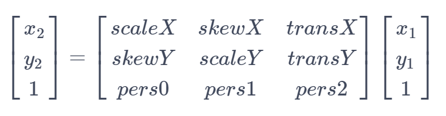
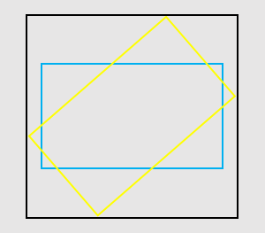

# Class (Matrix)

<!--Kit: ArkGraphics 2D-->
<!--Subsystem: Graphics-->
<!--Owner: @dreamyhhh-->
<!--Designer: @wanyanglan-->
<!--Tester: @nobuggers-->
<!--Adviser: @ge-yafang-->

矩阵对象，用于图形的坐标变换，支持平移、旋转、缩放和倾斜等变换操作。通过矩阵变换可实现不同坐标系之间的映射，广泛应用于图形绘制、图像处理和动画等场景。

表示为3×3的矩阵，如下图所示：


矩阵中的元素从左到右，从上到下分别表示水平缩放因子、水平倾斜系数、水平位移系数、垂直倾斜系数、垂直缩放因子、垂直位移系数、x轴透视系数、y轴透视系数、透视缩放因子。

设(x<sub>1</sub>, y<sub>1</sub>)为源坐标点，(x<sub>2</sub>, y<sub>2</sub>)为源坐标点通过矩阵变换后的坐标点，则两个坐标点的关系如下：




> **说明：**
>
> - 本模块首批接口从API version 11开始支持。后续版本的新增接口，采用上角标单独标记接口的起始版本。
>
> - 本Class首批接口从API version 12开始支持。
>
> - 本模块使用屏幕物理像素单位px。
>
> - 本模块为单线程模型策略，需要调用方自行管理线程安全和上下文状态的切换。

## 导入模块

```ts
import { drawing } from '@kit.ArkGraphics2D';
```

## constructor<sup>12+</sup>

constructor()

构造一个矩阵对象。

**系统能力：** SystemCapability.Graphics.Drawing

**示例：**

```ts
import { drawing } from '@kit.ArkGraphics2D';

let matrix = new drawing.Matrix();
```

## constructor<sup>20+</sup>

constructor(matrix: Matrix)

拷贝一个矩阵。

**系统能力：** SystemCapability.Graphics.Drawing

**参数：**

| 参数名         | 类型                                       | 必填   | 说明                  |
| ----------- | ---------------------------------------- | ---- | ------------------- |
| matrix      | [Matrix](arkts-apis-graphics-drawing-Matrix.md)                  | 是    | 被拷贝的矩阵。|

**示例：**

```ts
import { drawing } from '@kit.ArkGraphics2D';

let matrix = new drawing.Matrix();
let matrix2 = new drawing.Matrix(matrix);
```

## isAffine<sup>20+</sup>

isAffine(): boolean

判断当前矩阵是否为仿射矩阵。仿射矩阵是一种包括平移、旋转、缩放等变换的矩阵。

**系统能力：** SystemCapability.Graphics.Drawing

**返回值：**

| 类型                        | 说明                  |
| --------------------------- | -------------------- |
| boolean | 返回当前矩阵是否为仿射矩阵。true表示是仿射矩阵，false表示不是仿射矩阵。 |

**示例：**

```ts
import { drawing } from '@kit.ArkGraphics2D';

let matrix = new drawing.Matrix();
matrix.setMatrix([1, 0.5, 1, 0.5, 1, 1, 1, 1, 1]);
let isAffine = matrix.isAffine();
console.info('isAffine :', isAffine);
```

## rectStaysRect<sup>20+</sup>

rectStaysRect(): boolean

判断经过该矩阵映射后的矩形的形状是否仍为矩形。

**系统能力：** SystemCapability.Graphics.Drawing

**返回值：**

| 类型                        | 说明                  |
| --------------------------- | -------------------- |
| boolean | 返回经过该矩阵映射后的矩形的形状是否仍为矩形。true表示仍是矩形，false表示不是矩形。 |

**示例：**

```ts
import { drawing } from '@kit.ArkGraphics2D';

let matrix = new drawing.Matrix();
matrix.setMatrix([1, 0.5, 1, 0.5, 1, 1, 1, 1, 1]);
let matrix2 = new drawing.Matrix(matrix);
let isRect = matrix2.rectStaysRect();
console.info('isRect :', isRect);
```

## setSkew<sup>20+</sup>

setSkew(kx: number, ky: number, px: number, py: number): void

设置矩阵为单位矩阵，并围绕倾斜中心点(px, py)按(kx, ky)进行倾斜变换。与[setRotation](#setrotation12)、[setScale](#setscale12)、[setTranslation](#settranslation12)类似，均为重置矩阵后施加单一变换。

**系统能力：** SystemCapability.Graphics.Drawing

**参数：**

| 参数名         | 类型                                       | 必填   | 说明                       |
| ----------- | ---------------------------------------- | ---- | -------------------             |
| kx          | number                  | 是    | x轴上的倾斜量，该参数为浮点数。正值会使绘制沿y轴增量方向向右倾斜；负值会使绘制沿y轴增量方向向左倾斜。        |
| ky          | number                  | 是    | y轴上的倾斜量，该参数为浮点数。正值会使绘制沿x轴增量方向向下倾斜；负值会使绘制沿x轴增量方向向上倾斜。        |
| px          | number                  | 是    | 倾斜中心点的x轴坐标，该参数为浮点数。0表示坐标原点，正数表示位于坐标原点右侧，负数表示位于坐标原点左侧。单位为物理像素px。     |
| py          | number                  | 是    | 倾斜中心点的y轴坐标，该参数为浮点数。0表示坐标原点，正数表示位于坐标原点下侧，负数表示位于坐标原点上侧。单位为物理像素px。     |

**示例：**

```ts
import { drawing } from '@kit.ArkGraphics2D';

let matrix = new drawing.Matrix();
matrix.setMatrix([1, 0.5, 1, 0.5, 1, 1, 1, 1, 1]);
matrix.setSkew(2, 0.5, 0.5, 2);
```

## setSinCos<sup>20+</sup>

setSinCos(sinValue: number, cosValue: number, px: number, py: number): void

设置矩阵为单位矩阵，使其围绕旋转中心点(px, py)以指定的正弦值和余弦值旋转。与[setRotation](#setrotation12)功能类似，但setRotation直接传入角度值，而本方法传入正弦值和余弦值。

**系统能力：** SystemCapability.Graphics.Drawing

**参数：**

| 参数名         | 类型                                       | 必填   | 说明            |
| ----------- | ---------------------------------------- | ---- | ------------------- |
| sinValue          | number                  | 是    | 旋转角度的正弦值。仅当正弦值和余弦值的平方和为1时，为旋转变换，否则矩阵可能包含平移缩放等其他变换。          |
| cosValue          | number                  | 是    | 旋转角度的余弦值。仅当正弦值和余弦值的平方和为1时，为旋转变换，否则矩阵可能包含平移缩放等其他变换。            |
| px          | number                  | 是    | 旋转中心的x轴坐标，该参数为浮点数。0表示坐标原点，正数表示位于坐标原点右侧，负数表示位于坐标原点左侧。单位为物理像素px。     |
| py          | number                  | 是    | 旋转中心的y轴坐标，该参数为浮点数。0表示坐标原点，正数表示位于坐标原点下侧，负数表示位于坐标原点上侧。单位为物理像素px。    |

**示例：**

```ts
import { drawing } from '@kit.ArkGraphics2D';

let matrix = new drawing.Matrix();
matrix.setMatrix([1, 0.5, 1, 0.5, 1, 1, 1, 1, 1]);
matrix.setSinCos(0, 1, 1, 0);
```
## setRotation<sup>12+</sup>

setRotation(degree: number, px: number, py: number): void

设置矩阵为单位矩阵，并围绕旋转中心点(px, py)进行旋转。

**系统能力：** SystemCapability.Graphics.Drawing

**参数：**

| 参数名         | 类型                                       | 必填   | 说明                  |
| ----------- | ---------------------------------------- | ---- | ------------------- |
| degree      | number                  | 是    | 角度，单位为度。正数表示顺时针旋转，负数表示逆时针旋转，该参数为浮点数。|
| px          | number                  | 是    | 旋转中心点的x轴坐标，该参数为浮点数。单位为物理像素px。     |
| py          | number                  | 是    | 旋转中心点的y轴坐标，该参数为浮点数。单位为物理像素px。     |

**错误码：**

以下错误码的详细介绍请参见[通用错误码](../errorcode-universal.md)。

| 错误码ID | 错误信息 |
| ------- | --------------------------------------------|
| 401 | Parameter error.Possible causes:1.Mandatory parameters are left unspecified;2.Incorrect parameter types. |

**示例：**

```ts
import { drawing } from '@kit.ArkGraphics2D';

let matrix = new drawing.Matrix();
matrix.setRotation(90, 100, 100);
```

## setScale<sup>12+</sup>

setScale(sx: number, sy: number, px: number, py: number): void

设置矩阵为单位矩阵，并围绕缩放中心点(px, py)按sx和sy进行缩放。

**系统能力：** SystemCapability.Graphics.Drawing

**参数：**

| 参数名         | 类型                                       | 必填   | 说明                  |
| ----------- | ---------------------------------------- | ---- | ------------------- |
| sx          | number                  | 是    | x轴方向缩放因子，为负数时可看作是先关于x = px作镜像翻转后再进行缩放，该参数为浮点数。     |
| sy          | number                  | 是    | y轴方向缩放因子，为负数时可看作是先关于y = py作镜像翻转后再进行缩放，该参数为浮点数。     |
| px          | number                  | 是    | 缩放中心点的x轴坐标，该参数为浮点数。单位为物理像素px。      |
| py          | number                  | 是    | 缩放中心点的y轴坐标，该参数为浮点数。单位为物理像素px。      |

**错误码：**

以下错误码的详细介绍请参见[通用错误码](../errorcode-universal.md)。

| 错误码ID | 错误信息 |
| ------- | --------------------------------------------|
| 401 | Parameter error.Possible causes:1.Mandatory parameters are left unspecified;2.Incorrect parameter types. |

**示例：**

```ts
import { drawing } from '@kit.ArkGraphics2D';

let matrix = new drawing.Matrix();
matrix.setScale(100, 100, 150, 150);
```

## setTranslation<sup>12+</sup>

setTranslation(dx: number, dy: number): void

设置矩阵为单位矩阵，并平移(dx, dy)。

**系统能力：** SystemCapability.Graphics.Drawing

**参数：**

| 参数名         | 类型                                       | 必填   | 说明                  |
| ----------- | ---------------------------------------- | ---- | ------------------- |
| dx          | number                  | 是    | x轴方向平移距离，正数表示往x轴正方向平移，负数表示往x轴负方向平移，该参数为浮点数。单位为物理像素px。     |
| dy          | number                  | 是    | y轴方向平移距离，正数表示往y轴正方向平移，负数表示往y轴负方向平移，该参数为浮点数。单位为物理像素px。     |

**错误码：**

以下错误码的详细介绍请参见[通用错误码](../errorcode-universal.md)。

| 错误码ID | 错误信息 |
| ------- | --------------------------------------------|
| 401 | Parameter error.Possible causes:1.Mandatory parameters are left unspecified;2.Incorrect parameter types. |

**示例：**

```ts
import { drawing } from '@kit.ArkGraphics2D';

let matrix = new drawing.Matrix();
matrix.setTranslation(100, 100);
```

## setMatrix<sup>12+</sup>

setMatrix(values: Array\<number>): void

设置矩阵对象的各项参数。

**系统能力：** SystemCapability.Graphics.Drawing

**参数：**

| 参数名 | 类型                                                 | 必填 | 说明             |
| ------ | ---------------------------------------------------- | ---- | ---------------- |
| values  | Array\<number> | 是   | 长度为9的浮点数组，表示矩阵对象的各项参数。数组中的值按下标从小到大分别表示水平缩放因子、水平倾斜系数、水平位移系数（单位为物理像素px）、垂直倾斜系数、垂直缩放因子、垂直位移系数（单位为物理像素px）、x轴透视系数、y轴透视系数、透视缩放因子。 |

**错误码：**

以下错误码的详细介绍请参见[通用错误码](../errorcode-universal.md)。

| 错误码ID | 错误信息 |
| ------- | --------------------------------------------|
| 401 | Parameter error.Possible causes:1.Mandatory parameters are left unspecified;2.Incorrect parameter types; 3. Parameter verification failed. |

**示例：**

```ts
import { drawing } from '@kit.ArkGraphics2D';

let matrix = new drawing.Matrix();
let value : Array<number> = [2, 2, 2, 2, 2, 2, 2, 2, 2];
matrix.setMatrix(value);
```

## preConcat<sup>12+</sup>

preConcat(matrix: Matrix): void

将当前矩阵左乘一个矩阵，即新的变换在当前矩阵的变换之前应用。如果需要在当前矩阵的变换之后应用新变换，使用postConcat方法。

**系统能力：** SystemCapability.Graphics.Drawing

**参数：**

| 参数名 | 类型                                                 | 必填 | 说明             |
| ------ | ---------------------------------------------------- | ---- | ---------------- |
| matrix  | [Matrix](arkts-apis-graphics-drawing-Matrix.md) | 是   | 表示矩阵对象，位于乘法表达式右侧。 |

**错误码：**

以下错误码的详细介绍请参见[通用错误码](../errorcode-universal.md)。

| 错误码ID | 错误信息 |
| ------- | --------------------------------------------|
| 401 | Parameter error.Possible causes:1.Mandatory parameters are left unspecified;2.Incorrect parameter types. |

**示例：**

```ts
import { drawing } from '@kit.ArkGraphics2D';

let matrix1 = new drawing.Matrix();
matrix1.setMatrix([2, 1, 3, 1, 2, 1, 3, 1, 2]);
let matrix2 = new drawing.Matrix();
matrix2.setMatrix([-2, 1, 3, 1, 0, -1, 3, -1, 2]);
matrix1.preConcat(matrix2);
```

## setMatrix<sup>20+</sup>

setMatrix(matrix: Array\<number\> \| Matrix): void

用一个矩阵对当前矩阵进行更新。

**系统能力：** SystemCapability.Graphics.Drawing

**参数：**

| 参数名 | 类型                                                 | 必填 | 说明             |
| ------ | ---------------------------------------------------- | ---- | ---------------- |
| matrix | Array\<number\> \| [Matrix](arkts-apis-graphics-drawing-Matrix.md) | 是   | 用于更新的数组或矩阵。当类型为数组时，长度固定为9。 |

**示例：**

```ts
import { drawing } from '@kit.ArkGraphics2D';

let matrix1 = new drawing.Matrix();
matrix1.setMatrix([2, 1, 3, 1, 2, 1, 3, 1, 2]);
let matrix2 = new drawing.Matrix();
matrix1.setMatrix(matrix2);
```

## setConcat<sup>20+</sup>

setConcat(matrixA: Matrix, matrixB: Matrix): void

用两个矩阵的乘积更新当前矩阵，即当前矩阵 = matrixA × matrixB。

**系统能力：** SystemCapability.Graphics.Drawing

**参数：**

| 参数名 | 类型                                                 | 必填 | 说明             |
| ------ | ---------------------------------------------------- | ---- | ---------------- |
| matrixA  | [Matrix](arkts-apis-graphics-drawing-Matrix.md) | 是   | 用于运算的矩阵A，位于乘法表达式左侧。 |
| matrixB  | [Matrix](arkts-apis-graphics-drawing-Matrix.md) | 是   | 用于运算的矩阵B，位于乘法表达式右侧。 |

**示例：**

```ts
import { drawing } from '@kit.ArkGraphics2D';

let matrix1 = new drawing.Matrix();
matrix1.setMatrix([2, 1, 3, 1, 2, 1, 3, 1, 2]);
let matrix2 = new drawing.Matrix();
matrix2.setMatrix([-2, 1, 3, 1, 0, -1, 3, -1, 2]);
matrix1.setConcat(matrix2, matrix1);
```

## postConcat<sup>20+</sup>

postConcat(matrix: Matrix): void

将当前矩阵右乘一个矩阵，即新的变换在当前矩阵的变换之后应用。如果需要在当前矩阵的变换之前应用新变换，使用preConcat方法。

**系统能力：** SystemCapability.Graphics.Drawing

**参数：**

| 参数名 | 类型                                                 | 必填 | 说明             |
| ------ | ---------------------------------------------------- | ---- | ---------------- |
| matrix | [Matrix](arkts-apis-graphics-drawing-Matrix.md) | 是   | 表示用于右乘的矩阵，位于乘法表达式左侧。 |

**示例：**

```ts
import { drawing } from '@kit.ArkGraphics2D';

let matrix1 = new drawing.Matrix();
matrix1.setMatrix([2, 1, 3, 1, 2, 1, 3, 1, 2]);
let matrix2 = new drawing.Matrix();
matrix2.setMatrix([-2, 1, 3, 1, 0, -1, 3, -1, 2]);
matrix1.postConcat(matrix2);
```

## isEqual<sup>12+</sup>

isEqual(matrix: Matrix): boolean

判断两个矩阵是否相等。

**系统能力：** SystemCapability.Graphics.Drawing

**参数：**

| 参数名 | 类型                                                 | 必填 | 说明             |
| ------ | ---------------------------------------------------- | ---- | ---------------- |
| matrix  | [Matrix](arkts-apis-graphics-drawing-Matrix.md) | 是   | 另一个矩阵，用于与当前矩阵比较是否相等。 |

**错误码：**

以下错误码的详细介绍请参见[通用错误码](../errorcode-universal.md)。

| 错误码ID | 错误信息 |
| ------- | --------------------------------------------|
| 401 | Parameter error.Possible causes:1.Mandatory parameters are left unspecified;2.Incorrect parameter types. |

**返回值：**

| 类型                        | 说明                  |
| --------------------------- | -------------------- |
| boolean | 返回两个矩阵的比较结果。true表示两个矩阵相等，false表示两个矩阵不相等。 |

**示例：**

```ts
import { drawing } from '@kit.ArkGraphics2D';

let matrix1 = new drawing.Matrix();
matrix1.setMatrix([2, 1, 3, 1, 2, 1, 3, 1, 2]);
let matrix2 = new drawing.Matrix();
matrix2.setMatrix([-2, 1, 3, 1, 0, -1, 3, -1, 2]);
if (matrix1.isEqual(matrix2)) {
  console.info("matrix1 and matrix2 are equal.");
} else {
  console.info("matrix1 and matrix2 are not equal.");
}
```

## invert<sup>12+</sup>

invert(matrix: Matrix): boolean

将矩阵matrix设置为当前矩阵的逆矩阵，并返回是否设置成功的结果。

**系统能力：** SystemCapability.Graphics.Drawing

**参数：**

| 参数名 | 类型                                                 | 必填 | 说明             |
| ------ | ---------------------------------------------------- | ---- | ---------------- |
| matrix  | [Matrix](arkts-apis-graphics-drawing-Matrix.md) | 是   | 矩阵对象，用于存储获取到的逆矩阵。 |

**错误码：**

以下错误码的详细介绍请参见[通用错误码](../errorcode-universal.md)。

| 错误码ID | 错误信息 |
| ------- | --------------------------------------------|
| 401 | Parameter error.Possible causes:1.Mandatory parameters are left unspecified;2.Incorrect parameter types. |

**返回值：**

| 类型                        | 说明                  |
| --------------------------- | -------------------- |
| boolean | 返回matrix是否被设置为逆矩阵的结果。true表示当前矩阵可逆，matrix被设置为逆矩阵，false表示当前矩阵不可逆，matrix不被设置。 |

**示例：**

```ts
import { drawing } from '@kit.ArkGraphics2D';

let matrix1 = new drawing.Matrix();
matrix1.setMatrix([2, 1, 3, 1, 2, 1, 3, 1, 2]);
let matrix2 = new drawing.Matrix();
matrix2.setMatrix([-2, 1, 3, 1, 0, -1, 3, -1, 2]);
if (matrix1.invert(matrix2)) {
  console.info("matrix1 is invertible and matrix2 is set as an inverse matrix of the matrix1.");
} else {
  console.info("matrix1 is not invertible and matrix2 is not changed.");
}
```

## isIdentity<sup>12+</sup>

isIdentity(): boolean

判断矩阵是否是单位矩阵。

**系统能力：** SystemCapability.Graphics.Drawing

**返回值：**

| 类型                        | 说明                  |
| --------------------------- | -------------------- |
| boolean | 返回矩阵是否是单位矩阵。true表示矩阵是单位矩阵，false表示矩阵不是单位矩阵。 |

**示例：**

```ts
import { drawing } from '@kit.ArkGraphics2D';

let matrix = new drawing.Matrix();
if (matrix.isIdentity()) {
  console.info("matrix is identity.");
} else {
  console.info("matrix is not identity.");
}
```

## getValue<sup>12+</sup>

getValue(index: number): number

获取矩阵给定索引位的值。索引范围0-8。

**系统能力：** SystemCapability.Graphics.Drawing

**参数：**

| 参数名          | 类型    | 必填 | 说明                                                        |
| --------------- | ------- | ---- | ----------------------------------------------------------- |
| index | number | 是   | 索引位置，范围0-8，该参数为整数。 |

**返回值：**

| 类型                  | 说明           |
| --------------------- | -------------- |
| number | 函数返回矩阵给定索引位对应的值，该返回值为浮点数。 |

**错误码：**

以下错误码的详细介绍请参见[通用错误码](../errorcode-universal.md)。

| 错误码ID | 错误信息 |
| ------- | --------------------------------------------|
| 401 | Parameter error. Possible causes: 1. Mandatory parameters are left unspecified;2. Incorrect parameter types;3. Parameter verification failed.|

**示例：**

```ts
import { drawing } from "@kit.ArkGraphics2D";

let matrix = new drawing.Matrix();
for (let i = 0; i < 9; i++) {
    console.info("matrix "+matrix.getValue(i).toString());
}
```

## postRotate<sup>12+</sup>

postRotate(degree: number, px: number, py: number): void

将当前矩阵右乘一个围绕旋转中心点旋转degree指定角度的矩阵，即新的旋转变换在当前矩阵的变换之后应用。如果需要在当前矩阵的变换之前应用旋转变换，使用preRotate方法。

**系统能力：** SystemCapability.Graphics.Drawing

**参数：**

| 参数名          | 类型    | 必填 | 说明                                                        |
| --------------- | ------- | ---- | ----------------------------------------------------------- |
| degree | number | 是   | 旋转角度，单位为度。正数表示顺时针旋转，负数表示逆时针旋转，该参数为浮点数。 |
| px | number | 是   | 旋转中心点的x轴坐标，该参数为浮点数。单位为物理像素px。 |
| py | number | 是   | 旋转中心点的y轴坐标，该参数为浮点数。单位为物理像素px。 |

**错误码：**

以下错误码的详细介绍请参见[通用错误码](../errorcode-universal.md)。

| 错误码ID | 错误信息 |
| ------- | --------------------------------------------|
| 401 | Parameter error.Possible causes:1.Mandatory parameters are left unspecified;2.Incorrect parameter types. |

**示例：**

```ts
import { drawing } from "@kit.ArkGraphics2D";

let matrix = new drawing.Matrix();
let degree: number = 2;
let px: number = 3;
let py: number = 4;
matrix.postRotate(degree, px, py);
console.info("matrix= "+matrix.getAll().toString());
```

## postScale<sup>12+</sup>

postScale(sx: number, sy: number, px: number, py: number): void

将当前矩阵右乘一个围绕缩放中心点按sx和sy指定缩放因子缩放的矩阵，即新的缩放变换在当前矩阵的变换之后应用。如果需要在当前矩阵的变换之前应用缩放变换，使用preScale方法。

**系统能力：** SystemCapability.Graphics.Drawing

**参数：**

| 参数名          | 类型    | 必填 | 说明                                                        |
| --------------- | ------- | ---- | ----------------------------------------------------------- |
| sx | number | 是   | x轴方向缩放因子，负数表示先关于x = px作镜像翻转后再进行缩放，该参数为浮点数。 |
| sy | number | 是   | y轴方向缩放因子，负数表示先关于y = py作镜像翻转后再进行缩放，该参数为浮点数。 |
| px | number | 是   | 缩放中心点的x轴坐标，该参数为浮点数。单位为物理像素px。 |
| py | number | 是   | 缩放中心点的y轴坐标，该参数为浮点数。单位为物理像素px。 |

**错误码：**

以下错误码的详细介绍请参见[通用错误码](../errorcode-universal.md)。

| 错误码ID | 错误信息 |
| ------- | --------------------------------------------|
| 401 | Parameter error.Possible causes:1.Mandatory parameters are left unspecified;2.Incorrect parameter types. |

**示例：**

```ts
import { drawing } from "@kit.ArkGraphics2D";

let matrix = new drawing.Matrix();
let sx: number = 2;
let sy: number = 0.5;
let px: number = 1;
let py: number = 1;
matrix.postScale(sx, sy, px, py);
console.info("matrix= "+matrix.getAll().toString());
```

## postTranslate<sup>12+</sup>

postTranslate(dx: number, dy: number): void

将当前矩阵右乘一个平移dx和dy指定距离的矩阵，即新的平移变换在当前矩阵的变换之后应用。如果需要在当前矩阵的变换之前应用平移变换，使用preTranslate方法。

**系统能力：** SystemCapability.Graphics.Drawing

**参数：**

| 参数名          | 类型    | 必填 | 说明                                                        |
| --------------- | ------- | ---- | ----------------------------------------------------------- |
| dx | number | 是   | x轴方向平移距离，正数表示往x轴正方向平移，负数表示往x轴负方向平移，该参数为浮点数。单位为物理像素px。 |
| dy | number | 是   | y轴方向平移距离，正数表示往y轴正方向平移，负数表示往y轴负方向平移，该参数为浮点数。单位为物理像素px。 |

**错误码：**

以下错误码的详细介绍请参见[通用错误码](../errorcode-universal.md)。

| 错误码ID | 错误信息 |
| ------- | --------------------------------------------|
| 401 | Parameter error.Possible causes:1.Mandatory parameters are left unspecified;2.Incorrect parameter types. |

**示例：**

```ts
import { drawing } from "@kit.ArkGraphics2D";

let matrix = new drawing.Matrix();
let dx: number = 3;
let dy: number = 4;
matrix.postTranslate(dx, dy);
console.info("matrix= "+matrix.getAll().toString());
```

## preRotate<sup>12+</sup>

preRotate(degree: number, px: number, py: number): void

将当前矩阵左乘一个围绕旋转中心点旋转degree指定角度的矩阵，即新的旋转变换在当前矩阵的变换之前应用。如果需要在当前矩阵的变换之后应用旋转变换，使用postRotate方法。

**系统能力：** SystemCapability.Graphics.Drawing

**参数：**

| 参数名          | 类型    | 必填 | 说明                                                        |
| --------------- | ------- | ---- | ----------------------------------------------------------- |
| degree | number | 是   | 旋转角度，单位为度。正数表示顺时针旋转，负数表示逆时针旋转，该参数为浮点数。 |
| px | number | 是   | 旋转中心点的x轴坐标，该参数为浮点数。单位为物理像素px。 |
| py | number | 是   | 旋转中心点的y轴坐标，该参数为浮点数。单位为物理像素px。 |

**错误码：**

以下错误码的详细介绍请参见[通用错误码](../errorcode-universal.md)。

| 错误码ID | 错误信息 |
| ------- | --------------------------------------------|
| 401 | Parameter error.Possible causes:1.Mandatory parameters are left unspecified;2.Incorrect parameter types. |

**示例：**

```ts
import { drawing } from "@kit.ArkGraphics2D";

let matrix = new drawing.Matrix();
let degree: number = 2;
let px: number = 3;
let py: number = 4;
matrix.preRotate(degree, px, py);
console.info("matrix= "+matrix.getAll().toString());
```

## postSkew<sup>20+</sup>

postSkew(kx: number, ky: number, px: number, py: number): void

当前矩阵右乘一个倾斜变换矩阵。

**系统能力：** SystemCapability.Graphics.Drawing

**参数：**

| 参数名         | 类型                                       | 必填   | 说明             |
| ----------- | ---------------------------------------- | ---- | -------------------   |
| kx          | number                  | 是    | x轴上的倾斜量，该参数为浮点数。正值会使绘制沿y轴增量方向向右倾斜；负值会使绘制沿y轴增量方向向左倾斜。           |
| ky          | number                  | 是    | y轴上的倾斜量，该参数为浮点数。正值会使绘制沿x轴增量方向向下倾斜；负值会使绘制沿x轴增量方向向上倾斜。           |
| px          | number                  | 是    | 倾斜中心点的x轴坐标，该参数为浮点数。0表示坐标原点，正数表示位于坐标原点右侧，负数表示位于坐标原点左侧。单位为物理像素px。    |
| py          | number                  | 是    | 倾斜中心点的y轴坐标，该参数为浮点数。0表示坐标原点，正数表示位于坐标原点下侧，负数表示位于坐标原点上侧。单位为物理像素px。   |

**示例：**

```ts
import { drawing } from "@kit.ArkGraphics2D";

let matrix = new drawing.Matrix();
matrix.postSkew(2.0, 1.0, 2.0, 1.0);
```

## preSkew<sup>20+</sup>

preSkew(kx: number, ky: number, px: number, py: number): void

当前矩阵左乘一个倾斜变换矩阵。

**系统能力：** SystemCapability.Graphics.Drawing

**参数：**

| 参数名         | 类型                                       | 必填   | 说明             |
| ----------- | ---------------------------------------- | ---- | -------------------   |
| kx          | number                  | 是    | x轴上的倾斜量，该参数为浮点数。正值会使绘制沿y轴增量方向向右倾斜；负值会使绘制沿y轴增量方向向左倾斜。           |
| ky          | number                  | 是    | y轴上的倾斜量，该参数为浮点数。正值会使绘制沿x轴增量方向向下倾斜；负值会使绘制沿x轴增量方向向上倾斜。           |
| px          | number                  | 是    | 倾斜中心点的x轴坐标，该参数为浮点数。0表示坐标原点，正数表示位于坐标原点右侧，负数表示位于坐标原点左侧。单位为物理像素px。        |
| py          | number                  | 是    | 倾斜中心点的y轴坐标，该参数为浮点数。0表示坐标原点，正数表示位于坐标原点下侧，负数表示位于坐标原点上侧。单位为物理像素px。        |

**示例：**

```ts
import { drawing } from "@kit.ArkGraphics2D";

let matrix = new drawing.Matrix();
matrix.preSkew(2.0, 1.0, 2.0, 1.0);
```

## mapRadius<sup>20+</sup>

mapRadius(radius: number): number

返回半径为radius的圆经过当前矩阵映射形成的椭圆的平均半径。平均半径的平方为椭圆长轴长度和短轴长度的乘积。若当前矩阵包含透视变换，则该结果无意义。

**系统能力：** SystemCapability.Graphics.Drawing

**参数：**

| 参数名 | 类型                                                 | 必填 | 说明             |
| ------ | ---------------------------------------------------- | ---- | ---------------- |
| radius  | number | 是   | 用于计算的圆的半径，浮点数。如果是负数，则按照绝对值进行计算。单位为物理像素px。 |

**返回值：**

| 类型                        | 说明                  |
| --------------------------- | -------------------- |
| number | 返回经过变换之后的平均半径。单位为物理像素px。 |

**示例：**

```ts
import { drawing } from "@kit.ArkGraphics2D";

let matrix = new drawing.Matrix();
matrix.setMatrix([2, 1, 3, 1, 2, 1, 3, 1, 2]);
let radius = matrix.mapRadius(10);
console.info('radius', radius);
```

## preScale<sup>12+</sup>

preScale(sx: number, sy: number, px: number, py: number): void

将当前矩阵左乘一个围绕缩放中心点按sx和sy指定缩放因子缩放的矩阵，即新的缩放变换在当前矩阵的变换之前应用。如果需要在当前矩阵的变换之后应用缩放变换，使用postScale方法。

**系统能力：** SystemCapability.Graphics.Drawing

**参数：**

| 参数名          | 类型    | 必填 | 说明                                                        |
| --------------- | ------- | ---- | ----------------------------------------------------------- |
| sx | number | 是   | x轴方向缩放因子，为负数时可看作是先关于x = px作镜像翻转后再进行缩放，该参数为浮点数。 |
| sy | number | 是   | y轴方向缩放因子，为负数时可看作是先关于y = py作镜像翻转后再进行缩放，该参数为浮点数。 |
| px | number | 是   | 缩放中心点的x轴坐标，该参数为浮点数。单位为物理像素px。 |
| py | number | 是   | 缩放中心点的y轴坐标，该参数为浮点数。单位为物理像素px。 |

**错误码：**

以下错误码的详细介绍请参见[通用错误码](../errorcode-universal.md)。

| 错误码ID | 错误信息 |
| ------- | --------------------------------------------|
| 401 | Parameter error.Possible causes:1.Mandatory parameters are left unspecified;2.Incorrect parameter types. |

**示例：**

```ts
import { drawing } from "@kit.ArkGraphics2D";

let matrix = new drawing.Matrix();
let sx: number = 2;
let sy: number = 0.5;
let px: number = 1;
let py: number = 1;
matrix.preScale(sx, sy, px, py);
console.info("matrix"+matrix.getAll().toString());
```

## preTranslate<sup>12+</sup>

preTranslate(dx: number, dy: number): void

将当前矩阵左乘一个平移dx和dy指定距离的矩阵，即新的平移变换在当前矩阵的变换之前应用。如果需要在当前矩阵的变换之后应用平移变换，使用postTranslate方法。

**系统能力：** SystemCapability.Graphics.Drawing

**参数：**

| 参数名          | 类型    | 必填 | 说明                                                        |
| --------------- | ------- | ---- | ----------------------------------------------------------- |
| dx | number | 是   | x轴方向平移距离，正数表示往x轴正方向平移，负数表示往x轴负方向平移，该参数为浮点数。单位为物理像素px。 |
| dy | number | 是   | y轴方向平移距离，正数表示往y轴正方向平移，负数表示往y轴负方向平移，该参数为浮点数。单位为物理像素px。 |

**错误码：**

以下错误码的详细介绍请参见[通用错误码](../errorcode-universal.md)。

| 错误码ID | 错误信息 |
| ------- | --------------------------------------------|
| 401 | Parameter error.Possible causes:1.Mandatory parameters are left unspecified;2.Incorrect parameter types. |

**示例：**

```ts
import { drawing } from "@kit.ArkGraphics2D";

let matrix = new drawing.Matrix();
let dx: number = 3;
let dy: number = 4;
matrix.preTranslate(dx, dy);
console.info("matrix"+matrix.getAll().toString());
```

## reset<sup>12+</sup>

reset(): void

重置当前矩阵为单位矩阵。

**系统能力：** SystemCapability.Graphics.Drawing

**示例：**

```ts
import { drawing } from "@kit.ArkGraphics2D";

let matrix = new drawing.Matrix();
matrix.postScale(2, 3, 4, 5);
matrix.reset();
console.info("matrix= "+matrix.getAll().toString());
```

## mapPoints<sup>12+</sup>

mapPoints(src: Array\<common2D.Point>): Array\<common2D.Point>

通过矩阵变换将源点数组映射到目标点数组。

**系统能力：** SystemCapability.Graphics.Drawing

**参数：**

| 参数名          | 类型    | 必填 | 说明                                                        |
| --------------- | ------- | ---- | ----------------------------------------------------------- |
| src | Array\<[common2D.Point](js-apis-graphics-common2D.md#point12)> | 是   | 源点数组，作为矩阵变换的输入点。 |

**返回值：**

| 类型                  | 说明           |
| --------------------- | -------------- |
| Array\<[common2D.Point](js-apis-graphics-common2D.md#point12)> | 源点数组经矩阵变换后的点数组。 |

**错误码：**

以下错误码的详细介绍请参见[通用错误码](../errorcode-universal.md)。

| 错误码ID | 错误信息 |
| ------- | --------------------------------------------|
| 401 | Parameter error.Possible causes:1.Mandatory parameters are left unspecified;2.Incorrect parameter types. |

**示例：**

```ts
import { drawing, common2D } from "@kit.ArkGraphics2D";

let src: Array<common2D.Point> = [];
src.push({x: 15, y: 20});
src.push({x: 20, y: 15});
src.push({x: 30, y: 10});
let matrix = new drawing.Matrix();
let dst: Array<common2D.Point> = matrix.mapPoints(src);
console.info("matrix= src: "+JSON.stringify(src));
console.info("matrix= dst: "+JSON.stringify(dst));
```

## getAll<sup>12+</sup>

getAll(): Array\<number>

获取矩阵的所有元素值。

**系统能力：** SystemCapability.Graphics.Drawing

**返回值：**

| 类型                  | 说明           |
| --------------------- | -------------- |
| Array\<number> | 存储矩阵元素值的浮点数组，长度为9。 |

**示例：**

```ts
import { drawing } from "@kit.ArkGraphics2D";

let matrix = new drawing.Matrix();
console.info("matrix "+ matrix.getAll());
```

## mapRect<sup>12+</sup>

mapRect(dst: common2D.Rect, src: common2D.Rect): boolean

将目标矩形设置为源矩形通过矩阵变换后的图形的外接矩形。如下图所示，蓝色矩形为源矩形，假设黄色矩形为源矩形通过矩阵变换形成的图形，此时黄色矩形的边不与坐标轴平行，无法使用矩形对象表示，因此，将目标矩形设置为黄色矩形的外接矩形，即黑色矩形。



**系统能力：** SystemCapability.Graphics.Drawing

**参数：**

| 参数名          | 类型    | 必填 | 说明                                                        |
| --------------- | ------- | ---- | ----------------------------------------------------------- |
| dst | [common2D.Rect](js-apis-graphics-common2D.md#rect) | 是   | 目标矩形对象，用于存储源矩形经矩阵变换后的图形的外接矩形。 |
| src |[common2D.Rect](js-apis-graphics-common2D.md#rect) | 是   | 源矩形对象。 |

**返回值：**

| 类型                  | 说明           |
| --------------------- | -------------- |
| boolean | 返回源矩形经过矩阵变换后的图形是否仍然是矩形，true表示是矩形，false表示不是矩形。 |

**错误码：**

以下错误码的详细介绍请参见[通用错误码](../errorcode-universal.md)。

| 错误码ID | 错误信息 |
| ------- | --------------------------------------------|
| 401 | Parameter error.Possible causes:1.Mandatory parameters are left unspecified;2.Incorrect parameter types. |

**示例：**

```ts
import { drawing, common2D } from "@kit.ArkGraphics2D";

let dst: common2D.Rect = { left: 100, top: 20, right: 130, bottom: 60 };
let src: common2D.Rect = { left: 100, top: 80, right: 130, bottom: 120 };
let matrix = new drawing.Matrix();
if (matrix.mapRect(dst, src)) {
    console.info("matrix= dst "+JSON.stringify(dst));
}
```

## setRectToRect<sup>12+</sup>

setRectToRect(src: common2D.Rect, dst: common2D.Rect, scaleToFit: ScaleToFit): boolean

将当前矩阵设置为能使源矩形映射到目标矩形的变换矩阵。

**系统能力：** SystemCapability.Graphics.Drawing

**参数：**

| 参数名          | 类型    | 必填 | 说明                                                        |
| --------------- | ------- | ---- | ----------------------------------------------------------- |
| src | [common2D.Rect](js-apis-graphics-common2D.md#rect) | 是   | 源矩形，用于指定映射的源区域。 |
| dst | [common2D.Rect](js-apis-graphics-common2D.md#rect) | 是   | 目标矩形，用于指定映射的目标区域。 |
| scaleToFit | [ScaleToFit](arkts-apis-graphics-drawing-e.md#scaletofit12) | 是   | 源矩形到目标矩形的映射方式。 |

**返回值：**

| 类型                  | 说明           |
| --------------------- | -------------- |
| boolean | 返回矩阵是否可以表示矩形之间的映射，true表示可以，false表示不可以。如果源矩形的宽高任意一个小于等于0，则返回false，并将矩阵设置为单位矩阵；如果目标矩形的宽高任意一个小于等于0，则返回true，并将矩阵设置为除透视缩放因子为1外其余值皆为0的矩阵。 |

**错误码：**

以下错误码的详细介绍请参见[通用错误码](../errorcode-universal.md)。

| 错误码ID | 错误信息 |
| ------- | --------------------------------------------|
| 401 | Parameter error.Possible causes:1.Mandatory parameters are left unspecified;2.Incorrect parameter types;3.Parameter verification failed. |

**示例：**

```ts
import { drawing, common2D } from "@kit.ArkGraphics2D";

let src: common2D.Rect = { left: 100, top: 100, right: 300, bottom: 300 };
let dst: common2D.Rect = { left: 200, top: 200, right: 600, bottom: 600 };
let scaleToFit: drawing.ScaleToFit = drawing.ScaleToFit.FILL_SCALE_TO_FIT;
let matrix = new drawing.Matrix();
if (matrix.setRectToRect(src, dst, scaleToFit)) {
    console.info("matrix"+matrix.getAll().toString());
}
```

## setPolyToPoly<sup>12+</sup>

setPolyToPoly(src: Array\<common2D.Point>, dst: Array\<common2D.Point>, count: number): boolean

将当前矩阵设置为能够将源点数组映射到目标点数组的变换矩阵。源点和目标点的个数必须大于等于0，小于等于4。

**系统能力：** SystemCapability.Graphics.Drawing

**参数：**

| 参数名          | 类型    | 必填 | 说明                                                        |
| --------------- | ------- | ---- | ----------------------------------------------------------- |
| src | Array\<[common2D.Point](js-apis-graphics-common2D.md#point12)> | 是   | 源点数组，长度必须为count。 |
| dst | Array\<[common2D.Point](js-apis-graphics-common2D.md#point12)> | 是   | 目标点数组，长度必须为count。 |
| count | number | 是   | src和dst中点的数量，取值范围为[0, 4]，包含0和4，该参数为整数。 |

**返回值：**

| 类型                  | 说明           |
| --------------------- | -------------- |
| boolean | 返回设置矩阵是否成功的结果，true表示设置成功，false表示设置失败。 |

**错误码：**

以下错误码的详细介绍请参见[通用错误码](../errorcode-universal.md)。

| 错误码ID | 错误信息 |
| ------- | --------------------------------------------|
| 401 | Parameter error.Possible causes:1.Mandatory parameters are left unspecified;2.Incorrect parameter types. |

**示例：**

```ts
import { drawing, common2D } from "@kit.ArkGraphics2D";

let srcPoints: Array<common2D.Point> = [ {x: 10, y: 20}, {x: 200, y: 150} ];
let dstPoints: Array<common2D.Point> = [{ x:0, y: 10 }, { x:300, y: 600 }];
let matrix = new drawing.Matrix();
if (matrix.setPolyToPoly(srcPoints, dstPoints, 2)) {
    console.info("matrix"+matrix.getAll().toString());
}
```
